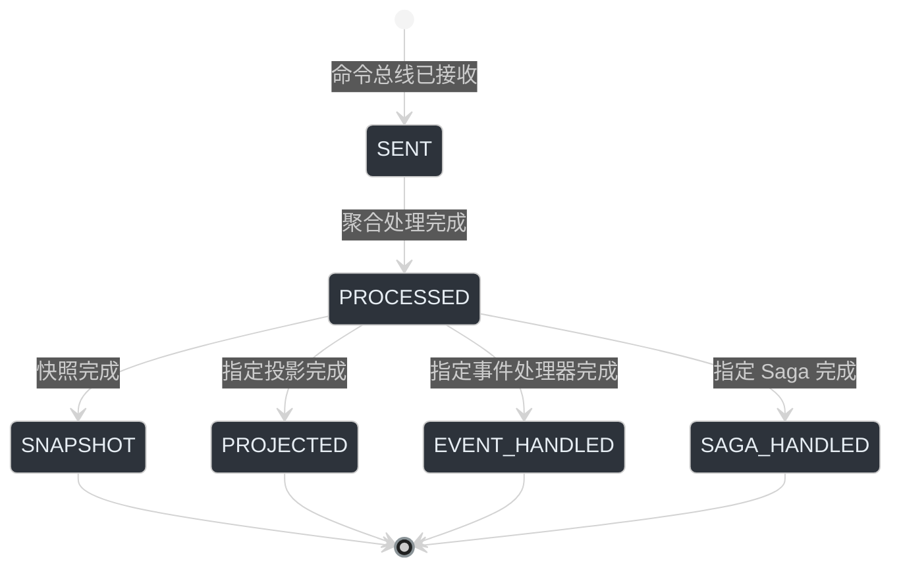
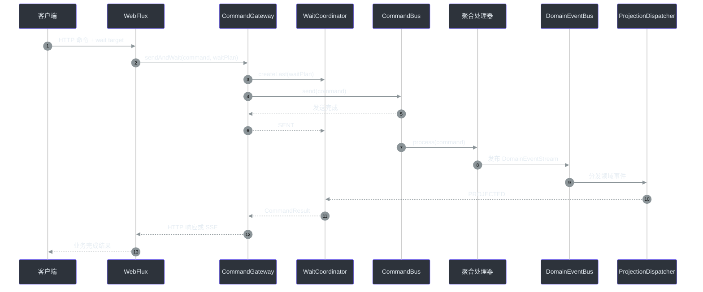
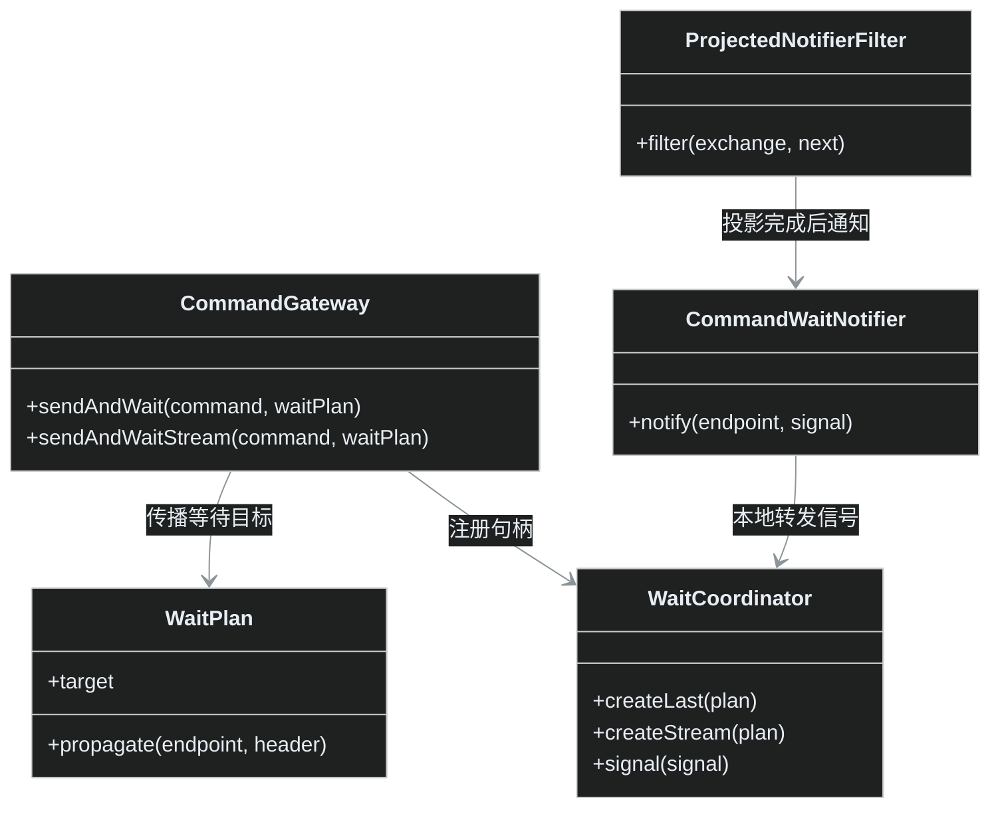
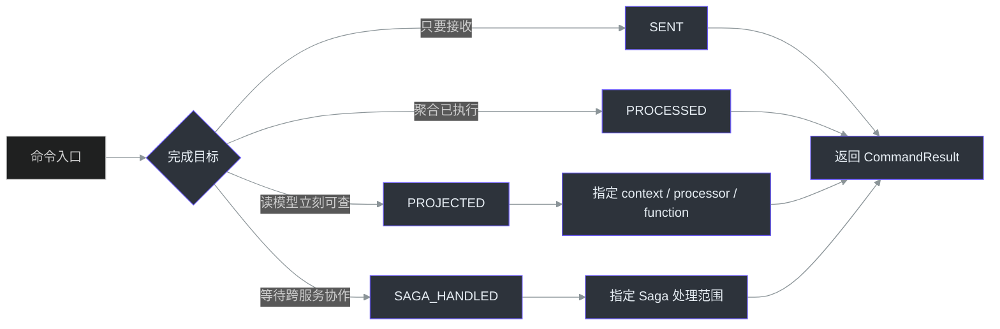

# 接口返回 200，查询却查不到：别再 `sleep(1s)`，理解 Wow 的一致性等待


_配图：命令从入口经过聚合与事件流，最终到达可查询的读模型。_

_在异步系统里，真正重要的不是“接口有没有返回”，而是“返回时系统究竟承诺了什么”。_

> 用户点击“提交订单”，接口返回 200；前端马上跳转订单详情，却得到 404。团队第一反应是给客户端加 `sleep(1000)`，或者失败后再重试几次。
>
> 但问题可能根本不是数据库慢，而是系统把“命令已发出”误认为“业务已完成”。

这不是某个数据库或消息队列的偶发故障，而是 CQRS 读写分离中一个非常容易被忽略的契约问题：**“成功”不是一个状态，而是一组不同的完成语义。**

Wow 没有把这个语义藏在固定延迟里，而是把它显式建模为 `SENT`、`PROCESSED`、`PROJECTED`、`SNAPSHOT`、`EVENT_HANDLED` 和 `SAGA_HANDLED` 等命令处理阶段。调用方可以声明自己究竟要等到哪一个阶段，再让系统返回结果。

## 先回答：HTTP 返回 200，到底意味着什么？

在 Wow 的 WebFlux 命令入口中，请求会先经过 `CommandWaitPolicy` 提取等待计划和超时时间，再由 `CommandHandler` 调用 `CommandGateway.sendAndWait` 或 `sendAndWaitStream`。因此，HTTP 响应的完成语义由请求携带的等待计划决定，并不是所有命令都天然代表“投影已经完成”。

来源：[CommandHandler.sendCommand:49-61](https://github.com/Ahoo-Wang/Wow/blob/main/wow-webflux/src/main/kotlin/me/ahoo/wow/webflux/route/command/CommandHandler.kt#L49-L61)、[CommandWaitPolicy.waitPlan:23-27](https://github.com/Ahoo-Wang/Wow/blob/main/wow-webflux/src/main/kotlin/me/ahoo/wow/webflux/route/policy/CommandWaitPolicy.kt#L23-L27)。

| 等待阶段 | 系统此时能证明什么 | 不能证明什么 | 适合的业务语义 | Source |
|---|---|---|---|---|
| `SENT` | 命令总线已经接受发送 | 聚合尚未必完成处理 | 快速接收、异步任务、无需立即读取结果 | [`CommandGateway.sendAndWaitForSent`](https://github.com/Ahoo-Wang/Wow/blob/main/wow-core/src/main/kotlin/me/ahoo/wow/command/CommandGateway.kt#L128-L142) |
| `PROCESSED` | 聚合已校验并执行命令，相关事件已发布 | 查询模型不一定已经更新 | 需要确认领域操作完成 | [`CommandGateway.sendAndWaitForProcessed`](https://github.com/Ahoo-Wang/Wow/blob/main/wow-core/src/main/kotlin/me/ahoo/wow/command/CommandGateway.kt#L144-L157) |
| `PROJECTED` | 指定的投影处理已完成 | 其他投影或 Saga 不一定完成 | 写入后立即查询同一个读模型 | [`ProjectedNotifierFilter`](https://github.com/Ahoo-Wang/Wow/blob/main/wow-core/src/main/kotlin/me/ahoo/wow/command/wait/NotifierFilters.kt#L84-L94) |
| `SNAPSHOT` | 聚合快照已生成 | 下游读模型不一定完成 | 关心聚合状态检查点 | [`CommandStage`](https://github.com/Ahoo-Wang/Wow/blob/main/wow-core/src/main/kotlin/me/ahoo/wow/command/wait/CommandStage.kt#L46-L54) |
| `EVENT_HANDLED` / `SAGA_HANDLED` | 指定事件处理器或 Saga 已处理事件 | 不代表所有下游副作用都结束 | 需要等待某个下游协作边界 | [`CommandStage`](https://github.com/Ahoo-Wang/Wow/blob/main/wow-core/src/main/kotlin/me/ahoo/wow/command/wait/CommandStage.kt#L66-L86) |

最容易犯的错误，是把 `SENT` 当成 `PROCESSED`，再把 `PROCESSED` 当成 `PROJECTED`。这三个状态之间的差异，正是“接口成功但页面查不到”的根源。

## 不是一条直线，而是多个业务承诺

`CommandStage` 明确声明了各阶段的前置依赖：`PROCESSED` 依赖 `SENT`；而 `SNAPSHOT`、`PROJECTED`、`EVENT_HANDLED` 和 `SAGA_HANDLED` 都共享 `SENT`、`PROCESSED` 两个前置阶段。它们是从聚合处理完成后分叉出的目标，不是每个命令都必须经过的固定流水线。


_配图：`SENT`、`PROCESSED`、`PROJECTED` 是三个不同的完成承诺。_


<!-- Sources: wow-core/src/main/kotlin/me/ahoo/wow/command/wait/CommandStage.kt:25-123, documentation/docs/en/onboarding/contributor-guide.md:641-645 -->

这带来一个重要设计结论：**等待不是越久越好，而是要等待到刚好满足业务承诺的阶段。**

例如：

- “请求已接收，后台慢慢处理”只需要 `SENT`。
- “订单聚合已经接受并执行了支付命令”需要 `PROCESSED`。
- “接口返回后，订单详情页必须能看到新订单”需要目标投影的 `PROJECTED`。
- “下单后库存 Saga 必须已经发出或处理扣减命令”才考虑 `SAGA_HANDLED`。

## 一条命令，究竟经历了什么？

下面是从 HTTP 命令到读模型更新的简化时序。它强调的是等待语义，而不是某个具体存储实现：


<!-- Sources: wow-webflux/src/main/kotlin/me/ahoo/wow/webflux/route/command/CommandHandler.kt:49-61, wow-core/src/main/kotlin/me/ahoo/wow/command/DefaultCommandGateway.kt:238-266, wow-core/src/main/kotlin/me/ahoo/wow/modeling/command/dispatcher/SendDomainEventStreamFilter.kt:25-46, wow-core/src/main/kotlin/me/ahoo/wow/command/wait/NotifierFilters.kt:84-94 -->

源码中的关键顺序是：`DefaultCommandGateway.sendAndWait` 先注册等待句柄，再传播等待计划并发送命令；发送成功后可以产生 `SENT` 信号，后续阶段则由处理链上的 notifier 继续通知。等待句柄由 `WaitCoordinator` 按 `waitCommandId` 管理，收到信号后再交给对应的等待请求。

来源：[DefaultCommandGateway.sendAndWait:238-266](https://github.com/Ahoo-Wang/Wow/blob/main/wow-core/src/main/kotlin/me/ahoo/wow/command/DefaultCommandGateway.kt#L238-L266)、[DefaultCommandGateway.sendWithRegisteredWaitHandle:282-301](https://github.com/Ahoo-Wang/Wow/blob/main/wow-core/src/main/kotlin/me/ahoo/wow/command/DefaultCommandGateway.kt#L282-L301)、[DefaultWaitCoordinator.signal:34-75](https://github.com/Ahoo-Wang/Wow/blob/main/wow-core/src/main/kotlin/me/ahoo/wow/command/wait/WaitCoordinator.kt#L34-L75)。

## Wow 如何替代 `sleep(1s)`？

核心不是“把等待时间调得更长”，而是让命令携带一个可传播的完成目标。`WaitPlan.propagate` 会把 `waitCommandId`、通知端点和目标阶段写入消息头；下游处理链完成后，再根据目标阶段和函数名称判断是否通知。


_配图：从固定延迟和盲目重试，转向可定位的完成信号。_


<!-- Sources: wow-core/src/main/kotlin/me/ahoo/wow/command/DefaultCommandGateway.kt:247-266, wow-core/src/main/kotlin/me/ahoo/wow/command/DefaultCommandGateway.kt:282-301, wow-core/src/main/kotlin/me/ahoo/wow/command/wait/WaitPlan.kt:20-50, wow-core/src/main/kotlin/me/ahoo/wow/command/wait/WaitCoordinator.kt:18-75, wow-core/src/main/kotlin/me/ahoo/wow/command/wait/NotifierFilters.kt:84-94 -->

投影 notifier 并不是收到任意事件就立刻报告成功。`AbstractNotifierFilter` 会在下游 filter chain 完成后才通知；`WaitTarget.shouldNotify` 还会检查目标阶段，并在 `PROJECTED`、`EVENT_HANDLED`、`SAGA_HANDLED` 等阶段匹配指定的 `contextName`、`processorName` 和 `functionName`。

来源：[AbstractNotifierFilter.filter:49-58](https://github.com/Ahoo-Wang/Wow/blob/main/wow-core/src/main/kotlin/me/ahoo/wow/command/wait/NotifierFilters.kt#L49-L58)、[WaitTarget.shouldNotify:32-50](https://github.com/Ahoo-Wang/Wow/blob/main/wow-core/src/main/kotlin/me/ahoo/wow/command/wait/WaitPlan.kt#L32-L50)。

因此，业务代码可以把“写入后必须可查询”表达成具体的等待目标：

```kotlin
val waitPlan = CommandWait.projected(
    waitCommandId = command.commandId,
    contextName = "order",
    processorName = "OrderProjector",
)

gateway.sendAndWait(command, waitPlan)
```

`CommandWait.projected` 本身支持按上下文、处理器和函数名称构造目标；它不是一个模糊的“等所有异步任务完成”，而是一个可以定位到特定投影函数的声明。

来源：[CommandWait.projected:31-43](https://github.com/Ahoo-Wang/Wow/blob/main/wow-core/src/main/kotlin/me/ahoo/wow/command/wait/CommandWait.kt#L31-L43)。

## 分布式场景下，等待信号怎么回来？

当命令和投影位于同一个 JVM 时，`LocalCommandWaitNotifier` 可以直接把信号交给本地 `WaitCoordinator`。当处理发生在远程服务时，等待计划中携带的命令等待端点可以用于远程通知；WebFlux 侧提供了接收 `SimpleWaitSignal` 的内置路由。


<!-- Sources: wow-core/src/main/kotlin/me/ahoo/wow/command/wait/WaitPlan.kt:20-29, wow-core/src/main/kotlin/me/ahoo/wow/command/wait/CommandWaitNotifier.kt:56-117, wow-openapi/src/main/kotlin/me/ahoo/wow/openapi/contributor/global/CommandWaitRouteContributor.kt:31-65, wow-webflux/src/main/kotlin/me/ahoo/wow/webflux/wait/CommandWaitHandlerFunction.kt:32-44 -->

这里仍然需要区分两件事：**等待信号到达**和**业务动作可回滚**不是同一个概念。`PROJECTED` 只说明指定投影处理完成；`SAGA_HANDLED` 只说明指定 Saga 处理路径完成。它们都不自动等价于跨服务事务已经拥有数据库级原子性。

## 为什么不能所有接口都等待 `PROJECTED`？

等待目标本身就是系统承诺，承诺越强，调用方通常需要承担更多等待时间和资源占用。仓库 README 中的示例应用两分钟压测给出了一个直观对比：加入购物车等待 `SENT` 时平均 TPS 为 `59,625`、平均延迟 `29 ms`；等待 `PROCESSED` 时平均 TPS 为 `18,696`、平均延迟 `239 ms`。

| 操作 | 等待目标 | 平均 TPS | 平均延迟 | 文章中的正确解读 | Source |
|---|---:|---:|---:|---|---|
| 加入购物车 | `SENT` | 59,625 | 29 ms | 更快地接受命令，不代表聚合已处理 | [`README.zh-CN.md:101-108`](https://github.com/Ahoo-Wang/Wow/blob/main/README.zh-CN.md#L101-L108) |
| 加入购物车 | `PROCESSED` | 18,696 | 239 ms | 获得更强的领域处理完成语义 | [`README.zh-CN.md:101-108`](https://github.com/Ahoo-Wang/Wow/blob/main/README.zh-CN.md#L101-L108) |

这些数据适合用来说明“等待语义会改变性能特征”，不适合直接包装成所有生产环境都能达到的容量承诺。Wow 的 benchmark 文档也明确区分了框架 E2E 的本地回归反馈与生产容量结论，并要求在正式性能判断前使用基线流程。

来源：[Wow Benchmarks 的层级与边界](https://github.com/Ahoo-Wang/Wow/blob/main/wow-benchmarks/README.md#L10-L25)、[Quick Framework E2E 的证据边界](https://github.com/Ahoo-Wang/Wow/blob/main/wow-benchmarks/README.md#L37-L44)。

真正成熟的做法不是“一律追求最强一致性”，而是让每个接口先回答一个问题：**客户端在继续下一步之前，究竟需要系统保证什么？**

## 一张决策表：到底应该等到哪一步？

| 业务问题 | 推荐等待目标 | 原因 | 不要误解为 | Source |
|---|---|---|---|---|
| “请求先收下，稍后处理即可” | `SENT` | 尽快释放调用方 | 业务规则已经执行 | [`CommandStage.SENT`](https://github.com/Ahoo-Wang/Wow/blob/main/wow-core/src/main/kotlin/me/ahoo/wow/command/wait/CommandStage.kt#L25-L34) |
| “订单聚合已经接受这个动作了吗？” | `PROCESSED` | 等待聚合处理完成 | 查询模型已经更新 | [`CommandStage.PROCESSED`](https://github.com/Ahoo-Wang/Wow/blob/main/wow-core/src/main/kotlin/me/ahoo/wow/command/wait/CommandStage.kt#L36-L44) |
| “响应返回后，订单详情必须能查到” | `PROJECTED` | 等待指定投影处理完成 | 其他投影也都完成 | [`CommandWait.projected`](https://github.com/Ahoo-Wang/Wow/blob/main/wow-core/src/main/kotlin/me/ahoo/wow/command/wait/CommandWait.kt#L31-L43) |
| “这个事件处理器必须完成” | `EVENT_HANDLED` | 定位特定事件处理边界 | 所有副作用都完成 | [`CommandStage.EVENT_HANDLED`](https://github.com/Ahoo-Wang/Wow/blob/main/wow-core/src/main/kotlin/me/ahoo/wow/command/wait/CommandStage.kt#L66-L75) |
| “这个 Saga 协作节点必须完成” | `SAGA_HANDLED` | 等待指定 Saga 处理边界 | 获得分布式事务原子性 | [`CommandStage.SAGA_HANDLED`](https://github.com/Ahoo-Wang/Wow/blob/main/wow-core/src/main/kotlin/me/ahoo/wow/command/wait/CommandStage.kt#L77-L86) |

## 超时不是补丁，而是等待契约的一部分

固定 `sleep` 的另一个问题，是它既没有明确的完成条件，也没有可靠的截止时间。Wow 的 `sendAndWait` 使用等待计划的 deadline；等待句柄由 `Mono.using` 管理，完成、取消或超时后都会释放资源。对应的超时测试还验证了：等待超时后句柄被移除，同一个 `waitCommandId` 可以再次注册。

```kotlin
val waitPlan = CommandWait.projected(
    waitCommandId = command.commandId,
    contextName = "order",
    processorName = "OrderProjector",
).withTimeout(Duration.ofSeconds(5))

gateway.sendAndWait(command, waitPlan)
```

这段代码表达了比 `sleep(1000)` 多得多的信息：

1. 我在等待哪个命令。
2. 我在等待哪个投影处理器。
3. 最多等待多长时间。
4. 超时后等待资源必须被清理。

来源：[DefaultCommandGateway.sendAndWait:238-266](https://github.com/Ahoo-Wang/Wow/blob/main/wow-core/src/main/kotlin/me/ahoo/wow/command/DefaultCommandGateway.kt#L238-L266)、[DefaultCommandGatewayTimeoutTest](https://github.com/Ahoo-Wang/Wow/blob/main/wow-core/src/test/kotlin/me/ahoo/wow/command/DefaultCommandGatewayTimeoutTest.kt#L58-L93)。

## 生产代码的四条检查清单

在任何“写入后立即读取”的接口上，建议先检查下面四项：

1. **不要用固定延迟代替完成条件。** `sleep` 只能延后问题，不能证明目标投影已经处理了当前命令。
2. **把完成语义写进接口契约。** 明确这个接口返回的是 `SENT`、`PROCESSED` 还是某个指定的 `PROJECTED`。
3. **投影等待要指定范围。** 使用 `contextName`、`processorName` 和 `functionName`，避免把“某个投影完成”误解成“所有查询模型都已一致”。
4. **为等待设置 deadline 并测试清理。** 验证超时、取消、重复请求和远程通知失败时的行为，而不是只测成功路径。

## 结语：不要问“等几秒”，要问“什么才算完成”

“接口返回成功但查询不到”表面上是延迟问题，深层其实是系统没有定义清楚成功边界。

传统做法把边界藏在 `sleep(1s)`、客户端重试次数和经验参数里；Wow 把它提升成了可传播、可观察、可测试的等待计划：命令可以等待总线接收、聚合处理、快照生成、指定投影、事件处理器或 Saga 节点完成。

这也是 CQRS 真正值得学习的地方：读写分离并不等于放弃一致性，而是要求你更准确地描述**哪一种一致性、在什么边界、对谁成立**。

所以，下次再遇到“接口返回 200，页面却查不到”，先别加 `sleep(1000)`。先问一句：

> **这个接口返回时，业务真正需要系统保证的完成阶段是什么？**

## 参考资料

| 主题 | 关键源码或文档 |
|---|---|
| 命令阶段和依赖 | [`CommandStage.kt`](https://github.com/Ahoo-Wang/Wow/blob/main/wow-core/src/main/kotlin/me/ahoo/wow/command/wait/CommandStage.kt) |
| 等待计划工厂 | [`CommandWait.kt`](https://github.com/Ahoo-Wang/Wow/blob/main/wow-core/src/main/kotlin/me/ahoo/wow/command/wait/CommandWait.kt) |
| 命令网关与 deadline | [`DefaultCommandGateway.kt`](https://github.com/Ahoo-Wang/Wow/blob/main/wow-core/src/main/kotlin/me/ahoo/wow/command/DefaultCommandGateway.kt) |
| 投影与下游通知 | [`NotifierFilters.kt`](https://github.com/Ahoo-Wang/Wow/blob/main/wow-core/src/main/kotlin/me/ahoo/wow/command/wait/NotifierFilters.kt) |
| 等待句柄协调 | [`WaitCoordinator.kt`](https://github.com/Ahoo-Wang/Wow/blob/main/wow-core/src/main/kotlin/me/ahoo/wow/command/wait/WaitCoordinator.kt) |
| WebFlux 命令入口 | [`CommandHandler.kt`](https://github.com/Ahoo-Wang/Wow/blob/main/wow-webflux/src/main/kotlin/me/ahoo/wow/webflux/route/command/CommandHandler.kt) |
| 超时清理测试 | [`DefaultCommandGatewayTimeoutTest.kt`](https://github.com/Ahoo-Wang/Wow/blob/main/wow-core/src/test/kotlin/me/ahoo/wow/command/DefaultCommandGatewayTimeoutTest.kt) |

## 相关文章

| 页面 | 关系 |
|---|---|
| [命令网关](../guide/command-gateway.md) | 了解命令发送、等待和响应模型 |
| [投影](../guide/projection.md) | 了解领域事件如何驱动查询模型 |
| [事件存储](../guide/eventstore.md) | 了解 `PROCESSED` 之前的事件持久化基础 |
| [Saga](../guide/saga.md) | 了解跨服务协作与 `SAGA_HANDLED` 的边界 |
| [测试套件](../guide/test-suite.md) | 用 Given–When–Expect 验证领域行为和等待结果 |
