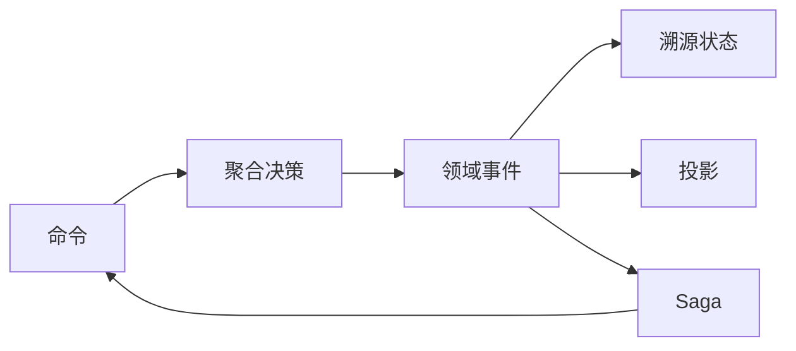

# 传统架构 VS Wow：从写接口到交付领域模型

一个订单功能可以从 Controller、Service 和 Repository 开始，也可以从命令、聚合不变量与领域事件开始。两条路径都能交付软件；差别在于业务决策放在哪里，以及团队愿意承担哪一组成本。

本文的观点是：**当领域规则、状态历史和跨聚合协作构成主要复杂度时，以领域模型作为交付单位通常比以接口作为交付单位更清晰。** 这不是对所有“传统架构”的质量判断，也不是 Wow 对交付速度或缺陷率的保证。

## 先区分比较对象

本文中的“传统 CRUD”指一种常见工作方式：请求经 Controller/Service，在事务中读写当前状态。成熟系统同样可以拥有清晰领域模型、事件和优秀测试，不能把所有非 Wow 系统归为贫血模型。

“Wow”则指当前仓库实现的命令调度、事件溯源、快照、投影、Saga、等待阶段、元数据与测试能力。精确组件所有权见[架构概览](../guide/advanced/architecture.md)，适用边界与采用成本见[简介](../guide/introduction.md#适用边界)。

## 两种工作组织方式

| 决策维度 | 常见 CRUD 分层 | Wow 当前方式 |
| --- | --- | --- |
| 建模起点 | 资源、接口与当前数据 | 业务命令、聚合边界与不变量 |
| 状态变化 | 在事务中更新当前记录 | 聚合产生事件，溯源函数应用事件 |
| 历史 | 需要另行设计审计或历史表 | EventStore 保存带版本的领域事件历史 |
| 读取 | 常由写模型或专用查询实现 | 聚合状态读取与投影视图是不同路径 |
| 跨聚合协作 | 服务调用、消息或工作流自行组织 | Saga 消费事件并发送下一条命令 |
| 领域验证 | 由团队选择单元或集成测试层 | `AggregateSpec` / `SagaSpec` 表达 Given → When → Expect |

这张表是架构视角，不是完整合同。命令、事件、状态、投影与 Saga 的规范术语以[核心概念](../guide/core-concepts.md)为准。

## Wow 把哪些能力连到领域模型

当前 Wow 运行时围绕同一组领域工件连接：

- 命令消息与聚合处理；
- 事件追加与状态重建；
- 快照、投影和查询路径；
- 事件处理器与 Saga；
- WebFlux/OpenAPI 元数据；
- 聚合与 Saga 规格测试。

这就是“领域模型即服务”的工程含义：通用运行能力围绕模型装配。它不表示只写一个聚合类就自动获得正确 API、安全、容量或恢复能力。

## 当前仓库示例能证明什么

购物车示例把职责分开：

- [`Cart.kt`](https://github.com/Ahoo-Wang/Wow/blob/main/example/example-domain/src/main/kotlin/me/ahoo/wow/example/domain/cart/Cart.kt) 接收 `AddCartItem`，根据当前状态产生 `CartItemAdded` 或 `CartQuantityChanged`；
- [`CartState.kt`](https://github.com/Ahoo-Wang/Wow/blob/main/example/example-domain/src/main/kotlin/me/ahoo/wow/example/domain/cart/CartState.kt) 通过溯源函数应用这些事件；
- [`CartSaga.kt`](https://github.com/Ahoo-Wang/Wow/blob/main/example/example-domain/src/main/kotlin/me/ahoo/wow/example/domain/cart/CartSaga.kt) 在购物车来源的订单创建后发送移除商品命令；
- `CartSpec` 与 `CartSagaSpec` 验证允许、拒绝与不产生后续命令的分支。

[Kotlin 订单与购物车](../reference/example/order.md)是这组事实的 canonical walkthrough；`./gradlew :example-domain:check` 是当前示例的聚焦门禁。

这些证据证明示例领域行为和测试层，不证明任何应用都能少写固定比例代码、提高固定比例生产率，或自动达到生产容量。本文删除了这类无法由当前仓库支持的量化推断。

## 成本没有消失，只是移动了

Wow 可以减少每个业务服务重复拥有命令路由、事件存储抽象、状态回放、等待协调和领域测试装配的需要。但团队仍然必须负责：

- 找到正确聚合边界与事件契约；
- 设计授权、租户、owner/space 与外部副作用幂等；
- 处理持久化事件演进和重放兼容；
- 选择并验证存储、消息与查询 Adapter；
- 为容量、备份、恢复、告警和回滚提供环境证据。

因此，架构收益取决于问题是否真的需要这些能力。如果当前状态和单数据库事务已经完整表达业务，引入事件历史、异步投影和消息恢复反而会增加无效负担。

## 什么时候值得考虑 Wow

可以用四个问题筛选：

1. 是否存在必须集中守护的业务不变量与非法状态迁移？
2. 状态为什么变化、历史版本或重放是否有业务价值？
3. 写入与多个读模型是否需要独立演进？
4. 跨聚合流程是否需要显式进度、幂等和恢复边界？

大多为“否”时，清晰 CRUD 通常更简单。大多为“是”时，再用一个真实业务切片验证 Wow，而不是先改造整套系统。

## 最小采用路径

1. 在一个核心场景中写下命令、不变量、事件和状态。
2. 用[领域测试套件](../guide/test-suite.md)证明成功与拒绝路径。
3. 按[快速上手](../guide/getting-started.md)暴露一条真实命令并读取溯源状态。
4. 只有真实查询需求出现时才添加投影；只有真实跨聚合流程出现时才添加 Saga。
5. 按[应用测试](../guide/application-testing.md)验证真实 Adapter、重启、重复投递与安全边界。
6. 在生产前完成[生产最佳实践](../guide/best-practices.md)和[备份、恢复与重放](../guide/recovery.md)门禁。

## 结语

“从写接口到交付领域模型”不是把 Controller 换成更多架构名词，而是把业务决策、事实与验证放在稳定边界内，再让框架承担可复用的运行机制。

简单问题应保持简单；复杂领域才值得支付事件溯源、最终一致性与运维成本。选择 Wow 的理由应来自具体业务复杂度和可验证证据，而不是“传统”或“现代”的标签。
