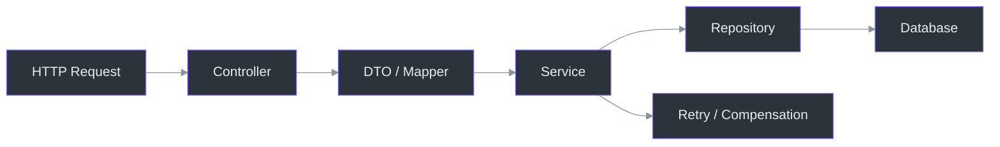
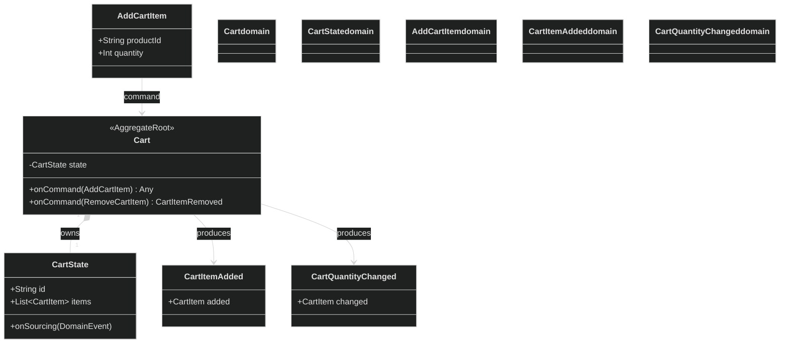
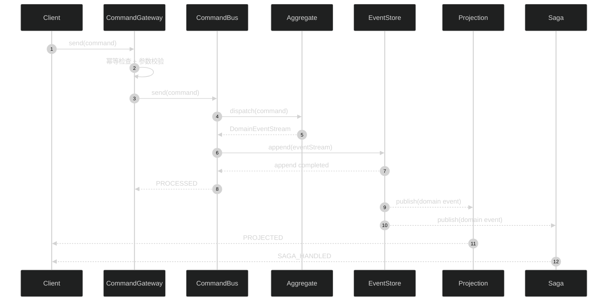
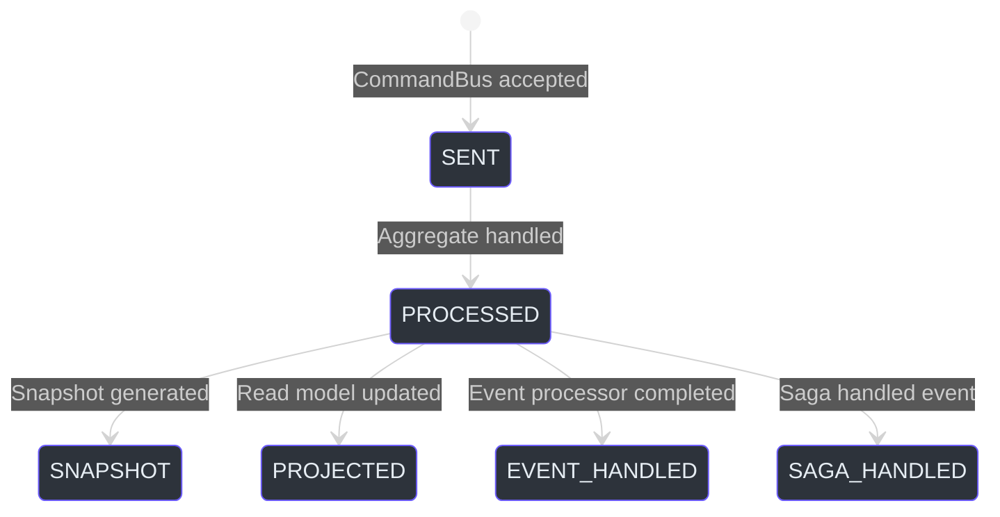
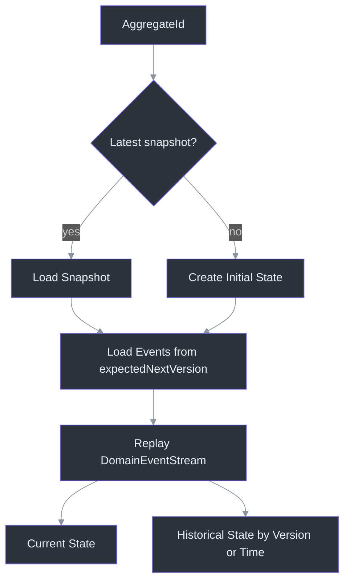

# 传统架构 VS Wow：从写接口到交付领域模型


_传统架构交付接口，Wow 交付领域模型。_

开发一个订单功能，传统架构通常要同时维护 `Controller`、`DTO`、`Service`、`Repository`、SQL、事务、事件通知、重试、补偿和集成测试。

真正的业务规则可能只有几十行，但外围代码会不断增加。Wow 的目标正是把这些重复的基础设施能力沉淀到框架中，让开发者专注于领域模型和业务规则。项目 README 将 Wow 定义为“领域模型即服务”，并明确强调自动生成 OpenAPI、命令事件链、读写分离和 Given → When → Expect 测试能力。[README.zh-CN.md:7-9](https://github.com/Ahoo-Wang/Wow/blob/main/README.zh-CN.md#L7-L9)、[README.zh-CN.md:60-89](https://github.com/Ahoo-Wang/Wow/blob/main/README.zh-CN.md#L60-L89)

## 先给结论

| 对比维度 | 传统 CRUD 架构 | Wow | 项目依据 |
|---|---|---|---|
| 开发入口 | 从 Controller 和 Service 开始 | 从 `AggregateRoot`、command 和领域规则开始 | [Cart.kt:35-77](https://github.com/Ahoo-Wang/Wow/blob/main/example/example-domain/src/main/kotlin/me/ahoo/wow/example/domain/cart/Cart.kt#L35-L77) |
| 服务接口 | 手写 Controller、DTO 和路由 | 根据领域模型元数据生成 OpenAPI 路由 | [README.zh-CN.md:77-80](https://github.com/Ahoo-Wang/Wow/blob/main/README.zh-CN.md#L77-L80) |
| 状态变化 | 直接修改当前表记录 | 由 command 产生 domain event | [Cart.kt:40-77](https://github.com/Ahoo-Wang/Wow/blob/main/example/example-domain/src/main/kotlin/me/ahoo/wow/example/domain/cart/Cart.kt#L40-L77) |
| 持久化 | 业务代码依赖 Repository 和 SQL | Event Store 保存事件，仓储负责回放状态 | [EventStore.kt:27-98](https://github.com/Ahoo-Wang/Wow/blob/main/wow-core/src/main/kotlin/me/ahoo/wow/eventsourcing/EventStore.kt#L27-L98) |
| 读模型 | 手工同步、轮询或延迟刷新 | Projection 产生读模型，可等待 `PROJECTED` | [CommandStage.kt:54-68](https://github.com/Ahoo-Wang/Wow/blob/main/wow-core/src/main/kotlin/me/ahoo/wow/command/wait/CommandStage.kt#L54-L68) |
| 跨服务流程 | Service 嵌套调用与分散补偿 | Domain Event 驱动 Saga | [CartSagaSpec.kt:28-75](https://github.com/Ahoo-Wang/Wow/blob/main/example/example-domain/src/test/kotlin/me/ahoo/wow/example/domain/cart/CartSagaSpec.kt#L28-L75) |
| 业务测试 | 依赖 Spring、数据库和接口链路 | `AggregateSpec` / `SagaSpec` 直接验证行为 | [CartSpec.kt:28-84](https://github.com/Ahoo-Wang/Wow/blob/main/example/example-domain/src/test/kotlin/me/ahoo/wow/example/domain/cart/CartSpec.kt#L28-L84) |

本文中的“传统架构”是对常见 CRUD 分层方式的抽象对比，不代表所有传统系统都采用完全相同的实现；实际选型仍应以领域复杂度和团队约束为准。[项目简介](../guide/introduction.md#背景)

## 传统架构的隐形成本

传统架构的优势是容易开始：一个请求进入 Controller，经过 Service，最后写入数据库。



<!-- Sources: documentation/docs/zh/guide/introduction.md:20-37, README.zh-CN.md:54-71 -->

问题在于，每增加一个复杂业务规则，通常都要在多个层之间重复传递：参数对象要转换，事务边界要判断，异常要翻译，数据表要更新，异步通知要补发，测试还要重新准备数据库状态。

这类代码未必难写，却会持续消耗交付时间，并让真正的业务规则分散在多个文件中。

## Wow 的核心转变：模型即服务

Wow 不要求开发者先写 Controller，而是让领域模型成为服务的核心入口。



<!-- Sources: example/example-domain/src/main/kotlin/me/ahoo/wow/example/domain/cart/Cart.kt:35-77, example/example-domain/src/main/kotlin/me/ahoo/wow/example/domain/cart/CartState.kt:28-67 -->

当前示例中的 `Cart` 使用 `@AggregateRoot`、`@AggregateRoute` 和 `@OnCommand` 描述聚合和命令处理规则。`AddCartItem` 到来后，模型根据当前状态产生 `CartItemAdded` 或 `CartQuantityChanged`，而不是让业务代码直接更新数据库。[Cart.kt:35-77](https://github.com/Ahoo-Wang/Wow/blob/main/example/example-domain/src/main/kotlin/me/ahoo/wow/example/domain/cart/Cart.kt#L35-L77)

这意味着一个领域模型可以同时成为：

| 能力 | 作用 | 项目依据 |
|---|---|---|
| 聚合入口 | 接收 command，保护领域不变量 | [AggregateRoot.kt:27-66](https://github.com/Ahoo-Wang/Wow/blob/main/wow-api/src/main/kotlin/me/ahoo/wow/api/annotation/AggregateRoot.kt#L27-L66) |
| 命令路由 | 将 command 绑定到聚合函数 | [Cart.kt:40-77](https://github.com/Ahoo-Wang/Wow/blob/main/example/example-domain/src/main/kotlin/me/ahoo/wow/example/domain/cart/Cart.kt#L40-L77) |
| API 来源 | 根据模型元数据生成 OpenAPI 路由和 schema | [README.zh-CN.md:77-80](https://github.com/Ahoo-Wang/Wow/blob/main/README.zh-CN.md#L77-L80) |
| 事件来源 | 以领域事件表达状态变化 | [EventStore.kt:27-98](https://github.com/Ahoo-Wang/Wow/blob/main/wow-core/src/main/kotlin/me/ahoo/wow/eventsourcing/EventStore.kt#L27-L98) |

因此，开发者写的是“购物车允许什么行为”，而不是重复编写“Controller 如何调用 Service、Service 如何调用 Repository”。

## 一条 command 如何变成完整服务



<!-- Sources: wow-core/src/main/kotlin/me/ahoo/wow/command/DefaultCommandGateway.kt:94-187, wow-core/src/main/kotlin/me/ahoo/wow/command/wait/NotifierFilters.kt:40-118 -->

`DefaultCommandGateway` 在发送命令前执行 request ID 幂等检查和 command validation；`sendAndWaitForSent` 只代表命令总线接受了命令，`sendAndWait` 则根据 `WaitPlan` 等待后续阶段。[DefaultCommandGateway.kt:94-187](https://github.com/Ahoo-Wang/Wow/blob/main/wow-core/src/main/kotlin/me/ahoo/wow/command/DefaultCommandGateway.kt#L94-L187)

这解决了传统系统中常见的“先 `sleep(1000)` 再查询”问题：调用方可以明确选择自己真正需要的完成阶段，而不是猜测异步同步是否已经结束。

## 不再用时间猜测业务是否完成



<!-- Sources: wow-core/src/main/kotlin/me/ahoo/wow/command/wait/CommandStage.kt:25-125, wow-core/src/main/kotlin/me/ahoo/wow/command/wait/CommandWait.kt:23-72 -->

Wow 当前定义了 `SENT`、`PROCESSED`、`SNAPSHOT`、`PROJECTED`、`EVENT_HANDLED` 和 `SAGA_HANDLED` 等阶段。[CommandStage.kt:25-125](https://github.com/Ahoo-Wang/Wow/blob/main/wow-core/src/main/kotlin/me/ahoo/wow/command/wait/CommandStage.kt#L25-L125)

它们对应不同的产品和系统需求：

| 调用方需求 | 推荐阶段 | 原因 | 项目依据 |
|---|---|---|---|
| 只需要快速接收请求 | `SENT` | 不等待聚合和下游处理 | [DefaultCommandGateway.kt:145-187](https://github.com/Ahoo-Wang/Wow/blob/main/wow-core/src/main/kotlin/me/ahoo/wow/command/DefaultCommandGateway.kt#L145-L187) |
| 需要确认业务规则已执行 | `PROCESSED` | 聚合已处理 command | [CommandStage.kt:40-51](https://github.com/Ahoo-Wang/Wow/blob/main/wow-core/src/main/kotlin/me/ahoo/wow/command/wait/CommandStage.kt#L40-L51) |
| 页面必须读到最新结果 | `PROJECTED` | 读模型已完成投影 | [CommandStage.kt:54-68](https://github.com/Ahoo-Wang/Wow/blob/main/wow-core/src/main/kotlin/me/ahoo/wow/command/wait/CommandStage.kt#L54-L68) |
| 需要确认 Saga 已继续推进 | `SAGA_HANDLED` | Saga 已处理领域事件 | [CommandStage.kt:79-90](https://github.com/Ahoo-Wang/Wow/blob/main/wow-core/src/main/kotlin/me/ahoo/wow/command/wait/CommandStage.kt#L79-L90) |

## 事件溯源：少写持久化代码，多获得业务能力

传统 CRUD 主要保存当前状态：

```text
Order.status = PAID
```

Wow 保存形成状态的业务事实：

```text
OrderCreated
OrderPaid
OrderShipped
OrderReceived
```

`EventSourcingStateAggregateRepository` 在加载最新聚合时，会优先尝试快照；如果没有快照，则创建初始状态，再从事件存储加载后续事件并回放。[EventSourcingStateAggregateRepository.kt:41-125](https://github.com/Ahoo-Wang/Wow/blob/main/wow-core/src/main/kotlin/me/ahoo/wow/eventsourcing/EventSourcingStateAggregateRepository.kt#L41-L125)



<!-- Sources: wow-core/src/main/kotlin/me/ahoo/wow/eventsourcing/EventSourcingStateAggregateRepository.kt:41-155, wow-core/src/main/kotlin/me/ahoo/wow/eventsourcing/EventStore.kt:27-98 -->

同一条事件流还可以被 Projection、事件处理器和 Saga 消费。订单创建后，当前示例的 `CartSagaSpec` 验证了：当订单来自购物车时，Saga 发送 `RemoveCartItem`；订单不是来自购物车时，不发送命令。[CartSagaSpec.kt:28-75](https://github.com/Ahoo-Wang/Wow/blob/main/example/example-domain/src/test/kotlin/me/ahoo/wow/example/domain/cart/CartSagaSpec.kt#L28-L75)

这让审计、读模型、跨服务协作和补偿流程共享同一组业务事实，不需要为每个场景重新设计一套数据库同步机制。

## 开发成本为什么会下降

| 成本来源 | 传统架构 | Wow 的做法 | 结果 |
|---|---|---|---|
| 重复接口代码 | 每个资源手写 Controller、DTO、路由 | 模型元数据驱动 API 和路由 | 少写样板代码 |
| 重复状态代码 | Service 直接更新多个表字段 | 聚合处理 command，产生事件 | 规则集中在领域边界 |
| 重复同步代码 | 手写事件通知、轮询和延迟重试 | 事件总线、Projection、Saga 复用事件流 | 少维护旁路链路 |
| 重复测试准备 | 启动上下文、数据库和清理脚本 | `AggregateSpec` / `SagaSpec` DSL | 更快验证业务行为 |
| 重复审计代码 | 额外设计操作日志和历史表 | 领域事件保留业务事实 | 审计与回放能力复用 |

Wow 的“低开发成本”不是把业务规则删掉，而是把通用能力从业务服务中抽出来。开发者仍然需要设计聚合边界、事件契约和跨服务协作，但不必在每个项目中重复搭建命令路由、事件存储、状态回放和等待阶段。

## 测试：把领域模型变成可执行规格

`AggregateSpec` 使用 Given → When → Expect 描述聚合行为。当前 `CartSpec` 不只验证加入商品，还从场景分支验证移除商品、删除聚合、恢复聚合和非法重复恢复。[CartSpec.kt:28-84](https://github.com/Ahoo-Wang/Wow/blob/main/example/example-domain/src/test/kotlin/me/ahoo/wow/example/domain/cart/CartSpec.kt#L28-L84)

```kotlin
class CartSpec : AggregateSpec<Cart, CartState>({
    on {
        givenOwnerId(ownerId)

        whenCommand(AddCartItem(productId = "productId", quantity = 1)) {
            expectNoError()
            expectEventType(CartItemAdded::class)
            expectState {
                items.assert().hasSize(1)
            }
        }
    }
})
```

测试表达的是业务语言：

```text
Given：购物车属于某个用户
When：加入一个商品
Expect：产生 CartItemAdded
Expect：购物车包含一个商品
```

这比只断言某个数据库字段更接近产品真正关心的结果：允许什么行为、拒绝什么行为，以及一次行为会产生什么业务事实。

## Wow 不是所有系统的默认答案

如果系统只是简单 CRUD，传统架构的低启动成本可能更合适。

Wow 更适合以下场景：

- 领域状态复杂，存在明确的不变量和非法迁移
- 订单、库存、支付、购物车需要跨服务协作
- 需要审计、事件回放或历史状态重建
- 需要读写分离和明确的最终一致性阶段
- 团队希望用领域测试直接固化业务行为

选择 Wow 的核心理由，不是为了多引入几个架构名词，而是为了让一个领域模型承载更多服务能力：

```text
一次建模
多处复用

一个领域模型
连接命令、事件、存储、查询和协作

少写基础设施
多写业务规则
```

## 结语：从“写接口”转向“交付领域模型”

传统架构的基本单位是接口：一个接口、一套 Controller、一套 Service、一套 Repository、一套测试。

Wow 的基本单位是领域模型：一个聚合、一组命令、一组事件、一套可回放的业务状态。

传统架构让团队不断重复搭建业务外围设施；Wow 把这些通用能力沉淀到框架中，让开发者专注于真正决定产品价值的部分：

> 业务规则，而不是胶水代码。

当系统从简单 CRUD 走向订单、库存、支付、履约和复杂协作时，Wow 的“模型即服务”不仅是一种架构理念，更是一种降低长期开发成本的工程方法。

## Related Pages

| 页面 | 关系 |
|---|---|
| [简介](../guide/introduction.md) | 了解 Wow 的定位、低开发成本和模型即服务理念 |
| [核心概念](../guide/core-concepts.md) | 理解聚合根、command、event、projection 和 Saga |
| [聚合建模](../guide/modeling.md) | 学习如何把领域模型写成 Wow 聚合 |
| [命令网关](../guide/command-gateway.md) | 了解命令发送、等待计划和处理阶段 |
| [测试套件](../guide/test-suite.md) | 使用 `AggregateSpec` 和 `SagaSpec` 验证业务行为 |
| [事件存储](../guide/eventstore.md) | 了解事件持久化、回放和状态恢复 |
