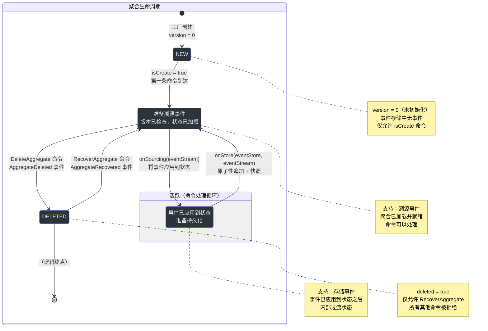
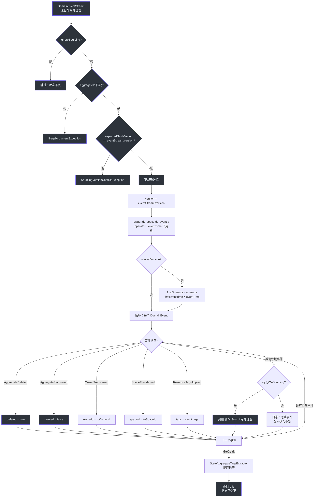
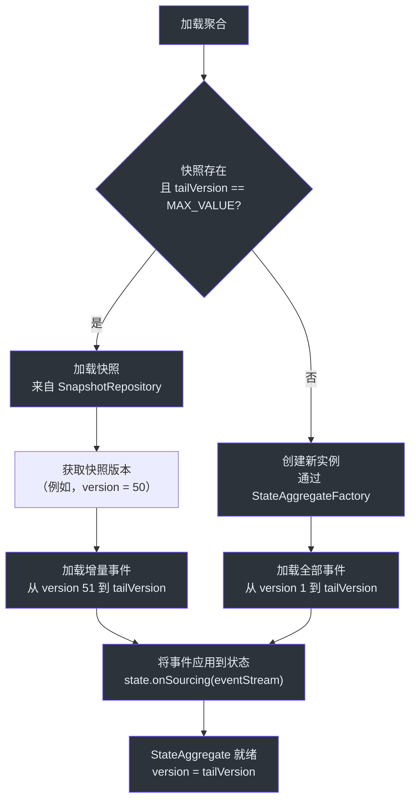

# 聚合生命周期

聚合是 Wow 框架中的核心领域对象。其生命周期控制着命令的接收方式、事件的溯源方式、状态的变更方式，以及聚合的创建、软删除与恢复方式。Wow 中的每个聚合都遵循一个由确定性事件溯源和乐观并发控制支撑的明确定义的状态机。

**为什么这很重要**：理解聚合生命周期对于设计正确的领域模型至关重要。你编写的每一个命令处理器、每一个 `@OnSourcing` 方法、以及每一条业务规则，都在生命周期的特定阶段内执行。对其产生误解将会导致竞态条件、过时状态或错误的事件顺序。

## 概览速查

| 阶段 | 关键接口 / 类 | 发生什么 | 来源 |
|---|---|---|---|
| **创建** | `CommandMessage.isCreate`、`@CreateAggregate`、`StateAggregateFactory` | 创建一个版本号为 0 的新聚合实例，准备接受第一条命令 | [CommandMessage.kt:105](https://github.com/Ahoo-Wang/Wow/blob/main/wow-api/src/main/kotlin/me/ahoo/wow/api/command/CommandMessage.kt#L105) |
| **命令校验** | `SimpleCommandAggregate.process()`、`CommandState.STORED` | 在任何处理器运行之前，进行版本、所有权和初始化检查 | [SimpleCommandAggregate.kt:82-138](https://github.com/Ahoo-Wang/Wow/blob/main/wow-core/src/main/kotlin/me/ahoo/wow/modeling/command/SimpleCommandAggregate.kt#L82-L138) |
| **命令执行** | `@OnCommand`、`CommandFunction.invoke()` | 业务逻辑运行，产出领域事件 | [OnCommand.kt:69-87](https://github.com/Ahoo-Wang/Wow/blob/main/wow-api/src/main/kotlin/me/ahoo/wow/api/annotation/OnCommand.kt#L69-L87) |
| **事件溯源** | `@OnSourcing`、`CommandState.onSourcing()`、`SimpleStateAggregate.onSourcing()` | 以确定性的方式将事件应用到聚合状态 | [OnSourcing.kt:55-59](https://github.com/Ahoo-Wang/Wow/blob/main/wow-api/src/main/kotlin/me/ahoo/wow/api/annotation/OnSourcing.kt#L55-L59) |
| **事件持久化** | `EventStore.append()`、`CommandState.onStore()` | 原子性地提交事件，并执行版本冲突检查 | [CommandAggregate.kt:76-83](https://github.com/Ahoo-Wang/Wow/blob/main/wow-core/src/main/kotlin/me/ahoo/wow/modeling/command/CommandAggregate.kt#L76-L83) |
| **删除** | `DefaultDeleteAggregate`、`AggregateDeleted`、`DeletedCapable.deleted` | 通过 `DefaultAggregateDeleted` 事件进行软删除；不存在硬删除 | [DefaultDeleteAggregateFunction.kt:33-46](https://github.com/Ahoo-Wang/Wow/blob/main/wow-core/src/main/kotlin/me/ahoo/wow/modeling/command/DefaultDeleteAggregateFunction.kt#L33-L46) |
| **恢复** | `DefaultRecoverAggregate`、`AggregateRecovered` | 将一个已软删除的聚合恢复到活跃状态 | [DefaultRecoverAggregateFunction.kt:33-46](https://github.com/Ahoo-Wang/Wow/blob/main/wow-core/src/main/kotlin/me/ahoo/wow/modeling/command/DefaultRecoverAggregateFunction.kt#L33-L46) |

## 生命周期状态机高层视图

聚合生命周期从创建开始，经过活跃的命令处理阶段，再到可选的删除与恢复。以下状态图展示了完整的生命周期。



<!-- Sources: wow-core/src/main/kotlin/me/ahoo/wow/modeling/command/CommandAggregate.kt:41-118, wow-core/src/main/kotlin/me/ahoo/wow/modeling/command/SimpleCommandAggregate.kt:66, wow-api/src/main/kotlin/me/ahoo/wow/api/Version.kt:41-68, wow-api/src/main/kotlin/me/ahoo/wow/api/modeling/DeletedCapable.kt:25-32 -->

## 阶段一：聚合创建

聚合的生命始于一条**创建命令**的到来。创建命令通过 `CommandMessage` 上的 `isCreate` 标志与修改命令区分开来。

### 框架如何决策创建还是加载

`RetryableAggregateProcessor`（[RetryableAggregateProcessor.kt:54-72](https://github.com/Ahoo-Wang/Wow/blob/main/wow-core/src/main/kotlin/me/ahoo/wow/modeling/command/RetryableAggregateProcessor.kt#L54-L72)）做出了关键的分支决策：

```kotlin
val stateAggregateMono = if (exchange.message.isCreate) {
    aggregateFactory.createAsMono(aggregateMetadata.state, exchange.message.aggregateId)
} else {
    stateAggregateRepository.load(aggregateId, aggregateMetadata.state)
}
```

<!-- Source: wow-core/src/main/kotlin/me/ahoo/wow/modeling/command/RetryableAggregateProcessor.kt:55-59 -->

| 条件 | 操作 | 初始版本号 |
|---|---|---|
| `isCreate = true` | `StateAggregateFactory.createAsMono()` 创建一个全新的实例 | `0`（`UNINITIALIZED_VERSION`） |
| `isCreate = false` | `StateAggregateRepository.load()` 从快照/事件存储中加载 | `>= 0`（从事件重建） |

### 创建命令注解

用于创建聚合的命令应使用 `@CreateAggregate` 进行标注。此注解将该命令标记为初始化命令，用于建立聚合的初始状态。

```kotlin
@CreateAggregate
data class CreateUserCommand(
    @AggregateId
    val userId: String,
    val email: String,
    val name: String
)
```

<!-- Source: wow-api/src/main/kotlin/me/ahoo/wow/api/annotation/CreateAggregate.kt:30-56 -->

### 示例：来自示例项目的订单创建

示例 `Order` 聚合展示了一个创建命令处理器。当 `CreateOrder` 到达时，处理器校验业务规则，返回 `OrderCreated` 事件，并设置命令结果。

```kotlin
fun onCommand(
    command: CommandMessage<CreateOrder>,
    @Name("createOrderSpec") specification: CreateOrderSpec,
    commandResultAccessor: CommandResultAccessor
): Mono<OrderCreated> {
    val createOrder = command.body
    require(createOrder.items.isNotEmpty()) {
        "items can not be empty."
    }
    return Flux
        .fromIterable(createOrder.items)
        .flatMap(specification::require)
        .then(
            OrderCreated(
                orderId = command.aggregateId.id,
                items = createOrder.items.map { /* ... */ },
                address = createOrder.address,
                fromCart = createOrder.fromCart,
            ).toMono().doOnNext { orderCreated ->
                commandResultAccessor.setCommandResult(
                    OrderState::totalAmount.name,
                    orderCreated.items.sumOf { it.totalPrice }
                )
            }
        )
}
```

<!-- Source: example/example-domain/src/main/kotlin/me/ahoo/wow/example/domain/order/Order.kt:106-138 -->

关于创建处理器的关键要点：
- 聚合处于初始状态（version = 0），因此没有可校验的现有状态 —— 仅适用命令字段校验。
- 处理器可以是同步的（直接返回事件）或响应式的（返回 `Mono`）。
- 外部服务（如 `CreateOrderSpec`）可以通过 `@Name` 限定符注入到处理器方法中。

## 阶段二：命令处理循环

一旦聚合存在（无论是新创建的还是从事件存储中加载的），它便进入**命令处理循环**。这是聚合生命周期的核心，在此阶段命令被校验、执行、溯源并持久化。

### 命令处理序列

以下序列图展示了从命令到达到事件持久化的完整流程，以 `SimpleCommandAggregate.process()` 方法为主要参考。

```mermaid
sequenceDiagram
%%{init: {'theme': 'dark', 'themeVariables': {'primaryColor': '#2d333b', 'primaryTextColor': '#e6edf3', 'primaryBorderColor': '#6d5dfc', 'lineColor': '#8b949e', 'noteBkgColor': '#161b22', 'noteTextColor': '#e6edf3', 'actorBkg': '#2d333b', 'actorBorder': '#6d5dfc', 'actorTextColor': '#e6edf3', 'signalColor': '#8b949e', 'signalTextColor': '#e6edf3', 'labelBoxBkgColor': '#2d333b', 'labelBoxBorderColor': '#6d5dfc', 'labelTextColor': '#e6edf3', 'loopTextColor': '#e6edf3', 'activationBorderColor': '#6d5dfc', 'activationBkgColor': '#1a1f2e'}}}%%
    autonumber
    participant RAP as RetryableAggregateProcessor
    participant SCA as SimpleCommandAggregate
    participant SA as StateAggregate
    participant CF as CommandFunction
    participant EF as ErrorFunction
    participant ES as EventStore
    participant EB as EventBus

    RAP->>SCA: process(exchange)

    Note over SCA: 设置处理器函数<br>在 exchange 上设置聚合版本

    rect rgb(22, 27, 34)
        Note over SCA: === 执行前校验 ===

        SCA->>SCA: 检查 aggregateVersion 匹配<br>（乐观并发控制）
        alt 版本不匹配
            SCA-->>RAP: CommandExpectVersionConflictException
        end

        SCA->>SCA: 检查 initialized || isCreate || allowCreate
        alt 未初始化且不是创建命令
            SCA-->>RAP: NotFoundResourceException
        end

        SCA->>SCA: 检查 ownerId 匹配<br>（如果 command.ownerId 非空）
        alt 所有者不匹配
            SCA-->>RAP: IllegalAccessOwnerAggregateException
        end

        SCA->>SCA: 检查 spaceId 匹配<br>（如果 command.spaceId 非空）
        alt 空间不匹配
            SCA-->>RAP: IllegalAccessSpaceAggregateException
        end

        SCA->>SCA: 断言 CommandState == STORED
        alt 非 STORED
            SCA-->>RAP: IllegalStateException
        end

        SCA->>SCA: 如果是 RecoverAggregate，检查 state.deleted == true
        SCA->>SCA: 否则若 state.deleted == true
        alt 已删除的聚合
            SCA-->>RAP: IllegalAccessDeletedAggregateException
        end
    end

    Note over SCA: === 命令执行 ===

    SCA->>CF: invoke(exchange)
    CF-->>SCA: DomainEventStream（来自命令处理器）

    Note over SCA: === 事件溯源（状态变更） ===

    SCA->>SA: commandState.onSourcing(state, eventStream)
    SA->>SA: 校验 aggregateId 匹配
    SA->>SA: 校验 expectedVersion 匹配
    alt 版本冲突
        SA-->>SCA: SourcingVersionConflictException
    end
    SA->>SA: 更新元数据<br>（version、ownerId、eventId、operator、eventTime）
    loop eventStream 中的每个 DomainEvent
        SA->>SA: 将事件应用到状态<br>（AggregateDeleted? deleted = true<br> AggregateRecovered? deleted = false<br> OwnerTransferred? ownerId = ...<br> 或已注册的 @OnSourcing 函数）
    end
    SA-->>SCA: CommandState.SOURCED

    Note over SCA: === 事件持久化 ===

    SCA->>ES: commandState.onStore(eventStore, eventStream)
    ES->>ES: 原子性追加并附带版本检查
    alt 存储时版本冲突
        ES-->>SCA: EventVersionConflictException<br>commandState = EXPIRED
    end
    ES-->>SCA: CommandState.STORED

    SCA-->>RAP: DomainEventStream（成功）

    Note over RAP: 事件发布到 EventBus<br>供投影、Saga、处理器使用

    rect rgb(22, 27, 34)
        Note over SCA: === 错误处理（失败时） ===
        SCA->>EF: errorResume：调用错误函数
        EF-->>SCA: （处理或重新抛出）
    end

```



<!-- Sources: wow-core/src/main/kotlin/me/ahoo/wow/modeling/command/SimpleCommandAggregate.kt:82-138, wow-core/src/main/kotlin/me/ahoo/wow/modeling/command/RetryableAggregateProcessor.kt:54-72, wow-core/src/main/kotlin/me/ahoo/wow/modeling/state/SimpleStateAggregate.kt:96-141, wow-core/src/main/kotlin/me/ahoo/wow/modeling/command/CommandAggregate.kt:65-118 -->

### 校验关卡（执行前）

在任何命令处理器运行之前，`SimpleCommandAggregate.process()` 运行六个连续的校验关卡：

| # | 校验 | 检查什么 | 失败异常 | 来源 |
|---|---|---|---|---|
| 1 | **版本检查** | `command.aggregateVersion == 当前版本`（乐观并发控制） | `CommandExpectVersionConflictException` | [SimpleCommandAggregate.kt:92-98](https://github.com/Ahoo-Wang/Wow/blob/main/wow-core/src/main/kotlin/me/ahoo/wow/modeling/command/SimpleCommandAggregate.kt#L92-L98) |
| 2 | **初始化检查** | `initialized \|\| isCreate \|\| allowCreate` | `NotFoundResourceException` | [SimpleCommandAggregate.kt:99-101](https://github.com/Ahoo-Wang/Wow/blob/main/wow-core/src/main/kotlin/me/ahoo/wow/modeling/command/SimpleCommandAggregate.kt#L99-L101) |
| 3 | **所有者检查** | `command.ownerId == state.ownerId`（多租户） | `IllegalAccessOwnerAggregateException` | [SimpleCommandAggregate.kt:102-104](https://github.com/Ahoo-Wang/Wow/blob/main/wow-core/src/main/kotlin/me/ahoo/wow/modeling/command/SimpleCommandAggregate.kt#L102-L104) |
| 4 | **空间检查** | `command.spaceId == state.spaceId`（多租户） | `IllegalAccessSpaceAggregateException` | [SimpleCommandAggregate.kt:105-107](https://github.com/Ahoo-Wang/Wow/blob/main/wow-core/src/main/kotlin/me/ahoo/wow/modeling/command/SimpleCommandAggregate.kt#L105-L107) |
| 5 | **CommandState 检查** | `commandState == STORED`（串行处理保证） | `IllegalStateException` | [SimpleCommandAggregate.kt:108-110](https://github.com/Ahoo-Wang/Wow/blob/main/wow-core/src/main/kotlin/me/ahoo/wow/modeling/command/SimpleCommandAggregate.kt#L108-L110) |
| 6 | **删除检查** | 未删除 OR 是 `RecoverAggregate` 命令 | `IllegalAccessDeletedAggregateException` | [SimpleCommandAggregate.kt:111-119](https://github.com/Ahoo-Wang/Wow/blob/main/wow-core/src/main/kotlin/me/ahoo/wow/modeling/command/SimpleCommandAggregate.kt#L111-L119) |

### CommandState 枚举：串行处理保证

`CommandState` 枚举确保**每个聚合实例的串行命令处理**。同一时间只有一个命令可以穿过 STORED -> SOURCED -> STORED 循环。

| 状态 | 允许的转换 | 行为 | 来源 |
|---|---|---|---|
| `STORED` | `onSourcing(eventStream)` -> `SOURCED` | 将事件应用到状态聚合 | [CommandAggregate.kt:66-74](https://github.com/Ahoo-Wang/Wow/blob/main/wow-core/src/main/kotlin/me/ahoo/wow/modeling/command/CommandAggregate.kt#L66-L74) |
| `SOURCED` | `onStore(eventStore, eventStream)` -> `STORED` | 原子性地将事件追加到事件存储 | [CommandAggregate.kt:75-83](https://github.com/Ahoo-Wang/Wow/blob/main/wow-core/src/main/kotlin/me/ahoo/wow/modeling/command/CommandAggregate.kt#L75-L83) |
| `EXPIRED` | （无） | 不可恢复错误后的终态；无法进行任何进一步操作 | [CommandAggregate.kt:84-85](https://github.com/Ahoo-Wang/Wow/blob/main/wow-core/src/main/kotlin/me/ahoo/wow/modeling/command/CommandAggregate.kt#L84-L85) |

这种设计意味着，如果针对同一聚合的第二条命令在第一条命令处于 `SOURCED` 状态时到达，它将失败并抛出 `IllegalStateException`。这是框架内置的面向并发修改的防护机制。

### 业务规则执行

在通过所有校验关卡后，框架会查找并调用与命令类型对应的 `CommandFunction`。命令处理器有一个明确的职责：**校验业务规则并返回领域事件**。它们绝不可以直接修改聚合状态。

来自 `Order` 聚合的示例——一个返回多个事件的支付命令处理器：

```kotlin
fun onCommand(payOrder: PayOrder): Iterable<*> {
    if (OrderStatus.CREATED != state.status) {
        return listOf(
            OrderPayDuplicated(
                paymentId = payOrder.paymentId,
                errorMsg = "The current order[${state.id}] status[${state.status}] cannot pay order.",
            ),
        )
    }
    val currentPayable = state.payable
    if (currentPayable >= payOrder.amount) {
        return listOf(OrderPaid(payOrder.amount, currentPayable == payOrder.amount))
    }
    val overPay = payOrder.amount - currentPayable
    val orderPaid = OrderPaid(currentPayable, true)
    val overPaid = OrderOverPaid(payOrder.paymentId, overPay)
    return listOf(orderPaid, overPaid)
}
```

<!-- Source: example/example-domain/src/main/kotlin/me/ahoo/wow/example/domain/order/Order.kt:184-216 -->

上面展示的关键模式：
- **状态守卫**：处理器检查 `state.status` 来约束操作（只有在 `CREATED` 状态下才能支付）。
- **多事件**：一条命令可以产生多个领域事件（例如，`OrderPaid` + `OrderOverPaid`）。事件按照它们在返回集合中出现的顺序发布。
- **幂等性**：重复支付返回 `OrderPayDuplicated` 事件，而不是抛出错误，从而允许下游进行补偿。

## 阶段三：事件溯源与状态变更

在命令处理器产出事件之后，框架进入**事件溯源阶段**。在这个阶段，事件以确定性的方式被应用到聚合状态。

### 事件溯源如何运作

`SimpleStateAggregate.onSourcing()` 方法编排了这一阶段：



<!-- Sources: wow-core/src/main/kotlin/me/ahoo/wow/modeling/state/SimpleStateAggregate.kt:96-141, wow-core/src/main/kotlin/me/ahoo/wow/modeling/state/SimpleStateAggregate.kt:157-182 -->

### @OnSourcing 注解

`@OnSourcing` 标记那些将领域事件应用到聚合状态的方法。这些方法是**唯一**可以变更聚合状态的地方，并且它们必须是：

- **确定性的**：给定相同的事件，始终产生相同的状态结果。
- **无副作用的**：不得调用外部系统（不允许 HTTP、不允许数据库写入、不允许消息发布）。
- **按顺序应用**：事件按产出顺序依次应用。

来自示例项目的 `OrderState` 示例：

```kotlin
class OrderState(val id: String) : StatusCapable<OrderStatus> {

    lateinit var items: List<OrderItem> private set
    lateinit var address: ShippingAddress private set
    var totalAmount: BigDecimal = BigDecimal.ZERO private set
    var paidAmount: BigDecimal = BigDecimal.ZERO private set
    override var status = OrderStatus.CREATED private set

    val payable: BigDecimal
        get() = totalAmount.minus(paidAmount)

    fun onSourcing(orderCreated: OrderCreated) {
        address = orderCreated.address
        items = orderCreated.items
        totalAmount = orderCreated.items
            .map { it.totalPrice }
            .reduce { totalPrice, moneyToAdd -> totalPrice + moneyToAdd }
        status = OrderStatus.CREATED
    }

    fun onSourcing(addressChanged: AddressChanged) {
        address = addressChanged.shippingAddress
    }

    private fun onSourcing(orderPaid: OrderPaid) {
        paidAmount = paidAmount.plus(orderPaid.amount)
        if (orderPaid.paid) {
            status = OrderStatus.PAID
        }
    }

    fun onSourcing(orderShipped: OrderShipped) {
        status = OrderStatus.SHIPPED
    }

    fun onSourcing(orderReceived: OrderReceived) {
        status = OrderStatus.RECEIVED
    }
}
```

<!-- Source: example/example-domain/src/main/kotlin/me/ahoo/wow/example/domain/order/OrderState.kt:40-118 -->

### 内置特殊事件

`SimpleStateAggregate` 自动处理多种特殊事件类型，无需显式的 `@OnSourcing` 方法：

| 特殊事件 | 对状态的影响 | 来源 |
|---|---|---|
| `AggregateDeleted` | 设置 `deleted = true` | [SimpleStateAggregate.kt:159-161](https://github.com/Ahoo-Wang/Wow/blob/main/wow-core/src/main/kotlin/me/ahoo/wow/modeling/state/SimpleStateAggregate.kt#L159-L161) |
| `AggregateRecovered` | 设置 `deleted = false` | [SimpleStateAggregate.kt:162-164](https://github.com/Ahoo-Wang/Wow/blob/main/wow-core/src/main/kotlin/me/ahoo/wow/modeling/state/SimpleStateAggregate.kt#L162-L164) |
| `OwnerTransferred` | 更新 `ownerId` | [SimpleStateAggregate.kt:165-167](https://github.com/Ahoo-Wang/Wow/blob/main/wow-core/src/main/kotlin/me/ahoo/wow/modeling/state/SimpleStateAggregate.kt#L165-L167) |
| `SpaceTransferred` | 更新 `spaceId` | [SimpleStateAggregate.kt:168-170](https://github.com/Ahoo-Wang/Wow/blob/main/wow-core/src/main/kotlin/me/ahoo/wow/modeling/state/SimpleStateAggregate.kt#L168-L170) |
| `ResourceTagsApplied` | 更新 `tags`（ABAC） | [SimpleStateAggregate.kt:171-173](https://github.com/Ahoo-Wang/Wow/blob/main/wow-core/src/main/kotlin/me/ahoo/wow/modeling/state/SimpleStateAggregate.kt#L171-L173) |

### 缺少 @OnSourcing 时的优雅默认行为

如果某个事件没有匹配的 `@OnSourcing` 处理器，框架**不会抛出错误**。相反，它记录一条调试信息，并仍将聚合版本更新为该事件的版本。这在 `StateAggregate.kt` 中有记录：

```kotlin
/**
 * 当聚合找不到匹配的 onSourcing 方法时，
 * 它不将其视为故障；该事件被忽略，
 * 但聚合版本会更新为该领域事件的版本。
 */
```

<!-- Source: wow-core/src/main/kotlin/me/ahoo/wow/modeling/state/StateAggregate.kt:28-30 -->

这种设计选择是经过深思熟虑的：它允许聚合通过为未来事件添加新的 `@OnSourcing` 处理器来随时间演进，而不会破坏对该处理器出现之前的历史事件的重放。

## 阶段四：事件持久化与快照

在事件被溯源到状态之后，`CommandState.onStore()` 方法原子性地将事件流持久化到 `EventStore`。成功时，`CommandState` 返回 `STORED`（准备好接受下一条命令）。失败时，变为 `EXPIRED`。

### 状态可变性与持久化之间的关系

通过将状态属性设为 `private set` 并仅通过 `@OnSourcing` 方法对其进行变更，`OrderState` 类强制执行了事件溯源原则：**状态只能通过应用事件来变更**。命令处理器的角色是产生正确的事件；`@OnSourcing` 方法则将它们应用到状态。

| 组件 | 能否变更状态？ | 角色 |
|---|---|---|
| `@OnCommand` 处理器 | 否 | 产出领域事件 |
| `@OnSourcing` 处理器 | 是（唯一的地方） | 将事件应用到状态 |
| `@OnEvent` 处理器 | 否 | 响应事件（投影、Saga） |
| 外部代码 | 否 | 无 |

## 阶段五：聚合加载与重放

当现有聚合收到非创建命令时，框架必须先加载（或重建）其当前状态，然后才能处理。`EventSourcingStateAggregateRepository` 编排了这一加载过程。

### 状态重建策略



<!-- Sources: wow-core/src/main/kotlin/me/ahoo/wow/eventsourcing/EventSourcingStateAggregateRepository.kt:41-148, wow-core/src/main/kotlin/me/ahoo/wow/eventsourcing/EventStoreStateAggregateRepository.kt:33-105 -->

加载过程根据快照是否存在采取了两种策略：

| 策略 | 触发条件 | 如何运作 |
|---|---|---|
| **基于快照** | `tailVersion == Int.MAX_VALUE` AND 快照存在 | 加载快照，然后仅重放从 `snapshot.version + 1` 开始的增量事件 |
| **完整重放** | 没有快照 | 创建新实例，从 version 1 开始重放全部事件 |

快照通过避免重放数百或数千个历史事件，显著提升了长生命周期聚合的性能。快照将聚合在特定版本上的状态存储下来，因此只需重放在该版本之后发生的事件。

### 时间点重建

`EventSourcingStateAggregateRepository` 还支持加载**在特定时间点存在的聚合**：

```kotlin
// 加载 1 天前的聚合状态
val eventTime = System.currentTimeMillis() - 86400000L
val historicalState = repository.load(
    aggregateId,
    metadata,
    tailEventTime = eventTime
).block()
```

<!-- Source: wow-core/src/main/kotlin/me/ahoo/wow/eventsourcing/EventSourcingStateAggregateRepository.kt:130-147 -->

这使得时间查询、审计追踪以及调试过去状态的场景成为可能，而无需维护独立的历史快照。

## 阶段六：删除与恢复

Wow 对聚合实施**软删除**。当聚合被删除时，它不会从存储中被物理移除；相反，它被标记为已删除（`deleted = true`），并且所有后续非恢复命令都会被拒绝。

### 删除如何运作

1. **命令**：客户端发送 `DefaultDeleteAggregate`（或自定义的 `DeleteAggregate` 命令）。
2. **内置处理器**：`DefaultDeleteAggregateFunction` 自动处理，返回 `DefaultAggregateDeleted` 事件。
3. **事件溯源**：`SimpleStateAggregate.sourcing()` 设置 `deleted = true`。
4. **守卫**：除 `RecoverAggregate` 之外的后续命令均以 `IllegalAccessDeletedAggregateException` 拒绝。

```kotlin
// DefaultDeleteAggregate 自动路由为：
// DELETE /{resourceName}/{aggregateId}
@Summary("Delete aggregate")
@CommandRoute(action = "", method = CommandRoute.Method.DELETE, appendIdPath = CommandRoute.AppendPath.ALWAYS)
object DefaultDeleteAggregate : DeleteAggregate
```

<!-- Source: wow-api/src/main/kotlin/me/ahoo/wow/api/command/DeleteAggregate.kt:55-57 -->

### 恢复如何运作

1. **命令**：客户端发送 `DefaultRecoverAggregate`（或自定义的 `RecoverAggregate` 命令）。
2. **预检查**：`SimpleCommandAggregate.process()` 校验聚合当前是否处于已删除状态。
3. **内置处理器**：`DefaultRecoverAggregateFunction` 返回 `DefaultAggregateRecovered` 事件。
4. **事件溯源**：`SimpleStateAggregate.sourcing()` 设置 `deleted = false`。
5. **结果**：聚合重新激活，可以正常处理命令。

```kotlin
// DefaultRecoverAggregate 自动路由为：
// PUT /{resourceName}/{aggregateId}/recover
@Summary("Recover deleted aggregate")
@CommandRoute(action = "recover", method = CommandRoute.Method.PUT, appendIdPath = CommandRoute.AppendPath.ALWAYS)
object DefaultRecoverAggregate : RecoverAggregate
```

<!-- Source: wow-api/src/main/kotlin/me/ahoo/wow/api/command/RecoverAggregate.kt:56-58 -->

| 操作 | 命令 | 事件 | 状态变更 | 路由 |
|---|---|---|---|---|
| **删除** | `DefaultDeleteAggregate` | `DefaultAggregateDeleted` | `deleted = true` | `DELETE /{resource}/{id}` |
| **恢复** | `DefaultRecoverAggregate` | `DefaultAggregateRecovered` | `deleted = false` | `PUT /{resource}/{id}/recover` |

### 已删除聚合的守卫逻辑

`SimpleCommandAggregate.process()` 中的校验逻辑确保围绕删除的正确行为：

```
if (command is RecoverAggregate) {
    check(state.deleted)  // 必须已删除才能恢复
} else if (state.deleted) {
    throw IllegalAccessDeletedAggregateException  // 不能操作已删除的聚合
}
```

<!-- Source: wow-core/src/main/kotlin/me/ahoo/wow/modeling/command/SimpleCommandAggregate.kt:111-119 -->

## 生命周期中的错误处理

### 错误函数（@OnError）

聚合可以通过符合方法命名约定（`onError`）的方法来定义错误处理器，这些方法处理在命令处理期间抛出的异常，并且可以：

- 记录错误详情
- 决定是抑制还是传播错误
- 发布补偿事件

```kotlin
fun onError(
    createOrder: CreateOrder,
    throwable: Throwable,
    eventStream: DomainEventStream?,
): Mono<Void> {
    log.error("onError - [{}]", createOrder, throwable)
    return Mono.empty()
}
```

<!-- Source: example/example-domain/src/main/kotlin/me/ahoo/wow/example/domain/order/Order.kt:140-148 -->

### 可重试处理

`RetryableAggregateProcessor` 将每个聚合处理器包装在一个重试策略中，该策略最多重试 3 次，每次退避 500 毫秒，但仅针对**可恢复的**错误：

```kotlin
private val retryStrategy: Retry = Retry.backoff(MAX_RETRIES, MIN_BACKOFF)
    .filter {
        it.recoverable == RecoverableType.RECOVERABLE
    }.doBeforeRetry {
        log.warn(it.failure()) {
            "[BeforeRetry] $aggregateId totalRetries[${it.totalRetries()}]."
        }
    }
```

<!-- Source: wow-core/src/main/kotlin/me/ahoo/wow/modeling/command/RetryableAggregateProcessor.kt:45-52 -->

### EXPIRED 状态

当事件持久化期间发生不可恢复的错误时（`commandState.onStore`），命令状态被设置为 `EXPIRED`：

```kotlin
commandState.onStore(eventStore, eventStream)
    .doOnNext { commandState = it }
    .doOnError { commandState = CommandState.EXPIRED }
    .thenReturn(eventStream)
```

<!-- Source: wow-core/src/main/kotlin/me/ahoo/wow/modeling/command/SimpleCommandAggregate.kt:134-136 -->

在 `EXPIRED` 状态下，聚合无法处理任何进一步的命令。这是一个终态，表示该聚合实例遇到了不可恢复的一致性问题和需要人工干预。

## 版本生命周期

版本跟踪对聚合生命周期至关重要。`Version` 接口定义了版本语义：

| 常量 | 值 | 含义 | 来源 |
|---|---|---|---|
| `UNINITIALIZED_VERSION` | `0` | 聚合刚刚创建，尚未应用任何事件 | [Version.kt:47](https://github.com/Ahoo-Wang/Wow/blob/main/wow-api/src/main/kotlin/me/ahoo/wow/api/Version.kt#L47) |
| `INITIAL_VERSION` | `1` | 第一个事件已应用；聚合已初始化 | [Version.kt:53](https://github.com/Ahoo-Wang/Wow/blob/main/wow-api/src/main/kotlin/me/ahoo/wow/api/Version.kt#L53) |
| `initialized` | `version > 0` | 计算属性：如果聚合有任何事件则为 true | [Version.kt:59-62](https://github.com/Ahoo-Wang/Wow/blob/main/wow-api/src/main/kotlin/me/ahoo/wow/api/Version.kt#L59-L62) |
| `isInitialVersion` | `version == 1` | 计算属性：如果恰好处于第一个事件则为 true | [Version.kt:64-67](https://github.com/Ahoo-Wang/Wow/blob/main/wow-api/src/main/kotlin/me/ahoo/wow/api/Version.kt#L64-L67) |
| `expectedNextVersion` | `version + 1` | 下一个事件应携带的版本号 | [ReadOnlyStateAggregate.kt:90-91](https://github.com/Ahoo-Wang/Wow/blob/main/wow-core/src/main/kotlin/me/ahoo/wow/modeling/state/ReadOnlyStateAggregate.kt#L90-L91) |

生命周期中的版本递进：

```
创建 -> version=0 -> 第一个事件 -> version=1 -> 事件 N -> version=N
```

### 乐观并发控制

每条命令可以选择性地携带一个 `aggregateVersion`（来自 `CommandMessage.aggregateVersion`）。如果指定了，框架会在处理命令**之前**校验当前聚合版本是否与预期版本匹配：

```kotlin
if (message.aggregateVersion != null && message.aggregateVersion != version) {
    return@defer CommandExpectVersionConflictException(
        command = message,
        expectVersion = message.aggregateVersion!!,
        actualVersion = version,
    ).toMono()
}
```

<!-- Source: wow-core/src/main/kotlin/me/ahoo/wow/modeling/command/SimpleCommandAggregate.kt:92-98 -->

这种模式（乐观并发控制 / 乐观锁）确保没有两个客户端可以同时修改同一个聚合而不会有一方检测到冲突。

## 聚合路由

`@AggregateRoute` 注解配置聚合如何通过 REST API 暴露以及如何管理所有权：

```kotlin
@AggregateRoot
@AggregateRoute(
    resourceName = "sales-order",
    spaced = true,
    owner = AggregateRoute.Owner.ALWAYS
)
class Order(private val state: OrderState) {
```

<!-- Source: example/example-domain/src/main/kotlin/me/ahoo/wow/example/domain/order/Order.kt:55-56 -->

| 属性 | 描述 | 来源 |
|---|---|---|
| `resourceName` | 自定义 API 路径段（默认：小写的类名） | [AggregateRoute.kt:60](https://github.com/Ahoo-Wang/Wow/blob/main/wow-api/src/main/kotlin/me/ahoo/wow/api/annotation/AggregateRoute.kt#L60) |
| `enabled` | 是否生成 API 路由（默认：`true`） | [AggregateRoute.kt:61](https://github.com/Ahoo-Wang/Wow/blob/main/wow-api/src/main/kotlin/me/ahoo/wow/api/annotation/AggregateRoute.kt#L61) |
| `spaced` | 是否在 URL 路径中用空格分隔资源名称 | [AggregateRoute.kt:62](https://github.com/Ahoo-Wang/Wow/blob/main/wow-api/src/main/kotlin/me/ahoo/wow/api/annotation/AggregateRoute.kt#L62) |
| `owner` | 所有权策略：`NEVER`、`ALWAYS` 或 `AGGREGATE_ID` | [AggregateRoute.kt:63](https://github.com/Ahoo-Wang/Wow/blob/main/wow-api/src/main/kotlin/me/ahoo/wow/api/annotation/AggregateRoute.kt#L63) |

`Order` 聚合上的 `AggregateRoute.Owner.ALWAYS` 设置确保每条命令都必须携带所有者 ID，并在执行前检查中（校验关卡 #3）与聚合的 `ownerId` 进行校验。

## 关键设计原则

1. **串行命令处理**：`CommandState` 的 STORED/SOURCED 循环确保每个聚合在同一时间只处理一条命令。这在框架层面消除了竞态条件。
2. **确定性事件溯源**：`@OnSourcing` 处理器必须是纯函数。给定相同的事件历史，每次都必须产生相同的状态结果。
3. **软删除**：聚合永远不会被物理移除。`deleted` 标志阻止操作的同时保留完整的事件历史，用于审计和恢复。
4. **乐观并发控制**：命令层（客户端指定）和事件存储层（服务端强制执行）的版本检查共同防止丢失更新。
5. **缺少处理器的优雅降级**：没有匹配 `@OnSourcing` 处理器的事件会被静默跳过（同时更新版本），从而实现向前兼容的状态演进。
6. **关注点分离**：命令处理器产出事件；溯源处理器将事件应用到状态。这些是生命周期中不同的阶段，而非单一步骤。

## 相关页面

| 页面 | 描述 |
|---|---|
| [架构概览](../../guide/architecture.md) | Wow 框架整体架构与模块层级 |
| [命令网关](../../guide/command-gateway.md) | 发送命令、等待策略和命令阶段 |
| [事件溯源](../../guide/event-sourcing.md) | 事件存储、快照和完整重放机制 |
| [领域建模](../../guide/modeling.md) | 设计聚合、命令、事件和状态类 |
| [Saga 编排](../../guide/saga.md) | 通过 Saga 支持分布式事务 |
| [配置参考：事件溯源](../../reference/config/eventsourcing.md) | 事件溯源配置属性 |
| [配置参考：快照](../../reference/config/snapshot.md) | 快照仓库配置 |
| [测试](../../guide/testing.md) | AggregateSpec 和 Given-When-Expect 测试 DSL |
