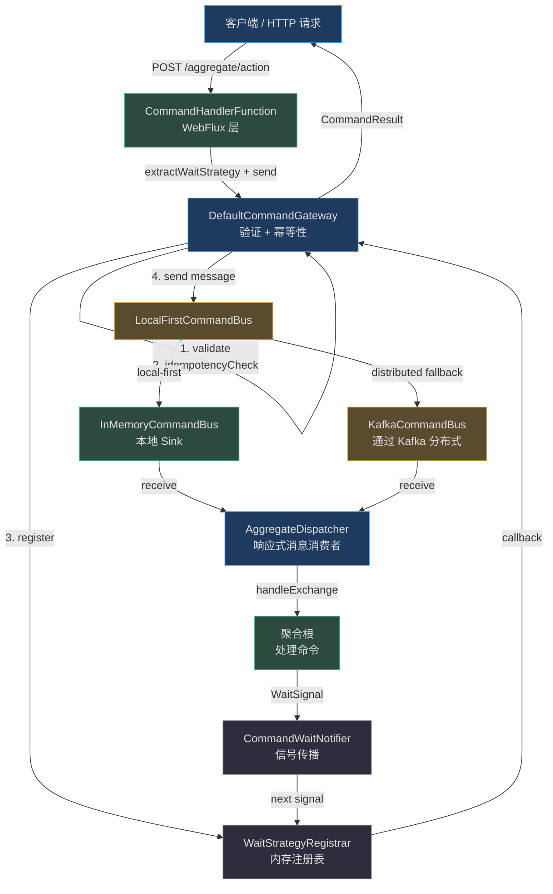
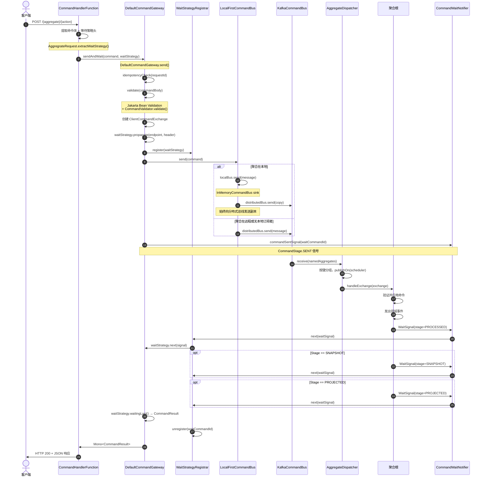
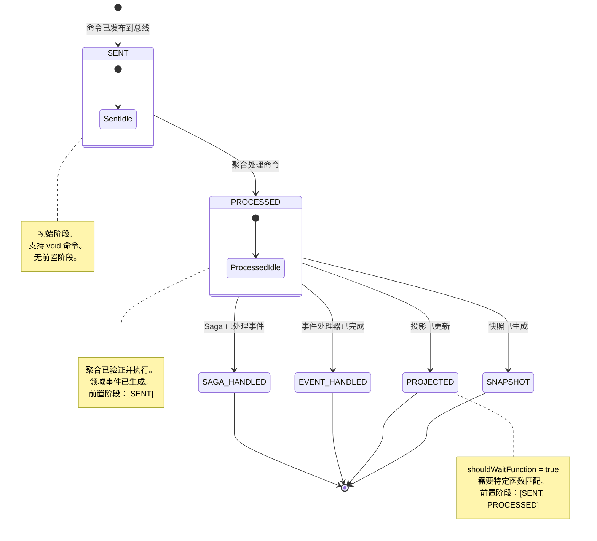
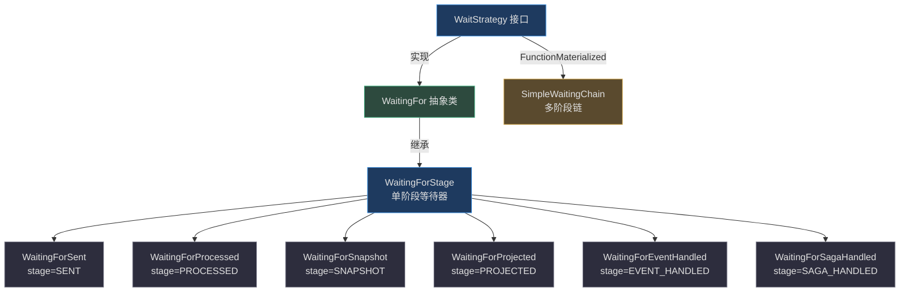

# 命令总线与网关

## 概览

命令总线和命令网关构成了 Wow CQRS 架构的写入侧主干。它们共同处理命令的完整生命周期：从 HTTP 端点到达开始，经过验证和幂等性检查，穿越消息总线到达目标聚合，然后带着处理结果返回给调用者。

整个流程可以总结为五个阶段：

1. **入口** -- WebFlux 层中的 `CommandHandlerFunction` 从 HTTP 请求中提取命令体，并构造 `CommandMessage`。
2. **验证与幂等性** -- `DefaultCommandGateway` 通过 Jakarta Bean Validation 验证命令体，并检查 request-id 唯一性。
3. **路由** -- 命令被分派到 `CommandBus`（内存、本地优先或 Kafka），由其交付到正确的 `AggregateDispatcher`。
4. **处理** -- 聚合根处理命令，发出领域事件，并发布完成信号 `WaitSignal`。
5. **响应** -- `WaitStrategy` 在配置的阶段收集信号，并将 `CommandResult` 返回给调用者。

::: tip 相关指南
有关实用 API 使用示例（curl 请求、便捷方法），请参阅[命令网关指南](../../guide/command-gateway.md)。
:::

## 概览

| 组件 | 职责 | 关键文件 | 来源 |
|---|---|---|---|
| `CommandMessage` | 封装命令体、聚合 ID、版本、幂等性元数据 | `wow-api/.../command/CommandMessage.kt` | [Source](https://github.com/Ahoo-Wang/Wow/blob/main/wow-api/src/main/kotlin/me/ahoo/wow/api/command/CommandMessage.kt#L53) |
| `CommandGateway` | 高级发送 API，包含验证、幂等性、等待策略 | `wow-core/.../command/CommandGateway.kt` | [Source](https://github.com/Ahoo-Wang/Wow/blob/main/wow-core/src/main/kotlin/me/ahoo/wow/command/CommandGateway.kt#L75) |
| `DefaultCommandGateway` | `CommandGateway` 的具体实现 | `wow-core/.../command/DefaultCommandGateway.kt` | [Source](https://github.com/Ahoo-Wang/Wow/blob/main/wow-core/src/main/kotlin/me/ahoo/wow/command/DefaultCommandGateway.kt#L45) |
| `CommandBus` | 路由命令的核心消息总线抽象 | `wow-core/.../command/CommandBus.kt` | [Source](https://github.com/Ahoo-Wang/Wow/blob/main/wow-core/src/main/kotlin/me/ahoo/wow/command/CommandBus.kt#L36) |
| `InMemoryCommandBus` | 使用 Reactor sink（单播）的本地内存总线 | `wow-core/.../command/InMemoryCommandBus.kt` | [Source](https://github.com/Ahoo-Wang/Wow/blob/main/wow-core/src/main/kotlin/me/ahoo/wow/command/InMemoryCommandBus.kt#L31) |
| `LocalFirstCommandBus` | 先尝试本地总线，失败后回退到分布式 | `wow-core/.../command/LocalFirstCommandBus.kt` | [Source](https://github.com/Ahoo-Wang/Wow/blob/main/wow-core/src/main/kotlin/me/ahoo/wow/command/LocalFirstCommandBus.kt#L29) |
| `KafkaCommandBus` | 基于 Apache Kafka 的分布式命令总线 | `wow-kafka/.../KafkaCommandBus.kt` | [Source](https://github.com/Ahoo-Wang/Wow/blob/main/wow-kafka/src/main/kotlin/me/ahoo/wow/kafka/KafkaCommandBus.kt#L27) |
| `WaitStrategy` | 定义等待命令结果的时间和阶段 | `wow-core/.../command/wait/WaitStrategy.kt` | [Source](https://github.com/Ahoo-Wang/Wow/blob/main/wow-core/src/main/kotlin/me/ahoo/wow/command/wait/WaitStrategy.kt#L60) |
| `WaitingForStage` | 单阶段等待策略（SENT, PROCESSED, SNAPSHOT 等） | `wow-core/.../command/wait/stage/WaitingForStage.kt` | [Source](https://github.com/Ahoo-Wang/Wow/blob/main/wow-core/src/main/kotlin/me/ahoo/wow/command/wait/stage/WaitingForStage.kt#L33) |
| `SimpleWaitingChain` | 多阶段链（例如，先 SAGA_HANDLED 再 SNAPSHOT） | `wow-core/.../command/wait/chain/SimpleWaitingChain.kt` | [Source](https://github.com/Ahoo-Wang/Wow/blob/main/wow-core/src/main/kotlin/me/ahoo/wow/command/wait/chain/SimpleWaitingChain.kt#L36) |
| `CommandResult` | 持有命令处理最终结果的不变数据类 | `wow-core/.../command/CommandResult.kt` | [Source](https://github.com/Ahoo-Wang/Wow/blob/main/wow-core/src/main/kotlin/me/ahoo/wow/command/CommandResult.kt#L69) |
| `CommandHandlerFunction` | 连接 HTTP 与 `CommandGateway` 的 Spring WebFlux 处理器 | `wow-webflux/.../command/CommandHandlerFunction.kt` | [Source](https://github.com/Ahoo-Wang/Wow/blob/main/wow-webflux/src/main/kotlin/me/ahoo/wow/webflux/route/command/CommandHandlerFunction.kt#L39) |
| `AggregateDispatcher` | 按聚合消费总线消息的响应式调度器 | `wow-core/.../messaging/dispatcher/AggregateDispatcher.kt` | [Source](https://github.com/Ahoo-Wang/Wow/blob/main/wow-core/src/main/kotlin/me/ahoo/wow/messaging/dispatcher/AggregateDispatcher.kt#L80) |

## 架构

命令基础设施建立在分层架构之上，分离了 API 契约、网关（验证/幂等性）、消息总线（传输）和聚合调度器（处理）的关注点。

### 消息总线层次结构

`MessageBus` 接口定义了基本契约：发送（`send`）消息并为一组命名聚合接收（`receive`）消息。它被特化为三个层级：

| 总线类型 | 接口 | 用途 | 来源 |
|---|---|---|---|
| **本地** | `LocalMessageBus` | 单 JVM、基于 Reactor `Sinks` 的内存消息传递 | [MessageBus.kt:64](https://github.com/Ahoo-Wang/Wow/blob/main/wow-core/src/main/kotlin/me/ahoo/wow/messaging/MessageBus.kt#L64) |
| **分布式** | `DistributedMessageBus` | 跨实例消息传递（Kafka） | [MessageBus.kt:83](https://github.com/Ahoo-Wang/Wow/blob/main/wow-core/src/main/kotlin/me/ahoo/wow/messaging/MessageBus.kt#L83) |
| **本地优先** | `LocalFirstMessageBus` | 混合模式：优先本地总线，分布式回退 | [LocalFirstMessageBus.kt:99](https://github.com/Ahoo-Wang/Wow/blob/main/wow-core/src/main/kotlin/me/ahoo/wow/messaging/LocalFirstMessageBus.kt#L99) |

在命令域中，`CommandBus` 扩展 `MessageBus`（固定 `TopicKind.COMMAND`）并缩窄泛型类型：

- `LocalCommandBus` 同时扩展 `CommandBus` 和 `LocalMessageBus`。
- `DistributedCommandBus` 同时扩展 `CommandBus` 和 `DistributedMessageBus`。
- `LocalFirstCommandBus` 扩展 `CommandBus` 并使用 `LocalFirstMessageBus` 代理，自动对 void 命令禁用本地优先。

### 组件架构



<!-- Sources:
- CommandHandlerFunction: wow-webflux/src/main/kotlin/me/ahoo/wow/webflux/route/command/CommandHandlerFunction.kt:39-63
- DefaultCommandGateway: wow-core/src/main/kotlin/me/ahoo/wow/command/DefaultCommandGateway.kt:45-246
- LocalFirstCommandBus: wow-core/src/main/kotlin/me/ahoo/wow/command/LocalFirstCommandBus.kt:29-47
- InMemoryCommandBus: wow-core/src/main/kotlin/me/ahoo/wow/command/InMemoryCommandBus.kt:31-50
- KafkaCommandBus: wow-kafka/src/main/kotlin/me/ahoo/wow/kafka/KafkaCommandBus.kt:27-45
- AggregateDispatcher: wow-core/src/main/kotlin/me/ahoo/wow/messaging/dispatcher/AggregateDispatcher.kt:80-275
- WaitStrategyRegistrar: wow-core/src/main/kotlin/me/ahoo/wow/command/wait/WaitStrategyRegistrar.kt:24-101
-->

## 命令处理链

以下序列图追踪了命令从 HTTP 请求到达开始，经历每个处理阶段直到最终 `CommandResult` 的完整路径。每一步都标注了负责的文件和方法。



<!-- Sources:
- CommandHandler.handle(): wow-webflux/src/main/kotlin/me/ahoo/wow/webflux/route/command/CommandHandler.kt:26-60
- DefaultCommandGateway.send(): wow-core/src/main/kotlin/me/ahoo/wow/command/DefaultCommandGateway.kt:114-126
- DefaultCommandGateway.send(with waitStrategy): wow-core/src/main/kotlin/me/ahoo/wow/command/DefaultCommandGateway.kt:205-245
- LocalFirstCommandBus.send(): wow-core/src/main/kotlin/me/ahoo/wow/command/LocalFirstCommandBus.kt:41-46
- LocalFirstMessageBus.send(): wow-core/src/main/kotlin/me/ahoo/wow/messaging/LocalFirstMessageBus.kt:130-149
- AbstractKafkaBus.receive(): wow-kafka/src/main/kotlin/me/ahoo/wow/kafka/AbstractKafkaBus.kt:78-95
- AggregateDispatcher.start(): wow-core/src/main/kotlin/me/ahoo/wow/messaging/dispatcher/AggregateDispatcher.kt:163-173
-->

## 等待策略

等待策略是将调用者与命令处理结果同步的机制。在 CQRS 系统中，命令和查询是分离的——写入侧可能是最终一致性的。等待策略通过允许调用者指定等待结果的**时长**和**阶段**来弥合这一差距。

### CommandStage 状态机

`CommandStage` 枚举定义了六个处理里程碑。每个阶段通过 `previous` 属性声明其前置阶段，形成一个有向依赖图。



<!-- Sources:
- CommandStage enum: wow-core/src/main/kotlin/me/ahoo/wow/command/wait/CommandStage.kt:25-123
- CommandStage.isPrevious(): wow-core/src/main/kotlin/me/ahoo/wow/command/wait/CommandStage.kt:120-122
- CommandStage.shouldNotify(): wow-core/src/main/kotlin/me/ahoo/wow/command/wait/CommandStage.kt:110-112
-->

### 等待策略层次结构



<!-- Sources:
- WaitStrategy interface: wow-core/src/main/kotlin/me/ahoo/wow/command/wait/WaitStrategy.kt:60-176
- WaitingFor abstract class: wow-core/src/main/kotlin/me/ahoo/wow/command/wait/WaitingFor.kt:33-132
- WaitingForStage: wow-core/src/main/kotlin/me/ahoo/wow/command/wait/stage/WaitingForStage.kt:33-155
- SimpleWaitingChain: wow-core/src/main/kotlin/me/ahoo/wow/command/wait/chain/SimpleWaitingChain.kt:36-107
- WaitingForSent: wow-core/src/main/kotlin/me/ahoo/wow/command/wait/stage/WaitingForSent.kt:25-32
- WaitingForProcessed: wow-core/src/main/kotlin/me/ahoo/wow/command/wait/stage/WaitingForProcessed.kt:25-30
-->

### 等待阶段对比

| 阶段 | 枚举值 | 前置阶段 | 返回时机 | 支持 Void 命令 | `shouldWaitFunction` | 典型用例 | 来源 |
|---|---|---|---|---|---|---|---|
| `SENT` | `CommandStage.SENT` | 无 | 命令被总线/队列接受 | 是 | 否 | 发后即忘；最快响应 | [CommandStage.kt:32](https://github.com/Ahoo-Wang/Wow/blob/main/wow-core/src/main/kotlin/me/ahoo/wow/command/wait/CommandStage.kt#L32) |
| `PROCESSED` | `CommandStage.PROCESSED` | `[SENT]` | 聚合完成执行 | 否 | 否 | 默认；速度与一致性的平衡 | [CommandStage.kt:40](https://github.com/Ahoo-Wang/Wow/blob/main/wow-core/src/main/kotlin/me/ahoo/wow/command/wait/CommandStage.kt#L40) |
| `SNAPSHOT` | `CommandStage.SNAPSHOT` | `[SENT, PROCESSED]` | 快照已持久化 | 否 | 否 | 冷启动性能；写后读 | [CommandStage.kt:53](https://github.com/Ahoo-Wang/Wow/blob/main/wow-core/src/main/kotlin/me/ahoo/wow/command/wait/CommandStage.kt#L53) |
| `PROJECTED` | `CommandStage.PROJECTED` | `[SENT, PROCESSED]` | 投影（读模型）已更新 | 否 | 是 | 读模型一致性；UI 刷新 | [CommandStage.kt:62](https://github.com/Ahoo-Wang/Wow/blob/main/wow-core/src/main/kotlin/me/ahoo/wow/command/wait/CommandStage.kt#L62) |
| `EVENT_HANDLED` | `CommandStage.EVENT_HANDLED` | `[SENT, PROCESSED]` | 外部事件处理器已完成 | 否 | 是 | 副作用处理；通知 | [CommandStage.kt:72](https://github.com/Ahoo-Wang/Wow/blob/main/wow-core/src/main/kotlin/me/ahoo/wow/command/wait/CommandStage.kt#L72) |
| `SAGA_HANDLED` | `CommandStage.SAGA_HANDLED` | `[SENT, PROCESSED]` | Saga 已完成处理事件 | 否 | 是 | 分布式事务完成 | [CommandStage.kt:83](https://github.com/Ahoo-Wang/Wow/blob/main/wow-core/src/main/kotlin/me/ahoo/wow/command/wait/CommandStage.kt#L83) |

`shouldWaitFunction = true` 的阶段（`PROJECTED`、`EVENT_HANDLED`、`SAGA_HANDLED`）会应用额外的过滤：`WaitStrategy.FunctionMaterialized.shouldNotify(signal)` 方法检查信号的函数元数据是否与预期的函数名、上下文名和处理器名匹配。当多个投影器或事件处理器作用于同一聚合时，这至关重要——等待策略仅在**特定**函数完成时才完成，而非任意一个。

### 等待链

对于调用者需要跨越多个阶段等待的场景（例如，等待 Saga 完成**然后**再等待快照），`SimpleWaitingChain` 组合两个阶段：

1. **主阶段**：始终是 `SAGA_HANDLED`，带有特定的函数过滤器（例如，`TransferSaga.onEvent`）。
2. **尾阶段**：在主阶段完成后完成的第二阶段/函数对（例如，目标账户的 `SNAPSHOT`）。

这通过 HTTP 头 `Command-Wait-Stage: SAGA_HANDLED` 结合 `Command-Wait-Tail-Stage: SNAPSHOT` 和 `Command-Wait-Tail-Processor: TransferSaga` 进行配置。

## 命令网关

### 接口

`CommandGateway` 接口位于 [CommandGateway.kt:75](https://github.com/Ahoo-Wang/Wow/blob/main/wow-core/src/main/kotlin/me/ahoo/wow/command/CommandGateway.kt#L75)，它扩展 `CommandBus` 并添加三个 API 层级：

| 方法 | 返回类型 | 行为 | 来源 |
|---|---|---|---|
| `send(command, waitStrategy)` | `Mono<ClientCommandExchange>` | 带等待策略发送；返回 exchange 供自定义追踪 | [CommandGateway.kt:89](https://github.com/Ahoo-Wang/Wow/blob/main/wow-core/src/main/kotlin/me/ahoo/wow/command/CommandGateway.kt#L89) |
| `sendAndWait(command, waitStrategy)` | `Mono<CommandResult>` | 发送并阻塞直到最终结果；失败时抛出 `CommandResultException` | [CommandGateway.kt:127](https://github.com/Ahoo-Wang/Wow/blob/main/wow-core/src/main/kotlin/me/ahoo/wow/command/CommandGateway.kt#L127) |
| `sendAndWaitStream(command, waitStrategy)` | `Flux<CommandResult>` | 发送并流式传输所有中间结果 | [CommandGateway.kt:107](https://github.com/Ahoo-Wang/Wow/blob/main/wow-core/src/main/kotlin/me/ahoo/wow/command/CommandGateway.kt#L107) |

为三个最常见阶段提供了便捷方法：

| 方法 | 等效等待阶段 | 来源 |
|---|---|---|
| `sendAndWaitForSent(command)` | `CommandStage.SENT` | [CommandGateway.kt:145](https://github.com/Ahoo-Wang/Wow/blob/main/wow-core/src/main/kotlin/me/ahoo/wow/command/CommandGateway.kt#L145) |
| `sendAndWaitForProcessed(command)` | `CommandStage.PROCESSED` | [CommandGateway.kt:160](https://github.com/Ahoo-Wang/Wow/blob/main/wow-core/src/main/kotlin/me/ahoo/wow/command/CommandGateway.kt#L160) |
| `sendAndWaitForSnapshot(command)` | `CommandStage.SNAPSHOT` | [CommandGateway.kt:176](https://github.com/Ahoo-Wang/Wow/blob/main/wow-core/src/main/kotlin/me/ahoo/wow/command/CommandGateway.kt#L176) |

### DefaultCommandGateway：发送前管道

`DefaultCommandGateway` 在命令到达总线之前强制执行严格的发送前管道：

1. **幂等性检查** -- 获取聚合类型的 `IdempotencyChecker`，检查 `requestId` 是否已被处理。如果已处理，立即抛出 `DuplicateRequestIdException`。

2. **验证** -- 两阶段验证：
   - **自验证**：如果命令体实现 `CommandValidator`，首先调用其 `validate()` 方法。这允许领域特定的编程式验证。
   - **Jakarta Bean Validation**：通过配置的 `jakarta.validation.Validator` 验证命令体的 `@NotBlank`、`@Min`、`@Max` 和其他 Jakarta 注解。

两项检查均在 `check()` 方法中实现，位于 [DefaultCommandGateway.kt:99](https://github.com/Ahoo-Wang/Wow/blob/main/wow-core/src/main/kotlin/me/ahoo/wow/command/DefaultCommandGateway.kt#L99)。

### DefaultCommandGateway：发送后信号

命令被命令总线接受后，网关通过 `CommandWaitNotifier` 发布 `CommandStage.SENT` 等待信号。无论成功或失败，都会发布此信号——如果在发送过程中发生错误，信号将携带错误信息。

对于重载的 `send(message)`（无显式 `WaitStrategy`），网关从消息头中提取等待策略（如果有传播的话）并发布 SENT 信号。参见 [DefaultCommandGateway.kt:114-126](https://github.com/Ahoo-Wang/Wow/blob/main/wow-core/src/main/kotlin/me/ahoo/wow/command/DefaultCommandGateway.kt#L114)。

## 命令总线实现

### InMemoryCommandBus

最简单的总线 -- 使用 Reactor `Sinks.Many`（单播，背压缓冲）在单个 JVM 内交付命令。每个命名聚合获得自己的 sink，确保精确一次消费者语义。sink 提供者可配置，默认为单播。

```kotlin
// Source: wow-core/src/main/kotlin/me/ahoo/wow/command/InMemoryCommandBus.kt:31-50
class InMemoryCommandBus(
    override val sinkSupplier: (NamedAggregate) -> Many<CommandMessage<*>> = {
        Sinks.unsafe().many().unicast().onBackpressureBuffer<CommandMessage<*>>().concurrent()
    }
) : InMemoryMessageBus<CommandMessage<*>, ServerCommandExchange<*>>(),
    LocalCommandBus
```

### KafkaCommandBus

分布式命令总线使用 Apache Kafka 作为传输层。它扩展 `AbstractKafkaBus`，后者处理序列化（通过 `toJsonString`/`toObject` 进行 JSON 序列化）、主题路由和消费者组管理。

```kotlin
// Source: wow-kafka/src/main/kotlin/me/ahoo/wow/kafka/KafkaCommandBus.kt:27-45
class KafkaCommandBus(
    topicConverter: CommandTopicConverter = DefaultCommandTopicConverter(),
    senderOptions: SenderOptions<String, String>,
    receiverOptions: ReceiverOptions<String, String>,
    receiverOptionsCustomizer: ReceiverOptionsCustomizer = NoOpReceiverOptionsCustomizer
) : DistributedCommandBus, AbstractKafkaBus<CommandMessage<*>, ServerCommandExchange<*>>(...)
```

关键实现细节：
- 消息被序列化为 JSON 字符串，聚合 ID 作为 Kafka 消息键以确保分区内有序。
- 消费者组按限界上下文分配以隔离消息流。
- 对接收错误应用默认重试规范（`Retry.backoff(3, Duration.ofSeconds(10))`）。
- `KafkaServerCommandExchange` 包装 Kafka `ReceiverOffset` 用于确认控制。

### LocalFirstCommandBus：最小化网络 IO

`LocalFirstCommandBus` 是生产部署的推荐配置。它包装一个 `LocalCommandBus`（通常是 `InMemoryCommandBus`）和一个 `DistributedCommandBus`（通常是 `KafkaCommandBus`），采用**本地优先路由策略**：

1. 如果聚合在本地**且**存在本地订阅者，命令首先发送到本地总线，并且始终将副本转发到分布式总线。
2. 如果本地发送失败，分布式副本上的本地优先标志被清除，以便远程实例处理。
3. 如果聚合不在本地或无本地订阅者，命令仅发送到分布式总线。
4. Void 命令自动跳过本地优先路由，因为它们不需要响应。

这种设计确保了在本地 JVM 内的至多一次处理以及跨集群的精确一次处理——这是 CQRS 系统中的核心关注点，丢失命令意味着丢失状态转换。

## HTTP 集成（WebFlux）

### 请求处理流程

`CommandHandlerFunction` 是一个 Spring WebFlux `HandlerFunction`，在 HTTP 请求和 `CommandGateway` 之间架起桥梁：

1. **请求体提取**：根据命令是否有路径变量或头变量，通过 `request.bodyToMono()` 或自定义的 `CommandBodyExtractor` 提取请求体。

2. **命令消息构造**：`CommandMessageExtractor` 从聚合路由元数据、请求头和命令体构建 `CommandMessage`。

3. **等待策略提取**：`ServerRequest.extractWaitStrategy()` 扩展函数读取以下 HTTP 头：

| 头 | 用途 | 默认值 | 来源 |
|---|---|---|---|
| `Command-Wait-Stage` | 等待的 `CommandStage` | `PROCESSED` | [AggregateRequest.kt:112](https://github.com/Ahoo-Wang/Wow/blob/main/wow-webflux/src/main/kotlin/me/ahoo/wow/webflux/route/command/AggregateRequest.kt#L112) |
| `Command-Wait-Context` | 函数过滤的限界上下文名称 | 当前上下文 | [AggregateRequest.kt:117](https://github.com/Ahoo-Wang/Wow/blob/main/wow-webflux/src/main/kotlin/me/ahoo/wow/webflux/route/command/AggregateRequest.kt#L117) |
| `Command-Wait-Processor` | 函数过滤的处理器名称 | （空） | [AggregateRequest.kt:121](https://github.com/Ahoo-Wang/Wow/blob/main/wow-webflux/src/main/kotlin/me/ahoo/wow/webflux/route/command/AggregateRequest.kt#L121) |
| `Command-Wait-Function` | 函数过滤的函数名称 | （空） | [AggregateRequest.kt:125](https://github.com/Ahoo-Wang/Wow/blob/main/wow-webflux/src/main/kotlin/me/ahoo/wow/webflux/route/command/AggregateRequest.kt#L125) |
| `Command-Wait-Tail-Stage` | `SimpleWaitingChain` 的尾阶段 | `null` | [AggregateRequest.kt:131](https://github.com/Ahoo-Wang/Wow/blob/main/wow-webflux/src/main/kotlin/me/ahoo/wow/webflux/route/command/AggregateRequest.kt#L131) |
| `Command-Wait-Tail-Context` | 链的尾上下文 | 当前上下文 | [AggregateRequest.kt:137](https://github.com/Ahoo-Wang/Wow/blob/main/wow-webflux/src/main/kotlin/me/ahoo/wow/webflux/route/command/AggregateRequest.kt#L137) |
| `Command-Wait-Tail-Processor` | 链的尾处理器 | （空） | [AggregateRequest.kt:141](https://github.com/Ahoo-Wang/Wow/blob/main/wow-webflux/src/main/kotlin/me/ahoo/wow/webflux/route/command/AggregateRequest.kt#L141) |
| `Command-Wait-Tail-Function` | 链的尾函数 | （空） | [AggregateRequest.kt:145](https://github.com/Ahoo-Wang/Wow/blob/main/wow-webflux/src/main/kotlin/me/ahoo/wow/webflux/route/command/AggregateRequest.kt#L145) |
| `Command-Wait-Timeout` | 超时毫秒数 | `30000`（30秒） | [AggregateRequest.kt:104](https://github.com/Ahoo-Wang/Wow/blob/main/wow-webflux/src/main/kotlin/me/ahoo/wow/webflux/route/command/AggregateRequest.kt#L104) |
| `Command-Request-Id` | 幂等性请求 ID | （生成） | [AggregateRequest.kt:48](https://github.com/Ahoo-Wang/Wow/blob/main/wow-webflux/src/main/kotlin/me/ahoo/wow/webflux/route/command/AggregateRequest.kt#L48) |
| `Command-Aggregate-Id` | 目标聚合实例 ID | （来自命令体或路径） | [AggregateRequest.kt:69](https://github.com/Ahoo-Wang/Wow/blob/main/wow-webflux/src/main/kotlin/me/ahoo/wow/webflux/route/command/AggregateRequest.kt#L69) |
| `Accept` | 响应格式（`text/event-stream` 触发 SSE） | `application/json` | [AggregateRequest.kt:100](https://github.com/Ahoo-Wang/Wow/blob/main/wow-webflux/src/main/kotlin/me/ahoo/wow/webflux/route/command/AggregateRequest.kt#L100) |

4. **分发**：如果 `Accept` 头为 `text/event-stream`，使用 `sendAndWaitStream`（SSE 流）；否则使用 `sendAndWait`（单一 JSON 响应）。响应式流应用可配置的超时（默认 30 秒）。

### 命令路由生成

命令类上的 `@CommandRoute` 注解指示 KSP 编译器（`wow-compiler`）在编译时生成 REST 端点元数据：

```kotlin
// Source: wow-api/src/main/kotlin/me/ahoo/wow/api/annotation/CommandRoute.kt:59-155
@CommandRoute(
    action = "create",
    method = CommandRoute.Method.POST,
    appendIdPath = CommandRoute.AppendPath.NEVER,
    appendTenantPath = CommandRoute.AppendPath.ALWAYS
)
data class CreateOrderCommand(...)
// 生成: POST /orders/tenant/{tenantId}/create
```

`@PathVariable` 和 `@HeaderVariable` 子注解将 HTTP 路径段和头直接映射到命令字段，无需样板代码即可生成丰富的 REST 端点。

## 命令结果

`CommandResult` 数据类是命令处理的最终输出。它实现多个接口以携带标识、错误信息和函数元数据。

| 属性 | 类型 | 描述 | 来源 |
|---|---|---|---|
| `id` | `String` | 唯一结果标识符 | [CommandResult.kt:69](https://github.com/Ahoo-Wang/Wow/blob/main/wow-core/src/main/kotlin/me/ahoo/wow/command/CommandResult.kt#L69) |
| `waitCommandId` | `String` | 调用者等待的命令 ID | [CommandResult.kt:69](https://github.com/Ahoo-Wang/Wow/blob/main/wow-core/src/main/kotlin/me/ahoo/wow/command/CommandResult.kt#L69) |
| `stage` | `CommandStage` | 此结果代表的处理阶段 | [CommandResult.kt:69](https://github.com/Ahoo-Wang/Wow/blob/main/wow-core/src/main/kotlin/me/ahoo/wow/command/CommandResult.kt#L69) |
| `aggregateVersion` | `Int?` | 网关失败时为 `null`，处理器失败时为当前版本，成功时为新版本 | [CommandResult.kt:69](https://github.com/Ahoo-Wang/Wow/blob/main/wow-core/src/main/kotlin/me/ahoo/wow/command/CommandResult.kt#L69) |
| `errorCode` | `String` | 成功时为 `"Ok"`；失败时为错误码 | [CommandResult.kt:69](https://github.com/Ahoo-Wang/Wow/blob/main/wow-core/src/main/kotlin/me/ahoo/wow/command/CommandResult.kt#L69) |
| `bindingErrors` | `List<BindingError>` | Jakarta 验证约束违规 | [CommandResult.kt:69](https://github.com/Ahoo-Wang/Wow/blob/main/wow-core/src/main/kotlin/me/ahoo/wow/command/CommandResult.kt#L69) |
| `result` | `Map<String, Any>` | 处理过程中的额外键值数据 | [CommandResult.kt:69](https://github.com/Ahoo-Wang/Wow/blob/main/wow-core/src/main/kotlin/me/ahoo/wow/command/CommandResult.kt#L69) |

`CommandResult` 通过 `toResult()` 扩展函数从 `WaitSignal` 创建，该函数将信号字段映射到结果字段并添加原始命令消息的 `requestId`。

## 错误处理

命令网关按失败类别产生三种异常类型：

| 异常 | 抛出时机 | 包含内容 | 来源 |
|---|---|---|---|
| `DuplicateRequestIdException` | 相同 `requestId` 的命令已被处理 | `aggregateId`、`requestId` | [CommandExceptions.kt:39](https://github.com/Ahoo-Wang/Wow/blob/main/wow-core/src/main/kotlin/me/ahoo/wow/command/CommandExceptions.kt#L39) |
| `CommandValidationException` | Jakarta Bean Validation 或 `CommandValidator.validate()` 失败 | `command` 对象、`bindingErrors` | [CommandExceptions.kt:90](https://github.com/Ahoo-Wang/Wow/blob/main/wow-core/src/main/kotlin/me/ahoo/wow/command/CommandExceptions.kt#L90) |
| `CommandResultException` | 命令在聚合处理期间失败 | 完整的 `CommandResult`，包含 `errorCode`、`errorMsg`、`bindingErrors` | [CommandExceptions.kt:63](https://github.com/Ahoo-Wang/Wow/blob/main/wow-core/src/main/kotlin/me/ahoo/wow/command/CommandExceptions.kt#L63) |

位于 [DefaultCommandGateway.kt:166](https://github.com/Ahoo-Wang/Wow/blob/main/wow-core/src/main/kotlin/me/ahoo/wow/command/DefaultCommandGateway.kt#L166) 的 `sendAndWait` 方法检查 `commandResult.succeeded`，如果结果表示失败则抛出 `CommandResultException`。发送前阶段（幂等性、验证）的错误直接抛出。总线发送期间的错误在 [DefaultCommandGateway.kt:236-244](https://github.com/Ahoo-Wang/Wow/blob/main/wow-core/src/main/kotlin/me/ahoo/wow/command/DefaultCommandGateway.kt#L236) 处包装为 `CommandResultException`。

## 配置

以下 YAML 配置控制命令总线和网关的行为：

```yaml
wow:
  command:
    bus:
      type: kafka                    # "in_memory" | "kafka"
      local-first:
        enabled: true                # 启用 LocalFirst 路由（默认: true）
    idempotency:
      enabled: true                  # 启用 request-id 幂等性检查（默认: true）
      bloom-filter:
        expected-insertions: 1000000 # Bloom 过滤器的预期插入量
        ttl: PT60S                   # 幂等性条目的生存时间（ISO-8601 时长）
        fpp: 0.00001                 # Bloom 过滤器的误报概率
```

| 配置路径 | 类型 | 默认值 | 描述 | 来源模块 |
|---|---|---|---|---|
| `wow.command.bus.type` | `String` | `kafka` | 命令总线实现：`in_memory` 或 `kafka` | `wow-spring-boot-starter` |
| `wow.command.bus.local-first.enabled` | `Boolean` | `true` | 是否使用 `LocalFirstCommandBus` 进行本地回退 | `wow-spring-boot-starter` |
| `wow.command.idempotency.enabled` | `Boolean` | `true` | 是否在发送前检查 `requestId` 是否重复 | `wow-spring-boot-starter` |
| `wow.command.idempotency.bloom-filter.expected-insertions` | `Long` | `1000000` | 幂等性检查中使用的 Bloom 过滤器的容量规划 | `wow-spring-boot-starter` |
| `wow.command.idempotency.bloom-filter.ttl` | `Duration` | `PT60S` | 幂等性检查器记住 `requestId` 的时长 | `wow-spring-boot-starter` |
| `wow.command.idempotency.bloom-filter.fpp` | `Double` | `0.00001` | 可接受的误报概率（越低 = 更多内存） | `wow-spring-boot-starter` |

## 相关页面

| 页面 | 描述 |
|---|---|
| [命令网关指南](../../guide/command-gateway.md) | 实用 API 用法、curl 示例和错误处理模式 |
| [聚合与领域事件](./aggregate.md) | 命令如何交付到聚合并转化为领域事件 |
| [Saga 编排](../saga/saga-orchestration.md) | `SAGA_HANDLED` 等待阶段如何融入分布式事务流程 |
| [投影处理器](../projection/projection-processors.md) | `PROJECTED` 等待阶段如何与读模型更新同步 |
| [Spring Boot 集成](../integrations/spring-boot.md) | `CommandGateway`、`CommandBus` 和调度器的自动配置 |
| [架构概览](./overview.md) | 高层系统架构和模块图 |
