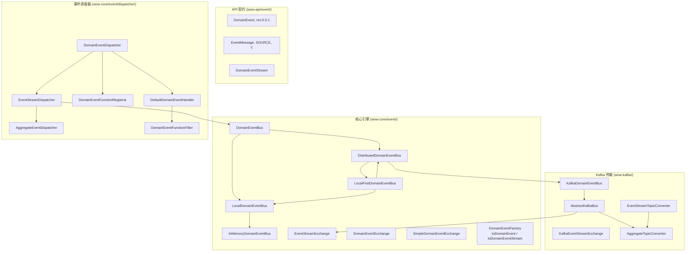
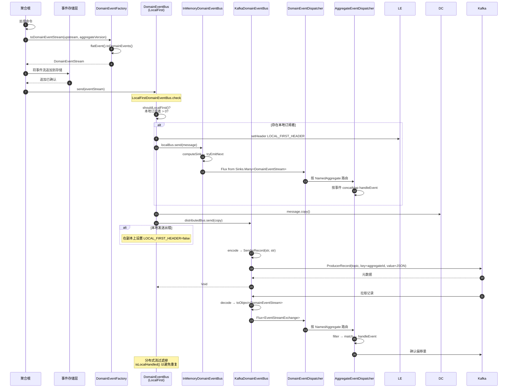
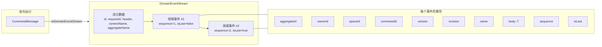
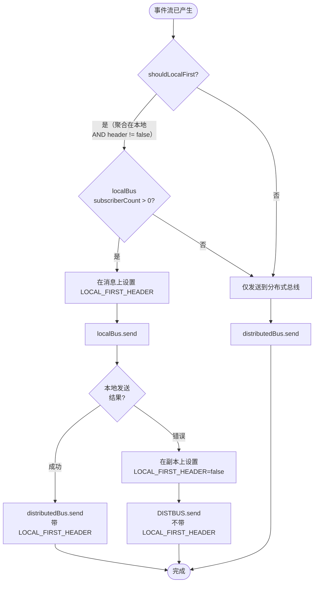
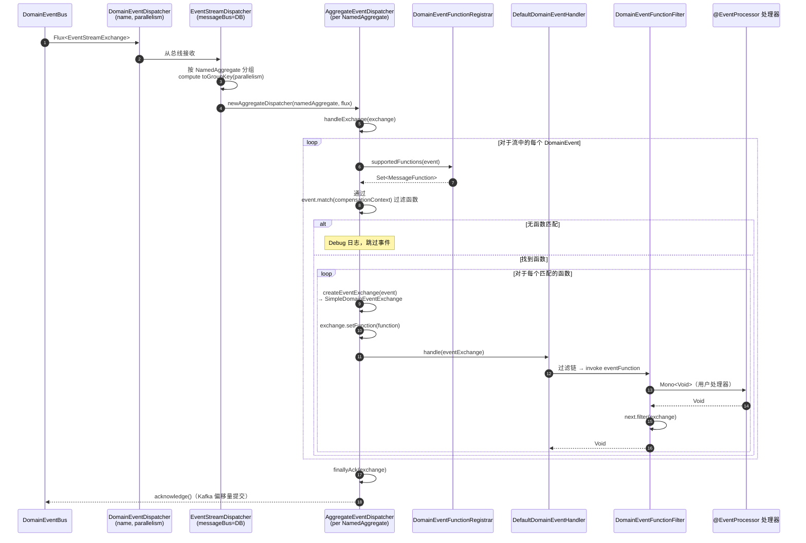

# 事件总线

事件总线是 Wow 事件驱动架构的中枢神经系统。它从聚合处理命令后接收**领域事件流**，并将其路由到所有感兴趣的消费者 -- 投影、Saga、事件处理器和外部系统。总线保证**每个聚合 ID 的有序交付**，因此消费者始终以事件产生的确切顺序看到它们。

## 架构概览

事件总线建立在分层抽象之上，将**做什么**（领域事件传输）与**如何做**（内存、Kafka、Redis）解耦。每个总线实现都从相同的基础契约开始，并在从本地到分布式的过程中获得额外能力。



<!-- Sources:
DomainEventBus.kt: wow-core/src/main/kotlin/me/ahoo/wow/event/DomainEventBus.kt:13-97
InMemoryDomainEventBus.kt: wow-core/src/main/kotlin/me/ahoo/wow/event/InMemoryDomainEventBus.kt:13-54
LocalFirstDomainEventBus.kt: wow-core/src/main/kotlin/me/ahoo/wow/event/LocalFirstDomainEventBus.kt:14-42
KafkaDomainEventBus.kt: wow-kafka/src/main/kotlin/me/ahoo/wow/kafka/KafkaDomainEventBus.kt:13-41
AbstractKafkaBus.kt: wow-kafka/src/main/kotlin/me/ahoo/wow/kafka/AbstractKafkaBus.kt:14-131
DomainEventDispatcher.kt: wow-core/src/main/kotlin/me/ahoo/wow/event/dispatcher/DomainEventDispatcher.kt:14-84
EventStreamDispatcher.kt: wow-core/src/main/kotlin/me/ahoo/wow/event/dispatcher/EventStreamDispatcher.kt:14-49
DomainEvent.kt: wow-api/src/main/kotlin/me/ahoo/wow/api/event/DomainEvent.kt:14-95
EventMessage.kt: wow-api/src/main/kotlin/me/ahoo/wow/api/event/EventMessage.kt:14-79
DomainEventStream.kt: wow-core/src/main/kotlin/me/ahoo/wow/event/DomainEventStream.kt:13-148
-->

这种分层设计允许框架在本地处理事件（单 JVM，零网络开销）或在分布式集群中（Kafka 支持，多节点）使用**相同的总线契约**。默认部署使用 `LocalFirstDomainEventBus`，它结合了两种策略。

## 核心接口

事件总线类型层次结构从泛化消息总线逐步构建到领域事件专用的契约：

| 接口 | 角色 | 扩展 | 来源 |
|---|---|---|---|
| `MessageBus<M, E>` | 基础契约：`send()` 和 `receive()` | `AutoCloseable` | [MessageBus.kt:31-53](https://github.com/Ahoo-Wang/Wow/blob/main/wow-core/src/main/kotlin/me/ahoo/wow/messaging/MessageBus.kt#L31-L53) |
| `DomainEventBus` | `DomainEventStream` 载荷的事件总线 | `MessageBus`、`TopicKindCapable` | [DomainEventBus.kt:39-44](https://github.com/Ahoo-Wang/Wow/blob/main/wow-core/src/main/kotlin/me/ahoo/wow/event/DomainEventBus.kt#L39-L44) |
| `LocalDomainEventBus` | 带订阅者计数的进程内总线 | `DomainEventBus`、`LocalMessageBus` | [DomainEventBus.kt:55-57](https://github.com/Ahoo-Wang/Wow/blob/main/wow-core/src/main/kotlin/me/ahoo/wow/event/DomainEventBus.kt#L55-L57) |
| `DistributedDomainEventBus` | 跨进程/跨节点总线 | `DomainEventBus`、`DistributedMessageBus` | [DomainEventBus.kt:68-70](https://github.com/Ahoo-Wang/Wow/blob/main/wow-core/src/main/kotlin/me/ahoo/wow/event/DomainEventBus.kt#L68-L70) |

所有领域事件总线的 `TopicKind` 始终为 `TOPIC_KIND.EVENT_STREAM`（[DomainEventBus.kt:42-43](https://github.com/Ahoo-Wang/Wow/blob/main/wow-core/src/main/kotlin/me/ahoo/wow/event/DomainEventBus.kt#L42-L43)），以区别于命令总线（`COMMAND`）和状态事件总线（`STATE`）。

### NoOpDomainEventBus

对于测试和有意禁用事件发布的场景，单例 `NoOpDomainEventBus`（[DomainEventBus.kt:81-97](https://github.com/Ahoo-Wang/Wow/blob/main/wow-core/src/main/kotlin/me/ahoo/wow/event/DomainEventBus.kt#L81-L97)）静默丢弃所有发送并在接收时返回空流。

## 事件发布与接收流程

从聚合命令处理到事件交付的端到端流程遵循发布-订阅模型，并进行每个聚合的有序交付。



<!-- Sources:
DomainEventStreamFactory.kt: wow-core/src/main/kotlin/me/ahoo/wow/event/DomainEventStreamFactory.kt:79-114
LocalFirstMessageBus.kt: wow-core/src/main/kotlin/me/ahoo/wow/messaging/LocalFirstMessageBus.kt:99-171
InMemoryDomainEventBus.kt: wow-core/src/main/kotlin/me/ahoo/wow/event/InMemoryDomainEventBus.kt:13-54
AbstractKafkaBus.kt: wow-kafka/src/main/kotlin/me/ahoo/wow/kafka/AbstractKafkaBus.kt:52-95
AbstractAggregateEventDispatcher.kt: wow-core/src/main/kotlin/me/ahoo/wow/event/dispatcher/AbstractAggregateEventDispatcher.kt:49-139
KafkaEventStreamExchange.kt: wow-kafka/src/main/kotlin/me/ahoo/wow/kafka/KafkaEventStreamExchange.kt:14-32
-->

序列图揭示了两个关键设计决策：

1. **本地优先路由**（步骤 8--13）：事件在**到达分布式总线之前**先交付给进程内消费者。这使得在同一节点上运行的投影和 Saga 能以接近零延迟处理事件。

2. **重复预防**（最终注释）：分布式消费者检查 `isLocalHandled()`，跳过已在本地处理的事件，防止节点既是生产者又是消费者时出现双重处理。

## 领域事件流

`DomainEventStream` 是通过总线传输的基本单元。它将**单次命令执行**产生的所有领域事件组合成一个原子载荷。



<!-- Sources:
DomainEventStream.kt: wow-core/src/main/kotlin/me/ahoo/wow/event/DomainEventStream.kt:51-58
SimpleDomainEventStream.kt: wow-core/src/main/kotlin/me/ahoo/wow/event/DomainEventStream.kt:90-125
DomainEvent.kt: wow-api/src/main/kotlin/me/ahoo/wow/api/event/DomainEvent.kt:52-95
SimpleDomainEvent.kt: wow-core/src/main/kotlin/me/ahoo/wow/event/SimpleDomainEvent.kt:56-71
DomainEventStreamFactory.kt: wow-core/src/main/kotlin/me/ahoo/wow/event/DomainEventStreamFactory.kt:79-114
-->

| 属性 | 类型 | 描述 | 来源 |
|---|---|---|---|
| `id` | `String` | 全局唯一流 ID（通过 `generateGlobalId()` 生成） | [DomainEventStream.kt:91](https://github.com/Ahoo-Wang/Wow/blob/main/wow-core/src/main/kotlin/me/ahoo/wow/event/DomainEventStream.kt#L91) |
| `requestId` | `String` | 将流与发起 HTTP 请求关联的相关 ID | [DomainEventStream.kt:92](https://github.com/Ahoo-Wang/Wow/blob/main/wow-core/src/main/kotlin/me/ahoo/wow/event/DomainEventStream.kt#L92) |
| `header` | `Header` | 包含元数据和传播标志的消息头 | [DomainEventStream.kt:93](https://github.com/Ahoo-Wang/Wow/blob/main/wow-core/src/main/kotlin/me/ahoo/wow/event/DomainEventStream.kt#L93) |
| `body` | `List<DomainEvent<*>>` | 有序的领域事件列表（不能为空） | [DomainEventStream.kt:94](https://github.com/Ahoo-Wang/Wow/blob/main/wow-core/src/main/kotlin/me/ahoo/wow/event/DomainEventStream.kt#L94) |
| `aggregateId` | `AggregateId` | 从第一个事件的聚合 ID 派生 | [DomainEventStream.kt:97](https://github.com/Ahoo-Wang/Wow/blob/main/wow-core/src/main/kotlin/me/ahoo/wow/event/DomainEventStream.kt#L97) |
| `version` | `Int` | 应用此流后的聚合版本（来自第一个事件） | [DomainEventStream.kt:106](https://github.com/Ahoo-Wang/Wow/blob/main/wow-core/src/main/kotlin/me/ahoo/wow/event/DomainEventStream.kt#L106) |
| `size` | `Int` | 流中的领域事件数量 | [DomainEventStream.kt:110](https://github.com/Ahoo-Wang/Wow/blob/main/wow-core/src/main/kotlin/me/ahoo/wow/event/DomainEventStream.kt#L110) |

流中的事件从 `DEFAULT_EVENT_SEQUENCE`（1）开始**顺序编号**。每个事件上的 `isLast` 标志表示流是继续还是结束，使消费者能够在最终事件到达时进行批量完成处理。

### 事件流工厂

`toDomainEventStream()` 扩展函数从命令处理结果创建流。它将输出展平为单独的事件，分配顺序 ID，并将它们包装在 `SimpleDomainEventStream` 中：

<!-- Source: DomainEventStreamFactory.kt:79-114 -->
```kotlin
fun Any.toDomainEventStream(
    upstream: CommandMessage<*>,
    aggregateVersion: Int = Version.UNINITIALIZED_VERSION,
    ...
): DomainEventStream {
    val events = flatEvent().toDomainEvents(
        streamVersion = aggregateVersion + 1,
        aggregateId = upstream.aggregateId,
        command = upstream,
        ...
    )
    return SimpleDomainEventStream(
        id = generateGlobalId(),
        requestId = upstream.requestId,
        header = header,
        body = events,
    )
}
```

`flatEvent()`（[DomainEventStreamFactory.kt:43-56](https://github.com/Ahoo-Wang/Wow/blob/main/wow-core/src/main/kotlin/me/ahoo/wow/event/DomainEventStreamFactory.kt#L43-L56)）将单个事件、数组和可迭代对象规范化为一致的 `Iterable<Any>`，然后创建单个 `DomainEvent` 实例。

## 总线实现

Wow 提供四种具体总线实现，覆盖从简单测试到生产分布式集群的完整范围：

| 实现 | 类 | 类型 | 适用场景 | 来源 |
|---|---|---|---|---|
| NoOp | `NoOpDomainEventBus` | 单例 | 测试，事件发布已禁用 | [DomainEventBus.kt:81-97](https://github.com/Ahoo-Wang/Wow/blob/main/wow-core/src/main/kotlin/me/ahoo/wow/event/DomainEventBus.kt#L81-L97) |
| InMemory | `InMemoryDomainEventBus` | `LocalDomainEventBus` | 单进程应用，单元测试 | [InMemoryDomainEventBus.kt:38-54](https://github.com/Ahoo-Wang/Wow/blob/main/wow-core/src/main/kotlin/me/ahoo/wow/event/InMemoryDomainEventBus.kt#L38-L54) |
| Kafka | `KafkaDomainEventBus` | `DistributedDomainEventBus` | 多节点生产环境 | [KafkaDomainEventBus.kt:22-41](https://github.com/Ahoo-Wang/Wow/blob/main/wow-kafka/src/main/kotlin/me/ahoo/wow/kafka/KafkaDomainEventBus.kt#L22-L41) |
| LocalFirst | `LocalFirstDomainEventBus` | `DomainEventBus`（混合） | 默认生产环境（组合 InMemory + Kafka） | [LocalFirstDomainEventBus.kt:38-42](https://github.com/Ahoo-Wang/Wow/blob/main/wow-core/src/main/kotlin/me/ahoo/wow/event/LocalFirstDomainEventBus.kt#L38-L42) |

### 本地优先路由策略

`LocalFirstDomainEventBus` 是**默认的生产总线**。它实现了一种双层交付策略，针对事件消费者（投影、Saga）与聚合在同一 JVM 中运行的常见情况进行优化。



<!-- Sources:
LocalFirstMessageBus.kt: wow-core/src/main/kotlin/me/ahoo/wow/messaging/LocalFirstMessageBus.kt:99-171
LocalFirstDomainEventBus.kt: wow-core/src/main/kotlin/me/ahoo/wow/event/LocalFirstDomainEventBus.kt:14-42
LocalFirstMessageBus.kt: wow-core/src/main/kotlin/me/ahoo/wow/messaging/LocalFirstMessageBus.kt:65-75 (shouldLocalFirst)
-->

路由逻辑（[LocalFirstMessageBus.kt:130-149](https://github.com/Ahoo-Wang/Wow/blob/main/wow-core/src/main/kotlin/me/ahoo/wow/messaging/LocalFirstMessageBus.kt#L130-L149)）**无论**本地成功或失败，始终向分布式总线发送副本。这确保其他节点始终接收到事件，而本地消费者通过响应式 sink 享受亚毫秒级的交付。

在**接收端**（[LocalFirstMessageBus.kt:160-170](https://github.com/Ahoo-Wang/Wow/blob/main/wow-core/src/main/kotlin/me/ahoo/wow/messaging/LocalFirstMessageBus.kt#L160-L170)），总线合并本地和分布式流，通过 `isLocalHandled()` 过滤掉已在本地处理的分布式事件。

## 事件调度器管道

事件总线将 `EventStreamExchange` 交付给调度器后，一个多阶段管道通过注册的处理函数处理每个领域事件：



<!-- Sources:
DomainEventDispatcher.kt: wow-core/src/main/kotlin/me/ahoo/wow/event/dispatcher/DomainEventDispatcher.kt:44-84
EventStreamDispatcher.kt: wow-core/src/main/kotlin/me/ahoo/wow/event/dispatcher/EventStreamDispatcher.kt:27-49
AggregateEventDispatcher.kt: wow-core/src/main/kotlin/me/ahoo/wow/event/dispatcher/AggregateEventDispatcher.kt:53-80
AbstractAggregateEventDispatcher.kt: wow-core/src/main/kotlin/me/ahoo/wow/event/dispatcher/AbstractAggregateEventDispatcher.kt:49-139
DomainEventFunctionFilter.kt: wow-core/src/main/kotlin/me/ahoo/wow/event/dispatcher/DomainEventFunctionFilter.kt:42-71
DefaultDomainEventHandler: wow-core/src/main/kotlin/me/ahoo/wow/event/dispatcher/DomainEventHandler.kt:57-64
DomainEventFunctionRegistrar.kt: wow-core/src/main/kotlin/me/ahoo/wow/event/dispatcher/DomainEventFunctionRegistrar.kt:92-112
EventProcessorParser.kt: wow-core/src/main/kotlin/me/ahoo/wow/event/annotation/EventProcessorParser.kt:34-36
-->

### 调度器组件

| 组件 | 职责 | 关键行为 | 来源 |
|---|---|---|---|
| `DomainEventDispatcher` | 顶层协调器 | 创建 `EventStreamDispatcher` + `StateEventDispatcher`；启动/停止两者 | [DomainEventDispatcher.kt:44-84](https://github.com/Ahoo-Wang/Wow/blob/main/wow-core/src/main/kotlin/me/ahoo/wow/event/dispatcher/DomainEventDispatcher.kt#L44-L84) |
| `EventStreamDispatcher` | 按聚合路由事件流 | 按 `NamedAggregate` 分组 flux，委托给每个聚合的调度器 | [EventStreamDispatcher.kt:27-49](https://github.com/Ahoo-Wang/Wow/blob/main/wow-core/src/main/kotlin/me/ahoo/wow/event/dispatcher/EventStreamDispatcher.kt#L27-L49) |
| `AggregateEventDispatcher` | 每个聚合的事件处理 | 通过 `concatMap` 按顺序迭代事件，应用函数过滤 | [AggregateEventDispatcher.kt:53-80](https://github.com/Ahoo-Wang/Wow/blob/main/wow-core/src/main/kotlin/me/ahoo/wow/event/dispatcher/AggregateEventDispatcher.kt#L53-L80) |
| `DomainEventFunctionRegistrar` | 注册事件处理函数 | 解析 `@EventProcessor` 类 → 通过注解元数据生成 `MessageFunction` 集 | [DomainEventFunctionRegistrar.kt:92-112](https://github.com/Ahoo-Wang/Wow/blob/main/wow-core/src/main/kotlin/me/ahoo/wow/event/dispatcher/DomainEventFunctionRegistrar.kt#L92-L112) |
| `DefaultDomainEventHandler` | 过滤链执行器 | 使用 `LogResumeErrorHandler` 运行 `FilterChain<DomainEventExchange<*>>` | [DomainEventHandler.kt:57-64](https://github.com/Ahoo-Wang/Wow/blob/main/wow-core/src/main/kotlin/me/ahoo/wow/event/dispatcher/DomainEventHandler.kt#L57-L64) |
| `DomainEventFunctionFilter` | 调用用户处理函数 | 在 exchange 上设置 `ServiceProvider`，调用 `eventFunction.invoke(exchange)` | [DomainEventFunctionFilter.kt:42-71](https://github.com/Ahoo-Wang/Wow/blob/main/wow-core/src/main/kotlin/me/ahoo/wow/event/dispatcher/DomainEventFunctionFilter.kt#L42-L71) |

`CompositeEventDispatcher`（[CompositeEventDispatcher.kt:64-138](https://github.com/Ahoo-Wang/Wow/blob/main/wow-core/src/main/kotlin/me/ahoo/wow/event/dispatcher/CompositeEventDispatcher.kt#L64-L138)）组合了 `EventStreamDispatcher`（用于常规领域事件）和 `StateEventDispatcher`（用于状态变更事件），分别按 `FunctionKind.EVENT` 和 `FunctionKind.STATE_EVENT` 过滤函数。

### 事件处理器注解元数据

当类被 `@EventProcessor` 注解时，`EventProcessorParser`（[EventProcessorParser.kt:34-36](https://github.com/Ahoo-Wang/Wow/blob/main/wow-core/src/main/kotlin/me/ahoo/wow/event/annotation/EventProcessorParser.kt#L34-L36)）扫描被 `@OnEvent` 或 `@OnStateEvent` 注解的方法，并将其转换为 `MessageFunction` 实例。这些实例在 `DomainEventFunctionRegistrar` 中注册，以便调度器能将传入事件匹配到正确的处理器。

每个 `@OnEvent` 注解可以可选地指定聚合名称过滤器（`vararg val value: String`）来限制处理器接收哪些聚合的事件（[OnEvent.kt:66-78](https://github.com/Ahoo-Wang/Wow/blob/main/wow-api/src/main/kotlin/me/ahoo/wow/api/annotation/OnEvent.kt#L66-L78)）。

## 事件处理器生命周期

事件处理器遵循由调度器管理的明确定义的生命周期：

| 阶段 | 操作 | 详情 | 触发时机 |
|---|---|---|---|
| **发现** | `DomainEventFunctionRegistrar.resolveProcessor()` | 扫描 `@EventProcessor` 类，提取 `@OnEvent` 方法，创建 `MessageFunction` 实例 | Spring 上下文刷新 |
| **注册** | `registerProcessor(processor)` | 按事件类型 + 聚合名称键注册每个 `MessageFunction` | 发现之后 |
| **订阅** | `MessageBus.receive(namedAggregates)` | 订阅相关聚合的事件流 | `MessageDispatcher.start()` |
| **分组** | `EventStreamDispatcher` 按 `NamedAggregate` 分组 | 将事件路由到每个聚合的调度器 | 每批传入时 |
| **匹配** | `supportedFunctions(event)` + `event.match()` | 查找处理给定事件类型的已注册函数 | 每个事件 |
| **调用** | `DomainEventFunctionFilter.filter()` | 设置服务提供者，通过过滤链调用处理器 | 每个事件到函数的匹配 |
| **确认** | `finallyAck(exchange)` | 提交偏移量（Kafka）或标记已处理（内存） | 流中所有事件处理完毕后 |
| **关闭** | `MessageDispatcher.stopGracefully()` | 等待进行中的处理，关闭订阅 | 应用关闭 |

## Kafka 集成

在分布式环境中部署时，Wow 使用 Apache Kafka 作为事件总线传输层。每个命名聚合映射到一个专用的 Kafka 主题：

### 主题命名约定

```
wow.{contextName}.{aggregateName}.event
```

例如，默认上下文中的"order"聚合生成主题 `wow.order.event`。

命名由 `DefaultEventStreamTopicConverter` 控制（[AggregateTopicConverter.kt:38-46](https://github.com/Ahoo-Wang/Wow/blob/main/wow-kafka/src/main/kotlin/me/ahoo/wow/kafka/AggregateTopicConverter.kt#L38-L46)），它在聚合字符串表示前添加 `wow.`（可通过 `wow.kafka.topic-prefix` 配置）。

### 消息序列化

`AbstractKafkaBus`（[AbstractKafkaBus.kt:39-131](https://github.com/Ahoo-Wang/Wow/blob/main/wow-kafka/src/main/kotlin/me/ahoo/wow/kafka/AbstractKafkaBus.kt#L39-L131)）处理序列化：

- **键**：`message.aggregateId.id`（聚合的字符串 ID）-- 确保分区内每个聚合的顺序
- **值**：通过 `message.toJsonString()` / `toObject<DomainEventStream>` 进行 JSON 序列化
- **分区**：`null`（让 Kafka 通过键哈希分配，保证每个聚合的顺序）
- **时间戳**：`message.createTime`

### 偏移量确认

`KafkaEventStreamExchange`（[KafkaEventStreamExchange.kt:22-32](https://github.com/Ahoo-Wang/Wow/blob/main/wow-kafka/src/main/kotlin/me/ahoo/wow/kafka/KafkaEventStreamExchange.kt#L22-L32)）包装 `ReceiverOffset`，在调度器的 `finallyAck` 完成时调用 `receiverOffset.acknowledge()`。这确保了手动偏移量提交的至少一次交付。

### Kafka 配置属性

配置由 `KafkaProperties` 管理（[KafkaProperties.kt:27-68](https://github.com/Ahoo-Wang/Wow/blob/main/wow-spring-boot-starter/src/main/kotlin/me/ahoo/wow/spring/boot/starter/kafka/KafkaProperties.kt#L27-L68)），绑定到 `wow.kafka` 前缀：

| 属性 | 类型 | 默认值 | 描述 | 来源 |
|---|---|---|---|---|
| `wow.kafka.enabled` | `Boolean` | `true` | 启用 Kafka 集成 | [KafkaProperties.kt:29](https://github.com/Ahoo-Wang/Wow/blob/main/wow-spring-boot-starter/src/main/kotlin/me/ahoo/wow/spring/boot/starter/kafka/KafkaProperties.kt#L29) |
| `wow.kafka.bootstrap-servers` | `List<String>` | **必填** | Kafka broker 地址 | [KafkaProperties.kt:30](https://github.com/Ahoo-Wang/Wow/blob/main/wow-spring-boot-starter/src/main/kotlin/me/ahoo/wow/spring/boot/starter/kafka/KafkaProperties.kt#L30) |
| `wow.kafka.topic-prefix` | `String` | `wow.` | 所有主题名称的前缀 | [KafkaProperties.kt:31](https://github.com/Ahoo-Wang/Wow/blob/main/wow-spring-boot-starter/src/main/kotlin/me/ahoo/wow/spring/boot/starter/kafka/KafkaProperties.kt#L31) |
| `wow.kafka.properties` | `Map<String,String>` | `{}` | 通用 Kafka 客户端属性 | [KafkaProperties.kt:35](https://github.com/Ahoo-Wang/Wow/blob/main/wow-spring-boot-starter/src/main/kotlin/me/ahoo/wow/spring/boot/starter/kafka/KafkaProperties.kt#L35) |
| `wow.kafka.producer` | `Map<String,String>` | `{}` | 生产者特定覆盖 | [KafkaProperties.kt:36](https://github.com/Ahoo-Wang/Wow/blob/main/wow-spring-boot-starter/src/main/kotlin/me/ahoo/wow/spring/boot/starter/kafka/KafkaProperties.kt#L36) |
| `wow.kafka.consumer` | `Map<String,String>` | `{}` | 消费者特定覆盖 | [KafkaProperties.kt:37](https://github.com/Ahoo-Wang/Wow/blob/main/wow-spring-boot-starter/src/main/kotlin/me/ahoo/wow/spring/boot/starter/kafka/KafkaProperties.kt#L37) |

### 事件总线配置属性

事件总线类型通过 `EventProperties` 选择（[EventProperties.kt:21-30](https://github.com/Ahoo-Wang/Wow/blob/main/wow-spring-boot-starter/src/main/kotlin/me/ahoo/wow/spring/boot/starter/event/EventProperties.kt#L21-L30)）：

| 属性 | 类型 | 默认值 | 描述 |
|---|---|---|---|
| `wow.event.bus.type` | `BusType` | `kafka` | 事件总线实现（`kafka`、`redis`、`in_memory`、`no_op`） |
| `wow.event.bus.local-first.enabled` | `Boolean` | `true` | 启用 `LocalFirstDomainEventBus` 包装（内存 + 分布式） |

**YAML 示例：**

```yaml
wow:
  event:
    bus:
      type: kafka
      local-first:
        enabled: true
  kafka:
    enabled: true
    bootstrap-servers:
      - localhost:9092
    topic-prefix: "wow."
    producer:
      acks: all
      retries: 3
    consumer:
      auto-offset-reset: earliest
```

## Spring Boot 自动配置

`KafkaAutoConfiguration`（[KafkaAutoConfiguration.kt:43-127](https://github.com/Ahoo-Wang/Wow/blob/main/wow-spring-boot-starter/src/main/kotlin/me/ahoo/wow/spring/boot/starter/kafka/KafkaAutoConfiguration.kt#L43-L127)）按条件注册 bean：

- `KafkaDomainEventBus` 仅在 `wow.event.bus.type=kafka`（或默认）且 `wow.kafka.enabled=true` 时创建
- `DefaultEventStreamTopicConverter` 使用配置的 `topicPrefix`
- `ReceiverOptionsCustomizer` 允许对 Kafka 消费者设置进行每个服务的覆盖
- 当 `local-first.enabled=true` 时，总线被装配到 `LocalFirstDomainEventBus` 中

## 事件升级管道

当事件的 `revision` 与当前模式版本不匹配时，Wow 的事件升级系统（位于 `wow-core/src/main/kotlin/me/ahoo/wow/event/upgrader/`）在事件到达消费者之前透明地迁移旧版事件格式。这确保了领域模型演化时的向后兼容性，无需消费者修改。

## 关键设计决策

**为什么按聚合有序交付？** 使用 `aggregateId.id` 作为 Kafka 分区键（[AbstractKafkaBus.kt:106](https://github.com/Ahoo-Wang/Wow/blob/main/wow-kafka/src/main/kotlin/me/ahoo/wow/kafka/AbstractKafkaBus.kt#L106)）保证给定聚合实例的所有事件按产生顺序到达。这对于重建聚合状态的投影和依赖顺序化业务里程碑的 Saga 至关重要。

**为什么默认使用本地优先？** 框架的主要优化目标是聚合、其投影和 Saga 均在同一 JVM 中运行的场景。`LocalFirstDomainEventBus` 在 80% 的场景中消除了网络往返，同时仍确保分布式可见性。

**为什么基于流（而非逐事件）？** 将事件作为 `DomainEventStream`（单次命令执行的所有事件）传输而非单个事件，减少了消息开销，保留了原子上下文，并允许消费者通过 `isLast` 标志实现高效的批量完成逻辑。

## 相关页面

| 页面 | 描述 |
|---|---|
| [命令总线](../data/command-bus.md) | 命令路由和分派架构 |
| [事件存储](../data/event-store.md) | 领域事件的持久化和加载 |
| [事件处理器](../../guide/event-processor.md) | 创建和配置事件处理器 |
| [Saga 处理器](../../guide/saga.md) | 基于事件的分布式事务编排 |
| [Kafka 配置](../../reference/config/kafka.md) | Kafka 连接和主题配置 |
| [事件配置](../../reference/config/event.md) | 事件总线类型和路由设置 |
| [架构概览](./overview.md) | 高层框架架构 |
| [CQRS 参考](../../reference/cqrs.md) | Wow 中的 CQRS 模式 |
