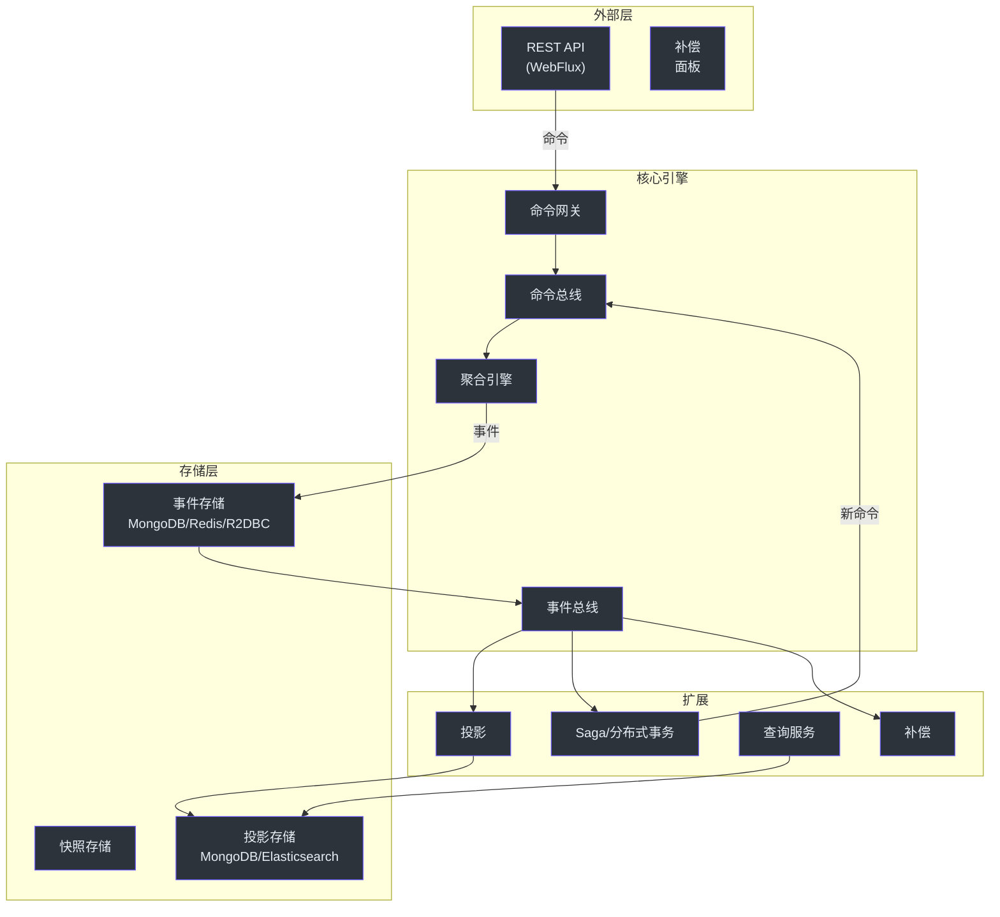

# 架构概览

本文是 Wow 框架架构的深度技术分析。如需更温和的介绍，请参阅[架构指南](../../guide/architecture)。

## 核心理念

Wow 的架构围绕一个核心理念构建：**"领域模型即服务"**。编写你的聚合，框架会处理其余一切——命令路由、事件持久化、投影更新和 API 生成。



<!-- Sources: wow-core/src/main/kotlin/me/ahoo/wow/, wow-spring-boot-starter/, settings.gradle.kts -->

## 模块依赖图

```
wow-api（纯 API 契约）
  └─> wow-core（框架引擎）
       ├─> wow-spring（Spring 集成）
       │    └─> wow-spring-boot-starter（自动配置）
       ├─> wow-query（查询模型支持）
       ├─> wow-kafka（基于 Kafka 的命令/事件总线）
       ├─> wow-mongo（基于 MongoDB 的事件存储 + 快照）
       ├─> wow-redis（基于 Redis 的事件存储 + 快照）
       ├─> wow-r2dbc（基于 R2DBC 的事件存储）
       ├─> wow-elasticsearch（基于 Elasticsearch 的投影）
       ├─> wow-webflux（Spring WebFlux 集成）
       ├─> wow-opentelemetry（追踪/指标）
       └─> wow-cosec（授权）
```

## 关键设计决策

| 决策 | 理由 |
|----------|-----------|
| 响应式（Project Reactor） | 非阻塞 I/O，实现最大吞吐量 |
| KSP 而非 KAPT | 编译时代码生成，加快构建速度 |
| Spring Boot 自动配置 | 零样板代码配置 |
| 可插拔事件存储 | 无需修改领域代码即可切换后端 |
| Given-When-Expect 测试 | 可读性强、可维护的测试套件 |
| 暗启动支持 | 特性开关实现渐进式发布 |

## 相关页面

- [命令总线](./command-bus) — 命令路由与等待策略
- [事件总线](./event-bus) — 事件分发与处理
- [聚合生命周期](./aggregate-lifecycle) — 聚合状态流转
- [事件存储](../data/event-store) — 事件持久化层
- [Spring Boot 集成](../integrations/spring-boot) — 框架设置
