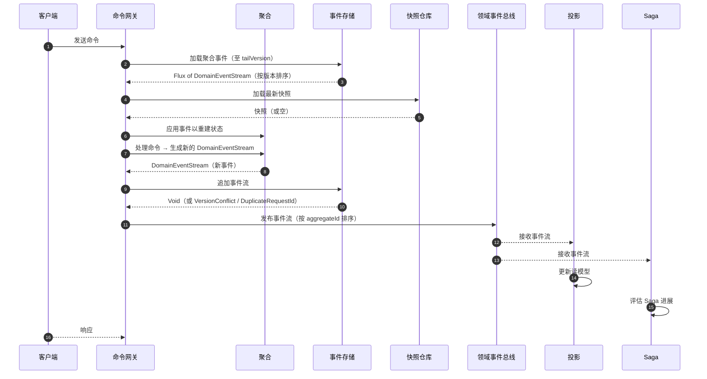
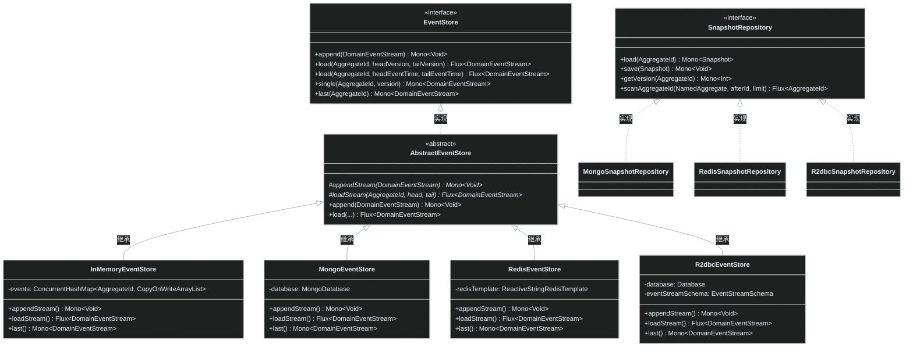
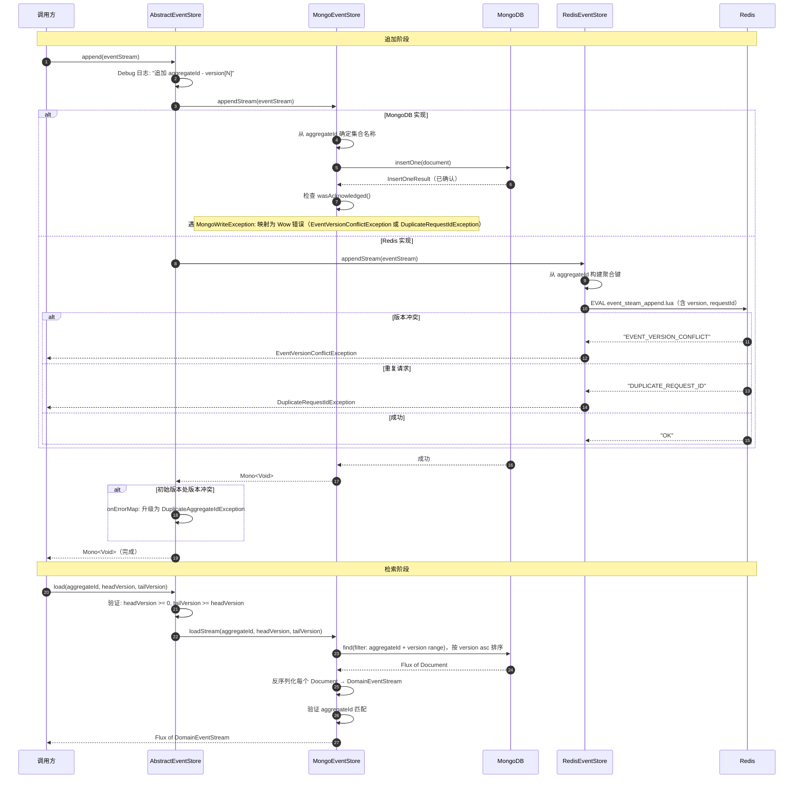
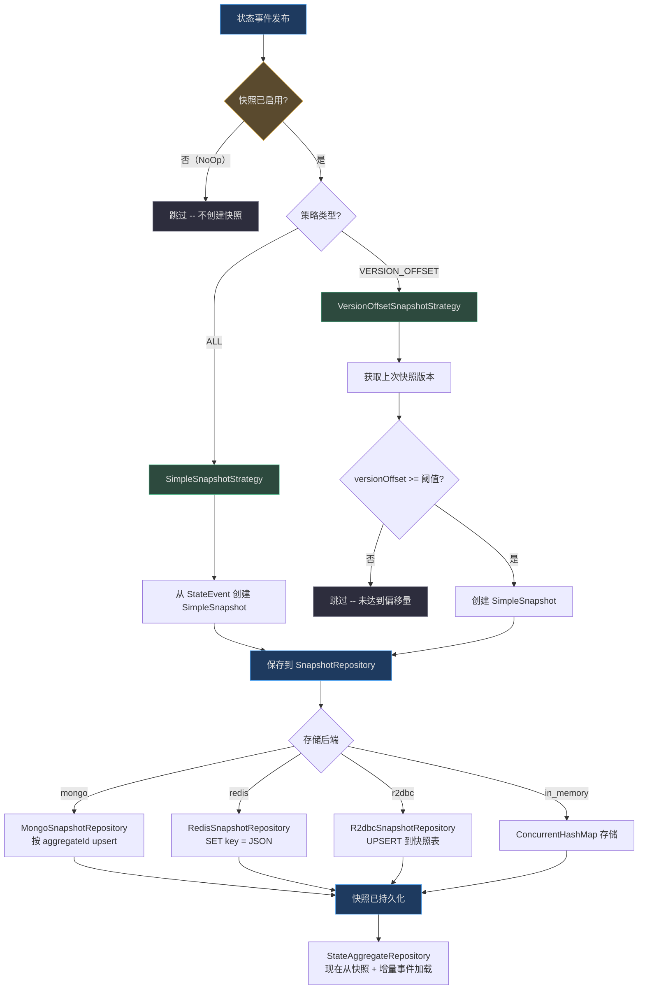

# 事件存储

事件存储是 Wow 框架事件溯源架构的持久性支柱。与传统 CRUD 数据库覆盖状态并丢弃历史不同，事件存储充当系统内已发生的**每一条业务事实**的**不可变、仅追加式**账本。每一次状态变更——`OrderCreated`、`ItemAdded`、`PaymentProcessed`——都被记录为领域事件流，且永远无法修改或删除。

这一设计提供了传统架构无法提供的三个关键能力：

1. **完整审计追踪**——每次状态转换都被永久记录，并包含因果关系元数据（谁、何时、什么命令）
2. **时间查询**——通过重放到指定事件时间戳或版本的事件，将聚合状态重建为任意历史时间点的样子
3. **解耦消费者**——投影、Saga 和外部系统独立订阅同一事件流，无需与聚合的写入路径耦合

事件存储与[快照](../../../documentation/docs/en/guide/snapshot.md)协同工作，以避免为长生命周期聚合重放整个历史记录，并与[领域事件总线](../messaging/event-bus.md)集成，将事件发布到分布式消费者。

## 概览

| 概念 | 描述 | 来源 |
|---|---|---|
| `DomainEvent` | 聚合内已发生的某次业务动作的不可变事实，包含序列号和版本元数据 | [wow-api/.../DomainEvent.kt:52-95](https://github.com/Ahoo-Wang/Wow/blob/main/wow-api/src/main/kotlin/me/ahoo/wow/api/event/DomainEvent.kt#L52-L95) |
| `DomainEventStream` | 单次命令执行产生的一组有序领域事件（与 commandId 一一对应） | [wow-core/.../DomainEventStream.kt:51-125](https://github.com/Ahoo-Wang/Wow/blob/main/wow-core/src/main/kotlin/me/ahoo/wow/event/DomainEventStream.kt#L51-L125) |
| `EventStore` | 追加事件流并按版本/时间范围加载的核心接口 | [wow-core/.../EventStore.kt:27-98](https://github.com/Ahoo-Wang/Wow/blob/main/wow-core/src/main/kotlin/me/ahoo/wow/eventsourcing/EventStore.kt#L27-L98) |
| `AbstractEventStore` | 提供日志记录、验证和错误映射的基类，供所有实现继承 | [wow-core/.../AbstractEventStore.kt:26-140](https://github.com/Ahoo-Wang/Wow/blob/main/wow-core/src/main/kotlin/me/ahoo/wow/eventsourcing/AbstractEventStore.kt#L26-L140) |
| `SnapshotRepository` | 提供版本化状态检查点以优化聚合加载 | [wow-core/.../SnapshotRepository.kt:27-58](https://github.com/Ahoo-Wang/Wow/blob/main/wow-core/src/main/kotlin/me/ahoo/wow/eventsourcing/snapshot/SnapshotRepository.kt#L27-L58) |
| `DomainEventBus` | 按聚合顺序将事件流发布到本地和分布式订阅者 | [wow-core/.../DomainEventBus.kt:39-97](https://github.com/Ahoo-Wang/Wow/blob/main/wow-core/src/main/kotlin/me/ahoo/wow/event/DomainEventBus.kt#L39-L97) |

## 事件溯源生命周期

以下序列图展示了从命令接收开始，历经事件持久化、总线发布到下游处理的完整生命周期。



<!-- Sources:
  CommandGateway flow: wow-core/src/main/kotlin/me/ahoo/wow/command/ (CommandGateway.kt and related)
  EventStore.append: wow-core/src/main/kotlin/me/ahoo/wow/eventsourcing/EventStore.kt:27-43
  SnapshotRepository.load: wow-core/src/main/kotlin/me/ahoo/wow/eventsourcing/snapshot/SnapshotRepository.kt:36
  DomainEventBus.send: wow-core/src/main/kotlin/me/ahoo/wow/event/DomainEventBus.kt:39-44
  EventSourcingStateAggregateRepository: wow-core/src/main/kotlin/me/ahoo/wow/eventsourcing/EventSourcingStateAggregateRepository.kt:41-148
-->

### 状态重建原理

Wow 框架**不会**将当前聚合状态存储在传统数据库表中。相反，每个聚合的状态是**其事件历史的函数**。`EventSourcingStateAggregateRepository` 实现了此重建：

1. **快照优先加载**：当请求最新版本（`tailVersion = Int.MAX_VALUE`）时，仓库首先尝试从快照仓库加载。如果存在快照，则将其作为增量重放的起点（第 [74-89 行](https://github.com/Ahoo-Wang/Wow/blob/main/wow-core/src/main/kotlin/me/ahoo/wow/eventsourcing/EventSourcingStateAggregateRepository.kt#L74-L89)）。
2. **新建聚合**：如果不存在快照或请求非最新版本，则通过 `StateAggregateFactory` 创建新的聚合实例（第 [88-89 行](https://github.com/Ahoo-Wang/Wow/blob/main/wow-core/src/main/kotlin/me/ahoo/wow/eventsourcing/EventSourcingStateAggregateRepository.kt#L88-L89)）。
3. **事件应用**：事件存储中的事件按版本顺序重放，每个事件调用 `stateAggregate.onSourcing(it)` 来改变内存中的状态（第 [93-104 行](https://github.com/Ahoo-Wang/Wow/blob/main/wow-core/src/main/kotlin/me/ahoo/wow/eventsourcing/EventSourcingStateAggregateRepository.kt#L93-L104)）。

时间范围加载以相同方式工作，但仅迭代 `createTime` 在指定窗口内的事件（第 [130-147 行](https://github.com/Ahoo-Wang/Wow/blob/main/wow-core/src/main/kotlin/me/ahoo/wow/eventsourcing/EventSourcingStateAggregateRepository.kt#L130-L147)）。

### 幂等性与并发控制

事件存储通过唯一索引（或每个实现中的等效逻辑）强制执行两个关键不变量：

| 保证 | 机制 | 异常 |
|---|---|---|
| **无并发写入** | `(aggregateId, version)` 唯一索引 | `EventVersionConflictException` |
| **幂等命令处理** | `(aggregateId, requestId)` 唯一索引 | `DuplicateRequestIdException` |
| **无重复聚合创建** | 初始版本处的 `EventVersionConflictException` 被升级 | `DuplicateAggregateIdException` |

`AbstractEventStore.append` 方法（第 [40-52 行](https://github.com/Ahoo-Wang/Wow/blob/main/wow-core/src/main/kotlin/me/ahoo/wow/eventsourcing/AbstractEventStore.kt#L40-L52)）将初始版本处的版本冲突映射为 `DuplicateAggregateIdException`，以区分"聚合已存在"和"并发修改"。

## 事件存储架构

框架定义了一套清晰的接口层次结构，支持多种持久性后端。每个实现都继承自 `AbstractEventStore`，后者提供集中化的日志记录、输入验证和错误映射。



<!-- Sources:
  EventStore: wow-core/src/main/kotlin/me/ahoo/wow/eventsourcing/EventStore.kt:27-98
  AbstractEventStore: wow-core/.../eventsourcing/AbstractEventStore.kt:26-140
  InMemoryEventStore: wow-core/.../eventsourcing/InMemoryEventStore.kt:30-127
  MongoEventStore: wow-mongo/.../MongoEventStore.kt:32-105
  RedisEventStore: wow-redis/.../RedisEventStore.kt:35-92
  R2dbcEventStore: wow-r2dbc/.../R2dbcEventStore.kt:34-160
  SnapshotRepository: wow-core/.../snapshot/SnapshotRepository.kt:27-58
  MongoSnapshotRepository: wow-mongo/.../MongoSnapshotRepository.kt:34-111
  RedisSnapshotRepository: wow-redis/.../RedisSnapshotRepository.kt:29-71
  R2dbcSnapshotRepository: wow-r2dbc/.../R2dbcSnapshotRepository.kt:34-169
-->

### 两层设计

`AbstractEventStore` 应用**模板方法模式**来集中化横切关注点：

- **`append()`**（public, concrete）：记录操作日志，委托给 `appendStream()`，并将初始版本处的版本冲突异常升级为 `DuplicateAggregateIdException`（第 [40-52 行](https://github.com/Ahoo-Wang/Wow/blob/main/wow-core/src/main/kotlin/me/ahoo/wow/eventsourcing/AbstractEventStore.kt#L40-L52)）。
- **`load()` 按版本**（public, concrete）：验证 `headVersion >= 0` 且 `tailVersion >= headVersion`，然后委托给 `loadStream()`（第 [73-88 行](https://github.com/Ahoo-Wang/Wow/blob/main/wow-core/src/main/kotlin/me/ahoo/wow/eventsourcing/AbstractEventStore.kt#L73-L88)）。
- **`load()` 按事件时间**（public, concrete）：验证 `tailEventTime >= headEventTime`，然后委托给 `loadStream()`（第 [100-109 行](https://github.com/Ahoo-Wang/Wow/blob/main/wow-core/src/main/kotlin/me/ahoo/wow/eventsourcing/AbstractEventStore.kt#L100-L109)）。
- **`appendStream()` / `loadStream()`**（protected, abstract）：每个后端实现特定的存储逻辑。

这种设计确保**每个**实现都能受益于集中化的验证和错误处理，而无需重复代码。

## 事件存储与检索详情

以下图表展示了新增事件流被追加和随后被检索时的内部流程。



<!-- Sources:
  AbstractEventStore.append: wow-core/.../eventsourcing/AbstractEventStore.kt:40-52
  AbstractEventStore.load: wow-core/.../eventsourcing/AbstractEventStore.kt:73-88
  MongoEventStore.appendStream: wow-mongo/.../MongoEventStore.kt:34-46
  MongoEventStore.loadStream: wow-mongo/.../MongoEventStore.kt:67-76
  RedisEventStore.appendStream: wow-redis/.../RedisEventStore.kt:44-65
  RedisEventStore.loadStream: wow-redis/.../RedisEventStore.kt:67-74
  R2dbcEventStore.appendStream: wow-r2dbc/.../R2dbcEventStore.kt:38-86
-->

### 各实现的存储模式

每种事件存储后端以不同方式组织数据：

**MongoDB** 使用按聚合类型命名的集合。集合名称从聚合的上下文名称和聚合名称派生（例如，`order_event_stream`）。文档使用 `(aggregate_id, version)` 上的唯一复合索引和 `(aggregate_id, request_id)` 上的另一个唯一索引，以及 `tenant_id` 和 `owner_id` 上的辅助索引以支持多租户查询（第 [51-69 行](https://github.com/Ahoo-Wang/Wow/blob/main/wow-mongo/src/main/kotlin/me/ahoo/wow/mongo/EventStreamSchemaInitializer.kt#L51-L69)）。

**Redis** 在按聚合 ID 键的**有序集合**中存储事件流。每个成员是一个 JSON 序列化的 `DomainEventStream`，按版本号评分。这支持使用 `ZRANGEBYSCORE` 按版本进行高效的范围查询。追加操作使用 Lua 脚本（`event_steam_append.lua`）实现原子性——在单个 Redis 事务中检查版本冲突和重复请求 ID（第 [44-65 行](https://github.com/Ahoo-Wang/Wow/blob/main/wow-redis/src/main/kotlin/me/ahoo/wow/redis/eventsourcing/RedisEventStore.kt#L44-L65)）。Redis 实现不支持时间范围加载。

**R2DBC** 使用每个聚合类型的关联表（`<aggregateName>_event_stream`）。模式生成的列包括 `id`、`aggregate_id`、`tenant_id`、`owner_id`、`space_id`、`request_id`、`command_id`、`version`、`header`、`body`、`size` 和 `create_time`（第 [47-53 行](https://github.com/Ahoo-Wang/Wow/blob/main/wow-r2dbc/src/main/kotlin/me/ahoo/wow/r2dbc/EventStreamSchema.kt#L47-L53)）。`(aggregate_id, version)` 上的唯一索引和 `request_id` 上的唯一索引强制执行相同的不变量。`ShardingEventStreamSchema` 变体通过 `AggregateIdSharding` 支持水平扩展部署的表分片。

## 快照机制

快照解决了事件溯源的根本性能问题：为长生命周期聚合重放每个历史事件会逐渐变慢。快照是聚合在特定版本处状态的序列化检查点，允许框架仅重放快照之后的事件。



<!-- Sources:
  SnapshotStrategy: wow-core/.../snapshot/SnapshotStrategy.kt:30-53
  SimpleSnapshotStrategy: wow-core/.../snapshot/SimpleSnapshotStrategy.kt:25-39
  VersionOffsetSnapshotStrategy: wow-core/.../snapshot/VersionOffsetSnapshotStrategy.kt:34-65
  Snapshot interface: wow-core/.../snapshot/Snapshot.kt:25-41
  MongoSnapshotRepository.save: wow-mongo/.../MongoSnapshotRepository.kt:79-92
  RedisSnapshotRepository.save: wow-redis/.../RedisSnapshotRepository.kt:47-52
  R2dbcSnapshotRepository.save: wow-r2dbc/.../R2dbcSnapshotRepository.kt:115-141
  SnapshotProperties: wow-spring-boot-starter/.../snapshot/SnapshotProperties.kt:23-46
-->

### 快照策略

框架提供三种内置策略，可通过配置选择：

| 策略 | 类 | 行为 | 适用场景 | 来源 |
|---|---|---|---|---|
| **NoOp** | `SnapshotStrategy.NoOp` | 永不创建快照 | 测试、事件少的聚合 | [SnapshotStrategy.kt:44-52](https://github.com/Ahoo-Wang/Wow/blob/main/wow-core/src/main/kotlin/me/ahoo/wow/eventsourcing/snapshot/SnapshotStrategy.kt#L44-L52) |
| **All** | `SimpleSnapshotStrategy` | **每个**状态事件都创建快照 | 重放成本高、强一致性要求的聚合 | [SimpleSnapshotStrategy.kt:25-39](https://github.com/Ahoo-Wang/Wow/blob/main/wow-core/src/main/kotlin/me/ahoo/wow/eventsourcing/snapshot/SimpleSnapshotStrategy.kt#L25-L39) |
| **版本偏移** | `VersionOffsetSnapshotStrategy` | 当版本差 >= 阈值（默认 5）时创建快照 | 性能/存储的平衡取舍（推荐用于生产） | [VersionOffsetSnapshotStrategy.kt:34-65](https://github.com/Ahoo-Wang/Wow/blob/main/wow-core/src/main/kotlin/me/ahoo/wow/eventsourcing/snapshot/VersionOffsetSnapshotStrategy.kt#L34-L65) |

`VersionOffsetSnapshotStrategy` 的工作原理是比较当前事件版本与聚合上次快照版本。如果 `(event.version - lastSnapshotVersion) >= versionOffset`，则保存新快照。默认偏移量 5 意味着每 5 个版本增量触发一次快照（第 [49-64 行](https://github.com/Ahoo-Wang/Wow/blob/main/wow-core/src/main/kotlin/me/ahoo/wow/eventsourcing/snapshot/VersionOffsetSnapshotStrategy.kt#L49-L64)）。

### 快照与聚合加载

当 `EventSourcingStateAggregateRepository` 加载最新版本的聚合时：

1. 查询 `SnapshotRepository.load<S>(aggregateId)` 获取最新快照。
2. 如果存在快照，聚合状态从快照版本初始化。
3. 从 `expectedNextVersion`（快照版本 + 1）开始加载事件存储中的事件，直到请求的尾版本。
4. 仅重放增量事件，大幅减少 I/O 和 CPU。
5. 如果不存在快照，则加载并重放从版本 1 开始的所有事件。

这种机制将加载成本从 O(所有事件) 转换为 O(自上次快照以来的事件)，对于事件历史跨越数百万个事件的聚合至关重要。

## 实现对比

### 事件存储后端

| 特性 | MongoDB | Redis | R2DBC | 内存 |
|---|---|---|---|---|
| **模块** | `wow-mongo` | `wow-redis` | `wow-r2dbc` | `wow-core` |
| **持久性** | 持久（磁盘） | 可配置（持久或缓存） | 持久（磁盘，SQL） | 易失（内存） |
| **版本范围查询** | 是 | 是（有序集合 ZRANGEBYSCORE） | 是（SQL BETWEEN） | 是（内存过滤） |
| **时间范围查询** | 是 | **否**（UnsupportedOperationException） | 是（对 create_time 做 SQL BETWEEN） | 是（内存过滤） |
| **并发控制** | 唯一复合索引 | Lua 脚本（原子性） | 唯一 SQL 索引 | 同步 map compute |
| **幂等性** | (aggregateId, requestId) 唯一索引 | Lua 脚本检查 | requestId 唯一 SQL 索引 | 内存扫描 |
| **分片支持** | 分片集合 | Redis 集群（哈希槽） | `ShardingEventStreamSchema` | 不适用 |
| **模式自动初始化** | `EventStreamSchemaInitializer` | 不适用（无模式） | 通过 R2DBC 迁移的 DDL | 不适用 |
| **生产就绪度** | 高 | 中（数据量限制） | 高 | 仅开发/测试 |
| **关键类** | [MongoEventStore.kt:32](https://github.com/Ahoo-Wang/Wow/blob/main/wow-mongo/src/main/kotlin/me/ahoo/wow/mongo/MongoEventStore.kt#L32) | [RedisEventStore.kt:35](https://github.com/Ahoo-Wang/Wow/blob/main/wow-redis/src/main/kotlin/me/ahoo/wow/redis/eventsourcing/RedisEventStore.kt#L35) | [R2dbcEventStore.kt:34](https://github.com/Ahoo-Wang/Wow/blob/main/wow-r2dbc/src/main/kotlin/me/ahoo/wow/r2dbc/R2dbcEventStore.kt#L34) | [InMemoryEventStore.kt:30](https://github.com/Ahoo-Wang/Wow/blob/main/wow-core/src/main/kotlin/me/ahoo/wow/eventsourcing/InMemoryEventStore.kt#L30) |

### 快照仓库后端

| 特性 | MongoDB | Redis | R2DBC | 内存 | NoOp |
|---|---|---|---|---|---|
| **模块** | `wow-mongo` | `wow-redis` | `wow-r2dbc` | `wow-core` | `wow-core` |
| **保存策略** | `replaceOne` with `upsert=true` | `SET key`（覆盖） | SQL UPSERT | `ConcurrentHashMap.put` | 无操作 |
| **版本获取** | 投影查询（仅 version 字段） | 反序列化完整快照 | SQL 查询（version 列） | 反序列化完整快照 | 返回 `UNINITIALIZED_VERSION` |
| **聚合扫描** | `find(gt afterId)` | Redis `SCAN` 使用键模式 | SQL 查询 (aggregate_id > afterId) | 不适用 | 返回空 |
| **关键类** | [MongoSnapshotRepository.kt:34](https://github.com/Ahoo-Wang/Wow/blob/main/wow-mongo/src/main/kotlin/me/ahoo/wow/mongo/MongoSnapshotRepository.kt#L34) | [RedisSnapshotRepository.kt:29](https://github.com/Ahoo-Wang/Wow/blob/main/wow-redis/src/main/kotlin/me/ahoo/wow/redis/eventsourcing/RedisSnapshotRepository.kt#L29) | [R2dbcSnapshotRepository.kt:34](https://github.com/Ahoo-Wang/Wow/blob/main/wow-r2dbc/src/main/kotlin/me/ahoo/wow/r2dbc/R2dbcSnapshotRepository.kt#L34) | -- | [SnapshotRepository.kt:64](https://github.com/Ahoo-Wang/Wow/blob/main/wow-core/src/main/kotlin/me/ahoo/wow/eventsourcing/snapshot/SnapshotRepository.kt#L64) |

### 事件总线后端（用于事件流发布）

事件存储负责**持久化**事件；事件总线负责将其**发布**给消费者。它们是不同的关注点，有不同的实现：

| 总线 | 类型 | 模块 | 关键类 |
|---|---|---|---|
| `InMemoryDomainEventBus` | 本地 | `wow-core` | [InMemoryDomainEventBus.kt](https://github.com/Ahoo-Wang/Wow/blob/main/wow-core/src/main/kotlin/me/ahoo/wow/event/InMemoryDomainEventBus.kt) |
| `KafkaDomainEventBus` | 分布式 | `wow-kafka` | [KafkaDomainEventBus.kt:22](https://github.com/Ahoo-Wang/Wow/blob/main/wow-kafka/src/main/kotlin/me/ahoo/wow/kafka/KafkaDomainEventBus.kt#L22) |
| `RedisDomainEventBus` | 分布式 | `wow-redis` | [RedisDomainEventBus.kt](https://github.com/Ahoo-Wang/Wow/blob/main/wow-redis/src/main/kotlin/me/ahoo/wow/redis/bus/RedisDomainEventBus.kt) |
| `LocalFirstDomainEventBus` | 混合 | `wow-core` | [LocalFirstDomainEventBus.kt:38](https://github.com/Ahoo-Wang/Wow/blob/main/wow-core/src/main/kotlin/me/ahoo/wow/event/LocalFirstDomainEventBus.kt#L38) |

`LocalFirstDomainEventBus` 是一种混合总线，首先在本地发布（用于即时投影更新），然后在分布式总线上发布（用于跨服务消费者）。这样可以避免同一进程消费者经历 Kafka 延迟。

## 配置参考

所有配置均在 `wow.eventsourcing` 前缀下：

| 属性 | 类型 | 默认值 | 描述 | 来源 |
|---|---|---|---|---|
| `wow.eventsourcing.store.storage` | `StorageType` | `mongo` | 事件存储后端（mongo, redis, r2dbc, in_memory） | [EventStoreProperties.kt:21](https://github.com/Ahoo-Wang/Wow/blob/main/wow-spring-boot-starter/src/main/kotlin/me/ahoo/wow/spring/boot/starter/eventsourcing/store/EventStoreProperties.kt#L21) |
| `wow.eventsourcing.snapshot.enabled` | `Boolean` | `true` | 启用快照机制 | [SnapshotProperties.kt:25](https://github.com/Ahoo-Wang/Wow/blob/main/wow-spring-boot-starter/src/main/kotlin/me/ahoo/wow/spring/boot/starter/eventsourcing/snapshot/SnapshotProperties.kt#L25) |
| `wow.eventsourcing.snapshot.strategy` | `Strategy` | `all` | 快照触发策略（all, version_offset） | [SnapshotProperties.kt:26](https://github.com/Ahoo-Wang/Wow/blob/main/wow-spring-boot-starter/src/main/kotlin/me/ahoo/wow/spring/boot/starter/eventsourcing/snapshot/SnapshotProperties.kt#L26) |
| `wow.eventsourcing.snapshot.version-offset` | `Int` | `5` | 版本间隔阈值（仅用于 version_offset 策略） | [SnapshotProperties.kt:27](https://github.com/Ahoo-Wang/Wow/blob/main/wow-spring-boot-starter/src/main/kotlin/me/ahoo/wow/spring/boot/starter/eventsourcing/snapshot/SnapshotProperties.kt#L27) |
| `wow.eventsourcing.snapshot.storage` | `StorageType` | `mongo` | 快照存储后端 | [SnapshotProperties.kt:28](https://github.com/Ahoo-Wang/Wow/blob/main/wow-spring-boot-starter/src/main/kotlin/me/ahoo/wow/spring/boot/starter/eventsourcing/snapshot/SnapshotProperties.kt#L28) |

**示例 -- 使用 MongoDB 事件存储和版本偏移快照的生产配置：**

```yaml
wow:
  eventsourcing:
    store:
      storage: mongo
    snapshot:
      enabled: true
      strategy: version_offset
      version-offset: 10
      storage: mongo
```

**示例 -- 使用内存事件存储且禁用快照的开发配置：**

```yaml
wow:
  eventsourcing:
    store:
      storage: in_memory
    snapshot:
      enabled: false
```

当 `wow.eventsourcing.snapshot.enabled` 设置为 `false` 时，`EventSourcingAutoConfiguration` 注册一个 `NoOpSnapshotRepository` bean，加载时始终返回空，保存时不执行任何操作（第 [28-35 行](https://github.com/Ahoo-Wang/Wow/blob/main/wow-spring-boot-starter/src/main/kotlin/me/ahoo/wow/spring/boot/starter/eventsourcing/EventSourcingAutoConfiguration.kt#L28-L35)）。

### StorageType 枚举值

`StorageType` 枚举定义所有支持的后端（第 [16-32 行](https://github.com/Ahoo-Wang/Wow/blob/main/wow-spring-boot-starter/src/main/kotlin/me/ahoo/wow/spring/boot/starter/eventsourcing/StorageType.kt#L16-L32)）：

| 值 | YAML 字符串 | 用途 |
|---|---|---|
| `MONGO` | `mongo` | 事件存储、快照、准备键 |
| `REDIS` | `redis` | 事件存储、快照、准备键 |
| `R2DBC` | `r2dbc` | 事件存储、快照、准备键 |
| `ELASTICSEARCH` | `elasticsearch` | 仅快照 |
| `IN_MEMORY` | `in_memory` | 事件存储、快照（开发/测试） |
| `DELAY` | `delay` | 专用快照变体 |

## 错误处理

事件存储定义了一套类型化异常层次结构，用于精确的错误处理：

```mermaid
stateDiagram-v2
    [*] --> 请求追加: append(eventStream)
    请求追加 --> 成功: 事件已存储
    请求追加 --> 版本冲突: version <= storedTailVersion
    请求追加 --> 重复请求: requestId 已存在

    版本冲突 --> 重复聚合ID: 若 eventStream.version == INITIAL_VERSION
    版本冲突 --> EventVersionConflictException: 否则
    重复请求 --> DuplicateRequestIdException

    EventVersionConflictException --> 可重试: 实现 RecoverableException
    DuplicateRequestIdException --> 幂等: 安全重试（相同命令）
    DuplicateAggregateIdException --> 致命: 无法重新创建已存在的聚合

    成功 --> [*]
    可重试 --> [*]
    幂等 --> [*]
    致命 --> [*]

    style 请求追加 fill:#1e3a5f,stroke:#4a9eed,color:#e0e0e0
    style 成功 fill:#2d4a3e,stroke:#4aba8a,color:#e0e0e0
    style 版本冲突 fill:#5a4a2e,stroke:#d4a84b,color:#e0e0e0
    style 重复请求 fill:#5a4a2e,stroke:#d4a84b,color:#e0e0e0
    style EventVersionConflictException fill:#4a2e2e,stroke:#d45b5b,color:#e0e0e0
    style DuplicateRequestIdException fill:#2d4a3e,stroke:#4aba8a,color:#e0e0e0
    style DuplicateAggregateIdException fill:#4a2e2e,stroke:#d45b5b,color:#e0e0e0
    style 可重试 fill:#5a4a2e,stroke:#d4a84b,color:#e0e0e0
    style 幂等 fill:#2d4a3e,stroke:#4aba8a,color:#e0e0e0
    style 致命 fill:#4a2e2e,stroke:#d45b5b,color:#e0e0e0
```

<!-- Sources:
  EventVersionConflictException: wow-core/.../eventsourcing/EventSourcingExceptions.kt:30-40
  DuplicateAggregateIdException: wow-core/.../eventsourcing/EventSourcingExceptions.kt:49-57
  AbstractEventStore.append (error mapping): wow-core/.../eventsourcing/AbstractEventStore.kt:40-52
  DuplicateRequestIdException: wow-core/.../command/DuplicateRequestIdException.kt
-->

关键错误特征：

- **`EventVersionConflictException`** 实现 `RecoverableException` -- 框架可以通过重新加载聚合最新版本并重新应用命令来安全重试（第 [33-39 行](https://github.com/Ahoo-Wang/Wow/blob/main/wow-core/src/main/kotlin/me/ahoo/wow/eventsourcing/EventSourcingExceptions.kt#L33-L39)）。
- **`DuplicateRequestIdException`** 表示完全相同的命令已被处理 -- 这对幂等性来说是成功情况，而非错误。
- **`DuplicateAggregateIdException`** 表示尝试创建已存在的聚合 -- 通常表明客户端 ID 冲突或 bug。

## `DomainEvent` 与 `EventMessage` 契约

`DomainEvent<T>` 接口是框架层次结构中状态变更的基本单元：

```kotlin
interface DomainEvent<T : Any> :
    EventMessage<DomainEvent<T>, T>, Named, Revision {
    override val aggregateId: AggregateId
    val sequence: Int  // 默认为 1，表示流中的顺序
    override val revision: String  // 模式版本，用于兼容性
    val isLast: Boolean  // 为 true 时表示流中的最后一个事件
}
```
<!-- Source: wow-api/.../event/DomainEvent.kt:52-95 -->

父接口 `EventMessage<SOURCE, T>` 提供完整的元数据契约：

| 能力 | 接口 | 目的 |
|---|---|---|
| 限界上下文标识 | `NamedBoundedContextMessage` | 追踪哪个限界上下文产生的事件 |
| 命令关联 | `CommandId` | 将事件与触发命令关联 |
| 聚合类型 | `NamedAggregate` | 标识聚合类型名称 |
| 版本追踪 | `Version` | 追踪应用后的聚合版本 |
| 实例标识 | `AggregateIdCapable` | 标识特定聚合实例 |
| 归属 | `OwnerId` | 追踪谁创建/修改 |
| 命名空间 | `SpaceIdCapable` | 支持租户级数据分层 |
<!-- Source: wow-api/.../event/EventMessage.kt:72-79 -->

这些丰富的元数据使框架能够正确路由事件、强制执行顺序、提供审计并支持多租户部署 -- 而无需开发者手动管理这些关注点。

## 最佳实践

1. **为工作负载选择合适的后端**：MongoDB 和 R2DBC 是生产环境的推荐选择。MongoDB 在模式灵活性和水平扩展（分片）方面表现出色。R2DBC 是组织中已运行关系数据库的自然选择。Redis 适用于高吞吐量、低数据量场景，但不支持时间范围查询。

2. **为长生命周期聚合启用快照**：对于在其生命周期中累积数百或数千个事件的聚合，将 `wow.eventsourcing.snapshot.strategy` 设置为 `version_offset`，并根据重放成本选择合理的偏移量（5-20），以避免线性退化。

3. **监控版本冲突**：偶发的 `EventVersionConflictException` 在并发系统中是正常的。然而，高频率的冲突表明对特定聚合的竞争 -- 考虑重新设计聚合边界或调整业务流程。

4. **利用请求幂等性**：`requestId` 字段保证重试命令不会产生重复事件。这对于分布式消息传递中的至少一次交付语义至关重要。

5. **保持事件不可变且声明式**：领域事件应表示简单的事实（"订单已创建，包含商品 X、Y、Z"）而非包含条件逻辑。聚合的溯源函数简单地将事件叠加到状态上而不分支，如接口文档所述（第 [29-31 行](https://github.com/Ahoo-Wang/Wow/blob/main/wow-api/src/main/kotlin/me/ahoo/wow/api/event/DomainEvent.kt#L29-L31)）。

6. **仅测试使用内存实现**：`InMemoryEventStore` 是线程安全的但是易失的。仅用于单元测试和本地开发。不要部署到生产环境。

## 相关页面

| 页面 | 描述 |
|---|---|
| [快照](../../../documentation/docs/en/guide/snapshot.md) | 快照策略和聚合加载优化的详细指南 |
| [事件溯源配置](../../../documentation/docs/en/reference/config/eventsourcing.md) | 所有事件溯源 `application.yml` 属性的完整参考 |
| [MongoDB 配置](../../../documentation/docs/en/reference/config/mongo.md) | MongoDB 特定配置（数据库、自动初始化、模式） |
| [Redis 配置](../../../documentation/docs/en/reference/config/redis.md) | Redis 特定配置 |
| [R2DBC 配置](../../../documentation/docs/en/reference/config/r2dbc.md) | R2DBC 特定配置 |
| [命令网关](../messaging/command-gateway.md) | 命令如何通过事件存储路由到聚合 |
| [投影](../read-models/projections.md) | 投影如何消费事件流以更新读模型 |
| [Saga 编排](../../../documentation/docs/en/guide/saga.md) | Saga 如何跨聚合边界响应事件 |
| [事件处理器](../../../documentation/docs/en/guide/event-processor.md) | 事件分发和处理程序注册 |
| [商业智能](../../../documentation/docs/en/guide/bi.md) | 利用事件流进行数据分析 |
| [架构概览](../architecture/overview.md) | Wow 框架高层架构 |
