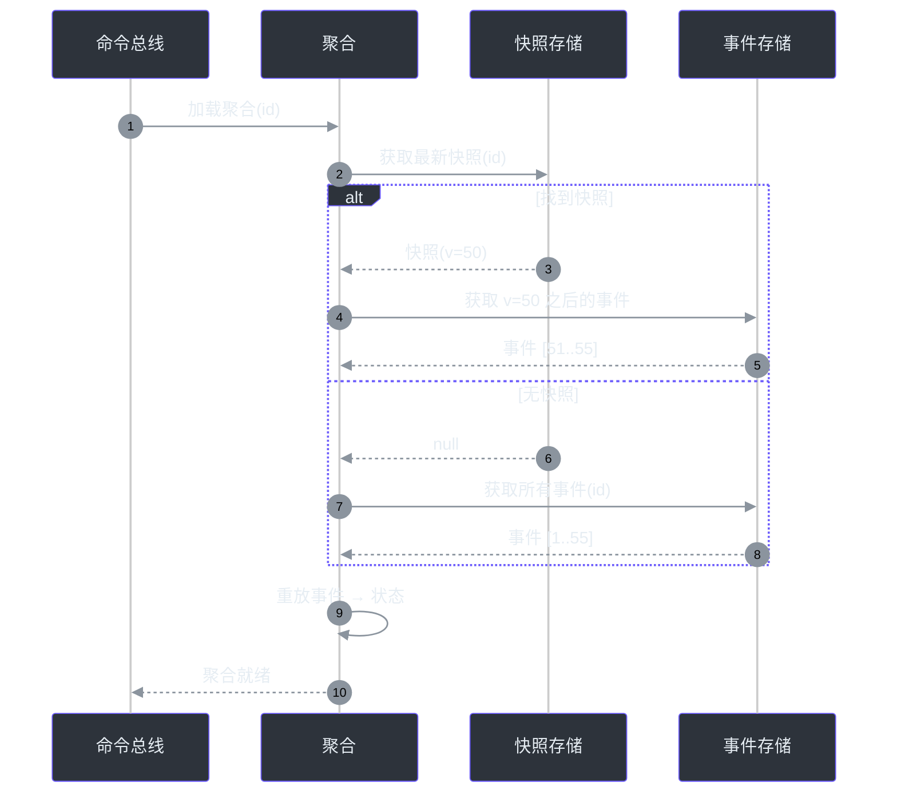

# 快照存储

快照存储通过持久化聚合状态快照来优化聚合加载，避免重放所有历史事件。

## 为什么需要快照？

没有快照时，加载一个聚合需要重放**所有**历史事件。对于拥有数千个事件的长生命周期聚合来说，这会成为性能瓶颈。快照记录了聚合在某个时间点的状态，因此只需要重放快照之后的事件。



<!-- Sources: wow-core/src/main/kotlin/me/ahoo/wow/event/snapshot/, wow-api/src/main/kotlin/me/ahoo/wow/api/event/snapshot/ -->

## 快照生命周期

```mermaid
stateDiagram-v2
    [*] --> 创建: 每隔 N 个事件
    创建 --> 存储: 序列化状态
    存储 --> 活跃: 可供加载
    活跃 --> 过期: 新增事件
    过期 --> 创建: 达到间隔阈值
    活跃 --> 删除: 聚合被删除
    删除 --> [*]

    style 创建 fill:#2d333b,stroke:#6d5dfc,color:#e6edf3
    style 存储 fill:#2d333b,stroke:#6d5dfc,color:#e6edf3
    style 活跃 fill:#2d333b,stroke:#6d5dfc,color:#e6edf3
    style 过期 fill:#2d333b,stroke:#6d5dfc,color:#e6edf3
    style 删除 fill:#2d333b,stroke:#6d5dfc,color:#e6edf3
```

<!-- Sources: wow-core/src/main/kotlin/me/ahoo/wow/event/snapshot/SnapshotHandler.kt -->

## 配置

| 属性 | 默认值 | 描述 |
|----------|---------|-------------|
| `wow.snapshot.enabled` | `false` | 启用快照存储 |
| `wow.snapshot.interval` | `100` | 触发新快照前需积累的事件数 |
| `wow.snapshot.store.type` | 事件存储后端 | 快照存储后端 |

## 支持的后端

| 后端 | 模块 | 状态 |
|---------|--------|--------|
| MongoDB | `wow-mongo` | 生产就绪 |
| Redis | `wow-redis` | 生产就绪 |
| R2DBC | `wow-r2dbc` | 生产就绪 |

## 性能影响

快照可大幅减少长生命周期聚合的加载时间。以快照间隔为 50 计，拥有 1000 个事件的聚合最多重放 49 个事件，而非全部 1000 个——减少了约 95%。

## 相关页面

- [事件存储](./event-store) — 事件持久化层
- [聚合生命周期](../architecture/aggregate-lifecycle) — 加载与状态流转
- [配置](../../guide/configuration) — 快照配置
