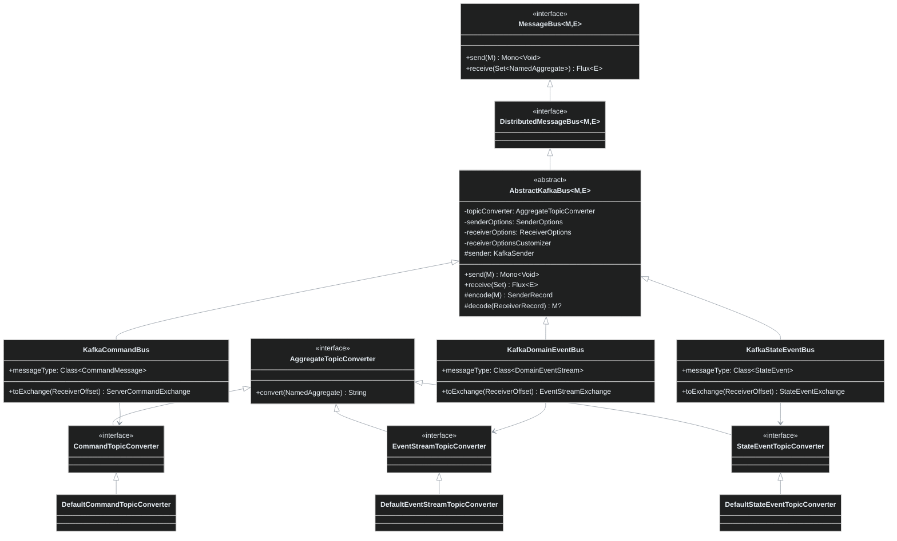
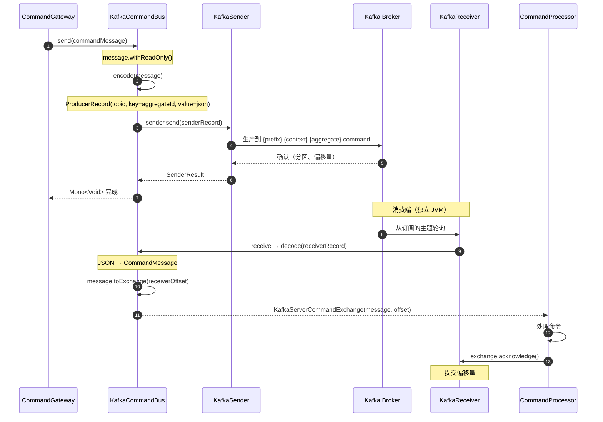
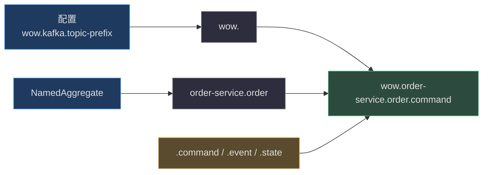
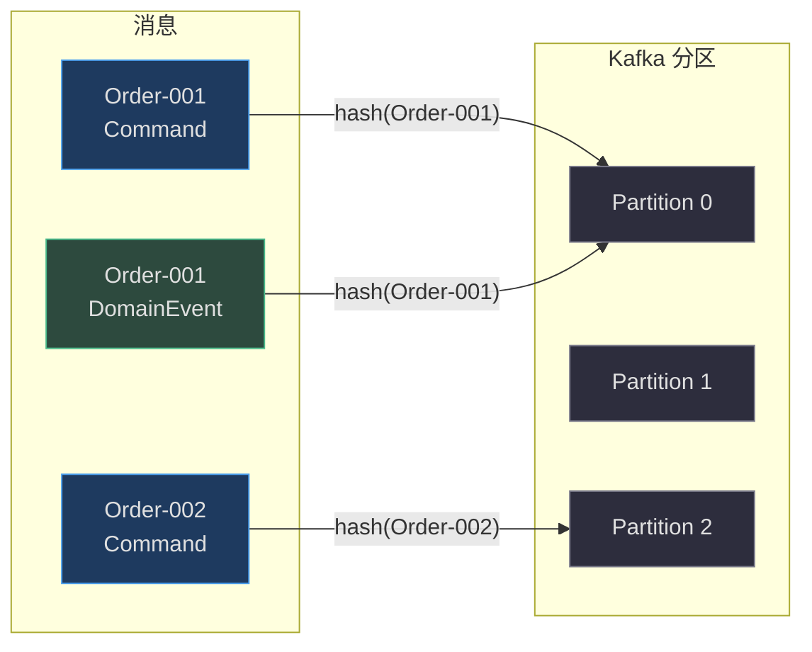
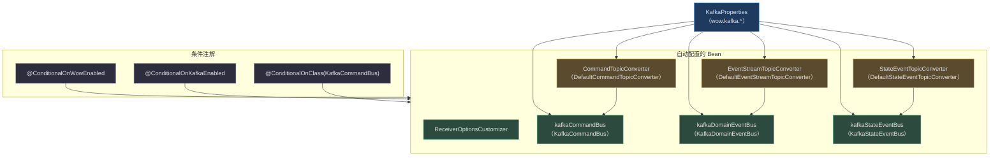

# Kafka 集成

Apache Kafka 是 Wow 框架中**默认且推荐的分布式消息总线**实现。`wow-kafka` 模块提供了三个具体的总线实现 —— `KafkaCommandBus`、`KafkaDomainEventBus` 和 `KafkaStateEventBus` —— 全部构建在由 [reactor-kafka](https://projectreactor.io/docs/kafka/release/reference/) 驱动的共享响应式管道之上。

本页深入探讨 Kafka 集成的内部机制、配置和运行机制。有关高层扩展指南，参见 [Kafka 扩展指南](../../../documentation/docs/en/guide/extensions/kafka.md)。有关配置参考，参见 [Kafka 配置](../../reference/config/kafka.md)。

---

## 概览速查

| 方面 | 详情 | 来源 |
|---|---|---|
| **模块** | `wow-kafka` | [build.gradle.kts](https://github.com/Ahoo-Wang/Wow/blob/main/wow-kafka/build.gradle.kts) |
| **依赖** | `me.ahoo.wow:wow-kafka` | [build.gradle.kts:2](https://github.com/Ahoo-Wang/Wow/blob/main/wow-kafka/build.gradle.kts#L2) |
| **传输层** | `reactor-kafka`（基于 Apache Kafka 客户端的响应式包装器） | [build.gradle.kts:3](https://github.com/Ahoo-Wang/Wow/blob/main/wow-kafka/build.gradle.kts#L3) |
| **总线实现** | `KafkaCommandBus`、`KafkaDomainEventBus`、`KafkaStateEventBus` | [KafkaCommandBus.kt:27](https://github.com/Ahoo-Wang/Wow/blob/main/wow-kafka/src/main/kotlin/me/ahoo/wow/kafka/KafkaCommandBus.kt#L27), [KafkaDomainEventBus.kt:22](https://github.com/Ahoo-Wang/Wow/blob/main/wow-kafka/src/main/kotlin/me/ahoo/wow/kafka/KafkaDomainEventBus.kt#L22), [KafkaStateEventBus.kt:22](https://github.com/Ahoo-Wang/Wow/blob/main/wow-kafka/src/main/kotlin/me/ahoo/wow/kafka/KafkaStateEventBus.kt#L22) |
| **自动配置** | `KafkaAutoConfiguration` | [KafkaAutoConfiguration.kt:48](https://github.com/Ahoo-Wang/Wow/blob/main/wow-spring-boot-starter/src/main/kotlin/me/ahoo/wow/spring/boot/starter/kafka/KafkaAutoConfiguration.kt#L48) |
| **配置前缀** | `wow.kafka` | [KafkaProperties.kt:40](https://github.com/Ahoo-Wang/Wow/blob/main/wow-spring-boot-starter/src/main/kotlin/me/ahoo/wow/spring/boot/starter/kafka/KafkaProperties.kt#L40) |
| **默认总线类型** | `kafka` | [BusProperties.kt:22](https://github.com/Ahoo-Wang/Wow/blob/main/wow-spring-boot-starter/src/main/kotlin/me/ahoo/wow/spring/boot/starter/BusProperties.kt#L22) |
| **默认启用** | `wow.kafka.enabled = true` | [KafkaProperties.kt:29](https://github.com/Ahoo-Wang/Wow/blob/main/wow-spring-boot-starter/src/main/kotlin/me/ahoo/wow/spring/boot/starter/kafka/KafkaProperties.kt#L29) |

---

## 架构概览

### 类层次结构

三个 Kafka 总线实现均继承自 `AbstractKafkaBus`，后者本身实现了 `DistributedMessageBus` 接口。每个总线专门处理一种消息类型，从专用的 Kafka 主题生产和消费。



<!-- Sources: wow-kafka/AbstractKafkaBus.kt, wow-kafka/KafkaCommandBus.kt, wow-kafka/KafkaDomainEventBus.kt, wow-kafka/KafkaStateEventBus.kt, wow-kafka/AggregateTopicConverter.kt, wow-core/command/CommandBus.kt, wow-core/event/DomainEventBus.kt, wow-core/eventsourcing/state/StateEventBus.kt -->

`AbstractKafkaBus` 基类使用 `reactor-kafka` 集中管理整个响应式发送/接收管道。它包装了一个 `KafkaSender` 用来生产消息，并为每个订阅配置一个 `KafkaReceiver` 用来消费消息。每个具体子类只需声明其 `messageType`（用于 JSON 反序列化）和一个 `toExchange` 工厂方法，该方法构造携带确认信息的交换对象。

### 三种总线，三种主题类型

| 总线 | 核心接口 | 消息类型 | 交换类型 | 主题后缀 | 来源 |
|---|---|---|---|---|---|
| `KafkaCommandBus` | `DistributedCommandBus` | `CommandMessage<*>` | `KafkaServerCommandExchange` | `.command` | [KafkaCommandBus.kt:27-45](https://github.com/Ahoo-Wang/Wow/blob/main/wow-kafka/src/main/kotlin/me/ahoo/wow/kafka/KafkaCommandBus.kt#L27-L45) |
| `KafkaDomainEventBus` | `DistributedDomainEventBus` | `DomainEventStream` | `KafkaEventStreamExchange` | `.event` | [KafkaDomainEventBus.kt:22-41](https://github.com/Ahoo-Wang/Wow/blob/main/wow-kafka/src/main/kotlin/me/ahoo/wow/kafka/KafkaDomainEventBus.kt#L22-L41) |
| `KafkaStateEventBus` | `DistributedStateEventBus` | `StateEvent<*>` | `KafkaStateEventExchange` | `.state` | [KafkaStateEventBus.kt:22-41](https://github.com/Ahoo-Wang/Wow/blob/main/wow-kafka/src/main/kotlin/me/ahoo/wow/kafka/KafkaStateEventBus.kt#L22-L41) |

---

## 端到端消息流

以下序列图追踪了一条命令通过 Kafka 总线的生命周期，从 `CommandGateway` 经由 Kafka 到达接收端的 `CommandProcessor`。领域事件和状态事件采用相同的模式，只是各自使用对应的主题转换器和交换类型。



<!-- Sources: wow-kafka/AbstractKafkaBus.kt:52-95 (send/receive methods), wow-kafka/KafkaServerCommandExchange.kt:22-32 (acknowledge), wow-kafka/KafkaCommandBus.kt:27-45 (toExchange) -->

流程中可见的关键行为特征：

1. **非阻塞响应式管道**：`send` 和 `receive` 都返回响应式类型（`Mono<Void>`、`Flux<E>`） —— 发送者永远不会阻塞。
2. **只读标记**：每条消息在序列化前被标记为只读，位于 [AbstractKafkaBus.kt:57](https://github.com/Ahoo-Wang/Wow/blob/main/wow-kafka/src/main/kotlin/me/ahoo/wow/kafka/AbstractKafkaBus.kt#L57)，防止在传输过程中意外修改。
3. **分区键是聚合 ID**：记录键始终设置为 `message.aggregateId.id`，位于 [AbstractKafkaBus.kt:106](https://github.com/Ahoo-Wang/Wow/blob/main/wow-kafka/src/main/kotlin/me/ahoo/wow/kafka/AbstractKafkaBus.kt#L106)，保证每个聚合的有序处理。
4. **手动偏移量管理**：偏移量通过 `exchange.acknowledge()` 显式确认，而不是自动提交，为处理器提供了对至少一次投递语义的完全控制。自动提交被特意禁用。

---

## 主题命名与分区

### 主题命名约定

主题由三个部分组成：可配置的**前缀**、**命名聚合**（上下文 + 聚合名称）以及每个总线类型的**固定后缀**。这由三个默认的 `AggregateTopicConverter` 实现完成。

<!-- Source: AggregateTopicConverter.kt -->



<!-- Sources: wow-kafka/AggregateTopicConverter.kt:28-55 (DefaultCommandTopicConverter, DefaultEventStreamTopicConverter, DefaultStateEventTopicConverter) -->

| 转换器类 | 后缀 | 实现 | 来源 |
|---|---|---|---|
| `DefaultCommandTopicConverter` | `command` | `CommandTopicConverter` | [AggregateTopicConverter.kt:28-36](https://github.com/Ahoo-Wang/Wow/blob/main/wow-kafka/src/main/kotlin/me/ahoo/wow/kafka/AggregateTopicConverter.kt#L28-L36) |
| `DefaultEventStreamTopicConverter` | `event` | `EventStreamTopicConverter` | [AggregateTopicConverter.kt:38-46](https://github.com/Ahoo-Wang/Wow/blob/main/wow-kafka/src/main/kotlin/me/ahoo/wow/kafka/AggregateTopicConverter.kt#L38-L46) |
| `DefaultStateEventTopicConverter` | `state` | `StateEventTopicConverter` | [AggregateTopicConverter.kt:48-56](https://github.com/Ahoo-Wang/Wow/blob/main/wow-kafka/src/main/kotlin/me/ahoo/wow/kafka/AggregateTopicConverter.kt#L48-L56) |

主题前缀默认为 `"wow."`（定义在 [Wow.kt:37](https://github.com/Ahoo-Wang/Wow/blob/main/wow-api/src/main/kotlin/me/ahoo/wow/api/Wow.kt#L37) 的 `Wow.WOW_PREFIX` 常量），但可以为多租户或多环境部署进行自定义。

### 分区策略

框架使用聚合根 ID 作为 Kafka 分区键。这意味着给定聚合实例的所有消息（命令、事件、状态事件）都落在同一个分区上，保证每个聚合的严格全排序。



<!-- Sources: wow-kafka/AbstractKafkaBus.kt:97-111 (encode method, key = aggregateId.id) -->

这种设计是事件溯源的基础：事件必须按发布顺序消费才能正确重建聚合状态。在代理层面的分区键强制执行使得在消费者重平衡期间这一保证依然稳固。

---

## 配置

### 配置属性

所有 Kafka 配置集中在 `KafkaProperties` 类中，绑定在 `wow.kafka` 前缀下。

<!-- Source: wow-spring-boot-starter/kafka/KafkaProperties.kt -->

| 属性 | 类型 | 默认值 | 必填 | 描述 | 来源 |
|---|---|---|---|---|---|
| `wow.kafka.enabled` | `Boolean` | `true` | 否 | 启用/禁用 Kafka 集成的主开关 | [KafkaProperties.kt:29](https://github.com/Ahoo-Wang/Wow/blob/main/wow-spring-boot-starter/src/main/kotlin/me/ahoo/wow/spring/boot/starter/kafka/KafkaProperties.kt#L29) |
| `wow.kafka.bootstrap-servers` | `List<String>` | -- | **是** | 逗号分隔的 Kafka 代理地址列表 | [KafkaProperties.kt:30](https://github.com/Ahoo-Wang/Wow/blob/main/wow-spring-boot-starter/src/main/kotlin/me/ahoo/wow/spring/boot/starter/kafka/KafkaProperties.kt#L30) |
| `wow.kafka.topic-prefix` | `String` | `"wow."` | 否 | 追加到所有自动创建的主题名称之前的前缀 | [KafkaProperties.kt:31](https://github.com/Ahoo-Wang/Wow/blob/main/wow-spring-boot-starter/src/main/kotlin/me/ahoo/wow/spring/boot/starter/kafka/KafkaProperties.kt#L31) |
| `wow.kafka.properties` | `Map<String, String>` | `{}` | 否 | 同时应用于生产者和消费者的公共属性 | [KafkaProperties.kt:35](https://github.com/Ahoo-Wang/Wow/blob/main/wow-spring-boot-starter/src/main/kotlin/me/ahoo/wow/spring/boot/starter/kafka/KafkaProperties.kt#L35) |
| `wow.kafka.producer` | `Map<String, String>` | `{}` | 否 | 生产者专有的 Kafka 客户端属性 | [KafkaProperties.kt:36](https://github.com/Ahoo-Wang/Wow/blob/main/wow-spring-boot-starter/src/main/kotlin/me/ahoo/wow/spring/boot/starter/kafka/KafkaProperties.kt#L36) |
| `wow.kafka.consumer` | `Map<String, String>` | `{}` | 否 | 消费者专有的 Kafka 客户端属性 | [KafkaProperties.kt:37](https://github.com/Ahoo-Wang/Wow/blob/main/wow-spring-boot-starter/src/main/kotlin/me/ahoo/wow/spring/boot/starter/kafka/KafkaProperties.kt#L37) |

### SenderOptions 和 ReceiverOptions 如何构建

`KafkaProperties` 类提供了两个构建器方法，将公共的 `properties` 映射与类型特定的 `producer` 或 `consumer` 映射合并：

- `buildSenderOptions()` —— 合并 `properties` + `producer`，自动设置 `KEY_SERIALIZER_CLASS_CONFIG` 和 `VALUE_SERIALIZER_CLASS_CONFIG` 为 `StringSerializer`，位于 [KafkaProperties.kt:47-56](https://github.com/Ahoo-Wang/Wow/blob/main/wow-spring-boot-starter/src/main/kotlin/me/ahoo/wow/spring/boot/starter/kafka/KafkaProperties.kt#L47-L56)。
- `buildReceiverOptions()` —— 合并 `properties` + `consumer`，自动设置反序列化器为 `StringDeserializer`，位于 [KafkaProperties.kt:58-67](https://github.com/Ahoo-Wang/Wow/blob/main/wow-spring-boot-starter/src/main/kotlin/me/ahoo/wow/spring/boot/starter/kafka/KafkaProperties.kt#L58-L67)。

所有序列化在应用层作为 JSON 字符串执行（通过 [AbstractKafkaBus.kt:108](https://github.com/Ahoo-Wang/Wow/blob/main/wow-kafka/src/main/kotlin/me/ahoo/wow/kafka/AbstractKafkaBus.kt#L108) 中的 `message.toJsonString()`），因此 Kafka 客户端只需传输原始字符串。这避免将代理与任何特定领域的序列化格式耦合。

### 总线类型选择

每条总线（命令、领域事件、状态事件）都可以通过 `*.bus.type` 属性独立选择其实现。Kafka 是所有三条总线的**默认值**，如 `BusProperties` 中所定义：

<!-- Source: wow-spring-boot-starter/BusProperties.kt -->

| 属性 | 默认值 | 来源 |
|---|---|---|
| `wow.command.bus.type` | `kafka` | [BusProperties.kt:22](https://github.com/Ahoo-Wang/Wow/blob/main/wow-spring-boot-starter/src/main/kotlin/me/ahoo/wow/spring/boot/starter/BusProperties.kt#L22) |
| `wow.event.bus.type` | `kafka` | via `BusProperties` |
| `wow.eventsourcing.state.bus.type` | `kafka` | via `BusProperties` |

有效值为：`kafka`、`redis`、`in_memory`、`no_op` —— 定义在 [BusProperties.kt:33-45](https://github.com/Ahoo-Wang/Wow/blob/main/wow-spring-boot-starter/src/main/kotlin/me/ahoo/wow/spring/boot/starter/BusProperties.kt#L33-L45) 的 `BusType` 枚举中。

### 接收端重试策略

当 `KafkaReceiver` 在轮询期间遇到瞬时错误时，在传播错误之前最多重试 **3 次，每次回退 10 秒**：

```kotlin
// Source: wow-kafka/KafkaCommandBus.kt:25
internal val DEFAULT_RECEIVE_RETRY_SPEC: RetryBackoffSpec = Retry.backoff(3, Duration.ofSeconds(10))
```

这通过 `.retryWhen(DEFAULT_RECEIVE_RETRY_SPEC)` 在 [AbstractKafkaBus.kt:89](https://github.com/Ahoo-Wang/Wow/blob/main/wow-kafka/src/main/kotlin/me/ahoo/wow/kafka/AbstractKafkaBus.kt#L89) 中应用。

---

## 自动配置

`KafkaAutoConfiguration` 类在 Kafka 已启用且 `wow-kafka` 模块在类路径上时装配所有 Bean。

### Bean 装配

<!-- Source: wow-spring-boot-starter/kafka/KafkaAutoConfiguration.kt -->



<!-- Sources: wow-spring-boot-starter/kafka/KafkaAutoConfiguration.kt:43-127, wow-spring-boot-starter/kafka/ConditionalOnKafkaEnabled.kt:19-24, wow-spring-boot-starter/kafka/KafkaProperties.kt:27-68 -->

每个总线 Bean 都由一个 `@ConditionalOnProperty` 检查守卫，检查对应的 `*.bus.type` 属性。这意味着你可以为特定消息类型有选择地禁用 Kafka：

```yaml
wow:
  command:
    bus:
      type: kafka       # 命令通过 Kafka（默认）
  event:
    bus:
      type: in_memory   # 领域事件仅在本地
  eventsourcing:
    state:
      bus:
        type: kafka     # 状态事件通过 Kafka
```

### ConditionalOnKafkaEnabled

自定义的 `@ConditionalOnKafkaEnabled` 注解是一个聚焦的组合，用于启用/禁用整个 `KafkaAutoConfiguration` 类。它检查 `wow.kafka.enabled = true`（在缺失时也匹配），定义在 [ConditionalOnKafkaEnabled.kt:19-24](https://github.com/Ahoo-Wang/Wow/blob/main/wow-spring-boot-starter/src/main/kotlin/me/ahoo/wow/spring/boot/starter/kafka/ConditionalOnKafkaEnabled.kt#L19-L24)。

### ReceiverOptionsCustomizer

`ReceiverOptionsCustomizer` 接口允许向 `KafkaReceiver` 创建管道中注入自定义行为。每个具体总线接受一个可选的自定义器，自动配置将一个 `NoOpReceiverOptionsCustomizer` 注册为默认。基于流的自定义器也可以通过 Reactor 的 `ContextView` 机制提供（[ReceiverOptionsCustomizer.kt:31-37](https://github.com/Ahoo-Wang/Wow/blob/main/wow-kafka/src/main/kotlin/me/ahoo/wow/kafka/ReceiverOptionsCustomizer.kt#L31-L37)）。

---

## 消费者组

每个处理器对应一个独立的 Kafka 消费者组。组 ID 通过 `getReceiverGroup()` 扩展函数从 Reactor `ContextView` 派生而来：

```
{contextName}.{processorName}
```

例如：`order-service.OrderProjectionProcessor`。

这在 [AbstractKafkaBus.kt:81-84](https://github.com/Ahoo-Wang/Wow/blob/main/wow-kafka/src/main/kotlin/me/ahoo/wow/kafka/AbstractKafkaBus.kt#L81-L84) 中设置，`ConsumerConfig.GROUP_ID_CONFIG` 属性基于当前处理上下文动态注入到 `ReceiverOptions` 中。这确保每个处理器实例独立跟踪其自身的偏移量，从而在处理器类型之间实现并行消费，同时在每个消费者组内保持顺序。

---

## 安装

### Gradle（Kotlin DSL）

```kotlin
// Source: wow-kafka/build.gradle.kts
implementation("me.ahoo.wow:wow-kafka")
```

### Gradle（Groovy DSL）

```groovy
implementation 'me.ahoo.wow:wow-kafka'
```

### Maven

```xml
<dependency>
    <groupId>me.ahoo.wow</groupId>
    <artifactId>wow-kafka</artifactId>
    <version>${wow.version}</version>
</dependency>
```

### Spring Boot Starter 功能变体

在使用 `wow-spring-boot-starter` 时，Kafka 集成作为可选功能能力（`kafka-support`）被包含。如果 Starter 未与完整依赖集一起使用，请显式添加它：

```kotlin
implementation("me.ahoo.wow:wow-spring-boot-starter")
implementation("me.ahoo.wow:wow-kafka")
```

---

## 部署示例

### 最简生产配置

```yaml
# Source: wow-spring-boot-starter/kafka/KafkaProperties.kt

wow:
  kafka:
    enabled: true
    bootstrap-servers:
      - kafka-broker-1:9092
      - kafka-broker-2:9092
      - kafka-broker-3:9092
    topic-prefix: 'wow.'
    producer:
      acks: all
      retries: 3
      compression.type: lz4
      enable.idempotence: true
    consumer:
      enable.auto.commit: false
      auto.offset.reset: earliest
```

### 带安全配置的完整配置

```yaml
wow:
  command:
    bus:
      type: kafka
      local-first:
        enabled: true
  event:
    bus:
      type: kafka
      local-first:
        enabled: true
  eventsourcing:
    state:
      bus:
        type: kafka
        local-first:
          enabled: true
  kafka:
    enabled: true
    bootstrap-servers:
      - kafka-0:9092
      - kafka-1:9092
      - kafka-2:9092
    topic-prefix: 'wow.'
    properties:
      security.protocol: SASL_SSL
      sasl.mechanism: PLAIN
      sasl.jaas.config: 'org.apache.kafka.common.security.plain.PlainLoginModule required username="wow-client" password="secret";'
    producer:
      acks: all
      retries: 3
      batch.size: 16384
      linger.ms: 5
      compression.type: lz4
      enable.idempotence: true
      max.in.flight.requests.per.connection: 5
    consumer:
      fetch.min.bytes: 1024
      fetch.max.wait.ms: 500
      max.poll.records: 500
      enable.auto.commit: false
      session.timeout.ms: 30000
      heartbeat.interval.ms: 10000
      auto.offset.reset: earliest
```

### 开发/测试配置

用于使用 Docker Compose 和单节点 Kafka 的本地开发：

```yaml
wow:
  kafka:
    bootstrap-servers:
      - localhost:9092
    topic-prefix: 'dev.wow.'
    producer:
      acks: 1
      retries: 1
    consumer:
      auto.offset.reset: latest
      session.timeout.ms: 10000
```

---

## 关键设计决策

本节解释 Kafka 集成中若干架构选择背后的"为什么"。

### 1. 在 Kafka 层使用字符串序列化

Kafka 客户端始终使用 `StringSerializer`/`StringDeserializer`（[KafkaProperties.kt:50-51, 61-62](https://github.com/Ahoo-Wang/Wow/blob/main/wow-spring-boot-starter/src/main/kotlin/me/ahoo/wow/spring/boot/starter/kafka/KafkaProperties.kt#L50-L62)）。领域对象在传递给生产者之前由应用程序序列化为 JSON 字符串（[AbstractKafkaBus.kt:108](https://github.com/Ahoo-Wang/Wow/blob/main/wow-kafka/src/main/kotlin/me/ahoo/wow/kafka/AbstractKafkaBus.kt#L108) 中的 `message.toJsonString()`）。这使得 Kafka 的线格式与领域序列化格式解耦 —— 你可以在不触及 Kafka 配置的情况下更改序列化策略。

### 2. 只读消息保护

在序列化之前，每条消息通过 [AbstractKafkaBus.kt:57](https://github.com/Ahoo-Wang/Wow/blob/main/wow-kafka/src/main/kotlin/me/ahoo/wow/kafka/AbstractKafkaBus.kt#L57) 中的 `message.withReadOnly()` 被标记为只读。这防止在传输过程中意外修改消息状态，这对事件溯源尤为重要，因为事件必须是不可变的。

### 3. 手动偏移量确认

框架禁用了自动提交。相反，每个 `Exchange` 实现（`KafkaServerCommandExchange`、`KafkaEventStreamExchange`、`KafkaStateEventExchange`）都包装了一个 `ReceiverOffset` 并暴露一个 `acknowledge()` 方法。处理器在成功处理后调用此方法，从而完全控制至少一次的语义。如果处理失败，偏移量不被确认，消息会被重新投递。

### 4. 用于发送反馈的相关性元数据

发送时，每个 `SenderRecord` 携带一个 `Sinks.Empty<Void>` 作为相关性元数据（[AbstractKafkaBus.kt:110](https://github.com/Ahoo-Wang/Wow/blob/main/wow-kafka/src/main/kotlin/me/ahoo/wow/kafka/AbstractKafkaBus.kt#L110)）。发送结果要么是错误信号，要么是空完成，为调用者提供带背压感知的发送确认。

---

## 监控与可观测性

虽然 Kafka 代理指标（消费者延迟、请求速率、ISR）应在基础设施层面监控，但 Wow 框架贡献了多个应用层信号：

| 信号 | 来源 | 揭示了什么 |
|---|---|---|
| 发送错误 | [AbstractKafkaBus.kt:60-67](https://github.com/Ahoo-Wang/Wow/blob/main/wow-kafka/src/main/kotlin/me/ahoo/wow/kafka/AbstractKafkaBus.kt#L60-L67) 中的 `doOnNext` | Kafka 代理不可用、主题创建问题 |
| 解码错误 | [AbstractKafkaBus.kt:114-122](https://github.com/Ahoo-Wang/Wow/blob/main/wow-kafka/src/main/kotlin/me/ahoo/wow/kafka/AbstractKafkaBus.kt#L114-L122) 中的 `decode()` | Schema/版本不匹配、损坏的消息 |
| 接收端重试 | [KafkaCommandBus.kt:25](https://github.com/Ahoo-Wang/Wow/blob/main/wow-kafka/src/main/kotlin/me/ahoo/wow/kafka/KafkaCommandBus.kt#L25) 中的 `DEFAULT_RECEIVE_RETRY_SPEC` | 瞬时代理/网络故障 |
| 关闭事件 | [AbstractKafkaBus.kt:125-130](https://github.com/Ahoo-Wang/Wow/blob/main/wow-kafka/src/main/kotlin/me/ahoo/wow/kafka/AbstractKafkaBus.kt#L125-L130) 中的 `close()` | 优雅关闭覆盖情况 |

有关详细的指标集成，请参见[可观测性指南](../../../documentation/docs/en/guide/advanced/observability.md)和[OpenTelemetry 扩展](../../../documentation/docs/en/guide/extensions/opentelemetry.md)。

---

## 故障排除

### 连接超时

**症状**：`org.apache.kafka.common.errors.TimeoutException: Failed to update metadata`

**原因与解决方案**：
- 验证 `wow.kafka.bootstrap-servers` 地址在应用主机上是否可达。
- 检查应用与 Kafka 代理之间的网络连通性和防火墙规则。
- 确认 Kafka 代理进程正在运行并在所配置的端口上监听。

### 未知主题或分区

**症状**：`org.apache.kafka.common.errors.UnknownTopicOrPartitionException`

**解决方案**：
- 确保 Kafka 代理已启用 `auto.create.topics.enable=true`（默认），或手动预创建所需主题。
- 验证 `topic-prefix` 配置与预期的主题名称一致。
- 检查应用的 Kafka 主体是否在目标主题上拥有 `CREATE` 和 `DESCRIBE` 权限。

### 消费者重平衡频繁

**症状**：消费者组经历反复的重平衡，导致处理暂停。

**解决方案**：
- 在消费者配置中增加 `session.timeout.ms` 和 `heartbeat.interval.ms`。
- 减少 `max.poll.records` 以缩短两次轮询之间的时间。
- 确保消息处理时间始终低于 `max.poll.interval.ms`（默认 5 分钟）。
- 验证每个处理器实例具有从其上下文和处理器名称派生的唯一 `group.id`。

### 消息解码失败

**症状**：来自 `decode()` 的错误日志显示 `Failed to decode ReceiverRecord`

**解决方案**：
- 验证所有生产者和消费者运行相同版本的 `wow-kafka` 和领域模型类。
- 检查领域事件或命令类是否被以向后不兼容的方式修改。
- 对生产部署使用 schema 演进策略（参见 [Schema 扩展](../../../documentation/docs/en/guide/advanced/schema.md)）。

---

## 最佳实践

1. **启用 LocalFirst 模式**：`local-first` 总线配置（默认启用，位于 [BusProperties.kt:22](https://github.com/Ahoo-Wang/Wow/blob/main/wow-spring-boot-starter/src/main/kotlin/me/ahoo/wow/spring/boot/starter/BusProperties.kt#L22)）在处理器位于相同 JVM 时本地路由消息，减少服务内通信的 Kafka 往返。

2. **启用幂等生产者**：在生产者和配置中设置 `enable.idempotence: true`，以在生产者和层面保证精确一次投递，防止重试场景中的重复消息。

3. **使用压缩**：在生产者和配置中启用 `compression.type: lz4`，以减少网络带宽和存储开销。LZ4 在压缩比和 CPU 开销之间提供了良好的平衡。

4. **分区数与拓扑匹配**：根据预期的消费者并行度配置 Kafka 分区数量。由于排序是按分区（按聚合 ID）的，更高的分区数增加并行度但不影响排序保证。

5. **监控消费者延迟**：将消费者组延迟作为主要健康指标进行跟踪。超过业务 SLA 阈值的延迟表明存在需要调查的处理瓶颈。

6. **使用 Testcontainers 测试**：`wow-kafka` 测试依赖中包含 `testcontainers-kafka`。使用 `wow-tck`（技术兼容性套件）测试作为集成测试模式的参考。

7. **按环境自定义主题前缀**：为开发、预发布和生产环境使用不同的 `topic-prefix` 值，以隔离消息流（例如，`dev.wow.`、`staging.wow.`、`wow.`）。

---

## 相关页面

| 页面 | 描述 |
|---|---|
| [Kafka 扩展指南](../../../documentation/docs/en/guide/extensions/kafka.md) | 高层扩展概览与基本配置 |
| [Kafka 配置参考](../../reference/config/kafka.md) | `wow.kafka.*` 的完整属性参考 |
| [Spring Boot Starter 扩展](../../../documentation/docs/en/guide/extensions/spring-boot-starter.md) | 自动配置与功能变体 |
| [命令总线架构](../../../documentation/docs/en/guide/command-gateway.md) | 命令网关与等待策略 |
| [领域事件总线](../../../documentation/docs/en/guide/event-processor.md) | 事件处理管道 |
| [状态事件总线（事件溯源）](../../../documentation/docs/en/reference/config/eventsourcing.md) | 状态事件配置参考 |
| [可观测性指南](../../../documentation/docs/en/guide/advanced/observability.md) | 监控与追踪集成 |
| [Redis 集成](redis.md) | 使用 Redis Streams 的替代总线实现 |
| [配置概览](../../../documentation/docs/en/guide/configuration.md) | 框架配置原则 |
