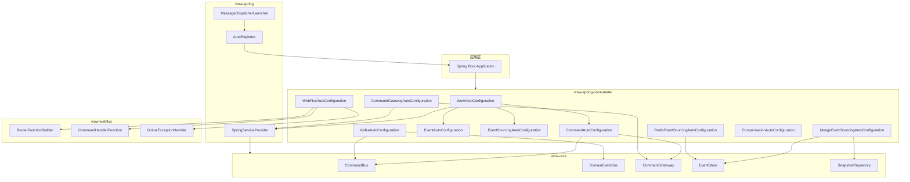
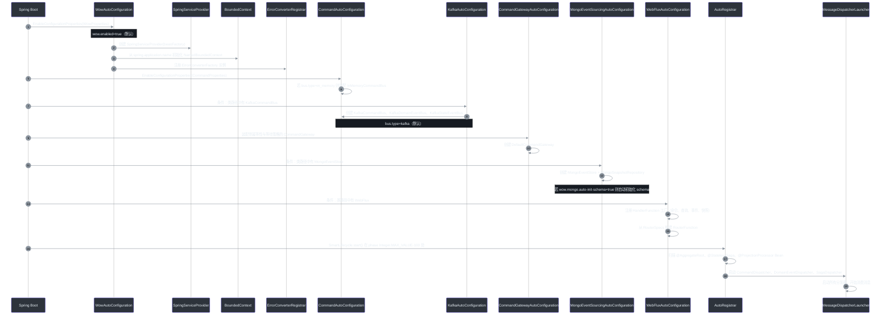
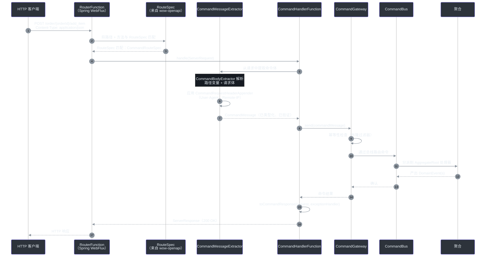

# Spring Boot 集成

Wow 框架通过两个核心模块提供一流的 Spring Boot 集成：`wow-spring`（Spring 上下文桥接）和 `wow-spring-boot-starter`（具有 Gradle 功能能力的自动配置）。它们共同实现了自动 Bean 装配、生命周期感知的消息分发器管理，以及通过 [WebFlux 路由](#webflux-command-endpoint-flow) 实现的声明式 REST API。

## 集成理念

Wow 的 Spring Boot 集成遵循三个设计原则：

1. **约定优于配置** —— 所有框架组件基于类路径检测和合理的默认值自动装配。你仅需要配置需要覆盖的部分。
2. **渐进式能力采纳** —— 每个子系统（Kafka、MongoDB、Redis、WebFlux 等）都是一个独立的 Gradle 功能能力。只需添加你的服务所需的部分。
3. **Spring 原生生命周期** —— 分发器实现 `SmartLifecycle` 以便在 Spring ApplicationContext 中优雅启停。框架尊重 `@ConditionalOnMissingBean`，因此你可以在不禁用自动配置的情况下覆盖任何默认 Bean。

## 架构概览

集成横跨三个层次：**Spring 桥接**（`wow-spring`）、**自动配置引擎**（`wow-spring-boot-starter`）以及 **WebFlux 呈现**层（`wow-webflux`）。



<!-- Sources: WowAutoConfiguration.kt:37-72, CommandAutoConfiguration.kt:38-100, EventAutoConfiguration.kt:34-82, EventSourcingAutoConfiguration.kt:24-36, CommandGatewayAutoConfiguration.kt:46-145, KafkaAutoConfiguration.kt:43-127, MongoEventSourcingAutoConfiguration.kt:47-162, RedisEventSourcingAutoConfiguration.kt:39-75, WebFluxAutoConfiguration.kt:94-582, CompensationAutoConfiguration.kt:27-56, SpringServiceProvider.kt:24-62, AutoRegistrar.kt:28-71, MessageDispatcherLauncher.kt:21-43 -->

## 功能能力

Starter 使用 Gradle 功能变体来声明**可选的依赖分组**。你根据服务需要将每个能力添加到你的构建文件中 —— 不需要的依赖永远不会出现在类路径上。

| 能力 | 功能键 | 引入的模块 | 提供什么 | 来源 |
|---|---|---|---|---|
| **Kafka** | `kafka-support` | `wow-kafka` | `KafkaCommandBus`、`KafkaDomainEventBus`、`KafkaStateEventBus` | [build.gradle.kts:22-25](https://github.com/Ahoo-Wang/Wow/blob/main/wow-spring-boot-starter/build.gradle.kts#L22-L25) |
| **MongoDB** | `mongo-support` | `wow-mongo` | `MongoEventStore`、`MongoSnapshotRepository`、查询服务工厂 | [build.gradle.kts:6-9](https://github.com/Ahoo-Wang/Wow/blob/main/wow-spring-boot-starter/build.gradle.kts#L6-L9) |
| **Redis** | `redis-support` | `wow-redis` | `RedisEventStore`、`RedisSnapshotRepository`、`RedisMessageBus` | [build.gradle.kts:14-17](https://github.com/Ahoo-Wang/Wow/blob/main/wow-spring-boot-starter/build.gradle.kts#L14-L17) |
| **R2DBC** | `r2dbc-support` | `wow-r2dbc` | 基于 R2DBC 的 `EventStore` 和 `SnapshotRepository` | [build.gradle.kts:10-13](https://github.com/Ahoo-Wang/Wow/blob/main/wow-spring-boot-starter/build.gradle.kts#L10-L13) |
| **Elasticsearch** | `elasticsearch-support` | `wow-elasticsearch` | 以 Elasticsearch 为后端的投影 | [build.gradle.kts:32-35](https://github.com/Ahoo-Wang/Wow/blob/main/wow-spring-boot-starter/build.gradle.kts#L32-L35) |
| **WebFlux** | `webflux-support` | `wow-webflux` | 基于 `RouterFunction` 的命令端点、等待策略、全局错误处理 | [build.gradle.kts:27-30](https://github.com/Ahoo-Wang/Wow/blob/main/wow-spring-boot-starter/build.gradle.kts#L27-L30) |
| **OpenTelemetry** | `opentelemetry-support` | `wow-opentelemetry` | 通过 OpenTelemetry 实现的分布式追踪和指标 | [build.gradle.kts:36-39](https://github.com/Ahoo-Wang/Wow/blob/main/wow-spring-boot-starter/build.gradle.kts#L36-L39) |
| **OpenAPI** | `openapi-support` | `wow-openapi` | 从命令/事件元数据自动生成 OpenAPI 规范 | [build.gradle.kts:40-43](https://github.com/Ahoo-Wang/Wow/blob/main/wow-spring-boot-starter/build.gradle.kts#L40-L43) |
| **CoSec** | `cosec-support` | `wow-cosec` | 通过 CoSec 策略引擎进行授权 | [build.gradle.kts:44-47](https://github.com/Ahoo-Wang/Wow/blob/main/wow-spring-boot-starter/build.gradle.kts#L44-L47) |
| **Mock** | `mock-support` | `wow-mock` | 所有存储的内存测试替身 | [build.gradle.kts:18-21](https://github.com/Ahoo-Wang/Wow/blob/main/wow-spring-boot-starter/build.gradle.kts#L18-L21) |

### 在 Gradle 中的用法

要在你的 Gradle 构建中添加一个能力，将其声明为 `capability` 依赖：

```kotlin
// build.gradle.kts
dependencies {
    implementation("me.ahoo.wow:wow-spring-boot-starter")
    implementation("me.ahoo.wow:wow-spring-boot-starter") {
        capabilities {
            requireCapability("me.ahoo.wow:mongo-support")
            requireCapability("me.ahoo.wow:kafka-support")
            requireCapability("me.ahoo.wow:webflux-support")
        }
    }
}
```

## 自动配置序列

自动配置过程遵循 Spring Boot 的标准生命周期，但增加了 Wow 特有的装配步骤：服务提供者注册、限界上下文初始化、基于配置的总线装配以及分发器启动排序。



<!-- Sources: WowAutoConfiguration.kt:37-72, ConditionalOnWowEnabled.kt:19-27, CommandAutoConfiguration.kt:38-100, KafkaAutoConfiguration.kt:43-127, CommandGatewayAutoConfiguration.kt:46-145, MongoEventSourcingAutoConfiguration.kt:47-162, WebFluxAutoConfiguration.kt:94-582, AutoRegistrar.kt:28-71, MessageDispatcherLauncher.kt:21-43 -->

## 核心自动配置（`WowAutoConfiguration`）

核心自动配置类，使用 `@AutoConfiguration` 注解并由 `@ConditionalOnWowEnabled` 守卫，注册了每个 Wow 服务都需要的三个基础 Bean。

| Bean | 类型 | 角色 | 来源 |
|---|---|---|---|
| `serviceProvider` | `SpringServiceProvider` | 桥接 Spring 的 `BeanFactory` 与 Wow 的 `ServiceProvider` IOC 抽象 | [WowAutoConfiguration.kt:47-51](https://github.com/Ahoo-Wang/Wow/blob/main/wow-spring-boot-starter/src/main/kotlin/me/ahoo/wow/spring/boot/starter/WowAutoConfiguration.kt#L47-L51) |
| `wowCurrentBoundedContext` | `MaterializedNamedBoundedContext` | 从 `wow.context-name` 或 `spring.application.name` 派生上下文名称，并设置全局的 `CurrentBoundedContext` | [WowAutoConfiguration.kt:53-61](https://github.com/Ahoo-Wang/Wow/blob/main/wow-spring-boot-starter/src/main/kotlin/me/ahoo/wow/spring/boot/starter/WowAutoConfiguration.kt#L53-L61) |
| `errorConverterRegistrar` | `ErrorConverterRegistrar` | 收集所有 `ErrorConverterFactory` Bean（按 `@Order` 排序），并将其全局注册 | [WowAutoConfiguration.kt:63-71](https://github.com/Ahoo-Wang/Wow/blob/main/wow-spring-boot-starter/src/main/kotlin/me/ahoo/wow/spring/boot/starter/WowAutoConfiguration.kt#L63-L71) |

### `SpringServiceProvider` 如何桥接到 Spring

`SpringServiceProvider` 包装了一个 `ConfigurableBeanFactory`，并将 Wow 的 IOC 抽象直接转换为 Spring Bean 查找。服务注册变为 `registerSingleton`，而服务检索则委托给 `getBeanProvider`，将 Kotlin `KType` 转换为 Spring `ResolvableType`。

<!-- Source: SpringServiceProvider.kt:24-62 -->

```kotlin
// 核心查找：KType -> ResolvableType -> BeanProvider.getIfAvailable()
override fun <S : Any> getService(serviceType: KType): S? {
    val resolvableType = ResolvableType.forType(serviceType.javaType)
    return delegate.getBeanProvider<S>(resolvableType).getIfAvailable()
}
```

这种设计意味着 Wow 框架代码从不直接依赖 Spring API —— 它始终通过抽象的 `ServiceProvider` 接口解析依赖，而在生产环境中该接口由 Spring 上下文支持。

### `@ConditionalOnWowEnabled` 关闸

一个单一的元注解把控着所有 Wow 自动配置类。它检查 `wow.enabled`（默认：`true`）并充当主关停开关。

<!-- Source: ConditionalOnWowEnabled.kt:19-27 -->

```kotlin
@ConditionalOnProperty(
    value = [ConditionalOnWowEnabled.ENABLED_KEY],  // "wow.enabled"
    matchIfMissing = true,
    havingValue = "true",
)
annotation class ConditionalOnWowEnabled
```

设置 `wow.enabled=false` 将在当前应用上下文中禁用整个框架 —— 在需要最小 Spring 上下文的集成测试场景中非常有用。

## 总线架构与本地优先优化

Wow 支持四种总线类型，每种均可通过 `wow.command.bus.type` 和 `wow.event.bus.type` 选择。总线架构中包含一个**本地优先**优化层，当源和目标在同一个 JVM 中时，将消息路由到内存总线。

| 总线类型 | 配置值 | 行为 | 来源 |
|---|---|---|---|
| **Kafka** | `kafka`（默认） | 通过 Kafka 主题实现的分布式总线；使用 `KafkaCommandBus`、`KafkaDomainEventBus`、`KafkaStateEventBus` | [BusProperties.kt:21-46](https://github.com/Ahoo-Wang/Wow/blob/main/wow-spring-boot-starter/src/main/kotlin/me/ahoo/wow/spring/boot/starter/BusProperties.kt#L21-L46) |
| **Redis** | `redis` | 通过 Redis 发布/订阅实现的分布式总线 | [BusProperties.kt:34](https://github.com/Ahoo-Wang/Wow/blob/main/wow-spring-boot-starter/src/main/kotlin/me/ahoo/wow/spring/boot/starter/BusProperties.kt#L34) |
| **内存** | `in_memory` | 仅本地的总线；无需外部消息依赖 | [BusProperties.kt:35](https://github.com/Ahoo-Wang/Wow/blob/main/wow-spring-boot-starter/src/main/kotlin/me/ahoo/wow/spring/boot/starter/BusProperties.kt#L35) |
| **空操作** | `no_op` | 静默丢弃所有事件；适用于仅事件测试 | [BusProperties.kt:36](https://github.com/Ahoo-Wang/Wow/blob/main/wow-spring-boot-starter/src/main/kotlin/me/ahoo/wow/spring/boot/starter/BusProperties.kt#L36) |

### 本地优先如何运作

当 `local-first.enabled=true`（默认）时，自动配置会创建一个 `LocalFirstCommandBus`（以及相应的事件总线），该总线同时包装了 `LocalCommandBus`（内存）和 `DistributedCommandBus`（例如，Kafka）。本地优先总线首先尝试本地总线；能够本地处理的消息永远不会离开 JVM。

<!-- Source: CommandAutoConfiguration.kt:60-69 -->

```kotlin
@Bean
@Primary
@ConditionalOnBean(value = [LocalCommandBus::class, DistributedCommandBus::class])
@ConditionalOnCommandLocalFirstEnabled
fun localFirstCommandBus(
    localBus: LocalCommandBus,
    distributedBus: DistributedCommandBus
): LocalFirstCommandBus {
    return LocalFirstCommandBus(distributedBus, localBus)
}
```

此优化对性能至关重要，因为单个服务通常处理自己的命令（聚合状态变更）。如果没有本地优先优化，每条命令即使在处理器位于相同位置的情况下，也必须通过外部代理往返传输。

## 存储类型选择

事件存储和快照存储可以独立配置。框架支持多种存储后端，通过 `wow.eventsourcing.store.storage` 和 `wow.eventsourcing.snapshot.storage` 选择。

| 存储类型 | 配置值 | EventStore 后端 | Snapshot 后端 | 来源 |
|---|---|---|---|---|
| **MongoDB** | `mongo`（默认） | `MongoEventStore` | `MongoSnapshotRepository` | [StorageType.kt:26-27](https://github.com/Ahoo-Wang/Wow/blob/main/wow-spring-boot-starter/src/main/kotlin/me/ahoo/wow/spring/boot/starter/eventsourcing/StorageType.kt#L26-L27) |
| **Redis** | `redis` | `RedisEventStore` | `RedisSnapshotRepository` | [StorageType.kt:27](https://github.com/Ahoo-Wang/Wow/blob/main/wow-spring-boot-starter/src/main/kotlin/me/ahoo/wow/spring/boot/starter/eventsourcing/StorageType.kt#L27) |
| **R2DBC** | `r2dbc` | R2DBC `EventStore` | R2DBC `SnapshotRepository` | [StorageType.kt:28](https://github.com/Ahoo-Wang/Wow/blob/main/wow-spring-boot-starter/src/main/kotlin/me/ahoo/wow/spring/boot/starter/eventsourcing/StorageType.kt#L28) |
| **内存** | `in_memory` | `InMemoryEventStore` | N/A（仅测试） | [StorageType.kt:30](https://github.com/Ahoo-Wang/Wow/blob/main/wow-spring-boot-starter/src/main/kotlin/me/ahoo/wow/spring/boot/starter/eventsourcing/StorageType.kt#L30) |
| **Elasticsearch** | `elasticsearch` | N/A | 以 Elasticsearch 为后端的快照 | [StorageType.kt:29](https://github.com/Ahoo-Wang/Wow/blob/main/wow-spring-boot-starter/src/main/kotlin/me/ahoo/wow/spring/boot/starter/eventsourcing/StorageType.kt#L29) |

每种存储的自动配置使用 `@ConditionalOnProperty`，仅在其存储类型被选中时激活，因此只会创建所需的后端 Bean。

## 快照策略配置

快照通过定期持久化聚合状态来减少事件重放开销。配置控制触发策略和版本偏移量。

| 属性 | 类型 | 默认值 | 描述 | 来源 |
|---|---|---|---|---|
| `wow.eventsourcing.snapshot.enabled` | `Boolean` | `true` | 主开关；`false` 使用 `NoOpSnapshotRepository` | [SnapshotProperties.kt:23-35](https://github.com/Ahoo-Wang/Wow/blob/main/wow-spring-boot-starter/src/main/kotlin/me/ahoo/wow/spring/boot/starter/eventsourcing/snapshot/SnapshotProperties.kt#L23-L35) |
| `wow.eventsourcing.snapshot.strategy` | `Strategy` | `all` | `all` = 每次事件后快照；`version_offset` = 每 N 次版本增量后快照 | [SnapshotProperties.kt:26](https://github.com/Ahoo-Wang/Wow/blob/main/wow-spring-boot-starter/src/main/kotlin/me/ahoo/wow/spring/boot/starter/eventsourcing/snapshot/SnapshotProperties.kt#L26) |
| `wow.eventsourcing.snapshot.version-offset` | `Int` | `5` | 当策略为 `version_offset` 时，快照之间的版本数 | [SnapshotProperties.kt:27](https://github.com/Ahoo-Wang/Wow/blob/main/wow-spring-boot-starter/src/main/kotlin/me/ahoo/wow/spring/boot/starter/eventsourcing/snapshot/SnapshotProperties.kt#L27) |
| `wow.eventsourcing.snapshot.storage` | `StorageType` | `mongo` | 快照持久化的后端 | [SnapshotProperties.kt:28](https://github.com/Ahoo-Wang/Wow/blob/main/wow-spring-boot-starter/src/main/kotlin/me/ahoo/wow/spring/boot/starter/eventsourcing/snapshot/SnapshotProperties.kt#L28) |

## 配置属性参考

所有配置使用 `wow.*` 前缀。每个子系统有自己嵌套的命名空间。

### 核心属性（`wow.*`）

| 属性 | 类型 | 默认值 | 描述 | 来源 |
|---|---|---|---|---|
| `wow.enabled` | `Boolean` | `true` | 整个框架的主启用/禁用开关 | [WowProperties.kt:24-30](https://github.com/Ahoo-Wang/Wow/blob/main/wow-spring-boot-starter/src/main/kotlin/me/ahoo/wow/spring/boot/starter/WowProperties.kt#L24-L30) |
| `wow.context-name` | `String` | `${spring.application.name}` | 限界上下文名称；回退到 Spring 的应用名称 | [WowProperties.kt:27](https://github.com/Ahoo-Wang/Wow/blob/main/wow-spring-boot-starter/src/main/kotlin/me/ahoo/wow/spring/boot/starter/WowProperties.kt#L27) |
| `wow.shutdown-timeout` | `Duration` | `60s` | 所有分发器的优雅关闭超时 | [WowProperties.kt:29](https://github.com/Ahoo-Wang/Wow/blob/main/wow-spring-boot-starter/src/main/kotlin/me/ahoo/wow/spring/boot/starter/WowProperties.kt#L29) |

### 命令属性（`wow.command.*`）

| 属性 | 类型 | 默认值 | 描述 | 来源 |
|---|---|---|---|---|
| `wow.command.bus.type` | `BusType` | `kafka` | 命令总线类型（`kafka`、`redis`、`in_memory`、`no_op`） | [BusProperties.kt:21-22](https://github.com/Ahoo-Wang/Wow/blob/main/wow-spring-boot-starter/src/main/kotlin/me/ahoo/wow/spring/boot/starter/BusProperties.kt#L21-L22) |
| `wow.command.bus.local-first.enabled` | `Boolean` | `true` | 为命令启用本地优先优化 | [BusProperties.kt:31](https://github.com/Ahoo-Wang/Wow/blob/main/wow-spring-boot-starter/src/main/kotlin/me/ahoo/wow/spring/boot/starter/BusProperties.kt#L31) |
| `wow.command.idempotency.enabled` | `Boolean` | `true` | 启用基于布隆过滤器的幂等性检查 | [CommandProperties.kt:36-49](https://github.com/Ahoo-Wang/Wow/blob/main/wow-spring-boot-starter/src/main/kotlin/me/ahoo/wow/spring/boot/starter/command/CommandProperties.kt#L36-L49) |
| `wow.command.idempotency.bloom-filter.ttl` | `Duration` | `PT1M` | 布隆过滤器条目的生存时间 | [CommandProperties.kt:45](https://github.com/Ahoo-Wang/Wow/blob/main/wow-spring-boot-starter/src/main/kotlin/me/ahoo/wow/spring/boot/starter/command/CommandProperties.kt#L45) |
| `wow.command.idempotency.bloom-filter.expected-insertions` | `Long` | `1000000` | 预期的唯一命令 ID 数量 | [CommandProperties.kt:46](https://github.com/Ahoo-Wang/Wow/blob/main/wow-spring-boot-starter/src/main/kotlin/me/ahoo/wow/spring/boot/starter/command/CommandProperties.kt#L46) |
| `wow.command.idempotency.bloom-filter.fpp` | `Double` | `0.00001` | 假阳性概率（0.001%） | [CommandProperties.kt:47](https://github.com/Ahoo-Wang/Wow/blob/main/wow-spring-boot-starter/src/main/kotlin/me/ahoo/wow/spring/boot/starter/command/CommandProperties.kt#L47) |

### 事件属性（`wow.event.*`）

| 属性 | 类型 | 默认值 | 描述 | 来源 |
|---|---|---|---|---|
| `wow.event.bus.type` | `BusType` | `kafka` | 事件总线类型 | [EventProperties.kt:21-30](https://github.com/Ahoo-Wang/Wow/blob/main/wow-spring-boot-starter/src/main/kotlin/me/ahoo/wow/spring/boot/starter/event/EventProperties.kt#L21-L30) |
| `wow.event.bus.local-first.enabled` | `Boolean` | `true` | 为事件启用本地优先优化 | [BusProperties.kt:31](https://github.com/Ahoo-Wang/Wow/blob/main/wow-spring-boot-starter/src/main/kotlin/me/ahoo/wow/spring/boot/starter/BusProperties.kt#L31) |

### Kafka 属性（`wow.kafka.*`）

| 属性 | 类型 | 默认值 | 描述 | 来源 |
|---|---|---|---|---|
| `wow.kafka.enabled` | `Boolean` | `true` | 启用 Kafka 自动配置 | [KafkaProperties.kt:27-38](https://github.com/Ahoo-Wang/Wow/blob/main/wow-spring-boot-starter/src/main/kotlin/me/ahoo/wow/spring/boot/starter/kafka/KafkaProperties.kt#L27-L38) |
| `wow.kafka.bootstrap-servers` | `List<String>` | -- | Kafka 引导服务器地址（必填） | [KafkaProperties.kt:30](https://github.com/Ahoo-Wang/Wow/blob/main/wow-spring-boot-starter/src/main/kotlin/me/ahoo/wow/spring/boot/starter/kafka/KafkaProperties.kt#L30) |
| `wow.kafka.topic-prefix` | `String` | `wow.` | 所有 Kafka 主题名称的前缀 | [KafkaProperties.kt:31](https://github.com/Ahoo-Wang/Wow/blob/main/wow-spring-boot-starter/src/main/kotlin/me/ahoo/wow/spring/boot/starter/kafka/KafkaProperties.kt#L31) |
| `wow.kafka.properties` | `Map<String,String>` | `{}` | 同时应用于生产者和消费者的公共属性 | [KafkaProperties.kt:35](https://github.com/Ahoo-Wang/Wow/blob/main/wow-spring-boot-starter/src/main/kotlin/me/ahoo/wow/spring/boot/starter/kafka/KafkaProperties.kt#L35) |
| `wow.kafka.producer` | `Map<String,String>` | `{}` | 生产者专有属性 | [KafkaProperties.kt:36](https://github.com/Ahoo-Wang/Wow/blob/main/wow-spring-boot-starter/src/main/kotlin/me/ahoo/wow/spring/boot/starter/kafka/KafkaProperties.kt#L36) |
| `wow.kafka.consumer` | `Map<String,String>` | `{}` | 消费者专有属性 | [KafkaProperties.kt:37](https://github.com/Ahoo-Wang/Wow/blob/main/wow-spring-boot-starter/src/main/kotlin/me/ahoo/wow/spring/boot/starter/kafka/KafkaProperties.kt#L37) |

### MongoDB 属性（`wow.mongo.*`）

| 属性 | 类型 | 默认值 | 描述 | 来源 |
|---|---|---|---|---|
| `wow.mongo.enabled` | `Boolean` | `true` | 启用 MongoDB 自动配置 | [MongoProperties.kt:21-32](https://github.com/Ahoo-Wang/Wow/blob/main/wow-spring-boot-starter/src/main/kotlin/me/ahoo/wow/spring/boot/starter/mongo/MongoProperties.kt#L21-L32) |
| `wow.mongo.auto-init-schema` | `Boolean` | `true` | 启动时自动创建 MongoDB 集合和索引 | [MongoProperties.kt:24](https://github.com/Ahoo-Wang/Wow/blob/main/wow-spring-boot-starter/src/main/kotlin/me/ahoo/wow/spring/boot/starter/mongo/MongoProperties.kt#L24) |
| `wow.mongo.event-stream-database` | `String` | Spring Data MongoDB DB | 事件流的数据库名称 | [MongoProperties.kt:25](https://github.com/Ahoo-Wang/Wow/blob/main/wow-spring-boot-starter/src/main/kotlin/me/ahoo/wow/spring/boot/starter/mongo/MongoProperties.kt#L25) |
| `wow.mongo.snapshot-database` | `String` | Spring Data MongoDB DB | 快照的数据库名称 | [MongoProperties.kt:26](https://github.com/Ahoo-Wang/Wow/blob/main/wow-spring-boot-starter/src/main/kotlin/me/ahoo/wow/spring/boot/starter/mongo/MongoProperties.kt#L26) |
| `wow.mongo.prepare-database` | `String` | Spring Data MongoDB DB | Prepare Key 的数据库名称 | [MongoProperties.kt:27](https://github.com/Ahoo-Wang/Wow/blob/main/wow-spring-boot-starter/src/main/kotlin/me/ahoo/wow/spring/boot/starter/mongo/MongoProperties.kt#L27) |

### WebFlux 属性（`wow.webflux.*`）

| 属性 | 类型 | 默认值 | 描述 | 来源 |
|---|---|---|---|---|
| `wow.webflux.enabled` | `Boolean` | `true` | 启用 WebFlux 自动配置 | [WebFluxProperties.kt:22-37](https://github.com/Ahoo-Wang/Wow/blob/main/wow-spring-boot-starter/src/main/kotlin/me/ahoo/wow/spring/boot/starter/webflux/WebFluxProperties.kt#L22-L37) |
| `wow.webflux.global-error.enabled` | `Boolean` | `true` | 启用全局错误处理器（`GlobalExceptionHandler`） | [WebFluxProperties.kt:33-36](https://github.com/Ahoo-Wang/Wow/blob/main/wow-spring-boot-starter/src/main/kotlin/me/ahoo/wow/spring/boot/starter/webflux/WebFluxProperties.kt#L33-L36) |
| `wow.webflux.command.request.appender.agent.enabled` | `Boolean` | `true` | 将 User-Agent 头部附加到命令消息 | [WebFluxAutoConfiguration.kt:163-170](https://github.com/Ahoo-Wang/Wow/blob/main/wow-spring-boot-starter/src/main/kotlin/me/ahoo/wow/spring/boot/starter/webflux/WebFluxAutoConfiguration.kt#L163-L170) |
| `wow.webflux.command.request.appender.ip.enabled` | `Boolean` | `true` | 将调用者 IP 头部附加到命令消息 | [WebFluxAutoConfiguration.kt:172-180](https://github.com/Ahoo-Wang/Wow/blob/main/wow-spring-boot-starter/src/main/kotlin/me/ahoo/wow/spring/boot/starter/webflux/WebFluxAutoConfiguration.kt#L172-L180) |

## WebFlux 命令端点流程

当服务模块包含 `webflux-support` 时，Wow 自动为域中定义的每个命令生成 REST API 端点。从 HTTP 请求到命令分发的流程涉及一个提取器、处理器和由编译后的路由规范构建的 `RouterFunction` 组成的管道。



<!-- Sources: RouterFunctionBuilder.kt:29-56, CommandHandlerFunction.kt:39-63, CommandHandlerFunction.kt:65-85, CommandMessageExtractor (wow-webflux/route/command/extractor/), CommandRequestHeaderAppender (wow-webflux/route/command/appender/), WebFluxAutoConfiguration.kt:94-582 -->

### 路由处理器函数工厂

`WebFluxAutoConfiguration` 注册了超过 **25** 个 `RouteHandlerFunctionFactory` Bean，每个负责一种特定的端点类型。以下是完整目录。

| 工厂 Bean | 支持的规范 | 用途 | 来源 |
|---|---|---|---|
| `commandHandlerFunctionFactory` | `CommandRouteSpec` | 标准命令分发 | [WebFluxAutoConfiguration.kt:461-474](https://github.com/Ahoo-Wang/Wow/blob/main/wow-spring-boot-starter/src/main/kotlin/me/ahoo/wow/spring/boot/starter/webflux/WebFluxAutoConfiguration.kt#L461-L474) |
| `commandFacadeHandlerFunctionFactory` | `CommandRouteSpec` | Facade 风格命令分发 | [WebFluxAutoConfiguration.kt:205-218](https://github.com/Ahoo-Wang/Wow/blob/main/wow-spring-boot-starter/src/main/kotlin/me/ahoo/wow/spring/boot/starter/webflux/WebFluxAutoConfiguration.kt#L205-L218) |
| `loadAggregateHandlerFunctionFactory` | `AggregateRouteSpec` | 按 ID 加载聚合 | [WebFluxAutoConfiguration.kt:221-231](https://github.com/Ahoo-Wang/Wow/blob/main/wow-spring-boot-starter/src/main/kotlin/me/ahoo/wow/spring/boot/starter/webflux/WebFluxAutoConfiguration.kt#L221-L231) |
| `loadVersionedAggregateHandlerFunctionFactory` | `AggregateRouteSpec` | 在特定版本加载聚合 | [WebFluxAutoConfiguration.kt:234-244](https://github.com/Ahoo-Wang/Wow/blob/main/wow-spring-boot-starter/src/main/kotlin/me/ahoo/wow/spring/boot/starter/webflux/WebFluxAutoConfiguration.kt#L234-L244) |
| `loadTimeBasedAggregateHandlerFunctionFactory` | `AggregateRouteSpec` | 在特定时间点加载聚合 | [WebFluxAutoConfiguration.kt:247-257](https://github.com/Ahoo-Wang/Wow/blob/main/wow-spring-boot-starter/src/main/kotlin/me/ahoo/wow/spring/boot/starter/webflux/WebFluxAutoConfiguration.kt#L247-L257) |
| `aggregateTracingHandlerFunctionFactory` | `AggregateRouteSpec` | 追踪聚合的事件历史 | [WebFluxAutoConfiguration.kt:260-272](https://github.com/Ahoo-Wang/Wow/blob/main/wow-spring-boot-starter/src/main/kotlin/me/ahoo/wow/spring/boot/starter/webflux/WebFluxAutoConfiguration.kt#L260-L272) |
| `loadEventStreamHandlerFunctionFactory` | `EventStreamRouteSpec` | 加载原始事件流 | [WebFluxAutoConfiguration.kt:477-487](https://github.com/Ahoo-Wang/Wow/blob/main/wow-spring-boot-starter/src/main/kotlin/me/ahoo/wow/spring/boot/starter/webflux/WebFluxAutoConfiguration.kt#L477-L487) |

### RouterFunction 构建

`RouterFunctionBuilder` 遍历所有 `RouteSpec` 实例（由 `wow-openapi` 从 KSP 元数据生成），并将每个实例转换为一个 Spring WebFlux `RouterFunction` 的谓词-处理器映射。

<!-- Source: RouterFunctionBuilder.kt:29-56 -->

```kotlin
fun build(): RouterFunction<ServerResponse> {
    val routerFunctionBuilder = RouterFunctions.route()
    for (routeSpec in routerSpecs) {
        val requestPredicate = RequestPredicates.path(routeSpec.path)
            .and(RequestPredicates.method(HttpMethod.valueOf(routeSpec.method)))
            .and(RequestPredicates.accept(*acceptMediaTypes))
        val factory = routeHandlerFunctionRegistrar.getFactory(routeSpec)
        val handlerFunction = factory.create(routeSpec)
        routerFunctionBuilder.route(requestPredicate, handlerFunction)
    }
    return routerFunctionBuilder.build()
}
```

## SmartLifecycle：优雅启动与关闭

Wow 的消息分发器通过 `MessageDispatcherLauncher` 实现 Spring 的 `SmartLifecycle` 接口，确保它们在所有 Bean 装配完成后启动，并在上下文关闭前优雅停止。

<!-- Source: MessageDispatcherLauncher.kt:21-43 -->

启动序列采用有序阶段的方法：
- **`AutoRegistrar`** 在 `DEFAULT_PHASE - 100`（比正常稍早）运行。它扫描上下文中带注解的 Bean（`@AggregateRoot`、`@StatelessSaga`、`@ProjectionProcessor`），并将它们注册为消息处理器。
- **`MessageDispatcherLauncher`** 在默认阶段运行。当所有注册器完成后，每个启动器调用 `messageDispatcher.start()` 开始从总线消费消息。

在关闭时，`messageDispatcher.stop(shutdownTimeout)` 被调用，使用配置的超时（默认 60 秒），为正在进行的消息提供完成时间。

## 应用配置示例

### 完整生产配置（Kafka + MongoDB + WebFlux）

```yaml
spring:
  application:
    name: order-service
  data:
    mongodb:
      uri: mongodb://localhost:27017/order_db

wow:
  enabled: true
  context-name: order-service
  shutdown-timeout: 60s
  command:
    bus:
      type: kafka
      local-first:
        enabled: true
    idempotency:
      enabled: true
      bloom-filter:
        ttl: PT1M
        expected-insertions: 1000000
        fpp: 0.00001
  event:
    bus:
      type: kafka
      local-first:
        enabled: true
  eventsourcing:
    store:
      storage: mongo
    snapshot:
      enabled: true
      strategy: version_offset
      version-offset: 5
      storage: mongo
    state:
      bus:
        type: kafka
        local-first:
          enabled: true
  kafka:
    bootstrap-servers: localhost:9092
    topic-prefix: 'wow.'
    consumer:
      group.id: order-service
      auto.offset.reset: earliest
  mongo:
    enabled: true
    auto-init-schema: true
  webflux:
    enabled: true
    global-error:
      enabled: true
```

### 开发环境配置（内存 + 无 Kafka）

```yaml
spring:
  application:
    name: order-service-dev

wow:
  enabled: true
  context-name: order-service
  command:
    bus:
      type: in_memory
  event:
    bus:
      type: in_memory
  eventsourcing:
    store:
      storage: in_memory
    snapshot:
      enabled: false
  kafka:
    enabled: false
  mongo:
    enabled: false
```

### 多模块项目结构

在典型的 Wow 项目中，Spring Boot Starter 位于服务模块中，同时包含所选基础设施的能力依赖。

```
my-project/
├── my-project-api/          # 命令、事件、查询模型（wow-api）
├── my-project-domain/       # 聚合、Saga、投影（wow-core + wow-compiler）
├── my-project-server/       # Spring Boot 入口点 + 基础设施
│   ├── build.gradle.kts
│   └── src/main/resources/
│       └── application.yml
└── build.gradle.kts
```

<!-- Source: build.gradle.kts (root wow-spring-boot-starter) -->

**服务模块 `build.gradle.kts`：**

```kotlin
plugins {
    id("org.springframework.boot")
    kotlin("plugin.spring")
}

dependencies {
    implementation(project(":my-project-domain"))
    implementation("me.ahoo.wow:wow-spring-boot-starter")

    // 仅添加你需要的功能：
    implementation("me.ahoo.wow:wow-spring-boot-starter") {
        capabilities {
            requireCapability("me.ahoo.wow:mongo-support")
            requireCapability("me.ahoo.wow:kafka-support")
            requireCapability("me.ahoo.wow:webflux-support")
        }
    }
}
```

## 自定义模式

### 覆盖默认 Bean

任何自动配置的 Bean 都可以通过声明你自己的 Bean 来替换。使用 `@ConditionalOnMissingBean` 作为自动配置中的保证：

```kotlin
@Configuration
class CustomWowConfiguration {

    @Bean
    @Primary
    fun customCommandGateway(
        commandWaitEndpoint: CommandWaitEndpoint,
        commandBus: CommandBus,
        validator: Validator,
        idempotencyCheckerProvider: AggregateIdempotencyCheckerProvider,
        waitStrategyRegistrar: WaitStrategyRegistrar,
        commandWaitNotifier: CommandWaitNotifier
    ): CommandGateway {
        // 自定义实现 —— 替换 DefaultCommandGateway
        return CustomCommandGateway(
            commandWaitEndpoint, commandBus, validator,
            idempotencyCheckerProvider, waitStrategyRegistrar, commandWaitNotifier
        )
    }
}
```

### 禁用一项功能能力

每个功能能力都有一个 `enabled` 属性。在 `application.yml` 中将其设为 `false`：

```yaml
wow:
  kafka:
    enabled: false       # Kafka 总线已禁用
  mongo:
    enabled: false       # MongoDB 存储已禁用
  webflux:
    enabled: false       # 不注册 REST 端点
```

## 相关页面

| 页面 | 描述 |
|---|---|
| [配置参考](../../reference/config/basic.md) | 公共配置属性参考 |
| [WebFlux 扩展](../../guide/extensions/webflux.md) | WebFlux 路由注册与等待策略 |
| [Spring Boot Starter 指南](../../guide/extensions/spring-boot-starter.md) | Starter 模块入门 |
| [命令总线架构](../architecture/command-bus.md) | 深入命令路由与分发 |
| [事件溯源架构](../architecture/event-sourcing.md) | 事件存储和快照如何运作 |
| [Saga 编排](../architecture/saga.md) | 分布式事务管理 |
