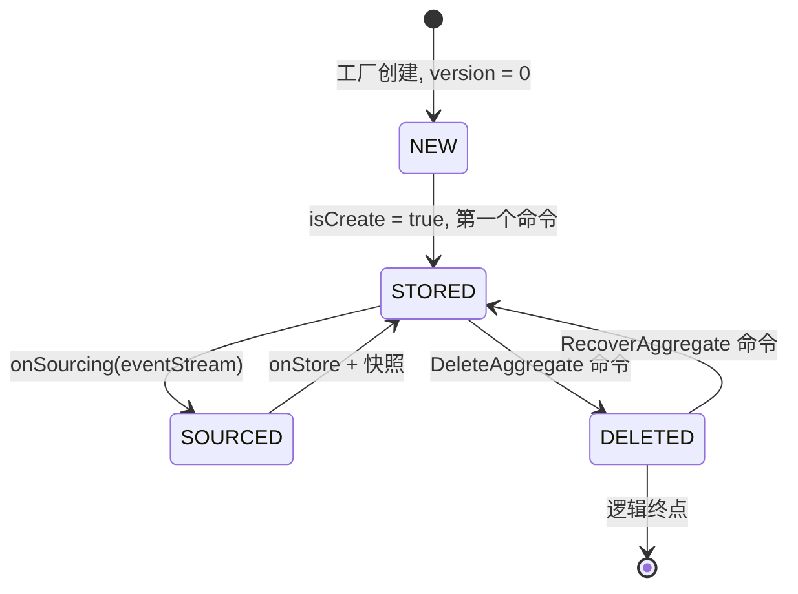
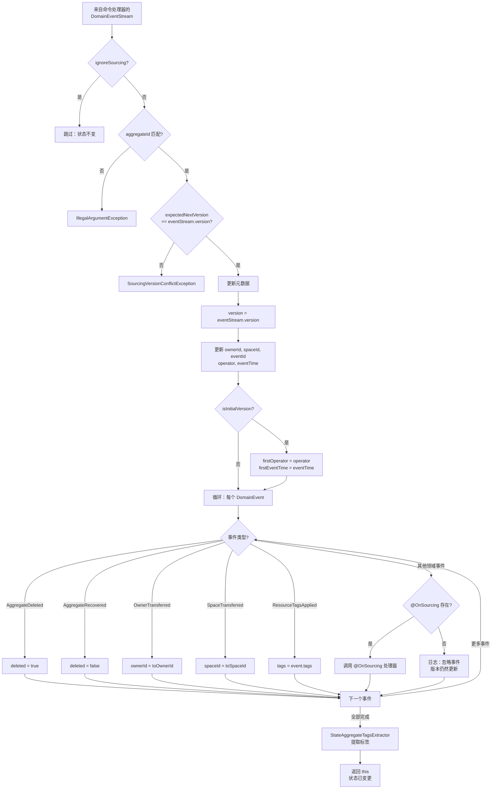
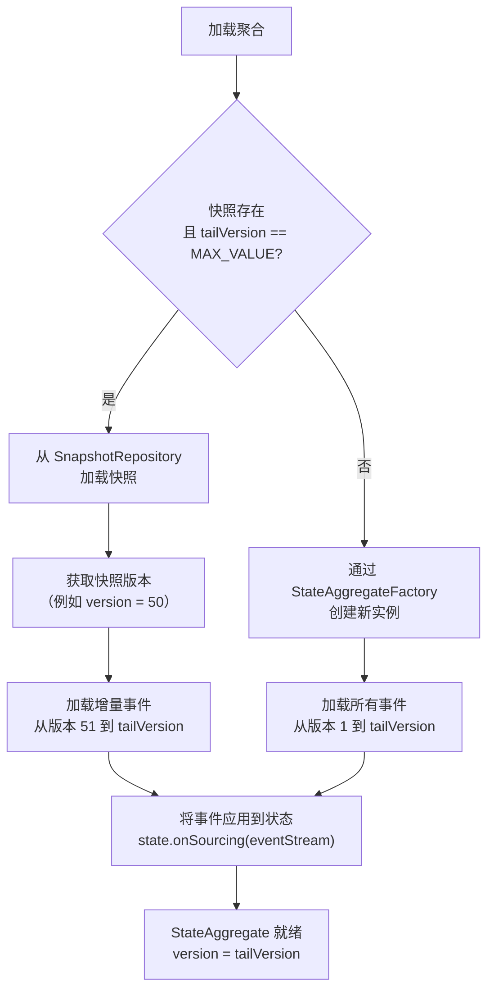

# 聚合生命周期

聚合是 Wow 框架中的核心领域对象。其生命周期规定了命令如何接收、事件如何溯源、状态如何变更，以及聚合如何创建、软删除和恢复。Wow 中的每个聚合都遵循一个定义良好的状态机，由确定性事件溯源和乐观并发控制支持。

**为什么这很重要**：理解聚合生命周期对于设计正确的领域模型至关重要。您编写的每个命令处理器、每个 `@OnSourcing` 方法以及每个业务规则都在生命周期的特定阶段内运行。误解它会导致竞态条件、过期状态或错误的事件排序。

## 速查摘要

| 阶段 | 关键接口 / 类 | 发生了什么 | Source |
|---|---|---|---|
| **创建** | `CommandMessage.isCreate`、`@CreateAggregate`、`StateAggregateFactory` | 新聚合以版本 0 实例化，准备好接收第一个命令 | [CommandMessage.kt:105](https://github.com/Ahoo-Wang/Wow/blob/main/wow-api/src/main/kotlin/me/ahoo/wow/api/command/CommandMessage.kt#L105) |
| **命令验证** | `SimpleCommandAggregate.process()`、`CommandState.STORED` | 版本、所有权和初始化检查在任何处理器运行之前发生 | [SimpleCommandAggregate.kt:82-138](https://github.com/Ahoo-Wang/Wow/blob/main/wow-core/src/main/kotlin/me/ahoo/wow/modeling/command/SimpleCommandAggregate.kt#L82-L138) |
| **命令执行** | `@OnCommand`、`CommandFunction.invoke()` | 业务逻辑运行，产生领域事件 | [OnCommand.kt:69-87](https://github.com/Ahoo-Wang/Wow/blob/main/wow-api/src/main/kotlin/me/ahoo/wow/api/annotation/OnCommand.kt#L69-L87) |
| **事件溯源** | `@OnSourcing`、`CommandState.onSourcing()`、`SimpleStateAggregate.onSourcing()` | 事件被确定性地应用到聚合状态 | [OnSourcing.kt:55-59](https://github.com/Ahoo-Wang/Wow/blob/main/wow-api/src/main/kotlin/me/ahoo/wow/api/annotation/OnSourcing.kt#L55-L59) |
| **事件持久化** | `EventStore.append()`、`CommandState.onStore()` | 事件通过版本冲突检查原子性地提交 | [CommandAggregate.kt:76-83](https://github.com/Ahoo-Wang/Wow/blob/main/wow-core/src/main/kotlin/me/ahoo/wow/modeling/command/CommandAggregate.kt#L76-L83) |
| **删除** | `DefaultDeleteAggregate`、`AggregateDeleted`、`DeletedCapable.deleted` | 通过 `DefaultAggregateDeleted` 事件软删除；无硬删除 | [DefaultDeleteAggregateFunction.kt:33-46](https://github.com/Ahoo-Wang/Wow/blob/main/wow-core/src/main/kotlin/me/ahoo/wow/modeling/command/DefaultDeleteAggregateFunction.kt#L33-L46) |
| **恢复** | `DefaultRecoverAggregate`、`AggregateRecovered` | 将软删除的聚合恢复到活动状态 | [DefaultRecoverAggregateFunction.kt:33-46](https://github.com/Ahoo-Wang/Wow/blob/main/wow-core/src/main/kotlin/me/ahoo/wow/modeling/command/DefaultRecoverAggregateFunction.kt#L33-L46) |

## 高层生命周期状态机

聚合生命周期横跨从创建到活动命令处理，再到可选的删除和恢复。以下状态图展示了完整的生命周期。



<!-- Sources: wow-core/src/main/kotlin/me/ahoo/wow/modeling/command/CommandAggregate.kt:41-118, wow-core/src/main/kotlin/me/ahoo/wow/modeling/command/SimpleCommandAggregate.kt:66, wow-api/src/main/kotlin/me/ahoo/wow/api/Version.kt:41-68, wow-api/src/main/kotlin/me/ahoo/wow/api/modeling/DeletedCapable.kt:25-32 -->

## 阶段 1：聚合创建

聚合的生命始于 **创建命令** 到达时。创建命令通过 `CommandMessage` 上的 `isCreate` 标志与修改命令区分开来。

### 框架如何决定创建还是加载

`RetryableAggregateProcessor`（[RetryableAggregateProcessor.kt:54-72](https://github.com/Ahoo-Wang/Wow/blob/main/wow-core/src/main/kotlin/me/ahoo/wow/modeling/command/RetryableAggregateProcessor.kt#L54-L72)）做出关键的分支决策：

```kotlin
val stateAggregateMono = if (exchange.message.isCreate) {
    aggregateFactory.createAsMono(aggregateMetadata.state, exchange.message.aggregateId)
} else {
    stateAggregateRepository.load(aggregateId, aggregateMetadata.state)
}
```

<!-- Source: wow-core/src/main/kotlin/me/ahoo/wow/modeling/command/RetryableAggregateProcessor.kt:55-59 -->

| 条件 | 操作 | 初始版本 |
|---|---|---|
| `isCreate = true` | `StateAggregateFactory.createAsMono()` 创建新实例 | `0`（`UNINITIALIZED_VERSION`） |
| `isCreate = false` | `StateAggregateRepository.load()` 从快照/事件存储加载 | `>= 0`（从事件重建） |

### 创建命令注解

用于创建聚合的命令应使用 `@CreateAggregate` 注解。该注解将命令标记为初始化命令，用于建立聚合的初始状态。

```kotlin
@CreateAggregate
data class CreateUserCommand(
    @AggregateId
    val userId: String,
    val email: String,
    val name: String
)
```

<!-- Source: wow-api/src/main/kotlin/me/ahoo/wow/api/annotation/CreateAggregate.kt:30-56 -->

### 示例：示例项目中的订单创建

示例 `Order` 聚合演示了一个创建命令处理器。当 `CreateOrder` 到达时，处理器验证业务规则，返回 `OrderCreated` 事件，并设置命令结果。

```kotlin
fun onCommand(
    command: CommandMessage<CreateOrder>,
    @Name("createOrderSpec") specification: CreateOrderSpec,
    commandResultAccessor: CommandResultAccessor
): Mono<OrderCreated> {
    val createOrder = command.body
    require(createOrder.items.isNotEmpty()) {
        "items can not be empty."
    }
    return Flux
        .fromIterable(createOrder.items)
        .flatMap(specification::require)
        .then(
            OrderCreated(
                orderId = command.aggregateId.id,
                items = createOrder.items.map { /* ... */ },
                address = createOrder.address,
                fromCart = createOrder.fromCart,
            ).toMono().doOnNext { orderCreated ->
                commandResultAccessor.setCommandResult(
                    OrderState::totalAmount.name,
                    orderCreated.items.sumOf { it.totalPrice }
                )
            }
        )
}
```

<!-- Source: example/example-domain/src/main/kotlin/me/ahoo/wow/example/domain/order/Order.kt:106-138 -->

创建处理器的关键点：
- 聚合处于初始状态（版本 = 0），因此没有现有状态需要验证——只应用命令字段验证。
- 处理器可以是同步的（直接返回事件）或响应式的（返回 `Mono`）。
- 外部服务（如 `CreateOrderSpec`）可以通过 `@Name` 限定符注入到处理器方法中。

## 阶段 2：命令处理周期

一旦聚合存在（无论是新创建还是从事件存储加载），它就进入 **命令处理周期**。这是聚合生命周期的核心，命令在这里被验证、执行、溯源和持久化。

### 命令处理时序

以下时序图展示了从命令到达到事件持久化的完整流程，以 `SimpleCommandAggregate.process()` 方法为主要参考。

```mermaid
sequenceDiagram
%%{init: {'theme': 'dark', 'themeVariables': {'primaryColor': '#2d333b', 'primaryTextColor': '#e6edf3', 'primaryBorderColor': '#6d5dfc', 'lineColor': '#8b949e', 'noteBkgColor': '#161b22', 'noteTextColor': '#e6edf3', 'actorBkg': '#2d333b', 'actorBorder': '#6d5dfc', 'actorTextColor': '#e6edf3', 'signalColor': '#8b949e', 'signalTextColor': '#e6edf3', 'labelBoxBkgColor': '#2d333b', 'labelBoxBorderColor': '#6d5dfc', 'labelTextColor': '#e6edf3', 'loopTextColor': '#e6edf3', 'activationBorderColor': '#6d5dfc', 'activationBkgColor': '#1a1f2e'}}}%%
    autonumber
    participant RAP as RetryableAggregateProcessor
    participant SCA as SimpleCommandAggregate
    participant SA as StateAggregate
    participant CF as CommandFunction
    participant EF as ErrorFunction
    participant ES as EventStore
    participant EB as EventBus

    RAP->>SCA: process(exchange)

    Note over SCA: 设置处理器函数<br>在 exchange 上设置聚合版本

    rect rgb(22, 27, 34)
        Note over SCA: === 执行前验证 ===

        SCA->>SCA: 检查 aggregateVersion 匹配<br>（乐观并发控制）
        alt 版本不匹配
            SCA-->>RAP: CommandExpectVersionConflictException
        end

        SCA->>SCA: 检查 initialized || isCreate || allowCreate
        alt 未初始化且不是创建命令
            SCA-->>RAP: NotFoundResourceException
        end

        SCA->>SCA: 检查 ownerId 匹配<br>（如果 command.ownerId 不为空）
        alt 所有者不匹配
            SCA-->>RAP: IllegalAccessOwnerAggregateException
        end

        SCA->>SCA: 检查 spaceId 匹配<br>（如果 command.spaceId 不为空）
        alt 空间不匹配
            SCA-->>RAP: IllegalAccessSpaceAggregateException
        end

        SCA->>SCA: 断言 CommandState == STORED
        alt 不是 STORED
            SCA-->>RAP: IllegalStateException
        end

        SCA->>SCA: 如果是 RecoverAggregate，检查 state.deleted == true
        SCA->>SCA: 否则如果 state.deleted == true
        alt 已删除的聚合
            SCA-->>RAP: IllegalAccessDeletedAggregateException
        end
    end

    Note over SCA: === 命令执行 ===

    SCA->>CF: invoke(exchange)
    CF-->>SCA: DomainEventStream（来自命令处理器）

    Note over SCA: === 事件溯源（状态变更） ===

    SCA->>SA: commandState.onSourcing(state, eventStream)
    SA->>SA: 验证 aggregateId 匹配
    SA->>SA: 验证 expectedVersion 匹配
    alt 版本冲突
        SA-->>SCA: SourcingVersionConflictException
    end
    SA->>SA: 更新元数据<br>（version, ownerId, eventId, operator, eventTime）
    loop eventStream 中的每个 DomainEvent
        SA->>SA: 将事件应用到状态<br>（AggregateDeleted? deleted = true<br> AggregateRecovered? deleted = false<br> OwnerTransferred? ownerId = ...<br> 或已注册的 @OnSourcing 函数）
    end
    SA-->>SCA: CommandState.SOURCED

    Note over SCA: === 事件持久化 ===

    SCA->>ES: commandState.onStore(eventStore, eventStream)
    ES->>ES: 带版本检查的原子追加
    alt 存储时版本冲突
        ES-->>SCA: EventVersionConflictException<br>commandState = EXPIRED
    end
    ES-->>SCA: CommandState.STORED

    SCA-->>RAP: DomainEventStream（成功）

    Note over RAP: 事件发布到 EventBus<br>供投影、Saga、处理器使用

    rect rgb(22, 27, 34)
        Note over SCA: === 错误处理（失败时） ===
        SCA->>EF: errorResume: 调用错误函数
        EF-->>SCA: （处理或重新抛出）
    end

```



<!-- Sources: wow-core/src/main/kotlin/me/ahoo/wow/modeling/command/SimpleCommandAggregate.kt:82-138, wow-core/src/main/kotlin/me/ahoo/wow/modeling/command/RetryableAggregateProcessor.kt:54-72, wow-core/src/main/kotlin/me/ahoo/wow/modeling/state/SimpleStateAggregate.kt:96-141, wow-core/src/main/kotlin/me/ahoo/wow/modeling/command/CommandAggregate.kt:65-118 -->

### 验证门槛（执行前）

在任何命令处理器运行之前，`SimpleCommandAggregate.process()` 运行六个顺序验证门槛：

| # | 验证 | 检查内容 | 失败异常 | Source |
|---|---|---|---|---|
| 1 | **版本检查** | `command.aggregateVersion == 当前版本`（乐观并发控制） | `CommandExpectVersionConflictException` | [SimpleCommandAggregate.kt:92-98](https://github.com/Ahoo-Wang/Wow/blob/main/wow-core/src/main/kotlin/me/ahoo/wow/modeling/command/SimpleCommandAggregate.kt#L92-L98) |
| 2 | **初始化检查** | `initialized \|\| isCreate \|\| allowCreate` | `NotFoundResourceException` | [SimpleCommandAggregate.kt:99-101](https://github.com/Ahoo-Wang/Wow/blob/main/wow-core/src/main/kotlin/me/ahoo/wow/modeling/command/SimpleCommandAggregate.kt#L99-L101) |
| 3 | **所有者检查** | `command.ownerId == state.ownerId`（多租户） | `IllegalAccessOwnerAggregateException` | [SimpleCommandAggregate.kt:102-104](https://github.com/Ahoo-Wang/Wow/blob/main/wow-core/src/main/kotlin/me/ahoo/wow/modeling/command/SimpleCommandAggregate.kt#L102-L104) |
| 4 | **空间检查** | `command.spaceId == state.spaceId`（多租户） | `IllegalAccessSpaceAggregateException` | [SimpleCommandAggregate.kt:105-107](https://github.com/Ahoo-Wang/Wow/blob/main/wow-core/src/main/kotlin/me/ahoo/wow/modeling/command/SimpleCommandAggregate.kt#L105-L107) |
| 5 | **CommandState 检查** | `commandState == STORED`（串行处理） | `IllegalStateException` | [SimpleCommandAggregate.kt:108-110](https://github.com/Ahoo-Wang/Wow/blob/main/wow-core/src/main/kotlin/me/ahoo/wow/modeling/command/SimpleCommandAggregate.kt#L108-L110) |
| 6 | **删除检查** | 未删除 或 是 `RecoverAggregate` 命令 | `IllegalAccessDeletedAggregateException` | [SimpleCommandAggregate.kt:111-119](https://github.com/Ahoo-Wang/Wow/blob/main/wow-core/src/main/kotlin/me/ahoo/wow/modeling/command/SimpleCommandAggregate.kt#L111-L119) |

### CommandState 枚举：串行处理保证

`CommandState` 枚举确保 **每个聚合实例的串行命令处理**。一次只有一个命令可以在 STORED -> SOURCED -> STORED 周期中转换。

| 状态 | 允许的转换 | 行为 | Source |
|---|---|---|---|
| `STORED` | `onSourcing(eventStream)` -> `SOURCED` | 将事件应用到状态聚合 | [CommandAggregate.kt:66-74](https://github.com/Ahoo-Wang/Wow/blob/main/wow-core/src/main/kotlin/me/ahoo/wow/modeling/command/CommandAggregate.kt#L66-L74) |
| `SOURCED` | `onStore(eventStore, eventStream)` -> `STORED` | 原子性地将事件追加到事件存储 | [CommandAggregate.kt:75-83](https://github.com/Ahoo-Wang/Wow/blob/main/wow-core/src/main/kotlin/me/ahoo/wow/modeling/command/CommandAggregate.kt#L75-L83) |
| `EXPIRED` | （无） | 不可恢复错误后的终结状态；不再进行任何操作 | [CommandAggregate.kt:84-85](https://github.com/Ahoo-Wang/Wow/blob/main/wow-core/src/main/kotlin/me/ahoo/wow/modeling/command/CommandAggregate.kt#L84-L85) |

这个设计意味着，如果对同一聚合的第二个命令在第一个处于 `SOURCED` 时到达，它将因 `IllegalStateException` 而失败。这是框架内置的并发修改保护机制。

### 业务规则执行

通过所有验证门槛后，查找与命令类型对应的 `CommandFunction` 并调用。命令处理器有一个明确的职责：**验证业务规则并返回领域事件**。它们绝不能直接修改聚合状态。

来自 `Order` 聚合的示例——一个返回多个事件的付款命令处理器：

```kotlin
fun onCommand(payOrder: PayOrder): Iterable<*> {
    if (OrderStatus.CREATED != state.status) {
        return listOf(
            OrderPayDuplicated(
                paymentId = payOrder.paymentId,
                errorMsg = "The current order[${state.id}] status[${state.status}] cannot pay order.",
            ),
        )
    }
    val currentPayable = state.payable
    if (currentPayable >= payOrder.amount) {
        return listOf(OrderPaid(payOrder.amount, currentPayable == payOrder.amount))
    }
    val overPay = payOrder.amount - currentPayable
    val orderPaid = OrderPaid(currentPayable, true)
    val overPaid = OrderOverPaid(payOrder.paymentId, overPay)
    return listOf(orderPaid, overPaid)
}
```

<!-- Source: example/example-domain/src/main/kotlin/me/ahoo/wow/example/domain/order/Order.kt:184-216 -->

上面展示的关键模式：
- **状态守卫**：处理器检查 `state.status` 来限制操作（只有在 `CREATED` 状态下才能付款）。
- **多个事件**：一个命令可以产生多个领域事件（例如 `OrderPaid` + `OrderOverPaid`）。事件按返回集合中的顺序发布。
- **幂等性**：重复付款返回 `OrderPayDuplicated` 事件而不是抛出错误，允许下游进行补偿。

## 阶段 3：事件溯源和状态变更

命令处理器产生事件后，框架进入 **事件溯源阶段**。这是事件被确定性地应用到聚合状态的地方。

### 事件溯源如何工作

`SimpleStateAggregate.onSourcing()` 方法编排此阶段：



<!-- Sources: wow-core/src/main/kotlin/me/ahoo/wow/modeling/state/SimpleStateAggregate.kt:96-141, wow-core/src/main/kotlin/me/ahoo/wow/modeling/state/SimpleStateAggregate.kt:157-182 -->

### @OnSourcing 注解

`@OnSourcing` 标记将领域事件应用到聚合状态的方法。这些方法是 **唯一** 可以修改聚合状态的地方，并且必须是：

- **确定性的**：给定相同的事件，始终产生相同的状态结果。
- **无副作用的**：不调用外部系统（无 HTTP、无数据库写入、无消息发布）。
- **按顺序应用**：事件按产生的顺序顺序应用。

来自示例项目的 `OrderState` 示例：

```kotlin
class OrderState(val id: String) : StatusCapable<OrderStatus> {

    lateinit var items: List<OrderItem> private set
    lateinit var address: ShippingAddress private set
    var totalAmount: BigDecimal = BigDecimal.ZERO private set
    var paidAmount: BigDecimal = BigDecimal.ZERO private set
    override var status = OrderStatus.CREATED private set

    val payable: BigDecimal
        get() = totalAmount.minus(paidAmount)

    fun onSourcing(orderCreated: OrderCreated) {
        address = orderCreated.address
        items = orderCreated.items
        totalAmount = orderCreated.items
            .map { it.totalPrice }
            .reduce { totalPrice, moneyToAdd -> totalPrice + moneyToAdd }
        status = OrderStatus.CREATED
    }

    fun onSourcing(addressChanged: AddressChanged) {
        address = addressChanged.shippingAddress
    }

    private fun onSourcing(orderPaid: OrderPaid) {
        paidAmount = paidAmount.plus(orderPaid.amount)
        if (orderPaid.paid) {
            status = OrderStatus.PAID
        }
    }

    fun onSourcing(orderShipped: OrderShipped) {
        status = OrderStatus.SHIPPED
    }

    fun onSourcing(orderReceived: OrderReceived) {
        status = OrderStatus.RECEIVED
    }
}
```

<!-- Source: example/example-domain/src/main/kotlin/me/ahoo/wow/example/domain/order/OrderState.kt:40-118 -->

### 内置特殊事件

`SimpleStateAggregate` 自动处理几种特殊事件类型，无需显式的 `@OnSourcing` 方法：

| 特殊事件 | 对状态的影响 | Source |
|---|---|---|
| `AggregateDeleted` | 设置 `deleted = true` | [SimpleStateAggregate.kt:159-161](https://github.com/Ahoo-Wang/Wow/blob/main/wow-core/src/main/kotlin/me/ahoo/wow/modeling/state/SimpleStateAggregate.kt#L159-L161) |
| `AggregateRecovered` | 设置 `deleted = false` | [SimpleStateAggregate.kt:162-164](https://github.com/Ahoo-Wang/Wow/blob/main/wow-core/src/main/kotlin/me/ahoo/wow/modeling/state/SimpleStateAggregate.kt#L162-L164) |
| `OwnerTransferred` | 更新 `ownerId` | [SimpleStateAggregate.kt:165-167](https://github.com/Ahoo-Wang/Wow/blob/main/wow-core/src/main/kotlin/me/ahoo/wow/modeling/state/SimpleStateAggregate.kt#L165-L167) |
| `SpaceTransferred` | 更新 `spaceId` | [SimpleStateAggregate.kt:168-170](https://github.com/Ahoo-Wang/Wow/blob/main/wow-core/src/main/kotlin/me/ahoo/wow/modeling/state/SimpleStateAggregate.kt#L168-L170) |
| `ResourceTagsApplied` | 更新 `tags`（ABAC） | [SimpleStateAggregate.kt:171-173](https://github.com/Ahoo-Wang/Wow/blob/main/wow-core/src/main/kotlin/me/ahoo/wow/modeling/state/SimpleStateAggregate.kt#L171-L173) |

### 缺少 @OnSourcing：优雅的默认行为

如果事件没有匹配的 `@OnSourcing` 处理器，框架 **不会抛出错误**。相反，它记录一条调试消息，并仍然将聚合版本更新为事件的版本。这在 `StateAggregate.kt` 中有文档说明：

```kotlin
/**
 * 当聚合没有找到匹配的 `onSourcing` 方法时，
 * 它不认为这是故障；事件被忽略，
 * 但聚合版本更新为领域事件的版本。
 */
```

<!-- Source: wow-core/src/main/kotlin/me/ahoo/wow/modeling/state/StateAggregate.kt:28-30 -->

这种设计选择是故意的：它允许聚合随时间演进，通过为未来事件添加新的 `@OnSourcing` 处理器，而不会破坏早于该处理器的历史事件的重放。

## 阶段 4：事件持久化和快照

事件被溯源到状态后，`CommandState.onStore()` 方法将事件流原子性地持久化到 `EventStore`。成功时，`CommandState` 返回 `STORED`（准备好接收下一个命令）。失败时，变为 `EXPIRED`。

### 状态可变性与持久化的关系

通过设置状态属性的 `private set` 并仅通过 `@OnSourcing` 方法修改它们，`OrderState` 类强制执行事件溯源原则：**状态仅通过应用事件来修改**。命令处理器的角色是产生正确的事件；`@OnSourcing` 方法将它们应用到状态。

| 组件 | 可以修改状态吗？ | 角色 |
|---|---|---|
| `@OnCommand` 处理器 | 否 | 产生领域事件 |
| `@OnSourcing` 处理器 | 是（唯一的位置） | 将事件应用到状态 |
| `@OnEvent` 处理器 | 否 | 响应事件（投影、Saga） |
| 外部代码 | 否 | 不适用 |

## 阶段 5：聚合加载和重放

当现有聚合接收到非创建命令时，框架在处理器运行之前必须加载（或重建）其当前状态。`EventSourcingStateAggregateRepository` 编排此加载。

### 状态重建策略



<!-- Sources: wow-core/src/main/kotlin/me/ahoo/wow/eventsourcing/EventSourcingStateAggregateRepository.kt:41-148, wow-core/src/main/kotlin/me/ahoo/wow/eventsourcing/EventStoreStateAggregateRepository.kt:33-105 -->

加载过程根据快照是否存在采用两种策略：

| 策略 | 触发条件 | 如何工作 |
|---|---|---|
| **基于快照** | `tailVersion == Int.MAX_VALUE` 且快照存在 | 加载快照，然后仅重放 `snapshot.version + 1` 以来的增量事件 |
| **完全重放** | 无快照存在 | 创建新实例，从版本 1 重放所有事件 |

快照通过避免重放成百上千个历史事件，显著提高了长生命周期聚合的性能。快照存储特定版本的聚合状态，因此只需重放该版本之后的事件。

### 时间点重建

`EventSourcingStateAggregateRepository` 还支持加载聚合在 **特定时间点** 的状态：

```kotlin
// 加载 1 天前的聚合状态
val eventTime = System.currentTimeMillis() - 86400000L
val historicalState = repository.load(
    aggregateId,
    metadata,
    tailEventTime = eventTime
).block()
```

<!-- Source: wow-core/src/main/kotlin/me/ahoo/wow/eventsourcing/EventSourcingStateAggregateRepository.kt:130-147 -->

这支持时间查询、审计追踪和过去状态的调试，无需维护单独的历史快照。

## 阶段 6：删除和恢复

Wow 对聚合实现 **软删除**。当聚合被删除时，它不会从存储中物理移除；而是标记为已删除（`deleted = true`），所有后续的非恢复命令都会被拒绝。

### 删除如何工作

1. **命令**：客户端发送 `DefaultDeleteAggregate`（或自定义 `DeleteAggregate` 命令）。
2. **内置处理器**：`DefaultDeleteAggregateFunction` 自动处理它，返回 `DefaultAggregateDeleted` 事件。
3. **事件溯源**：`SimpleStateAggregate.sourcing()` 设置 `deleted = true`。
4. **守卫**：后续命令（除 `RecoverAggregate` 外）被拒绝，抛出 `IllegalAccessDeletedAggregateException`。

```kotlin
// DefaultDeleteAggregate 自动路由为：
// DELETE /{resourceName}/{aggregateId}
@Summary("Delete aggregate")
@CommandRoute(action = "", method = CommandRoute.Method.DELETE, appendIdPath = CommandRoute.AppendPath.ALWAYS)
object DefaultDeleteAggregate : DeleteAggregate
```

<!-- Source: wow-api/src/main/kotlin/me/ahoo/wow/api/command/DeleteAggregate.kt:55-57 -->

### 恢复如何工作

1. **命令**：客户端发送 `DefaultRecoverAggregate`（或自定义 `RecoverAggregate` 命令）。
2. **预检查**：`SimpleCommandAggregate.process()` 验证聚合当前处于已删除状态。
3. **内置处理器**：`DefaultRecoverAggregateFunction` 返回 `DefaultAggregateRecovered` 事件。
4. **事件溯源**：`SimpleStateAggregate.sourcing()` 设置 `deleted = false`。
5. **结果**：聚合再次激活，可以正常处理命令。

```kotlin
// DefaultRecoverAggregate 自动路由为：
// PUT /{resourceName}/{aggregateId}/recover
@Summary("Recover deleted aggregate")
@CommandRoute(action = "recover", method = CommandRoute.Method.PUT, appendIdPath = CommandRoute.AppendPath.ALWAYS)
object DefaultRecoverAggregate : RecoverAggregate
```

<!-- Source: wow-api/src/main/kotlin/me/ahoo/wow/api/command/RecoverAggregate.kt:56-58 -->

| 操作 | 命令 | 事件 | 状态变更 | 路由 |
|---|---|---|---|---|
| **删除** | `DefaultDeleteAggregate` | `DefaultAggregateDeleted` | `deleted = true` | `DELETE /{resource}/{id}` |
| **恢复** | `DefaultRecoverAggregate` | `DefaultAggregateRecovered` | `deleted = false` | `PUT /{resource}/{id}/recover` |

### 已删除聚合的守卫逻辑

`SimpleCommandAggregate.process()` 中的验证逻辑确保围绕删除的正确行为：

```
if (command is RecoverAggregate) {
    check(state.deleted)  // 必须是已删除状态才能恢复
} else if (state.deleted) {
    throw IllegalAccessDeletedAggregateException  // 不能对已删除的聚合进行操作
}
```

<!-- Source: wow-core/src/main/kotlin/me/ahoo/wow/modeling/command/SimpleCommandAggregate.kt:111-119 -->

## 生命周期中的错误处理

### 错误函数（@OnError）

聚合可以定义错误处理器，通过方法命名约定（`onError`）注册，可以：

- 记录错误详情
- 决定是抑制还是传播错误
- 发布补偿事件

```kotlin
fun onError(
    createOrder: CreateOrder,
    throwable: Throwable,
    eventStream: DomainEventStream?,
): Mono<Void> {
    log.error("onError - [{}]", createOrder, throwable)
    return Mono.empty()
}
```

<!-- Source: example/example-domain/src/main/kotlin/me/ahoo/wow/example/domain/order/Order.kt:140-148 -->

### 可重试处理

`RetryableAggregateProcessor` 为每个聚合处理器包装了重试策略，最多重试 3 次，回退间隔 500 毫秒，但仅针对 **可恢复** 错误：

```kotlin
private val retryStrategy: Retry = Retry.backoff(MAX_RETRIES, MIN_BACKOFF)
    .filter {
        it.recoverable == RecoverableType.RECOVERABLE
    }.doBeforeRetry {
        log.warn(it.failure()) {
            "[BeforeRetry] $aggregateId totalRetries[${it.totalRetries()}]."
        }
    }
```

<!-- Source: wow-core/src/main/kotlin/me/ahoo/wow/modeling/command/RetryableAggregateProcessor.kt:45-52 -->

### EXPIRED 状态

当事件持久化期间（`commandState.onStore`）发生不可恢复的错误时，命令状态设置为 `EXPIRED`：

```kotlin
commandState.onStore(eventStore, eventStream)
    .doOnNext { commandState = it }
    .doOnError { commandState = CommandState.EXPIRED }
    .thenReturn(eventStream)
```

<!-- Source: wow-core/src/main/kotlin/me/ahoo/wow/modeling/command/SimpleCommandAggregate.kt:134-136 -->

在 `EXPIRED` 状态中，聚合无法处理任何进一步的命令。这是一个终结状态，表示聚合实例遇到了不可恢复的一致性问题，需要手动干预。

## 版本生命周期

版本追踪是聚合生命周期的基础。`Version` 接口定义了版本语义：

| 常量 | 值 | 含义 | Source |
|---|---|---|---|
| `UNINITIALIZED_VERSION` | `0` | 聚合刚刚创建，尚未应用事件 | [Version.kt:47](https://github.com/Ahoo-Wang/Wow/blob/main/wow-api/src/main/kotlin/me/ahoo/wow/api/Version.kt#L47) |
| `INITIAL_VERSION` | `1` | 第一个事件已应用；聚合已初始化 | [Version.kt:53](https://github.com/Ahoo-Wang/Wow/blob/main/wow-api/src/main/kotlin/me/ahoo/wow/api/Version.kt#L53) |
| `initialized` | `version > 0` | 计算属性：如果聚合有任何事件则为 true | [Version.kt:59-62](https://github.com/Ahoo-Wang/Wow/blob/main/wow-api/src/main/kotlin/me/ahoo/wow/api/Version.kt#L59-L62) |
| `isInitialVersion` | `version == 1` | 计算属性：如果恰好是第一个事件则为 true | [Version.kt:64-67](https://github.com/Ahoo-Wang/Wow/blob/main/wow-api/src/main/kotlin/me/ahoo/wow/api/Version.kt#L64-L67) |
| `expectedNextVersion` | `version + 1` | 下一个事件应携带的版本 | [ReadOnlyStateAggregate.kt:90-91](https://github.com/Ahoo-Wang/Wow/blob/main/wow-core/src/main/kotlin/me/ahoo/wow/modeling/state/ReadOnlyStateAggregate.kt#L90-L91) |

生命周期中的版本演进：

```
创建 -> version=0 -> 第一个事件 -> version=1 -> 事件 N -> version=N
```

### 乐观并发控制

每个命令可以可选地携带 `aggregateVersion`（来自 `CommandMessage.aggregateVersion`）。如果指定，框架在处理命令 **之前** 验证当前聚合版本是否匹配预期版本：

```kotlin
if (message.aggregateVersion != null && message.aggregateVersion != version) {
    return@defer CommandExpectVersionConflictException(
        command = message,
        expectVersion = message.aggregateVersion!!,
        actualVersion = version,
    ).toMono()
}
```

<!-- Source: wow-core/src/main/kotlin/me/ahoo/wow/modeling/command/SimpleCommandAggregate.kt:92-98 -->

此模式（乐观并发控制/乐观锁）确保两个客户端不能在不检测冲突的情况下同时修改同一聚合。

## 聚合路由

`@AggregateRoute` 注解配置聚合如何通过 REST API 暴露以及所有权如何管理：

```kotlin
@AggregateRoot
@AggregateRoute(
    resourceName = "sales-order",
    spaced = true,
    owner = AggregateRoute.Owner.ALWAYS
)
class Order(private val state: OrderState) {
```

<!-- Source: example/example-domain/src/main/kotlin/me/ahoo/wow/example/domain/order/Order.kt:55-56 -->

| 属性 | 描述 | Source |
|---|---|---|
| `resourceName` | 自定义 API 路径段（默认：小写类名） | [AggregateRoute.kt:60](https://github.com/Ahoo-Wang/Wow/blob/main/wow-api/src/main/kotlin/me/ahoo/wow/api/annotation/AggregateRoute.kt#L60) |
| `enabled` | 是否生成 API 路由（默认：`true`） | [AggregateRoute.kt:61](https://github.com/Ahoo-Wang/Wow/blob/main/wow-api/src/main/kotlin/me/ahoo/wow/api/annotation/AggregateRoute.kt#L61) |
| `spaced` | 是否在 URL 路径中用空格分隔资源名称 | [AggregateRoute.kt:62](https://github.com/Ahoo-Wang/Wow/blob/main/wow-api/src/main/kotlin/me/ahoo/wow/api/annotation/AggregateRoute.kt#L62) |
| `owner` | 所有权策略：`NEVER`、`ALWAYS` 或 `AGGREGATE_ID` | [AggregateRoute.kt:63](https://github.com/Ahoo-Wang/Wow/blob/main/wow-api/src/main/kotlin/me/ahoo/wow/api/annotation/AggregateRoute.kt#L63) |

`Order` 聚合上的 `AggregateRoute.Owner.ALWAYS` 设置确保每个命令必须携带所有者 ID，并在执行前检查（门槛 #3）中根据聚合的 `ownerId` 进行验证。

## 关键设计原则

1. **串行命令处理**：`CommandState` 的 STORED/SOURCED 周期确保每个聚合一次只处理一个命令。这在框架层面消除了竞态条件。|
2. **确定性事件溯源**：`@OnSourcing` 处理器必须是纯函数。给定相同的事件历史，每次必须得到相同的状态。|
3. **软删除**：聚合永远不会被物理移除。`deleted` 标志阻止操作，同时保留完整的事件历史以供审计和恢复。|
4. **乐观并发控制**：命令级别（客户端指定）和事件存储级别（服务器强制）的版本检查防止丢失更新。|
5. **优雅的缺失处理器**：没有匹配 `@OnSourcing` 处理器的事件会被静默跳过（伴随版本更新），从而支持向前兼容的状态演进。|
6. **关注点分离**：命令处理器产生事件；溯源处理器将事件应用到状态。这些是生命周期中的不同阶段，而不是一个步骤。

## 相关页面

| 页面 | 描述 |
|---|---|
| [架构概述](./architecture) | Wow 框架整体架构和模块层级 |
| [命令网关](../command-gateway) | 发送命令、等待计划和命令阶段 |
| [事件溯源](../eventstore) | 事件存储、快照和完全重放机制 |
| [领域建模](../modeling) | 设计聚合、命令、事件和状态类 |
| [Saga 编排](../saga) | 通过 Saga 实现分布式事务支持 |
| [配置参考：事件溯源](../../reference/config/eventsourcing) | 事件溯源配置属性 |
| [配置参考：快照](../../reference/config/snapshot) | 快照仓库配置 |
| [测试](../test-suite) | AggregateSpec 和 Given-When-Expect 测试 DSL |
