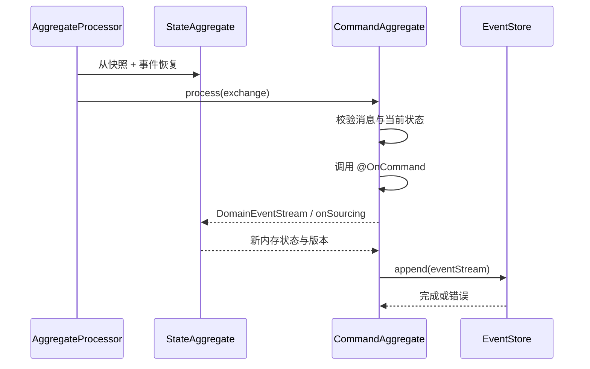
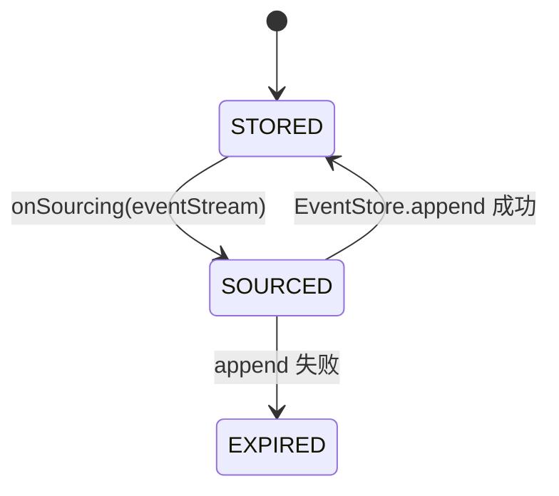

# 聚合生命周期

Wow 将聚合拆成两个协作对象：`CommandAggregate` 读取当前状态并作出业务决策，`StateAggregate` 只通过事件演进状态。两者共同处理一次命令，但 EventStore 中的事件历史才是持久事实。

领域类型的建模方式见[聚合建模](../modeling.md)；本文只解释运行时生命周期。

## 创建或恢复状态

`RetryableAggregateProcessor` 在每次处理尝试中取得一个新的聚合对象：

- 创建命令由 `StateAggregateFactory` 创建未初始化状态；
- 其他命令由 `StateAggregateRepository` 加载状态；
- 事件溯源仓库先读快照，再从 `snapshot.version + 1` 加载增量事件；没有快照时从初始版本开始重放。

快照只是恢复起点。缺少快照不改变 EventStore 作为权威历史的角色，详见[快照](../snapshot.md)。

## 一次命令处理


```mermaid
sequenceDiagram
    participant Processor as AggregateProcessor
    participant State as StateAggregate
    participant Command as CommandAggregate
    participant Store as EventStore

    Processor->>State: 从快照 + 事件恢复
    Processor->>Command: process(exchange)
    Command->>Command: 校验消息与当前状态
    Command->>Command: 调用 @OnCommand
    Command-->>State: DomainEventStream / onSourcing
    State-->>Command: 新内存状态与版本
    Command->>Store: append(eventStream)
    Store-->>Command: 完成或错误
```

`SimpleCommandAggregate` 在调用命令函数前依次检查：

1. 可选 `aggregateVersion` 是否等于当前版本；
2. 非创建且不允许创建的命令是否指向已初始化聚合；
3. 非空 `ownerId` 与 `spaceId` 是否匹配当前状态；
4. 普通命令是否错误地访问已删除聚合，或恢复命令是否指向未删除聚合；
5. 元数据中是否存在该命令类型的处理函数。

这些是当前核心实现的公共处理边界，不替代业务命令自身的不变量校验。

## CommandState 状态机


```mermaid
stateDiagram-v2
    [*] --> STORED
    STORED --> SOURCED: onSourcing(eventStream)
    SOURCED --> STORED: EventStore.append 成功
    SOURCED --> EXPIRED: append 失败
```

| 状态 | 含义 |
| --- | --- |
| `STORED` | 当前聚合可以接受一次新的事件溯源 |
| `SOURCED` | 新事件已经应用到内存状态，等待追加到 EventStore |
| `EXPIRED` | 本聚合对象不能继续处理；失败重试必须重新加载/创建对象 |

事件先应用到内存状态，再执行持久追加。若追加失败，本对象会进入 `EXPIRED`，不能把这份尚未持久化的内存状态继续复用。

当前 `RetryableAggregateProcessor` 仅对标记为 `RECOVERABLE` 的错误使用固定实现策略重建聚合后重试：最多 3 次、最小退避 500 ms。该细节不是 EventStore 或应用副作用的通用重试保证；外部处理器仍需单独设计幂等与补偿。

## StateAggregate 的溯源规则

`SimpleStateAggregate.onSourcing` 检查完整 `AggregateId` 与期望下一版本，然后更新聚合元数据，并按事件流中的顺序调用匹配的 `@OnSourcing` 函数。

| 情况 | 行为 |
| --- | --- |
| AggregateId 不一致 | 拒绝事件流 |
| 事件流版本不是 `expectedNextVersion` | 抛出 `SourcingVersionConflictException` |
| 某个事件没有匹配的 sourcing 函数 | 忽略该事件载荷，但事件流版本仍前进 |
| 事件流标记 `ignoreSourcing` | 不改变状态与版本 |
| 内置 owner/space/delete/recover/tag 事件 | 更新对应框架元数据 |

“缺少 sourcing 函数仍前进版本”用于让不影响当前状态的事件保持流连续；它也可能隐藏遗漏的状态行为，因此事件演进和历史回放测试必须覆盖最终业务不变量。

## 删除与恢复

删除是状态元数据，不是删除历史：

- `AggregateDeleted` 把 `deleted` 设为 `true`；
- 已删除聚合拒绝普通命令；
- `RecoverAggregate` 只允许作用于已删除聚合；
- `AggregateRecovered` 清除删除标记。

恢复命令不会撤销删除前的事件。读取和权限规则仍要明确是否暴露已删除状态。

## 并发与顺序

默认分发器把同一聚合 ID 映射到同一处理 group，并在该 group 中串行执行。EventStore 追加再以版本约束作为持久并发边界。不要把本实例调度推断为跨实例全局锁，也不要把一次版本冲突重试推断为外部副作用幂等。

若调用方需要 compare-and-set 语义，应发送 `aggregateVersion`；若命令已包含不可重复的外部操作，应先重新划分该操作的所有权，而不是依赖自动重试。

## 失败发生在哪里

| 失败点 | 已持久化新事件？ | 处理方向 |
| --- | --- | --- |
| 加载/重放失败 | 否 | 修复历史、类型或存储读取问题 |
| 命令校验/函数失败 | 否 | 返回领域/输入错误；可选错误函数仍需传播或明确接管 |
| EventStore append 失败 | 未由当前尝试确认 | 仅可恢复错误进入核心重试；每次重试重新加载 |
| 领域/状态事件发送失败 | 事件可能已追加 | 按命令 filter、Bus 与恢复策略处理，不能回滚已追加历史 |
| 投影/Saga/事件处理失败 | 是 | 使用幂等、重试、补偿或重放恢复 |

等待阶段对这些边界的可见性见[命令网关](../command-gateway.md#等待计划)。

## 验证与源码

```bash
./gradlew :wow-core:test --tests "me.ahoo.wow.modeling.command.SimpleCommandAggregateProcessingTest"
./gradlew :wow-core:test --tests "me.ahoo.wow.modeling.command.RetryableAggregateProcessorTest"
./gradlew :wow-core:test --tests "me.ahoo.wow.modeling.state.SimpleStateAggregateSourcingTest"
```

- [`SimpleCommandAggregate`](https://github.com/Ahoo-Wang/Wow/blob/main/wow-core/src/main/kotlin/me/ahoo/wow/modeling/command/SimpleCommandAggregate.kt)
- [`RetryableAggregateProcessor`](https://github.com/Ahoo-Wang/Wow/blob/main/wow-core/src/main/kotlin/me/ahoo/wow/modeling/command/RetryableAggregateProcessor.kt)
- [`SimpleStateAggregate`](https://github.com/Ahoo-Wang/Wow/blob/main/wow-core/src/main/kotlin/me/ahoo/wow/modeling/state/SimpleStateAggregate.kt)
- [`EventSourcingStateAggregateRepository`](https://github.com/Ahoo-Wang/Wow/blob/main/wow-core/src/main/kotlin/me/ahoo/wow/eventsourcing/EventSourcingStateAggregateRepository.kt)
