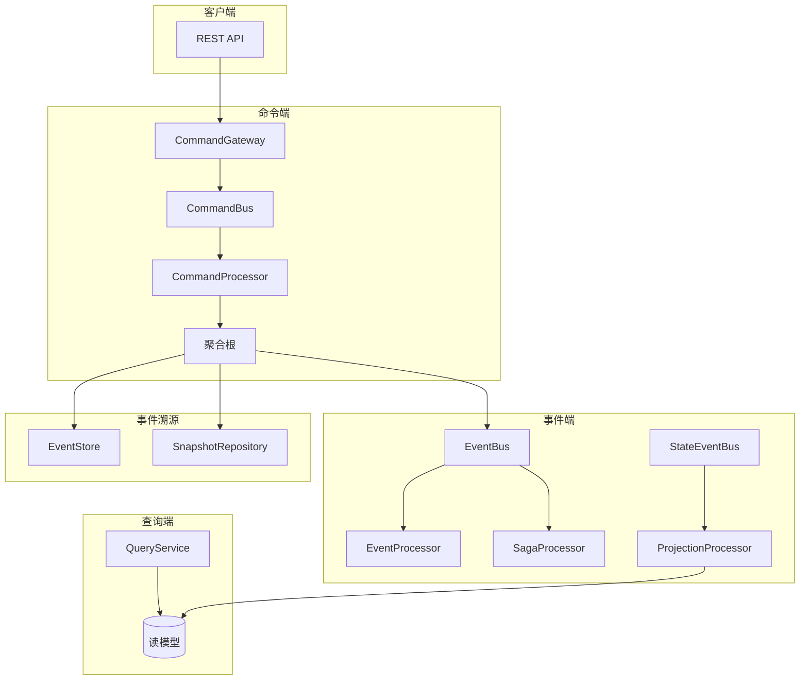
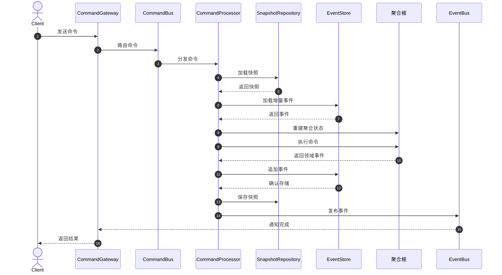
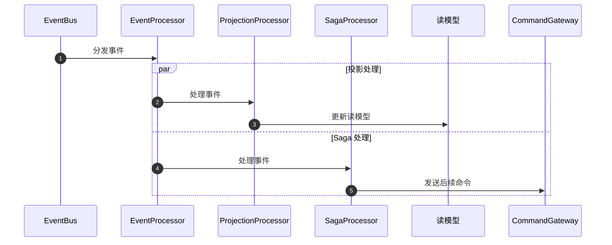
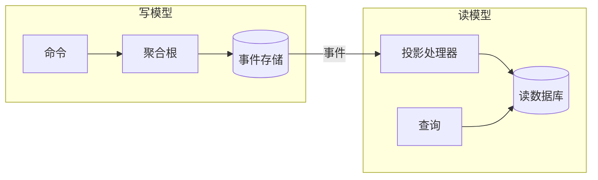
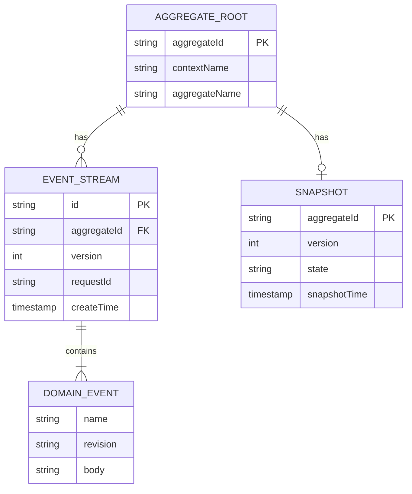
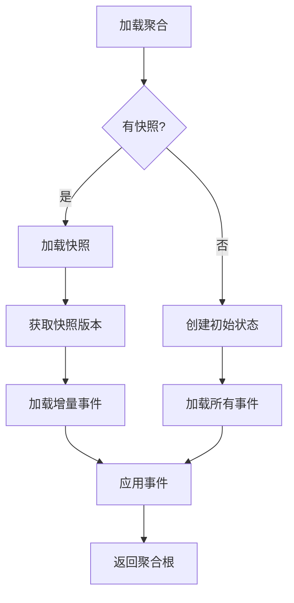

# 架构

本文档详细介绍 Wow 框架的整体架构设计、核心组件关系以及处理流程。

## 整体架构

## 核心组件

### 组件关系图

### 组件说明

| 组件 | 职责 | 接口 |
|------|------|------|
| CommandGateway | 命令发送入口，支持等待策略 | `CommandGateway` |
| CommandBus | 命令传输通道 | `CommandBus` |
| CommandProcessor | 命令处理，加载聚合根并执行 | `CommandProcessor` |
| EventStore | 事件持久化存储 | `EventStore` |
| SnapshotRepository | 快照存储，优化聚合加载 | `SnapshotRepository` |
| EventBus | 领域事件传输通道 | `EventBus` |
| StateEventBus | 状态事件传输通道 | `StateEventBus` |
| EventProcessor | 事件处理器基类 | `EventProcessor` |
| ProjectionProcessor | 投影处理，更新读模型 | `ProjectionProcessor` |
| SagaProcessor | Saga 编排，处理分布式事务 | `SagaProcessor` |
| QueryService | 查询服务，读取读模型 | `QueryService` |

## 命令处理流程

### 流程说明

1. **命令发送**：客户端通过 CommandGateway 发送命令
2. **命令路由**：CommandBus 根据聚合类型路由到对应处理器
3. **聚合加载**：从快照和事件存储重建聚合状态
4. **命令执行**：聚合根处理命令，产生领域事件
5. **事件持久化**：事件追加到 EventStore
6. **快照保存**：根据策略保存快照
7. **事件发布**：领域事件发布到 EventBus

## 事件处理流程

## CQRS 架构实现

Wow 框架实现了完整的 CQRS（命令查询责任分离）架构：

### 写模型职责

- 处理业务命令
- 执行业务规则验证
- 产生领域事件
- 保持事务一致性

### 读模型职责

- 响应查询请求
- 提供优化的数据视图
- 支持复杂查询条件
- 最终一致性

## 事件溯源实现

### 事件存储结构

### 状态重建流程

## 扩展点

Wow 框架提供了丰富的扩展点：

| 扩展点 | 说明 | 使用场景 |
|--------|------|---------|
| `CommandBus` | 命令总线实现 | 自定义消息传输 |
| `EventBus` | 事件总线实现 | 自定义事件分发 |
| `EventStore` | 事件存储实现 | 自定义存储后端 |
| `SnapshotRepository` | 快照存储实现 | 自定义快照策略 |
| `IdGenerator` | ID 生成器 | 自定义 ID 格式 |
| `WaitStrategy` | 等待策略 | 自定义同步机制 |

## 设计原则

### 单一职责

每个组件只负责一个职责，通过组合实现复杂功能。

### 依赖倒置

核心模块依赖抽象接口，具体实现通过扩展模块提供。

### 开闭原则

通过扩展点机制，在不修改核心代码的情况下扩展功能。

### 事件驱动

系统通过事件进行解耦，支持异步处理和最终一致性。