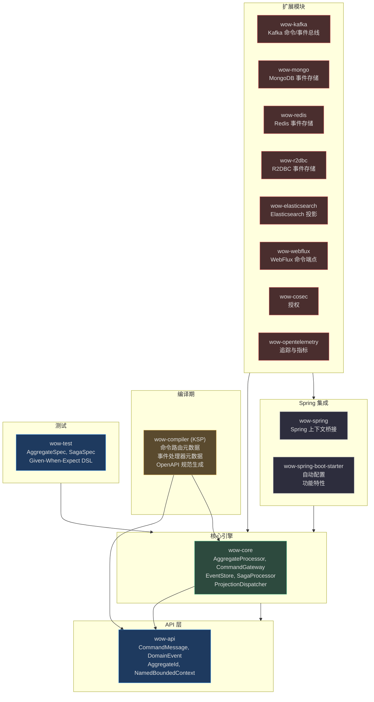
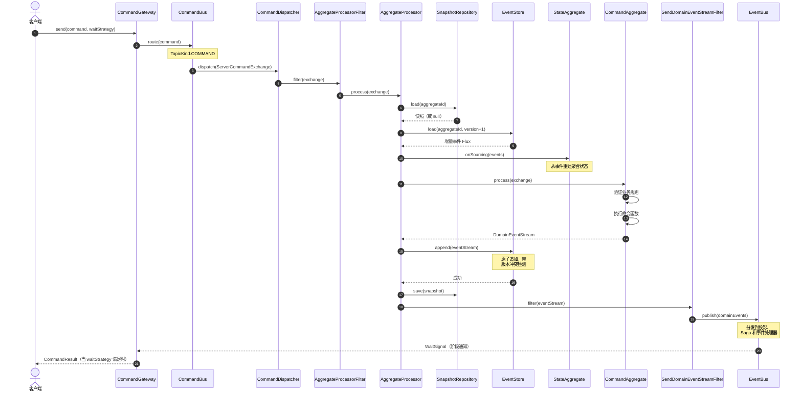
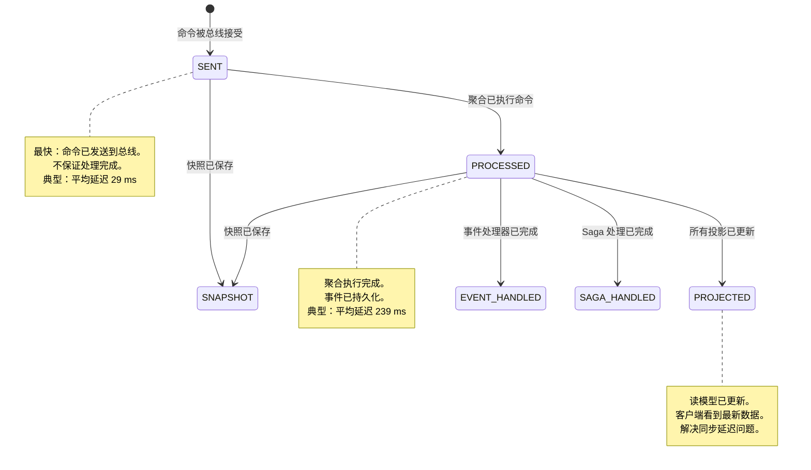
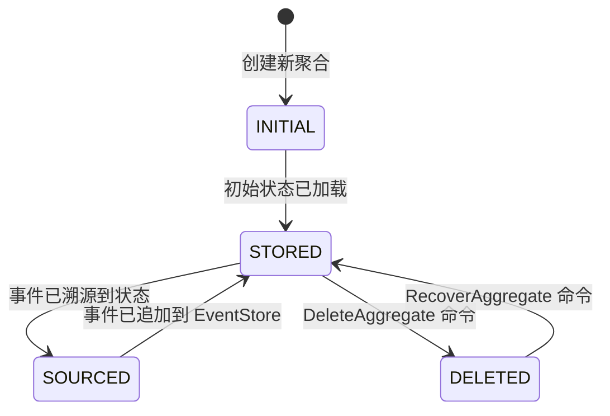
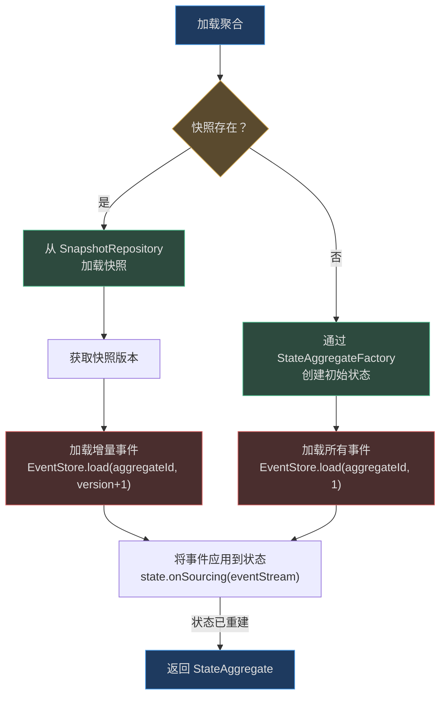
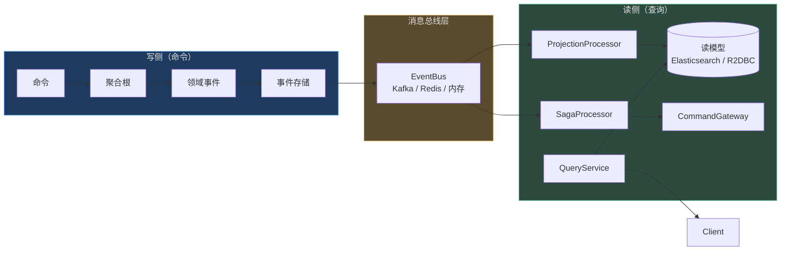

# 架构概览

Wow 框架是一个模块化、分层架构，构建在四个基础范式之上：**领域驱动设计**、**CQRS**、**事件溯源**和**响应式编程**。从 API 契约到存储后端，每个组件都设计为非阻塞 I/O、水平可扩展和清晰的关注点分离。

**为什么这个架构存在**：传统的基于 CRUD 的系统将读写模型耦合在一起，将业务逻辑与持久化纠缠不清，并且需要复杂的分片逻辑来扩展。Wow 颠覆了这一点：开发者只需编写领域模型，框架自动提供命令路由、事件持久化、投影管道、OpenAPI 端点以及分布式 Saga 编排。其结果是，业务逻辑存在于纯净、可测试的聚合中，而基础设施关注点则由可插拔的扩展模块处理。

## 概览一览

| 组件 | 职责 | 关键构件 | 源码 |
|---|---|---|---|
| **wow-api** | 纯 API 契约：`CommandMessage`、`DomainEvent`、`AggregateId`、`NamedBoundedContext` | `wow-api` 模块 | [Wow.kt:26-45](https://github.com/Ahoo-Wang/Wow/blob/main/wow-api/src/main/kotlin/me/ahoo/wow/api/Wow.kt#L26-L45) |
| **wow-core** | 框架引擎：聚合、命令总线、事件存储、投影、Saga、序列化 | `wow-core` 模块 | [CommandGateway.kt:75-178](https://github.com/Ahoo-Wang/Wow/blob/main/wow-core/src/main/kotlin/me/ahoo/wow/command/CommandGateway.kt#L75-L178) |
| **wow-spring** | Spring Framework 集成层 | `wow-spring` 模块 | [settings.gradle.kts:32](https://github.com/Ahoo-Wang/Wow/blob/main/settings.gradle.kts#L32) |
| **wow-spring-boot-starter** | 带功能特性的自动配置（Mongo、Kafka、Redis、R2DBC 等） | `wow-spring-boot-starter` 模块 | [AggregateAutoConfiguration.kt:50-156](https://github.com/Ahoo-Wang/Wow/blob/main/wow-spring-boot-starter/src/main/kotlin/me/ahoo/wow/spring/boot/starter/modeling/AggregateAutoConfiguration.kt#L50-L156) |
| **wow-compiler** | KSP 处理器：在编译期生成命令路由、事件元数据和 OpenAPI 规范 | `wow-compiler` 模块 | [settings.gradle.kts:26](https://github.com/Ahoo-Wang/Wow/blob/main/settings.gradle.kts#L26) |
| **wow-test** | 单元测试 DSL：`AggregateSpec` / `SagaSpec`，使用 Given-When-Expect 模式 | `test/wow-test` | [settings.gradle.kts:44-45](https://github.com/Ahoo-Wang/Wow/blob/main/settings.gradle.kts#L44-L45) |
| **wow-kafka** | 通过 Apache Kafka 实现的命令/事件总线 | `wow-kafka` 模块 | [settings.gradle.kts:27](https://github.com/Ahoo-Wang/Wow/blob/main/settings.gradle.kts#L27) |
| **wow-mongo / wow-redis / wow-r2dbc** | 事件存储和快照存储后端 | `wow-mongo`、`wow-redis`、`wow-r2dbc` 模块 | [settings.gradle.kts:28-30](https://github.com/Ahoo-Wang/Wow/blob/main/settings.gradle.kts#L28-L30) |
| **wow-elasticsearch** | 通过 Elasticsearch 实现的投影（读模型）存储 | `wow-elasticsearch` 模块 | [settings.gradle.kts:31](https://github.com/Ahoo-Wang/Wow/blob/main/settings.gradle.kts#L31) |
| **wow-opentelemetry** | 端到端追踪和可观测性 | `wow-opentelemetry` 模块 | [settings.gradle.kts:35](https://github.com/Ahoo-Wang/Wow/blob/main/settings.gradle.kts#L35) |
| **wow-cosec** | 授权和访问控制 | `wow-cosec` 模块 | [settings.gradle.kts:40](https://github.com/Ahoo-Wang/Wow/blob/main/settings.gradle.kts#L40) |
| **wow-webflux** | Spring WebFlux 集成：自动注册命令路由处理函数 | `wow-webflux` 模块 | [settings.gradle.kts:33](https://github.com/Ahoo-Wang/Wow/blob/main/settings.gradle.kts#L33) |

## 模块依赖图

该框架遵循严格的分层架构，每个模块都有清晰的依赖方向。`wow-api` 模块位于根部，定义纯契约且零外部依赖，而叶子层的基础设施模块提供具体实现。

```mermaid
flowchart TB
    subgraph API["API 层<br>"]
        A1["wow-api<br>CommandMessage, DomainEvent<br>AggregateId, NamedBoundedContext"]
    end

    subgraph CORE["核心引擎"]
        C1["wow-core<br>AggregateProcessor, CommandGateway<br>EventStore, SagaProcessor<br>ProjectionDispatcher"]
    end

    subgraph COMPILE["编译期"]
        K1["wow-compiler (KSP)<br>命令路由元数据<br>事件处理器元数据<br>OpenAPI 规范生成"]
    end

    subgraph EXT["扩展模块"]
        E1["wow-kafka<br>Kafka 命令/事件总线"]
        E2["wow-mongo<br>MongoDB 事件存储"]
        E3["wow-redis<br>Redis 事件存储"]
        E4["wow-r2dbc<br>R2DBC 事件存储"]
        E5["wow-elasticsearch<br>Elasticsearch 投影"]
        E6["wow-webflux<br>WebFlux 命令端点"]
        E7["wow-cosec<br>授权"]
        E8["wow-opentelemetry<br>追踪与指标"]
    end

    subgraph SPRING["Spring 集成"]
        S1["wow-spring<br>Spring 上下文桥接"]
        S2["wow-spring-boot-starter<br>自动配置<br>功能特性"]
    end

    subgraph TEST["测试"]
        T1["wow-test<br>AggregateSpec, SagaSpec<br>Given-When-Expect DSL"]
    end

    C1 --> A1
    K1 --> A1
    K1 --> C1
    CORE --> API
    EXT --> CORE
    SPRING --> CORE
    EXT --> SPRING
    TEST --> CORE

    style A1 fill:#1e3a5f,stroke:#4a9eed,color:#e0e0e0
    style C1 fill:#2d4a3e,stroke:#4aba8a,color:#e0e0e0
    style K1 fill:#5a4a2e,stroke:#d4a84b,color:#e0e0e0
    style E1 fill:#4a2e2e,stroke:#d45b5b,color:#e0e0e0
    style E2 fill:#4a2e2e,stroke:#d45b5b,color:#e0e0e0
    style E3 fill:#4a2e2e,stroke:#d45b5b,color:#e0e0e0
    style E4 fill:#4a2e2e,stroke:#d45b5b,color:#e0e0e0
    style E5 fill:#4a2e2e,stroke:#d45b5b,color:#e0e0e0
    style E6 fill:#4a2e2e,stroke:#d45b5b,color:#e0e0e0
    style E7 fill:#4a2e2e,stroke:#d45b5b,color:#e0e0e0
    style E8 fill:#4a2e2e,stroke:#d45b5b,color:#e0e0e0
    style S1 fill:#2d2d3d,stroke:#7a7a8a,color:#e0e0e0
    style S2 fill:#2d2d3d,stroke:#7a7a8a,color:#e0e0e0
    style T1 fill:#1e3a5f,stroke:#4a9eed,color:#e0e0e0
```

<!-- Sources: settings.gradle.kts:19-63, wow-api/src/main/kotlin/me/ahoo/wow/api/Wow.kt:26-45 -->

## 模块层级

模块层级定义在 [settings.gradle.kts:19-63](https://github.com/Ahoo-Wang/Wow/blob/main/settings.gradle.kts#L19-L63) 中。每个模块仅依赖其上方层级的模块，确保无循环依赖。

### 层级分解

| 层级 | 模块 | 描述 | 源码 |
|---|---|---|---|
| **API 契约** | `wow-api`、`wow-openapi` | 纯 Kotlin 接口和数据类。零框架依赖。定义 `CommandMessage`、`DomainEvent`、`AggregateId`、`WaitStrategy` 等。 | [wow-api](https://github.com/Ahoo-Wang/Wow/blob/main/wow-api/src/main/kotlin/me/ahoo/wow/api/Wow.kt) |
| **核心引擎** | `wow-core` | 聚合处理、命令总线、事件存储抽象、Saga 处理、投影分发、序列化。全部响应式（Project Reactor）。 | [wow-core](https://github.com/Ahoo-Wang/Wow/blob/main/wow-core/src/main/kotlin/me/ahoo/wow/command/CommandGateway.kt) |
| **编译期** | `wow-compiler` | KSP 处理器。在编译期从注解生成命令路由表、事件处理器元数据和 OpenAPI 规范。 | [settings.gradle.kts:26](https://github.com/Ahoo-Wang/Wow/blob/main/settings.gradle.kts#L26) |
| **Spring 集成** | `wow-spring`、`wow-spring-boot-starter` | 将核心引擎桥接到 Spring 的 `ApplicationContext`。Starter 通过 Gradle Feature Variants 为可选能力提供自动配置。 | [WowAutoConfiguration.kt](https://github.com/Ahoo-Wang/Wow/blob/main/wow-spring-boot-starter/src/main/kotlin/me/ahoo/wow/spring/boot/starter/WowAutoConfiguration.kt) |
| **基础设施** | `wow-kafka`、`wow-mongo`、`wow-redis`、`wow-r2dbc`、`wow-elasticsearch`、`wow-webflux` | 核心抽象的具体实现。通过类路径检测即可插拔。 | [settings.gradle.kts:27-34](https://github.com/Ahoo-Wang/Wow/blob/main/settings.gradle.kts#L27-L34) |
| **可观测性** | `wow-opentelemetry` | 通过 OpenTelemetry 实现端到端追踪、指标和日志集成。 | [settings.gradle.kts:35](https://github.com/Ahoo-Wang/Wow/blob/main/settings.gradle.kts#L35) |
| **安全** | `wow-cosec` | 基于策略的访问控制的命令/查询授权。 | [settings.gradle.kts:40](https://github.com/Ahoo-Wang/Wow/blob/main/settings.gradle.kts#L40) |
| **测试** | `wow-test`、`wow-tck`、`wow-mock` | 聚合和 Saga 测试 DSL；集成测试技术兼容套件；内存 mock 实现。 | [settings.gradle.kts:44-49](https://github.com/Ahoo-Wang/Wow/blob/main/settings.gradle.kts#L44-L49) |
| **补偿** | `wow-compensation-api`、`wow-compensation-core`、`wow-compensation-domain`、`wow-compensation-server` | 事件补偿子系统，带仪表板用于监控和重试失败事件。 | [settings.gradle.kts:56-63](https://github.com/Ahoo-Wang/Wow/blob/main/settings.gradle.kts#L56-L63) |

### 模块分离所强制执行的设计原则

1. **依赖反转**：核心模块依赖抽象（`CommandBus`、`EventStore`、`SnapshotRepository`），而非具体实现。基础设施模块提供实现，并在运行时通过 Spring 的 `@ConditionalOnClass` 自动配置被发现。
2. **开闭原则**：新的存储后端或消息传输可以作为新模块添加，而无需修改核心代码。
3. **单一职责**：每个模块有且仅有一个变更理由。`wow-mongo` 处理 MongoDB 事件存储；`wow-kafka` 处理 Kafka 消息传输；它们从不重叠。

## 命令处理流程

命令处理流程是 Wow 框架的中枢神经系统。它通过响应式管道协调命令路由、聚合加载、业务规则验证、事件持久化、快照创建和事件发布。

```mermaid
sequenceDiagram
    autonumber
    actor Client as 客户端
    participant CG as CommandGateway
    participant CB as CommandBus
    participant CD as CommandDispatcher
    participant AF as AggregateProcessorFilter
    participant AP as AggregateProcessor
    participant SR as SnapshotRepository
    participant ES as EventStore
    participant SA as StateAggregate
    participant CA as CommandAggregate
    participant SF as SendDomainEventStreamFilter
    participant EB as EventBus

    Client->>CG: send(command, waitStrategy)
    CG->>CB: route(command)
    Note over CB: TopicKind.COMMAND
    CB->>CD: dispatch(ServerCommandExchange)
    CD->>AF: filter(exchange)
    AF->>AP: process(exchange)

    AP->>SR: load(aggregateId)
    SR-->>AP: 快照（或 null）
    AP->>ES: load(aggregateId, version+1)
    ES-->>AP: 增量事件 Flux
    AP->>SA: onSourcing(events)
    Note over SA: 从事件重建聚合状态
    AP->>CA: process(exchange)
    CA->>CA: 验证业务规则
    CA->>CA: 执行命令函数
    CA-->>AP: DomainEventStream

    AP->>ES: append(eventStream)
    Note over ES: 原子追加，带<br>版本冲突检测
    ES-->>AP: 成功
    AP->>SR: save(snapshot)
    AP->>SF: filter(eventStream)
    SF->>EB: publish(domainEvents)
    Note over EB: 分发到投影、<br>Saga 和事件处理器

    EB-->>CG: WaitSignal（阶段通知）
    CG-->>Client: CommandResult（当 waitStrategy 满足时）
```

<!-- Sources: wow-core/src/main/kotlin/me/ahoo/wow/command/CommandGateway.kt:75-178, wow-core/src/main/kotlin/me/ahoo/wow/command/CommandBus.kt:36-41, wow-core/src/main/kotlin/me/ahoo/wow/modeling/command/AggregateProcessor.kt:32-49, wow-core/src/main/kotlin/me/ahoo/wow/modeling/command/SimpleCommandAggregate.kt:43-80, wow-spring-boot-starter/src/main/kotlin/me/ahoo/wow/spring/boot/starter/modeling/AggregateAutoConfiguration.kt:50-156 -->

### 逐步流程描述

| 步骤 | 组件 | 动作 | 源码 |
|---|---|---|---|
| 1 | **客户端** | 发送命令，附带 `WaitStrategy` 指定等待时长及在哪个阶段等待 | [CommandGateway.kt:89-91](https://github.com/Ahoo-Wang/Wow/blob/main/wow-core/src/main/kotlin/me/ahoo/wow/command/CommandGateway.kt#L89-L91) |
| 2 | **CommandGateway** | 实现 `CommandBus` 的入口点。根据聚合类型将命令路由到适当处理器 | [CommandGateway.kt:75](https://github.com/Ahoo-Wang/Wow/blob/main/wow-core/src/main/kotlin/me/ahoo/wow/command/CommandGateway.kt#L75) |
| 3 | **CommandDispatcher** | 将命令总线桥接到聚合处理器过滤器链；在 `AggregateAutoConfiguration` 中配置 | [AggregateAutoConfiguration.kt:138-149](https://github.com/Ahoo-Wang/Wow/blob/main/wow-spring-boot-starter/src/main/kotlin/me/ahoo/wow/spring/boot/starter/modeling/AggregateAutoConfiguration.kt#L138-L149) |
| 4 | **AggregateProcessorFilter** | 为目标聚合构造 `AggregateProcessor`，处理分片和重试逻辑 | [AggregateAutoConfiguration.kt:91-96](https://github.com/Ahoo-Wang/Wow/blob/main/wow-spring-boot-starter/src/main/kotlin/me/ahoo/wow/spring/boot/starter/modeling/AggregateAutoConfiguration.kt#L91-L96) |
| 5 | **快照 + 事件加载** | 加载最新快照，然后从 `EventStore` 重放增量事件以重建当前状态 | [EventSourcingStateAggregateRepository.kt:41-60](https://github.com/Ahoo-Wang/Wow/blob/main/wow-core/src/main/kotlin/me/ahoo/wow/eventsourcing/EventSourcingStateAggregateRepository.kt#L41-L60) |
| 6 | **业务规则执行** | 聚合根（`CommandAggregate`）验证不变量并执行命令处理函数 | [SimpleCommandAggregate.kt:68-79](https://github.com/Ahoo-Wang/Wow/blob/main/wow-core/src/main/kotlin/me/ahoo/wow/modeling/command/SimpleCommandAggregate.kt#L68-L79) |
| 7 | **事件持久化** | `EventStore.append()` 原子写入事件流，通过版本检查强制执行乐观并发控制 | [EventStore.kt:38-43](https://github.com/Ahoo-Wang/Wow/blob/main/wow-core/src/main/kotlin/me/ahoo/wow/eventsourcing/EventStore.kt#L38-L43) |
| 8 | **快照 + 发布** | 持久化后，保存快照并将领域事件发布到 `EventBus` 供下游处理 | [AggregateAutoConfiguration.kt:100-106](https://github.com/Ahoo-Wang/Wow/blob/main/wow-spring-boot-starter/src/main/kotlin/me/ahoo/wow/spring/boot/starter/modeling/AggregateAutoConfiguration.kt#L100-L106) |

### 等待策略与命令阶段

`CommandGateway` 支持等待命令到达特定处理阶段后再返回客户端。这对于解决 CQRS 架构中固有的读写同步延迟问题至关重要。

```mermaid
stateDiagram-v2
    [*] --> SENT : 命令被总线接受
    SENT --> PROCESSED : 聚合已执行命令
    SENT --> SNAPSHOT : 快照已保存
    PROCESSED --> SNAPSHOT : 快照已保存
    PROCESSED --> PROJECTED : 所有投影已更新
    PROCESSED --> EVENT_HANDLED : 事件处理器已完成
    PROCESSED --> SAGA_HANDLED : Saga 处理已完成

    note right of SENT
        最快：命令已发送到总线。
        不保证处理完成。
        典型：平均延迟 29 ms
    end note

    note right of PROCESSED
        聚合执行完成。
        事件已持久化。
        典型：平均延迟 239 ms
    end note

    note right of PROJECTED
        读模型已更新。
        客户端看到最新数据。
        解决同步延迟问题。
    end note

```

<!-- Sources: wow-core/src/main/kotlin/me/ahoo/wow/command/wait/CommandStage.kt:25-123, wow-core/src/main/kotlin/me/ahoo/wow/command/wait/WaitStrategy.kt -->

`CommandStage` 中的每个阶段定义为带有显式前置依赖的枚举：

| 阶段 | 前置依赖 | 等待函数 | 典型用例 | 源码 |
|---|---|---|---|---|
| `SENT` | （无） | 否 | 发布即忘命令；最大吞吐量 | [CommandStage.kt:33](https://github.com/Ahoo-Wang/Wow/blob/main/wow-core/src/main/kotlin/me/ahoo/wow/command/wait/CommandStage.kt#L33) |
| `PROCESSED` | `SENT` | 否 | 确保聚合已处理命令 | [CommandStage.kt:43](https://github.com/Ahoo-Wang/Wow/blob/main/wow-core/src/main/kotlin/me/ahoo/wow/command/wait/CommandStage.kt#L43) |
| `SNAPSHOT` | `SENT`、`PROCESSED` | 否 | 确保处理完成后已创建快照 | [CommandStage.kt:52](https://github.com/Ahoo-Wang/Wow/blob/main/wow-core/src/main/kotlin/me/ahoo/wow/command/wait/CommandStage.kt#L52) |
| `PROJECTED` | `SENT`、`PROCESSED` | 是 | 读模型已更新；解决同步延迟问题 | [CommandStage.kt:63](https://github.com/Ahoo-Wang/Wow/blob/main/wow-core/src/main/kotlin/me/ahoo/wow/command/wait/CommandStage.kt#L63) |
| `EVENT_HANDLED` | `SENT`、`PROCESSED` | 是 | 外部事件处理器已处理事件 | [CommandStage.kt:73](https://github.com/Ahoo-Wang/Wow/blob/main/wow-core/src/main/kotlin/me/ahoo/wow/command/wait/CommandStage.kt#L73) |
| `SAGA_HANDLED` | `SENT`、`PROCESSED` | 是 | Saga 编排器已完成处理 | [CommandStage.kt:84](https://github.com/Ahoo-Wang/Wow/blob/main/wow-core/src/main/kotlin/me/ahoo/wow/command/wait/CommandStage.kt#L84) |

## 聚合生命周期

聚合根是 Wow 框架中领域逻辑的核心。它遵循一个明确定义的状态机，决定命令如何处理、事件如何溯源以及状态如何转换。

### 聚合状态机

```mermaid
stateDiagram-v2
    [*] --> INITIAL : 创建新聚合
    INITIAL --> STORED : 初始状态已加载
    STORED --> SOURCED : 事件已溯源到状态
    SOURCED --> STORED : 事件已追加到 EventStore
    STORED --> DELETED : DeleteAggregate 命令
    DELETED --> STORED : RecoverAggregate 命令
```

<!-- Sources: wow-core/src/main/kotlin/me/ahoo/wow/modeling/command/CommandAggregate.kt:41-118, wow-core/src/main/kotlin/me/ahoo/wow/modeling/command/SimpleCommandAggregate.kt:43-80 -->

### CommandState 枚举

`CommandState` 枚举（[CommandAggregate.kt:65-118](https://github.com/Ahoo-Wang/Wow/blob/main/wow-core/src/main/kotlin/me/ahoo/wow/modeling/command/CommandAggregate.kt#L65-L118)）管理聚合内命令处理的生命周期：

| 状态 | 有效操作 | 描述 | 源码 |
|---|---|---|---|
| `STORED` | `onSourcing(eventStream)` | 聚合已准备好溯源事件。这是每个命令处理周期的入口点。 | [CommandAggregate.kt:66-74](https://github.com/Ahoo-Wang/Wow/blob/main/wow-core/src/main/kotlin/me/ahoo/wow/modeling/command/CommandAggregate.kt#L66-L74) |
| `SOURCED` | `onStore(eventStore, eventStream)` | 事件已应用到状态聚合。事件流已准备持久化。 | [CommandAggregate.kt:75-83](https://github.com/Ahoo-Wang/Wow/blob/main/wow-core/src/main/kotlin/me/ahoo/wow/modeling/command/CommandAggregate.kt#L75-L83) |
| `EXPIRED` | （无） | 终止状态。不支持任何进一步操作。 | [CommandAggregate.kt:84-85](https://github.com/Ahoo-Wang/Wow/blob/main/wow-core/src/main/kotlin/me/ahoo/wow/modeling/command/CommandAggregate.kt#L84-L85) |

### 关键生命周期规则

1. **命令只能在 `STORED` 状态下处理**：聚合在溯源事件后转换到 `SOURCED`，然后在持久化后回到 `STORED`。这确保每个聚合实例的串行命令处理，防止竞态条件，如 [AggregateProcessor.kt:41-43](https://github.com/Ahoo-Wang/Wow/blob/main/wow-core/src/main/kotlin/me/ahoo/wow/modeling/command/AggregateProcessor.kt#L41-L43) 中所述。
2. **删除和恢复是内置命令**：`DefaultDeleteAggregate` 将聚合转换到已删除状态，而 `DefaultRecoverAggregate` 恢复它。在已删除聚合上尝试操作会抛出 `IllegalAccessDeletedAggregateException`。
3. **乐观并发控制**：`EventStore.append()` 方法在检测到版本冲突时拒绝写入，确保每次聚合只能有一个并发写入成功。

## 事件溯源架构

Wow 实现了完整的事件溯源模式，聚合状态从有序的领域事件序列中推导，而非直接作为关系数据库中的行持久化。

### 状态重建策略

```mermaid
flowchart TD
    A["加载聚合"] --> B{"快照存在？"}
    B -->|"是"| C["从 SnapshotRepository<br>加载快照"]
    B -->|"否"| D["通过 StateAggregateFactory<br>创建初始状态"]
    C --> E["获取快照版本"]
    E --> F["加载增量事件<br>EventStore.load(aggregateId, version+1)"]
    D --> G["加载所有事件<br>EventStore.load(aggregateId, 1)"]
    F --> H["将事件应用到状态<br>state.onSourcing(eventStream)"]
    G --> H
    H -- "状态已重建" --> I["返回 StateAggregate"]

    style A fill:#1e3a5f,stroke:#4a9eed,color:#e0e0e0
    style B fill:#5a4a2e,stroke:#d4a84b,color:#e0e0e0
    style C fill:#2d4a3e,stroke:#4aba8a,color:#e0e0e0
    style D fill:#2d4a3e,stroke:#4aba8a,color:#e0e0e0
    style F fill:#4a2e2e,stroke:#d45b5b,color:#e0e0e0
    style G fill:#4a2e2e,stroke:#d45b5b,color:#e0e0e0
    style I fill:#1e3a5f,stroke:#4a9eed,color:#e0e0e0
```

<!-- Sources: wow-core/src/main/kotlin/me/ahoo/wow/eventsourcing/EventSourcingStateAggregateRepository.kt:31-39, wow-core/src/main/kotlin/me/ahoo/wow/eventsourcing/EventStore.kt:27-98 -->

`EventSourcingStateAggregateRepository` 编排此流程。其加载过程如下：

1. 对于最新版本（tailVersion = `Int.MAX_VALUE`），首先尝试从 `SnapshotRepository` 加载。
2. 如果不存在快照，则通过 `StateAggregateFactory` 创建新的聚合实例。
3. 从聚合的预期下一个版本开始，顺序应用来自 `EventStore` 的事件。

此方法支持时间点状态重建：通过指定 `tailVersion` 或 `tailEventTime`，仓库可以重建任何历史时刻的聚合状态。

### 事件存储接口

`EventStore` 接口（[EventStore.kt:27-98](https://github.com/Ahoo-Wang/Wow/blob/main/wow-core/src/main/kotlin/me/ahoo/wow/eventsourcing/EventStore.kt#L27-L98)）定义了事件持久化的契约：

| 方法 | 描述 | 并发保证 |
|---|---|---|
| `append(eventStream)` | 原子追加领域事件流 | 版本冲突时抛出 `EventVersionConflictException`；重复 ID 时抛出 `DuplicateAggregateIdException`；重复请求 ID 时抛出 `DuplicateRequestIdException` |
| `load(aggregateId, headVersion, tailVersion)` | 加载版本范围内的事件流（闭区间） | 返回 `Flux` 用于响应式流式处理 |
| `load(aggregateId, headEventTime, tailEventTime)` | 加载时间范围内的事件流（闭区间） | 返回 `Flux` 用于响应式流式处理 |
| `single(aggregateId, version)` | 加载特定版本的单个事件流 | 使用 `load()` 的便捷方法 |
| `last(aggregateId)` | 加载最近的事件流 | 用于尾版本查找 |

## 扩展点与可插拔性

Wow 框架全程贯彻**策略模式**：每个基础设施关注点都在 `wow-core` 中定义为接口，具体实现在扩展模块中提供。Spring 的自动配置在启动时根据类路径可用性装配适当的实现。

### 核心扩展接口

| 扩展点 | 接口 | 用途 | 实现 | 源码 |
|---|---|---|---|---|
| **命令总线** | `CommandBus` / `DistributedCommandBus` | 将命令路由到聚合处理器 | `InMemoryCommandBus`、`LocalFirstCommandBus`、基于 Kafka | [CommandBus.kt:36-69](https://github.com/Ahoo-Wang/Wow/blob/main/wow-core/src/main/kotlin/me/ahoo/wow/command/CommandBus.kt#L36-L69) |
| **事件总线** | `EventBus` / `DomainEventBus` | 将领域事件分发给投影、Saga 和处理器 | `InMemoryEventBus`、基于 Kafka、基于 Redis | [settings.gradle.kts:27](https://github.com/Ahoo-Wang/Wow/blob/main/settings.gradle.kts#L27) |
| **事件存储** | `EventStore` | 事件流的持久化存储 | MongoDB、Redis、R2DBC（PostgreSQL/MySQL/MariaDB） | [EventStore.kt:27](https://github.com/Ahoo-Wang/Wow/blob/main/wow-core/src/main/kotlin/me/ahoo/wow/eventsourcing/EventStore.kt#L27) |
| **快照仓库** | `SnapshotRepository` | 用于聚合性能优化的快照存储 | MongoDB、Redis、R2DBC | [settings.gradle.kts:28-30](https://github.com/Ahoo-Wang/Wow/blob/main/settings.gradle.kts#L28-L30) |
| **等待策略** | `WaitStrategy` | 控制命令响应时机 | `WaitingForSent`、`WaitingForProcessed`、`WaitingForProjected` 等 | [CommandStage.kt:25-123](https://github.com/Ahoo-Wang/Wow/blob/main/wow-core/src/main/kotlin/me/ahoo/wow/command/wait/CommandStage.kt#L25-L123) |
| **ID 生成器** | `IdGenerator`（通过 CosId） | 生成全局唯一聚合 ID | 雪花算法、号段模式等（通过 CosId 集成） | `me.ahoo.cosid` |
| **序列化** | `MessageSerializer` | 带类型元数据的 JSON 序列化 | 基于 Jackson 的 `JsonSerializer` | [wow-core serialization](https://github.com/Ahoo-Wang/Wow/tree/main/wow-core/src/main/kotlin/me/ahoo/wow/serialization) |

### Spring Boot 自动配置结构

`wow-spring-boot-starter` 模块使用 Gradle Feature Variants 声明可选能力，确保你只依赖所需内容。关键自动配置类包括：

| 自动配置类 | 条件 | 装配内容 | 源码 |
|---|---|---|---|
| `WowAutoConfiguration` | `@ConditionalOnWowEnabled` | `ServiceProvider`、`NamedBoundedContext`、`ErrorConverterRegistrar` | [WowAutoConfiguration.kt:37-72](https://github.com/Ahoo-Wang/Wow/blob/main/wow-spring-boot-starter/src/main/kotlin/me/ahoo/wow/spring/boot/starter/WowAutoConfiguration.kt#L37-L72) |
| `AggregateAutoConfiguration` | `@ConditionalOnWowEnabled` | `StateAggregateFactory`、`StateAggregateRepository`、`CommandAggregateFactory`、`AggregateProcessorFactory`、`CommandDispatcher`、过滤器链 | [AggregateAutoConfiguration.kt:50-156](https://github.com/Ahoo-Wang/Wow/blob/main/wow-spring-boot-starter/src/main/kotlin/me/ahoo/wow/spring/boot/starter/modeling/AggregateAutoConfiguration.kt#L50-L156) |
| `EventAutoConfiguration` | `@ConditionalOnWowEnabled` | 事件总线、事件分发器、事件处理器注册表 | [EventAutoConfiguration.kt](https://github.com/Ahoo-Wang/Wow/blob/main/wow-spring-boot-starter/src/main/kotlin/me/ahoo/wow/spring/boot/starter/event/EventAutoConfiguration.kt) |
| `KafkaAutoConfiguration` | `@ConditionalOnKafkaEnabled` | Kafka 命令总线、Kafka 事件总线 | [KafkaAutoConfiguration.kt](https://github.com/Ahoo-Wang/Wow/blob/main/wow-spring-boot-starter/src/main/kotlin/me/ahoo/wow/spring/boot/starter/kafka/KafkaAutoConfiguration.kt) |
| `MongoEventSourcingAutoConfiguration` | `@ConditionalOnMongoEnabled` | MongoDB 事件存储、MongoDB 快照仓库 | [MongoEventSourcingAutoConfiguration.kt](https://github.com/Ahoo-Wang/Wow/blob/main/wow-spring-boot-starter/src/main/kotlin/me/ahoo/wow/spring/boot/starter/mongo/MongoEventSourcingAutoConfiguration.kt) |
| `WebFluxAutoConfiguration` | `@ConditionalOnWebfluxEnabled` | 命令路由处理函数、OpenAPI 端点 | [WebFluxAutoConfiguration.kt](https://github.com/Ahoo-Wang/Wow/blob/main/wow-spring-boot-starter/src/main/kotlin/me/ahoo/wow/spring/boot/starter/webflux/WebFluxAutoConfiguration.kt) |

## CQRS 分离实战

CQRS 模式嵌入在架构的每个层面：

```mermaid
flowchart LR
    subgraph WRITE["写侧（命令）"]
        CMD["命令"] --> AR["聚合根"]
        AR --> EVT["领域事件"]
        EVT --> ES["事件存储"]
    end

    subgraph BUS["消息总线层"]
        EB["EventBus<br>Kafka / Redis / 内存"]
    end

    subgraph READ["读侧（查询）"]
        PP["ProjectionProcessor"] --> RM[("读模型<br>Elasticsearch / R2DBC")]
        SP["SagaProcessor"] --> CG["CommandGateway"]
        QS["QueryService"] --> RM
    end

    ES --> EB
    EB --> PP
    EB --> SP
    QS --> Client

    style WRITE fill:#1e3a5f,stroke:#4a9eed,color:#e0e0e0
    style BUS fill:#5a4a2e,stroke:#d4a84b,color:#e0e0e0
    style READ fill:#2d4a3e,stroke:#4aba8a,color:#e0e0e0
```

<!-- Sources: wow-core/src/main/kotlin/me/ahoo/wow/projection/ProjectionDispatcher.kt, wow-core/src/main/kotlin/me/ahoo/wow/saga/stateless/StatelessSagaHandler.kt -->

### 写侧职责

- 通过 `CommandGateway` 接受命令
- 在聚合根内验证业务规则
- 生成表示状态变更的领域事件
- 通过原子事件存储追加维护强事务一致性

### 读侧职责

- 通过 `EventBus` 订阅领域事件
- 投影将事件转换为优化的读模型（Elasticsearch 索引、SQL 视图）
- Saga 通过发送后续命令来响应事件，实现分布式事务编排
- 查询服务从专门构建的读模型中读取，而非从事件存储读取

### 桥梁：状态事件

在写侧和读侧之间，Wow 引入了**状态事件**（`StateEvent`）。命令处理之后，框架将聚合的完整当前状态作为事件发布。这使得：
- **投影**能够从完整状态快照而非增量差异重建读模型
- **商业智能**管道能够直接将聚合状态导入数据仓库
- 通过 [CoCache](../config/cocache) 实现**缓存预热**，用于超低延迟查询服务

## 编译期代码生成（wow-compiler）

`wow-compiler` 模块是一个 KSP 处理器，消除了样板代码和运行时反射。在编译期，它：

1. **扫描** `@CommandRoute`、`@OnEvent`、`@OnStateEvent` 以及其他 Wow 注解
2. **生成**命令路由表、事件处理器注册表和函数元数据
3. **产出**从命令和事件模型中生成的 OpenAPI 规范

这种编译期方法意味着：
- 无运行时注解扫描开销
- 更快的启动时间
- 在构建时验证的类型安全命令路由

编译器与 `wow-openapi` 集成以自动生成 OpenAPI 规范，并与 `wow-schema` 集成以为命令和事件生成 JSON Schema 定义。

## 性能特征

Wow 框架的架构选择直接决定了其性能表现。影响性能的关键设计决策：

1. **响应式（非阻塞）管道**：全程使用 `Mono` 和 `Flux` 确保无线程阻塞，在高负载下实现高并发。
2. **快照优化**：`SnapshotRepository` 避免每次聚合加载时重放完整事件历史。
3. **本地优先路由**：`LocalFirstCommandBus` 优先将命令路由到本地聚合处理器，仅在必要时回退到分布式路由。
4. **等待策略灵活性**：`SENT` 等待模式在发布即忘场景下实现 59,000+ TPS，而 `PROCESSED` 模式以吞吐量换取更强一致性保证，达到 18,000+ TPS。

## 相关页面

| 页面 | 描述 |
|---|---|
| [介绍](./introduction) | Wow 框架特性与价值主张概览 |
| [领域建模](./modeling) | 如何设计聚合根、命令和事件 |
| [命令网关](./command-gateway) | 深入命令发送与等待策略 |
| [事件溯源](./event-sourcing) | 事件存储、快照和状态重建机制 |
| [Saga 编排](./saga) | 通过 Saga 实现分布式事务支持 |
| [投影](./projection) | 构建和更新读模型 |
| [测试](./testing) | AggregateSpec 和 SagaSpec 测试 DSL |
| [Spring Boot 集成](../reference/spring-boot) | 自动配置详情和属性参考 |
| [CoCache](../config/cocache) | 用于查询性能的投影缓存 |
| [可观测性](../reference/observability) | OpenTelemetry 追踪和指标 |
