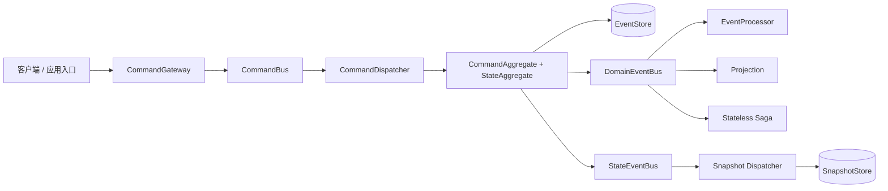

# 架构概览

Wow 把一次业务写入表达为**命令 → 聚合决策 → 领域事件 → 溯源状态**。框架负责把这条链连接到消息、存储、等待与派生处理；应用仍负责业务边界、事件语义、外部副作用和运行证据。这就是[简介](../introduction.md)所说的“领域模型即服务”的技术边界，而不是“只写领域类，其余自动正确”的承诺。

本文是机制解释页。安装 capability、配置后端和发送命令请分别使用[配置指南](../configuration.md)、[扩展指南](../extensions/spring-boot-starter.md)与[发送命令](../command/sending.md)。

## 分层与所有权

| 层 | 主要模块 | 拥有的责任 | 不拥有的责任 |
| --- | --- | --- | --- |
| 公共契约 | `wow-api` | 命令、事件、聚合标识、注解等公共模型 | 运行调度与后端实现 |
| 核心运行时 | `wow-core` | CommandGateway、聚合处理、事件溯源、分发器、等待、序列化和 Runtime | Spring Bean 发现、具体 Broker/Storage |
| 编译期 | `wow-compiler` | 从注解生成 Wow 元数据、聚合元数据访问器和查询属性常量 | 运行时路由、OpenAPI 文档本身 |
| 容器集成 | `wow-spring`、`wow-spring-boot-starter` | Spring 生命周期桥接、条件装配、组件发现与 capability 组合 | 业务规则与后端原生运维 |
| Adapter | `wow-kafka`、`wow-mongo`、`wow-redis`、`wow-elasticsearch` 等 | Bus、EventStore、SnapshotStore、查询等具体实现 | 改写核心公共语义 |
| 验证 | `wow-test`、`wow-tck` | 领域测试 DSL 与 Adapter 契约测试 | 代替真实环境的恢复、容量和故障证据 |

依赖方向从公共契约流向核心，再由 Spring 和 Adapter 完成装配。应用若增加后端，应实现已有窄接口，并把后端原生一致性、确认、重投和恢复语义留在 Adapter 中，不在领域模型里复制一套基础设施。

## 运行时组件图

```mermaid
flowchart LR
    Client[客户端 / 应用入口] --> Gateway[CommandGateway]
    Gateway --> CommandBus[CommandBus]
    CommandBus --> CommandDispatcher[CommandDispatcher]
    CommandDispatcher --> Aggregate[CommandAggregate + StateAggregate]
    Aggregate --> EventStore[(EventStore)]
    Aggregate --> DomainBus[DomainEventBus]
    Aggregate --> StateBus[StateEventBus]
    DomainBus --> EventProcessor[EventProcessor]
    DomainBus --> Projection[Projection]
    DomainBus --> Saga[Stateless Saga]
    StateBus --> Snapshot[Snapshot Dispatcher]
    Snapshot --> SnapshotStore[(SnapshotStore)]
```

这里有三类不同的所有权：

- `EventStore` 保存权威事件历史；追加成功后，历史才成为聚合恢复的数据源。
- `SnapshotStore` 与投影保存派生数据；它们可以重建，不能替代事件历史。
- Bus 负责传输消息；投递、确认、保留与重投强度由所选实现和配置共同决定。

跨能力交接见[数据流](./data-flow.md)，聚合内部状态转换见[聚合生命周期](../domain/lifecycle.md)。

## 能力边界

| 边界 | 权威页面 |
| --- | --- |
| 聚合决策、事件历史、快照与恢复 | [领域模型](../domain/) |
| 命令定义、发送、完成与可靠性 | [命令](../command/) |
| Processor、Saga、补偿与事件分发 | [事件与协作](../event/) |
| 投影、查询与数据权限 | [投影](../projection.md)、[查询](../query.md)、[数据权限](../data-access.md) |

写入完成不自动意味着任意读模型已经更新。调用方完成语义由[完成语义](../command/completion.md)定义，本文不复制阶段表或调用示例。

## 顺序与并发边界

Wow 的默认分发器把消息按聚合 ID 映射到有限数量的 group，同一 group 通过串行链处理，不同 group 可以并发；一个 `AggregateSchedulerSupplier` 按命名聚合缓存 Reactor Scheduler。由此可得到的范围是：同一聚合 ID 在同一分发器实例中会映射到同一个 group。不能由此推断跨进程、跨 Bus、跨处理器函数或跨外部系统的全局顺序。

并发写入最终还要经过 EventStore 的版本约束。调度减少本实例内的竞争，版本追加负责拒绝冲突写入；两者不是同一个保证。后端投递与重试也不会自动让外部副作用幂等。

详见[聚合调度器](./aggregate-scheduler.md)、[事件分发管线](../event/dispatch.md)与[事件溯源](../domain/event-sourcing.md)。

## 生命周期边界

`WowRuntime` 是运行时组件的单一高层所有者。启动时，所有组件先 `prepare`，全部就绪后才依次 `start`。优雅停机等待连续静默期，关闭全局准入，再调用组件 `quiesce` 并按逆序清理。致命组件错误和全局截止时间进入同一完整运行时终止路径。

Spring 只通过一个 `WowRuntimeLifecycle` 适配此所有权。Runtime 组件不应再拥有竞争性的 Spring lifecycle 或 destroy owner。完整契约见[运行时生命周期](./runtime-lifecycle.md)。

## 编译期与运行期的分工

KSP 读取 `@BoundedContext`、`@AggregateRoot` 等声明并生成可打包的元数据与 Kotlin 常量。运行时和其他模块消费这些输出，完成聚合发现、路由、Schema 或 OpenAPI 组装。缺少 KSP 输出时，运行时不会根据本文描述“猜回”完整契约。

编译产物、路径与验证方法见[编译器](./compiler.md)。序列化格式和持久事件演进分别见[序列化](./serialization.md)与[事件演进](../domain/event-evolution.md)。

## 扩展时的检查清单

1. 公共模型放在 `wow-api`，运行行为放在 `wow-core`，具体后端放在独立 Adapter。
2. 响应式命令与事件路径不引入阻塞调用。
3. 明确新组件是否由 `WowRuntime` 管理；若是，只保留一个生命周期所有者。
4. 分别验证 source、binary 与 wire 影响，不用编译通过代替历史数据兼容。
5. 对顺序、重试、幂等和确认只声明实现与测试实际覆盖的范围。
6. 用对应 TCK/集成测试验证 Adapter，再用真实环境证明恢复和运维结论。

## 事实来源

- [`wow-api`](https://github.com/Ahoo-Wang/Wow/tree/main/wow-api/src/main/kotlin/me/ahoo/wow/api)
- [`wow-core`](https://github.com/Ahoo-Wang/Wow/tree/main/wow-core/src/main/kotlin/me/ahoo/wow)
- [`wow-compiler`](https://github.com/Ahoo-Wang/Wow/tree/main/wow-compiler/src/main/kotlin/me/ahoo/wow/compiler)
- [`Architecture.svg`](https://github.com/Ahoo-Wang/Wow/blob/main/document/design/assets/Architecture.svg)

## 继续阅读

- [核心概念](../core-concepts.md)：稳定术语与价值链
- [模块依赖](./module-dependencies.md)：精确 capability 与 Gradle 边界
- [生产最佳实践](../best-practices.md)：把组件边界转成发布证据
