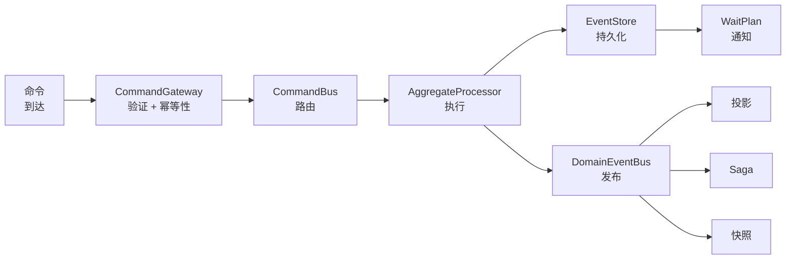
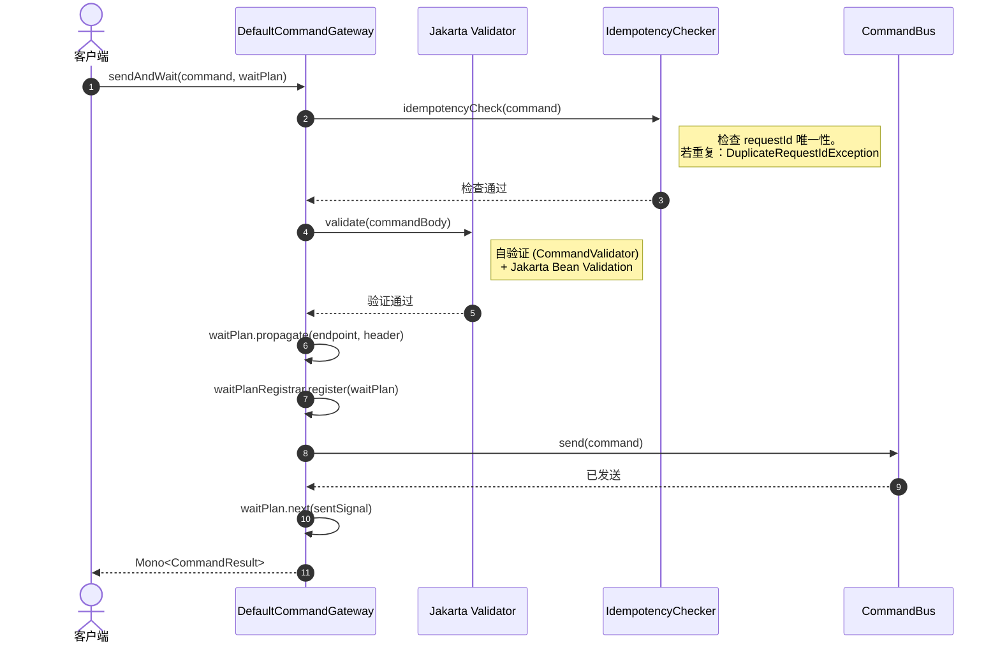
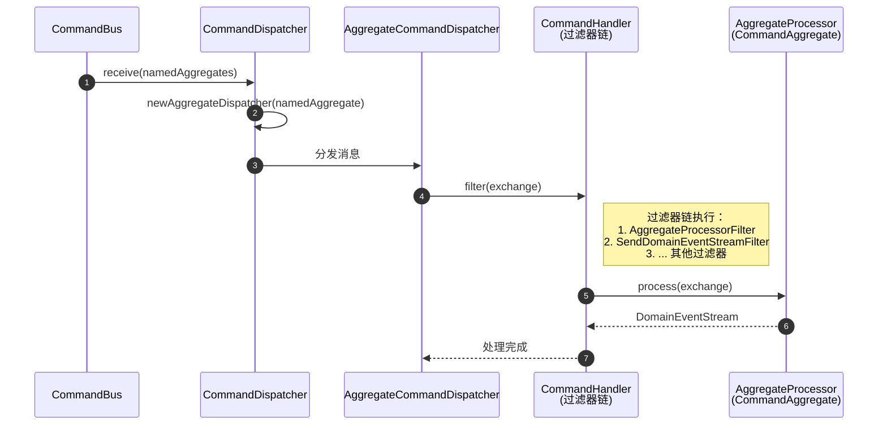
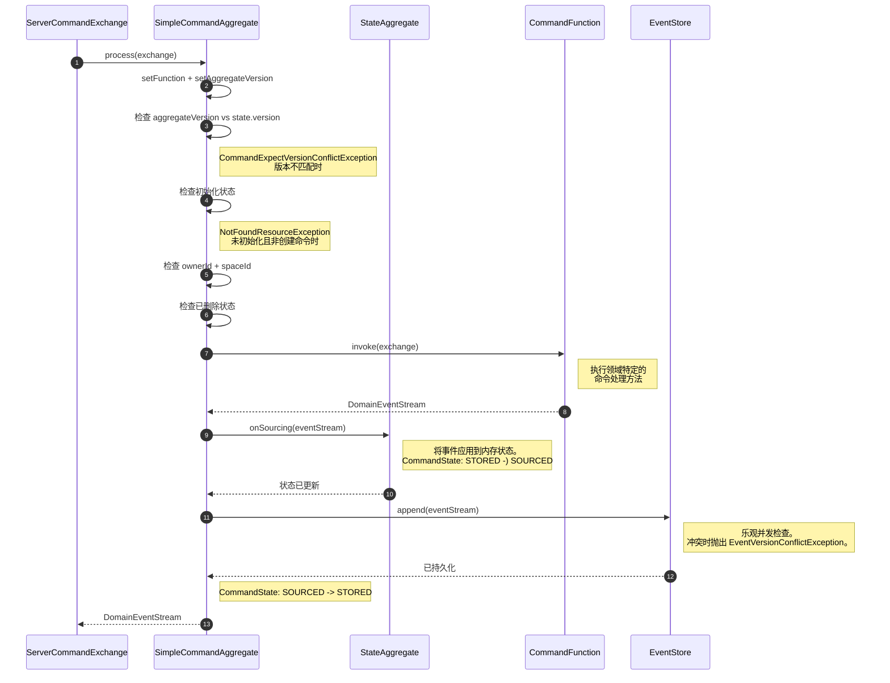
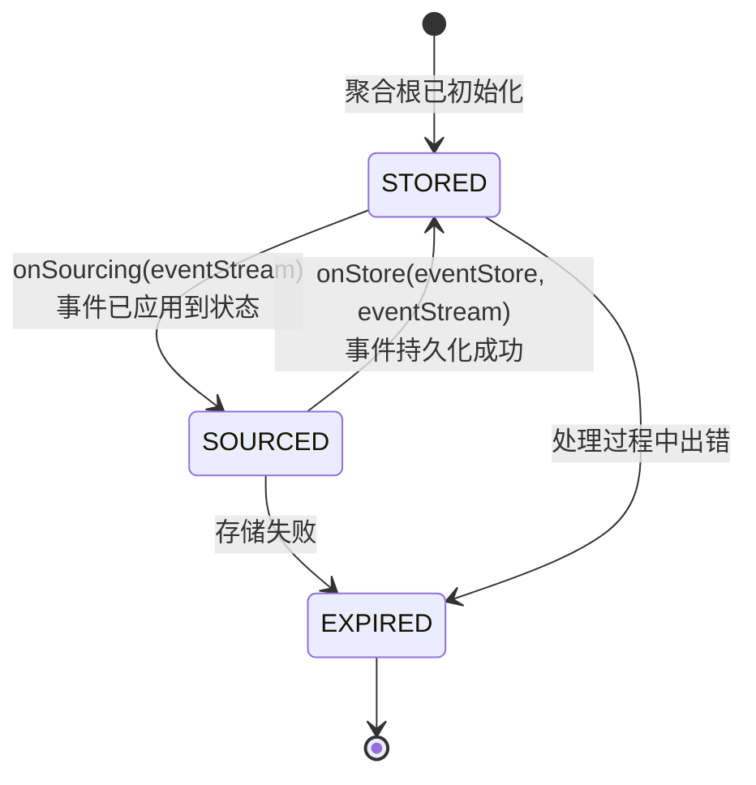
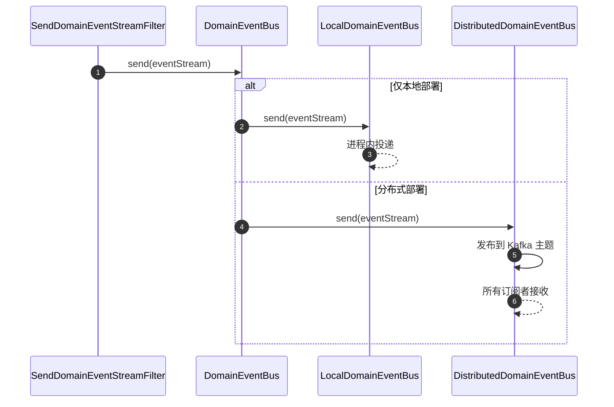
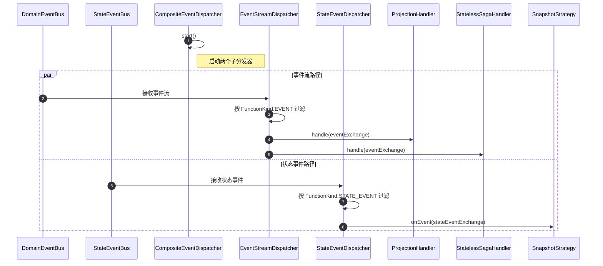
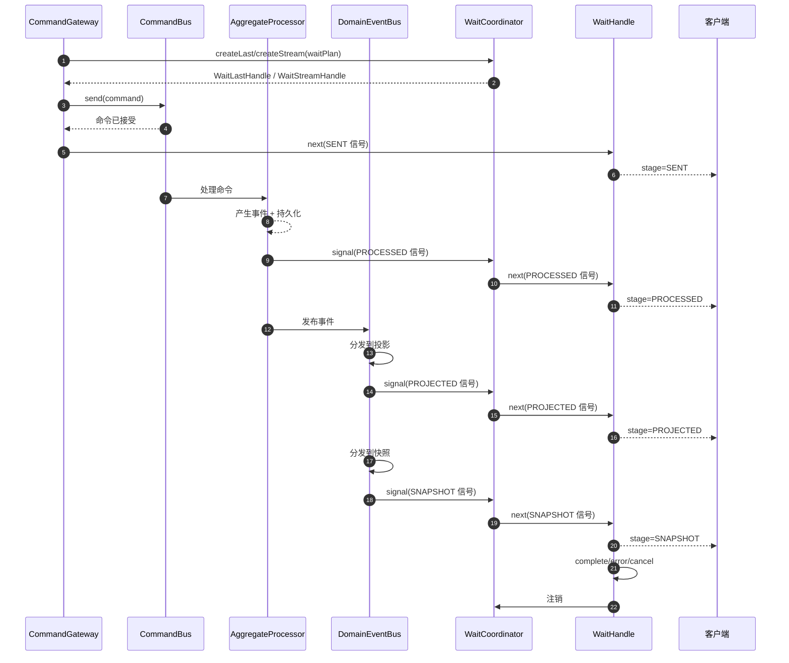
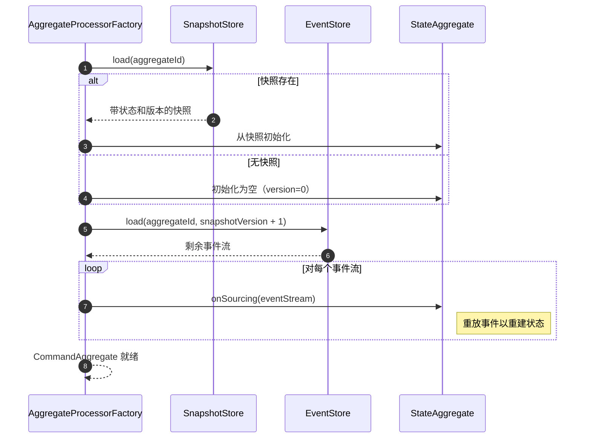
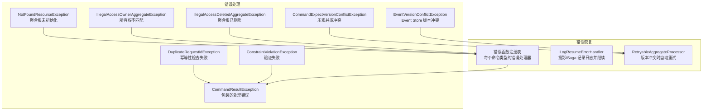

# 数据流

本页追踪数据在 Wow 框架中流动的完整生命周期，从命令到达 Gateway 到投影、Saga 和快照完成更新的全过程。

## 高层管道

<!-- Sources:
  wow-core/src/main/kotlin/me/ahoo/wow/command/DefaultCommandGateway.kt
  wow-core/src/main/kotlin/me/ahoo/wow/command/CommandBus.kt
  wow-core/src/main/kotlin/me/ahoo/wow/modeling/command/AggregateProcessor.kt
  wow-core/src/main/kotlin/me/ahoo/wow/eventsourcing/EventStore.kt
  wow-core/src/main/kotlin/me/ahoo/wow/event/DomainEventBus.kt
-->

## 阶段一：命令到达与 Gateway 处理

旅程始于客户端通过 `CommandGateway` 发送命令。这可以通过 WebFlux 端点或直接调用 Gateway 来完成。

<!-- Sources:
  wow-core/src/main/kotlin/me/ahoo/wow/command/DefaultCommandGateway.kt:45
  wow-core/src/main/kotlin/me/ahoo/wow/command/DefaultCommandGateway.kt:62
  wow-core/src/main/kotlin/me/ahoo/wow/command/DefaultCommandGateway.kt:77
  wow-core/src/main/kotlin/me/ahoo/wow/command/DefaultCommandGateway.kt:99
  wow-core/src/main/kotlin/me/ahoo/wow/command/DefaultCommandGateway.kt:205
-->

### 验证

`DefaultCommandGateway` 执行两个级别的验证：

1. **自验证**：如果命令体实现了 `CommandValidator`，首先调用其 `validate()` 方法。[[wow-core/src/main/kotlin/me/ahoo/wow/command/DefaultCommandGateway.kt:62](https://github.com/Ahoo-Wang/Wow/blob/main/wow-core/src/main/kotlin/me/ahoo/wow/command/DefaultCommandGateway.kt#L62)]

2. **Bean 验证**：Jakarta `Validator` 检查所有约束注解（`@NotNull`、`@Size` 等）。[[wow-core/src/main/kotlin/me/ahoo/wow/command/DefaultCommandGateway.kt:66](https://github.com/Ahoo-Wang/Wow/blob/main/wow-core/src/main/kotlin/me/ahoo/wow/command/DefaultCommandGateway.kt#L66)]

### 幂等性检查

发送前，Gateway 检查命令的 `requestId` 是否已在该聚合根上处理过。`AggregateIdempotencyCheckerProvider` 提供每个聚合的检查器。如果检测到重复，抛出 `DuplicateRequestIdException`。[[wow-core/src/main/kotlin/me/ahoo/wow/command/DefaultCommandGateway.kt:77](https://github.com/Ahoo-Wang/Wow/blob/main/wow-core/src/main/kotlin/me/ahoo/wow/command/DefaultCommandGateway.kt#L77)]

### 等待计划注册

如果提供了等待计划，Gateway：

1. 将等待端点传播到命令消息头
2. 通过 `WaitCoordinator` 注册 `WaitHandle` 以进行信号路由
3. 在完成（成功、错误或取消）时设置清理

[[wow-core/src/main/kotlin/me/ahoo/wow/command/DefaultCommandGateway.kt:217](https://github.com/Ahoo-Wang/Wow/blob/main/wow-core/src/main/kotlin/me/ahoo/wow/command/DefaultCommandGateway.kt#L217)]

## 阶段二：命令分发

命令总线将命令路由到相应的 `AggregateProcessor`。`CommandDispatcher` 订阅命令总线并为每个聚合创建分发器：

<!-- Sources:
  wow-core/src/main/kotlin/me/ahoo/wow/modeling/command/dispatcher/CommandDispatcher.kt
  wow-core/src/main/kotlin/me/ahoo/wow/modeling/command/dispatcher/SendDomainEventStreamFilter.kt
-->

### CommandDispatcher

`CommandDispatcher` 为所有本地注册的聚合订阅 `CommandBus`。它为每个聚合类型创建 `AggregateCommandDispatcher`，确保同一聚合 ID 的命令通过 `AggregateScheduler` 顺序处理。[[wow-core/src/main/kotlin/me/ahoo/wow/modeling/command/dispatcher/CommandDispatcher.kt:34](https://github.com/Ahoo-Wang/Wow/blob/main/wow-core/src/main/kotlin/me/ahoo/wow/modeling/command/dispatcher/CommandDispatcher.kt#L34)]

### 过滤器链

命令处理器使用过滤器链模式。链中的两个关键过滤器：

1. **AggregateProcessorFilter** — 调用 `AggregateProcessor.process()` 方法
2. **SendDomainEventStreamFilter** — 将产生的 `DomainEventStream` 发布到 `DomainEventBus`

[[wow-core/src/main/kotlin/me/ahoo/wow/modeling/command/dispatcher/SendDomainEventStreamFilter.kt:26](https://github.com/Ahoo-Wang/Wow/blob/main/wow-core/src/main/kotlin/me/ahoo/wow/modeling/command/dispatcher/SendDomainEventStreamFilter.kt#L26)]

## 阶段三：聚合处理

这是写端的核心。`CommandAggregate` 处理命令并产生领域事件。

<!-- Sources:
  wow-core/src/main/kotlin/me/ahoo/wow/modeling/command/SimpleCommandAggregate.kt:43
  wow-core/src/main/kotlin/me/ahoo/wow/modeling/command/CommandAggregate.kt:41
  wow-core/src/main/kotlin/me/ahoo/wow/modeling/state/StateAggregate.kt:31
  wow-core/src/main/kotlin/me/ahoo/wow/eventsourcing/EventStore.kt:27
-->

### 预处理检查

`SimpleCommandAggregate` 在执行命令函数前执行多项验证检查：

1. **版本冲突检查** — 如果命令携带预期的 `aggregateVersion`，必须与当前状态版本匹配。[[wow-core/src/main/kotlin/me/ahoo/wow/modeling/command/SimpleCommandAggregate.kt:92](https://github.com/Ahoo-Wang/Wow/blob/main/wow-core/src/main/kotlin/me/ahoo/wow/modeling/command/SimpleCommandAggregate.kt#L92)]

2. **初始化检查** — 如果聚合根未初始化，非创建命令将被拒绝。[[wow-core/src/main/kotlin/me/ahoo/wow/modeling/command/SimpleCommandAggregate.kt:99](https://github.com/Ahoo-Wang/Wow/blob/main/wow-core/src/main/kotlin/me/ahoo/wow/modeling/command/SimpleCommandAggregate.kt#L99)]

3. **所有权检查** — 如果命令指定了 `ownerId`，必须与聚合根的所有者匹配。[[wow-core/src/main/kotlin/me/ahoo/wow/modeling/command/SimpleCommandAggregate.kt:102](https://github.com/Ahoo-Wang/Wow/blob/main/wow-core/src/main/kotlin/me/ahoo/wow/modeling/command/SimpleCommandAggregate.kt#L102)]

4. **删除检查** — 如果聚合根处于已删除状态，除 `RecoverAggregate` 外的命令将被拒绝。[[wow-core/src/main/kotlin/me/ahoo/wow/modeling/command/SimpleCommandAggregate.kt:111](https://github.com/Ahoo-Wang/Wow/blob/main/wow-core/src/main/kotlin/me/ahoo/wow/modeling/command/SimpleCommandAggregate.kt#L111)]

### CommandState 状态机

`CommandState` 枚举管理处理生命周期：

<!-- Sources:
  wow-core/src/main/kotlin/me/ahoo/wow/modeling/command/CommandAggregate.kt:65
-->

[[wow-core/src/main/kotlin/me/ahoo/wow/modeling/command/CommandAggregate.kt:65](https://github.com/Ahoo-Wang/Wow/blob/main/wow-core/src/main/kotlin/me/ahoo/wow/modeling/command/CommandAggregate.kt#L65)]

### 状态上的 Event Sourcing

命令函数产生 `DomainEventStream` 后，事件通过 `onSourcing()` 应用到 `StateAggregate`。这在事件持久化之前更新内存状态。如果没有找到匹配的 Sourcing 方法，事件会被静默忽略（但版本号仍会更新）。[[wow-core/src/main/kotlin/me/ahoo/wow/modeling/state/StateAggregate.kt:31](https://github.com/Ahoo-Wang/Wow/blob/main/wow-core/src/main/kotlin/me/ahoo/wow/modeling/state/StateAggregate.kt#L31)]

### 事件持久化

事件通过 `append()` 持久化到 `EventStore`。此操作是原子性的，强制执行：

- **版本排序** — 事件版本必须等于 `expectedNextVersion`（当前版本 + 1）
- **聚合 ID 唯一性** — 新聚合根的第一个事件必须使用唯一的聚合 ID
- **请求 ID 去重** — 防止同一命令产生两次事件

[[wow-core/src/main/kotlin/me/ahoo/wow/eventsourcing/EventStore.kt:38](https://github.com/Ahoo-Wang/Wow/blob/main/wow-core/src/main/kotlin/me/ahoo/wow/eventsourcing/EventStore.kt#L38)]

## 阶段四：事件发布

事件流持久化后，`SendDomainEventStreamFilter` 将其发布到 `DomainEventBus`：

<!-- Sources:
  wow-core/src/main/kotlin/me/ahoo/wow/modeling/command/dispatcher/SendDomainEventStreamFilter.kt:33
  wow-core/src/main/kotlin/me/ahoo/wow/event/DomainEventBus.kt:39
-->

`DomainEventBus` 接口支持两种拓扑：

- **LocalDomainEventBus** — 单实例部署的进程内事件投递
- **DistributedDomainEventBus** — 通过 Kafka 实现跨进程投递的分布式部署

[[wow-core/src/main/kotlin/me/ahoo/wow/event/DomainEventBus.kt:55](https://github.com/Ahoo-Wang/Wow/blob/main/wow-core/src/main/kotlin/me/ahoo/wow/event/DomainEventBus.kt#L55)]

## 阶段五：事件分发到处理器

`DomainEventDispatcher` 从总线接收事件并分发给已注册的处理器。它使用**组合模式**将事件流分发与状态事件分发分离：

<!-- Sources:
  wow-core/src/main/kotlin/me/ahoo/wow/event/dispatcher/DomainEventDispatcher.kt:44
  wow-core/src/main/kotlin/me/ahoo/wow/event/dispatcher/CompositeEventDispatcher.kt:64
  wow-core/src/main/kotlin/me/ahoo/wow/event/dispatcher/EventStreamDispatcher.kt:27
  wow-core/src/main/kotlin/me/ahoo/wow/event/dispatcher/StateEventDispatcher.kt:27
  wow-core/src/main/kotlin/me/ahoo/wow/projection/ProjectionHandler.kt:27
  wow-core/src/main/kotlin/me/ahoo/wow/saga/stateless/StatelessSagaHandler.kt:27
  wow-core/src/main/kotlin/me/ahoo/wow/eventsourcing/snapshot/SnapshotStrategy.kt:30
-->

### CompositeEventDispatcher

`CompositeEventDispatcher` 管理两个并行子分发器：

1. **EventStreamDispatcher** — 订阅 `DomainEventBus`，分发给具有 `FunctionKind.EVENT` 的处理器（投影和 Saga）
2. **StateEventDispatcher** — 订阅 `StateEventBus`，分发给具有 `FunctionKind.STATE_EVENT` 的处理器（快照策略）

两个子分发器都使用 `AggregateSchedulerSupplier` 确保每个聚合的排序保证。相同聚合 ID 的事件始终按顺序处理，即使跨越不同的处理器类型。[[wow-core/src/main/kotlin/me/ahoo/wow/event/dispatcher/CompositeEventDispatcher.kt:96](https://github.com/Ahoo-Wang/Wow/blob/main/wow-core/src/main/kotlin/me/ahoo/wow/event/dispatcher/CompositeEventDispatcher.kt#L96)]

### 投影处理

投影接收领域事件并更新读模型。`DefaultProjectionHandler` 使用带有 `LogResumeErrorHandler` 的过滤器链实现容错 — 如果投影失败，错误会被记录，处理继续进行下一个事件。[[wow-core/src/main/kotlin/me/ahoo/wow/projection/ProjectionHandler.kt:36](https://github.com/Ahoo-Wang/Wow/blob/main/wow-core/src/main/kotlin/me/ahoo/wow/projection/ProjectionHandler.kt#L36)]

### Saga 处理

无状态 Saga 接收领域事件并可以产生新命令。`DefaultStatelessSagaHandler` 也使用过滤器链模式。Saga 在不维护自身状态的情况下协调跨聚合边界的长时间运行业务流程。[[wow-core/src/main/kotlin/me/ahoo/wow/saga/stateless/StatelessSagaHandler.kt:36](https://github.com/Ahoo-Wang/Wow/blob/main/wow-core/src/main/kotlin/me/ahoo/wow/saga/stateless/StatelessSagaHandler.kt#L36)]

### 快照创建

快照策略评估状态事件并在满足条件时创建快照：

- **SimpleSnapshotStrategy** — 每个事件后创建快照
- **VersionOffsetSnapshotStrategy** — 按可配置的版本间隔创建快照

[[wow-core/src/main/kotlin/me/ahoo/wow/eventsourcing/snapshot/SimpleSnapshotStrategy.kt:25](https://github.com/Ahoo-Wang/Wow/blob/main/wow-core/src/main/kotlin/me/ahoo/wow/eventsourcing/snapshot/SimpleSnapshotStrategy.kt#L25)]

## 阶段六：等待计划通知

命令处理完成后，已注册的等待 handle 在每个处理阶段接收信号：

<!-- Sources:
  wow-core/src/main/kotlin/me/ahoo/wow/command/DefaultCommandGateway.kt:217-280
  wow-core/src/main/kotlin/me/ahoo/wow/command/wait/WaitCoordinator.kt:18-72
  wow-core/src/main/kotlin/me/ahoo/wow/command/wait/WaitHandle.kt:22-223
-->

### 等待阶段

`WaitPlan` 支持在不同处理阶段等待：

| 阶段 | 含义 |
|-------|---------|
| `SENT` | 命令已被 `CommandBus` 接受 |
| `PROCESSED` | 命令已被聚合根执行，事件已持久化 |
| `PROJECTED` | 投影已处理事件 |
| `SNAPSHOT` | 快照已创建 |

`CommandWait` 工厂为每个阶段创建 `WaitPlan`：

- `CommandWait.sent(commandId)` — 等待命令发送
- `CommandWait.processed(commandId)` — 等待事件持久化
- `CommandWait.snapshot(commandId)` — 等待快照创建

[[wow-core/src/main/kotlin/me/ahoo/wow/command/CommandGateway.kt:145](https://github.com/Ahoo-Wang/Wow/blob/main/wow-core/src/main/kotlin/me/ahoo/wow/command/CommandGateway.kt#L145)]

### 信号路由

当下游处理器（投影、Saga、快照）完成时，它通过 `CommandWaitNotifier` 发送 `WaitSignal`。`WaitCoordinator` 根据 `waitCommandId` 查找已注册的 `WaitHandle`，并将信号转发给 handle。handle 内部持有 `WaitState` 状态机：`StageWaitState` 规约单阶段等待，`ChainWaitState` 跟踪 Saga 链 tail，并在主链信号确认 tail 命令 ID 后回放暂存的 tail 信号。[[WaitCoordinator.kt:62](https://github.com/Ahoo-Wang/Wow/blob/main/wow-core/src/main/kotlin/me/ahoo/wow/command/wait/WaitCoordinator.kt#L62)] [[WaitState.kt:56](https://github.com/Ahoo-Wang/Wow/blob/main/wow-core/src/main/kotlin/me/ahoo/wow/command/wait/WaitState.kt#L56)] [[ChainWaitState.kt:143](https://github.com/Ahoo-Wang/Wow/blob/main/wow-core/src/main/kotlin/me/ahoo/wow/command/wait/chain/ChainWaitState.kt#L143)]

## 聚合加载（读路径）

当需要为新命令加载聚合根时，框架重建其状态：

<!-- Sources:
  wow-core/src/main/kotlin/me/ahoo/wow/eventsourcing/EventStoreStateAggregateRepository.kt
  wow-core/src/main/kotlin/me/ahoo/wow/eventsourcing/snapshot/SnapshotStore.kt:27
  wow-core/src/main/kotlin/me/ahoo/wow/modeling/state/StateAggregate.kt:31
-->

加载过程：

1. **加载快照** — 如果聚合根存在快照，从该状态和版本开始
2. **加载剩余事件** — 从 `EventStore` 获取快照版本之后的所有事件
3. **重放事件** — 通过 `onSourcing()` 将每个事件流应用到 `StateAggregate`

`EventStore.load()` 方法支持按版本范围或时间范围加载，默认从版本 1 加载所有事件。[[wow-core/src/main/kotlin/me/ahoo/wow/eventsourcing/EventStore.kt:54](https://github.com/Ahoo-Wang/Wow/blob/main/wow-core/src/main/kotlin/me/ahoo/wow/eventsourcing/EventStore.kt#L54)]

## 错误处理

数据流在每个阶段都包含错误处理：

<!-- Sources:
  wow-core/src/main/kotlin/me/ahoo/wow/modeling/command/SimpleCommandAggregate.kt:150
  wow-core/src/main/kotlin/me/ahoo/wow/projection/ProjectionHandler.kt:36
  wow-core/src/main/kotlin/me/ahoo/wow/modeling/command/RetryableAggregateProcessor.kt
-->

### 错误函数

`SimpleCommandAggregate` 支持每个命令类型的错误函数。如果为命令类型注册了错误函数，处理失败时会调用该函数，允许聚合根产生补偿事件。[[wow-core/src/main/kotlin/me/ahoo/wow/modeling/command/SimpleCommandAggregate.kt:150](https://github.com/Ahoo-Wang/Wow/blob/main/wow-core/src/main/kotlin/me/ahoo/wow/modeling/command/SimpleCommandAggregate.kt#L150)]

### 投影/Saga 错误恢复

投影和 Saga 使用 `LogResumeErrorHandler` — 错误被记录但处理继续进行下一个事件。这确保失败的投影不会阻塞其他处理器。

## 相关页面

- [架构概览](./overview) — 分层架构和 CQRS 模式
- [模块依赖](./module-dependencies) — 详细的模块依赖图
