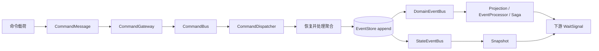

# 数据流

本页把 Wow 的组件连接成一条端到端链路，并标明每个完成阶段实际证明的边界。如何发送命令、配置后端或实现处理器，请跟随相应 how-to 页面，不在这里重复设置步骤。

## 总览


```mermaid
flowchart LR
    Input[命令载荷] --> Message[CommandMessage]
    Message --> Gateway[CommandGateway]
    Gateway --> CommandBus[CommandBus]
    CommandBus --> Dispatcher[CommandDispatcher]
    Dispatcher --> Aggregate[恢复并处理聚合]
    Aggregate --> Store[(EventStore append)]
    Store --> DomainBus[DomainEventBus]
    Store --> StateBus[StateEventBus]
    DomainBus --> Consumers[Projection / EventProcessor / Saga]
    StateBus --> Snapshot[Snapshot]
    Consumers --> Signals[下游 WaitSignal]
    Snapshot --> Signals
```

## 1. 构造与发送命令

应用把命令载荷转换为 `CommandMessage`。信封携带命令 ID、request ID、完整 AggregateId、可选期望版本和 Header。若载荷没有提供聚合 ID，命令工厂可以从聚合元数据选择 ID 生成器；这与消息 ID 生成是两条独立路径，见[ID 生成器](./id-generator.md)。

`DefaultCommandGateway` 在发送前执行命令自身 `CommandValidator`、Jakarta Bean Validation 和 request ID 预检。预检只是配置的 `AggregateIdempotencyChecker` 所覆盖边界；最终并发/重复写入仍由 EventStore 的持久约束决定。

需要等待时，Gateway 先注册 wait handle，再发送命令，避免快速信号早于订阅。具体 API 与 target 选择见[命令网关](../command-gateway.md)。

## 2. CommandBus 与分发器准入

CommandBus 的 `send` 完成后可以产生 `SENT` 结果。它只表示所选 Bus 的发送操作完成，不表示聚合已执行。

Runtime-owned `CommandDispatcher` 在启动准备期建立 subscription，启动后开放处理。每个 exchange 在进入处理 group 前申请 Runtime activity；停机准入关闭后，不能取得租约的消息不会进入聚合处理链。

分发器按命名聚合创建子分发器，再按聚合 ID 映射到 group。同一 group 串行，不同 group 可并发；这不是跨进程全局锁。

## 3. 恢复并执行聚合

对于非创建命令，状态仓库：

1. 加载最新可用快照或创建初始状态；
2. 从下一版本加载 EventStore 中的事件流；
3. 按流顺序调用 `StateAggregate.onSourcing`；
4. 创建 `CommandAggregate` 并执行命令函数。

命令函数读取当前状态、检查业务不变量并返回事件载荷。`SimpleCommandAggregate` 先把新事件流应用到内存状态，再调用 `EventStore.append`。追加成功后，该事件流才成为权威历史。详细状态机见[聚合生命周期](./aggregate-lifecycle.md)。

## 4. 追加后的发布

默认命令 filter chain 在聚合处理后继续执行：

```text
EventStore append
  → DomainEventBus.send(eventStream)
  → StateEventBus.send(stateEvent)（状态已初始化时）
  → ProcessedNotifierFilter 在完整 chain 成功后发出 PROCESSED
```

`SendStateEventFilter` 对发送错误使用当前错误处理策略恢复，因此必须结合所选 filter 和日志解释结果；不要只从一条 Bus 调用推断所有下游都已接收。

EventStore 追加已经发生后，任何 Bus、投影、Saga 或外部处理器失败都不能回滚该历史。恢复责任转移到重投、幂等、补偿或重放。

## 5. 下游分发

DomainEventBus 的事件流进入不同分发器：

- Projection 运行匹配函数，并可在该函数返回的响应式链完成后发送 `PROJECTED`；
- EventProcessor 执行应用副作用，并可发送 `EVENT_HANDLED`；
- Stateless Saga 发送后续命令，并可发送 `SAGA_HANDLED`。

StateEventBus 组合事件流与当前溯源状态，Snapshot Dispatcher 按策略保存或跳过快照，并发送 `SNAPSHOT`。

每个函数级等待目标只跟踪所选函数。未选择的消费者可能仍在运行、失败或滞后。

## 6. 等待阶段

| 阶段 | 当前链路中已完成 | 仍未证明 |
| --- | --- | --- |
| `SENT` | CommandBus send | 聚合执行、事件追加 |
| `PROCESSED` | 命令 filter chain 成功；包括聚合处理/追加与当前领域、状态事件发送 filter | Snapshot、Projection、EventProcessor、Saga 函数完成 |
| `SNAPSHOT` | 选定快照处理链完成 | 查询投影完成 |
| `PROJECTED` | 匹配投影函数返回的响应式链完成 | 查询/读模型可见性、缓存或副本、其他投影或外部系统完成 |
| `EVENT_HANDLED` | 选定事件处理函数完成 | 其他函数完成 |
| `SAGA_HANDLED` | 选定 Saga 函数完成 | Saga 发出的尾部命令达到任意阶段；链式等待需显式选择 |

WaitSignal 通过 `CommandWaitNotifier` 路由给当前 wait handle。timeout 表示在期限内没有满足 target，不等价于“命令一定失败”或“事件一定未追加”；超时后必须按 request ID、命令结果或权威状态查询真实结果。

## 7. 读取路径

读取聚合状态与读取投影是两种路径：

- 聚合恢复读取快照 + EventStore，服务于下一次业务决策；
- 查询 API 读取投影/快照等查询存储，服务于用户读取。

`PROCESSED` 后立即查询投影可能仍看到旧值。应使用精确 `PROJECTED` target 观察匹配函数返回的响应式链完成，而不是固定 sleep；用户契约需要读模型可见时，再执行实际查询证明可见性。返回链之外的工作、缓存、副本和无关查询管线仍需独立证据。查询接口见[投影](../projection.md)与[查询](../query.md)。

## 失败定位表

| 观察结果 | 优先检查 |
| --- | --- |
| 没有 `SENT` | Gateway 验证、request ID 预检、CommandBus send |
| 有 `SENT`，没有 `PROCESSED` | dispatcher 准入、聚合恢复/校验、EventStore append、领域/状态事件发送 |
| 有 `PROCESSED`，没有 `SNAPSHOT` | StateEventBus、Snapshot Dispatcher、策略与 SnapshotStore |
| 有 `PROCESSED`，没有 `PROJECTED` | DomainEventBus、目标函数匹配、投影存储与补偿 |
| wait timeout，但后续状态改变 | 信号路由、wait target/timeout 与真实权威结果对账 |

生产排查流程见[故障排查](../troubleshooting.md)，指标与 trace 映射见[可观测性](./observability.md)。

## 源码入口

- [`DefaultCommandGateway`](https://github.com/Ahoo-Wang/Wow/blob/main/wow-core/src/main/kotlin/me/ahoo/wow/command/DefaultCommandGateway.kt)
- [`CommandDispatcher`](https://github.com/Ahoo-Wang/Wow/blob/main/wow-core/src/main/kotlin/me/ahoo/wow/modeling/command/dispatcher/CommandDispatcher.kt)
- [`SimpleCommandAggregate`](https://github.com/Ahoo-Wang/Wow/blob/main/wow-core/src/main/kotlin/me/ahoo/wow/modeling/command/SimpleCommandAggregate.kt)
- [`SendDomainEventStreamFilter`](https://github.com/Ahoo-Wang/Wow/blob/main/wow-core/src/main/kotlin/me/ahoo/wow/modeling/command/dispatcher/SendDomainEventStreamFilter.kt)
- [`SendStateEventFilter`](https://github.com/Ahoo-Wang/Wow/blob/main/wow-core/src/main/kotlin/me/ahoo/wow/eventsourcing/state/SendStateEventFilter.kt)
- [`NotifierFilters`](https://github.com/Ahoo-Wang/Wow/blob/main/wow-core/src/main/kotlin/me/ahoo/wow/command/wait/NotifierFilters.kt)
