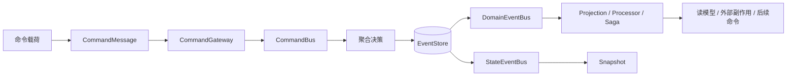

# 数据流

本页只保留跨能力视图。每个能力内部的完整时序、状态机和操作步骤由对应权威页面负责。

## 总览

```mermaid
flowchart LR
    Input[命令载荷] --> Message[CommandMessage]
    Message --> Gateway[CommandGateway]
    Gateway --> CommandBus[CommandBus]
    CommandBus --> Aggregate[聚合决策]
    Aggregate --> Store[(EventStore)]
    Store --> DomainBus[DomainEventBus]
    Store --> StateBus[StateEventBus]
    DomainBus --> Consumers[Projection / Processor / Saga]
    StateBus --> Snapshot[Snapshot]
    Consumers --> Query[读模型 / 外部副作用 / 后续命令]
```

## 能力交接

| 交接点 | 上游交付 | 下游责任 | 权威页面 |
| --- | --- | --- | --- |
| 命令入口 | 命令载荷、目标聚合、请求身份与等待目标 | 校验并发送 `CommandMessage` | [定义命令](../command/definition.md)、[发送命令](../command/sending.md) |
| 聚合决策 | 当前溯源状态与命令 | 校验不变量并产生领域事件 | [聚合与不变量](../domain/aggregate.md)、[聚合生命周期](../domain/lifecycle.md) |
| 权威历史 | 有序 `DomainEventStream` | 在版本约束下追加并支持恢复 | [事件溯源](../domain/event-sourcing.md) |
| 事件协作 | 已持久化的领域事件与状态事件 | 分发给 Processor、Saga、Projection 与 Snapshot | [事件分发管线](../event/dispatch.md)、[事件与协作](../event/) |
| 派生处理 | 匹配的事件函数调用 | 完成副作用、后续命令、投影或快照 | [事件处理器](../event/processor.md)、[Saga](../event/saga.md)、[快照](../domain/snapshot.md) |
| 调用方观察 | 各处理链产生的阶段信号 | 选择最早满足合同的阶段并处理未知结果 | [完成语义](../command/completion.md)、[失败与幂等](../command/reliability.md) |

EventStore 追加后的失败不能回滚已经提交的历史。后续恢复分别由传输重投、幂等、事件补偿或重放承担；精确边界见[事件分发管线](../event/dispatch.md)与[事件补偿](../event/compensation.md)。

## 读取路径

读取聚合状态与读取投影是两种路径：

- 聚合恢复读取快照 + EventStore，服务于下一次业务决策；
- 查询 API 读取投影/快照等查询存储，服务于用户读取。

`PROCESSED` 后立即查询投影可能仍看到旧值。应使用精确 `PROJECTED` target 观察匹配函数返回的响应式链完成，而不是固定 sleep；用户契约需要读模型可见时，再执行实际查询证明可见性。返回链之外的工作、缓存、副本和无关查询管线仍需独立证据。查询接口见[投影](../projection.md)与[查询服务](../query.md)。

## 跨能力失败定位

| 观察结果 | 进入权威页面 |
| --- | --- |
| 没有 `SENT` | [发送命令](../command/sending.md)与[命令传输](../command/internals/transport.md) |
| 有 `SENT`，没有 `PROCESSED` | [命令处理管线](../command/internals/pipeline.md)与[失败与幂等](../command/reliability.md) |
| 有 `PROCESSED`，没有 `SNAPSHOT` | [快照](../domain/snapshot.md)与[事件分发管线](../event/dispatch.md) |
| 有 `PROCESSED`，没有下游函数阶段 | [事件与协作](../event/)与[事件补偿](../event/compensation.md) |
| wait timeout，但后续状态改变 | [完成语义](../command/completion.md)与[失败与幂等](../command/reliability.md) |

生产排查流程见[故障排查](../troubleshooting.md)，指标与 trace 映射见[可观测性](./observability.md)。
