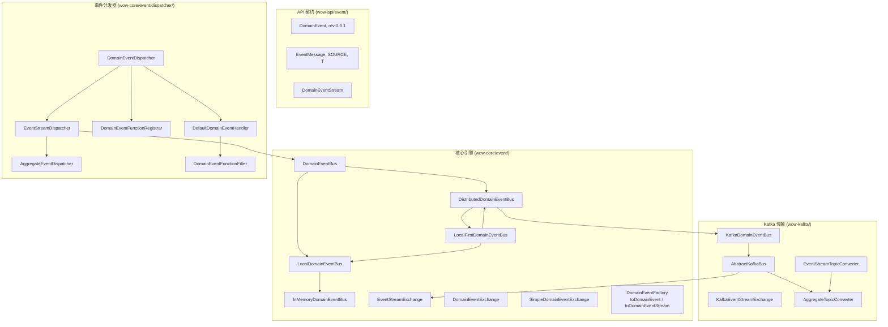
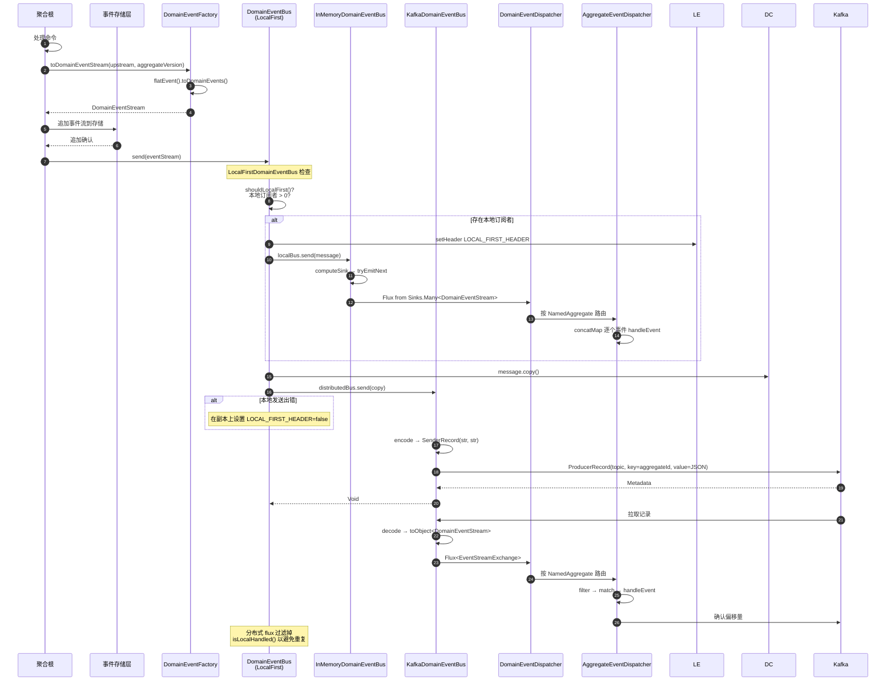
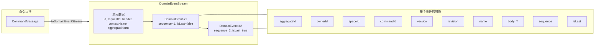
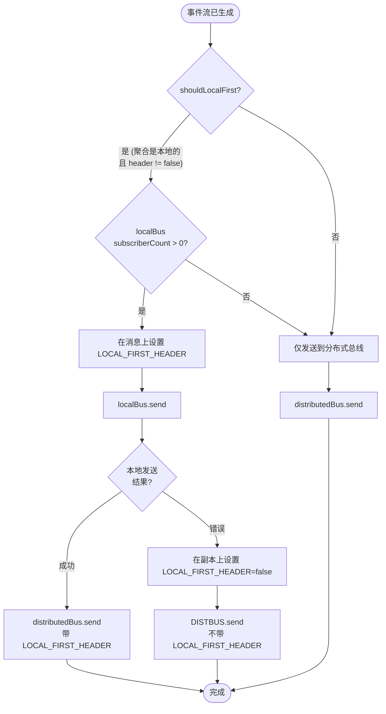
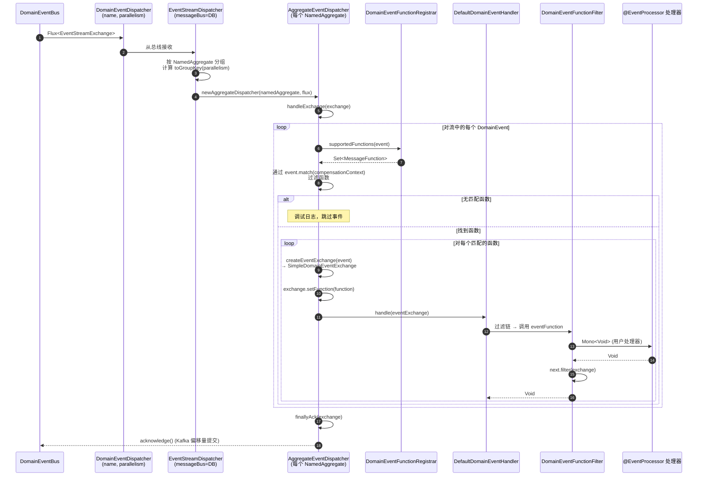

# 事件总线

事件总线是 Wow 事件驱动架构的中枢神经系统。它从聚合处理完命令后接收**领域事件流**，并将其路由到所有感兴趣的消费者 -- 投影、Saga、事件处理器和外部系统。事件总线保证**按聚合 ID 有序投递**，确保消费者始终按照事件产生的精确顺序看到事件。

## 架构概览

事件总线构建于分层抽象之上，将"做什么"（领域事件传输）与"怎么做"（内存、Kafka、Redis）解耦。每种总线实现都从同一个基础契约起步，当从本地扩展到分布式时获得更多能力。



<!-- Sources:
DomainEventBus.kt: wow-core/src/main/kotlin/me/ahoo/wow/event/DomainEventBus.kt:13-97
InMemoryDomainEventBus.kt: wow-core/src/main/kotlin/me/ahoo/wow/event/InMemoryDomainEventBus.kt:13-54
LocalFirstDomainEventBus.kt: wow-core/src/main/kotlin/me/ahoo/wow/event/LocalFirstDomainEventBus.kt:14-42
KafkaDomainEventBus.kt: wow-kafka/src/main/kotlin/me/ahoo/wow/kafka/KafkaDomainEventBus.kt:13-41
AbstractKafkaBus.kt: wow-kafka/src/main/kotlin/me/ahoo/wow/kafka/AbstractKafkaBus.kt:14-131
DomainEventDispatcher.kt: wow-core/src/main/kotlin/me/ahoo/wow/event/dispatcher/DomainEventDispatcher.kt:14-84
EventStreamDispatcher.kt: wow-core/src/main/kotlin/me/ahoo/wow/event/dispatcher/EventStreamDispatcher.kt:14-49
DomainEvent.kt: wow-api/src/main/kotlin/me/ahoo/wow/api/event/DomainEvent.kt:14-95
EventMessage.kt: wow-api/src/main/kotlin/me/ahoo/wow/api/event/EventMessage.kt:14-79
DomainEventStream.kt: wow-core/src/main/kotlin/me/ahoo/wow/event/DomainEventStream.kt:13-148
-->

这种分层设计使得框架可以使用**相同的总线契约**，无论是在本地处理事件（单 JVM，零网络开销）还是在分布式集群（Kafka 支持，多节点）。默认部署使用 `LocalFirstDomainEventBus`，结合了两种策略。

## 核心接口

事件总线的类型层次从通用消息总线逐步构建到领域事件专用的契约：

| 接口 | 职责 | 继承 | 源码 |
|---|---|---|---|
| `MessageBus<M, E>` | 基础契约：`send()` 和 `receive()` | `AutoCloseable` | [MessageBus.kt:31-53](https://github.com/Ahoo-Wang/Wow/blob/main/wow-core/src/main/kotlin/me/ahoo/wow/messaging/MessageBus.kt#L31-L53) |
| `DomainEventBus` | 针对 `DomainEventStream` 载荷的事件总线 | `MessageBus`, `TopicKindCapable` | [DomainEventBus.kt:39-44](https://github.com/Ahoo-Wang/Wow/blob/main/wow-core/src/main/kotlin/me/ahoo/wow/event/DomainEventBus.kt#L39-L44) |
| `LocalDomainEventBus` | 进程内总线，含订阅者计数 | `DomainEventBus`, `LocalMessageBus` | [DomainEventBus.kt:55-57](https://github.com/Ahoo-Wang/Wow/blob/main/wow-core/src/main/kotlin/me/ahoo/wow/event/DomainEventBus.kt#L55-L57) |
| `DistributedDomainEventBus` | 跨进程 / 跨节点的总线 | `DomainEventBus`, `DistributedMessageBus` | [DomainEventBus.kt:68-70](https://github.com/Ahoo-Wang/Wow/blob/main/wow-core/src/main/kotlin/me/ahoo/wow/event/DomainEventBus.kt#L68-L70) |

所有领域事件总线的 `TopicKind` 始终为 `TOPIC_KIND.EVENT_STREAM` ([DomainEventBus.kt:42-43](https://github.com/Ahoo-Wang/Wow/blob/main/wow-core/src/main/kotlin/me/ahoo/wow/event/DomainEventBus.kt#L42-L43))，以此区别于命令总线（`COMMAND`）和状态事件总线（`STATE`）。

### NoOpDomainEventBus

对于测试和需要禁用事件发布的场景，单例 `NoOpDomainEventBus` ([DomainEventBus.kt:81-97](https://github.com/Ahoo-Wang/Wow/blob/main/wow-core/src/main/kotlin/me/ahoo/wow/event/DomainEventBus.kt#L81-L97)) 会静默丢弃所有发送操作，并在接收时返回空 flux。

## 事件发布与接收流程

从聚合命令处理到事件投递的端到端流程遵循发布-订阅模型，并按聚合进行有序投递。



<!-- Sources:
DomainEventStreamFactory.kt: wow-core/src/main/kotlin/me/ahoo/wow/event/DomainEventStreamFactory.kt:79-114
LocalFirstMessageBus.kt: wow-core/src/main/kotlin/me/ahoo/wow/messaging/LocalFirstMessageBus.kt:99-171
InMemoryDomainEventBus.kt: wow-core/src/main/kotlin/me/ahoo/wow/event/InMemoryDomainEventBus.kt:13-54
AbstractKafkaBus.kt: wow-kafka/src/main/kotlin/me/ahoo/wow/kafka/AbstractKafkaBus.kt:52-95
AbstractAggregateEventDispatcher.kt: wow-core/src/main/kotlin/me/ahoo/wow/event/dispatcher/AbstractAggregateEventDispatcher.kt:49-139
KafkaEventStreamExchange.kt: wow-kafka/src/main/kotlin/me/ahoo/wow/kafka/KafkaEventStreamExchange.kt:14-32
-->

该序列图揭示了两个关键设计决策：

1. **本地优先路由**（步骤 8-13）：事件在到达分布式总线**之前**先投递给进程内消费者。这使得运行在同一节点上的投影和 Saga 能够以近乎零延迟的方式处理事件。

2. **重复预防**（最后的注释）：分布式消费者会检查 `isLocalHandled()` 并跳过已在本地处理的事件，防止节点同时作为生产者和消费者时的双重处理。

## 领域事件流

`DomainEventStream` 是总线上传输的基本单元。它将**单个命令执行**产生的所有领域事件组合为一个原子载荷。



<!-- Sources:
DomainEventStream.kt: wow-core/src/main/kotlin/me/ahoo/wow/event/DomainEventStream.kt:51-58
SimpleDomainEventStream.kt: wow-core/src/main/kotlin/me/ahoo/wow/event/DomainEventStream.kt:90-125
DomainEvent.kt: wow-api/src/main/kotlin/me/ahoo/wow/api/event/DomainEvent.kt:52-95
SimpleDomainEvent.kt: wow-core/src/main/kotlin/me/ahoo/wow/event/SimpleDomainEvent.kt:56-71
DomainEventStreamFactory.kt: wow-core/src/main/kotlin/me/ahoo/wow/event/DomainEventStreamFactory.kt:79-114
-->

| 属性 | 类型 | 描述 | 源码 |
|---|---|---|---|
| `id` | `String` | 全局唯一的流 ID（通过 `generateGlobalId()` 生成） | [DomainEventStream.kt:91](https://github.com/Ahoo-Wang/Wow/blob/main/wow-core/src/main/kotlin/me/ahoo/wow/event/DomainEventStream.kt#L91) |
| `requestId` | `String` | 关联 ID，将流与原始 HTTP 请求关联 | [DomainEventStream.kt:92](https://github.com/Ahoo-Wang/Wow/blob/main/wow-core/src/main/kotlin/me/ahoo/wow/event/DomainEventStream.kt#L92) |
| `header` | `Header` | 消息头，包含元数据和传播标志 | [DomainEventStream.kt:93](https://github.com/Ahoo-Wang/Wow/blob/main/wow-core/src/main/kotlin/me/ahoo/wow/event/DomainEventStream.kt#L93) |
| `body` | `List<DomainEvent<*>>` | 有序的领域事件列表（不可为空） | [DomainEventStream.kt:94](https://github.com/Ahoo-Wang/Wow/blob/main/wow-core/src/main/kotlin/me/ahoo/wow/event/DomainEventStream.kt#L94) |
| `aggregateId` | `AggregateId` | 从第一个事件的聚合 ID 派生 | [DomainEventStream.kt:97](https://github.com/Ahoo-Wang/Wow/blob/main/wow-core/src/main/kotlin/me/ahoo/wow/event/DomainEventStream.kt#L97) |
| `version` | `Int` | 应用此流后的聚合版本（来自第一个事件） | [DomainEventStream.kt:106](https://github.com/Ahoo-Wang/Wow/blob/main/wow-core/src/main/kotlin/me/ahoo/wow/event/DomainEventStream.kt#L106) |
| `size` | `Int` | 流中领域事件的数量 | [DomainEventStream.kt:110](https://github.com/Ahoo-Wang/Wow/blob/main/wow-core/src/main/kotlin/me/ahoo/wow/event/DomainEventStream.kt#L110) |

流中的事件从 `DEFAULT_EVENT_SEQUENCE` (1) 开始**顺序编号**。每个事件上的 `isLast` 标志表示流是否继续或结束，使消费者能够在最终事件到达时执行批处理完成逻辑。

### 事件流工厂

`toDomainEventStream()` 扩展函数从命令处理结果创建事件流。它将输出扁平化为单个事件，分配顺序 ID，并将它们包装在 `SimpleDomainEventStream` 中：

<!-- Source: DomainEventStreamFactory.kt:79-114 -->
```kotlin
fun Any.toDomainEventStream(
    upstream: CommandMessage<*>,
    aggregateVersion: Int = Version.UNINITIALIZED_VERSION,
    ...
): DomainEventStream {
    val events = flatEvent().toDomainEvents(
        streamVersion = aggregateVersion + 1,
        aggregateId = upstream.aggregateId,
        command = upstream,
        ...
    )
    return SimpleDomainEventStream(
        id = generateGlobalId(),
        requestId = upstream.requestId,
        header = header,
        body = events,
    )
}
```

`flatEvent()` ([DomainEventStreamFactory.kt:43-56](https://github.com/Ahoo-Wang/Wow/blob/main/wow-core/src/main/kotlin/me/ahoo/wow/event/DomainEventStreamFactory.kt#L43-L56)) 将单个事件、数组和可迭代对象规范化为一致的 `Iterable<Any>`，然后再创建单个 `DomainEvent` 实例。

## 总线实现

Wow 提供了四种具体的总线实现，涵盖了从简单测试到生产分布式集群的全范围：

| 实现 | 类 | 类型 | 使用场景 | 源码 |
|---|---|---|---|---|
| NoOp | `NoOpDomainEventBus` | 单例 | 测试，禁用事件发布 | [DomainEventBus.kt:81-97](https://github.com/Ahoo-Wang/Wow/blob/main/wow-core/src/main/kotlin/me/ahoo/wow/event/DomainEventBus.kt#L81-L97) |
| 内存 | `InMemoryDomainEventBus` | `LocalDomainEventBus` | 单进程应用，单元测试 | [InMemoryDomainEventBus.kt:38-54](https://github.com/Ahoo-Wang/Wow/blob/main/wow-core/src/main/kotlin/me/ahoo/wow/event/InMemoryDomainEventBus.kt#L38-L54) |
| Kafka | `KafkaDomainEventBus` | `DistributedDomainEventBus` | 多节点生产环境 | [KafkaDomainEventBus.kt:22-41](https://github.com/Ahoo-Wang/Wow/blob/main/wow-kafka/src/main/kotlin/me/ahoo/wow/kafka/KafkaDomainEventBus.kt#L22-L41) |
| 本地优先 | `LocalFirstDomainEventBus` | `DomainEventBus` (混合) | 默认生产环境（组合内存 + Kafka） | [LocalFirstDomainEventBus.kt:38-42](https://github.com/Ahoo-Wang/Wow/blob/main/wow-core/src/main/kotlin/me/ahoo/wow/event/LocalFirstDomainEventBus.kt#L38-L42) |

### 本地优先路由策略

`LocalFirstDomainEventBus` 是**默认的生产环境总线**。它实现了两层投递策略，针对事件消费者（投影、Saga）与聚合运行在同一 JVM 中的常见情况进行了优化。



<!-- Sources:
LocalFirstMessageBus.kt: wow-core/src/main/kotlin/me/ahoo/wow/messaging/LocalFirstMessageBus.kt:99-171
LocalFirstDomainEventBus.kt: wow-core/src/main/kotlin/me/ahoo/wow/event/LocalFirstDomainEventBus.kt:14-42
LocalFirstMessageBus.kt: wow-core/src/main/kotlin/me/ahoo/wow/messaging/LocalFirstMessageBus.kt:65-75 (shouldLocalFirst)
-->

路由逻辑 ([LocalFirstMessageBus.kt:130-149](https://github.com/Ahoo-Wang/Wow/blob/main/wow-core/src/main/kotlin/me/ahoo/wow/messaging/LocalFirstMessageBus.kt#L130-L149)) **无论**本地成功或失败，始终向分布式总线发送一份副本。这确保其他节点始终能收到事件，而本地消费者则通过响应式 sink 享受亚毫秒级的投递。

在**接收端** ([LocalFirstMessageBus.kt:160-170](https://github.com/Ahoo-Wang/Wow/blob/main/wow-core/src/main/kotlin/me/ahoo/wow/messaging/LocalFirstMessageBus.kt#L160-L170))，总线合并本地和分布式的 flux，通过 `isLocalHandled()` 过滤掉已在本地处理的分布式事件。

## 事件分发器管道

一旦事件总线将 `EventStreamExchange` 传递给分发器，多阶段管道便会通过已注册的处理函数处理每个领域事件：



<!-- Sources:
DomainEventDispatcher.kt: wow-core/src/main/kotlin/me/ahoo/wow/event/dispatcher/DomainEventDispatcher.kt:44-84
EventStreamDispatcher.kt: wow-core/src/main/kotlin/me/ahoo/wow/event/dispatcher/EventStreamDispatcher.kt:27-49
AggregateEventDispatcher.kt: wow-core/src/main/kotlin/me/ahoo/wow/event/dispatcher/AggregateEventDispatcher.kt:53-80
AbstractAggregateEventDispatcher.kt: wow-core/src/main/kotlin/me/ahoo/wow/event/dispatcher/AbstractAggregateEventDispatcher.kt:49-139
DomainEventFunctionFilter.kt: wow-core/src/main/kotlin/me/ahoo/wow/event/dispatcher/DomainEventFunctionFilter.kt:42-71
DefaultDomainEventHandler: wow-core/src/main/kotlin/me/ahoo/wow/event/dispatcher/DomainEventHandler.kt:57-64
DomainEventFunctionRegistrar.kt: wow-core/src/main/kotlin/me/ahoo/wow/event/dispatcher/DomainEventFunctionRegistrar.kt:92-112
EventProcessorParser.kt: wow-core/src/main/kotlin/me/ahoo/wow/event/annotation/EventProcessorParser.kt:34-36
-->

### 分发器组件

| 组件 | 职责 | 关键行为 | 源码 |
|---|---|---|---|
| `DomainEventDispatcher` | 顶层协调器 | 创建 `EventStreamDispatcher` + `StateEventDispatcher`；启动/停止两者 | [DomainEventDispatcher.kt:44-84](https://github.com/Ahoo-Wang/Wow/blob/main/wow-core/src/main/kotlin/me/ahoo/wow/event/dispatcher/DomainEventDispatcher.kt#L44-L84) |
| `EventStreamDispatcher` | 按聚合路由事件流 | 按 `NamedAggregate` 分组 flux，委托给每个聚合的分发器 | [EventStreamDispatcher.kt:27-49](https://github.com/Ahoo-Wang/Wow/blob/main/wow-core/src/main/kotlin/me/ahoo/wow/event/dispatcher/EventStreamDispatcher.kt#L27-L49) |
| `AggregateEventDispatcher` | 每个聚合的事件处理 | 通过 `concatMap` 按顺序迭代事件，应用函数过滤 | [AggregateEventDispatcher.kt:53-80](https://github.com/Ahoo-Wang/Wow/blob/main/wow-core/src/main/kotlin/me/ahoo/wow/event/dispatcher/AggregateEventDispatcher.kt#L53-L80) |
| `DomainEventFunctionRegistrar` | 注册事件处理函数 | 解析 `@EventProcessor` 类 → 通过注解元数据创建 `MessageFunction` 集合 | [DomainEventFunctionRegistrar.kt:92-112](https://github.com/Ahoo-Wang/Wow/blob/main/wow-core/src/main/kotlin/me/ahoo/wow/event/dispatcher/DomainEventFunctionRegistrar.kt#L92-L112) |
| `DefaultDomainEventHandler` | 过滤链执行器 | 使用 `LogResumeErrorHandler` 运行 `FilterChain<DomainEventExchange<*>>` | [DomainEventHandler.kt:57-64](https://github.com/Ahoo-Wang/Wow/blob/main/wow-core/src/main/kotlin/me/ahoo/wow/event/dispatcher/DomainEventHandler.kt#L57-L64) |
| `DomainEventFunctionFilter` | 调用用户处理函数 | 在 exchange 上设置 `ServiceProvider`，调用 `eventFunction.invoke(exchange)` | [DomainEventFunctionFilter.kt:42-71](https://github.com/Ahoo-Wang/Wow/blob/main/wow-core/src/main/kotlin/me/ahoo/wow/event/dispatcher/DomainEventFunctionFilter.kt#L42-L71) |

`CompositeEventDispatcher` ([CompositeEventDispatcher.kt:64-138](https://github.com/Ahoo-Wang/Wow/blob/main/wow-core/src/main/kotlin/me/ahoo/wow/event/dispatcher/CompositeEventDispatcher.kt#L64-L138)) 组合了 `EventStreamDispatcher`（用于常规领域事件）和 `StateEventDispatcher`（用于状态变更事件），分别按 `FunctionKind.EVENT` 和 `FunctionKind.STATE_EVENT` 过滤函数。

### 事件处理器注解元数据

当一个类被 `@EventProcessor` 注解标记时，`EventProcessorParser` ([EventProcessorParser.kt:34-36](https://github.com/Ahoo-Wang/Wow/blob/main/wow-core/src/main/kotlin/me/ahoo/wow/event/annotation/EventProcessorParser.kt#L34-L36)) 会扫描带有 `@OnEvent` 或 `@OnStateEvent` 注解的方法，并将它们转换为 `MessageFunction` 实例。这些函数注册在 `DomainEventFunctionRegistrar` 中，使分发器能够将传入的事件匹配到正确的处理器。

每个 `@OnEvent` 注解可以选择性地指定聚合名称过滤器 (`vararg val value: String`) 来限制处理器从哪些聚合接收事件 ([OnEvent.kt:66-78](https://github.com/Ahoo-Wang/Wow/blob/main/wow-api/src/main/kotlin/me/ahoo/wow/api/annotation/OnEvent.kt#L66-L78))。

## 事件处理器生命周期

事件处理器遵循由分发器管理的明确定义的生命周期：

| 阶段 | 操作 | 详情 | 触发点 |
|---|---|---|---|
| **发现** | `DomainEventFunctionRegistrar.resolveProcessor()` | 扫描 `@EventProcessor` 类，提取 `@OnEvent` 方法，创建 `MessageFunction` 实例 | Spring 上下文刷新 |
| **注册** | `registerProcessor(processor)` | 按事件类型 + 聚合名称注册每个 `MessageFunction` | 发现之后 |
| **订阅** | `MessageBus.receive(subscription)` | 使用显式的聚合集合与消费组语义订阅事件流 | `MessageDispatcher.start()` |
| **分组** | `EventStreamDispatcher` 按 `NamedAggregate` 分组 | 将事件路由到每个聚合的调度器 | 每次收到批量事件时 |
| **匹配** | `supportedFunctions(event)` + `event.match()` | 找到处理给定事件类型的已注册函数 | 每个事件 |
| **调用** | `DomainEventFunctionFilter.filter()` | 设置服务提供者，通过过滤链调用处理器 | 每次事件与函数匹配时 |
| **确认** | `finallyAck(exchange)` | 提交偏移量（Kafka）或标记已处理（内存） | 流中所有事件处理完成后 |
| **关闭** | `MessageDispatcher.stopGracefully()` | 等待正在进行的处理完成，关闭订阅 | 应用关闭时 |

## Kafka 集成

在分布式环境中部署时，Wow 使用 Apache Kafka 作为事件总线传输层。每个命名聚合映射到一个专用的 Kafka 主题：

### 主题命名约定

```
wow.{contextName}.{aggregateName}.event
```

例如，默认上下文中的 "order" 聚合生成主题 `wow.order.event`。

命名由 `DefaultEventStreamTopicConverter` ([AggregateTopicConverter.kt:38-46](https://github.com/Ahoo-Wang/Wow/blob/main/wow-kafka/src/main/kotlin/me/ahoo/wow/kafka/AggregateTopicConverter.kt#L38-L46)) 控制，它在聚合字符串表示前加上 `wow.` 前缀（可通过 `wow.kafka.topic-prefix` 配置）。

### 消息序列化

`AbstractKafkaBus` ([AbstractKafkaBus.kt:39-131](https://github.com/Ahoo-Wang/Wow/blob/main/wow-kafka/src/main/kotlin/me/ahoo/wow/kafka/AbstractKafkaBus.kt#L39-L131)) 处理序列化：

- **Key**: `message.aggregateId.id`（聚合的字符串 ID）-- 确保分区内按聚合有序
- **Value**: 通过 `message.toJsonString()` / `toObject<DomainEventStream>` 进行 JSON 序列化
- **分区**: `null`（让 Kafka 按键哈希分配，保证按聚合有序）
- **时间戳**: `message.createTime`

### 偏移量确认

`KafkaEventStreamExchange` ([KafkaEventStreamExchange.kt:22-32](https://github.com/Ahoo-Wang/Wow/blob/main/wow-kafka/src/main/kotlin/me/ahoo/wow/kafka/KafkaEventStreamExchange.kt#L22-L32)) 包装了 `ReceiverOffset`，并在分发器的 `finallyAck` 完成时调用 `receiverOffset.acknowledge()`。这通过手动偏移量提交确保了至少一次投递。

### Kafka 配置属性

配置由 `KafkaProperties` ([KafkaProperties.kt:27-68](https://github.com/Ahoo-Wang/Wow/blob/main/wow-spring-boot-starter/src/main/kotlin/me/ahoo/wow/spring/boot/starter/kafka/KafkaProperties.kt#L27-L68)) 管理，绑定到 `wow.kafka` 前缀：

| 属性 | 类型 | 默认值 | 描述 | 源码 |
|---|---|---|---|---|
| `wow.kafka.enabled` | `Boolean` | `true` | 启用 Kafka 集成 | [KafkaProperties.kt:29](https://github.com/Ahoo-Wang/Wow/blob/main/wow-spring-boot-starter/src/main/kotlin/me/ahoo/wow/spring/boot/starter/kafka/KafkaProperties.kt#L29) |
| `wow.kafka.bootstrap-servers` | `List<String>` | **必填** | Kafka broker 地址 | [KafkaProperties.kt:30](https://github.com/Ahoo-Wang/Wow/blob/main/wow-spring-boot-starter/src/main/kotlin/me/ahoo/wow/spring/boot/starter/kafka/KafkaProperties.kt#L30) |
| `wow.kafka.topic-prefix` | `String` | `wow.` | 所有主题名称的前缀 | [KafkaProperties.kt:31](https://github.com/Ahoo-Wang/Wow/blob/main/wow-spring-boot-starter/src/main/kotlin/me/ahoo/wow/spring/boot/starter/kafka/KafkaProperties.kt#L31) |
| `wow.kafka.properties` | `Map<String,String>` | `{}` | 通用 Kafka 客户端属性 | [KafkaProperties.kt:35](https://github.com/Ahoo-Wang/Wow/blob/main/wow-spring-boot-starter/src/main/kotlin/me/ahoo/wow/spring/boot/starter/kafka/KafkaProperties.kt#L35) |
| `wow.kafka.producer` | `Map<String,String>` | `{}` | 生产者特定覆盖 | [KafkaProperties.kt:36](https://github.com/Ahoo-Wang/Wow/blob/main/wow-spring-boot-starter/src/main/kotlin/me/ahoo/wow/spring/boot/starter/kafka/KafkaProperties.kt#L36) |
| `wow.kafka.consumer` | `Map<String,String>` | `{}` | 消费者特定覆盖 | [KafkaProperties.kt:37](https://github.com/Ahoo-Wang/Wow/blob/main/wow-spring-boot-starter/src/main/kotlin/me/ahoo/wow/spring/boot/starter/kafka/KafkaProperties.kt#L37) |

### 事件总线配置属性

事件总线类型通过 `EventProperties` ([EventProperties.kt:21-30](https://github.com/Ahoo-Wang/Wow/blob/main/wow-spring-boot-starter/src/main/kotlin/me/ahoo/wow/spring/boot/starter/event/EventProperties.kt#L21-L30)) 选择：

| 属性 | 类型 | 默认值 | 描述 |
|---|---|---|---|
| `wow.event.bus.type` | `BusType` | `kafka` | 事件总线实现（`kafka`、`redis`、`in_memory`、`no_op`） |
| `wow.event.bus.local-first.enabled` | `Boolean` | `true` | 启用 `LocalFirstDomainEventBus` 包装（内存 + 分布式） |

**YAML 示例：**

```yaml
wow:
  event:
    bus:
      type: kafka
      local-first:
        enabled: true
  kafka:
    enabled: true
    bootstrap-servers:
      - localhost:9092
    topic-prefix: "wow."
    producer:
      acks: all
      retries: 3
    consumer:
      auto-offset-reset: earliest
```

## Spring Boot 自动配置

`KafkaAutoConfiguration` ([KafkaAutoConfiguration.kt:43-127](https://github.com/Ahoo-Wang/Wow/blob/main/wow-spring-boot-starter/src/main/kotlin/me/ahoo/wow/spring/boot/starter/kafka/KafkaAutoConfiguration.kt#L43-L127)) 按条件注册 bean：

- `KafkaDomainEventBus` 仅在 `wow.event.bus.type=kafka`（或默认值）且 `wow.kafka.enabled=true` 时创建
- `DefaultEventStreamTopicConverter` 使用配置的 `topicPrefix`
- `ReceiverOptionsCustomizer` 允许每个服务覆盖 Kafka 消费者设置
- 当 `local-first.enabled=true` 时，总线被连接到 `LocalFirstDomainEventBus` 中

## 事件升级管道

当事件的 `revision` 与当前模式版本不匹配时，Wow 的事件升级系统（在 `wow-core/src/main/kotlin/me/ahoo/wow/event/upgrader/` 中）会在事件到达消费者之前透明地迁移旧版本的事件格式。这确保了在领域模型演进时的向后兼容性，无需消费者做出更改。

## 关键设计决策

**为什么按聚合有序投递？** 使用 `aggregateId.id` 作为 Kafka 分区键 ([AbstractKafkaBus.kt:106](https://github.com/Ahoo-Wang/Wow/blob/main/wow-kafka/src/main/kotlin/me/ahoo/wow/kafka/AbstractKafkaBus.kt#L106)) 保证了给定聚合实例的所有事件按照产生的顺序到达。这对于重建聚合状态的投影和依赖顺序性业务里程碑的 Saga 至关重要。

**为什么默认使用本地优先？** 框架的主要优化目标是聚合、其投影和 Saga 都运行在同一 JVM 中的情况。`LocalFirstDomainEventBus` 在 80% 的场景下消除了网络往返，同时仍能确保分布式可见性。

**为什么基于流（而非逐事件消息）？** 将事件作为 `DomainEventStream`（单个命令执行产生的所有事件）传输而非单个事件，可以减少消息开销，保留原子性上下文，并允许消费者通过 `isLast` 标志实现高效的批处理完成逻辑。

## 相关页面

| 页面 | 描述 |
|---|---|
| [命令总线](./command-bus) | 命令路由和分发架构 |
| [事件存储](../eventstore) | 领域事件如何持久化和加载 |
| [事件处理器](../event-processor) | 创建和配置事件处理器 |
| [Saga 处理器](../saga) | 通过事件进行分布式事务编排 |
| [Kafka 配置](../../reference/config/kafka) | Kafka 连接和主题配置 |
| [事件配置](../../reference/config/event) | 事件总线类型和路由设置 |
| [架构概览](./overview.md) | 框架高层架构 |
| [CQRS 参考](../../reference/awesome/cqrs) | Wow 中的 CQRS 模式 |
