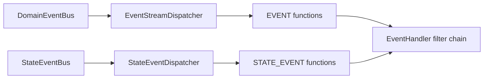

# 事件总线

Wow 使用两条事件通道承载不同消息：

| 通道 | 消息 | 典型消费者 |
| --- | --- | --- |
| `DomainEventBus` | `DomainEventStream`：一次命令产生的事件批次 | EventProcessor、Projection、Stateless Saga |
| `StateEventBus` | `StateEvent`：事件流加上溯源后的状态 | Snapshot 与需要当前状态的处理器 |

两者都实现 `MessageBus`，但 topic kind、序列化格式、订阅和恢复策略相互独立。不要因为 DomainEventBus 已配置，就假定 StateEventBus 或 Snapshot 链路也已配置。

## 公共传输契约

```kotlin
interface MessageBus<M, E> : AutoCloseable {
    fun send(message: M): Mono<Void>
    fun receive(subscription: MessageSubscription): Flux<E>
    fun receiver(subscription: MessageSubscription): MessageReceiver<E>
    fun runtimeReceiver(subscription: MessageSubscription): MessageReceiver<E>
}
```

`send` 完成的含义由实现决定：内存 Sink 接受、Kafka producer 发送、Redis 写入等不是同一确认级别。公共接口不承诺持久化、exactly-once 或处理器完成；应用必须按所选 Adapter 的合同解释发送结果。

`runtimeReceiver` 额外提供 readiness、开放处理和关闭处理边界，让分发器参与 `WowRuntime` 的启动屏障与活动准入。普通自定义消费者若不实现相同协议，应使用 `receiver`。

## Local、Distributed 与 Local-first

### In-memory

`InMemoryDomainEventBus` 与 `InMemoryStateEventBus` 为每个命名聚合维护 Reactor multicast Sink。它们适合单进程验证，不持久化消息；没有订阅者时普通 `send` 会完成并丢弃消息。

### Distributed

`DistributedDomainEventBus` 与 `DistributedStateEventBus` 只是跨进程 Adapter 的类型边界。Kafka、Redis 等实现的分区、确认、重投与保留语义由对应扩展页和后端配置定义。

### Local-first

Local-first 先尝试把一份消息副本投递给本进程可路由的 runtime receiver，再发送另一份副本到 distributed bus。distributed 消息只有在所有目标本地 receiver 已取得 Runtime activity 并确认准入后，才被标记为 locally handled；否则仍可由 distributed 路径处理。

这个回执只证明**准入**，不证明 handler 成功。准入后的 terminal pipeline failure 会走 Runtime 故障路径，不会把同一消息事后重新路由到 distributed bus。普通 sink subscriber count 也不是回执。

## 事件分发


```mermaid
flowchart LR
    Bus[DomainEventBus] --> Stream[EventStreamDispatcher]
    StateBus[StateEventBus] --> State[StateEventDispatcher]
    Stream --> Functions[EVENT functions]
    State --> StateFunctions[STATE_EVENT functions]
    Functions --> Handler[EventHandler filter chain]
    StateFunctions --> Handler
```

`CompositeEventDispatcher` 拥有两个子分发器，并共享一个 `AggregateSchedulerSupplier`：

- EventStreamDispatcher 只选择 `FunctionKind.EVENT`；
- StateEventDispatcher 只选择 `FunctionKind.STATE_EVENT`；
- 一个事件流中的事件由 `concatMap` 顺序处理；
- 同一事件匹配到的多个函数由 `flatMap` 执行，不能推断函数间顺序。

处理器选择还会应用聚合、事件类型和补偿匹配规则。没有匹配函数时，该事件被忽略，不代表数据从 EventStore 删除。

## 顺序与并发

默认 `AggregateDispatcher` 使用 `aggregateId.id` 的哈希计算 group key，同一 key 的 exchange 在同一个 group 中串行处理，不同 group 可以并发。Scheduler 按命名聚合缓存，而不是每个聚合实例独占线程。

可以依赖的范围必须同时满足：同一分发器实例、相同 group key、上游按预期顺序发出。不能从核心调度推断：

- 跨分发器或跨进程的全局顺序；
- 不同处理器函数之间的执行顺序；
- Broker 重投后只处理一次；
- 外部系统按聚合版本提交。

需要顺序敏感的外部写入时，持久化来源聚合 ID/版本，并在目标端检测重复与缺口。调度实现详见[聚合调度器](./aggregate-scheduler.md)。

## 确认、错误与恢复

一个 EventStream exchange 在流内事件处理链终止后执行 `finallyAck`。具体 ack 对应内存票据、Kafka offset 或其他后端动作，仍由 Adapter 实现。Handler 抛错发生在源事件已经持久化之后，不能回滚 EventStore。

| 责任 | 所有者 |
| --- | --- |
| 短暂执行重试 | handler filter 与其配置 |
| 持久失败记录/人工恢复 | 补偿模块 |
| 外部副作用去重 | 应用与目标系统 |
| Broker offset、pending、retention | Bus Adapter 与平台 |
| 历史事件重放 | EventStore 与应用恢复流程 |

不要把 Bus 的重投替代应用幂等。精确处理器模式见[事件处理器](../event-processor.md)，持久恢复见[事件补偿](../event-compensation.md)。

## 生命周期

分发器在 `prepare` 阶段订阅消息源并等待 transport readiness，在 `start` 阶段开放 demand/processing。停机时先撤销逻辑 processing admission，再取消物理 source；已取得 activity 的 exchange 由 Runtime 计入排空。

`CompositeEventDispatcher` 最后释放自己拥有的 Scheduler；子分发器只借用它，避免重复关闭。详见[运行时生命周期](./runtime-lifecycle.md)。

## 验证与源码

```bash
./gradlew :wow-core:contractTest --tests "me.ahoo.wow.event.InMemoryDomainEventBusTest"
./gradlew :wow-core:test --tests "me.ahoo.wow.event.dispatcher.CompositeEventDispatcherLifecycleTest"
```

- [`DomainEventBus`](https://github.com/Ahoo-Wang/Wow/blob/main/wow-core/src/main/kotlin/me/ahoo/wow/event/DomainEventBus.kt)
- [`StateEventBus`](https://github.com/Ahoo-Wang/Wow/blob/main/wow-core/src/main/kotlin/me/ahoo/wow/eventsourcing/state/StateEventBus.kt)
- [`LocalFirstMessageBus`](https://github.com/Ahoo-Wang/Wow/blob/main/wow-core/src/main/kotlin/me/ahoo/wow/messaging/LocalFirstMessageBus.kt)
- [`CompositeEventDispatcher`](https://github.com/Ahoo-Wang/Wow/blob/main/wow-core/src/main/kotlin/me/ahoo/wow/event/dispatcher/CompositeEventDispatcher.kt)
- [Kafka 扩展](../extensions/kafka.md) / [Redis 扩展](../extensions/redis.md)：具体 transport 合同
