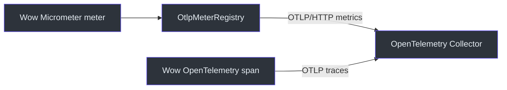

# 指标

Wow 框架为核心响应式组件集成了 Reactor 与 Micrometer 指标。

## 安装

::: code-group
```kotlin [Gradle(Kotlin)]
implementation("io.micrometer:micrometer-core")
```
```groovy [Gradle(Groovy)]
implementation 'io.micrometer:micrometer-core'
```
```xml [Maven]
<dependency>
    <groupId>io.micrometer</groupId>
    <artifactId>micrometer-core</artifactId>
</dependency>
```
:::

## 自动指标收集

Wow 框架自动为以下组件收集指标：

以下名称是 Reactor Publisher 的基础名称。Reactor 会根据 Publisher 类型生成 `<base>.subscribed`、
`<base>.requested`、`<base>.onNext.delay`、`<base>.flow.duration` 等 meter。

### 命令指标

- `wow.command.send`
- `wow.command.receive`
- `wow.command.handle`

### 事件总线指标

- `wow.event.send`
- `wow.event.receive`
- `wow.event.handle`
- `wow.state.send`
- `wow.state.receive`

### 事件存储指标

- `wow.eventstore.append`: 事件追加计数和延迟
- `wow.eventstore.load`: 事件加载计数和延迟
- `wow.eventstore.last`
- `wow.eventstore.exists.request.id`
- `wow.eventstore.scanAggregateId`

### 快照指标

- `wow.snapshot.save`: 快照保存计数和延迟
- `wow.snapshot.load`: 快照加载计数和延迟
- `wow.snapshot.getVersion`
- `wow.snapshot.event`
- `wow.snapshot.handle`

### 处理器指标

- `wow.projection.handle`
- `wow.saga.handle`
- `wow.dispatcher`

### 存储批处理指标

| Meter | 类型 | 主要标签 | 含义 |
|-------|------|----------|------|
| `wow.batch.admission.rejected` | Counter | `coordinator`、`reason` | 请求进入批处理 lane 前被拒绝 |
| `wow.batch.queue.wait` | Timer | `coordinator`、`lane` | 请求在批处理 lane 中的等待时间 |
| `wow.batch.write` | Timer | `coordinator`、`lane`、`window`、`outcome` | 存储批写耗时与结果 |
| `wow.batch.write.items` | Distribution summary | `coordinator`、`lane`、`window`、`outcome`、`kind` | buffered、written 与 failed item 数量 |
| `wow.batch.coordinator.failed` | Counter | `coordinator` | Coordinator 终止性失败次数 |
| `wow.batch.close` | Timer | `coordinator`、`outcome` | Coordinator 关闭耗时与结果 |

只有启用 batching 的存储路径执行相应操作后，才会产生批处理 meter。它们与其他 Wow meter
一样注册到 Micrometer，具体导出格式和目标由应用配置的 Registry 决定。

## 指标标签

标签随操作类型而变化。Wow 定义的标签包括：

- `source`: 被装饰组件的原始类型
- `aggregate`: 聚合名称；receive Publisher 使用规范排序后的聚合名称列表
- `command`: 命令发送与处理 Publisher 的命令名称
- `event`: 事件处理器的事件名称
- `processor`: 处理器名称
- `subscriber`: receive Publisher 的订阅者标识；Reactor Context 值优先于 subscription receiver group
- `dispatcher`: Dispatcher 名称

Reactor 会根据生成的 meter 添加 `type`、`status`、`exception` 等标签。内部 dispatcher 路由 key 会放大时序基数，因此不会作为标签导出。当前尚未生成限界上下文标签。

### 存储路由指标归属

启用聚合级存储路由时，EventStore 与 SnapshotStore 指标只由最终选中的物理 leaf backend 记录。`RoutingEventStore` 和 `RoutingSnapshotStore` 对指标透明，因此一次存储操作只产生一组 meter，`source` 标签标识 `MongoEventStore`、`RedisEventStore` 等实际后端。

原先筛选 `source=RoutingEventStore` 或 `source=RoutingSnapshotStore` 的仪表盘需要切换到实际后端 source。跨 `source` 聚合的查询不再重复统计路由操作。

## 自定义指标

### 手动指标收集

```kotlin
import io.micrometer.core.instrument.MeterRegistry
import io.micrometer.core.instrument.Timer

@Service
class OrderService(
    private val meterRegistry: MeterRegistry,
    private val commandGateway: CommandGateway
) {

    private val orderCreationTimer = Timer.builder("wow.business.order.creation")
        .description("Order creation duration")
        .register(meterRegistry)

    fun createOrder(request: CreateOrderRequest): Mono<OrderSummary> {
        return Mono.fromCallable {
            Timer.Sample.start(meterRegistry)
        }.flatMap { sample ->
            commandGateway.sendAndWait(createOrderCommand, CommandWait.processed(createOrderCommand.commandId))
                .doOnSuccess { result ->
                    sample.stop(orderCreationTimer)
                    // 业务成功指标
                    meterRegistry.counter("wow.business.order.created").increment()
                }
                .doOnError { error ->
                    sample.stop(orderCreationTimer)
                    // 业务失败指标
                    meterRegistry.counter("wow.business.order.failed").increment()
                }
        }
    }
}
```

### 反应式流指标

```kotlin
fun <T> Flux<T>.tagMetrics(operation: String): Flux<T> {
    return this.name(operation)
        .metrics()
}

fun <T> Mono<T>.tagMetrics(operation: String): Mono<T> {
    return this.name(operation)
        .metrics()
}
```

## 配置

### Micrometer 配置

```yaml
management:
  metrics:
    export:
      prometheus:
        enabled: true
    tags:
      application: ${spring.application.name}
```

### Wow 指标配置

Wow 框架的指标收集默认启用，可以通过以下方式控制：

```yaml
wow:
  metrics:
    enabled: true  # 默认启用
```

Wow 当前的 Reactor 装饰器写入 Micrometer global registry。请保持 Spring Boot 的 global-registry bridge 开启，使应用 MeterRegistry 能接收这些指标。显式注入应用 Registry 将在后续 Metrics 集成重构中完成。

### 通过 OTLP 接入 OpenTelemetry Collector

指标和链路追踪使用不同的埋点链路：Wow 指标是 Micrometer meter，`wow-opentelemetry` 创建
OpenTelemetry span；两者仍可发送到同一个 Collector。


<!-- Sources: wow-core/src/main/kotlin/me/ahoo/wow/metrics/Metrics.kt, wow-core/src/main/kotlin/me/ahoo/wow/infra/batch/BatchMetrics.kt, wow-opentelemetry/build.gradle.kts -->

在应用运行时依赖中加入 `io.micrometer:micrometer-registry-otlp`，配置
`management.otlp.metrics.export.url`，并保持 `management.metrics.use-global-registry=true`。
完整依赖、配置和验证示例参见
[可观测性配置](/zh/reference/config/observability)。

## 监控仪表板

### Prometheus + Grafana

使用 Prometheus 收集指标，Grafana 创建仪表板：

```yaml
# Prometheus 配置
scrape_configs:
  - job_name: 'wow-application'
    static_configs:
      - targets: ['localhost:8080']
    metrics_path: '/actuator/prometheus'
```

### 常用查询

Exporter 的命名方式取决于具体 Registry。请先检查 `/actuator/metrics` 或目标 Registry，再基于 `flow.duration`、`onNext.delay` 等 Reactor 后缀构建查询。

## 性能影响

- **轻量级**: 指标收集使用高效的计数器和直方图
- **异步**: 不会阻塞业务逻辑执行
- **可配置**: 可以根据需要启用或禁用特定指标

## 最佳实践

1. **选择合适的指标**: 只收集真正需要的指标
2. **设置合理的标签**: 避免标签数量过多导致的性能问题
3. **监控告警**: 为关键业务指标设置告警阈值
4. **定期审查**: 定期审查和清理不再需要的指标

## 故障排除

### 指标不显示

检查：
1. Micrometer 依赖是否正确添加
2. MeterRegistry Bean 是否正确配置并连接到 Micrometer global registry
3. `/actuator/metrics` 端点是否可访问

### 性能问题

如果指标收集影响性能：
1. 减少收集的指标数量
2. 使用采样率而不是全量收集
3. 考虑异步指标收集
