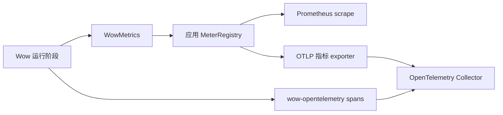

# 指标

Wow 使用 Micrometer 记录框架工作。`WowMetrics` 具有实例作用域：一个实例只写入一个
`MeterRegistry`；`WowMetrics.NONE` 则原样返回 Reactor publisher。因此，指标只证明某条运行时路径被
观测到，不证明事件已持久化、投影已追平或生产流量已获准进入。

## 自动接入

使用 `wow-spring-boot-starter` 时，为应用提供一个 `MeterRegistry`：

```kotlin
implementation("org.springframework.boot:spring-boot-starter-actuator")
runtimeOnly("io.micrometer:micrometer-registry-prometheus")
```

`wow.metrics.enabled` 默认是 `true`。自动配置从当前 ApplicationContext 的 Registry 创建
`WowMetrics`，装饰消息总线、物理存储、快照策略与处理器，并把同一实例提供给 dispatcher 和 batch
instrumentation。属性为 `false` 时，最高优先级
的启用处理器也会把自定义 `WowMetrics` Bean 替换为 `WowMetrics.NONE`；没有 Registry 时默认 Bean 同样
为 `NONE`。

路由存储本身不重复计数。系统装饰最终选中的 `EventStoreBinding` 或 `SnapshotStoreBinding`，让一次物理
调用只产生一次指标；已包含 `Metered` 的装饰链不会再次包装。

## 统一指标模型

五个 meter ID 分别描述有限操作与长生命周期 receive 流：

| Meter | 类型 | 运行时含义 |
|---|---|---|
| `wow.operation` | Timer | 有限 `Mono` 或 `Flux` 从订阅到终止的时间 |
| `wow.operation.items` | DistributionSummary | 有限 `Flux` 发出的元素数 |
| `wow.stream.active` | LongTaskTimer | 当前活跃的长生命周期 receiver 订阅 |
| `wow.stream.messages` | Counter | receiver 订阅发出的消息数 |
| `wow.stream.terminations` | Counter | receiver 完成、错误或取消次数 |

五组指标统一使用低基数标签 `component`、`operation`、`context`、`aggregate`、`message`、`processor`、
`source` 与 `subscriber`。终止指标再增加 `outcome=success|error|cancelled` 和 `exception`；缺失值为
`none`，多聚合订阅的 aggregate 为 `multiple`。Aggregate ID、request ID、trace ID 属于高基数日志或
追踪字段，不进入指标标签。

可以把这些标签直接读成运行管线：

| 运行阶段 | `component` / 代表性 `operation` | 信号能证明什么 |
|---|---|---|
| 命令接收与发布 | `command_bus` / `receive`、`send`、`send_if_subscribed` | 总线 publisher 以记录的结果终止 |
| 聚合执行 | `command_handler` / `handle` | 命令处理 publisher 已终止 |
| 事件持久化 | `event_store` / `append`、`load_by_version`、`load_by_time`、`last` | 选中存储的调用已终止；耐久性仍以 backend acknowledgement 为准 |
| 事件发布与接收 | `domain_event_bus`、`state_event_bus` / `send`、`receive` | 消息总线边界已执行 |
| 下游处理 | `domain_event_handler`、`projection_handler`、`stateless_saga_handler`、`snapshot_handler` / `handle` | 对应 handler publisher 已终止，不代表所有订阅者都追平 |
| 快照工作 | `snapshot_strategy` / `on_event`；`snapshot_store` / `load`、`get_version`、`save` | 策略或物理快照存储操作已终止 |

排障时可用 context、aggregate、message、processor 等稳定字段把指标窗口与 Wow trace 对齐；指标标签
本身不会携带 trace ID。

## 存储批处理指标

启用批处理的 MongoDB 与 Elasticsearch 存储复用同一个 `WowMetrics` Registry：

| Meter | 类型 | 标签 |
|---|---|---|
| `wow.batch.admission.rejected` | Counter | `coordinator`、`reason` |
| `wow.batch.queue.wait` | Timer | `coordinator`、`lane` |
| `wow.batch.write` | Timer | `coordinator`、`lane`、`window`、`outcome` |
| `wow.batch.write.items` | DistributionSummary | write 标签加 `kind=buffered|written|failed` |
| `wow.batch.coordinator.failed` | Counter | `coordinator` |
| `wow.batch.close` | Timer | `coordinator`、`outcome` |

只有对应批处理路径实际运行后才会出现这些序列。admission rejection 或 failed item 是操作信号；重试前
还要核对调用方错误与 backend 状态，避免重复写入。

## 非 Spring 接入

先建立一个明确的 Registry 边界，再只装饰该运行时实际拥有的组件：

```kotlin
val metrics = WowMetrics(SimpleMeterRegistry())

val meteredBus = commandBus.metered(metrics, "command-bus")
val meteredStore = eventStore.metered(metrics, "primary-event-store")
val meteredHandler = commandHandler.metered(metrics, "command-handler")
```

自定义有限操作和长生命周期流也使用同一 descriptor 契约：

```kotlin
val descriptor = MetricDescriptor(
    component = "partner_client",
    operation = "pull",
    source = "inventory-api",
)

val response = metrics.operation(client.pull(), descriptor)
val messages = metrics.stream(receiver.messages(), descriptor)
```

这些 API 使用 Reactor `tap`，不会阻塞，也不会配置全局 Micrometer Registry。

## 从旧指标 API 迁移

统一模型要求迁移仪表盘，而不是简单改 meter 名称：

| 旧契约 | 当前契约 |
|---|---|
| `Metrics.metrizable()` / `.metrizable()` | 共享 `WowMetrics(registry)`，再调用 `.metered(metrics, source)` |
| 进程级/全局启用状态 | Spring 使用 `wow.metrics.enabled`；非 Spring 显式选择 `WowMetrics` 或 `WowMetrics.NONE` |
| Micrometer global registry | 应用或运行时自有的 `MeterRegistry` |
| Reactor sequence 序列 | 有限工作查询 `wow.operation*`，receiver 查询 `wow.stream.*` |

发布窗口内并行运行新旧仪表盘，证明流量覆盖等价后再删除旧告警。本地 scrape 成功只验证名称与标签，
不能证明生产阈值、告警路由或值班响应已经准入。

## 导出到 Prometheus 或 OTLP

Wow 只写应用 Registry，导出由 Registry 负责：



Prometheus 会按自身约定转换 Micrometer 点分 ID，例如把 `wow.operation` 导出为
`wow_operation_seconds_count` 等序列。OTLP 使用 Micrometer OTLP Registry；`wow-opentelemetry` 只创建
trace，不负责导出 Micrometer 指标。精确依赖与环境变量参见
[可观测性配置](/zh/reference/config/observability)。

## 排查

按以下顺序补齐缺失证据：

1. 确认 `wow.metrics.enabled` 不是 `false`，目标 ApplicationContext 中存在预期 `MeterRegistry`；
2. 驱动准确的运行阶段，再查看 `/actuator/metrics/wow.operation` 或对应 `wow.batch.*` ID；
3. 检查 `component`、`operation`、`source`、`outcome`、`exception`，不要查找 aggregate ID；
4. Prometheus 需要验证 scrape 成功及实际导出的序列名；
5. OTLP 至少等待一个 export step，并确认 Collector 已收到；
6. backend 状态、投影延迟、告警投递和生产准入必须另行验证。

<!-- Sources: wow-core/src/main/kotlin/me/ahoo/wow/metrics/WowMetrics.kt, MetricDescriptor.kt,
MetricDecoratorFactory.kt, wow-core/src/main/kotlin/me/ahoo/wow/infra/batch/BatchMetrics.kt,
wow-spring-boot-starter/src/main/kotlin/me/ahoo/wow/spring/boot/starter/metrics/ -->
