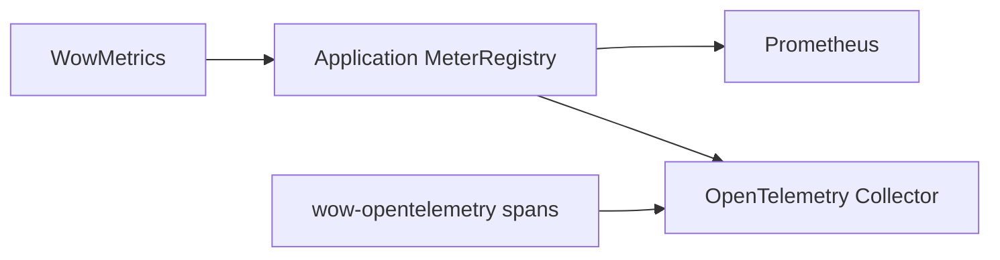

# 指标

Wow 使用 Micrometer 记录框架语义指标。每个 `WowMetrics` 实例只绑定一个
`MeterRegistry`；Spring Boot 自动使用当前 ApplicationContext 中的 Registry，
不依赖 Micrometer global registry，也不会在多个 ApplicationContext 之间共享启用状态。

## 自动接入

使用 `wow-spring-boot-starter` 时，应用只需提供 `MeterRegistry` Bean。最常见的方式是加入
Actuator 和一个 Registry 实现：

```kotlin
implementation("org.springframework.boot:spring-boot-starter-actuator")
runtimeOnly("io.micrometer:micrometer-registry-prometheus") // 或 micrometer-registry-otlp
```

指标默认启用，不需要额外配置 Wow；`wow.metrics.enabled` 的默认值是 `true`。使用 OTLP Registry
时，默认导出路径只需设置 `OTEL_SERVICE_NAME` 和 `OTEL_EXPORTER_OTLP_ENDPOINT`。

如果 `wow.metrics.enabled=false`，或者上下文中没有 `MeterRegistry`，Wow 使用
`WowMetrics.NONE`，响应式链保持无指标的紧凑路径。

## 统一指标模型

| Meter | 类型 | 含义 |
|---|---|---|
| `wow.operation` | Timer | 有限操作的耗时、结果和异常 |
| `wow.operation.items` | DistributionSummary | Flux 有限操作产生的元素数 |
| `wow.stream.active` | LongTaskTimer | 长生命周期 receive 流的活跃订阅 |
| `wow.stream.messages` | Counter | receive 流收到的消息数 |
| `wow.stream.terminations` | Counter | receive 流的完成、错误或取消次数 |

所有语义 meter 使用相同的低基数基础标签：

| 标签 | 含义 |
|---|---|
| `component` | `command_bus`、`event_store`、`projection_handler` 等稳定组件类型 |
| `operation` | `send`、`receive`、`append`、`handle` 等稳定操作 |
| `context` | 限界上下文；无法确定时为 `none` |
| `aggregate` | 聚合名称；订阅多个聚合时统一为 `multiple` |
| `message` | 命令或事件名称；不适用时为 `none` |
| `processor` | 事件处理器或 dispatcher 名称 |
| `source` | Spring Bean 名称、存储 binding 名称或手动指定的来源 |
| `subscriber` | receiver group；Reactor Context 中的 dispatcher 名称优先 |

终止指标额外包含 `outcome=success|error|cancelled` 和 `exception`。Wow 不导出
aggregate ID、dispatcher group key 等高基数字段。

主要组件和操作如下：

| `component` | `operation` |
|---|---|
| `command_bus`、`domain_event_bus`、`state_event_bus` | `send`、`send_if_subscribed`、`receive` |
| `event_store` | `append`、`load_by_version`、`load_by_time`、`exists_request_id`、`last`、`scan_aggregate_id` |
| `snapshot_store` | `load`、`get_version`、`save` |
| `command_handler`、`domain_event_handler`、`projection_handler`、`stateless_saga_handler`、`snapshot_handler` | `handle` |
| `snapshot_strategy` | `on_event` |
| `dispatcher` | `handle` |

`RoutingEventStore` 和 `RoutingSnapshotStore` 对指标透明；只有最终物理 leaf store 记录操作，
避免同一次路由调用被重复计数。

## 存储批处理指标

MongoDB 和 Elasticsearch 的 batching 路径复用同一个 `WowMetrics` Registry：

| Meter | 类型 | 主要标签 |
|---|---|---|
| `wow.batch.admission.rejected` | Counter | `coordinator`、`reason` |
| `wow.batch.queue.wait` | Timer | `coordinator`、`lane` |
| `wow.batch.write` | Timer | `coordinator`、`lane`、`window`、`outcome` |
| `wow.batch.write.items` | DistributionSummary | `coordinator`、`lane`、`window`、`outcome`、`kind` |
| `wow.batch.coordinator.failed` | Counter | `coordinator` |
| `wow.batch.close` | Timer | `coordinator`、`outcome` |

只有启用 batching 并执行相应操作后，相关 meter 才会出现。

## 非 Spring 接入

`wow-core` 直接公开 Micrometer 契约。手动创建一个实例，并用它分别装饰需要记录语义组件指标的
总线、存储和处理器。构造函数中的 `metrics` 参数只为该组件自身负责的行为插桩，不会递归装饰
它依赖的其他组件：

```kotlin
val registry: MeterRegistry = SimpleMeterRegistry()
val metrics = WowMetrics(registry)

val meteredCommandBus = commandBus.metered(
    metrics = metrics,
    source = "command-bus",
)
val meteredCommandHandler = commandHandler.metered(
    metrics = metrics,
    source = "command-handler",
)

val eventStore: EventStore = MongoEventStore(
    database = database,
    batchOptions = MongoEventStoreBatchOptions(enabled = true),
    metrics = metrics, // 批处理生命周期指标。
).metered(
    metrics = metrics, // EventStore 操作指标。
    source = "primary-event-store",
)

val dispatcher = CommandDispatcher(
    commandBus = meteredCommandBus,
    commandHandler = meteredCommandHandler,
    metrics = metrics,
)
```

`MongoEventStore` 构造函数接收的 `WowMetrics` 用于内部批处理生命周期；`metered` 装饰器记录
上文列出的 `EventStore` 操作。两层传入同一个实例，可以让所有 meter 写入同一 Registry，
同时不会重复计算同一次操作。

有限操作和长生命周期流也可以直接复用统一模型：

```kotlin
val descriptor = MetricDescriptor(
    component = "integration",
    operation = "pull",
    source = "partner-api",
)

val result = metrics.operation(client.pull(), descriptor)
val messages = metrics.stream(receiver.messages(), descriptor)
```

这些 API 基于 Reactor `tap(SignalListenerFactory)`，没有使用已弃用的
`Mono.metrics()` / `Flux.metrics()`。

## 从旧指标 API 迁移

统一指标模型不提供旧 API 或旧 meter 名称的兼容层。升级时按下表迁移：

| 旧方式 | 新方式 |
|---|---|
| `Metrics.metrizable()` 或 `.metrizable()` | 创建共享 `WowMetrics(registry)`，再调用 `.metered(metrics, source)` |
| `Metrics.configureEnabled(...)` 或非 Spring 系统属性开关 | Spring 使用 `wow.metrics.enabled`；非 Spring 显式选择 `WowMetrics(registry)` 或 `WowMetrics.NONE` |
| Micrometer global registry | 为每个应用或运行时显式传入 `MeterRegistry` |
| Reactor sequence meter，例如 `*.flow.duration`、`*.onNext.delay` | 有限操作查询 `wow.operation` / `wow.operation.items`；长生命周期 receive 流查询 `wow.stream.*` |

旧 meter 与新语义指标不是简单重命名关系。Dashboard、Recording Rule 和告警应以
`component`、`operation`、`outcome` 等标签重写查询；完成切换前保留旧版本应用作为回滚路径。

## 导出到 Prometheus 或 OTLP

Wow 只向当前应用的 `MeterRegistry` 写入 meter；导出目标由 Registry 决定：



通过 OTLP 导出时加入 `micrometer-registry-otlp`，再设置 `OTEL_SERVICE_NAME` 和统一的
`OTEL_EXPORTER_OTLP_ENDPOINT`；通常指向 Collector 的 OTLP/HTTP `4318` 端口。Spring Boot 会把
该端点映射到 `OtlpMeterRegistry`，无需手动创建 Registry Bean 或配置 Metrics YAML。
`wow-opentelemetry` 负责 tracing，不会把 Micrometer meter 转换为 span，但 metrics 与 traces
可以复用相同的环境变量和 Collector。

完整配置和验证步骤参见[可观测性配置](/zh/reference/config/observability)。

## 排查

指标不可见时依次确认：

1. `wow.metrics.enabled` 未被关闭；
2. ApplicationContext 中存在期望的 `MeterRegistry` Bean；
3. 产生过对应组件的真实流量；
4. 已临时暴露 Actuator `metrics` endpoint，且
   `/actuator/metrics/wow.operation` 可见；
5. 对于批处理指标，存储已启用 batching；
6. 对于 OTLP，等待一个 export `step` 后确认 Collector 实际收到数据。

<!-- Sources: wow-core/src/main/kotlin/me/ahoo/wow/metrics/WowMetrics.kt, wow-core/src/main/kotlin/me/ahoo/wow/metrics/MetricDescriptor.kt, wow-core/src/main/kotlin/me/ahoo/wow/infra/batch/BatchMetrics.kt, wow-spring-boot-starter/src/main/kotlin/me/ahoo/wow/spring/boot/starter/metrics/MetricsAutoConfiguration.kt -->
