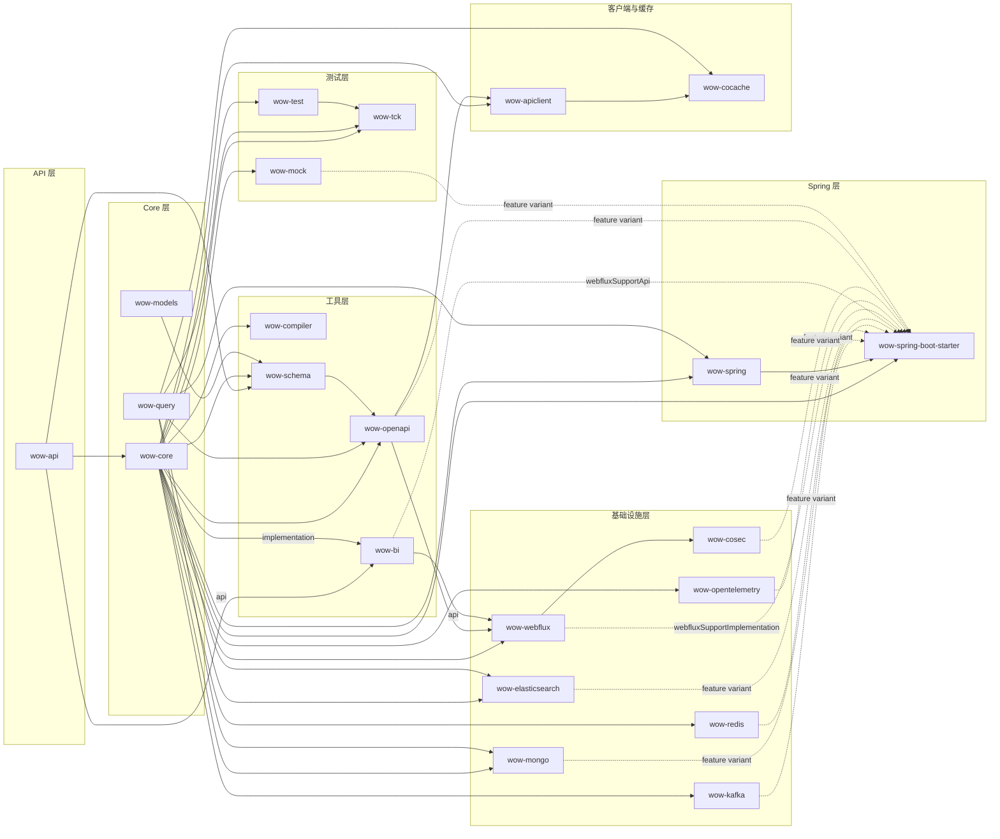
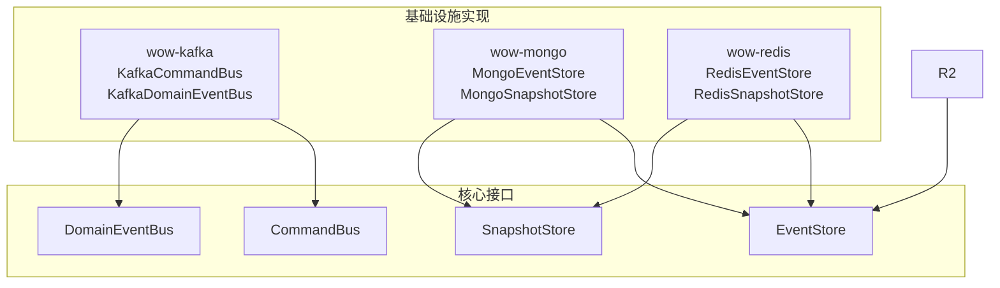
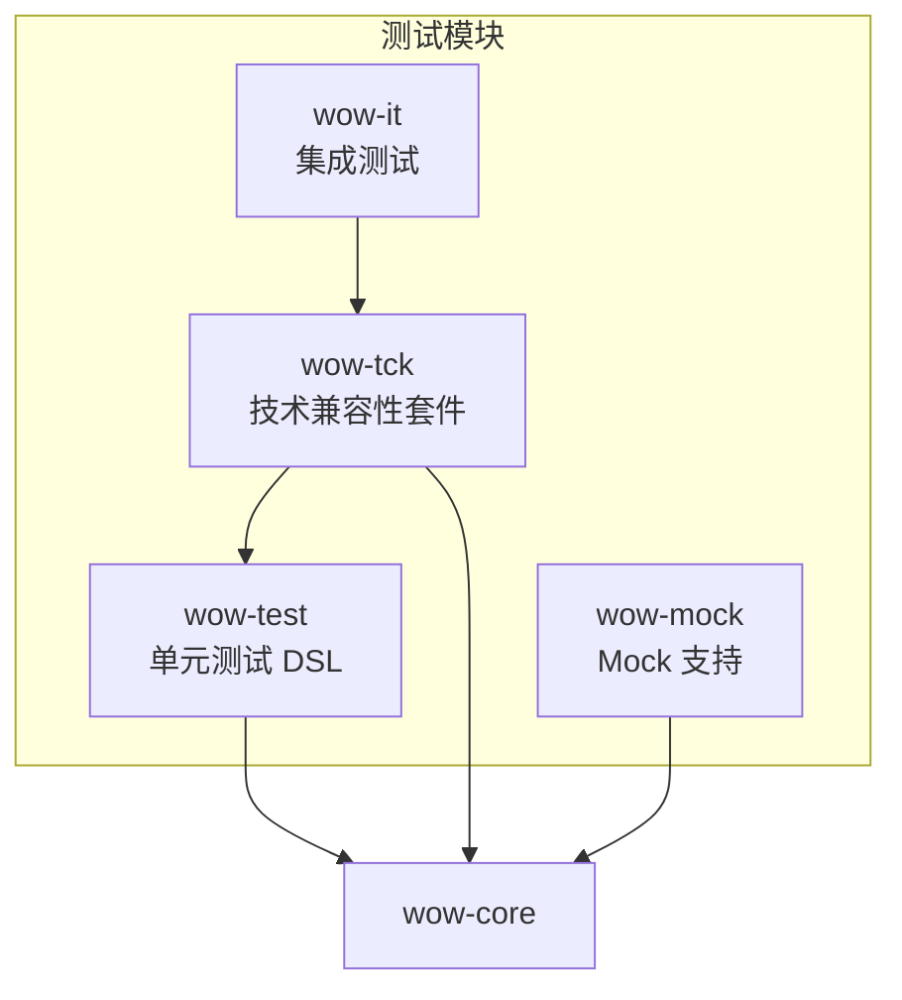

# 模块依赖

Wow 框架由 20 多个 Gradle 模块组成，每个模块都有单一且定义明确的职责。本页映射了每个模块、其依赖以及它们之间的关系。

## 模块概览表

| 模块 | 层级 | 说明 |
|--------|-------|-------------|
| `wow-api` | API | 纯契约：`CommandMessage`、`DomainEvent`、`AggregateId`、命名类型。零依赖。 |
| `wow-core` | Core | 框架引擎：聚合根、命令总线、Event Sourcing、投影、Saga、等待计划。 |
| `wow-spring` | Spring | Spring `ApplicationContext` 桥接、Bean 注册。 |
| `wow-spring-boot-starter` | Spring | 带 Gradle Feature Variants 的自动配置，支持可选基础设施。 |
| `wow-kafka` | Infra | 通过 Apache Kafka 实现分布式 `CommandBus` 和 `DomainEventBus`。 |
| `wow-mongo` | Infra | 通过 MongoDB 实现 `EventStore`、`SnapshotStore` 和投影存储。 |
| `wow-redis` | Infra | 通过 Redis / Lettuce 实现 `EventStore` 和 `SnapshotStore`。 |
| `wow-elasticsearch` | Infra | 通过 Elasticsearch 实现投影索引。 |
| `wow-webflux` | Infra | Spring WebFlux 命令端点集成。 |
| `wow-opentelemetry` | Infra | 通过 OpenTelemetry 实现分布式链路追踪和指标。 |
| `wow-cosec` | Infra | 通过 CoSec 实现 ABAC 授权。 |
| `wow-compiler` | Tooling | KSP 处理器 — 在编译时生成命令路由、事件处理元数据和 OpenAPI 规范。 |
| `wow-test` | Testing | 单元测试 DSL：`AggregateSpec`、`SagaSpec`，Given-When-Expect 模式。 |
| `wow-tck` | Testing | 技术兼容性套件 — 使用 Testcontainers 的集成测试。 |
| `wow-mock` | Testing | Mock 支持模块。 |
| `wow-query` | Query | 查询模型支持类型和接口。 |
| `wow-schema` | Tooling | 从 Wow 命令/事件模型生成 JSON Schema。 |
| `wow-openapi` | Tooling | OpenAPI 规范生成。 |
| `wow-bi` | Tooling | BI 同步脚本生成器。 |
| `wow-models` | Domain | 共享领域模型抽象。 |
| `wow-cocache` | Caching | 基于 CoCache 的投影缓存。 |
| `wow-apiclient` | Client | 使用 CoApi 的 RESTful API 客户端。 |

## 依赖图

下图展示了模块之间的主要依赖关系。箭头从依赖提供方向使用方，便于直接看到 API 暴露与 Feature Variant 边界。



<!-- Sources:
  settings.gradle.kts (all module includes)
  wow-api/build.gradle.kts
  wow-core/build.gradle.kts
  wow-spring/build.gradle.kts
  wow-spring-boot-starter/build.gradle.kts
  wow-kafka/build.gradle.kts
  wow-mongo/build.gradle.kts
  wow-redis/build.gradle.kts
  wow-elasticsearch/build.gradle.kts
  wow-webflux/build.gradle.kts
  wow-opentelemetry/build.gradle.kts
  wow-cosec/build.gradle.kts
  wow-compiler/build.gradle.kts
  wow-schema/build.gradle.kts
  wow-openapi/build.gradle.kts
  wow-bi/build.gradle.kts
  wow-cocache/build.gradle.kts
  wow-apiclient/build.gradle.kts
  wow-query/build.gradle.kts
  test/wow-test/build.gradle.kts
  test/wow-tck/build.gradle.kts
  test/wow-mock/build.gradle.kts
  wow-models/build.gradle.kts
-->

## 模块详情

### API 层

#### wow-api

基础模块，除了可选注解外**零外部依赖**。它定义了整个框架使用的所有契约。

```kotlin
// wow-api/build.gradle.kts
dependencies {
    compileOnly("com.fasterxml.jackson.core:jackson-annotations")
    compileOnly("io.swagger.core.v3:swagger-annotations-jakarta")
    compileOnly("org.springframework:spring-context")
}
```

[[wow-api/build.gradle.kts](https://github.com/Ahoo-Wang/Wow/blob/main/wow-api/build.gradle.kts)]

核心类型：`CommandMessage`、`DomainEvent`、`AggregateId`、`NamedAggregate`、`Wow`（命名空间常量）、`Header`、`Message`、`TopicKind`。

### Core 层

#### wow-core

框架的引擎室。依赖 `wow-api` 以及响应式基础设施。

```kotlin
dependencies {
    api(project(":wow-api"))
    api("io.projectreactor:reactor-core")
    api("tools.jackson.core:jackson-databind")
    api("jakarta.validation:jakarta.validation-api")
    // ... 更多
}
```

[[wow-core/build.gradle.kts](https://github.com/Ahoo-Wang/Wow/blob/main/wow-core/build.gradle.kts)]

包含：`CommandGateway`、`CommandBus`、`EventStore`、`DomainEventBus`、`StateAggregate`、`CommandAggregate`、`ProjectionHandler`、`StatelessSagaHandler`、`WaitPlan`、快照基础设施和过滤器链框架。

#### wow-query

查询模型支持类型和接口。依赖 `wow-core`。

[[wow-query/build.gradle.kts](https://github.com/Ahoo-Wang/Wow/blob/main/wow-query/build.gradle.kts)]

#### wow-models

共享领域模型抽象。使用 `wow-api` 和 `wow-compiler`（KSP）进行注解处理。

```kotlin
ksp(project(":wow-compiler"))
```

[[wow-models/build.gradle.kts](https://github.com/Ahoo-Wang/Wow/blob/main/wow-models/build.gradle.kts)]

### Spring 层

#### wow-spring

将 `wow-core` 桥接到 Spring 的 `ApplicationContext`。依赖 `wow-core` 和 `wow-query`。

[[wow-spring/build.gradle.kts](https://github.com/Ahoo-Wang/Wow/blob/main/wow-spring/build.gradle.kts)]

#### wow-spring-boot-starter

一站式自动配置模块。使用 **Gradle Feature Variants** 声明可选能力：

```kotlin
java {
    registerFeature("mongoSupport") { capability(group, "mongo-support", version) }
    registerFeature("redisSupport") { capability(group, "redis-support", version) }
    registerFeature("kafkaSupport") { capability(group, "kafka-support", version) }
    registerFeature("webfluxSupport") { capability(group, "webflux-support", version) }
    registerFeature("elasticsearchSupport") { capability(group, "elasticsearch-support", version) }
    registerFeature("opentelemetrySupport") { capability(group, "opentelemetry-support", version) }
    registerFeature("openapiSupport") { capability(group, "openapi-support", version) }
    registerFeature("cosecSupport") { capability(group, "cosec-support", version) }
}
```

[[wow-spring-boot-starter/build.gradle.kts:6](https://github.com/Ahoo-Wang/Wow/blob/main/wow-spring-boot-starter/build.gradle.kts#L6)]

Feature Variants 允许消费者只声明所需的基础设施：

```kotlin
// 消费者的 build.gradle.kts
implementation("me.ahoo.wow:wow-spring-boot-starter")
implementation("me.ahoo.wow:wow-spring-boot-starter") {
    capabilities { requireCapability("me.ahoo.wow:mongo-support") }
    capabilities { requireCapability("me.ahoo.wow:kafka-support") }
}
```

### 基础设施模块

每个基础设施模块提供一个或多个核心接口的具体实现：



<!-- Sources:
  wow-kafka/build.gradle.kts
  wow-mongo/build.gradle.kts
  wow-redis/build.gradle.kts
-->

| 模块 | 实现接口 | 外部依赖 |
|--------|-----------|-------------------|
| `wow-kafka` | `DistributedCommandBus`、`DistributedDomainEventBus` | `reactor-kafka` |
| `wow-mongo` | `EventStore`、`SnapshotStore` | `mongodb-driver-reactivestreams` |
| `wow-redis` | `EventStore`、`SnapshotStore` | `spring-data-redis`、`lettuce-core` |
| `wow-elasticsearch` | 投影存储 | `spring-data-elasticsearch` |
| `wow-webflux` | 命令端点 | `spring-webflux` |
| `wow-opentelemetry` | 链路追踪与指标 | `opentelemetry-instrumentation-api` |
| `wow-cosec` | 授权 | （依赖 wow-webflux） |

### 工具模块

#### wow-compiler

**KSP（Kotlin Symbol Processing）** 处理器，在编译时运行，生成：

- 命令路由元数据
- 事件处理函数注册
- OpenAPI 规范片段

```kotlin
dependencies {
    implementation(project(":wow-core"))
    implementation(libs.ksp.symbol.processing.api)
}
```

[[wow-compiler/build.gradle.kts](https://github.com/Ahoo-Wang/Wow/blob/main/wow-compiler/build.gradle.kts)]

领域项目通过在构建脚本中添加 `ksp(project(":wow-compiler"))` 来应用。

#### wow-schema

使用 `jsonschema-generator` 及 Jackson、Jakarta Validation 和 Swagger 模块从 Wow 命令/事件模型生成 JSON Schema。

[[wow-schema/build.gradle.kts](https://github.com/Ahoo-Wang/Wow/blob/main/wow-schema/build.gradle.kts)]

#### wow-openapi

从 Wow 领域模型生成 OpenAPI 规范。其 API 使用 `wow-core`、`wow-query` 和 `wow-schema`；模块不引用 `wow-bi`。

[[wow-openapi/build.gradle.kts](https://github.com/Ahoo-Wang/Wow/blob/main/wow-openapi/build.gradle.kts)]

#### wow-bi

BI 同步脚本生成器。由于 `BiScriptGenerator` 接收 `NamedAggregate`，该模块通过 API 暴露 `wow-api`，并以 implementation 方式使用 `wow-core` 的元数据与序列化能力。`wow-webflux` 通过 API 暴露 `wow-bi`，Starter 则只在 `webflux-support` Feature 中暴露它。

[[wow-bi/build.gradle.kts](https://github.com/Ahoo-Wang/Wow/blob/main/wow-bi/build.gradle.kts)]

### 测试模块



<!-- Sources:
  test/wow-test/build.gradle.kts
  test/wow-tck/build.gradle.kts
  test/wow-mock/build.gradle.kts
-->

| 模块 | 用途 | 关键依赖 |
|--------|---------|-----------------|
| `wow-test` | `AggregateSpec`/`AggregateVerifier`、`SagaSpec`/`SagaVerifier`、Given-When-Expect DSL | `wow-core`、`reactor-test`、`fluent-assert-core`、`hibernate-validator` |
| `wow-tck` | 使用 Testcontainers（Kafka、MongoDB、Elasticsearch）的集成测试 | `wow-test`、`wow-query`、Testcontainers |
| `wow-mock` | Mock 基础设施支持 | `wow-core` |
| `wow-it` | 端到端集成测试 | `wow-tck` |

### 客户端与缓存模块

#### wow-apiclient

基于 CoApi 构建的 RESTful API 客户端。从 OpenAPI 规范生成类型安全的客户端接口。

```kotlin
dependencies {
    api(project(":wow-core"))
    api(project(":wow-openapi"))
    api("io.projectreactor:reactor-core")
    implementation("me.ahoo.coapi:coapi-api")
}
```

[[wow-apiclient/build.gradle.kts](https://github.com/Ahoo-Wang/Wow/blob/main/wow-apiclient/build.gradle.kts)]

#### wow-cocache

基于 CoCache 的投影缓存层。依赖 `wow-apiclient` 和 `wow-query`。

[[wow-cocache/build.gradle.kts](https://github.com/Ahoo-Wang/Wow/blob/main/wow-cocache/build.gradle.kts)]

## Feature Variant 矩阵

`wow-spring-boot-starter` 模块声明以下可选 Feature Capabilities。每个 Feature 会拉入对应的基础设施模块：

| Feature Capability | 拉入的模块 | Spring Boot Starter |
|-------------------|-----------------|---------------------|
| `mongo-support` | `wow-mongo` | `spring-boot-starter-data-mongodb-reactive` |
| `redis-support` | `wow-redis` | `spring-boot-starter-data-redis-reactive` |
| `kafka-support` | `wow-kafka` | （通过 reactor-kafka） |
| `webflux-support` | `wow-bi`、`wow-webflux` | （通过 spring-webflux） |
| `elasticsearch-support` | `wow-elasticsearch` | `spring-boot-starter-data-elasticsearch` |
| `opentelemetry-support` | `wow-opentelemetry` | （通过 otel instrumentation） |
| `openapi-support` | `wow-openapi` | `springdoc-openapi-starter-common` |
| `cosec-support` | `wow-cosec` | （通过 wow-cosec） |
| `mock-support` | `wow-mock` | （仅用于测试） |

[[wow-spring-boot-starter/build.gradle.kts:6](https://github.com/Ahoo-Wang/Wow/blob/main/wow-spring-boot-starter/build.gradle.kts#L6)]

## 构建配置

所有模块都在根 [`settings.gradle.kts`](https://github.com/Ahoo-Wang/Wow/blob/main/settings.gradle.kts) 中注册：

```kotlin
include(":wow-api")
include(":wow-core")
include(":wow-spring")
include(":wow-spring-boot-starter")
include(":wow-kafka")
include(":wow-mongo")
// ... 完整列表见 settings.gradle.kts
```

`wow-dependencies` 模块作为所有第三方依赖版本的集中 BOM/platform，确保整个项目的版本一致性。

## 相关页面

- [架构概览](./overview) — 高层架构和 CQRS 模式
- [数据流](./data-flow) — 命令和事件管道的逐步追踪
