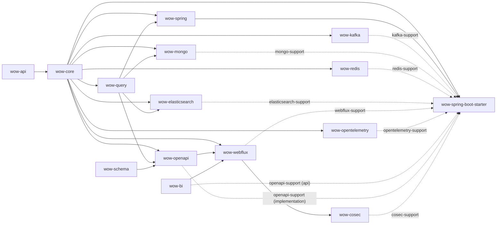

# 模块依赖

本页回答两个问题：代码属于哪个模块，应用运行时应请求哪个 capability。依赖事实以 `settings.gradle.kts`、各模块 `build.gradle.kts` 与 `wow-spring-boot-starter/build.gradle.kts` 为准；配置属性不会替代 classpath 选择。

## 模块概览表

| 模块 | 主要职责 | 应用何时直接依赖 |
| --- | --- | --- |
| `wow-api` | 命令、事件、命名、Header、AggregateId 等公共契约 | API/领域契约模块 |
| `wow-core` | CommandGateway、Dispatcher、EventStore 接口、事件溯源、投影、Saga、等待链 | 非 Spring 运行时或领域实现 |
| `wow-query` | 查询模型、Schema 解析、Snapshot/Event 查询接口 | 编写查询扩展时 |
| `wow-models` | 仓库共享的模型与 KSP 生成示例 | 使用这些共享模型时 |
| `wow-spring` | Spring 容器桥接与查询网关注册 | 自定义 Spring 集成时 |
| `wow-spring-boot-starter` | 核心自动配置与可选 feature variants | Spring Boot 服务 |
| `wow-kafka` | Kafka Command/DomainEvent/StateEvent Bus | 非 Starter 的 Kafka 集成 |
| `wow-mongo` | Mongo EventStore、SnapshotStore、PrepareKey 与查询后端 | 非 Starter 的 Mongo 集成 |
| `wow-redis` | Redis Bus、EventStore、SnapshotStore 与 PrepareKey | 非 Starter 的 Redis 集成 |
| `wow-elasticsearch` | Elasticsearch EventStore、SnapshotStore 与查询后端 | 非 Starter 的 Elasticsearch 集成 |
| `wow-webflux` | 内置命令、事件、状态、查询与运维 route 处理器 | 非 Starter 的 WebFlux 集成 |
| `wow-opentelemetry` | Wow 链路的 OpenTelemetry instrumenter | 非 Starter 的追踪集成 |
| `wow-cosec` | CoSec 请求上下文传播与查询 space 改写 | 应用已使用 CoSec 时 |
| `wow-compiler` | KSP 元数据与 API 合同生成 | 使用 `ksp(...)`，不放进运行时 |
| `wow-schema` | JSON Schema 生成 | 扩展 Schema/OpenAPI 工具时 |
| `wow-openapi` | 内置 route/OpenAPI 合同生成 | 扩展 OpenAPI 时 |
| `wow-bi` | BI/ClickHouse 同步脚本生成 | 生成或部署 BI 脚本时 |
| `wow-test` | `AggregateSpec`、`SagaSpec` 测试 DSL | 领域测试 |
| `wow-tck` | Adapter 合同与 Testcontainers 夹具 | 实现或验证 Adapter |
| `wow-mock` | mock/delay 存储支持 | 测试，不用于生产 |
| `wow-apiclient` | CoApi/Wow REST API client | JVM 客户端 |
| `wow-cocache` | CoCache 投影缓存集成 | 已采用 CoCache 时 |
| `wow-bom` / `wow-dependencies` | 发布 BOM 与仓库内依赖平台 | 对齐版本，不提供运行时能力 |

`test/wow-it` 与 `code-coverage-report` 是仓库验证模块；`compensation/*`、`example/*` 是补偿产品与示例应用，不应被当作基础 Starter 的隐式依赖。

## 依赖图

箭头从依赖指向使用者；虚线表示 Starter feature variant，而不是基础变体依赖。


```mermaid
graph LR
    API[wow-api] --> CORE[wow-core]
    CORE --> QUERY[wow-query]
    CORE --> SPRING[wow-spring]
    QUERY --> SPRING
    CORE --> STARTER[wow-spring-boot-starter]
    SPRING --> STARTER

    CORE --> KAFKA[wow-kafka]
    CORE --> MONGO[wow-mongo]
    QUERY --> MONGO
    CORE --> REDIS[wow-redis]
    CORE --> ES[wow-elasticsearch]
    QUERY --> ES

    CORE --> OPENAPI[wow-openapi]
    QUERY --> OPENAPI
    SCHEMA[wow-schema] --> OPENAPI
    CORE --> WEBFLUX[wow-webflux]
    OPENAPI --> WEBFLUX
    BI[wow-bi] --> WEBFLUX
    CORE --> OTEL[wow-opentelemetry]
    WEBFLUX --> COSEC[wow-cosec]

    KAFKA -. kafka-support .-> STARTER
    MONGO -. mongo-support .-> STARTER
    REDIS -. redis-support .-> STARTER
    ES -. elasticsearch-support .-> STARTER
    WEBFLUX -. webflux-support .-> STARTER
    OTEL -. opentelemetry-support .-> STARTER
    BI -. "openapi-support (api)" .-> STARTER
    OPENAPI -. "openapi-support (implementation)" .-> STARTER
    COSEC -. cosec-support .-> STARTER
```

该图只展示项目模块依赖。Jackson、Reactor、Spring Data、Kafka client 等外部库仍以各模块 Gradle 文件为准。

## 模块详情

### API 层

#### wow-api

`wow-api` 是公共合同层，但并非“零依赖”：它通过 API 暴露 Jackson Databind，并以 compile-only 方式使用 Jackson annotations、Swagger annotations 与 Spring Context。不要把运行时 Dispatcher、存储或 Spring 自动配置放进此模块。

常见类型包括 `CommandMessage`、`DomainEvent`、`AggregateId`、`NamedAggregate`、`Header` 与 `TopicKind`。

### Core 层

#### wow-core

`wow-core` 通过 API 依赖 `wow-api`，并公开 Reactor、Jackson、Validation、CosId、Micrometer 等运行时合同。它拥有命令处理、事件溯源、Snapshot/Projection/Saga 接口、WaitPlan 和运行时生命周期，但不拥有具体 Broker、数据库或 HTTP Server。

#### wow-query

`wow-query` 通过 API 依赖 `wow-core`。MongoDB 与 Elasticsearch 查询模块复用它；Redis EventStore/SnapshotStore 并不因此获得通用动态查询能力。

#### wow-models

`wow-models` 以 implementation 方式使用 `wow-api`，并对自身源码运行 `wow-compiler` KSP。它是共享模型模块，不是所有应用领域模块的必选依赖。

### Spring 层

#### wow-spring

`wow-spring` 通过 API 暴露 `wow-core`，以 implementation 使用 `wow-query`，负责 Spring `ApplicationContext` 桥接与查询网关注册。它不选择存储或消息实现。

#### wow-spring-boot-starter

基础变体通过 API 引入 `wow-core` 与 `wow-spring`，并提供核心自动配置。基础变体本身不等于 Kafka/Mongo/Redis/Elasticsearch capability。

```kotlin
dependencies {
    implementation(platform("me.ahoo.wow:wow-bom:<aligned-version>"))
    implementation("me.ahoo.wow:wow-spring-boot-starter")

    implementation("me.ahoo.wow:wow-spring-boot-starter") {
        capabilities { requireCapability("me.ahoo.wow:kafka-support") }
    }
    implementation("me.ahoo.wow:wow-spring-boot-starter") {
        capabilities { requireCapability("me.ahoo.wow:mongo-support") }
    }
}
```

每个 capability 使用一条独立依赖声明。`mongo-support`、`redis-support`、`elasticsearch-support` 已包含对应 Spring Boot Data starter；只有应用直接使用额外 API 时才另行声明，不要为了“保险”重复添加。

### 基础设施模块

| 模块 | 具体能力 | 不负责 |
| --- | --- | --- |
| `wow-kafka` | 三类分布式 Bus、topic converter、receiver policy | topic/ACL/retention/位点备份 |
| `wow-mongo` | EventStore、SnapshotStore、PrepareKey、事件/快照查询 | 业务索引、分片、备份 |
| `wow-redis` | 三类 Redis Streams Bus、EventStore、SnapshotStore、PrepareKey | 通用动态查询、Redis 持久化策略 |
| `wow-elasticsearch` | EventStore、SnapshotStore、事件/快照查询、template 初始化 | ILM、集群容量、快照仓库 |
| `wow-webflux` | 合同驱动的 HTTP handler、query guard、批处理 route | 业务认证授权和管理面隔离 |
| `wow-opentelemetry` | Wow instrumenter | SDK/exporter/采样器部署 |
| `wow-cosec` | CoSec 上下文适配 | 完整认证流程或应用授权策略 |

基础设施模块实现 Core 接口；是否达到生产要求取决于部署拓扑、配置、备份恢复和真实负载证据，而不是模块出现在依赖图中。

### 工具模块

#### wow-compiler

`wow-compiler` 是 KSP processor。领域模块用 `ksp("me.ahoo.wow:wow-compiler")` 生成 `META-INF/wow-metadata.json` 等编译产物；服务运行时只需要生成结果，不应把 compiler 当作 runtime dependency。

#### wow-schema

`wow-schema` 依赖 `wow-api`、`wow-core`、`wow-query`，并使用 JSON Schema generator、Jackson、Validation 与 Swagger 模块。它同时打包查询 FilterExpression schema。

#### wow-openapi

`wow-openapi` 通过 API 依赖 `wow-core`、`wow-query`、`wow-schema`，生成内置 HTTP route 合同。实际 WebFlux handler 由 `wow-webflux` 提供。

#### wow-bi

`wow-bi` 通过 API 暴露 `wow-api`，以 implementation 使用 `wow-core` 与 ClickHouse client。它生成/管理 BI 脚本，不自动部署 Kafka、ClickHouse 或恢复流程。

### 测试模块

| 模块 | 验证范围 | 典型使用者 |
| --- | --- | --- |
| `wow-test` | 聚合、Saga、事件与状态行为 | 应用领域模块 |
| `wow-tck` | EventStore、SnapshotStore、Bus、查询等 Adapter 合同 | Adapter 实现与框架模块 |
| `wow-mock` | mock/delay 后端 | 测试服务 |
| `wow-it` | Kafka + Mongo 等真实组合链路 | 仓库 CI/集成测试 |

TCK 通过不等于应用拓扑的容量、升级或灾难恢复已经验证；这些证据仍由应用负责。

### 客户端与缓存模块

#### wow-apiclient

`wow-apiclient` 通过 API 暴露 `wow-core`、`wow-openapi` 与 Reactor，以 implementation 使用 CoApi 和 Spring Web/WebFlux。它是 JVM HTTP client，不启动服务端 route。

#### wow-cocache

`wow-cocache` 通过 API 依赖 `wow-apiclient`、`wow-query` 和 CoCache Core，提供投影缓存集成。没有 CoCache 需求时不应引入。

## Feature Variant 矩阵

| capability | 直接引入的项目模块 | 额外外部集成 |
| --- | --- | --- |
| `mongo-support` | `wow-mongo` | Reactive MongoDB Spring Boot starter |
| `redis-support` | `wow-redis` | Reactive Redis Spring Boot starter |
| `mock-support` | `wow-mock` | 测试用途 |
| `kafka-support` | `wow-kafka` | Reactor Kafka |
| `webflux-support` | `wow-bi`（API）、`wow-webflux` | Spring WebFlux 已由 Starter 基础依赖提供 |
| `elasticsearch-support` | `wow-elasticsearch` | Elasticsearch Spring Boot starter |
| `opentelemetry-support` | `wow-opentelemetry` | OpenTelemetry instrumentation API |
| `openapi-support` | `wow-bi`（API）、`wow-openapi`（implementation） | springdoc common |
| `cosec-support` | `wow-cosec` | CoSec 集成链路 |

capability 表示**代码可用**；`wow.*.enabled` 和 Bus/Storage 属性决定**是否装配**；后端健康、Schema、topic、权限和恢复演练决定**是否可运行**。三个层次不能互相替代。

对 `openapi-support`，`openapiSupportApi(project(":wow-bi"))` 向消费者暴露 BI script API，`openapiSupportImplementation(project(":wow-openapi"))` 则在内部提供 OpenAPI 生成；两者都是该 feature variant 的直接项目依赖。

## 构建配置

所有项目模块由根 `settings.gradle.kts` 注册，第三方版本集中在 `gradle/libs.versions.toml` 与 `wow-dependencies`。应用应使用一个对齐的 Wow BOM，不在本页复制可能漂移的具体版本。

修改模块职责、feature capability 或 API/implementation 暴露关系会改变消费者 classpath，属于构建合同变更；应同时检查 Starter Gradle 文件、发布元数据与下游 dependency insight。

## 相关页面

- [架构概览](./architecture.md)
- [数据流](./data-flow.md)
- [Spring Boot Starter](../extensions/spring-boot-starter.md)
- [配置 Wow 应用](../configuration.md)
- [核心配置参考](../../reference/config/core.md)
