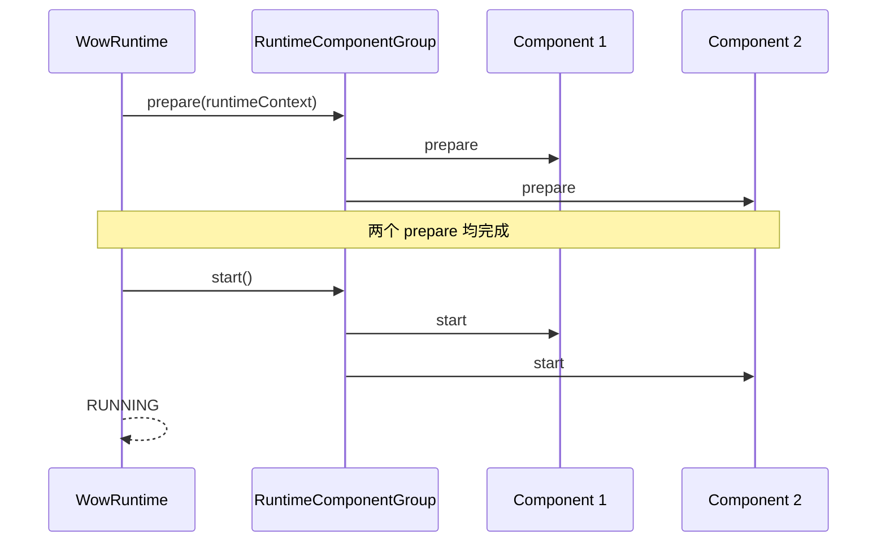
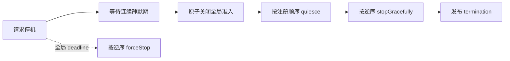

# 运行时生命周期

`WowRuntime` 统一拥有所有 `RuntimeComponent`。它解决的是完整运行时何时可以接收工作、何时停止接收，以及如何在一个截止时间内排空和清理；它不定义单条业务消息是否应该重试。

## 组件契约

```kotlin
interface RuntimeComponent {
    fun prepare(runtimeContext: RuntimeContext): Mono<Void>
    fun start()
    fun quiesce() = Unit
    fun stopGracefully(): Mono<Void>
    fun forceStop()
}
```

| 方法 | 契约 |
| --- | --- |
| `prepare` | 获取订阅或资源，并在能够保留新工作后完成；此时仍不能开放处理 |
| `start` | 在所有组件完成 prepare 后开放处理 |
| `quiesce` | 全局准入关闭后，及时、非阻塞、幂等地关闭组件 intake |
| `stopGracefully` | 排空已接收工作并异步释放资源 |
| `forceStop` | 及时、非阻塞、可重复调用，而且在 prepare 前也安全 |

构造组件时应保持 inert。`RuntimeComponent` 不继承 `AutoCloseable`，容器不能据此再推断一个独立清理所有者。

## 启动：先全部就绪，再开放处理



准备与启动按注册顺序执行。任何组件准备失败时，Runtime 进入启动回滚；已经进入生命周期的组件按逆序清理。`start()` 返回 cold `Mono`，取消其订阅会中止启动并触发这个 one-shot Runtime 的强制停止。

就绪屏障只证明组件报告的 readiness。自定义 transport 必须让 `prepare` 等到“新消息不会在启动窗口丢失”的真实边界，而不是在创建 client 后立即完成。

## 活动准入

`RuntimeContext.tryAcquire()` 为一项完整异步工作申请 `RuntimeActivity`：

```text
收到候选工作
  → tryAcquire()
  → null：拒绝准入，不把消息确认为已处理
  → lease：执行完整异步链，在终止时 close()
```

租约关闭是幂等的。租约应覆盖完整异步链，而不仅是“消息已放入本地队列”；否则静默检测可能过早认为运行时已经空闲。组件 pipeline 的致命终止通过 `reportFailure(error)` 上报，普通业务失败仍由自己的 filter、补偿或确认策略处理。

## 优雅停机



每次新的运行时活动都会重新开始静默期。连续空闲达到 `shutdownQuietPeriod` 后，Runtime 先关闭全局准入，再关闭各组件 intake。这样在上游发布完成、下游刚准备接收的交接窗口中，尾部工作仍有机会取得租约。

`shutdownTimeout` 从停机 owner 建立时开始约束整个停机，而不只是单个组件。deadline 到达会记录 `TimeoutException` 并由强制清理接管。`stop(timeout)` 只限制当前调用者阻塞等待的时间，不会改变 Runtime 的全局 deadline。

## 故障与竞争

| 场景 | 当前实现行为 |
| --- | --- |
| `prepare` / `start` 失败 | 保留启动错误，逆序回滚已经进入生命周期的组件 |
| 组件上报致命错误 | 立即关闭全局准入，跳过普通 quiet period，排空已准入工作后终止完整 Runtime |
| graceful cleanup 失败 | 继续最佳努力清理其余组件，首个失败为 primary，后续失败为 suppressed |
| deadline 到达 | 取消 graceful owner，并强制停止所有组件 |
| force 与生命周期动作重叠 | 动作返回或 publisher 终止后可能再次调用 `forceStop` 补偿 |

因此 `forceStop` 必须能在未知部分初始化状态下重复执行。Runtime 的终止结果发布后会封存，迟到的清理错误不会再修改已发布的 failure。

## 组件顺序与资源所有权

`RuntimeComponentGroup` 要求同一组中的组件实例身份互不重复，并使用以下顺序：

- `prepare`、`start`、`quiesce`：注册顺序；
- `stopGracefully`、`forceStop`：逆注册顺序；
- force 已胜出时，不再让脱离的 graceful 链进入下一个组件。

组合组件可以向子组件提供借用视图，例如 `BorrowedAggregateSchedulerSupplier`。子组件可完成自身生命周期，但不能关闭由父组件拥有的共享 Scheduler。

## Spring 所有权

Starter 提供唯一的 `WowRuntimeLifecycle` 把 Runtime 适配到 Spring `SmartLifecycle`。默认 Runtime 从当前 ApplicationContext 收集 singleton `RuntimeComponent`，按 Spring order 排序，并拒绝竞争性的 Spring `Lifecycle`、destroy method 或其他销毁 owner。

应用提供自定义 Runtime 时，必须显式拥有组件拓扑；Starter 不会把自动发现的组件再追加进去。配置、Bean 名和覆盖规则由[Spring Boot Starter](../extensions/spring-boot-starter.md#bean-装配与覆盖)维护。

## 自定义组件检查清单

1. 构造函数不打开订阅或后台线程。
2. `prepare` 等到真正 readiness，并保持处理关闭。
3. 每项已准入异步工作持有一个租约直到完整终止。
4. `quiesce` 同步关闭逻辑 intake，不执行长时间阻塞。
5. `forceStop` 在 prepare 前安全、幂等且非阻塞。
6. 只有 terminal pipeline failure 调用 `reportFailure`。
7. 用并发测试覆盖 force 与 prepare/start/quiesce/stop 的重叠。

## 验证与运维

默认属性及约束见[核心配置参考](../../reference/config/core.md)。本地实现证据可运行：

```bash
./gradlew :wow-core:test --tests "me.ahoo.wow.runtime.WowRuntimeTest"
./gradlew :wow-core:test --tests "me.ahoo.wow.runtime.internal.RuntimeComponentGroupTest"
```

模块测试只验证实现合同。quiet period 与 timeout 的生产值仍要依据真实交接抖动、最长排空时间和资源清理时间验证。

## 源码与相关页面

- [`WowRuntime`](https://github.com/Ahoo-Wang/Wow/blob/main/wow-core/src/main/kotlin/me/ahoo/wow/runtime/WowRuntime.kt)
- [`RuntimeComponent`](https://github.com/Ahoo-Wang/Wow/blob/main/wow-core/src/main/kotlin/me/ahoo/wow/runtime/RuntimeComponent.kt)
- [`RuntimeContext`](https://github.com/Ahoo-Wang/Wow/blob/main/wow-core/src/main/kotlin/me/ahoo/wow/runtime/RuntimeContext.kt)
- [`RuntimeComponentGroup`](https://github.com/Ahoo-Wang/Wow/blob/main/wow-core/src/main/kotlin/me/ahoo/wow/runtime/internal/RuntimeComponentGroup.kt)
- [运行时编排迁移](../migration/runtime-orchestration.md)：破坏性生命周期变化的迁移边界
- [聚合调度器](./aggregate-scheduler.md)：Scheduler 的拥有与释放
