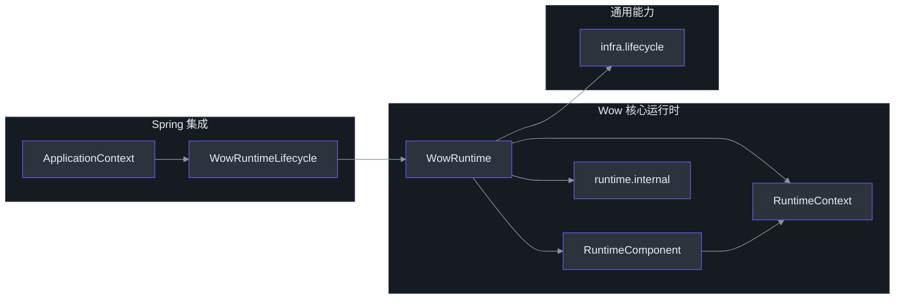
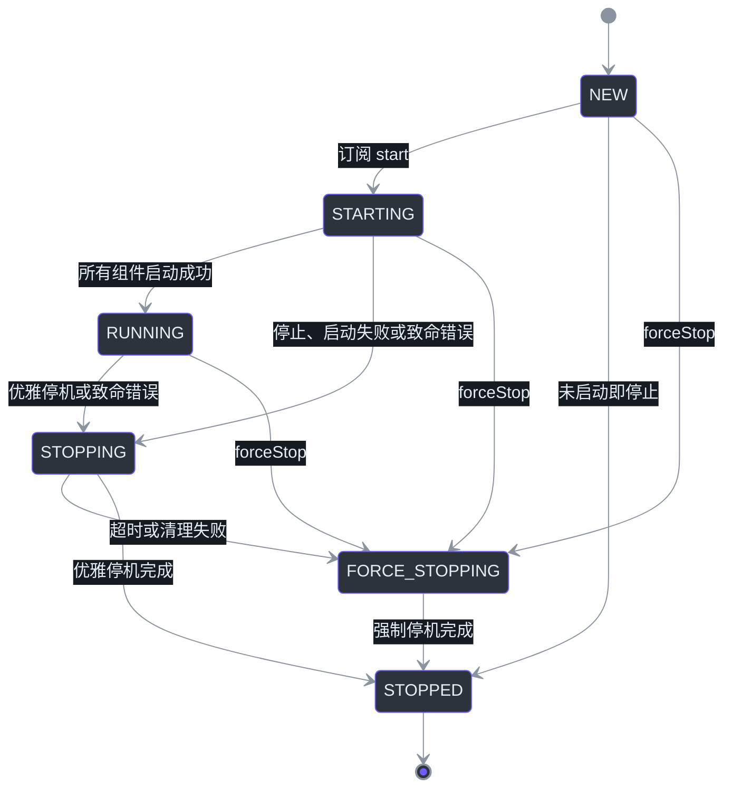
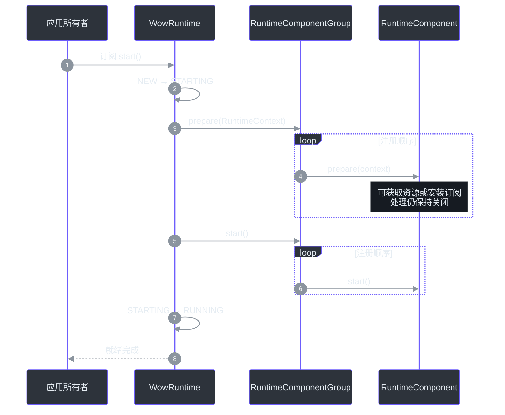
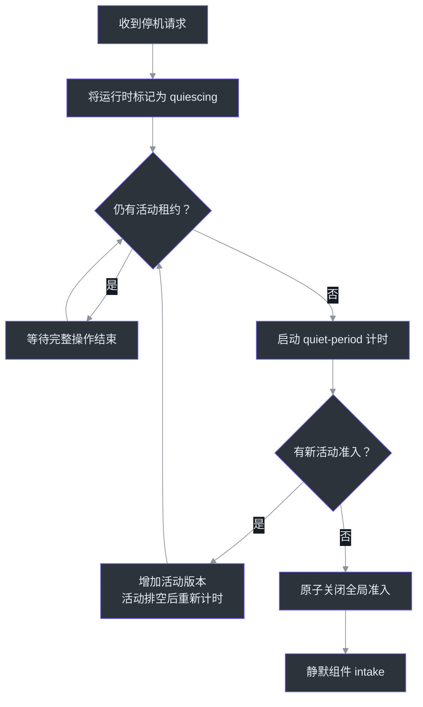
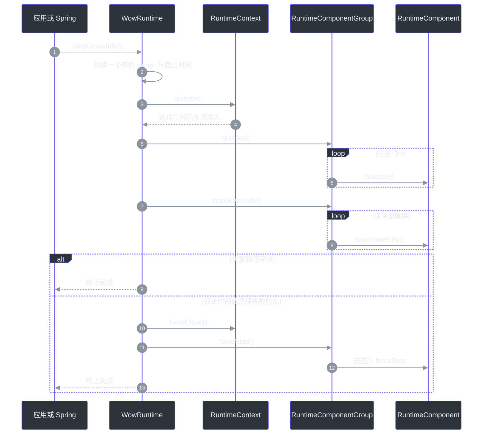

# 运行时生命周期

## 概览

Wow 应用不是一组可以各自独立停止的 Dispatcher。命令、事件、投影、快照与 Saga
共同构成一张处理图：一个组件已准入的工作可能在另一个组件中产生尾部工作。因此，
`WowRuntime` 以一个 one-shot 生命周期统一拥有整张处理图，对外提供一个就绪屏障、
一个活动边界、一个停机截止时间以及一个终止结果。
[`WowRuntime.kt:40-55`](https://github.com/Ahoo-Wang/Wow/blob/main/wow-core/src/main/kotlin/me/ahoo/wow/runtime/WowRuntime.kt#L40-L55)
[`2026-07-28-runtime-orchestration.md:93-121`](https://github.com/Ahoo-Wang/Wow/blob/main/document/design/2026-07-28-runtime-orchestration.md#L93-L121)

| 关注点 | 运行时保证 | 源码 |
|---|---|---|
| 所有权 | 一个 `WowRuntime` 拥有全部已注册的 `RuntimeComponent` | [`WowRuntime.kt:113-131`](https://github.com/Ahoo-Wang/Wow/blob/main/wow-core/src/main/kotlin/me/ahoo/wow/runtime/WowRuntime.kt#L113-L131) |
| 就绪 | 所有组件完成 `prepare` 后，才允许任何组件进入 `start` | [`WowRuntime.kt:206-233`](https://github.com/Ahoo-Wang/Wow/blob/main/wow-core/src/main/kotlin/me/ahoo/wow/runtime/WowRuntime.kt#L206-L233) |
| 进行中工作 | 一个 `RuntimeActivity` 租约代表一项完整异步操作 | [`RuntimeContext.kt:16-45`](https://github.com/Ahoo-Wang/Wow/blob/main/wow-core/src/main/kotlin/me/ahoo/wow/runtime/RuntimeContext.kt#L16-L45) |
| 优雅停机 | 连续空闲期结束后关闭全局准入，再静默并停止组件 | [`WowRuntime.kt:496-524`](https://github.com/Ahoo-Wang/Wow/blob/main/wow-core/src/main/kotlin/me/ahoo/wow/runtime/WowRuntime.kt#L496-L524) |
| 截止时间 | 一个 timeout 约束完整运行时停机，超时后触发强制停机 | [`WowRuntime.kt:400-458`](https://github.com/Ahoo-Wang/Wow/blob/main/wow-core/src/main/kotlin/me/ahoo/wow/runtime/WowRuntime.kt#L400-L458) |
| 故障 | 组件致命错误进入同一条完整运行时停机路径 | [`WowRuntime.kt:461-494`](https://github.com/Ahoo-Wang/Wow/blob/main/wow-core/src/main/kotlin/me/ahoo/wow/runtime/WowRuntime.kt#L461-L494) |
| Spring | 一个 `WowRuntimeLifecycle` 将运行时桥接到 Spring `SmartLifecycle` | [`WowRuntimeLifecycle.kt:27-44`](https://github.com/Ahoo-Wang/Wow/blob/main/wow-spring/src/main/kotlin/me/ahoo/wow/spring/WowRuntimeLifecycle.kt#L27-L44) |

## 架构

### 单一所有者与窄化边界

公开编排 API 位于 `me.ahoo.wow.runtime`；并发状态机与清理机制封装在
`me.ahoo.wow.runtime.internal`。通用生命周期能力继续留在
`me.ahoo.wow.infra.lifecycle`，Spring 只提供组合根与生命周期桥接。这样既把策略
集中在 Runtime，又不会让通用生命周期契约耦合 Wow 的编排语义。
[`RuntimeComponent.kt:14-35`](https://github.com/Ahoo-Wang/Wow/blob/main/wow-core/src/main/kotlin/me/ahoo/wow/runtime/RuntimeComponent.kt#L14-L35)
[`GracefullyStoppable.kt:14-34`](https://github.com/Ahoo-Wang/Wow/blob/main/wow-core/src/main/kotlin/me/ahoo/wow/infra/lifecycle/GracefullyStoppable.kt#L14-L34)



<!-- Sources: wow-core/src/main/kotlin/me/ahoo/wow/runtime/RuntimeComponent.kt:14-62, wow-core/src/main/kotlin/me/ahoo/wow/runtime/WowRuntime.kt:40-55, wow-spring/src/main/kotlin/me/ahoo/wow/spring/WowRuntimeLifecycle.kt:27-44, wow-core/src/main/kotlin/me/ahoo/wow/infra/lifecycle/GracefullyStoppable.kt:14-34 -->

| 边界 | 职责 | 不应拥有 | 源码 |
|---|---|---|---|
| `me.ahoo.wow.runtime` | 公开运行时契约与高层编排 | Spring 容器策略或存储、传输细节 | [`WowRuntime.kt:40-55`](https://github.com/Ahoo-Wang/Wow/blob/main/wow-core/src/main/kotlin/me/ahoo/wow/runtime/WowRuntime.kt#L40-L55) |
| `me.ahoo.wow.runtime.internal` | 有序组合、准入状态、截止时间、清理与终止交付 | 公开扩展 API | [`RuntimeComponentGroup.kt:25-40`](https://github.com/Ahoo-Wang/Wow/blob/main/wow-core/src/main/kotlin/me/ahoo/wow/runtime/internal/RuntimeComponentGroup.kt#L25-L40) |
| `me.ahoo.wow.infra.lifecycle` | 可复用的启停能力契约 | 完整运行时就绪或故障策略 | [`Lifecycle.kt:14-57`](https://github.com/Ahoo-Wang/Wow/blob/main/wow-core/src/main/kotlin/me/ahoo/wow/infra/lifecycle/Lifecycle.kt#L14-L57) |
| `me.ahoo.wow.spring` | Spring `SmartLifecycle` 适配 | 组件发现或核心运行时状态 | [`WowRuntimeLifecycle.kt:27-44`](https://github.com/Ahoo-Wang/Wow/blob/main/wow-spring/src/main/kotlin/me/ahoo/wow/spring/WowRuntimeLifecycle.kt#L27-L44) |
| Starter 自动配置 | 发现、校验、排序并组合当前 Context 的组件 Bean | 每个组件的第二套生命周期 | [`WowAutoConfiguration.kt:105-168`](https://github.com/Ahoo-Wang/Wow/blob/main/wow-spring-boot-starter/src/main/kotlin/me/ahoo/wow/spring/boot/starter/WowAutoConfiguration.kt#L105-L168) |

## 组件

### `RuntimeComponent` 契约

`RuntimeComponent` 被刻意保持为一个小契约。构造阶段必须保持 inert，运行时拥有的
资源只能从 `prepare` 或 `start` 开始获取。它不继承 `AutoCloseable`，避免容器为
组件推导出一套独立的销毁生命周期。
[`RuntimeComponent.kt:18-35`](https://github.com/Ahoo-Wang/Wow/blob/main/wow-core/src/main/kotlin/me/ahoo/wow/runtime/RuntimeComponent.kt#L18-L35)

```kotlin
interface RuntimeComponent {
    fun prepare(runtimeContext: RuntimeContext)
    fun start()
    fun quiesce() = Unit
    fun stopGracefully(): Mono<Void>
    fun forceStop()
}
```

| 方法 | 职责 | 行为要求 | 源码 |
|---|---|---|---|
| `prepare` | 获取订阅或资源，但不开放处理 | 需要跟踪活动或上报致命错误时保存 `RuntimeContext` | [`RuntimeComponent.kt:36-43`](https://github.com/Ahoo-Wang/Wow/blob/main/wow-core/src/main/kotlin/me/ahoo/wow/runtime/RuntimeComponent.kt#L36-L43) |
| `start` | 在全组就绪屏障之后开放处理 | 不依赖某个尚未准备的后续组件 | [`RuntimeComponentGroup.kt:79-94`](https://github.com/Ahoo-Wang/Wow/blob/main/wow-core/src/main/kotlin/me/ahoo/wow/runtime/internal/RuntimeComponentGroup.kt#L79-L94) |
| `quiesce` | 在全局准入关闭后关闭组件 intake | 及时、非阻塞、幂等 | [`RuntimeComponent.kt:47-54`](https://github.com/Ahoo-Wang/Wow/blob/main/wow-core/src/main/kotlin/me/ahoo/wow/runtime/RuntimeComponent.kt#L47-L54) |
| `stopGracefully` | 排空已准入工作并释放资源 | 以 `Mono<Void>` 返回完成信号 | [`RuntimeComponent.kt:56`](https://github.com/Ahoo-Wang/Wow/blob/main/wow-core/src/main/kotlin/me/ahoo/wow/runtime/RuntimeComponent.kt#L56) |
| `forceStop` | 优雅停机失败时及时释放资源 | 非阻塞、幂等、在 `prepare` 前安全、重复调用安全 | [`RuntimeComponent.kt:18-29`](https://github.com/Ahoo-Wang/Wow/blob/main/wow-core/src/main/kotlin/me/ahoo/wow/runtime/RuntimeComponent.kt#L18-L29) |

### 运行时状态

运行时是 one-shot 的。`start()` 只能从 `NEW` 进入生命周期；停机开始后，应用必须
创建新的 Runtime（Spring 应用中应创建新的 `ApplicationContext`），而不是重启旧实例。
[`WowRuntime.kt:93-100`](https://github.com/Ahoo-Wang/Wow/blob/main/wow-core/src/main/kotlin/me/ahoo/wow/runtime/WowRuntime.kt#L93-L100)
[`WowRuntime.kt:206-212`](https://github.com/Ahoo-Wang/Wow/blob/main/wow-core/src/main/kotlin/me/ahoo/wow/runtime/WowRuntime.kt#L206-L212)



<!-- Sources: wow-core/src/main/kotlin/me/ahoo/wow/runtime/WowRuntime.kt:93-109, wow-core/src/main/kotlin/me/ahoo/wow/runtime/WowRuntime.kt:188-245, wow-core/src/main/kotlin/me/ahoo/wow/runtime/WowRuntime.kt:316-398, wow-core/src/main/kotlin/me/ahoo/wow/runtime/WowRuntime.kt:461-494 -->

## 数据流

### 启动就绪屏障

`WowRuntime.start()` 返回 cold `Mono<Void>`，调用方必须订阅或阻塞等待。订阅后，
Runtime 先按注册顺序准备全部组件，再按相同顺序启动它们。启动失败时，已经进入
生命周期的组件会在运行时截止时间内按逆序清理。
[`WowRuntime.kt:188-245`](https://github.com/Ahoo-Wang/Wow/blob/main/wow-core/src/main/kotlin/me/ahoo/wow/runtime/WowRuntime.kt#L188-L245)
[`RuntimeComponentGroup.kt:42-115`](https://github.com/Ahoo-Wang/Wow/blob/main/wow-core/src/main/kotlin/me/ahoo/wow/runtime/internal/RuntimeComponentGroup.kt#L42-L115)



<!-- Sources: wow-core/src/main/kotlin/me/ahoo/wow/runtime/WowRuntime.kt:188-233, wow-core/src/main/kotlin/me/ahoo/wow/runtime/internal/RuntimeComponentGroup.kt:42-94, wow-core/src/main/kotlin/me/ahoo/wow/messaging/dispatcher/AggregateDispatcher.kt:206-221, wow-core/src/main/kotlin/me/ahoo/wow/messaging/dispatcher/AggregateDispatcher.kt:278-290 -->

这个两阶段屏障对内存传输与响应式传输尤其重要：Dispatcher 可以在 `prepare` 阶段
安装订阅但保持 demand 关闭，直到 `start` 才开放 demand。
[`AggregateDispatcher.kt:206-221`](https://github.com/Ahoo-Wang/Wow/blob/main/wow-core/src/main/kotlin/me/ahoo/wow/messaging/dispatcher/AggregateDispatcher.kt#L206-L221)
[`AggregateDispatcher.kt:278-290`](https://github.com/Ahoo-Wang/Wow/blob/main/wow-core/src/main/kotlin/me/ahoo/wow/messaging/dispatcher/AggregateDispatcher.kt#L278-L290)
[`2026-07-28-runtime-orchestration.md:81-100`](https://github.com/Ahoo-Wang/Wow/blob/main/document/design/2026-07-28-runtime-orchestration.md#L81-L100)

### 活动租约与静默边界

组件在接受一项完整异步操作前调用 `RuntimeContext.tryAcquire()`。非空租约应保持到
整条操作链终止；下游尾部工作由其各自的租约继续表示。全局准入关闭后，
`tryAcquire()` 返回 `null`。
[`RuntimeContext.kt:16-45`](https://github.com/Ahoo-Wang/Wow/blob/main/wow-core/src/main/kotlin/me/ahoo/wow/runtime/RuntimeContext.kt#L16-L45)
[`AggregateDispatcher.kt:229-271`](https://github.com/Ahoo-Wang/Wow/blob/main/wow-core/src/main/kotlin/me/ahoo/wow/messaging/dispatcher/AggregateDispatcher.kt#L229-L271)



<!-- Sources: wow-core/src/main/kotlin/me/ahoo/wow/runtime/internal/DefaultRuntimeContext.kt:30-37, wow-core/src/main/kotlin/me/ahoo/wow/runtime/internal/DefaultRuntimeContext.kt:74-151, wow-core/src/main/kotlin/me/ahoo/wow/runtime/internal/DefaultRuntimeContext.kt:171-227 -->

静默窗口内仍允许尾部工作准入。每个新操作都会改变活动版本，因此较早的计时任务
无法在新工作到达后关闭准入。只有运行时连续空闲完整的
`shutdown-quiet-period` 后，准入才会被原子关闭。
[`DefaultRuntimeContext.kt:74-118`](https://github.com/Ahoo-Wang/Wow/blob/main/wow-core/src/main/kotlin/me/ahoo/wow/runtime/internal/DefaultRuntimeContext.kt#L74-L118)
[`DefaultRuntimeContext.kt:171-227`](https://github.com/Ahoo-Wang/Wow/blob/main/wow-core/src/main/kotlin/me/ahoo/wow/runtime/internal/DefaultRuntimeContext.kt#L171-L227)
[`2026-07-28-runtime-orchestration.md:102-125`](https://github.com/Ahoo-Wang/Wow/blob/main/document/design/2026-07-28-runtime-orchestration.md#L102-L125)

### 优雅与强制停机

Runtime 只创建一个停机 owner 与一个绝对截止时间。优雅停机先等待全局静默边界，
再按注册顺序调用组件 `quiesce`，最后按逆序调用 `stopGracefully`。截止时间到达后，
Runtime 会取消优雅停机 owner、立即关闭准入，并按逆序强制停止全部已注册组件。
[`WowRuntime.kt:400-458`](https://github.com/Ahoo-Wang/Wow/blob/main/wow-core/src/main/kotlin/me/ahoo/wow/runtime/WowRuntime.kt#L400-L458)
[`WowRuntime.kt:496-545`](https://github.com/Ahoo-Wang/Wow/blob/main/wow-core/src/main/kotlin/me/ahoo/wow/runtime/WowRuntime.kt#L496-L545)
[`RuntimeComponentGroup.kt:64-115`](https://github.com/Ahoo-Wang/Wow/blob/main/wow-core/src/main/kotlin/me/ahoo/wow/runtime/internal/RuntimeComponentGroup.kt#L64-L115)



<!-- Sources: wow-core/src/main/kotlin/me/ahoo/wow/runtime/WowRuntime.kt:316-458, wow-core/src/main/kotlin/me/ahoo/wow/runtime/WowRuntime.kt:496-545, wow-core/src/main/kotlin/me/ahoo/wow/runtime/internal/RuntimeComponentGroup.kt:64-187 -->

## 故障与并发语义

| 场景 | 结果 | 源码 |
|---|---|---|
| 启动动作失败 | Runtime 回滚已准备组件并发布启动错误 | [`WowRuntime.kt:235-295`](https://github.com/Ahoo-Wang/Wow/blob/main/wow-core/src/main/kotlin/me/ahoo/wow/runtime/WowRuntime.kt#L235-L295) |
| 组件上报致命 pipeline error | 完整运行时进入停机，而不是只隔离一个 Dispatcher | [`WowRuntime.kt:461-494`](https://github.com/Ahoo-Wang/Wow/blob/main/wow-core/src/main/kotlin/me/ahoo/wow/runtime/WowRuntime.kt#L461-L494) |
| 截止时间到达 | `TimeoutException` 成为错误证据，强制停机取得所有权 | [`WowRuntime.kt:431-458`](https://github.com/Ahoo-Wang/Wow/blob/main/wow-core/src/main/kotlin/me/ahoo/wow/runtime/WowRuntime.kt#L431-L458) |
| force-stop 与生命周期动作重叠 | Runtime 先执行一次强制清理，动作退出后再补偿一次 | [`RuntimeComponentGroup.kt:248-340`](https://github.com/Ahoo-Wang/Wow/blob/main/wow-core/src/main/kotlin/me/ahoo/wow/runtime/internal/RuntimeComponentGroup.kt#L248-L340) |
| 出现多个清理错误 | 首个错误保持 primary，后续错误在终止发布封存前作为 suppressed | [`SealableFailureAccumulator.kt:18-59`](https://github.com/Ahoo-Wang/Wow/blob/main/wow-core/src/main/kotlin/me/ahoo/wow/runtime/internal/SealableFailureAccumulator.kt#L18-L59) |
| 公共终止 observer 缓慢或饱和 | Observer 交付有界，并与 Runtime 完成线程隔离 | [`TerminalSignal.kt:33-70`](https://github.com/Ahoo-Wang/Wow/blob/main/wow-core/src/main/kotlin/me/ahoo/wow/runtime/internal/TerminalSignal.kt#L33-L70) |

`forceStop()` 可能与 `prepare`、`start`、`quiesce` 或 cold graceful publisher
竞争。因此组件的强制清理必须在 prepare 前安全，并允许重复调用。Runtime 的第二次
补偿调用会覆盖第一次 `forceStop` 返回后才获取的资源。
[`RuntimeComponent.kt:18-29`](https://github.com/Ahoo-Wang/Wow/blob/main/wow-core/src/main/kotlin/me/ahoo/wow/runtime/RuntimeComponent.kt#L18-L29)
[`RuntimeComponentGroup.kt:248-255`](https://github.com/Ahoo-Wang/Wow/blob/main/wow-core/src/main/kotlin/me/ahoo/wow/runtime/internal/RuntimeComponentGroup.kt#L248-L255)

## Spring 集成

Starter 从当前 BeanFactory 发现 `RuntimeComponent` Bean，要求它们是 singleton，
获取 Spring 暴露的实例，拒绝同时实现 Spring `Lifecycle` 的组件，按 Spring order
排序，最后将一个不可变列表交给 `WowRuntime`。
[`WowAutoConfiguration.kt:105-168`](https://github.com/Ahoo-Wang/Wow/blob/main/wow-spring-boot-starter/src/main/kotlin/me/ahoo/wow/spring/boot/starter/WowAutoConfiguration.kt#L105-L168)

| Spring 规则 | 作用 | 源码 |
|---|---|---|
| `WowRuntime` 是组件唯一所有者 | 运行时组件不能同时实现 Spring `Lifecycle`；运行时资源清理应放入组件 hook | [`WowAutoConfiguration.kt:105-150`](https://github.com/Ahoo-Wang/Wow/blob/main/wow-spring-boot-starter/src/main/kotlin/me/ahoo/wow/spring/boot/starter/WowAutoConfiguration.kt#L105-L150) |
| Runtime phase 为 `DEFAULT_PHASE - 3072` | Runtime 先于较晚的 ingress phase 启动，并在入口排空后停止 | [`WowRuntimeLifecycle.kt:27-40`](https://github.com/Ahoo-Wang/Wow/blob/main/wow-spring/src/main/kotlin/me/ahoo/wow/spring/WowRuntimeLifecycle.kt#L27-L40) |
| Runtime 意外终止会关闭 Context | 致命数据面错误不会留下仍在接收请求的应用入口 | [`WowAutoConfiguration.kt:129-137`](https://github.com/Ahoo-Wang/Wow/blob/main/wow-spring-boot-starter/src/main/kotlin/me/ahoo/wow/spring/boot/starter/WowAutoConfiguration.kt#L129-L137) |
| `DefaultLifecycleProcessor` 为 Runtime phase 使用 Runtime timeout 加一秒 | Spring 为 Runtime 截止时间留出完成余量；其他自定义 processor 保留自己的 timeout 策略 | [`WowRuntimeSpringLifecycle.kt:24-53`](https://github.com/Ahoo-Wang/Wow/blob/main/wow-spring-boot-starter/src/main/kotlin/me/ahoo/wow/spring/boot/starter/WowRuntimeSpringLifecycle.kt#L24-L53) |
| 生命周期是 one-shot | 停止后重建 `ApplicationContext`，不要尝试重启 | [`WowRuntimeLifecycle.kt:77-137`](https://github.com/Ahoo-Wang/Wow/blob/main/wow-spring/src/main/kotlin/me/ahoo/wow/spring/WowRuntimeLifecycle.kt#L77-L137) |

内置组件使用确定性的 Spring order。准备与启动遵循该顺序，优雅与强制清理按逆序执行。
[`WowRuntimeComponentOrder.kt:16-29`](https://github.com/Ahoo-Wang/Wow/blob/main/wow-spring-boot-starter/src/main/kotlin/me/ahoo/wow/spring/boot/starter/WowRuntimeComponentOrder.kt#L16-L29)
[`RuntimeComponentGroup.kt:96-115`](https://github.com/Ahoo-Wang/Wow/blob/main/wow-core/src/main/kotlin/me/ahoo/wow/runtime/internal/RuntimeComponentGroup.kt#L96-L115)

| 顺序 | 内置组件 | 源码 |
|---:|---|---|
| 100 | Command Dispatcher | [`WowRuntimeComponentOrder.kt:23-24`](https://github.com/Ahoo-Wang/Wow/blob/main/wow-spring-boot-starter/src/main/kotlin/me/ahoo/wow/spring/boot/starter/WowRuntimeComponentOrder.kt#L23-L24) |
| 200 | Event Dispatcher | [`WowRuntimeComponentOrder.kt:25`](https://github.com/Ahoo-Wang/Wow/blob/main/wow-spring-boot-starter/src/main/kotlin/me/ahoo/wow/spring/boot/starter/WowRuntimeComponentOrder.kt#L25) |
| 300 | Projection Dispatcher | [`WowRuntimeComponentOrder.kt:26`](https://github.com/Ahoo-Wang/Wow/blob/main/wow-spring-boot-starter/src/main/kotlin/me/ahoo/wow/spring/boot/starter/WowRuntimeComponentOrder.kt#L26) |
| 400 | Stateless Saga Dispatcher | [`WowRuntimeComponentOrder.kt:27`](https://github.com/Ahoo-Wang/Wow/blob/main/wow-spring-boot-starter/src/main/kotlin/me/ahoo/wow/spring/boot/starter/WowRuntimeComponentOrder.kt#L27) |
| 500 | Snapshot Dispatcher | [`WowRuntimeComponentOrder.kt:28`](https://github.com/Ahoo-Wang/Wow/blob/main/wow-spring-boot-starter/src/main/kotlin/me/ahoo/wow/spring/boot/starter/WowRuntimeComponentOrder.kt#L28) |

## 配置与运维

```yaml
wow:
  shutdown-timeout: 60s
  shutdown-quiet-period: 1s
```

| 属性 | 默认值 | 含义 | 约束 | 源码 |
|---|---:|---|---|---|
| `wow.shutdown-timeout` | `60s` | 静默并停止完整运行时的一次全局截止时间 | 必须大于零 | [`WowProperties.kt:23-34`](https://github.com/Ahoo-Wang/Wow/blob/main/wow-spring-boot-starter/src/main/kotlin/me/ahoo/wow/spring/boot/starter/WowProperties.kt#L23-L34) |
| `wow.shutdown-quiet-period` | `1s` | 关闭全局准入前要求连续空闲的时间 | 必须大于等于零且严格小于 timeout | [`WowRuntime.kt:102-109`](https://github.com/Ahoo-Wang/Wow/blob/main/wow-core/src/main/kotlin/me/ahoo/wow/runtime/WowRuntime.kt#L102-L109) |

两个值都必须能表示为 64 位有符号纳秒值。
[`DurationValidation.kt:18-25`](https://github.com/Ahoo-Wang/Wow/blob/main/wow-core/src/main/kotlin/me/ahoo/wow/runtime/internal/DurationValidation.kt#L18-L25)

`WowRuntime.stop(timeout)` 只改变当前调用方等待的最长时间，不会替换或延长
`wow.shutdown-timeout`；运行时停机仍然只有一个配置的截止时间。
[`WowRuntime.kt:297-314`](https://github.com/Ahoo-Wang/Wow/blob/main/wow-core/src/main/kotlin/me/ahoo/wow/runtime/WowRuntime.kt#L297-L314)

与 cold `start()` 不同，调用 `stopGracefully()` 会立即发起或加入停机。首次从
`STARTING` 或 `RUNNING` 调用时会认领唯一停机 owner 与 deadline；`NEW` 会直接完成，
后续调用则观察既有终止结果。
[`WowRuntime.kt:316-352`](https://github.com/Ahoo-Wang/Wow/blob/main/wow-core/src/main/kotlin/me/ahoo/wow/runtime/WowRuntime.kt#L316-L352)

::: tip 运维调优
应依据相邻处理阶段间实际观测到的交接抖动设置 quiet period，并确保全局 timeout
能够覆盖静默窗口、最坏情况下的工作排空和资源清理。这是从已实现的共享截止时间与
活动版本模型推导出的运维建议，不是另一套 timeout 策略。
:::

## 实现自定义组件

当扩展需要参与 Runtime readiness、全局活动、致命故障传播与共享停机策略时，应将其
建模为独立的 `RuntimeComponent`。如果一个通用资源只需要启停能力，则继续放在
`infra.lifecycle` 边界。

```kotlin
class CustomRuntimeComponent : RuntimeComponent {
    private lateinit var runtimeContext: RuntimeContext

    override fun prepare(runtimeContext: RuntimeContext) {
        this.runtimeContext = runtimeContext
        // 获取资源或安装订阅，但保持处理关闭。
    }

    override fun start() {
        // 仅在所有组件完成 prepare 后开放处理。
    }

    override fun quiesce() {
        // 及时、同步关闭 intake。
    }

    override fun stopGracefully(): Mono<Void> {
        // 排空已准入工作并释放资源。
        return Mono.empty()
    }

    override fun forceStop() {
        // 及时、非阻塞、幂等，并且在 prepare 前安全。
    }
}
```

以上代码是契约模板，不是框架实现。异步工作应在接受前获取租约，并在完整链终止时关闭。
`reportFailure` 只用于组件 pipeline 致命终止，而不是普通业务消息错误：

```text
activity = runtimeContext.tryAcquire()
if activity is null:
    拒绝该操作且不确认消息
else:
    执行完整异步链
    在完整链终止时关闭 activity

发生致命 pipeline 终止时:
    runtimeContext.reportFailure(error)
```

框架 Dispatcher 遵循相同结构：在发出 tracked exchange 前获取租约，在准入关闭后
拒绝工作，上报 terminal pipeline error，并在处理完成时恰好一次关闭租约。
[`AggregateDispatcher.kt:229-271`](https://github.com/Ahoo-Wang/Wow/blob/main/wow-core/src/main/kotlin/me/ahoo/wow/messaging/dispatcher/AggregateDispatcher.kt#L229-L271)
[`AggregateDispatcher.kt:474-485`](https://github.com/Ahoo-Wang/Wow/blob/main/wow-core/src/main/kotlin/me/ahoo/wow/messaging/dispatcher/AggregateDispatcher.kt#L474-L485)

| 扩展检查项 | 原因 | 源码 |
|---|---|---|
| 构造与 Bean 初始化保持 inert | Runtime 必须先建立所有权，资源才能出现 | [`RuntimeComponent.kt:18-23`](https://github.com/Ahoo-Wang/Wow/blob/main/wow-core/src/main/kotlin/me/ahoo/wow/runtime/RuntimeComponent.kt#L18-L23) |
| `prepare` 不开放 demand | readiness barrier 必须覆盖完整组件图 | [`RuntimeComponent.kt:36-43`](https://github.com/Ahoo-Wang/Wow/blob/main/wow-core/src/main/kotlin/me/ahoo/wow/runtime/RuntimeComponent.kt#L36-L43) |
| `quiesce` 及时关闭 intake | 调用该方法时全局准入已经关闭 | [`RuntimeComponent.kt:47-54`](https://github.com/Ahoo-Wang/Wow/blob/main/wow-core/src/main/kotlin/me/ahoo/wow/runtime/RuntimeComponent.kt#L47-L54) |
| 每项已准入异步操作持有一个租约 | 静默检测必须表示完整工作，而不只是源发布 | [`RuntimeContext.kt:16-45`](https://github.com/Ahoo-Wang/Wow/blob/main/wow-core/src/main/kotlin/me/ahoo/wow/runtime/RuntimeContext.kt#L16-L45) |
| `forceStop` 允许安全重复 | force 可能与任意生命周期动作重叠并触发补偿 | [`RuntimeComponent.kt:18-29`](https://github.com/Ahoo-Wang/Wow/blob/main/wow-core/src/main/kotlin/me/ahoo/wow/runtime/RuntimeComponent.kt#L18-L29) |
| Spring Bean 是 singleton 且不实现 Spring `Lifecycle` | 两个生命周期所有者可能竞争或重复清理同一资源 | [`WowAutoConfiguration.kt:140-150`](https://github.com/Ahoo-Wang/Wow/blob/main/wow-spring-boot-starter/src/main/kotlin/me/ahoo/wow/spring/boot/starter/WowAutoConfiguration.kt#L140-L150) |

## 源码参考

| 源码 | 职责 |
|---|---|
| [`WowRuntime.kt`](https://github.com/Ahoo-Wang/Wow/blob/main/wow-core/src/main/kotlin/me/ahoo/wow/runtime/WowRuntime.kt) | 高层状态机、共享截止时间、故障与终止结果 |
| [`RuntimeComponent.kt`](https://github.com/Ahoo-Wang/Wow/blob/main/wow-core/src/main/kotlin/me/ahoo/wow/runtime/RuntimeComponent.kt) | 组件生命周期契约 |
| [`RuntimeContext.kt`](https://github.com/Ahoo-Wang/Wow/blob/main/wow-core/src/main/kotlin/me/ahoo/wow/runtime/RuntimeContext.kt) | 活动租约与致命故障上报 |
| [`DefaultRuntimeContext.kt`](https://github.com/Ahoo-Wang/Wow/blob/main/wow-core/src/main/kotlin/me/ahoo/wow/runtime/internal/DefaultRuntimeContext.kt) | 准入与连续空闲算法 |
| [`RuntimeComponentGroup.kt`](https://github.com/Ahoo-Wang/Wow/blob/main/wow-core/src/main/kotlin/me/ahoo/wow/runtime/internal/RuntimeComponentGroup.kt) | 有序生命周期组合与强制补偿 |
| [`WowRuntimeLifecycle.kt`](https://github.com/Ahoo-Wang/Wow/blob/main/wow-spring/src/main/kotlin/me/ahoo/wow/spring/WowRuntimeLifecycle.kt) | Spring 生命周期桥接 |
| [`WowAutoConfiguration.kt`](https://github.com/Ahoo-Wang/Wow/blob/main/wow-spring-boot-starter/src/main/kotlin/me/ahoo/wow/spring/boot/starter/WowAutoConfiguration.kt) | Starter 组合根 |

## 相关页面

| 页面 | 关系 |
|---|---|
| [架构](architecture.md) | 将 Runtime 所有权放回完整的 Wow 模块与处理架构中理解 |
| [配置](../configuration.md) | 完整 Spring Boot 配置参考 |
| [迁移指南](../migration.md#统一运行时编排) | 生命周期破坏性变更与扩展迁移 |
| [聚合调度器](aggregate-scheduler.md) | 按聚合 Scheduler 的优雅与强制释放 |
| [事件总线](event-bus.md) | 参与 Runtime 活动跟踪的消息传输 |
| [Spring Boot Starter](../extensions/spring-boot-starter.md) | 自动配置与应用集成 |
