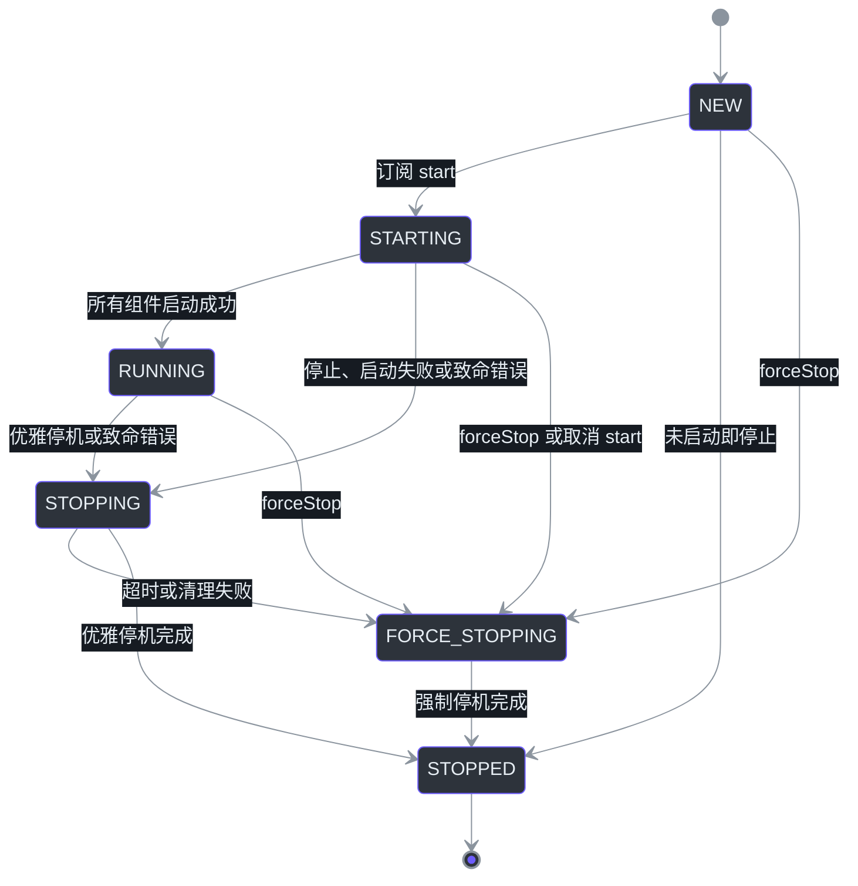
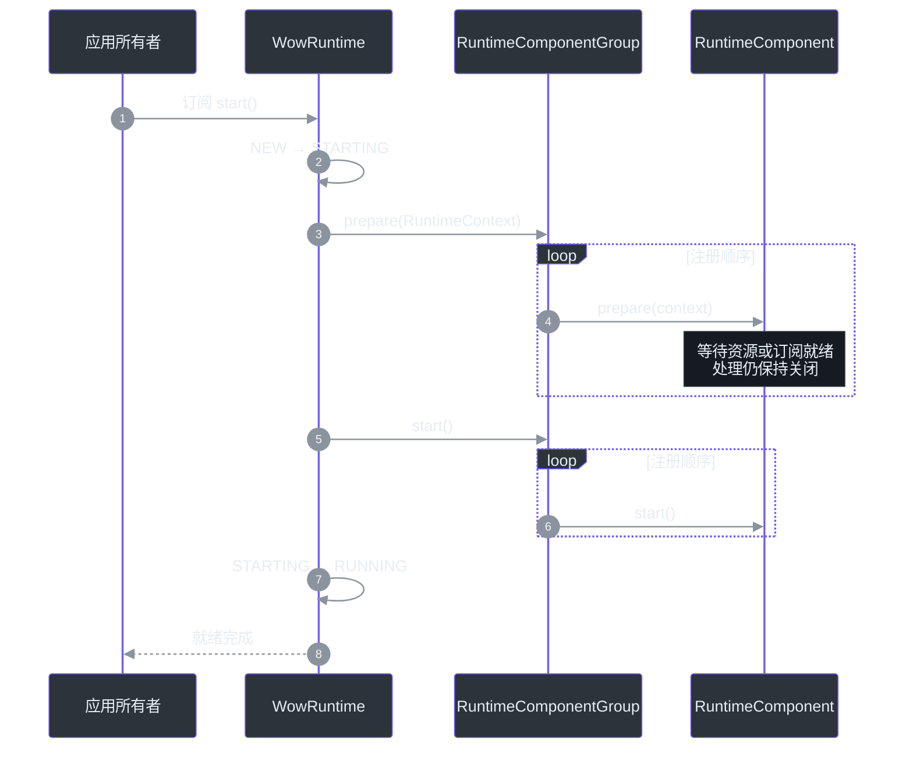
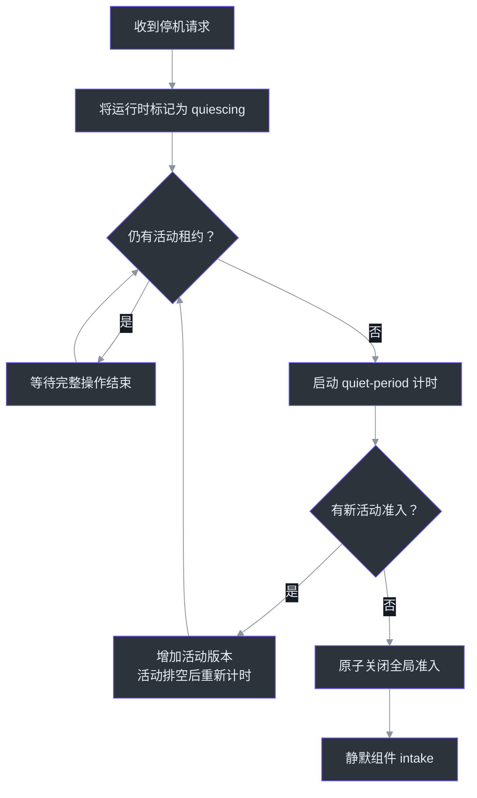
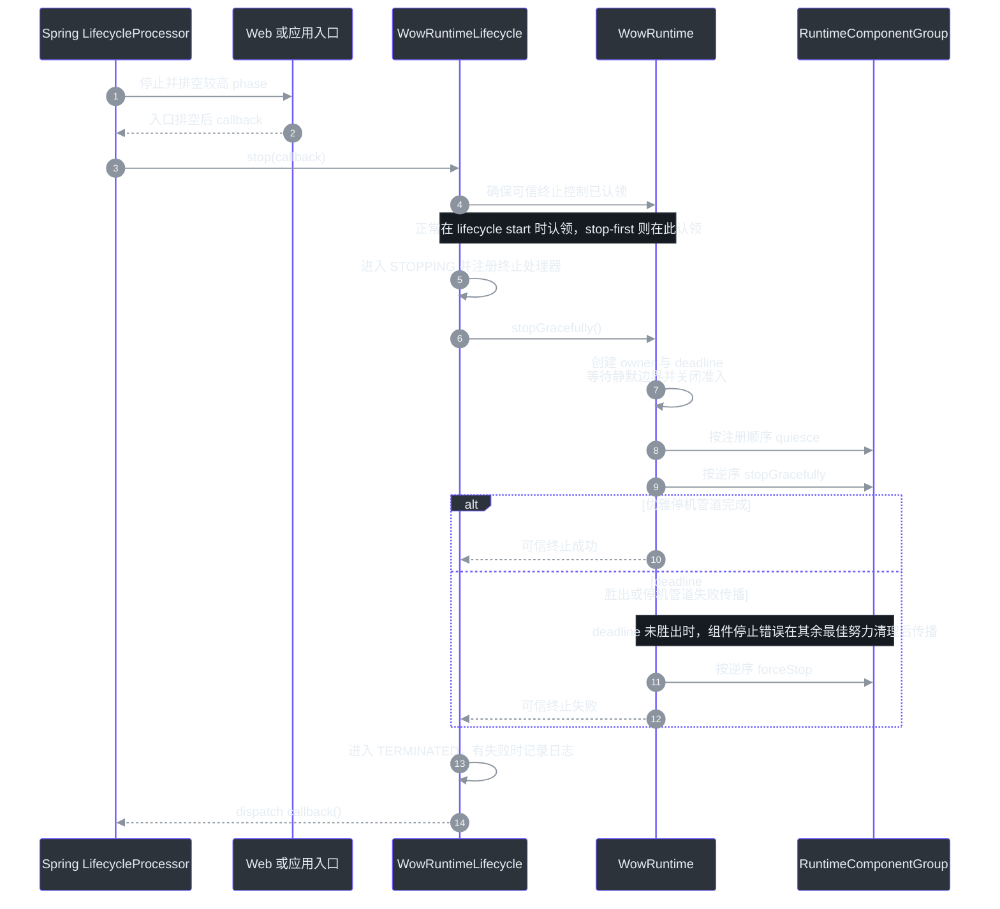

# 运行时生命周期

## 概览

Wow 应用不是一组可以各自独立停止的 Dispatcher。命令、事件、投影、快照与 Saga
共同构成一张处理图：一个组件已准入的工作可能在另一个组件中产生尾部工作。因此，
`WowRuntime` 以一个 one-shot 生命周期统一拥有整张处理图，对外提供一个就绪屏障、
一个活动边界、一个停机截止时间以及一个终止结果。
[`WowRuntime.kt:40-55`](https://github.com/Ahoo-Wang/Wow/blob/main/wow-core/src/main/kotlin/me/ahoo/wow/runtime/WowRuntime.kt#L40-L55)
[`2026-07-28-runtime-orchestration.md:93-121`](https://github.com/Ahoo-Wang/Wow/blob/main/document/design/2026-07-28-runtime-orchestration.md#L93-L121)

| 关注点 | 运行时保证 | 源码 |
|---|---|---|
| 所有权 | 一个 `WowRuntime` 拥有全部已注册的 `RuntimeComponent` | [`WowRuntime.kt:113-131`](https://github.com/Ahoo-Wang/Wow/blob/main/wow-core/src/main/kotlin/me/ahoo/wow/runtime/WowRuntime.kt#L113-L131) |
| 就绪 | 所有组件完成 `prepare` 后，才允许任何组件进入 `start` | [`WowRuntime.kt:219-241`](https://github.com/Ahoo-Wang/Wow/blob/main/wow-core/src/main/kotlin/me/ahoo/wow/runtime/WowRuntime.kt#L219-L241) |
| 进行中工作 | 一个 `RuntimeActivity` 租约代表一项完整异步操作 | [`RuntimeContext.kt:16-45`](https://github.com/Ahoo-Wang/Wow/blob/main/wow-core/src/main/kotlin/me/ahoo/wow/runtime/RuntimeContext.kt#L16-L45) |
| 优雅停机 | 连续空闲期结束后关闭全局准入，再静默并停止组件 | [`WowRuntime.kt:512-530`](https://github.com/Ahoo-Wang/Wow/blob/main/wow-core/src/main/kotlin/me/ahoo/wow/runtime/WowRuntime.kt#L512-L530) |
| 截止时间 | 一个 timeout 约束完整运行时停机，超时后触发强制停机 | [`WowRuntime.kt:409-468`](https://github.com/Ahoo-Wang/Wow/blob/main/wow-core/src/main/kotlin/me/ahoo/wow/runtime/WowRuntime.kt#L409-L468) |
| 故障 | 组件致命错误立即关闭准入并进入完整运行时停机路径 | [`WowRuntime.kt:470-510`](https://github.com/Ahoo-Wang/Wow/blob/main/wow-core/src/main/kotlin/me/ahoo/wow/runtime/WowRuntime.kt#L470-L510) |
| Spring | 一个 canonical `WowRuntimeLifecycle` 将运行时桥接到 Spring `SmartLifecycle` | [`WowAutoConfiguration.kt:144-183`](https://github.com/Ahoo-Wang/Wow/blob/main/wow-spring-boot-starter/src/main/kotlin/me/ahoo/wow/spring/boot/starter/WowAutoConfiguration.kt#L144-L183) |

## 架构

### 单一所有者与窄化边界

公开编排 API 与 `WowRuntime` 私有持有的完整运行时状态和策略位于
`me.ahoo.wow.runtime`；可复用的准入、组件组合、执行资源与终止交付机制封装在
`me.ahoo.wow.runtime.internal`。通用的优雅关闭与终止观察能力继续留在
`me.ahoo.wow.infra.lifecycle`，Spring 只提供组合根与生命周期桥接。这样既把策略
集中在 Runtime，也不会把低层资源能力扩张为第二套生命周期模型。
[`RuntimeComponent.kt:14-35`](https://github.com/Ahoo-Wang/Wow/blob/main/wow-core/src/main/kotlin/me/ahoo/wow/runtime/RuntimeComponent.kt#L14-L35)
[`WowRuntime.kt:93-149`](https://github.com/Ahoo-Wang/Wow/blob/main/wow-core/src/main/kotlin/me/ahoo/wow/runtime/WowRuntime.kt#L93-L149)
[`GracefullyStoppable.kt:14-37`](https://github.com/Ahoo-Wang/Wow/blob/main/wow-core/src/main/kotlin/me/ahoo/wow/infra/lifecycle/GracefullyStoppable.kt#L14-L37)
[`TerminatedSignalCapable.kt:14-26`](https://github.com/Ahoo-Wang/Wow/blob/main/wow-core/src/main/kotlin/me/ahoo/wow/infra/lifecycle/TerminatedSignalCapable.kt#L14-L26)


<!-- Sources: wow-core/src/main/kotlin/me/ahoo/wow/runtime/RuntimeComponent.kt:14-62, wow-core/src/main/kotlin/me/ahoo/wow/runtime/WowRuntime.kt:40-55, wow-core/src/main/kotlin/me/ahoo/wow/runtime/WowRuntime.kt:93-149, wow-spring/src/main/kotlin/me/ahoo/wow/spring/WowRuntimeLifecycle.kt:27-44, wow-core/src/main/kotlin/me/ahoo/wow/infra/lifecycle/GracefullyStoppable.kt:14-37, wow-core/src/main/kotlin/me/ahoo/wow/infra/lifecycle/TerminatedSignalCapable.kt:14-26 -->

| 边界 | 职责 | 不应拥有 | 源码 |
|---|---|---|---|
| `me.ahoo.wow.runtime` | 公开运行时契约，以及私有的完整运行时状态与编排策略 | Spring 容器策略或存储、传输细节 | [`WowRuntime.kt:93-149`](https://github.com/Ahoo-Wang/Wow/blob/main/wow-core/src/main/kotlin/me/ahoo/wow/runtime/WowRuntime.kt#L93-L149) [`WowRuntime.kt:325-468`](https://github.com/Ahoo-Wang/Wow/blob/main/wow-core/src/main/kotlin/me/ahoo/wow/runtime/WowRuntime.kt#L325-L468) |
| `me.ahoo.wow.runtime.internal` | 可复用的准入、组件组合、执行资源、终止交付与故障机制 | 公开扩展 API 或完整运行时策略 | [`DefaultRuntimeContext.kt:30-64`](https://github.com/Ahoo-Wang/Wow/blob/main/wow-core/src/main/kotlin/me/ahoo/wow/runtime/internal/DefaultRuntimeContext.kt#L30-L64) [`RuntimeComponentGroup.kt:25-40`](https://github.com/Ahoo-Wang/Wow/blob/main/wow-core/src/main/kotlin/me/ahoo/wow/runtime/internal/RuntimeComponentGroup.kt#L25-L40) |
| `me.ahoo.wow.infra.lifecycle` | 可复用的优雅关闭与终止观察能力 | 启动、就绪、排序或编排所有权 | [`GracefullyStoppable.kt:19-37`](https://github.com/Ahoo-Wang/Wow/blob/main/wow-core/src/main/kotlin/me/ahoo/wow/infra/lifecycle/GracefullyStoppable.kt#L19-L37) [`TerminatedSignalCapable.kt:18-26`](https://github.com/Ahoo-Wang/Wow/blob/main/wow-core/src/main/kotlin/me/ahoo/wow/infra/lifecycle/TerminatedSignalCapable.kt#L18-L26) |
| `me.ahoo.wow.spring` | Spring `SmartLifecycle` 适配 | 组件发现或核心运行时状态 | [`WowRuntimeLifecycle.kt:27-44`](https://github.com/Ahoo-Wang/Wow/blob/main/wow-spring/src/main/kotlin/me/ahoo/wow/spring/WowRuntimeLifecycle.kt#L27-L44) |
| Starter 自动配置 | 强制本地 canonical Runtime 与生命周期边界；为默认 Runtime 发现、校验、排序并组合当前 Context 的组件 Bean | 第二个 Runtime、生命周期桥接器或组件生命周期 | [`WowAutoConfiguration.kt:118-264`](https://github.com/Ahoo-Wang/Wow/blob/main/wow-spring-boot-starter/src/main/kotlin/me/ahoo/wow/spring/boot/starter/WowAutoConfiguration.kt#L118-L264) |

## 组件

### `RuntimeComponent` 契约

`RuntimeComponent` 被刻意保持为一个小契约。构造阶段必须保持 inert，运行时拥有的
资源只能从 `prepare` 或 `start` 开始获取。它不继承 `AutoCloseable`，避免容器为
组件推导出一套独立的销毁生命周期。
[`RuntimeComponent.kt:18-35`](https://github.com/Ahoo-Wang/Wow/blob/main/wow-core/src/main/kotlin/me/ahoo/wow/runtime/RuntimeComponent.kt#L18-L35)

```kotlin
interface RuntimeComponent {
    fun prepare(runtimeContext: RuntimeContext): Mono<Void>
    fun start()
    fun quiesce() = Unit
    fun stopGracefully(): Mono<Void>
    fun forceStop()
}
```

| 方法 | 职责 | 行为要求 | 源码 |
|---|---|---|---|
| `prepare` | 获取订阅或资源，但不开放处理 | 返回一个只在组件能够无损保留新准入工作后才完成的 `Mono`；`forceStop` 后及时终止 | [`RuntimeComponent.kt:34-43`](https://github.com/Ahoo-Wang/Wow/blob/main/wow-core/src/main/kotlin/me/ahoo/wow/runtime/RuntimeComponent.kt#L34-L43) |
| `start` | 在全组就绪屏障之后开放处理 | 不依赖某个尚未准备的后续组件 | [`RuntimeComponentGroup.kt:85-100`](https://github.com/Ahoo-Wang/Wow/blob/main/wow-core/src/main/kotlin/me/ahoo/wow/runtime/internal/RuntimeComponentGroup.kt#L85-L100) |
| `quiesce` | 在全局准入关闭后关闭组件 intake | 及时、非阻塞、幂等 | [`RuntimeComponent.kt:47-54`](https://github.com/Ahoo-Wang/Wow/blob/main/wow-core/src/main/kotlin/me/ahoo/wow/runtime/RuntimeComponent.kt#L47-L54) |
| `stopGracefully` | 排空已准入工作并释放资源 | 以 `Mono<Void>` 返回完成信号 | [`RuntimeComponent.kt:56`](https://github.com/Ahoo-Wang/Wow/blob/main/wow-core/src/main/kotlin/me/ahoo/wow/runtime/RuntimeComponent.kt#L56) |
| `forceStop` | 优雅停机失败时及时释放资源 | 非阻塞、幂等、在 `prepare` 前安全、重复调用安全 | [`RuntimeComponent.kt:18-29`](https://github.com/Ahoo-Wang/Wow/blob/main/wow-core/src/main/kotlin/me/ahoo/wow/runtime/RuntimeComponent.kt#L18-L29) |

### 运行时状态

运行时是 one-shot 的。`start()` 只能从 `NEW` 进入生命周期；停机开始后，应用必须
创建新的 Runtime（Spring 应用中应创建新的 `ApplicationContext`），而不是重启旧实例。
[`WowRuntime.kt:93-100`](https://github.com/Ahoo-Wang/Wow/blob/main/wow-core/src/main/kotlin/me/ahoo/wow/runtime/WowRuntime.kt#L93-L100)
[`WowRuntime.kt:197-217`](https://github.com/Ahoo-Wang/Wow/blob/main/wow-core/src/main/kotlin/me/ahoo/wow/runtime/WowRuntime.kt#L197-L217)



<!-- Sources: wow-core/src/main/kotlin/me/ahoo/wow/runtime/WowRuntime.kt:93-109, wow-core/src/main/kotlin/me/ahoo/wow/runtime/WowRuntime.kt:188-254, wow-core/src/main/kotlin/me/ahoo/wow/runtime/WowRuntime.kt:325-407, wow-core/src/main/kotlin/me/ahoo/wow/runtime/WowRuntime.kt:470-510 -->

## 数据流

### 启动就绪屏障

`WowRuntime.start()` 返回 cold `Mono<Void>`，调用方必须订阅或阻塞等待。订阅后，
Runtime 会按注册顺序逐个等待每个组件的异步 `prepare` 完成，再按相同顺序启动。
启动失败时，已经进入生命周期的组件会在运行时截止时间内按逆序清理。取消启动订阅
会先中止并强制停止该 one-shot Runtime，再向正在执行的 prepare publisher 传播取消。
[`WowRuntime.kt:188-254`](https://github.com/Ahoo-Wang/Wow/blob/main/wow-core/src/main/kotlin/me/ahoo/wow/runtime/WowRuntime.kt#L188-L254)
[`RuntimeComponentGroup.kt:42-115`](https://github.com/Ahoo-Wang/Wow/blob/main/wow-core/src/main/kotlin/me/ahoo/wow/runtime/internal/RuntimeComponentGroup.kt#L42-L115)



<!-- Sources: wow-core/src/main/kotlin/me/ahoo/wow/runtime/WowRuntime.kt:188-241, wow-core/src/main/kotlin/me/ahoo/wow/runtime/internal/RuntimeComponentGroup.kt:42-100, wow-core/src/main/kotlin/me/ahoo/wow/messaging/dispatcher/AggregateDispatcher.kt:215-246, wow-core/src/main/kotlin/me/ahoo/wow/messaging/dispatcher/AggregateDispatcher.kt:326-341 -->

`MessageReceiver` 显式表达 transport readiness，但不引入第二个生命周期 owner：它包含
一条 single-use 消息流、一个 hot 且可重放的就绪信号，以及幂等的 processing 开启与
关闭 callback。Dispatcher 先订阅消息流并保持下游 demand 关闭，再由 `prepare` 等待
readiness；全局 `start` pass 会开放 Dispatcher demand，并显式调用
`openProcessing()`；quiescence 会在 detached physical cancellation 之前调用
`closeProcessing()`。Reactive prefetch 与仍然存在的物理订阅都不能被当作生命周期准入。

| Transport | 就绪边界 | 源码 |
|---|---|---|
| 同步/内存 | 消息订阅已安装在 Dispatcher demand gate 之后 | [`MessageReceiver.kt:20-89`](https://github.com/Ahoo-Wang/Wow/blob/main/wow-core/src/main/kotlin/me/ahoo/wow/messaging/MessageReceiver.kt#L20-L89) [`AggregateDispatcher.kt:228-246`](https://github.com/Ahoo-Wang/Wow/blob/main/wow-core/src/main/kotlin/me/ahoo/wow/messaging/dispatcher/AggregateDispatcher.kt#L228-L246) |
| Redis Streams | 全部 `XGROUP CREATE ... $ MKSTREAM` 已成功或返回 `BUSYGROUP`；`openProcessing()` 前不启动 stream read，因此 readiness 或下游 prefetch 都不会产生 PEL 记录 | [`AbstractRedisMessageBus.kt:76-146`](https://github.com/Ahoo-Wang/Wow/blob/main/wow-redis/src/main/kotlin/me/ahoo/wow/redis/bus/AbstractRedisMessageBus.kt#L76-L146) |
| Kafka | 用户 assignment customizer 执行前先捕获 broker 分配的 position，再异步提交原始 position 与 customizer 后 position 中较早的一个；每次 assignment callback 只 anchor 本次提供的 partition，readiness 会等待全部在途 anchor | [`AbstractKafkaBus.kt:128-185`](https://github.com/Ahoo-Wang/Wow/blob/main/wow-kafka/src/main/kotlin/me/ahoo/wow/kafka/AbstractKafkaBus.kt#L128-L185) [`AbstractKafkaBus.kt:214-274`](https://github.com/Ahoo-Wang/Wow/blob/main/wow-kafka/src/main/kotlin/me/ahoo/wow/kafka/AbstractKafkaBus.kt#L214-L274) [`AbstractKafkaBusTest.kt:204-305`](https://github.com/Ahoo-Wang/Wow/blob/main/wow-kafka/src/test/kotlin/me/ahoo/wow/kafka/AbstractKafkaBusTest.kt#L204-L305) |

该模型把“transport 已能保留新工作”和“Dispatcher 可以开始处理”明确分开。Kafka
为了完成 assignment 和持久化初始保留边界，可以在 Dispatcher gate 关闭时进行内部
poll；契约不要求所有 transport 的内部 demand 都保持为零。Kafka topic 应在 Runtime
启动前完成预配置；readiness 负责协调 consumer，不负责部署期创建 topic。
内置 in-memory bus 只向 local-first routing 暴露 processing-open 的订阅。如果本地发送
成功，必须先由全部目标 Dispatcher 取得 runtime activity lease，并将 tracked exchange
交接给处理 pipeline；sink 接受、进入缓冲区或仍存在物理订阅都不等于 delivery receipt。
Runtime admission 拒绝、消息被过滤或路由发生变化时，distributed copy 会移除
local-handled 标记并继续发送，同时 physical cancellation 仍保持 detached。该 receipt
只证明准入成功，不证明 handler 已成功完成；后续 fatal pipeline failure 不会把已准入消息
追溯改为 distributed fallback。普通 `receiver()` consumer 不参与 local suppression，
因此不需要 receipt 协议。使用内置 in-memory bus 且由 Runtime 管理的自定义 consumer
应通过 `runtimeReceiver()` 显式加入该协议，并在完成等价的准入与交接后调用
`confirmLocalDelivery()`，无法接收时调用 `rejectLocalDelivery()`；内置 Dispatcher
会自动完成这些操作。
[`MessageBus.kt:54-76`](https://github.com/Ahoo-Wang/Wow/blob/main/wow-core/src/main/kotlin/me/ahoo/wow/messaging/MessageBus.kt#L54-L76)
[`InMemoryMessageBus.kt:110-159`](https://github.com/Ahoo-Wang/Wow/blob/main/wow-core/src/main/kotlin/me/ahoo/wow/messaging/InMemoryMessageBus.kt#L110-L159)
[`InMemoryMessageBus.kt:208-267`](https://github.com/Ahoo-Wang/Wow/blob/main/wow-core/src/main/kotlin/me/ahoo/wow/messaging/InMemoryMessageBus.kt#L208-L267)
[`LocalDeliveryReceipt.kt:26-90`](https://github.com/Ahoo-Wang/Wow/blob/main/wow-core/src/main/kotlin/me/ahoo/wow/messaging/LocalDeliveryReceipt.kt#L26-L90)
[`LocalDeliveryReceipt.kt:252-273`](https://github.com/Ahoo-Wang/Wow/blob/main/wow-core/src/main/kotlin/me/ahoo/wow/messaging/LocalDeliveryReceipt.kt#L252-L273)
[`LocalFirstMessageBus.kt:141-244`](https://github.com/Ahoo-Wang/Wow/blob/main/wow-core/src/main/kotlin/me/ahoo/wow/messaging/LocalFirstMessageBus.kt#L141-L244)
[`AggregateDispatcher.kt:249-323`](https://github.com/Ahoo-Wang/Wow/blob/main/wow-core/src/main/kotlin/me/ahoo/wow/messaging/dispatcher/AggregateDispatcher.kt#L249-L323)

### 活动租约与静默边界

组件在接受一项完整异步操作前调用 `RuntimeContext.tryAcquire()`。非空租约应保持到
整条操作链终止；下游尾部工作由其各自的租约继续表示。全局准入关闭后，
`tryAcquire()` 返回 `null`。
[`RuntimeContext.kt:16-45`](https://github.com/Ahoo-Wang/Wow/blob/main/wow-core/src/main/kotlin/me/ahoo/wow/runtime/RuntimeContext.kt#L16-L45)
[`AggregateDispatcher.kt:249-323`](https://github.com/Ahoo-Wang/Wow/blob/main/wow-core/src/main/kotlin/me/ahoo/wow/messaging/dispatcher/AggregateDispatcher.kt#L249-L323)



<!-- Sources: wow-core/src/main/kotlin/me/ahoo/wow/runtime/internal/DefaultRuntimeContext.kt:30-40, wow-core/src/main/kotlin/me/ahoo/wow/runtime/internal/DefaultRuntimeContext.kt:77-180, wow-core/src/main/kotlin/me/ahoo/wow/runtime/internal/DefaultRuntimeContext.kt:200-258 -->

静默窗口内仍允许尾部工作准入。每个新操作都会改变活动版本，因此较早的计时任务
无法在新工作到达后关闭准入。只有运行时连续空闲完整的
`shutdown-quiet-period` 后，准入才会被原子关闭。
[`DefaultRuntimeContext.kt:77-180`](https://github.com/Ahoo-Wang/Wow/blob/main/wow-core/src/main/kotlin/me/ahoo/wow/runtime/internal/DefaultRuntimeContext.kt#L77-L180)
[`DefaultRuntimeContext.kt:200-258`](https://github.com/Ahoo-Wang/Wow/blob/main/wow-core/src/main/kotlin/me/ahoo/wow/runtime/internal/DefaultRuntimeContext.kt#L200-L258)
[`2026-07-28-runtime-orchestration.md:121-159`](https://github.com/Ahoo-Wang/Wow/blob/main/document/design/2026-07-28-runtime-orchestration.md#L121-L159)

### 优雅与强制停机

在正常 Spring 停机路径中，较晚的入口 phase 会先停止并排空，然后
`WowRuntimeLifecycle` 才请求 Runtime 停机。生命周期桥接器会在首次 start 或 stop 操作
中认领可信终止控制通道并调用 `stopGracefully`；只有 Runtime 发布封存后的最终结果，
Spring callback 才会执行。非 Spring 应用从 `WowRuntime.stopGracefully()` 或 `stop()`
直接进入同一条时序。
[`WowRuntimeLifecycle.kt:27-44`](https://github.com/Ahoo-Wang/Wow/blob/main/wow-spring/src/main/kotlin/me/ahoo/wow/spring/WowRuntimeLifecycle.kt#L27-L44)
[`WowRuntimeLifecycle.kt:211-258`](https://github.com/Ahoo-Wang/Wow/blob/main/wow-spring/src/main/kotlin/me/ahoo/wow/spring/WowRuntimeLifecycle.kt#L211-L258)

运行中的 Runtime 首次收到停机请求时只创建一个停机 owner 与一个绝对截止时间。
优雅停机先等待全局静默边界，再按注册顺序调用组件 `quiesce`，最后按逆序订阅
`stopGracefully`。截止时间到达会立即取得所有权、关闭准入并取消优雅停机 owner，
然后进入强制清理。只要停机 owner 仍有效，单个组件优雅停止失败会被记录，同时继续
尝试其余已进入生命周期的组件；只有该轮最佳努力清理完成后，失败才传播并触发强制
清理。
[`WowRuntime.kt:409-468`](https://github.com/Ahoo-Wang/Wow/blob/main/wow-core/src/main/kotlin/me/ahoo/wow/runtime/WowRuntime.kt#L409-L468)
[`WowRuntime.kt:512-565`](https://github.com/Ahoo-Wang/Wow/blob/main/wow-core/src/main/kotlin/me/ahoo/wow/runtime/WowRuntime.kt#L512-L565)
[`RuntimeComponentGroup.kt:70-170`](https://github.com/Ahoo-Wang/Wow/blob/main/wow-core/src/main/kotlin/me/ahoo/wow/runtime/internal/RuntimeComponentGroup.kt#L70-L170)

| 阶段 | 顺序与完成边界 | 源码 |
|---|---|---|
| Spring 入口 | 较高 lifecycle phase 先于 Runtime phase 停止并排空 | [`WowRuntimeLifecycle.kt:27-38`](https://github.com/Ahoo-Wang/Wow/blob/main/wow-spring/src/main/kotlin/me/ahoo/wow/spring/WowRuntimeLifecycle.kt#L27-L38) |
| 全局静默边界 | 尾部工作仍可准入；每次新活动都会使旧的静默期观测失效 | [`DefaultRuntimeContext.kt:77-180`](https://github.com/Ahoo-Wang/Wow/blob/main/wow-core/src/main/kotlin/me/ahoo/wow/runtime/internal/DefaultRuntimeContext.kt#L77-L180) |
| 组件静默 | 全局准入关闭后，按注册顺序同步调用 `quiesce` 关闭组件 intake | [`RuntimeComponentGroup.kt:70-83`](https://github.com/Ahoo-Wang/Wow/blob/main/wow-core/src/main/kotlin/me/ahoo/wow/runtime/internal/RuntimeComponentGroup.kt#L70-L83) |
| 优雅清理 | 已进入生命周期的组件按逆注册顺序串行停止；停机 owner 有效时，单个组件失败会被保留，其余清理仍继续 | [`RuntimeComponentGroup.kt:102-170`](https://github.com/Ahoo-Wang/Wow/blob/main/wow-core/src/main/kotlin/me/ahoo/wow/runtime/internal/RuntimeComponentGroup.kt#L102-L170) |
| 强制清理 | 截止时间会立即取得所有权；其他停机管道失败在传播后进入强制清理。强停按逆序访问已注册组件 | [`WowRuntime.kt:440-468`](https://github.com/Ahoo-Wang/Wow/blob/main/wow-core/src/main/kotlin/me/ahoo/wow/runtime/WowRuntime.kt#L440-L468) [`WowRuntime.kt:512-565`](https://github.com/Ahoo-Wang/Wow/blob/main/wow-core/src/main/kotlin/me/ahoo/wow/runtime/WowRuntime.kt#L512-L565) [`RuntimeComponentGroup.kt:172-188`](https://github.com/Ahoo-Wang/Wow/blob/main/wow-core/src/main/kotlin/me/ahoo/wow/runtime/internal/RuntimeComponentGroup.kt#L172-L188) |



<!-- Sources: wow-spring/src/main/kotlin/me/ahoo/wow/spring/WowRuntimeLifecycle.kt:27-44, wow-spring/src/main/kotlin/me/ahoo/wow/spring/WowRuntimeLifecycle.kt:211-258, wow-core/src/main/kotlin/me/ahoo/wow/runtime/WowRuntime.kt:325-468, wow-core/src/main/kotlin/me/ahoo/wow/runtime/WowRuntime.kt:512-565, wow-core/src/main/kotlin/me/ahoo/wow/runtime/internal/RuntimeComponentGroup.kt:70-188 -->

正常 Spring 停机无论成功还是失败，最终都会调度 stop callback。由于桥接器在请求
Runtime 停机前已经进入 `STOPPING`，该完成不会被判定为意外终止；只有桥接器仍处于
`RUNNING` 时观察到的终止才会调用 `onUnexpectedTermination`。Spring 完成控制由可信
控制通道驱动，不依赖公共 `terminationSignal` observer。
[`WowRuntimeLifecycle.kt:121-165`](https://github.com/Ahoo-Wang/Wow/blob/main/wow-spring/src/main/kotlin/me/ahoo/wow/spring/WowRuntimeLifecycle.kt#L121-L165)
[`WowRuntimeLifecycle.kt:226-258`](https://github.com/Ahoo-Wang/Wow/blob/main/wow-spring/src/main/kotlin/me/ahoo/wow/spring/WowRuntimeLifecycle.kt#L226-L258)
[`WowRuntime.kt:135-185`](https://github.com/Ahoo-Wang/Wow/blob/main/wow-core/src/main/kotlin/me/ahoo/wow/runtime/WowRuntime.kt#L135-L185)

## 故障与并发语义

| 场景 | 结果 | 源码 |
|---|---|---|
| 启动动作失败 | Runtime 回滚已进入生命周期的组件并发布启动错误 | [`WowRuntime.kt:244-304`](https://github.com/Ahoo-Wang/Wow/blob/main/wow-core/src/main/kotlin/me/ahoo/wow/runtime/WowRuntime.kt#L244-L304) |
| 组件上报致命 pipeline error | Runtime 立即关闭全局准入与组件 intake、跳过 quiet period、排空已准入工作，并终止完整运行时 | [`WowRuntime.kt:470-524`](https://github.com/Ahoo-Wang/Wow/blob/main/wow-core/src/main/kotlin/me/ahoo/wow/runtime/WowRuntime.kt#L470-L524) |
| 截止时间到达 | `TimeoutException` 成为错误证据，强制停机取得所有权 | [`WowRuntime.kt:440-468`](https://github.com/Ahoo-Wang/Wow/blob/main/wow-core/src/main/kotlin/me/ahoo/wow/runtime/WowRuntime.kt#L440-L468) |
| force-stop 与生命周期动作重叠 | Runtime 先执行一次强制清理，动作退出后再补偿一次 | [`RuntimeComponentGroup.kt:287-355`](https://github.com/Ahoo-Wang/Wow/blob/main/wow-core/src/main/kotlin/me/ahoo/wow/runtime/internal/RuntimeComponentGroup.kt#L287-L355) |
| 出现多个清理错误 | 首个错误保持 primary，后续错误在终止发布封存前作为 suppressed | [`SealableFailureAccumulator.kt:18-59`](https://github.com/Ahoo-Wang/Wow/blob/main/wow-core/src/main/kotlin/me/ahoo/wow/runtime/internal/SealableFailureAccumulator.kt#L18-L59) |
| 公共终止 observer 缓慢或饱和 | Observer 交付有界，并与 Runtime 完成线程隔离 | [`TerminalSignal.kt:33-70`](https://github.com/Ahoo-Wang/Wow/blob/main/wow-core/src/main/kotlin/me/ahoo/wow/runtime/internal/TerminalSignal.kt#L33-L70) |

`forceStop()` 可能与 `prepare`、`start`、`quiesce` 或 cold graceful publisher
竞争。因此组件的强制清理必须在 prepare 前安全，并允许重复调用。Runtime 的第二次
补偿调用会覆盖第一次 `forceStop` 返回后才获取的资源。
[`RuntimeComponent.kt:18-29`](https://github.com/Ahoo-Wang/Wow/blob/main/wow-core/src/main/kotlin/me/ahoo/wow/runtime/RuntimeComponent.kt#L18-L29)
[`RuntimeComponentGroup.kt:311-355`](https://github.com/Ahoo-Wang/Wow/blob/main/wow-core/src/main/kotlin/me/ahoo/wow/runtime/internal/RuntimeComponentGroup.kt#L311-L355)

## Spring 集成

仅当 Starter 创建默认 `WowRuntime` 时，它才从当前 BeanFactory 发现
`RuntimeComponent` Bean，要求它们是 singleton，获取 Spring 暴露的实例，并拒绝
竞争性的 Spring `Lifecycle` 或标准销毁所有权；之后按 Spring order 排序，最后将一个
不可变列表交给 Runtime。应用提供自定义 `WowRuntime` 时，应显式拥有自己的组件拓扑，
Starter 不会再发现并追加第二份组件列表。
[`WowAutoConfiguration.kt:118-264`](https://github.com/Ahoo-Wang/Wow/blob/main/wow-spring-boot-starter/src/main/kotlin/me/ahoo/wow/spring/boot/starter/WowAutoConfiguration.kt#L118-L264)

由于 `WowRuntime` 实现了 `AutoCloseable`，自定义 Runtime Bean 必须禁用 Spring 推断的
`close()` destroy method，使 `WowRuntimeLifecycle` 保持唯一 owner：

```kotlin
@Bean(WOW_RUNTIME_BEAN_NAME, destroyMethod = "")
fun customWowRuntime(): WowRuntime =
    WowRuntime(components, shutdownTimeout, shutdownQuietPeriod)
```

自定义 Runtime 必须是当前 Context 中名为 `wowRuntime` 的直接 singleton Bean，
并且是该 Context 中唯一的 `WowRuntime`。Starter 会拒绝 `FactoryBean` product，
因为它无法证明 Factory 不是第二个销毁所有者。父 Context 的 Runtime 不能替代这个
本地 canonical boundary。违反任一边界时，启动会携带 Bean 名与修复方式 fail-fast。
Starter 自身拥有名为 `wowRuntimeLifecycle` 的 canonical Bean；应用既不能替换它，
也不能在当前 Context 中再声明另一个 `WowRuntimeLifecycle`。

| Spring 规则 | 作用 | 源码 |
|---|---|---|
| 当前 Context 只有一个 canonical Runtime | 自定义 Runtime 是直接 singleton Bean `wowRuntime`，不是 `FactoryBean` product，且不存在第二个本地 `WowRuntime` | [`WowAutoConfiguration.kt:118-174`](https://github.com/Ahoo-Wang/Wow/blob/main/wow-spring-boot-starter/src/main/kotlin/me/ahoo/wow/spring/boot/starter/WowAutoConfiguration.kt#L118-L174) |
| 当前 Context 只有一个 canonical 生命周期桥接器 | Starter 拥有的 Bean `wowRuntimeLifecycle` 是唯一的本地 `WowRuntimeLifecycle`；应用不替换或增加第二个 owner | [`WowAutoConfiguration.kt:65-90`](https://github.com/Ahoo-Wang/Wow/blob/main/wow-spring-boot-starter/src/main/kotlin/me/ahoo/wow/spring/boot/starter/WowAutoConfiguration.kt#L65-L90) [`WowAutoConfiguration.kt:144-183`](https://github.com/Ahoo-Wang/Wow/blob/main/wow-spring-boot-starter/src/main/kotlin/me/ahoo/wow/spring/boot/starter/WowAutoConfiguration.kt#L144-L183) |
| `WowRuntime` 是组件唯一所有者 | 直接注册的运行时组件 Bean 不能同时使用 Spring `Lifecycle`、`DisposableBean`、销毁回调或已启用的 destroy method；运行时资源清理应放入组件 hook | [`WowAutoConfiguration.kt:185-264`](https://github.com/Ahoo-Wang/Wow/blob/main/wow-spring-boot-starter/src/main/kotlin/me/ahoo/wow/spring/boot/starter/WowAutoConfiguration.kt#L185-L264) |
| Runtime phase 为 `DEFAULT_PHASE - 3072` | Runtime 先于较晚的 ingress phase 启动，并在入口排空后停止 | [`WowRuntimeLifecycle.kt:27-40`](https://github.com/Ahoo-Wang/Wow/blob/main/wow-spring/src/main/kotlin/me/ahoo/wow/spring/WowRuntimeLifecycle.kt#L27-L40) |
| Runtime 意外终止会关闭 Context | 致命数据面错误不会留下仍在接收请求的应用入口 | [`WowAutoConfiguration.kt:143-152`](https://github.com/Ahoo-Wang/Wow/blob/main/wow-spring-boot-starter/src/main/kotlin/me/ahoo/wow/spring/boot/starter/WowAutoConfiguration.kt#L143-L152) |
| `DefaultLifecycleProcessor` 为 Runtime phase 使用实际选中的 `WowRuntime.shutdownTimeout` 加一秒 | Spring 为真实 Runtime 截止时间留出完成余量；其他自定义 processor 保留自己的 timeout 策略 | [`WowRuntimeSpringLifecycle.kt:20-27`](https://github.com/Ahoo-Wang/Wow/blob/main/wow-spring-boot-starter/src/main/kotlin/me/ahoo/wow/spring/boot/starter/WowRuntimeSpringLifecycle.kt#L20-L27) [`WowAutoConfiguration.kt:65-90`](https://github.com/Ahoo-Wang/Wow/blob/main/wow-spring-boot-starter/src/main/kotlin/me/ahoo/wow/spring/boot/starter/WowAutoConfiguration.kt#L65-L90) |
| 生命周期是 one-shot | 停止后重建 `ApplicationContext`，不要尝试重启 | [`WowRuntimeLifecycle.kt:77-137`](https://github.com/Ahoo-Wang/Wow/blob/main/wow-spring/src/main/kotlin/me/ahoo/wow/spring/WowRuntimeLifecycle.kt#L77-L137) |

内置组件使用确定性的 Spring order。准备与启动遵循该顺序，优雅与强制清理按逆序执行。
[`WowRuntimeComponentOrder.kt:16-29`](https://github.com/Ahoo-Wang/Wow/blob/main/wow-spring-boot-starter/src/main/kotlin/me/ahoo/wow/spring/boot/starter/WowRuntimeComponentOrder.kt#L16-L29)
[`RuntimeComponentGroup.kt:102-121`](https://github.com/Ahoo-Wang/Wow/blob/main/wow-core/src/main/kotlin/me/ahoo/wow/runtime/internal/RuntimeComponentGroup.kt#L102-L121)
[`RuntimeComponentGroup.kt:172-188`](https://github.com/Ahoo-Wang/Wow/blob/main/wow-core/src/main/kotlin/me/ahoo/wow/runtime/internal/RuntimeComponentGroup.kt#L172-L188)

| 顺序 | 内置组件 | 源码 |
|---:|---|---|
| 100 | Command Dispatcher | [`WowRuntimeComponentOrder.kt:23-24`](https://github.com/Ahoo-Wang/Wow/blob/main/wow-spring-boot-starter/src/main/kotlin/me/ahoo/wow/spring/boot/starter/WowRuntimeComponentOrder.kt#L23-L24) |
| 200 | Event Dispatcher | [`WowRuntimeComponentOrder.kt:25`](https://github.com/Ahoo-Wang/Wow/blob/main/wow-spring-boot-starter/src/main/kotlin/me/ahoo/wow/spring/boot/starter/WowRuntimeComponentOrder.kt#L25) |
| 300 | Projection Dispatcher | [`WowRuntimeComponentOrder.kt:26`](https://github.com/Ahoo-Wang/Wow/blob/main/wow-spring-boot-starter/src/main/kotlin/me/ahoo/wow/spring/boot/starter/WowRuntimeComponentOrder.kt#L26) |
| 400 | Stateless Saga Dispatcher | [`WowRuntimeComponentOrder.kt:27`](https://github.com/Ahoo-Wang/Wow/blob/main/wow-spring-boot-starter/src/main/kotlin/me/ahoo/wow/spring/boot/starter/WowRuntimeComponentOrder.kt#L27) |
| 500 | Snapshot Dispatcher | [`WowRuntimeComponentOrder.kt:28`](https://github.com/Ahoo-Wang/Wow/blob/main/wow-spring-boot-starter/src/main/kotlin/me/ahoo/wow/spring/boot/starter/WowRuntimeComponentOrder.kt#L28) |

## 配置与运维

```yaml
wow:
  shutdown-timeout: 60s
  shutdown-quiet-period: 1s
```

| 属性 | 默认值 | 含义 | 约束 | 源码 |
|---|---:|---|---|---|
| `wow.shutdown-timeout` | `60s` | 静默并停止完整运行时的一次全局截止时间 | 必须大于零 | [`WowProperties.kt:23-34`](https://github.com/Ahoo-Wang/Wow/blob/main/wow-spring-boot-starter/src/main/kotlin/me/ahoo/wow/spring/boot/starter/WowProperties.kt#L23-L34) |
| `wow.shutdown-quiet-period` | `1s` | 关闭全局准入前要求连续空闲的时间 | 必须大于等于零且严格小于 timeout | [`WowRuntime.kt:102-109`](https://github.com/Ahoo-Wang/Wow/blob/main/wow-core/src/main/kotlin/me/ahoo/wow/runtime/WowRuntime.kt#L102-L109) |

两个值都必须能表示为 64 位有符号纳秒值。
[`DurationValidation.kt:18-25`](https://github.com/Ahoo-Wang/Wow/blob/main/wow-core/src/main/kotlin/me/ahoo/wow/runtime/internal/DurationValidation.kt#L18-L25)

当应用提供自定义 `WowRuntime` 时，即使它的 timeout 与绑定的
`wow.shutdown-timeout` 属性不同，Spring Runtime phase timeout 仍以实际选中的
Runtime Bean 的 `shutdownTimeout` 为准。

`WowRuntime.stop(timeout)` 只改变当前调用方等待的最长时间，不会替换或延长
`wow.shutdown-timeout`；运行时停机仍然只有一个配置的截止时间。
[`WowRuntime.kt:306-323`](https://github.com/Ahoo-Wang/Wow/blob/main/wow-core/src/main/kotlin/me/ahoo/wow/runtime/WowRuntime.kt#L306-L323)

与 cold `start()` 不同，调用 `stopGracefully()` 会立即发起或加入停机。首次从
`STARTING` 或 `RUNNING` 调用时会认领唯一停机 owner 与 deadline；`NEW` 会直接完成，
后续调用则观察既有终止结果。
[`WowRuntime.kt:325-360`](https://github.com/Ahoo-Wang/Wow/blob/main/wow-core/src/main/kotlin/me/ahoo/wow/runtime/WowRuntime.kt#L325-L360)

::: tip 运维调优
应依据相邻处理阶段间实际观测到的交接抖动设置 quiet period，并确保全局 timeout
能够覆盖静默窗口、最坏情况下的工作排空和资源清理。这是从已实现的共享截止时间与
活动版本模型推导出的运维建议，不是另一套 timeout 策略。
:::

## 实现自定义组件

当扩展需要参与 Runtime readiness、全局活动、致命故障传播与共享停机策略时，应将其
建模为独立的 `RuntimeComponent`。独立资源继续留在其职责所属模块，只在需要时实现
窄化的 `GracefullyStoppable` 或 `TerminatedSignalCapable` 能力。

```kotlin
class CustomRuntimeComponent : RuntimeComponent {
    private lateinit var runtimeContext: RuntimeContext

    override fun prepare(runtimeContext: RuntimeContext): Mono<Void> {
        this.runtimeContext = runtimeContext
        // 仅在真正就绪后完成；start 前仍保持处理关闭。
        return subscribeAndAwaitReadiness()
    }

    override fun start() {
        // 仅在所有组件完成 prepare 后开放处理。
    }

    override fun quiesce() {
        // 及时、同步关闭 intake。
    }

    override fun stopGracefully(): Mono<Void> {
        // 排空已准入工作并释放资源。
        return Mono.empty()
    }

    override fun forceStop() {
        // 及时、非阻塞、幂等，并且在 prepare 前安全。
    }
}
```

以上代码是契约模板，不是框架实现。异步工作应在接受前获取租约，并在完整链终止时关闭。
`reportFailure` 只用于组件 pipeline 致命终止，而不是普通业务消息错误：

```text
activity = runtimeContext.tryAcquire()
if activity is null:
    拒绝该操作且不确认消息
else:
    执行完整异步链
    在完整链终止时关闭 activity

发生致命 pipeline 终止时:
    runtimeContext.reportFailure(error)
```

框架 Dispatcher 遵循相同结构：在发出 tracked exchange 前获取租约，在准入关闭后
拒绝工作，上报 terminal pipeline error，并在处理完成时恰好一次关闭租约。
[`AggregateDispatcher.kt:249-323`](https://github.com/Ahoo-Wang/Wow/blob/main/wow-core/src/main/kotlin/me/ahoo/wow/messaging/dispatcher/AggregateDispatcher.kt#L249-L323)
[`AggregateDispatcher.kt:380-393`](https://github.com/Ahoo-Wang/Wow/blob/main/wow-core/src/main/kotlin/me/ahoo/wow/messaging/dispatcher/AggregateDispatcher.kt#L380-L393)

| 扩展检查项 | 原因 | 源码 |
|---|---|---|
| 构造与 Bean 初始化保持 inert | Runtime 必须先建立所有权，资源才能出现 | [`RuntimeComponent.kt:18-23`](https://github.com/Ahoo-Wang/Wow/blob/main/wow-core/src/main/kotlin/me/ahoo/wow/runtime/RuntimeComponent.kt#L18-L23) |
| `prepare` 在 readiness 时完成且不开放处理 | barrier 必须覆盖完整组件图与异步 transport setup | [`RuntimeComponent.kt:34-43`](https://github.com/Ahoo-Wang/Wow/blob/main/wow-core/src/main/kotlin/me/ahoo/wow/runtime/RuntimeComponent.kt#L34-L43) |
| `quiesce` 及时关闭 intake | 调用该方法时全局准入已经关闭 | [`RuntimeComponent.kt:47-54`](https://github.com/Ahoo-Wang/Wow/blob/main/wow-core/src/main/kotlin/me/ahoo/wow/runtime/RuntimeComponent.kt#L47-L54) |
| 每项已准入异步操作持有一个租约 | 静默检测必须表示完整工作，而不只是源发布 | [`RuntimeContext.kt:16-45`](https://github.com/Ahoo-Wang/Wow/blob/main/wow-core/src/main/kotlin/me/ahoo/wow/runtime/RuntimeContext.kt#L16-L45) |
| `forceStop` 允许安全重复 | force 可能与任意生命周期动作重叠并触发补偿 | [`RuntimeComponent.kt:18-29`](https://github.com/Ahoo-Wang/Wow/blob/main/wow-core/src/main/kotlin/me/ahoo/wow/runtime/RuntimeComponent.kt#L18-L29) |
| 直接注册的 Spring Bean 是 singleton，且不存在竞争性的 Spring lifecycle 或销毁所有者 | 两个生命周期所有者可能竞争或重复清理同一资源 | [`WowAutoConfiguration.kt:185-264`](https://github.com/Ahoo-Wang/Wow/blob/main/wow-spring-boot-starter/src/main/kotlin/me/ahoo/wow/spring/boot/starter/WowAutoConfiguration.kt#L185-L264) |

## 源码参考

| 源码 | 职责 |
|---|---|
| [`WowRuntime.kt`](https://github.com/Ahoo-Wang/Wow/blob/main/wow-core/src/main/kotlin/me/ahoo/wow/runtime/WowRuntime.kt) | 高层状态机、共享截止时间、故障与终止结果 |
| [`RuntimeComponent.kt`](https://github.com/Ahoo-Wang/Wow/blob/main/wow-core/src/main/kotlin/me/ahoo/wow/runtime/RuntimeComponent.kt) | 组件生命周期契约 |
| [`RuntimeContext.kt`](https://github.com/Ahoo-Wang/Wow/blob/main/wow-core/src/main/kotlin/me/ahoo/wow/runtime/RuntimeContext.kt) | 活动租约与致命故障上报 |
| [`DefaultRuntimeContext.kt`](https://github.com/Ahoo-Wang/Wow/blob/main/wow-core/src/main/kotlin/me/ahoo/wow/runtime/internal/DefaultRuntimeContext.kt) | 准入与连续空闲算法 |
| [`RuntimeComponentGroup.kt`](https://github.com/Ahoo-Wang/Wow/blob/main/wow-core/src/main/kotlin/me/ahoo/wow/runtime/internal/RuntimeComponentGroup.kt) | 有序生命周期组合与强制补偿 |
| [`MessageReceiver.kt`](https://github.com/Ahoo-Wang/Wow/blob/main/wow-core/src/main/kotlin/me/ahoo/wow/messaging/MessageReceiver.kt) | 单次消息源的就绪与 processing admission 边界 |
| [`LocalDeliveryReceipt.kt`](https://github.com/Ahoo-Wang/Wow/blob/main/wow-core/src/main/kotlin/me/ahoo/wow/messaging/LocalDeliveryReceipt.kt) | 内部原子化本地路由准入确认与 fallback 决策 |
| [`AggregateDispatcher.kt`](https://github.com/Ahoo-Wang/Wow/blob/main/wow-core/src/main/kotlin/me/ahoo/wow/messaging/dispatcher/AggregateDispatcher.kt) | exchange 活动准入、本地投递确认与租约完成 |
| [`WowRuntimeLifecycle.kt`](https://github.com/Ahoo-Wang/Wow/blob/main/wow-spring/src/main/kotlin/me/ahoo/wow/spring/WowRuntimeLifecycle.kt) | Spring 生命周期桥接 |
| [`WowAutoConfiguration.kt`](https://github.com/Ahoo-Wang/Wow/blob/main/wow-spring-boot-starter/src/main/kotlin/me/ahoo/wow/spring/boot/starter/WowAutoConfiguration.kt) | Starter 组合根 |

## 相关页面

| 页面 | 关系 |
|---|---|
| [架构](architecture.md) | 将 Runtime 所有权放回完整的 Wow 模块与处理架构中理解 |
| [配置](../configuration.md) | 完整 Spring Boot 配置参考 |
| [运行时编排迁移](../migration/runtime-orchestration.md) | 生命周期破坏性变更与扩展迁移 |
| [聚合调度器](aggregate-scheduler.md) | 按聚合 Scheduler 的优雅与强制释放 |
| [事件总线](event-bus.md) | 参与 Runtime 活动跟踪的消息传输 |
| [Spring Boot Starter](../extensions/spring-boot-starter.md) | 自动配置与应用集成 |
