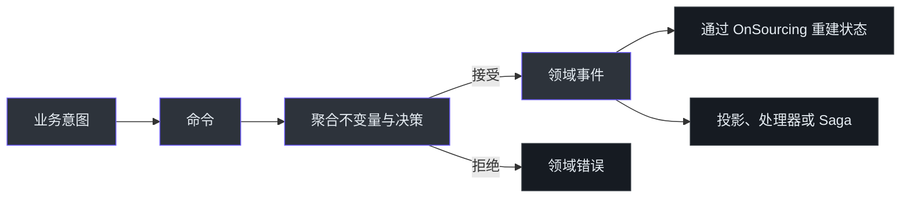
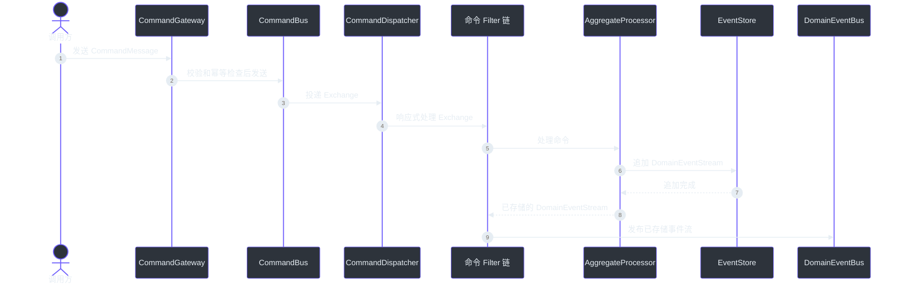
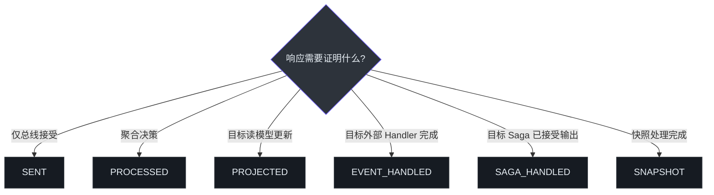
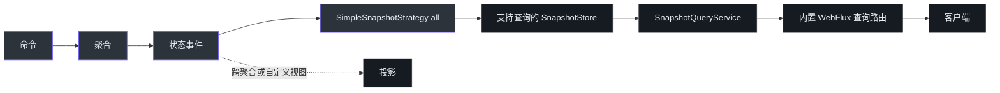
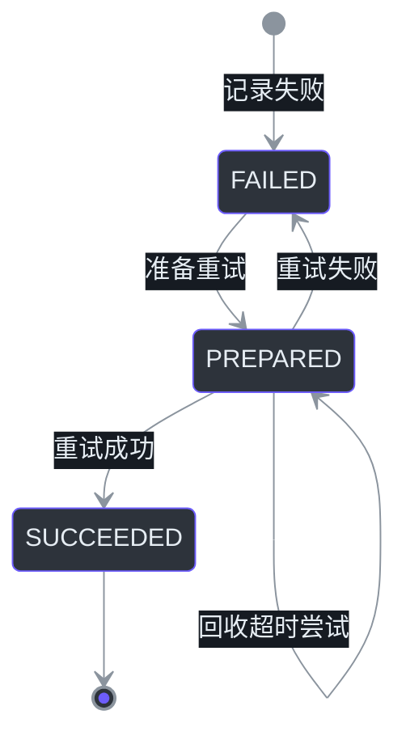

# 生产最佳实践

Wow 消除了 CQRS 与事件溯源的大量基础设施样板代码，但不会替你决定领域边界、一致性目标和失败策略。本指南将框架当前契约整理为一份可执行的生产检查清单。

## 实践地图

| 关注点 | 推荐默认做法 | 避免 | 来源 |
|---|---|---|---|
| 领域逻辑 | 在命令处理器中校验不变量，只通过事件变更状态 | CRUD 式公开状态修改 | [Cart.kt:38-76](https://github.com/Ahoo-Wang/Wow/blob/main/example/example-domain/src/main/kotlin/me/ahoo/wow/example/domain/cart/Cart.kt#L38-L76)、[CartState.kt:23-46](https://github.com/Ahoo-Wang/Wow/blob/main/example/example-domain/src/main/kotlin/me/ahoo/wow/example/domain/cart/CartState.kt#L23-L46) |
| 响应式执行 | 保持 Handler 与存储全链路非阻塞 | 在运行时路径中使用 `block()`、阻塞 I/O 或隐藏的线程等待 | [AggregateProcessorFilter.kt:31-49](https://github.com/Ahoo-Wang/Wow/blob/main/wow-core/src/main/kotlin/me/ahoo/wow/modeling/command/dispatcher/AggregateProcessorFilter.kt#L31-L49) |
| 命令结果 | 等待能够证明调用方业务目标的最小阶段 | 把 `SENT` 当成领域处理成功 | [CommandStage.kt:25-102](https://github.com/Ahoo-Wang/Wow/blob/main/wow-core/src/main/kotlin/me/ahoo/wow/command/wait/CommandStage.kt#L25-L102) |
| 重复请求 | 同一逻辑操作复用稳定的 `requestId` | 每次传输重试都生成新的请求 ID | [DefaultCommandGateway.kt:86-118](https://github.com/Ahoo-Wang/Wow/blob/main/wow-core/src/main/kotlin/me/ahoo/wow/command/DefaultCommandGateway.kt#L86-L118) |
| 并发 | 调用方必须拒绝陈旧写入时传递 `aggregateVersion` | 假设所有并发业务命令都可以互换 | [CommandMessage.kt:85-95](https://github.com/Ahoo-Wang/Wow/blob/main/wow-api/src/main/kotlin/me/ahoo/wow/api/command/CommandMessage.kt#L85-L95) |
| 快照 | 使用 `strategy: all`，让最新聚合状态直接作为默认查询存储 | 使用 `version_offset` 却要求每次查询都读到最新状态 | [SnapshotProperties.kt:23-45](https://github.com/Ahoo-Wang/Wow/blob/main/wow-spring-boot-starter/src/main/kotlin/me/ahoo/wow/spring/boot/starter/eventsourcing/snapshot/SnapshotProperties.kt#L23-L45) |
| 跨聚合流程 | 用 Saga 编排，用补偿处理可恢复失败 | 把 Saga 完成称为分布式事务提交 | [StatelessSagaFunction.kt:57-69](https://github.com/Ahoo-Wang/Wow/blob/main/wow-core/src/main/kotlin/me/ahoo/wow/saga/stateless/StatelessSagaFunction.kt#L57-L69) |

## 建模业务决策，而不是数据更新

| 元素 | 职责 | 经验规则 | 来源 |
|---|---|---|---|
| 命令 | 表达意图 | 使用业务动作命名，例如 `AddCartItem` | [Cart.kt:40-63](https://github.com/Ahoo-Wang/Wow/blob/main/example/example-domain/src/main/kotlin/me/ahoo/wow/example/domain/cart/Cart.kt#L40-L63) |
| 命令聚合 | 执行不变量并决定事实 | 返回领域事件，不直接暴露可变状态 | [Cart.kt:44-60](https://github.com/Ahoo-Wang/Wow/blob/main/example/example-domain/src/main/kotlin/me/ahoo/wow/example/domain/cart/Cart.kt#L44-L60) |
| 领域事件 | 记录已接受的业务事实 | 使用过去式名称，例如 `CartItemAdded` | [Cart.kt:50-60](https://github.com/Ahoo-Wang/Wow/blob/main/example/example-domain/src/main/kotlin/me/ahoo/wow/example/domain/cart/Cart.kt#L50-L60) |
| 状态聚合 | 确定性地重建状态 | 只在 `@OnSourcing` 函数中应用变更 | [CartState.kt:27-45](https://github.com/Ahoo-Wang/Wow/blob/main/example/example-domain/src/main/kotlin/me/ahoo/wow/example/domain/cart/CartState.kt#L27-L45) |

<!-- Sources: example/example-domain/src/main/kotlin/me/ahoo/wow/example/domain/cart/Cart.kt:38-76, example/example-domain/src/main/kotlin/me/ahoo/wow/example/domain/cart/CartState.kt:23-46 -->

聚合应当小到刚好能够保护不变量。如果两个概念不需要在一次原子决策中同时改变，就用事件和 Saga 连接它们，而不是扩大共享聚合。框架按 `AggregateId` 路由命令，Dispatcher 通过配置的 Scheduler 创建聚合专属处理流程（[CommandDispatcher.kt:37-75](https://github.com/Ahoo-Wang/Wow/blob/main/wow-core/src/main/kotlin/me/ahoo/wow/modeling/command/dispatcher/CommandDispatcher.kt#L37-L75)）。

## 保持响应式边界

| 层 | 框架契约 | 应用职责 | 来源 |
|---|---|---|---|
| Gateway 与 Bus | 基于 `Mono`/`Flux` 调度 | 组合异步步骤，不同步等待 | [DefaultCommandGateway.kt:129-143](https://github.com/Ahoo-Wang/Wow/blob/main/wow-core/src/main/kotlin/me/ahoo/wow/command/DefaultCommandGateway.kt#L129-L143) |
| Dispatcher | 接收 `Flux` 并按聚合路由 | 保持 Filter 非阻塞 | [CommandDispatcher.kt:46-75](https://github.com/Ahoo-Wang/Wow/blob/main/wow-core/src/main/kotlin/me/ahoo/wow/modeling/command/dispatcher/CommandDispatcher.kt#L46-L75) |
| 聚合处理 | 以 `Mono` 串联处理与确认 | 返回响应式工作，不在内部隐藏 I/O | [AggregateProcessorFilter.kt:31-49](https://github.com/Ahoo-Wang/Wow/blob/main/wow-core/src/main/kotlin/me/ahoo/wow/modeling/command/dispatcher/AggregateProcessorFilter.kt#L31-L49) |
| 事件存储 | 通过 `Mono`/`Flux` 追加和加载 | 使用框架提供的响应式存储 Adapter | [EventStore.kt:41-54](https://github.com/Ahoo-Wang/Wow/blob/main/wow-core/src/main/kotlin/me/ahoo/wow/eventsourcing/EventStore.kt#L41-L54) |

<!-- Sources: wow-core/src/main/kotlin/me/ahoo/wow/command/DefaultCommandGateway.kt:114-143, wow-core/src/main/kotlin/me/ahoo/wow/modeling/command/dispatcher/CommandDispatcher.kt:37-75, wow-core/src/main/kotlin/me/ahoo/wow/modeling/command/CommandAggregate.kt:65-82, wow-core/src/main/kotlin/me/ahoo/wow/modeling/command/dispatcher/SendDomainEventStreamFilter.kt:25-46 -->

当遗留 SDK 或数据库驱动只能阻塞调用时，将它隔离到有容量上限的 Adapter 和 Scheduler 中，并放在核心命令、事件存储、投影与 Saga 路径之外。这个边界应当是经过测量的例外，而不是默认编程模型。

## 等待真正需要的业务结果

| 阶段 | 能证明什么 | 不能证明什么 | 典型调用方 | 来源 |
|---|---|---|---|---|
| `SENT` | 命令总线接受了命令 | 聚合已处理 | 发送后另行观测的流程 | [CommandStage.kt:26-34](https://github.com/Ahoo-Wang/Wow/blob/main/wow-core/src/main/kotlin/me/ahoo/wow/command/wait/CommandStage.kt#L26-L34) |
| `PROCESSED` | 聚合处理了命令 | 投影或外部 Handler 完成 | 返回领域结果的写 API | [CommandStage.kt:36-44](https://github.com/Ahoo-Wang/Wow/blob/main/wow-core/src/main/kotlin/me/ahoo/wow/command/wait/CommandStage.kt#L36-L44) |
| `SNAPSHOT` | 快照处理完成；使用 `strategy: all` 时当前状态已保存 | 其他投影或外部读模型已更新；`version_offset` 可能跳过本次写入 | 使用 `all` 且查询同一可查询后端的写后读操作 | [CommandStage.kt:46-54](https://github.com/Ahoo-Wang/Wow/blob/main/wow-core/src/main/kotlin/me/ahoo/wow/command/wait/CommandStage.kt#L46-L54) |
| `PROJECTED` | 与可选函数目标匹配的 `PROJECTED` 信号 | 系统中所有投影都完成 | 需要写后读的 UI/API | [CommandStage.kt:56-65](https://github.com/Ahoo-Wang/Wow/blob/main/wow-core/src/main/kotlin/me/ahoo/wow/command/wait/CommandStage.kt#L56-L65) |
| `EVENT_HANDLED` | 与可选函数目标匹配的 `EVENT_HANDLED` 信号 | Saga 派生命令处理完成 | 依赖某一副作用的调用方 | [CommandStage.kt:67-75](https://github.com/Ahoo-Wang/Wow/blob/main/wow-core/src/main/kotlin/me/ahoo/wow/command/wait/CommandStage.kt#L67-L75) |
| `SAGA_HANDLED` | 匹配的 Saga 已处理源事件，若生成了命令则已被接受/发送 | 下游聚合完成或分布式事务提交 | 观测编排接受边界 | [CommandStage.kt:77-86](https://github.com/Ahoo-Wang/Wow/blob/main/wow-core/src/main/kotlin/me/ahoo/wow/command/wait/CommandStage.kt#L77-L86)、[StatelessSagaFunction.kt:57-69](https://github.com/Ahoo-Wang/Wow/blob/main/wow-core/src/main/kotlin/me/ahoo/wow/saga/stateless/StatelessSagaFunction.kt#L57-L69) |

对于 `PROJECTED`、`EVENT_HANDLED` 和 `SAGA_HANDLED`，当必须等待某个特定 Processor 时应提供函数目标。未提供时，等待目标会接受所请求阶段的信号，不执行函数匹配（[WaitPlan.kt:32-57](https://github.com/Ahoo-Wang/Wow/blob/main/wow-core/src/main/kotlin/me/ahoo/wow/command/wait/WaitPlan.kt#L32-L57)）。

<!-- Sources: wow-core/src/main/kotlin/me/ahoo/wow/command/wait/CommandStage.kt:25-102, wow-core/src/main/kotlin/me/ahoo/wow/saga/stateless/StatelessSagaFunction.kt:57-69 -->

优先选择足够但最窄的阶段：等待范围越宽，API 延迟和可用性与更多异步消费者耦合。默认等待截止时间是 30 秒，`WaitPlan.withTimeout` 修改的是调用方本地执行截止时间，不是传播到消息 Header 的超时（[WaitTimeout.kt:18-53](https://github.com/Ahoo-Wang/Wow/blob/main/wow-core/src/main/kotlin/me/ahoo/wow/command/wait/WaitTimeout.kt#L18-L53)）。根据调用方延迟预算设置明确超时；超时表示观测结果未知，不能证明命令从未被处理。

## 明确重试、并发与 LocalFirst 语义

| 机制 | 用途 | 边界 | 来源 |
|---|---|---|---|
| `requestId` | 对同一逻辑命令去重 | Gateway 在发送前按目标聚合与请求 ID 检查 | [DefaultCommandGateway.kt:86-118](https://github.com/Ahoo-Wang/Wow/blob/main/wow-core/src/main/kotlin/me/ahoo/wow/command/DefaultCommandGateway.kt#L86-L118) |
| `aggregateVersion` | 通过乐观并发拒绝陈旧命令 | 可为空；仅当领域允许陈旧写入时才省略 | [CommandMessage.kt:85-95](https://github.com/Ahoo-Wang/Wow/blob/main/wow-api/src/main/kotlin/me/ahoo/wow/api/command/CommandMessage.kt#L85-L95) |
| LocalFirst | 本地运行时准入后避免 Broker 延迟 | 不提供端到端 exactly-once 投递保证 | [LocalFirstMessageBus.kt:141-199](https://github.com/Ahoo-Wang/Wow/blob/main/wow-core/src/main/kotlin/me/ahoo/wow/messaging/LocalFirstMessageBus.kt#L141-L199) |
| 聚合重试 | 重试框架分类为可恢复的处理失败 | 当前 Processor 最多执行三次退避重试 | [RetryableAggregateProcessor.kt:30-70](https://github.com/Ahoo-Wang/Wow/blob/main/wow-core/src/main/kotlin/me/ahoo/wow/modeling/command/RetryableAggregateProcessor.kt#L30-L70) |

客户端重试同一业务请求时应保留 `requestId`，否则重复检查会看到一个新命令。当命令基于某个确定状态版本生成时，应使用 `aggregateVersion`——例如仅在订单自审核后未发生变化时批准订单。

对于符合条件的本地非空命令，LocalFirst 先尝试本地运行时准入，同时发送分布式副本。只有所有目标本地 Receiver 都确认准入后，副本才会标记为已在本地处理；否则仍可由分布式消费者处理。空命令会显式禁用 LocalFirst；本地准入成功后的 Handler 失败也不会追溯性地重新启用分布式副本（[LocalFirstCommandBus.kt:29-46](https://github.com/Ahoo-Wang/Wow/blob/main/wow-core/src/main/kotlin/me/ahoo/wow/command/LocalFirstCommandBus.kt#L29-L46)、[LocalFirstMessageBus.kt:141-199](https://github.com/Ahoo-Wang/Wow/blob/main/wow-core/src/main/kotlin/me/ahoo/wow/messaging/LocalFirstMessageBus.kt#L141-L199)）。Handler 重试与 Adapter 确认策略必须单独设计。

## 将快照作为默认查询存储

推荐使用 `strategy: all`。它会保存每个状态事件产生的状态，因此在 `SNAPSHOT` 阶段完成后，快照集合既是聚合加载检查点，也是当前状态的实时查询存储。对于单一聚合类型的标准查询，应用无需再编写投影处理器，把同一份状态复制到其他存储。

| 选择 | 查询语义 | 建议 | 来源 |
|---|---|---|---|
| `strategy: all` | 每个已处理状态事件都会更新最新快照 | 当前状态查询的推荐默认值 | [SnapshotAutoConfiguration.kt:67-92](https://github.com/Ahoo-Wang/Wow/blob/main/wow-spring-boot-starter/src/main/kotlin/me/ahoo/wow/spring/boot/starter/eventsourcing/snapshot/SnapshotAutoConfiguration.kt#L67-L92)、[SimpleSnapshotStrategy.kt:19-38](https://github.com/Ahoo-Wang/Wow/blob/main/wow-core/src/main/kotlin/me/ahoo/wow/eventsourcing/snapshot/SimpleSnapshotStrategy.kt#L19-L38) |
| `strategy: version_offset` | 已存快照最多可落后配置阈值允许的事件数 | 仅在允许快照查询陈旧，或另有读模型承载实时查询时使用 | [VersionOffsetSnapshotStrategy.kt:24-63](https://github.com/Ahoo-Wang/Wow/blob/main/wow-core/src/main/kotlin/me/ahoo/wow/eventsourcing/snapshot/VersionOffsetSnapshotStrategy.kt#L24-L63) |
| 自定义投影 | 维护面向特定查询的读模型 | 仅用于跨聚合关联、反范式视图、分析或外部系统 | [ProjectionHandler.kt:23-43](https://github.com/Ahoo-Wang/Wow/blob/main/wow-core/src/main/kotlin/me/ahoo/wow/projection/ProjectionHandler.kt#L23-L43) |

<!-- Sources: wow-core/src/main/kotlin/me/ahoo/wow/eventsourcing/snapshot/SimpleSnapshotStrategy.kt:19-38, wow-query/src/main/kotlin/me/ahoo/wow/query/snapshot/SnapshotQueryService.kt:30-61, wow-openapi/src/main/kotlin/me/ahoo/wow/openapi/contributor/aggregate/snapshot/SnapshotRouteContributor.kt:59-281, wow-spring-boot-starter/src/main/kotlin/me/ahoo/wow/spring/boot/starter/webflux/route/QueryRouteModule.kt:34-79 -->

启用 WebFlux 支持后，Wow 会提供 single、list、paged、count 以及只返回 state 的快照端点，应用无需再为这些标准查询形态手写 Controller（[SnapshotRouteContributor.kt:59-281](https://github.com/Ahoo-Wang/Wow/blob/main/wow-openapi/src/main/kotlin/me/ahoo/wow/openapi/contributor/aggregate/snapshot/SnapshotRouteContributor.kt#L59-L281)、[QueryRouteModule.kt:34-79](https://github.com/Ahoo-Wang/Wow/blob/main/wow-spring-boot-starter/src/main/kotlin/me/ahoo/wow/spring/boot/starter/webflux/route/QueryRouteModule.kt#L34-L79)）。同一个服务还会按聚合注册为 `<aggregate>.SnapshotQueryService`，供进程内查询使用（[SnapshotQueryServiceRegistrar.kt:28-61](https://github.com/Ahoo-Wang/Wow/blob/main/wow-spring/src/main/kotlin/me/ahoo/wow/spring/query/SnapshotQueryServiceRegistrar.kt#L28-L61)）。

这条读链路需要支持查询的快照后端：MongoDB 与 Elasticsearch 提供 `SnapshotQueryServiceFactory`；自定义后端必须提供对应的 factory binding。Redis 与内存快照存储能够保存/加载快照，但自身不实现动态快照查询。授权、租户/所有者过滤和数据库索引仍需显式设计。使用 `strategy: all` 且查询服务绑定同一后端时，需要写后读一致性的调用方应等待 `SNAPSHOT`，因为快照通过状态事件异步处理。该阶段本身只证明处理完成；`version_offset` 未达到阈值时可能完成但不写入。事件流仍是真相来源。

## 有意识地编排与补偿

| 场景 | 机制 | 必须做出的决策 | 来源 |
|---|---|---|---|
| 一个事件触发其他聚合命令 | 无状态 Saga | 定义命令幂等与下游观测边界 | [StatelessSagaFunction.kt:57-69](https://github.com/Ahoo-Wang/Wow/blob/main/wow-core/src/main/kotlin/me/ahoo/wow/saga/stateless/StatelessSagaFunction.kt#L57-L69) |
| 可恢复的异步执行失败 | 补偿 | 定义重试阈值、退避、超时和运维入口 | [CompensationProperties.kt:21-33](https://github.com/Ahoo-Wang/Wow/blob/main/compensation/wow-compensation-server/src/main/kotlin/me/ahoo/wow/compensation/server/configuration/CompensationProperties.kt#L21-L33) |
| 恢复到达终态 | 补偿状态 | 区分 `FAILED`、`PREPARED` 与 `SUCCEEDED` | [ExecutionFailedState.kt:44-85](https://github.com/Ahoo-Wang/Wow/blob/main/compensation/wow-compensation-domain/src/main/kotlin/me/ahoo/wow/compensation/domain/ExecutionFailedState.kt#L44-L85) |

<!-- Sources: compensation/wow-compensation-domain/src/main/kotlin/me/ahoo/wow/compensation/domain/ExecutionFailed.kt:59-106, compensation/wow-compensation-domain/src/main/kotlin/me/ahoo/wow/compensation/domain/ExecutionFailedState.kt:44-85, compensation/wow-compensation-api/src/main/kotlin/me/ahoo/wow/compensation/api/IExecutionFailedState.kt:138-164 -->

不要把 Saga 描述成 ACID 事务。Saga 完成观测的是源事件 Handler 与命令发送边界；下游聚合执行可能并发或稍后发生。对于补偿，应设置有限的重试次数与执行时间，把耗尽重试或不可恢复的任务暴露给运维人员，并保证被重试的副作用具备幂等性。

## 在足够窄的层次测试行为

| 测试层 | 断言内容 | 框架支持 | 来源 |
|---|---|---|---|
| 聚合规格 | 错误、事件类型/内容与最终状态 | `AggregateSpec` | [AggregateSpec.kt:32-70](https://github.com/Ahoo-Wang/Wow/blob/main/test/wow-test/src/main/kotlin/me/ahoo/wow/test/AggregateSpec.kt#L32-L70) |
| Saga 规格 | 源事件产生的命令 | `SagaSpec` | [SagaSpec.kt:28-70](https://github.com/Ahoo-Wang/Wow/blob/main/test/wow-test/src/main/kotlin/me/ahoo/wow/test/SagaSpec.kt#L28-L70) |
| Adapter 契约 | 消息总线、事件存储、快照、投影与查询行为 | `wow-tck` 规格 | [EventStoreSpec.kt:47-80](https://github.com/Ahoo-Wang/Wow/blob/main/test/wow-tck/src/main/kotlin/me/ahoo/wow/tck/eventsourcing/EventStoreSpec.kt#L47-L80) |
| 集成链路 | 序列化、生成契约、存储、Broker 与 Spring 装配 | 使用真实 Adapter 的 TCK 集成测试 | [KafkaMongoCommandDispatcher.kt:31-72](https://github.com/Ahoo-Wang/Wow/blob/main/test/wow-it/src/integrationTest/kotlin/me/ahoo/wow/it/KafkaMongoCommandDispatcher.kt#L31-L72) |

每条聚合规则都应有成功用例、拒绝用例和必要的状态迁移分支。Cart 规格展示了事件与状态断言，以及删除/恢复分支（[CartSpec.kt:28-86](https://github.com/Ahoo-Wang/Wow/blob/main/example/example-domain/src/test/kotlin/me/ahoo/wow/example/domain/cart/CartSpec.kt#L28-L86)）。只有基础设施行为相关时才增加更宽的集成测试，从而让失败保持局部、诊断保持精确。

## 生产就绪检查清单

| 门禁 | 就绪标准 | 应保留的证据 | 来源 |
|---|---|---|---|
| 领域 | 不变量和事件/状态迁移都有聚焦规格 | Aggregate 与 Saga 测试报告 | [CartSpec.kt:28-86](https://github.com/Ahoo-Wang/Wow/blob/main/example/example-domain/src/test/kotlin/me/ahoo/wow/example/domain/cart/CartSpec.kt#L28-L86) |
| 一致性 | 每个端点都记录等待阶段和超时 | API 契约与延迟预算 | [WaitTimeout.kt:18-53](https://github.com/Ahoo-Wang/Wow/blob/main/wow-core/src/main/kotlin/me/ahoo/wow/command/wait/WaitTimeout.kt#L18-L53) |
| 投递 | 重试、幂等、并发和 LocalFirst 边界明确 | 失败路径测试与 Adapter 设置 | [DefaultCommandGateway.kt:86-143](https://github.com/Ahoo-Wang/Wow/blob/main/wow-core/src/main/kotlin/me/ahoo/wow/command/DefaultCommandGateway.kt#L86-L143) |
| 快照查询 | 在支持查询的后端启用 `all`，并验证过滤、索引、路由与 `SNAPSHOT` 写后读行为 | 使用类生产数据的 API 测试与查询计划 | [SnapshotQueryService.kt:30-61](https://github.com/Ahoo-Wang/Wow/blob/main/wow-query/src/main/kotlin/me/ahoo/wow/query/snapshot/SnapshotQueryService.kt#L30-L61) |
| 恢复 | 重试耗尽与不可恢复失败有运维流程 | 补偿看板/Runbook | [IExecutionFailedState.kt:138-164](https://github.com/Ahoo-Wang/Wow/blob/main/compensation/wow-compensation-api/src/main/kotlin/me/ahoo/wow/compensation/api/IExecutionFailedState.kt#L138-L164) |
| 可观测性 | 命令等待、总线发送和存储调用可追踪 | 预发环境 Trace 与指标截图 | [TracingCommandGateway.kt:31-66](https://github.com/Ahoo-Wang/Wow/blob/main/wow-opentelemetry/src/main/kotlin/me/ahoo/wow/opentelemetry/wait/TracingCommandGateway.kt#L31-L66)、[TracingEventStore.kt:28-66](https://github.com/Ahoo-Wang/Wow/blob/main/wow-opentelemetry/src/main/kotlin/me/ahoo/wow/opentelemetry/eventsourcing/TracingEventStore.kt#L28-L66) |
| 生命周期 | 停机能在明确截止时间内排空已接受工作 | 部署终止测试 | [CommandDispatcher.kt:78-83](https://github.com/Ahoo-Wang/Wow/blob/main/wow-core/src/main/kotlin/me/ahoo/wow/modeling/command/dispatcher/CommandDispatcher.kt#L78-L83) |

只有在真实存储 Adapter、Broker、部署拓扑和数据分布上验证后才能发布。单元测试通过能够证明领域行为，但不能单独证明生产容量、恢复和停机行为。

## 相关页面

| 页面 | 关系 |
|---|---|
| [核心概念](./core-concepts.md) | 定义命令、事件、聚合与 CQRS |
| [聚合建模](./modeling.md) | 展示命令聚合与状态聚合的建模方法 |
| [命令网关](./command-gateway.md) | 说明等待计划与命令投递 |
| [快照](./snapshot.md) | 说明快照存储与策略 |
| [查询服务](./query.md) | 说明快照查询 DSL 与内置端点 |
| [分布式事务（Saga）](./saga.md) | 说明跨聚合编排 |
| [事件补偿](./event-compensation.md) | 说明失败恢复与运维流程 |
| [测试套件](./test-suite.md) | 说明 Aggregate 与 Saga 测试 DSL |
| [可观测性](./advanced/observability.md) | 说明 Trace 与运行时可观测性 |
