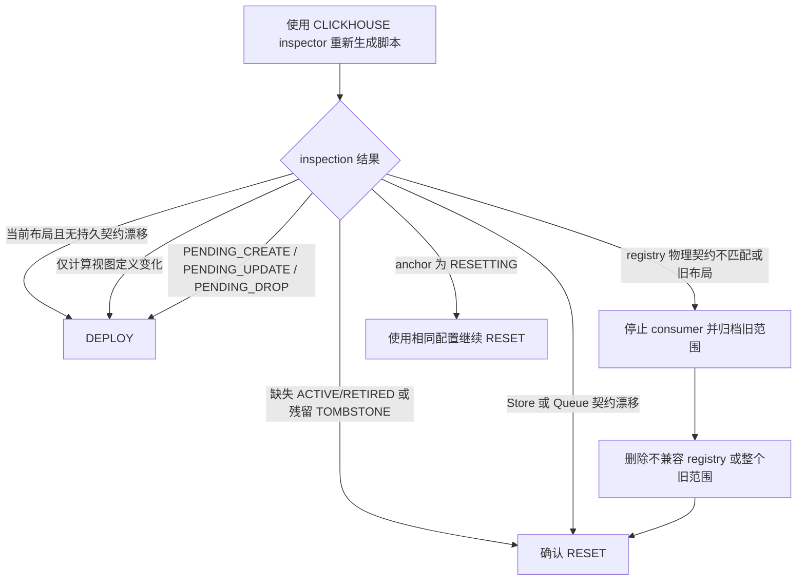

# BI 部署与恢复

本手册只适用于当前 BI 布局。BI 模块不读取旧布局、不执行原地迁移，也不承诺旧客户端、
旧 registry 或旧 SQL 的兼容性。

## 操作边界

- `DEPLOY`：非破坏性对账。可首次安装、补齐中断的创建/删除、更新计算视图，以及恢复缺失的
  Kafka ingress。
- `RESET`：破坏性重建。必须同时提交 `replayFromEarliestConfirmed=true`，并配置
  `consumerGroupNamespace`。
- SQL 执行器必须严格按返回顺序执行，并在第一条错误处停止。
- 同一物理 BI 对象命名空间只能有一个写者。生成、检查、执行三个阶段都必须纳入同一外部锁。
- `wow.bi.script.enabled` 默认开启，前提是 `/wow/bi/script` 仅通过安全网关暴露。

生产环境必须使用 `wow.bi.script.inspector.type=CLICKHOUSE`。默认的 NoOp inspector 只适合首次部署
或离线预览，不能安全执行 Reset 或清理旧对象。

## 操作决策

| 观测状态 | 操作 | 说明 |
|---|---|---|
| 首次部署，目标范围内没有旧 BI 对象 | `DEPLOY` | 建立当前布局、registry 与 `STABLE` anchor |
| 当前布局稳定且契约一致 | `DEPLOY` | 生成幂等对账 SQL |
| View 或 consumer materialized view 定义变化 | `DEPLOY` | registry 经 `PENDING_UPDATE` 更新后回到 `ACTIVE` |
| `PENDING_CREATE`、`PENDING_UPDATE` 或 `PENDING_DROP` | `DEPLOY` | 使用相同配置重新生成，不要重放旧 SQL |
| registry 引用的 `ACTIVE/RETIRED` 对象缺失，或 `TOMBSTONE` 对象仍存在 | 确认的 `RESET` | 普通 Deploy 会 fail-closed；Reset 使用 registry 的归属范围清理和重建 |
| Store、Kafka Queue 或拓扑契约漂移 | 确认的 `RESET` | 不执行原地变更 |
| registry Engine、复制路径、排序键、Comment 或列结构不匹配 | 手动归档/删除后 `RESET` | inspector 不信任不兼容 registry，不能直接从中推断归属 |
| anchor 为 `RESETTING` | 使用原配置继续 `RESET` | 保留已记录的 consumer identity；此时拒绝 Deploy |
| anchor 为 `STABLE` 但 Kafka ingress 不完整 | `DEPLOY` | 补齐 Queue 和 consumer materialized view |

## 发布前检查

1. 固定应用、`wow-bi` 和 OpenAPI 客户端版本，禁止新旧节点同时操作 BI 范围。
2. 确认安全网关保护 `/wow/bi/script`，或显式设置 `wow.bi.script.enabled=false`。
3. 配置 ClickHouse inspector、唯一的 `consumerGroupNamespace` 和正确的 ClickHouse 拓扑。
4. 确认 `database`、`consumerDatabase`、拓扑模式、cluster name、installation 和 topic 配置没有意外变化。
5. 停止旧 BI consumer，获取覆盖整个物理对象命名空间的外部互斥锁。
6. 备份或归档旧 BI 数据库、Kafka offset 证据和当前应用版本。
7. 确认新 consumer generation 的 `auto.offset.reset=earliest`；使用 Keeper offset 时确认 Keeper 可用。
8. 先生成并审阅脚本及 diagnostics，不得执行含未解释诊断的脚本。

## 执行 Deploy

1. 在持有外部锁的同一变更窗口中重新生成 `DEPLOY`。
2. 保存请求配置、diagnostics 和 SQL 摘要作为审计证据。
3. 严格顺序执行 SQL；第一条失败后立即停止。
4. 失败后重新 inspection 并生成新脚本。不得从失败位置猜测续跑，也不得重放原 SQL 文件。
5. 成功后检查 anchor 为 `STABLE`，registry 最新状态符合预期，Kafka ingress 已建立。

计算对象更新会先写入 `PENDING_UPDATE`，再修复 View 或 consumer materialized view，最后确认
`ACTIVE`。Store 与 Queue identity 不会因为计算视图更新而变化。

## 执行 Reset

Reset 会删除并重建归属范围内的数据和消费链路，只能在业务明确接受全量 Kafka 重放时执行：

1. 停止所有旧 consumer，并保持外部锁。
2. 验证备份、Kafka 保留期和 `auto.offset.reset=earliest`。
3. 以 `operation=RESET`、`replayFromEarliestConfirmed=true` 重新生成脚本。
4. 确认返回结果的 `destructive=true`，再逐条执行。
5. 若执行中断：
   - anchor 为 `RESETTING`：使用完全相同的物理范围配置重新生成 `RESET`；
   - anchor 已为 `STABLE`：生成 `DEPLOY` 补齐 ingress；
   - 不得重放原 Reset SQL。
6. Reset 完成后再执行一次 authoritative `DEPLOY`，建立并确认精确的当前 registry。

## 验收

- anchor 为 `STABLE`，且其 registry revision 不领先于 registry HEAD。
- registry 的 Engine、复制路径、排序键、Comment 和完整列结构通过 inspector 校验。
- 所需对象存在；没有残留的 `TOMBSTONE` 对象；registry 无未解释的 pending 状态。
- View 查询和 materialized view 的 `TO` target 与当前 renderer 定义一致。
- Kafka Queue 与 consumer materialized view 正常消费；抽样核对最早、最新 offset 和业务数据。
- 集群拓扑下所有副本的对象、Comment、Engine 和列结构一致。

## 回滚

BI 没有原地向后兼容回滚。旧版本可能无法识别当前 registry 状态，尤其不能在
`PENDING_UPDATE` 或 `RESETTING` 时直接回滚应用：

1. 首选使用当前版本完成 `DEPLOY` 或中断恢复。
2. 必须回退版本时，同时恢复旧应用、旧 BI 数据库和与其匹配的 offset/配置快照。
3. 不要让旧 inspector 读取当前 registry，也不要使用旧 SQL 覆盖当前布局。
4. 紧急隔离可设置 `wow.bi.script.enabled=false`，但这只移除 HTTP 路由、OpenAPI operation 和
   inspector，不会回滚 ClickHouse 数据。

版本升级的跨模块顺序参见[迁移指南](./migration)，配置项参见[BI 脚本配置](./configuration#bi-脚本配置)。
