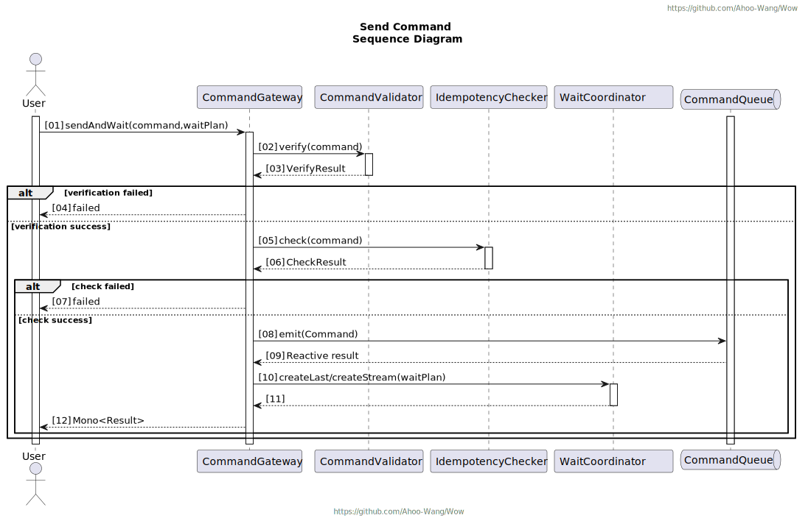
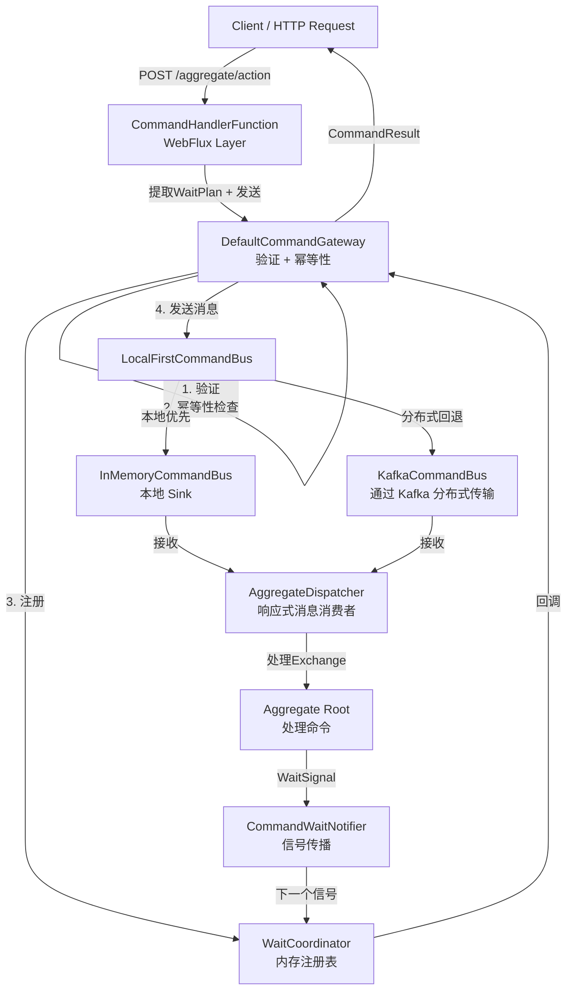
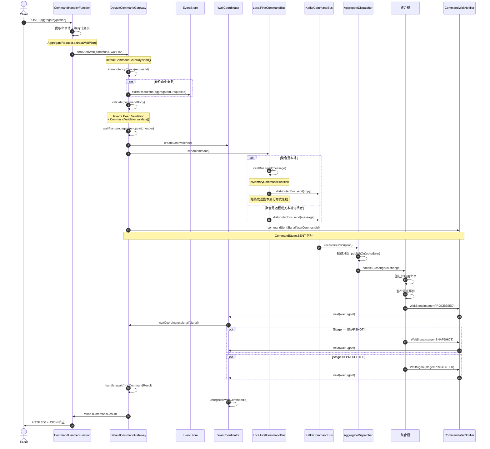
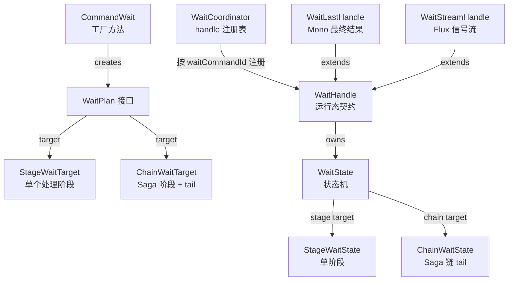

# 命令网关

命令网关是系统中接收和发送命令的核心组件，是命令的入口点。
它是命令总线的扩展，不仅负责命令传输，还增加了一系列重要职责，包括命令幂等性、等待计划和命令验证。

## 发送命令



## API 使用

`CommandGateway` 接口提供了多种发送命令并等待其结果的方法。以下是主要方法及其使用模式。

### 基础方法

:::tip
`toCommandMessage()` 扩展函数将命令体转换为 `CommandMessage`。该函数由 Wow 框架提供，负责设置命令 ID、聚合 ID 和其他元数据。
:::

#### sendAndWait(command, waitPlan)

发送命令并等待最终结果。如果命令失败，则抛出 `CommandResultException`。

```kotlin
val command = CreateAccount(balance = 1000, name = "John").toCommandMessage()
val waitPlan = CommandWait.processed(command.commandId)

commandGateway.sendAndWait(command, waitPlan)
    .doOnSuccess { result ->
        println("Command processed: ${result.commandId}")
        println("Aggregate Version: ${result.aggregateVersion}")
    }
    .subscribe()
```

#### sendAndWaitStream(command, waitPlan)

返回 `Flux<CommandResult>`，在命令经过不同阶段时提供实时流式更新。

```kotlin
val command = CreateAccount(balance = 1000, name = "John").toCommandMessage()
val waitPlan = CommandWait.snapshot(command.commandId)

commandGateway.sendAndWaitStream(command, waitPlan)
    .doOnNext { result ->
        println("Stage: ${result.stage} - Succeeded: ${result.succeeded}")
        println("Aggregate Version: ${result.aggregateVersion}")
    }
    .subscribe()
```

### 便捷方法

`CommandGateway` 提供了预配置常用等待计划的便捷方法：

```kotlin
val command = CreateAccount(balance = 1000, name = "John").toCommandMessage()

// 等待命令发送到总线
commandGateway.sendAndWaitForSent(command)
    .doOnSuccess { result ->
        println("Command sent: ${result.commandId}")
    }
    .subscribe()

// 等待命令被聚合根处理
commandGateway.sendAndWaitForProcessed(command)
    .doOnSuccess { result ->
        if (result.succeeded) {
            println("Command processed successfully: ${result.commandId}")
            println("New aggregate version: ${result.aggregateVersion}")
        }
    }
    .subscribe()

// 等待聚合快照创建
commandGateway.sendAndWaitForSnapshot(command)
    .doOnSuccess { result ->
        println("Snapshot created for aggregate: ${result.aggregateId}")
    }
    .subscribe()
```

## 核心概念

### CommandResult

`CommandResult` 表示命令在特定处理阶段的执行结果。它包含有关命令处理结果的全面信息。

| 属性 | 类型 | 描述 | Source |
|----------|------|-------------|--------|
| `id` | `String` | 此结果的唯一标识符 | [CommandResult.kt:69](https://github.com/Ahoo-Wang/Wow/blob/main/wow-core/src/main/kotlin/me/ahoo/wow/command/CommandResult.kt#L69) |
| `waitCommandId` | `String` | 正在等待的命令 ID | [CommandResult.kt:69](https://github.com/Ahoo-Wang/Wow/blob/main/wow-core/src/main/kotlin/me/ahoo/wow/command/CommandResult.kt#L69) |
| `stage` | `CommandStage` | 当前处理阶段（SENT、PROCESSED、SNAPSHOT 等） | [CommandResult.kt:69](https://github.com/Ahoo-Wang/Wow/blob/main/wow-core/src/main/kotlin/me/ahoo/wow/command/CommandResult.kt#L69) |
| `contextName` | `String` | 限界上下文名称 | [CommandResult.kt:69](https://github.com/Ahoo-Wang/Wow/blob/main/wow-core/src/main/kotlin/me/ahoo/wow/command/CommandResult.kt#L69) |
| `aggregateName` | `String` | 聚合名称 | [CommandResult.kt:69](https://github.com/Ahoo-Wang/Wow/blob/main/wow-core/src/main/kotlin/me/ahoo/wow/command/CommandResult.kt#L69) |
| `tenantId` | `String` | 租户标识符 | [CommandResult.kt:69](https://github.com/Ahoo-Wang/Wow/blob/main/wow-core/src/main/kotlin/me/ahoo/wow/command/CommandResult.kt#L69) |
| `aggregateId` | `String` | 聚合实例标识符 | [CommandResult.kt:69](https://github.com/Ahoo-Wang/Wow/blob/main/wow-core/src/main/kotlin/me/ahoo/wow/command/CommandResult.kt#L69) |
| `aggregateVersion` | `Int?` | 处理后的聚合版本（网关验证失败或处理前为 null） | [CommandResult.kt:69](https://github.com/Ahoo-Wang/Wow/blob/main/wow-core/src/main/kotlin/me/ahoo/wow/command/CommandResult.kt#L69) |
| `requestId` | `String` | 用于幂等性的请求标识符 | [CommandResult.kt:69](https://github.com/Ahoo-Wang/Wow/blob/main/wow-core/src/main/kotlin/me/ahoo/wow/command/CommandResult.kt#L69) |
| `commandId` | `String` | 命令标识符 | [CommandResult.kt:69](https://github.com/Ahoo-Wang/Wow/blob/main/wow-core/src/main/kotlin/me/ahoo/wow/command/CommandResult.kt#L69) |
| `function` | `FunctionInfoData` | 处理函数的信息 | [CommandResult.kt:69](https://github.com/Ahoo-Wang/Wow/blob/main/wow-core/src/main/kotlin/me/ahoo/wow/command/CommandResult.kt#L69) |
| `errorCode` | `String` | 错误码（成功时为 "Ok"） | [CommandResult.kt:69](https://github.com/Ahoo-Wang/Wow/blob/main/wow-core/src/main/kotlin/me/ahoo/wow/command/CommandResult.kt#L69) |
| `errorMsg` | `String` | 错误消息（成功时为空） | [CommandResult.kt:69](https://github.com/Ahoo-Wang/Wow/blob/main/wow-core/src/main/kotlin/me/ahoo/wow/command/CommandResult.kt#L69) |
| `bindingErrors` | `List<BindingError>` | 验证错误列表 | [CommandResult.kt:69](https://github.com/Ahoo-Wang/Wow/blob/main/wow-core/src/main/kotlin/me/ahoo/wow/command/CommandResult.kt#L69) |
| `result` | `Map<String, Any>` | 额外的结果数据 | [CommandResult.kt:69](https://github.com/Ahoo-Wang/Wow/blob/main/wow-core/src/main/kotlin/me/ahoo/wow/command/CommandResult.kt#L69) |
| `signalTime` | `Long` | 此结果生成的时间戳 | [CommandResult.kt:69](https://github.com/Ahoo-Wang/Wow/blob/main/wow-core/src/main/kotlin/me/ahoo/wow/command/CommandResult.kt#L69) |
| `succeeded` | `Boolean` | 命令处理是否成功 | [CommandResult.kt:69](https://github.com/Ahoo-Wang/Wow/blob/main/wow-core/src/main/kotlin/me/ahoo/wow/command/CommandResult.kt#L69) |

`CommandResult` 通过 `toResult()` 扩展函数从 `WaitSignal` 创建，该函数将信号字段映射到结果字段，并添加来自原始命令消息的 `requestId`。

### WaitSignal 与 CommandResult

- **WaitSignal**：在等待计划基础设施中使用的内部接口。包含处理阶段信息，用于组件之间的信号传递。
- **CommandResult**：命令结果的公共 API。从 `WaitSignal` 创建，包含额外的上下文信息，如 `requestId` 和格式化的聚合信息。

### CommandGateway 与 CommandBus

`CommandGateway` 扩展了 `CommandBus`，增加了额外的高级功能：

| 功能 | CommandBus | CommandGateway |
|---------|------------|----------------|
| 发送命令 | 是 | 是 |
| 等待计划 | 否 | 是 |
| 命令验证 | 否 | 是 |
| 幂等性检查 | 否 | 是 |
| 实时结果流式传输 | 否 | 是 |
| 便捷方法 | 否 | 是 |

当只需要基本命令路由时使用 `CommandBus`。使用 `CommandGateway` 可以获取带等待计划和验证的完整命令处理功能。

```kotlin
// CommandBus - 仅基本路由
interface CommandBus : MessageBus<CommandMessage<*>, ServerCommandExchange<*>>

// CommandGateway - 扩展 CommandBus，增加额外功能
interface CommandGateway : CommandBus {
    fun <C : Any> sendAndWait(command: CommandMessage<C>, waitPlan: WaitPlan): Mono<CommandResult>
    fun <C : Any> sendAndWaitStream(command: CommandMessage<C>, waitPlan: WaitPlan): Flux<CommandResult>
    // ... 便捷方法
}
```

## 架构

命令基础设施构建于分层架构之上，将 API 契约、网关（验证/幂等性）、消息总线（传输）和聚合分发器（处理）的关注点分离。

### 组件架构



<!-- Sources:
- CommandHandlerFunction: wow-webflux/src/main/kotlin/me/ahoo/wow/webflux/route/command/CommandHandlerFunction.kt:39-63
- DefaultCommandGateway: wow-core/src/main/kotlin/me/ahoo/wow/command/DefaultCommandGateway.kt:45-246
- LocalFirstCommandBus: wow-core/src/main/kotlin/me/ahoo/wow/command/LocalFirstCommandBus.kt:29-47
- InMemoryCommandBus: wow-core/src/main/kotlin/me/ahoo/wow/command/InMemoryCommandBus.kt:31-50
- KafkaCommandBus: wow-kafka/src/main/kotlin/me/ahoo/wow/kafka/KafkaCommandBus.kt:27-45
- AggregateDispatcher: wow-core/src/main/kotlin/me/ahoo/wow/messaging/dispatcher/AggregateDispatcher.kt:80-275
- WaitCoordinator: wow-core/src/main/kotlin/me/ahoo/wow/command/wait/WaitCoordinator.kt:18-72
-->

### 消息总线层级

`MessageBus` 接口定义了基本契约：发送消息并为一组命名聚合接收消息。它被特化为三个层级：

| 总线类型 | 接口 | 用途 | Source |
|---|---|---|---|
| **本地** | `LocalMessageBus` | 单 JVM、通过 Reactor `Sinks` 进行内存消息传递 | [MessageBus.kt:64](https://github.com/Ahoo-Wang/Wow/blob/main/wow-core/src/main/kotlin/me/ahoo/wow/messaging/MessageBus.kt#L64) |
| **分布式** | `DistributedMessageBus` | 跨实例消息传递（Kafka） | [MessageBus.kt:83](https://github.com/Ahoo-Wang/Wow/blob/main/wow-core/src/main/kotlin/me/ahoo/wow/messaging/MessageBus.kt#L83) |
| **本地优先** | `LocalFirstMessageBus` | 混合：本地总线优先，分布式回退 | [LocalFirstMessageBus.kt:99](https://github.com/Ahoo-Wang/Wow/blob/main/wow-core/src/main/kotlin/me/ahoo/wow/messaging/LocalFirstMessageBus.kt#L99) |

对于命令领域，`CommandBus` 扩展了 `MessageBus`，并固定 `TopicKind.COMMAND` 并缩小了泛型类型：

- `LocalCommandBus` 同时扩展了 `CommandBus` 和 `LocalMessageBus`。
- `DistributedCommandBus` 同时扩展了 `CommandBus` 和 `DistributedMessageBus`。
- `LocalFirstCommandBus` 扩展了 `CommandBus` 并使用 `LocalFirstMessageBus` 委托，自动为空命令禁用本地优先。

### 速查参考

| 组件 | 职责 | 关键文件 | Source |
|---|---|---|---|
| `CommandMessage` | 封装命令体、聚合 ID、版本、幂等性元数据 | `wow-api/.../command/CommandMessage.kt` | [Source](https://github.com/Ahoo-Wang/Wow/blob/main/wow-api/src/main/kotlin/me/ahoo/wow/api/command/CommandMessage.kt#L53) |
| `CommandGateway` | 高级发送 API，带有验证、幂等性、等待计划 | `wow-core/.../command/CommandGateway.kt` | [Source](https://github.com/Ahoo-Wang/Wow/blob/main/wow-core/src/main/kotlin/me/ahoo/wow/command/CommandGateway.kt#L75) |
| `DefaultCommandGateway` | `CommandGateway` 的具体实现 | `wow-core/.../command/DefaultCommandGateway.kt` | [Source](https://github.com/Ahoo-Wang/Wow/blob/main/wow-core/src/main/kotlin/me/ahoo/wow/command/DefaultCommandGateway.kt#L45) |
| `CommandBus` | 用于路由命令的核心消息总线抽象 | `wow-core/.../command/CommandBus.kt` | [Source](https://github.com/Ahoo-Wang/Wow/blob/main/wow-core/src/main/kotlin/me/ahoo/wow/command/CommandBus.kt#L36) |
| `InMemoryCommandBus` | 使用 Reactor sinks 的本地内存总线（单播） | `wow-core/.../command/InMemoryCommandBus.kt` | [Source](https://github.com/Ahoo-Wang/Wow/blob/main/wow-core/src/main/kotlin/me/ahoo/wow/command/InMemoryCommandBus.kt#L31) |
| `LocalFirstCommandBus` | 先尝试本地总线，回退到分布式总线 | `wow-core/.../command/LocalFirstCommandBus.kt` | [Source](https://github.com/Ahoo-Wang/Wow/blob/main/wow-core/src/main/kotlin/me/ahoo/wow/command/LocalFirstCommandBus.kt#L29) |
| `KafkaCommandBus` | 基于 Apache Kafka 的分布式命令总线 | `wow-kafka/.../KafkaCommandBus.kt` | [Source](https://github.com/Ahoo-Wang/Wow/blob/main/wow-kafka/src/main/kotlin/me/ahoo/wow/kafka/KafkaCommandBus.kt#L27) |
| `WaitPlan` | 定义等待命令结果的时长和阶段 | `wow-core/.../command/wait/WaitPlan.kt` | [Source](https://github.com/Ahoo-Wang/Wow/blob/main/wow-core/src/main/kotlin/me/ahoo/wow/command/wait/WaitPlan.kt#L60) |
| `CommandWait` | 单阶段等待计划工厂（SENT、PROCESSED、SNAPSHOT 等） | `wow-core/.../command/wait/CommandWait.kt` | [Source](https://github.com/Ahoo-Wang/Wow/blob/main/wow-core/src/main/kotlin/me/ahoo/wow/command/wait/CommandWait.kt#L33) |
| `SimpleWaitingChain` | 多阶段链（例如 SAGA_HANDLED 然后 SNAPSHOT） | `wow-core/.../command/wait/chain/SimpleWaitingChain.kt` | [Source](https://github.com/Ahoo-Wang/Wow/blob/main/wow-core/src/main/kotlin/me/ahoo/wow/command/wait/chain/SimpleWaitingChain.kt#L36) |
| `CommandHandlerFunction` | 将 HTTP 请求桥接到 `CommandGateway` 的 Spring WebFlux 处理器 | `wow-webflux/.../command/CommandHandlerFunction.kt` | [Source](https://github.com/Ahoo-Wang/Wow/blob/main/wow-webflux/src/main/kotlin/me/ahoo/wow/webflux/route/command/CommandHandlerFunction.kt#L39) |
| `AggregateDispatcher` | 按聚合从总线消费消息的响应式分发器 | `wow-core/.../messaging/dispatcher/AggregateDispatcher.kt` | [Source](https://github.com/Ahoo-Wang/Wow/blob/main/wow-core/src/main/kotlin/me/ahoo/wow/messaging/dispatcher/AggregateDispatcher.kt#L80) |

## 命令处理链

以下时序图追踪了命令从 HTTP 请求到最终 `CommandResult` 的每个处理阶段。每个步骤都标注了负责的文件和方法。



<!-- Sources:
- CommandHandler.handle(): wow-webflux/src/main/kotlin/me/ahoo/wow/webflux/route/command/CommandHandler.kt:26-60
- DefaultCommandGateway.send(): wow-core/src/main/kotlin/me/ahoo/wow/command/DefaultCommandGateway.kt:114-126
- DefaultCommandGateway.sendAndWait()/sendAndWaitStream(): wow-core/src/main/kotlin/me/ahoo/wow/command/DefaultCommandGateway.kt:138-185
- LocalFirstCommandBus.send(): wow-core/src/main/kotlin/me/ahoo/wow/command/LocalFirstCommandBus.kt:41-46
- LocalFirstMessageBus.send(): wow-core/src/main/kotlin/me/ahoo/wow/messaging/LocalFirstMessageBus.kt:130-149
- AbstractKafkaBus.receive(): wow-kafka/src/main/kotlin/me/ahoo/wow/kafka/AbstractKafkaBus.kt:78-95
- AggregateDispatcher.start(): wow-core/src/main/kotlin/me/ahoo/wow/messaging/dispatcher/AggregateDispatcher.kt:163-173
-->

### DefaultCommandGateway：发送前管道

`DefaultCommandGateway` 在命令到达总线之前强制执行严格的发送前管道：

1. **幂等性检查** -- 获取聚合类型的 `IdempotencyChecker`，先快速预检 `requestId`。当预检命中重复时，网关会通过 `EventStore.existsRequestId(aggregateId, requestId)` 进行确认，只有事件存储也确认存在时才抛出 `DuplicateRequestIdException`，避免 BloomFilter 等预检结构的误判阻断合法命令。

2. **验证** -- 两阶段验证：
   - **自验证**：如果命令体实现了 `CommandValidator`，则首先调用其 `validate()` 方法。这允许进行特定于领域的编程验证。
   - **Jakarta Bean Validation**：通过配置的 `jakarta.validation.Validator`，根据 `@NotBlank`、`@Min`、`@Max` 等 Jakarta 注解验证命令体。

两项检查都在 `check()` 方法中实现，位于 [DefaultCommandGateway.kt:99](https://github.com/Ahoo-Wang/Wow/blob/main/wow-core/src/main/kotlin/me/ahoo/wow/command/DefaultCommandGateway.kt#L99)。

### DefaultCommandGateway：发送后信号

命令被命令总线接受后，网关通过 `CommandWaitNotifier` 发布 `CommandStage.SENT` 等待信号。无论成功或失败，此信号都会被发布——如果发送过程中发生错误，信号会携带错误信息。

对于重载的 `send(message)`（没有显式 `WaitPlan`），网关从消息头中提取等待计划（如果有传播的话）并发布 SENT 信号。参见 [DefaultCommandGateway.kt:114-126](https://github.com/Ahoo-Wang/Wow/blob/main/wow-core/src/main/kotlin/me/ahoo/wow/command/DefaultCommandGateway.kt#L114)。

## 错误处理

### CommandResultException

当命令处理失败时，`sendAndWait` 会抛出包含完整 `CommandResult` 和错误详情的 `CommandResultException`。

```kotlin
commandGateway.sendAndWait(command, waitPlan)
    .doOnError { error ->
        if (error is CommandResultException) {
            val result = error.commandResult
            println("Command failed at stage: ${result.stage}")
            println("Error code: ${result.errorCode}")
            println("Error message: ${result.errorMsg}")
            
            // 检查验证错误
            if (result.bindingErrors.isNotEmpty()) {
                result.bindingErrors.forEach { bindingError ->
                    println("Field '${bindingError.name}': ${bindingError.msg}")
                }
            }
        }
    }
    .onErrorResume { error ->
        // 优雅处理错误
        when (error) {
            is CommandResultException -> {
                // 记录日志并返回回退值
                Mono.empty()
            }
            else -> Mono.error(error)
        }
    }
    .subscribe()
```

### CommandValidationException

在命令发送前验证失败时抛出。包含验证约束违规信息。

```kotlin
// 带验证注解的命令
data class CreateAccount(
    @field:NotBlank(message = "Name is required")
    val name: String,
    @field:Min(value = 0, message = "Balance must be non-negative")
    val balance: Int
)

commandGateway.sendAndWaitForProcessed(command)
    .doOnError { error ->
        if (error is CommandValidationException) {
            println("Validation failed for command: ${error.command}")
            error.bindingErrors.forEach { bindingError ->
                println("Field '${bindingError.name}': ${bindingError.msg}")
            }
        }
    }
    .subscribe()
```

### DuplicateRequestIdException

当尝试处理具有已处理过的请求 ID 的命令时抛出。

```kotlin
commandGateway.sendAndWaitForProcessed(command)
    .doOnError { error ->
        if (error is DuplicateRequestIdException) {
            println("Duplicate request: ${error.requestId}")
            println("Aggregate: ${error.aggregateId}")
        }
    }
    .onErrorResume(DuplicateRequestIdException::class.java) { error ->
        // 返回缓存结果或忽略重复
        Mono.empty()
    }
    .subscribe()
```

### 异常参考

| 异常 | 抛出时机 | 包含的内容 | Source |
|---|---|---|---|
| `DuplicateRequestIdException` | 具有相同 `requestId` 的命令已被处理 | `aggregateId`、`requestId` | [CommandExceptions.kt:39](https://github.com/Ahoo-Wang/Wow/blob/main/wow-core/src/main/kotlin/me/ahoo/wow/command/CommandExceptions.kt#L39) |
| `CommandValidationException` | Jakarta Bean Validation 或 `CommandValidator.validate()` 失败 | `command` 对象、`bindingErrors` | [CommandExceptions.kt:90](https://github.com/Ahoo-Wang/Wow/blob/main/wow-core/src/main/kotlin/me/ahoo/wow/command/CommandExceptions.kt#L90) |
| `CommandResultException` | 命令在聚合处理期间失败 | 完整的 `CommandResult`，包含 `errorCode`、`errorMsg`、`bindingErrors` | [CommandExceptions.kt:63](https://github.com/Ahoo-Wang/Wow/blob/main/wow-core/src/main/kotlin/me/ahoo/wow/command/CommandExceptions.kt#L63) |

### 错误处理最佳实践

1. **使用特定的异常处理器**：分别处理 `CommandResultException`、`CommandValidationException` 和 `DuplicateRequestIdException` 以提供适当的响应。

2. **记录错误详情**：始终记录 `errorCode`、`errorMsg` 和 `bindingErrors` 以便调试。

3. **为瞬时故障实现重试逻辑**：

```kotlin
commandGateway.sendAndWaitForProcessed(command)
    .retryWhen(Retry.backoff(3, Duration.ofSeconds(1))
        .filter { error -> isTransientError(error) })
    .subscribe()

// 瞬时错误通常是网络或临时基础设施问题
// 不要重试验证错误或重复请求错误
fun isTransientError(error: Throwable): Boolean {
    return when (error) {
        is CommandValidationException -> false  // 验证错误重试不会成功
        is DuplicateRequestIdException -> false // 重复请求不应重试
        is CommandResultException -> false      // 来自聚合的业务逻辑错误
        else -> true                            // 网络/基础设施错误可能是瞬时的
    }
}
```

4. **处理超时场景**：为等待计划配置适当的超时时间。

```kotlin
commandGateway.sendAndWaitForProcessed(command)
    .timeout(Duration.ofSeconds(30))
    .doOnError(TimeoutException::class.java) { error ->
        println("Command processing timed out")
    }
    .subscribe()
```

## 幂等性

命令幂等性是确保同一命令在系统中最多执行一次的原则。

命令网关使用 `IdempotencyChecker` 来检查命令的 `RequestId` 以实现幂等性。
如果命令已被执行，将抛出 `DuplicateRequestIdException` 异常以防止同一命令的重复执行。

以下是一个 HTTP 请求示例，展示了如何在请求中使用 `Command-Request-Id` 来确保命令幂等性：

:::tip
开发者也可以通过 `CommandMessage` 的 `requestId` 属性自定义 `RequestId`。
:::

::: code-group
```shell {6} [Http Request]
curl -X 'POST' \
  'http://localhost:8080/account/create_account' \
  -H 'accept: application/json' \
  -H 'Command-Wait-Stage: SNAPSHOT' \
  -H 'Command-Aggregate-Id: sourceId' \
  -H 'Command-Request-Id: {{$uuid}}' \
  -H 'Content-Type: application/json' \
  -d '{
  "balance": 1000,
  "name": "source"
}'
```

```json [Response]
{
  "id": "0V3oAWI60001003",
  "waitCommandId": "0V3oAWGt0001001",
  "stage": "SNAPSHOT",
  "contextName": "transfer-service",
  "aggregateName": "account",
  "tenantId": "(0)",
  "aggregateId": "sourceId",
  "aggregateVersion": 1,
  "requestId": "0V3oAWGt0001001",
  "commandId": "0V3oAWGt0001001",
  "function": {
    "functionKind": "STATE_EVENT",
    "contextName": "wow",
    "processorName": "SnapshotDispatcher",
    "name": "save"
  },
  "errorCode": "Ok",
  "errorMsg": "",
  "result": {},
  "signalTime": 1764297025846,
  "succeeded": true
}
```
:::

### 配置

```yaml {5-10}
wow:
  command:
    bus:
      type: kafka
    idempotency:
      enabled: true
      bloom-filter:
        expected-insertions: 1000000
        ttl: PT60S
        fpp: 0.00001
```

## 等待计划

*命令等待计划* 是指命令网关在发送命令后等待命令执行结果的计划。

*命令等待计划* 是 _Wow_ 框架中的重要功能，旨在解决 _CQRS_ 和读写分离模式中的数据同步延迟问题。

目前支持的命令等待计划包括：

### CommandWait

<p align="center" style="text-align:center;">
  
</p>

`CommandWait` 支持的等待信号如下：

- `SENT`：命令发布到命令总线/队列时生成完成信号
- `PROCESSED`：命令被聚合根处理时生成完成信号
- `SNAPSHOT`：快照生成时生成完成信号
- `PROJECTED`：命令产生的事件的 *投影* 完成时生成完成信号
- `EVENT_HANDLED`：命令产生的事件被 *事件处理器* 处理时生成完成信号
- `SAGA_HANDLED`：命令产生的事件被 *Saga* 处理时生成完成信号

::: code-group
```shell {4} [Http Request]
curl -X 'POST' \
  'http://localhost:8080/account/create_account' \
  -H 'accept: application/json' \
  -H 'Command-Wait-Stage: SNAPSHOT' \
  -H 'Command-Aggregate-Id: targetId' \
  -H 'Content-Type: application/json' \
  -d '{
  "balance": 1000,
  "name": "target"
}'
```

```json [Response]
{
  "id": "0V3oAdHd0001007",
  "waitCommandId": "0V3oAdHV0001005",
  "stage": "SNAPSHOT",
  "contextName": "transfer-service",
  "aggregateName": "account",
  "tenantId": "(0)",
  "aggregateId": "targetId",
  "aggregateVersion": 1,
  "requestId": "0V3oAdHV0001005",
  "commandId": "0V3oAdHV0001005",
  "function": {
    "functionKind": "STATE_EVENT",
    "contextName": "wow",
    "processorName": "SnapshotDispatcher",
    "name": "save"
  },
  "errorCode": "Ok",
  "errorMsg": "",
  "result": {},
  "signalTime": 1764297052692,
  "succeeded": true
}
```
```text [SSE Response]
id:0V3oCwcv0001002
event:SENT
data:{"id":"0V3oCwcv0001002","waitCommandId":"0V3oCwbn0001001","stage":"SENT","contextName":"transfer-service","aggregateName":"account","tenantId":"(0)","aggregateId":"targetId","aggregateVersion":0,"requestId":"0V3oCwbn0001001","commandId":"0V3oCwbn0001001","function":{"functionKind":"COMMAND","contextName":"wow","processorName":"CommandGateway","name":"send"},"errorCode":"Ok","errorMsg":"","result":{},"signalTime":1764297603701,"succeeded":true}

id:0V3oCwbn0001001
event:PROCESSED
data:{"id":"0V3oCwbn0001001","waitCommandId":"0V3oCwbn0001001","stage":"PROCESSED","contextName":"transfer-service","aggregateName":"account","tenantId":"(0)","aggregateId":"targetId","aggregateVersion":1,"requestId":"0V3oCwbn0001001","commandId":"0V3oCwbn0001001","function":{"functionKind":"COMMAND","contextName":"transfer-service","processorName":"Account","name":"onCommand"},"errorCode":"Ok","errorMsg":"","result":{},"signalTime":1764297603737,"succeeded":true}

id:0V3oCwdB0001003
event:SNAPSHOT
data:{"id":"0V3oCwdB0001003","waitCommandId":"0V3oCwbn0001001","stage":"SNAPSHOT","contextName":"transfer-service","aggregateName":"account","tenantId":"(0)","aggregateId":"targetId","aggregateVersion":1,"requestId":"0V3oCwbn0001001","commandId":"0V3oCwbn0001001","function":{"functionKind":"STATE_EVENT","contextName":"wow","processorName":"SnapshotDispatcher","name":"save"},"errorCode":"Ok","errorMsg":"","result":{},"signalTime":1764297603754,"succeeded":true}
```
```kotlin {1}
commamdGateway.sendAndWaitForProcessed(message)
```
:::

#### 等待阶段对比

| 阶段 | 前置条件 | 返回时机 | 支持空命令 | `shouldWaitFunction` | 典型用例 | Source |
|---|---|---|---|---|---|---|
| `SENT` | 无 | 命令被总线/队列接受 | 是 | 否 | 发后即忘；最快响应 | [CommandStage.kt:32](https://github.com/Ahoo-Wang/Wow/blob/main/wow-core/src/main/kotlin/me/ahoo/wow/command/wait/CommandStage.kt#L32) |
| `PROCESSED` | `[SENT]` | 聚合执行完成 | 否 | 否 | 默认；速度与一致性平衡 | [CommandStage.kt:40](https://github.com/Ahoo-Wang/Wow/blob/main/wow-core/src/main/kotlin/me/ahoo/wow/command/wait/CommandStage.kt#L40) |
| `SNAPSHOT` | `[SENT, PROCESSED]` | 快照已持久化 | 否 | 否 | 冷启动性能；写后读 | [CommandStage.kt:53](https://github.com/Ahoo-Wang/Wow/blob/main/wow-core/src/main/kotlin/me/ahoo/wow/command/wait/CommandStage.kt#L53) |
| `PROJECTED` | `[SENT, PROCESSED]` | 投影（读模型）已更新 | 否 | 是 | 读模型一致性；UI 刷新 | [CommandStage.kt:62](https://github.com/Ahoo-Wang/Wow/blob/main/wow-core/src/main/kotlin/me/ahoo/wow/command/wait/CommandStage.kt#L62) |
| `EVENT_HANDLED` | `[SENT, PROCESSED]` | 外部事件处理器完成 | 否 | 是 | 副作用处理；通知 | [CommandStage.kt:72](https://github.com/Ahoo-Wang/Wow/blob/main/wow-core/src/main/kotlin/me/ahoo/wow/command/wait/CommandStage.kt#L72) |
| `SAGA_HANDLED` | `[SENT, PROCESSED]` | Saga 完成事件处理 | 否 | 是 | 分布式事务完成 | [CommandStage.kt:83](https://github.com/Ahoo-Wang/Wow/blob/main/wow-core/src/main/kotlin/me/ahoo/wow/command/wait/CommandStage.kt#L83) |

具有 `shouldWaitFunction = true` 的阶段（`PROJECTED`、`EVENT_HANDLED`、`SAGA_HANDLED`）会应用额外的过滤：`WaitTarget.shouldNotify(signal)` 方法检查信号的函数元数据是否与预期的函数名、上下文名称和处理器名称匹配。这在多个投影处理器或事件处理器对同一聚合操作时至关重要——等待计划只有在 *特定* 函数完成时才完成，而不是任意一个函数。

#### 等待计划层级



<!-- Sources:
- WaitPlan interface: wow-core/src/main/kotlin/me/ahoo/wow/command/wait/WaitPlan.kt:20-71
- CommandWait: wow-core/src/main/kotlin/me/ahoo/wow/command/wait/CommandWait.kt:21-121
- WaitHandle: wow-core/src/main/kotlin/me/ahoo/wow/command/wait/WaitHandle.kt:22-223
- WaitState: wow-core/src/main/kotlin/me/ahoo/wow/command/wait/WaitState.kt:19-60
- StageWaitState: wow-core/src/main/kotlin/me/ahoo/wow/command/wait/stage/StageWaitState.kt:24-90
- ChainWaitState: wow-core/src/main/kotlin/me/ahoo/wow/command/wait/chain/ChainWaitState.kt:29-250
- WaitCoordinator: wow-core/src/main/kotlin/me/ahoo/wow/command/wait/WaitCoordinator.kt:18-72
-->

运行时，`WaitPlan` 只表达不可变的等待意图。`WaitCoordinator` 为每个 `waitCommandId` 注册一个 `WaitHandle`；`sendAndWait` 使用 `WaitLastHandle`，`sendAndWaitStream` 使用 `WaitStreamHandle`。两种 handle 都是单订阅者运行态 sink。stream handle 使用 unicast sink，并通过 `DEFAULT_WAIT_STREAM_QUEUE_LINK_SIZE` 为第一个订阅者缓冲提前到达的信号。handle 内部持有可变的 `WaitState`，阶段和链式完成规则聚合在状态机内，而不是拆到外部 reducer。

### 链式等待计划

<p align="center" style="text-align:center;">
  
</p>


::: code-group
```shell {4-6} [Http Request]
curl -X 'POST' \
  'http://localhost:8080/account/sourceId/prepare' \
  -H 'accept: application/json' \
  -H 'Command-Wait-Stage: SAGA_HANDLED' \
  -H 'Command-Wait-Tail-Stage: SNAPSHOT' \
  -H 'Command-Wait-Tail-Processor: TransferSaga' \
  -H 'Content-Type: application/json' \
  -d '{
  "amount": 100,
  "to": "targetId"
}'
```
```json [Response]
{
  "id": "0V3oAkw6000100G",
  "waitCommandId": "0V3oAkvW0001009",
  "stage": "SNAPSHOT",
  "contextName": "transfer-service",
  "aggregateName": "account",
  "tenantId": "(0)",
  "aggregateId": "targetId",
  "aggregateVersion": 2,
  "requestId": "0V3oAkvW0001009",
  "commandId": "0V3oAkw2000100E",
  "function": {
    "functionKind": "STATE_EVENT",
    "contextName": "wow",
    "processorName": "SnapshotDispatcher",
    "name": "save"
  },
  "errorCode": "Ok",
  "errorMsg": "",
  "result": {},
  "signalTime": 1764297082107,
  "succeeded": true
}
```
```text [SSE Response]
id:0V3oCVz9000100M
event:SENT
data:{"id":"0V3oCVz9000100M","waitCommandId":"0V3oCVyv000100L","stage":"SENT","contextName":"transfer-service","aggregateName":"account","tenantId":"(0)","aggregateId":"sourceId","aggregateVersion":null,"requestId":"0V3oCVyv000100L","commandId":"0V3oCVyv000100L","function":{"functionKind":"COMMAND","contextName":"wow","processorName":"CommandGateway","name":"send"},"errorCode":"Ok","errorMsg":"","result":{},"signalTime":1764297501291,"succeeded":true}

id:0V3oCVyv000100L
event:PROCESSED
data:{"id":"0V3oCVyv000100L","waitCommandId":"0V3oCVyv000100L","stage":"PROCESSED","contextName":"transfer-service","aggregateName":"account","tenantId":"(0)","aggregateId":"sourceId","aggregateVersion":4,"requestId":"0V3oCVyv000100L","commandId":"0V3oCVyv000100L","function":{"functionKind":"COMMAND","contextName":"transfer-service","processorName":"Account","name":"onCommand"},"errorCode":"Ok","errorMsg":"","result":{},"signalTime":1764297501299,"succeeded":true}

id:0V3oCVzW000100R
event:SENT
data:{"id":"0V3oCVzW000100R","waitCommandId":"0V3oCVyv000100L","stage":"SENT","contextName":"transfer-service","aggregateName":"account","tenantId":"(0)","aggregateId":"targetId","aggregateVersion":null,"requestId":"0V3oCVyv000100L","commandId":"0V3oCVzI000100Q","function":{"functionKind":"COMMAND","contextName":"wow","processorName":"CommandGateway","name":"send"},"errorCode":"Ok","errorMsg":"","result":{},"signalTime":1764297501314,"succeeded":true}

id:0V3oCVzG000100P
event:SAGA_HANDLED
data:{"id":"0V3oCVzG000100P","waitCommandId":"0V3oCVyv000100L","stage":"SAGA_HANDLED","contextName":"transfer-service","aggregateName":"account","tenantId":"(0)","aggregateId":"sourceId","aggregateVersion":4,"requestId":"0V3oCVyv000100L","commandId":"0V3oCVyv000100L","function":{"functionKind":"EVENT","contextName":"transfer-service","processorName":"TransferSaga","name":"onEvent"},"errorCode":"Ok","errorMsg":"","result":{},"signalTime":1764297501314,"succeeded":true}

id:0V3oCVzI000100Q
event:PROCESSED
data:{"id":"0V3oCVzI000100Q","waitCommandId":"0V3oCVyv000100L","stage":"PROCESSED","contextName":"transfer-service","aggregateName":"account","tenantId":"(0)","aggregateId":"targetId","aggregateVersion":3,"requestId":"0V3oCVyv000100L","commandId":"0V3oCVzI000100Q","function":{"functionKind":"COMMAND","contextName":"transfer-service","processorName":"Account","name":"onCommand"},"errorCode":"Ok","errorMsg":"","result":{},"signalTime":1764297501316,"succeeded":true}

id:0V3oCVzX000100S
event:SNAPSHOT
data:{"id":"0V3oCVzX000100S","waitCommandId":"0V3oCVyv000100L","stage":"SNAPSHOT","contextName":"transfer-service","aggregateName":"account","tenantId":"(0)","aggregateId":"targetId","aggregateVersion":3,"requestId":"0V3oCVyv000100L","commandId":"0V3oCVzI000100Q","function":{"functionKind":"STATE_EVENT","contextName":"wow","processorName":"SnapshotDispatcher","name":"save"},"errorCode":"Ok","errorMsg":"","result":{},"signalTime":1764297501317,"succeeded":true}

```
```kotlin {1}
val waitPlan = CommandWait.chain(
    waitCommandId = message.commandId,
    function = NamedFunctionInfoData(
        contextName = "transfer-service",
        processorName = "TransferSaga",
        name = "onEvent",
    ),
    tailStage = CommandStage.SNAPSHOT,
    tailFunction = NamedFunctionInfoData(
        contextName = "wow",
        processorName = "SnapshotDispatcher",
        name = "save",
    ),
)
commandGateway.sendAndWait(message, waitPlan)
```
:::

## 验证

命令网关在发送命令之前使用 `jakarta.validation.Validator` 来验证命令。如果验证失败，将抛出 `CommandValidationException` 异常。

通过使用 `jakarta.validation.Validator`，开发者可以利用 `jakarta.validation` 提供的各种验证注解来确保命令符合指定的规范和条件。

## LocalFirst 模式：减少网络 IO 的影响

通常情况下，从发送命令到聚合根完成命令处理的过程如下：

1. 聚合根处理器订阅分布式命令总线消息。
2. 客户端通过命令网关将命令发送到分布式命令总线。
3. 聚合根处理器接收并处理命令。
4. 聚合根处理器向客户端发送完成信号。

在上述过程中，步骤 2 和 3 涉及网络 IO。LocalFirst 模式的目标是最小化此网络 IO 的影响。具体过程如下：

1. 聚合根处理器订阅本地命令总线和分布式命令总线消息。
2. 客户端通过命令网关发送命令。
   1. 如果命令网关判断命令无法在本地服务实例上处理，则将命令发送到分布式命令总线。
   2. 如果可以本地处理，则将命令同时发送到本地命令总线和分布式命令总线。
3. 聚合根处理器接收命令并处理它。
4. 聚合根处理器向客户端发送完成信号。

通过 _LocalFirst 模式_，将命令发送到本地总线和完成信号通知不需要网络 IO。

`LocalFirstCommandBus` 包装了一个 `LocalCommandBus`（通常是 `InMemoryCommandBus`）和一个 `DistributedCommandBus`（通常是 `KafkaCommandBus`），采用 **本地优先路由策略**：

1. 如果聚合是本地 **且** 有本地订阅者，命令首先发送到本地总线，同时始终将副本转发到分布式总线。
2. 如果本地发送失败，分布式副本上的本地优先标志将被清除，以便远程实例处理它。
3. 如果聚合不是本地或没有本地订阅者，命令仅发送到分布式总线。
4. 空命令自动跳过本地优先路由，因为它们不需要响应。

此设计确保在本地 JVM 内最多处理一次，跨集群精确处理一次——这是 CQRS 系统中的核心关注点，丢失命令意味着丢失状态转换。

### 配置

```yaml {5-6}
wow:
  command:
    bus:
      type: kafka
      local-first:
        enabled: true # 默认启用
```

## 命令总线实现

### InMemoryCommandBus

最简单的总线——使用 Reactor `Sinks.Many`（单播，背压缓冲）在单个 JVM 内传递命令。每个命名聚合获得自己的 sink，确保精确一次消费者语义。

```kotlin
// Source: wow-core/src/main/kotlin/me/ahoo/wow/command/InMemoryCommandBus.kt:31-50
class InMemoryCommandBus(
    override val sinkSupplier: (NamedAggregate) -> Many<CommandMessage<*>> = {
        Sinks.unsafe().many().unicast().onBackpressureBuffer<CommandMessage<*>>().concurrent()
    }
) : InMemoryMessageBus<CommandMessage<*>, ServerCommandExchange<*>>(),
    LocalCommandBus
```

### KafkaCommandBus

分布式命令总线使用 Apache Kafka 作为传输层。它扩展了 `AbstractKafkaBus`，该抽象类处理序列化（通过 `toJsonString`/`toObject` 进行 JSON 序列化）、主题路由和消费者组管理。

```kotlin
// Source: wow-kafka/src/main/kotlin/me/ahoo/wow/kafka/KafkaCommandBus.kt:27-45
class KafkaCommandBus(
    topicConverter: CommandTopicConverter = DefaultCommandTopicConverter(),
    senderOptions: SenderOptions<String, String>,
    receiverOptions: ReceiverOptions<String, String>,
    receiverOptionsCustomizer: ReceiverOptionsCustomizer = NoOpReceiverOptionsCustomizer
) : DistributedCommandBus, AbstractKafkaBus<CommandMessage<*>, ServerCommandExchange<*>>(...)
```

关键实现细节：
- 消息序列化为 JSON 字符串，以聚合 ID 作为 Kafka 消息键，确保分区内有序。
- 消费者组按限界上下文分配，以隔离消息流。
- 在接收错误时应用默认重试策略（`Retry.backoff(3, Duration.ofSeconds(10))`）。
- `KafkaServerCommandExchange` 包装了 Kafka `ReceiverOffset` 以实现确认控制。

## HTTP 集成（WebFlux）

### 请求处理流程

`CommandHandlerFunction` 是一个 Spring WebFlux `HandlerFunction`，将 HTTP 请求桥接到 `CommandGateway`：

1. **请求体提取**：根据命令是否有路径变量或请求头变量，通过 `request.bodyToMono()` 或自定义的 `CommandBodyExtractor` 提取请求体。

2. **命令消息构造**：`CommandMessageExtractor` 从聚合路由元数据、请求头和命令体构建 `CommandMessage`。

3. **等待计划提取**：`ServerRequest.extractWaitPlan()` 扩展函数读取以下 HTTP 请求头：

| 请求头 | 用途 | 默认值 | Source |
|---|---|---|---|
| `Command-Wait-Stage` | 要等待的 `CommandStage` | `PROCESSED` | [AggregateRequest.kt:112](https://github.com/Ahoo-Wang/Wow/blob/main/wow-webflux/src/main/kotlin/me/ahoo/wow/webflux/route/command/AggregateRequest.kt#L112) |
| `Command-Wait-Context` | 用于函数过滤的限界上下文名称 | 当前上下文 | [AggregateRequest.kt:117](https://github.com/Ahoo-Wang/Wow/blob/main/wow-webflux/src/main/kotlin/me/ahoo/wow/webflux/route/command/AggregateRequest.kt#L117) |
| `Command-Wait-Processor` | 用于函数过滤的处理器名称 | （空） | [AggregateRequest.kt:121](https://github.com/Ahoo-Wang/Wow/blob/main/wow-webflux/src/main/kotlin/me/ahoo/wow/webflux/route/command/AggregateRequest.kt#L121) |
| `Command-Wait-Function` | 用于函数过滤的函数名称 | （空） | [AggregateRequest.kt:125](https://github.com/Ahoo-Wang/Wow/blob/main/wow-webflux/src/main/kotlin/me/ahoo/wow/webflux/route/command/AggregateRequest.kt#L125) |
| `Command-Wait-Tail-Stage` | `SimpleWaitingChain` 的尾阶段 | `null` | [AggregateRequest.kt:131](https://github.com/Ahoo-Wang/Wow/blob/main/wow-webflux/src/main/kotlin/me/ahoo/wow/webflux/route/command/AggregateRequest.kt#L131) |
| `Command-Wait-Tail-Context` | 链的尾上下文 | 当前上下文 | [AggregateRequest.kt:137](https://github.com/Ahoo-Wang/Wow/blob/main/wow-webflux/src/main/kotlin/me/ahoo/wow/webflux/route/command/AggregateRequest.kt#L137) |
| `Command-Wait-Tail-Processor` | 链的尾处理器 | （空） | [AggregateRequest.kt:141](https://github.com/Ahoo-Wang/Wow/blob/main/wow-webflux/src/main/kotlin/me/ahoo/wow/webflux/route/command/AggregateRequest.kt#L141) |
| `Command-Wait-Tail-Function` | 链的尾函数 | （空） | [AggregateRequest.kt:145](https://github.com/Ahoo-Wang/Wow/blob/main/wow-webflux/src/main/kotlin/me/ahoo/wow/webflux/route/command/AggregateRequest.kt#L145) |
| `Command-Wait-Timeout` | 超时时间（毫秒） | `30000`（30秒） | [AggregateRequest.kt:104](https://github.com/Ahoo-Wang/Wow/blob/main/wow-webflux/src/main/kotlin/me/ahoo/wow/webflux/route/command/AggregateRequest.kt#L104) |
| `Command-Request-Id` | 用于幂等性的请求 ID | （自动生成） | [AggregateRequest.kt:48](https://github.com/Ahoo-Wang/Wow/blob/main/wow-webflux/src/main/kotlin/me/ahoo/wow/webflux/route/command/AggregateRequest.kt#L48) |
| `Command-Aggregate-Id` | 目标聚合实例 ID | （来自命令体或路径） | [AggregateRequest.kt:69](https://github.com/Ahoo-Wang/Wow/blob/main/wow-webflux/src/main/kotlin/me/ahoo/wow/webflux/route/command/AggregateRequest.kt#L69) |
| `Accept` | 响应格式（`text/event-stream` 触发 SSE） | `application/json` | [AggregateRequest.kt:100](https://github.com/Ahoo-Wang/Wow/blob/main/wow-webflux/src/main/kotlin/me/ahoo/wow/webflux/route/command/AggregateRequest.kt#L100) |

4. **分发**：如果 `Accept` 头为 `text/event-stream`，则使用 `sendAndWaitStream`（SSE 流式传输）；否则使用 `sendAndWait`（单个 JSON 响应）。响应式流应用了可配置的超时时间（默认 30 秒）。

### 命令路由生成

命令类上的 `@CommandRoute` 注解指示 KSP 编译器（`wow-compiler`）在编译时生成 REST 端点元数据：

```kotlin
// Source: wow-api/src/main/kotlin/me/ahoo/wow/api/annotation/CommandRoute.kt:59-155
@CommandRoute(
    action = "create",
    method = CommandRoute.Method.POST,
    appendIdPath = CommandRoute.AppendPath.NEVER,
    appendTenantPath = CommandRoute.AppendPath.ALWAYS
)
data class CreateOrderCommand(...)
// 生成: POST /orders/tenant/{tenantId}/create
```

`@PathVariable` 和 `@HeaderVariable` 子注解将 HTTP 路径段和请求头直接映射到命令字段，无需样板代码即可实现丰富的 REST 端点生成。

## Command Rewriter

命令重写器（`CommandBuilderRewriter`）用于重写命令的消息元数据（`aggregateId`/`tenantId` 等）和命令体（`body`）。

以下是密码重置命令重写器的示例：

::: tip
用户重置密码（找回密码）之前，无法获取聚合根 ID，因此需要此重写器来获取 `User` 聚合根 ID
:::

```kotlin
/**
 * 密码找回（`ResetPwd`）命令重写器。
 *
 * 此命令需要根据命令体中的手机号码查询用户聚合根 ID，以满足命令消息中聚合根 ID 为必填的要求。
 *
 */
@Service
class ResetPwdCommandBuilderRewriter(private val queryService: SnapshotQueryService<UserState>) :
   CommandBuilderRewriter {
   override val supportedCommandType: Class<ResetPwd>
      get() = ResetPwd::class.java

   override fun rewrite(commandBuilder: CommandBuilder): Mono<CommandBuilder> {
      return singleQuery {
         projection { include(Documents.ID_FIELD) }
         condition {
            nestedState()
            PHONE_VERIFIED eq true
            PHONE eq commandBuilder.bodyAs<ResetPwd>().phone
         }
      }.dynamicQuery(queryService)
         .switchIfEmpty {
            IllegalArgumentException("Phone number not bound.").toMono()
         }.map {
            commandBuilder.aggregateId(it.getValue(MessageRecords.AGGREGATE_ID))
         }
   }
}
```

开发者可以通过使用 Spring 的 `@Service` 注解将重写器注册到 Spring 容器中。

## 配置参考

```yaml
wow:
  command:
    bus:
      type: kafka                    # "in_memory" | "kafka"
      local-first:
        enabled: true                # 启用 LocalFirst 路由（默认：true）
    idempotency:
      enabled: true                  # 启用 request-id 幂等性检查（默认：true）
      bloom-filter:
        expected-insertions: 1000000 # Bloom 过滤器的预期插入量
        ttl: PT60S                   # 幂等性条目的生存时间（ISO-8601 格式）
        fpp: 0.00001                 # Bloom 过滤器的误判率
```

| 配置路径 | 类型 | 默认值 | 描述 | Source Module |
|---|---|---|---|---|
| `wow.command.bus.type` | `String` | `kafka` | 命令总线实现：`in_memory` 或 `kafka` | `wow-spring-boot-starter` |
| `wow.command.bus.local-first.enabled` | `Boolean` | `true` | 是否使用 `LocalFirstCommandBus` 进行本地回退 | `wow-spring-boot-starter` |
| `wow.command.idempotency.enabled` | `Boolean` | `true` | 是否在发送前检查 `requestId` 是否重复 | `wow-spring-boot-starter` |
| `wow.command.idempotency.bloom-filter.expected-insertions` | `Long` | `1000000` | 用于幂等性检查的 Bloom 过滤器的容量规划 | `wow-spring-boot-starter` |
| `wow.command.idempotency.bloom-filter.ttl` | `Duration` | `PT60S` | 幂等性检查器记住 `requestId` 的时长 | `wow-spring-boot-starter` |
| `wow.command.idempotency.bloom-filter.fpp` | `Double` | `0.00001` | 可接受的误判率（越低 = 更多内存） | `wow-spring-boot-starter` |
