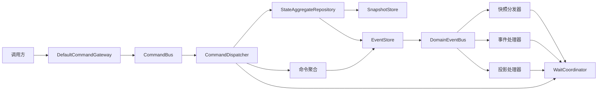
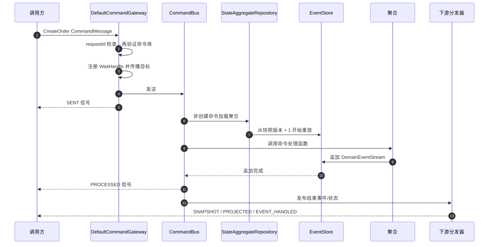

# 命令网关

`CommandGateway` 是面向应用的命令入口。它在 `CommandBus` 之上增加命令体验证、请求 ID 预检与阶段等待；它不会把聚合业务规则搬到传输层。

本指南沿用同一个 `CreateOrder` 命令。调用方等待 `SENT`、`PROCESSED`、`SNAPSHOT` 或 `PROJECTED` 时，即使命令最终成功，响应所证明的事实也不同。

## 发送命令


持久化主路径是：

```text
验证 + requestId 检查 -> 命令总线 -> 恢复聚合 -> 处理命令
-> 追加 DomainEventStream -> 发布状态/领域事件 -> 快照/事件处理/投影
```

等待阶段只选择这条路径中的观测点，不改变命令的业务行为。

## API 使用

创建一个 `CommandMessage`，构造等待计划时复用它的 `commandId`：

```kotlin
val command = createOrder.toCommandMessage(
    aggregateId = "order-1",
    requestId = "create-order-1",
)
```

### 基础方法

`sendAndWait` 返回一个最终结果；`sendAndWaitStream` 暴露已接受的中间信号，适合 SSE 或进度展示。

#### sendAndWait(command, waitPlan)

```kotlin
val result = commandGateway.sendAndWait(
    command,
    CommandWait.processed(command.commandId),
)
```

成功的 `PROCESSED` 证明聚合处理已完成；处理器产生事件时，这也包括事件追加完成。它不证明快照、投影、事件处理器或 Saga 已完成。

#### sendAndWaitStream(command, waitPlan)

```kotlin
commandGateway.sendAndWaitStream(
    command,
    CommandWait.snapshot(command.commandId),
).doOnNext { result ->
    println("${result.stage}: ${result.succeeded}")
}
```

成功等待快照时，流可以依次暴露 `SENT`、`PROCESSED` 与 `SNAPSHOT`。任一前置阶段失败，会用该较早阶段的失败结束等待。

#### 等待超时

网关默认期限为 30 秒。`withTimeout` 只改变本次调用的调用方等待生命周期，不会作为分布式消息头传播。

```kotlin
val plan = CommandWait.projected(
    waitCommandId = command.commandId,
    contextName = command.contextName,
    processorName = "OrderSummaryProjection",
).withTimeout(Duration.ofSeconds(10))
```

超时只表示当前调用方停止等待，不会撤销已经被总线接受的命令，也不能证明后续处理失败。等待终止时，网关会取消本地 `WaitHandle`。

### 便捷方法

```kotlin
commandGateway.sendAndWaitForSent(command)       // SENT
commandGateway.sendAndWaitForProcessed(command)  // PROCESSED
commandGateway.sendAndWaitForSnapshot(command)   // SNAPSHOT
```

选择满足响应契约的最早阶段。调用方需要某个具名下游函数时，使用 `CommandWait.projected`、`eventHandled` 或 `sagaHandled`。

## 核心概念

### CommandResult

`CommandResult` 是一个 `WaitSignal` 的公开观测结果。最重要的字段如下：

| 字段 | 含义 |
|---|---|
| `stage` | 已观测阶段，如 `SENT`、`PROCESSED`、`SNAPSHOT` 或 `PROJECTED` |
| `succeeded` | 由 `errorCode` 推导的成功标志 |
| `aggregateVersion` | 该阶段已知的版本；聚合处理前可为 `null` |
| `commandId` / `waitCommandId` | 当前命令，以及拥有等待计划的命令 |
| `requestId` | 原始命令携带的调用方幂等键 |
| `function` | 产生信号的函数，供函数级阶段匹配 |
| `errorCode`、`errorMsg`、`bindingErrors` | 可观测失败详情 |
| `result` | 从已接受信号累积的结果值 |

不要从成功结果推断未观测阶段。尤其不能把 `PROCESSED` 当成 `SNAPSHOT` 或 `PROJECTED` 的别名。

### WaitSignal 与 CommandResult

`WaitSignal` 是内部阶段通知。`DefaultCommandGateway` 将其与原命令的 `requestId`、聚合身份组合成 `CommandResult`。本地或远程 notifier 负责传递信号，网关结果才是公开契约。

### CommandGateway 与 CommandBus

| 能力 | `CommandBus` | `CommandGateway` |
|---|---:|---:|
| 路由 `CommandMessage` | 是 | 是 |
| 验证命令体 | 契约未规定 | 默认实现会执行 |
| 预检 `requestId` | 契约未规定 | 默认实现会执行 |
| 注册并等待阶段 | 否 | 是 |
| 返回 `CommandResult` | 否 | 是 |

仅需要传输时可使用 `CommandBus`。请求边界通常使用 `CommandGateway`，让验证、幂等与等待语义保持一致。

## 架构

### 组件架构


```mermaid
flowchart LR
    Client[调用方] --> Gateway[DefaultCommandGateway]
    Gateway --> Bus[CommandBus]
    Bus --> Dispatcher[CommandDispatcher]
    Dispatcher --> Repository[StateAggregateRepository]
    Repository --> SnapshotStore
    Repository --> EventStore
    Dispatcher --> Aggregate[命令聚合]
    Aggregate --> EventStore
    EventStore --> EventBus[DomainEventBus]
    EventBus --> Snapshot[快照分发器]
    EventBus --> Processor[事件处理器]
    EventBus --> Projection[投影处理器]
    Snapshot --> Wait[WaitCoordinator]
    Processor --> Wait
    Projection --> Wait
    Dispatcher --> Wait
```

事件存储保存权威历史；快照与处理器存储保存从该历史派生的下游状态。

### 消息总线层级

`CommandBus` 是面向命令 exchange 的 `MessageBus` 特化。具体实现可以是内存、分布式或本地优先总线。`SENT` 表示总线接受，是传输边界，不是聚合执行完成。

### 速查参考

| 组件 | 职责 |
|---|---|
| `DefaultCommandGateway` | 发送前检查、等待注册、发送、结果映射与期限控制 |
| `RequestIdChecker` | 快速预检，必要时查询权威存在性 |
| `WaitCoordinator` | 维护以 `waitCommandId` 为键的进程内等待句柄 |
| `RetryableAggregateProcessor` | 恢复聚合，并对可恢复的聚合处理失败重试 |
| `SimpleCommandAggregate` | 检查聚合约束、调用处理器、溯源并追加事件 |
| `EventSourcingStateAggregateRepository` | 在适用时加载当前快照并重放后续事件 |
| notifier filters | 产生 `PROCESSED`、`SNAPSHOT`、`PROJECTED`、`EVENT_HANDLED`、`SAGA_HANDLED` 信号 |

## 命令处理链


```mermaid
sequenceDiagram
    autonumber
    participant C as 调用方
    participant G as DefaultCommandGateway
    participant B as CommandBus
    participant R as StateAggregateRepository
    participant E as EventStore
    participant A as 聚合
    participant D as 下游分发器

    C->>G: CreateOrder CommandMessage
    G->>G: requestId 检查，再验证命令体
    G->>G: 注册 WaitHandle 并传播目标
    G->>B: 发送
    G-->>C: SENT 信号
    B->>R: 非创建命令加载聚合
    R->>E: 从快照版本 + 1 开始重放
    B->>A: 调用命令处理函数
    A->>E: 追加 DomainEventStream
    E-->>B: 追加完成
    B-->>C: PROCESSED 信号
    B->>D: 发布结果事件/状态
    D-->>C: SNAPSHOT / PROJECTED / EVENT_HANDLED
```

对于创建命令，`RetryableAggregateProcessor` 创建新状态聚合，不恢复既有历史；后续命令才委托 `StateAggregateRepository` 恢复。

### DefaultCommandGateway：发送前管道

默认顺序是明确的：

1. 调用 `RequestIdChecker.check(aggregateId, requestId)`。
2. 快速检查器拒绝该 ID 时，由配置的 `RequestIdExistenceChecker` 确认是否已存在。`EventStore` 提供默认历史扫描，后端可提供索引实现。
3. 命令体实现 `CommandValidator` 时调用其 `validate()`。
4. 使用 Jakarta Validation 验证命令体。
5. 全部通过后才调用 `CommandBus.send`。

文档描述不能替代后端证据。重复保护最终仍取决于所选事件存储在追加时是否原子执行其声明的版本与请求 ID 约束。

### DefaultCommandGateway：发送后信号

`CommandBus.send` 完成后，网关合成 `SENT`。优化后的 `sendAndWaitForSent` 不分配等待句柄，也不传播下游等待消息头。总线错误会映射成失败的 `SENT` 结果，并包装为 `CommandResultException`。

## 错误处理

失败在发生阶段可观测：

| 边界 | 典型结果 | 尚未证明的事实 |
|---|---|---|
| 幂等或验证 | 失败的 `SENT` | 命令没有发送 |
| 命令总线发送 | 失败的 `SENT` | 聚合未确认完成处理 |
| 恢复、业务规则或追加 | 失败的 `PROCESSED` | 未证明任何更晚阶段 |
| 快照策略/存储 | 失败的 `SNAPSHOT` | 投影与事件处理器彼此独立 |
| 投影函数/存储 | 失败的 `PROJECTED` | 事件历史仍可保持权威 |
| 事件处理器 | 失败的 `EVENT_HANDLED` | 重试/补偿取决于处理器策略 |

### CommandResultException

`sendAndWait` 把失败的最终结果转换为 `CommandResultException`。应检查 `commandResult.stage`、`errorCode`、`bindingErrors` 与 `aggregateVersion`，不要按错误消息文本分支。

```kotlin
commandGateway.sendAndWaitForProcessed(command)
    .onErrorResume(CommandResultException::class.java) { error ->
        audit(error.commandResult)
        Mono.error(error)
    }
```

### CommandValidationException

自验证与 Jakarta 约束是网关检查。`DefaultCommandGateway` 在总线发送前执行，因此映射结果处于 `SENT`，没有已处理的聚合版本。

### DuplicateRequestIdException

`requestId` 以聚合为作用域。配置的检查器确认同一聚合已使用该值时会拒绝请求。把它作为稳定操作 ID，仅在重试同一业务意图时复用。

### 异常参考

| 异常 | 含义 |
|---|---|
| `CommandValidationException` | 发送前命令体验证失败 |
| `DuplicateRequestIdException` | 请求 ID 被确认已用于该聚合 |
| `CommandResultException` | 最终观测的命令结果失败 |
| `TimeoutException` | 调用方期限结束，命令结果可能仍未知 |
| `EventVersionConflictException` | 事件追加与其他聚合版本竞争 |

### 错误处理最佳实践

1. 一起记录 `commandId`、`requestId`、聚合身份与 `stage`。
2. 重试同一业务意图时复用同一 `requestId`；不要因为响应丢失就生成新键。
3. 超时后查询权威结果或进行幂等重试，不要直接认定失败。
4. 下游副作用必须幂等，因为事件投递与可恢复重试可能再次调用它们。

## 幂等性

网关使用按聚合划分的快速检查器。快速拒绝会通过 `RequestIdExistenceChecker` 确认；`NoopRequestIdExistenceChecker` 采用 fail-closed。事件流也记录 `requestId`，因此可以用历史确认。

这是纵深防御，不是对全链路 exactly-once 的承诺。持久保证与后端有关：事件存储实现必须在追加时原子执行它所声明的约束。下游处理器的副作用位于事件追加事务之外，需要自己承担幂等责任。

### 配置

```yaml
wow:
  command:
    idempotency:
      enabled: true
      bloom-filter:
        expected-insertions: 1000000
        ttl: PT60S
        fpp: 0.00001
```

应按容量与误判率调整快速检查器；Bloom 过滤器配置不能作为持久防重证据。

## 等待计划

`WaitPlan` 包含 `waitCommandId`、目标、是否支持 void 命令，以及可选的调用方超时装饰。网关先注册本地等待句柄，再把 endpoint 与目标写入命令头，避免信号先于注册到达。

### CommandWait

```kotlin
CommandWait.sent(command.commandId)
CommandWait.processed(command.commandId)
CommandWait.snapshot(command.commandId)
CommandWait.projected(
    command.commandId,
    contextName = "example",
    processorName = "OrderSummaryProjection",
)
CommandWait.eventHandled(
    command.commandId,
    contextName = "example",
    processorName = "OrderEventProcessor",
)
```

函数匹配用于 `PROJECTED`、`EVENT_HANDLED` 与 `SAGA_HANDLED`。空 processor/function 会扩大匹配；由某个特定消费者定义完成时应给出明确名称。

#### 等待阶段对比

| 阶段 | 证明 | 不证明 |
|---|---|---|
| `SENT` | 命令总线已接受消息 | 已加载聚合或已追加事件 |
| `PROCESSED` | 聚合路径完成，包括已产生事件的追加 | 快照或下游消费者完成 |
| `SNAPSHOT` | 快照分发器完成其策略 | `version_offset` 下一定写入；投影完成 |
| `PROJECTED` | 匹配的投影函数完成，且观察到最后投影标记 | 无关投影/处理器完成 |
| `EVENT_HANDLED` | 匹配的事件处理器函数完成 | 副作用全局 exactly-once |
| `SAGA_HANDLED` | 匹配的 Saga 已处理源事件 | Saga 发出的命令到达最终阶段 |

#### 等待计划层级

`StageWaitTarget` 表示单个阶段与可选函数；`ChainWaitTarget` 从一个 Saga 函数开始，继续跟踪该 Saga 发出的命令直到尾阶段。阶段不是单一线性链：`SNAPSHOT`、`PROJECTED`、`EVENT_HANDLED` 与 `SAGA_HANDLED` 都依赖 `PROCESSED`，但彼此是独立分支。

### 链式等待计划

仅当响应契约需要从源命令，经一个 Saga 函数，再跟踪该 Saga 发出的命令时使用链：

```kotlin
val plan = CommandWait.chain(
    waitCommandId = command.commandId,
    function = NamedFunctionInfoData(
        contextName = "example",
        processorName = "CartSaga",
        name = "onEvent",
    ),
    tailStage = CommandStage.PROCESSED,
    tailFunction = NamedFunctionInfoData("example"),
)
```

这只是关联，不是分布式事务。每个命令仍有独立的幂等与失败边界。

## 验证

结构输入使用 Jakarta 注解；仅依赖命令体的跨字段检查使用 `CommandValidator`。依赖当前状态的业务规则应保留在聚合命令处理器中，并在恢复之后执行。`CreateOrder` 同时展示两者：注解验证 items/address，`validate()` 检查支持的国家；库存、价格、所有权、当前版本与生命周期仍属于聚合/应用职责。

## LocalFirst 模式：减少网络 IO 的影响

本地匹配分发器就绪时，`LocalFirstCommandBus` 可以在本地准入命令，并按总线实现发送带标记的分布式副本。它不改变 `SENT` 或后续阶段语义；void 命令不使用本地优先路由。

### 配置

```yaml
wow:
  command:
    bus:
      local-first:
        enabled: true
```

无论选择哪种路由，都使用相同的等待与幂等契约。

## 命令总线实现

### InMemoryCommandBus

适用于单运行时与测试。其 `SENT` 只表示进程内总线接受消息，进程故障后不具备持久性。

### KafkaCommandBus

提供分布式传输。Broker 确认、消费者重试与顺序行为取决于 Kafka/模块配置；网关不会把这些设置转换成 exactly-once 业务保证。

## HTTP 集成（WebFlux）

生成的命令路由把 HTTP 请求接入同一个网关契约。JSON 响应返回最终结果；`Accept: text/event-stream` 选择结果流。

### 请求处理流程

示例订单路由可显式请求 `SNAPSHOT`：

```shell
curl -X POST \
  'http://localhost:8080/tenant/tenant-1/owner/customer-1/sales-order' \
  -H 'Content-Type: application/json' \
  -H 'Wow-Space-Id: store-1' \
  -H 'Command-Aggregate-Id: order-1' \
  -H 'Command-Request-Id: create-order-1' \
  -H 'Command-Wait-Stage: SNAPSHOT' \
  -d '{"items":[{"productId":"product-1","price":10,"quantity":2}],"address":{"country":"China","province":"Shanghai","city":"Shanghai","district":"Pudong","detail":"Road 1"},"fromCart":true}'
```

返回 `stage: SNAPSHOT` 证明快照分发器完成。`all` 策略下这包括保存；`version_offset` 下该版本可能合法地完成但不写入。

### 命令路由生成

路由元数据提供命令类型、聚合身份、路径/消息头变量与请求体解码。HTTP 默认等待阶段是 `PROCESSED`。重要消息头包括 `Command-Request-Id`、`Command-Aggregate-Id`、`Command-Wait-Stage`、函数选择器、链尾选择器，以及毫秒单位的 `Command-Wait-Timeout`。

## Command Rewriter

`CommandRewriter` 可以在分发前补充或重定向命令，例如从经过验证的查询结果中解析聚合 ID。授权与歧义处理仍须明确；rewriter 不能替代聚合验证或事件存储并发检查。

## 配置参考

```yaml
wow:
  command:
    bus:
      type: kafka
      local-first:
        enabled: true
    idempotency:
      enabled: true
      bloom-filter:
        expected-insertions: 1000000
        ttl: PT60S
        fpp: 0.00001
```

配置应来自实际选择的运行时模块，并以该模块测试验证。上文公开阶段含义保持为应用契约。
