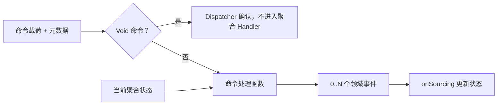

# 定义命令

命令是请求改变状态的祈使性载荷。它描述调用方想要发生什么；[聚合](../domain/aggregate.md)根据当前状态决定是否允许，并以领域事件表示已发生的事实。

普通命令由聚合 Handler 根据当前状态产生事件；Void 命令在 Dispatcher 层直接确认。



## 命令载荷与命令消息

命令载荷通常是一个 Kotlin `data class` 或 `object`。发送时，`toCommandMessage()` 会将载荷与命令 ID、请求 ID、聚合身份、owner、space、header、期望版本以及创建标记封装为 `CommandMessage<C>`。

```kotlin
@CreateAggregate
data class CreateOrder(
    val items: List<Item>,
    val address: ShippingAddress,
    val fromCart: Boolean,
)
```

载荷表达请求数据，不是运行时信封。需要版本控制时，在命令载荷上提供 `@AggregateVersion`；命令消息中的 `aggregateVersion` 则用于乐观并发检查。

## 目标聚合与命令元数据

`CommandMetadataParser` 从命令类型生成名称、目标聚合、聚合 ID、租户、owner、期望版本及创建、允许创建和 Void 标记。目标聚合可由命令自身实现 `NamedAggregate`，也可通过 `@AggregateName` 指定；`@AggregateId` 指定目标 ID，未标注时约定名为 `id` 的属性会被采用。

`@TenantId`、`@OwnerId` 与 `@AggregateVersion` 分别提供对应元数据；`@StaticAggregateId` 和 `@StaticTenantId` 提供静态值。若命令和调用参数都不能解析出目标聚合，构造 `CommandMessage` 会失败。

## 命令处理函数

命令处理函数只做三件事：读取当前状态、检查业务不变量、返回一个或多个领域事件。数据库写入、事件发布和投影更新属于运行时处理链，不属于聚合决策。

```kotlin
@AggregateRoot
class Cart(private val state: CartState) {
    fun onCommand(command: ChangeQuantity): CartQuantityChanged {
        val item = state.items.firstOrNull { it.productId == command.productId }
            ?: throw IllegalArgumentException("商品不存在")
        return CartQuantityChanged(item.copy(quantity = command.quantity))
    }
}
```

约定名 `onCommand` 会被自动发现；自定义函数名或返回类型无法静态表达事件集合时，使用 `@OnCommand(returns = [...])`。第一个参数可以是具体命令、`CommandMessage<C>` 或 `ServerCommandExchange<C>`；其余参数可由 IoC 容器解析。处理函数可返回单个事件、多个事件或响应式类型；外部校验必须保留在响应式链路中。

## 创建、允许创建与 Void 命令

`@CreateAggregate` 表示创建命令。创建命令的期望版本为未初始化版本，并从新状态开始处理，而不是恢复已有事件历史。

`@AllowCreate` 允许目标聚合不存在时按需创建；未标注时，找不到目标聚合的普通命令会失败。`AddCartItem` 是现有的允许创建示例。

`@VoidCommand` 不是“处理函数没有返回值”。它仍会发送到命令总线并成为 `isVoid` 命令，但 `CommandDispatcher` 会在聚合分发前确认并过滤它；因此不会调用聚合根、不会产生事件，也不会更新状态。此类命令仍应通过 `@AggregateRoot(commands = [...])` 挂载到聚合，例如 `ViewCart`。

## AfterCommand 与 OnError

`afterCommand` 约定名或 `@AfterCommand` 声明主命令成功后的后置函数。后置函数按 `@Order` 排序，`include` 和 `exclude` 用于限定命令类型；其返回的事件会追加到同一事件流，位于主命令事件之后。

`onError` 约定名或 `@OnError` 声明错误处理函数。运行时会先把原始错误记录到 exchange，再调用匹配的错误函数；除非该函数清除 exchange 中的错误，原始错误仍会传播。它用于观察或恢复框架允许的错误处理，不应成为绕过业务不变量的第二条写路径。

## 输入验证与业务不变量边界

调用边界负责载荷格式和字段约束，例如 Jakarta Validation、`CommandValidator` 及请求 ID 预检。聚合负责依赖当前状态的业务不变量，例如购物车容量或订单生命周期。

不要因为字段验证通过就跳过聚合检查：同一命令在不同事件历史下可能应被接受或拒绝。为每条不变量测试 Given 历史、When 命令、Expect 事件或错误，以及溯源后的状态。

## 下一步：发送命令

命令定义完成后，使用[发送命令](./sending.md)发送 `CommandMessage`，并通过[完成语义](./completion.md)选择满足调用方响应契约的等待阶段。
