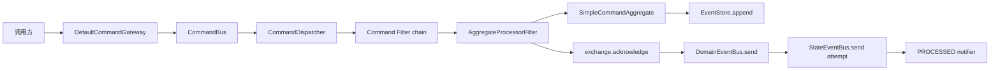

# 命令处理管线

本页解释一条非 `Void` 命令如何穿过 Wow 运行时。如何构造和发送命令见[发送命令](../sending.md)，如何选择等待阶段见[完成语义](../completion.md)；这里仅讨论实现顺序和边界。

## 组件地图



`CommandBus` 只负责投递和接收信封；`CommandDispatcher` 按具名聚合建立处理器，并把同一聚合 ID 映射到稳定的调度组；`CommandFilter` 链定义处理前后边界；聚合执行、事件持久化、transport ack、领域事件发布与状态事件发布是不同步骤。

## 发送前管道

`DefaultCommandGateway` 的发送入口先执行相同的 `check`：

1. `RequestIdChecker.check(aggregateId, requestId)` 做 request-ID 预检；返回 `false` 时以 `DuplicateRequestIdException` 终止。
2. 命令体实现 `CommandValidator` 时先执行自校验，再交给 Jakarta `Validator`。
3. 只有检查完成后才调用 `CommandBus.send`。

`sendAndWait` 与 `sendAndWaitStream` 还会先验证等待计划是否支持 `Void` 命令，然后注册等待句柄、把等待计划写入 Header，再发送命令。`sendAndWaitForSent` 是独立快路径：它不注册句柄、不传播等待 Header，而是在 `CommandBus.send` 成功后直接合成 `SENT` 结果。

预检不是持久并发裁决。最终的 request-ID 和版本冲突仍由 `EventStore.append` 的原子边界负责，详见[失败与幂等](../reliability.md)。

## Bus 到 Dispatcher

`CommandBus.receive` 或运行时使用的 `runtimeReceiver` 产生 `ServerCommandExchange`。`CommandDispatcher` 先过滤 `isVoid` 消息：这些消息会被确认但不会进入聚合命令链；普通命令继续按 `NamedAggregate` 分派。

每个 `AggregateCommandDispatcher` 从 metadata 得到聚合类型，并按 aggregate ID 计算 group key。同一 ID 的命令保持调度亲和性，多个 ID 可共享 worker；这避免同一聚合在本进程内并发执行，但不替代 EventStore 的持久版本约束。

`DefaultCommandHandler` 执行按 `@Order` 排序的 Filter chain。核心顺序是：

```text
ProcessedNotifierFilter
  -> AggregateProcessorFilter
    -> SendDomainEventStreamFilter
      -> SendStateEventFilter
```

第一个 Filter 位于最外层，因此它观察的是内部整条管线的完成或错误，而不是只观察聚合函数返回。

## 聚合恢复与调用

`AggregateProcessorFilter` 为 exchange 放入 `ServiceProvider` 和聚合 metadata，再按聚合身份创建 `AggregateProcessor`。默认 `RetryableAggregateProcessor`：

- 创建命令直接构造空的 StateAggregate；
- 其他命令从 `StateAggregateRepository` 恢复状态；
- 用恢复后的状态构造 `SimpleCommandAggregate`；聚合模式下命令根接收状态对象，非聚合模式直接复用状态对象；
- 只对标记为 recoverable 的失败按内置退避策略重建状态并重试。

`SimpleCommandAggregate.process` 随后检查期望版本、创建许可、owner、space、删除/恢复状态和命令函数是否存在。检查通过后，`CommandFunctionResolver` 调用匹配函数及有序的 after-command 函数，把返回值展平为一条 `DomainEventStream` 并放入 exchange。

## 内存溯源与 append

命令函数产出事件流后，`SimpleCommandAggregate` 先调用 `state.onSourcing(eventStream)` 更新当前工作实例，再调用 `EventStore.append(eventStream)`。这个顺序让同一次处理中的内存状态立即可用，但权威提交点仍是 append 成功：

```text
invoke command
  -> build DomainEventStream
  -> source events into in-memory state
  -> EventStore.append
  -> mark command state STORED
```

append 前 exchange 的 aggregate version 已更新为事件流版本；只有 append 成功后命令状态才回到 `STORED`。append 失败时命令聚合进入 `EXPIRED`，本次工作实例不能继续使用。事件历史与状态恢复的完整合同见[事件溯源](../../domain/event-sourcing.md)。

## ack/事件发送顺序

`AggregateProcessorFilter` 对聚合处理结果使用 `finallyAck`。因此无论聚合处理成功还是报错，都会先执行 exchange 的 transport ack；成功路径再进入下一个 Filter。`SendDomainEventStreamFilter` 从 exchange 取得事件流，并在继续链之前等待 `DomainEventBus.send` 完成。其后的 `SendStateEventFilter` 在状态已初始化时复制事件流与当前状态，转换成 `StateEvent` 并尝试 `StateEventBus.send`。

实际顺序是：

```text
EventStore.append
  -> command exchange ack
  -> DomainEventBus.send
  -> StateEventBus.send attempt
  -> PROCESSED signal
```

如果聚合在形成事件流前失败，仍会 ack，但不会进入事件发送 Filter。若事件已经追加，而 `DomainEventBus.send` 失败，transport ack 已经发生，错误会继续传播，`StateEventBus.send` 不会执行，`PROCESSED` 会观察到失败；因此不能把领域事件发布失败解释为“事件未保存”，也不能假定 command transport 会重投它。

`StateEventBus.send` 的失败边界不同：`SendStateEventFilter` 使用 `logErrorResume()` 记录错误并恢复为空完成，随后继续 Filter chain。于是成功的 `PROCESSED` 只证明 StateEvent 发布已经被尝试并返回，不证明 StateEvent 已经发布；依赖该输入的快照与投影可能没有收到消息。事件侧消费过程见[事件分发管线](../../event/dispatch.md)。

## `PROCESSED` 错误边界

`ProcessedNotifierFilter` 用 `MonoCommandWaitNotifier` 包住后续链：

- 内部链正常完成时，从 exchange 的函数、版本、结果和可能的业务错误生成 `PROCESSED` 信号；
- 内部链抛错时，先生成失败信号，再把原异常继续传给上层 error handler；retry-exhausted 包装会先还原其 cause；
- 没有等待 Header，或目标阶段不需要 `PROCESSED` 时，不生成信号；
- 通知采用 fire-and-forget，通知失败只记录日志，不改写命令处理结果。

所以 `PROCESSED` 成功表示聚合执行、事件追加、command ack 和 `DomainEventBus.send` 已经完成，`SendStateEventFilter` 也已完成；状态已初始化时，`StateEventBus.send` 尝试已经返回。它不保证 StateEvent 发布成功，也不表示快照、投影、事件处理器或 Saga 已完成。失败信号也不能单独证明事件未追加，必须按[失败与幂等](../reliability.md)检查权威历史。

## 源码入口

- [`DefaultCommandGateway`](https://github.com/Ahoo-Wang/Wow/blob/main/wow-core/src/main/kotlin/me/ahoo/wow/command/DefaultCommandGateway.kt)
- [`CommandDispatcher`](https://github.com/Ahoo-Wang/Wow/blob/main/wow-core/src/main/kotlin/me/ahoo/wow/modeling/command/dispatcher/CommandDispatcher.kt) 与 [`AggregateCommandDispatcher`](https://github.com/Ahoo-Wang/Wow/blob/main/wow-core/src/main/kotlin/me/ahoo/wow/modeling/command/dispatcher/AggregateCommandDispatcher.kt)
- [`AggregateProcessorFilter`](https://github.com/Ahoo-Wang/Wow/blob/main/wow-core/src/main/kotlin/me/ahoo/wow/modeling/command/dispatcher/AggregateProcessorFilter.kt) 与 [`SendDomainEventStreamFilter`](https://github.com/Ahoo-Wang/Wow/blob/main/wow-core/src/main/kotlin/me/ahoo/wow/modeling/command/dispatcher/SendDomainEventStreamFilter.kt)
- [`RetryableAggregateProcessor`](https://github.com/Ahoo-Wang/Wow/blob/main/wow-core/src/main/kotlin/me/ahoo/wow/modeling/command/RetryableAggregateProcessor.kt) 与 [`SimpleCommandAggregate`](https://github.com/Ahoo-Wang/Wow/blob/main/wow-core/src/main/kotlin/me/ahoo/wow/modeling/command/SimpleCommandAggregate.kt)
- [`EventStore`](https://github.com/Ahoo-Wang/Wow/blob/main/wow-core/src/main/kotlin/me/ahoo/wow/eventsourcing/EventStore.kt)、[`SendStateEventFilter`](https://github.com/Ahoo-Wang/Wow/blob/main/wow-core/src/main/kotlin/me/ahoo/wow/eventsourcing/state/SendStateEventFilter.kt) 与 [`NotifierFilters`](https://github.com/Ahoo-Wang/Wow/blob/main/wow-core/src/main/kotlin/me/ahoo/wow/command/wait/NotifierFilters.kt)
