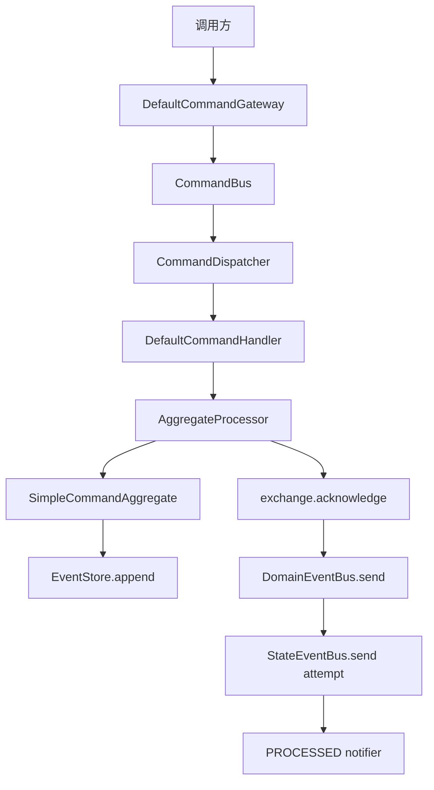

# 命令处理管线

本页解释一条非 `Void` 命令如何穿过 Wow 运行时。如何构造和发送命令见[发送命令](../sending.md)，如何选择等待阶段见[完成语义](../completion.md)；这里仅讨论实现顺序和边界。

## 组件地图


```mermaid
flowchart TB
    Caller[调用方] --> Gateway[DefaultCommandGateway]
    Gateway --> Bus[CommandBus]
    Bus --> Dispatcher[CommandDispatcher]
    Dispatcher --> Handler[DefaultCommandHandler]
    Handler --> Processor[AggregateProcessor]
    Processor --> Aggregate[SimpleCommandAggregate]
    Aggregate --> Store[EventStore.append]
    Processor --> Ack[exchange.acknowledge]
    Ack --> EventBus[DomainEventBus.send]
    EventBus --> StateBus[StateEventBus.send attempt]
    StateBus --> Processed[PROCESSED notifier]
```

`CommandBus` 只负责投递和接收信封；`CommandDispatcher` 按具名聚合建立处理器，并把同一聚合 ID 映射到稳定的调度组；`DefaultCommandHandler` 按固定顺序执行命令管道；聚合执行、事件持久化、transport ack、领域事件发布与状态事件发布是不同步骤。

## 发送前管道

`DefaultCommandGateway` 是门面：在一个不归它所有的 `CommandBus` 前面加上一条准入链。所有发送入口都按以下顺序执行同一条链：

1. 命令体实现 `CommandValidator` 时先执行自校验，再交给 Jakarta `Validator`。
2. `RequestIdChecker.check(aggregateId, requestId)` 做 request-ID 预检；返回 `false` 时以 `DuplicateRequestIdException` 终止。校验在前，校验失败的命令不占用 request ID（自 9.2.3 起）。
3. 只对 `sendAndWait` 与 `sendAndWaitStream`：等待计划必须支持 `Void` 命令，注册等待句柄，并把要发送的消息构建为调用方消息的副本，副本的 Header 带上等待键。调用方的消息不被修改（自 9.3.0 起；此前网关在发送前把等待键写进调用方的 Header）。
4. `CommandBus.send`；发送失败时调用 `RequestIdChecker.release` 释放这次预留。

`SENT` 信号只在一处产生：`CommandBus.send` 成功或失败之后，交给等待它的一方——已登记的句柄、Saga 为等待链发出的命令的上游等待，或 `sendAndWaitForSent` 的结果。`sendAndWaitForSent` 不登记句柄、不写等待 Header。每个等待都只有一个端到端截止时间，在调用被订阅时设定一次，由网关自己的定时器调度（自 9.3.0 起；此前流式等待每收到一个元素就在共享调度器上重新设定超时）。关闭网关只释放这个定时器，不关闭 `CommandBus`，总线归它的创建者所有（自 9.3.0 起）。

预检不是持久并发裁决。处理节点在聚合执行之前还会再查一次 request ID（见下文），最终的 request-ID 和版本冲突仍由 `EventStore.append` 的原子边界负责，详见[失败与幂等](../reliability.md)。

## Bus 到 Dispatcher

`CommandBus.receiver`（运行时的 `CommandDispatcher` 使用 runtime-owned 订阅）产生 `ServerCommandExchange`。`CommandDispatcher` 先过滤 `isVoid` 消息：这些消息会被确认但不会进入聚合命令链；普通命令继续按 `NamedAggregate` 分派。

每个 `AggregateCommandDispatcher` 持有本聚合的 metadata，随每条命令传给 `CommandHandler`，并按 aggregate ID 计算 group key。同一 ID 的命令保持调度亲和性，多个 ID 可共享 worker；这避免同一聚合在本进程内并发执行，但不替代 EventStore 的持久版本约束。

`DefaultCommandHandler` 执行一条固定顺序的管道，命令侧不再有过滤器链（自 9.3.0 起；此前是按 `@Order` 排序的 `CommandFilter` Bean）：

```text
CommandInstrumentation (each, the first outermost)
  -> PROCESSED report
    -> request-ID check, aggregate processing, then acknowledgement
      -> DomainEventBus.send
        -> StateEventBus.send attempt
```

request-ID 检查在处理命令的节点上、聚合的处理函数执行之前进行（自 9.3.0 起）。它使用自己的布隆过滤器，不与网关共用，只有过滤器见过这个 request ID 时才查询 `EventStore`；聚合已经提交过的 request ID 会让命令以 `DuplicateRequestIdException` 失败，处理函数不会执行。`wow.command.idempotency.enabled=false` 会同时关闭它和网关的检查。

外层步骤包住内层步骤，因此观察的是内部整条管线的完成或错误，而不是只观察聚合函数返回。原来需要命令过滤器的场景，对应到类型化的扩展点：

| 需求 | 自 9.3.0 起 |
| --- | --- |
| 每条命令的追踪、指标、日志 | 注册 `CommandInstrumentation` Bean：`around(exchange, handling)` 包住整条管道，不得改变结果。OpenTelemetry 模块的 `TraceCommandInstrumentation` 取代 `TraceAggregateFilter`。多个 instrumentation 按 `@Order` 依次包裹。 |
| 命令执行前的检查或拒绝 | 在网关处校验命令（`CommandValidator`、Jakarta 校验），或在命令函数中检查；它抛出的异常让命令失败。 |
| 响应已提交的事件 | 在发布的事件上编写事件处理器、Saga 或投影。 |
| 改变命令函数收到的参数 | 注入参数（Spring Bean，或 exchange 提供的值）。 |

## 聚合恢复与调用

`DefaultCommandHandler` 为 exchange 放入 `ServiceProvider`，再按聚合身份与 metadata 创建 `AggregateProcessor`。默认 `RetryableAggregateProcessor`：

- 创建命令直接构造空的 StateAggregate；
- 其他命令从 `StateAggregateRepository` 恢复状态；
- 用恢复后的状态构造 `SimpleCommandAggregate`；聚合模式下命令根接收状态对象，非聚合模式直接复用状态对象；
- 只对标记为 recoverable 的失败按内置退避策略重建状态并重试；
- 每次尝试都从第一次尝试之前的 exchange 开始：失败尝试留下的错误、事件流、聚合版本、命令调用结果、命令结果和命令聚合都不带到下一次，等待信号不会报告一个没有持久化的版本（自 9.2.3 起）；
- `@OnError` 函数只在最终失败后（重试耗尽时取其原因）在最近一次加载的聚合上执行一次：通常是最后一次尝试的聚合，最后一次尝试在加载前失败时用更早一次尝试的聚合；没有任何尝试加载到聚合时不执行，自定义的非 `SimpleCommandAggregate` 的 `CommandAggregate` 由它自己的 `process` 处理错误（自 9.2.3 起）。

`SimpleCommandAggregate.process` 随后检查期望版本、创建许可、owner、space、删除/恢复状态和命令函数是否存在。检查通过后，它在聚合的 `AggregateModel` 中查找命令。该模型在解析聚合元数据时编译一次：命令条目（含匹配的 after-command 函数以及内置的删除、恢复、资源标签处理）、错误函数，以及该类型所有状态聚合共享的溯源表。处理函数把命令根或状态根作为参数接收，不再按聚合实例或按命令绑定（自 9.3.0 起）。命令条目调用匹配函数及有序的 after-command 函数，把返回值展平为一条 `DomainEventStream` 并放入 exchange。每个函数在模型编译时选定唯一的结果适配器，把各种返回形态（普通值、`Mono`、`Flux`、其他 `Publisher`、`Flow`、`suspend` 结果）转成这条事件流，并使用同一条异常规则：函数抛出的异常不经包装直接传出，返回 `Flow` 的函数在返回之前抛出的异常也一样（自 9.3.0 起）。

## 决定、追加、再应用

命令函数只读状态。它产出的事件流先追加，追加成功后才应用到状态（自 9.3.0 起；此前先应用再追加）：

```text
invoke command (reads state)
  -> build DomainEventStream
  -> EventStore.append
  -> source the committed events into the state
```

- **追加之前或追加时失败**（守卫、命令函数、版本冲突、存储错误）：状态停在最后一次已提交的版本。`@OnError` 看到的就是这个状态，exchange 上的聚合版本也保持已提交的版本。
- **追加之后溯源失败**：提交无法撤回，命令按已提交报告：事件已存储并照常发布，失败以 ERROR 记录日志，不为它发送 `StateEvent`。该状态实例可能只应用了事件流的一部分，因此被丢弃：这个命令聚合不再接受后续命令。之后加载该聚合会执行同一个溯源函数并以同样的方式失败，直到修复为止。
- `StateAggregate.onSourcing` 在事件流的所有溯源函数都执行完之后，才推进版本、事件 ID、操作人、事件时间和系统元数据（owner、space、删除标记、标签）；实现 `VersionAware` 的状态也在这时得到新版本。溯源函数抛出异常时，它们全部保持原来的版本。

追加成功后，exchange 上的聚合版本才变为事件流的版本。事件历史与状态恢复的完整合同见[事件溯源](../../domain/event-sourcing.md)。

## ack/事件发送顺序

`DefaultCommandHandler` 对聚合处理结果使用 `finallyAck`。因此无论聚合处理成功还是报错，都会先执行 exchange 的 transport ack；只有成功路径才发布。它发送处理器返回的事件流，并在继续之前等待 `DomainEventBus.send` 完成；随后在状态已初始化且已应用这条事件流（版本等于事件流的版本）时复制事件流与当前状态，转换成 `StateEvent` 并尝试 `StateEventBus.send`。

实际顺序是：

```text
EventStore.append
  -> command exchange ack
  -> DomainEventBus.send
  -> StateEventBus.send attempt
  -> PROCESSED signal
```

如果聚合在形成事件流前失败，仍会 ack，但不会发布任何内容。若事件已经追加，而 `DomainEventBus.send` 失败，transport ack 已经发生，错误会继续传播，`StateEventBus.send` 不会执行，`PROCESSED` 会观察到失败；因此不能把领域事件发布失败解释为“事件未保存”，也不能假定 command transport 会重投它。

`StateEventBus.send` 的失败边界不同：它的错误被记录日志并恢复为空完成。于是成功的 `PROCESSED` 只证明 StateEvent 发布已经被尝试并返回，不证明 StateEvent 已经发布；依赖该输入的快照与投影可能没有收到消息。事件侧消费过程见[事件分发管线](../../event/dispatch.md)。

## `PROCESSED` 错误边界

`PROCESSED` 报告用 `MonoCommandWaitNotifier` 包住内部管道：

- 内部链正常完成时，从 exchange 的函数、版本、结果和可能的业务错误生成 `PROCESSED` 信号；
- 内部链抛错时，先生成失败信号，再把原异常继续传给处理器的 error handler（记录到 exchange 并打日志）；retry-exhausted 包装会先还原其 cause；
- 没有等待 Header，或目标阶段不需要 `PROCESSED` 时，不生成信号；
- 通知采用 fire-and-forget，通知失败只记录日志，不改写命令处理结果。

所以 `PROCESSED` 成功表示聚合执行、事件追加、command ack 和 `DomainEventBus.send` 已经完成；状态已应用这条事件流时，`StateEventBus.send` 尝试已经返回。它不保证 StateEvent 发布成功，也不表示快照、投影、事件处理器或 Saga 已完成。失败信号也不能单独证明事件未追加，必须按[失败与幂等](../reliability.md)检查权威历史。

## API 分层

本页的类型是实现，不是应用 API。自 9.3.0 起，wow-core 在代码中标明这一点：

- `CommandAggregate`、它的父接口 `AggregateProcessor`、`CommandAggregateFactory` 与 `SimpleCommandAggregateFactory` 标注 `@WowSpi`。自行提供命令聚合的代码用 `@OptIn(WowSpi::class)` 选择加入，不加入时编译器给出警告。它们在同一个次版本线内保持二进制签名不变，次版本可以修改它们，并写进发布说明。
- `AggregateProcessorFactory`、`RetryableAggregateProcessorFactory`、`DefaultCommandHandler`、`SimpleStateAggregate`，函数元数据类型（`FunctionAccessorMetadata`、`InjectParameter`、`FirstParameterKind`、`AfterCommandFunctionMetadata`、`MessageFunctionRegistrar`、`SimpleMessageFunctionRegistrar`），事件分发器基类（`CompositeEventDispatcher`、`AbstractEventFunctionRegistrar`、`EventHandler`），`COMMAND_GATEWAY_FUNCTION`，以及 exchange 上调用结果的存取方法和事件流、版本的设置方法标注 `@InternalWowApi`：由 Wow 自己的模块装配，任何版本都可能修改。
- `RetryableAggregateProcessor`、`SimpleCommandAggregate`、编译后的聚合模型（`AggregateModel` 及其命令条目和编译后的函数）、exchange 属性键、函数访问器以及聚合与状态事件分发器是 `internal`。

应用通过 `CommandGateway` 发送命令，用 `@OnCommand` 函数处理命令，读取 `ServerCommandExchange.getEventStream()`，这些都不需要选择加入。命令函数需要当前状态时，声明 `ReadOnlyStateAggregate<S>` 参数（例如读取 `initialized`），而不是 `CommandAggregate`。

## 源码入口

- [`DefaultCommandGateway`](https://github.com/Ahoo-Wang/Wow/blob/main/wow-core/src/main/kotlin/me/ahoo/wow/command/DefaultCommandGateway.kt)
- [`CommandDispatcher`](https://github.com/Ahoo-Wang/Wow/blob/main/wow-core/src/main/kotlin/me/ahoo/wow/modeling/command/dispatcher/CommandDispatcher.kt) 与 [`AggregateCommandDispatcher`](https://github.com/Ahoo-Wang/Wow/blob/main/wow-core/src/main/kotlin/me/ahoo/wow/modeling/command/dispatcher/AggregateCommandDispatcher.kt)
- [`DefaultCommandHandler`](https://github.com/Ahoo-Wang/Wow/blob/main/wow-core/src/main/kotlin/me/ahoo/wow/modeling/command/dispatcher/CommandHandler.kt) 与 [`CommandInstrumentation`](https://github.com/Ahoo-Wang/Wow/blob/main/wow-core/src/main/kotlin/me/ahoo/wow/modeling/command/dispatcher/CommandInstrumentation.kt)
- [`RetryableAggregateProcessor`](https://github.com/Ahoo-Wang/Wow/blob/main/wow-core/src/main/kotlin/me/ahoo/wow/modeling/command/RetryableAggregateProcessor.kt) 与 [`SimpleCommandAggregate`](https://github.com/Ahoo-Wang/Wow/blob/main/wow-core/src/main/kotlin/me/ahoo/wow/modeling/command/SimpleCommandAggregate.kt)
- [`EventStore`](https://github.com/Ahoo-Wang/Wow/blob/main/wow-core/src/main/kotlin/me/ahoo/wow/eventsourcing/EventStore.kt) 与 [`MonoCommandWaitNotifier`](https://github.com/Ahoo-Wang/Wow/blob/main/wow-core/src/main/kotlin/me/ahoo/wow/command/wait/MonoCommandWaitNotifier.kt)
