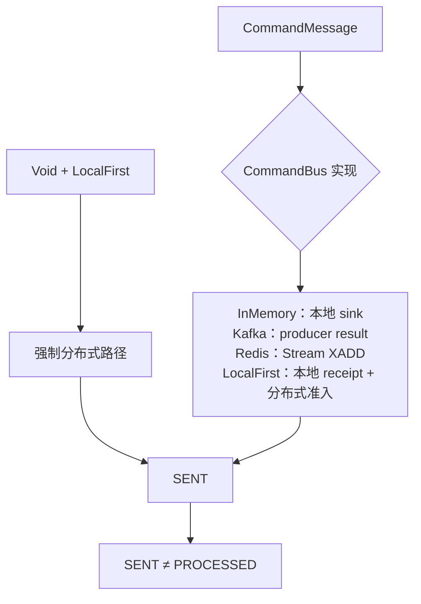

# 命令传输与路由

命令传输负责把 `CommandMessage` 路由为 `ServerCommandExchange`，不负责执行聚合业务规则。如何选择和安装扩展以对应扩展文档与[核心配置参考](../../../reference/config/core.md)为准；本页不复制依赖或配置表。

不同传输对 SENT 的证据锚点不同，但都不代表命令已经完成处理。

## CommandBus 契约

`CommandBus` 是 `MessageBus<CommandMessage<*>, ServerCommandExchange<*>>`，固定 `TopicKind.COMMAND`。两个核心动作具有不同边界：

- `send`：返回的 `Mono<Void>` 在具体 transport 接受发送后完成；
- `receiver`：唯一的接收入口。按 `MessageSubscription` 返回 `MessageReceiver`：exchange 流、transport readiness，以及 processing admission 与 quiescence。`runtimeOwned = true` 的订阅属于 WowRuntime 的 dispatcher；本地总线只让这类 receiver 参与 local-first 投递回执。

自 9.3.0 起，`receiver` 是唯一入口，每个总线都实现它；9.2 的 `receive` 与 `runtimeReceiver` 已删除。需要订阅时即打开 processing 的普通 exchange 流的 consumer 读取 `receiver(subscription).openedMessages()`；runtime-owned receiver 即 `receiver(subscription.copy(runtimeOwned = true))`。

## 传输 SPI

自 9.3.0 起，每个分布式总线都是建在 `Transport`（`me.ahoo.wow.messaging.transport`，`@WowSpi`）之上的 `TransportMessageBus`。传输只搬运字符串：`send(TransportMessage)` 发布主题、键、载荷和时间戳，`open(group, topics)` 返回带记录、就绪信号、处理准入与关闭的 `TransportReceiver`。其余工作由 `TransportMessageBus` 为所有后端统一完成：主题命名（按限界上下文与聚合名缓存）、JSON 编码、解码、键与主题校验、解码失败策略（`TransportDecodeFailureHandler`），以及每种消息一个交换类型（`TransportServerCommandExchange`、`TransportEventStreamExchange`、`TransportStateEventExchange`）。`TransportCommandBus`、`TransportDomainEventBus`、`TransportStateEventBus` 是三种总线；内置传输有 `KafkaTransport`、`RedisStreamTransport` 和 `InMemoryTransport`。Kafka 与 Redis 总线就是这些总线加上各自的传输，所以主题、键、JSON 与消费组都与 9.2 相同。

`LocalCommandBus` 额外暴露订阅者数量和 `handOff`。消息进入每个路由到的 processing-open receiver 的本地 sink 时交付被接受；只有这些 receiver 对本次投递取得处理准入时，准入结果才为 `true`；sink 接受或订阅数本身不会抑制 distributed 副本。`DistributedCommandBus` 保留同一发送/接收合同，由后端定义持久化、消费组和 ack 机制。

## InMemory

`InMemoryCommandBus` 以 `NamedAggregate` 为 key 创建 MPSC unicast sink：多个发送者可以并发写入，但每个具名聚合的命令只允许一个消费链。消息发出前被标记为只读，并转换为 `SimpleServerCommandExchange`。

普通 `send` 没有订阅者时会记录 debug 并完成，因此它只证明本进程 sink 的发送动作结束，不证明存在处理者。runtime-owned receiver 维护连接和 processing-open 状态；`handOff` 为每个投递创建 receipt，只有所有目标 receiver 接受运行时准入后，其准入结果才报告成功。

该实现适合单进程运行和测试，不提供跨进程持久性。

## Kafka

`KafkaCommandBus` 是基于 `KafkaTransport` 的 `TransportCommandBus`：

- topic 由命令的具名聚合转换；
- record key 是 aggregate ID，value 是只读命令 JSON；
- `send` 等待 Reactor Kafka sender result，producer error 作为 Reactor error 返回；
- `receiver` 为订阅的 topic 设置 consumer group，并把 record 转为持有该 record 的 exchange；
- exchange ack 调用该 record 的 `ReceiverOffset.acknowledge()`。

`receiver.readiness` 只在 partition assignment 完成并保存保守的初始 offset 边界后完成，避免启动窗口漏消息。解码失败由显式 failure handler 处理；成功处理的消费确认仍属于 exchange ack 边界。

## Redis

`RedisCommandBus` 使用 Redis Streams：`send` 把只读命令 JSON 写入 topic stream 的 `msg` 字段；`receiver` 为每个 topic 建立或复用 consumer group，从 `lastConsumed` 读取，并把 `XACK` publisher 放入 exchange。

`receiver.readiness` 在 consumer group 准备完成后触发，但读取还受 processing admission 控制。可选 recovery 会扫描并认领满足条件的 pending record；无法解码的记录会通过 `RedisMessageBusObserver` 报告且保持 pending，不伪装成已成功消费。

Redis 与 Kafka 的发送完成条件不同，二者都不等于聚合已经处理。后端运维、保留、重试与恢复参数属于扩展配置范围，不在本页展开。

## LocalFirst 双副本准入

`LocalFirstCommandBus` 组合一个 local bus 和一个 distributed bus。对本地聚合且 Header 未显式禁用 local-first 的命令，它不会在两条路径中二选一，而是建立受标记约束的双副本流程：

1. 把 distributed 副本放入该聚合的副本队列（`LocalFirstDistributedCopies`，按聚合 ID 排队）。
2. 复制命令，标记 `local_first=true`，交给本地总线（`localBus.handOff`）。只有所有路由到的 runtime-owned receiver 都已订阅且 processing-open、消息进入它们的本地 sink 时，交付才被接受；交付从不等待 receiver 拉取消息。
3. 每个路由到的 receiver 在其 dispatcher 拉取消息时确认准入，或拒绝（关闭时；路由关闭会拒绝其全部待定准入）。
4. 轮到它时（同一聚合的所有更早副本都已发送之后），副本以 `local_first` = 准入结果发出（交付被拒绝时为 `false`）。
5. 合并接收端过滤并 ack 已标记为“本地已处理”的 distributed 副本；本地准入失败、关闭或异常时，该副本保持可处理。

`send` 何时完成（自 9.3.0 起）：

| 情况 | `send` 完成时机 | distributed 副本 |
| --- | --- | --- |
| 已交付 | 消息进入本地 sink 时立即完成 | receiver 全部决定后轮到时发送：全部准入为 `local_first=true`，先被拒绝为 `false` |
| 被拒绝交付：没有可路由的 receiver、路由已关闭 | 其副本轮到并发送后完成，失败则随之失败 | `local_first=false` |
| 本地交付异常 | 同上（记录错误日志） | `local_first=false` |
| 交付后被拒绝（receiver 关闭） | 已完成 | `local_first=false`，轮到时发送 |

**顺序。** 无论已交付与被拒绝的发送如何交错，同一聚合的消息都按发送顺序到达 distributed bus，与 9.2 相同：副本只在该聚合所有更早副本发送之后才发送。因路由关闭而被拒绝的发送不会等待本地 receiver 的需求：关闭在拒绝之前已拒绝该路由的全部待定准入。因本地异常（sink 发射失败或抛出异常）而被拒绝的发送只拒绝它自己的投递；它的副本仍要等待该聚合更早的副本，而这些副本的准入在其 receiver 拉取或关闭时才决定。sink 无界时，这类异常只意味着 sink 已终止或存在缺陷，因此这种等待很少见，最迟在总线关闭时结束。

**跨 topic、跨总线无顺序保证。** 上述顺序只在同一聚合、同一总线的消息之间成立。不同 topic、不同总线之间没有顺序保证：命令、领域事件与状态事件经由各自的总线和各自的副本队列发送。尤其是，版本 N 的领域事件可能晚于版本 N 的状态事件到达分布式传输，因为领域事件的副本要等所有本地事件 receiver 都作出决定。消费者不得依赖跨 topic 的顺序；9.2 同样从未保证消费端的跨 topic 顺序。

**发送方不再等待。** 等待交付结果的是副本而不是发送方。在得到结果之前被取消的发送方（请求超时、客户端断开）只是不再等待：副本仍只发送一次，本地 receiver 准入时标记 `local_first=true`，否则为 `false`，因此取消既不会造成重复，也不会造成丢失。30 秒内未得到的交付结果按拒绝处理（记录日志，副本不带标记发出）；路由关闭时仍待定的准入由关闭拒绝，因此副本不会永远等待。

**副本上下文。** 排队的副本只保留发送所需的发送方 Reactor 上下文——指标来源，以及引入 `wow-opentelemetry` 时的 trace 上下文（`LocalFirstContextCapture` 的实现）——从不保留整个上下文（其中可能有 Web 请求）。

**不等待需求，本地 sink 无界。** 发送方从不等待本地 receiver 拉取消息，因此会发送消息的处理器（命令处理器发布事件、Saga 发送命令）无论 dispatcher 多满都不会互相阻塞。命令、领域事件与状态事件的本地 sink 均为无界，交付不会因消费者慢而被拒绝；代价是进程内积压增长。积压可在指标 `wow.local_first.backlog`（按聚合类型统计待发送副本数）上观察，达到 `wow.<command|event|eventsourcing.state>.bus.local-first.backlog-high-water-mark`（默认 10000）时记录警告。缓冲只为已订阅的 receiver 保留消息：本进程中没有任何订阅者时，发往内存事件总线的该聚合事件不会被保留（与 9.2 相同，当时有界缓冲会拒绝它）。

**失败与关停。** 已交付消息的副本发送失败会记录日志，并由 distributed bus 的发送指标计数；与 9.2 不同（9.2 中发送随之失败），它不再体现在命令结果中。关停时，运行时在 dispatcher 停止之后、传输关闭之前，于 `shutdownTimeout` 内发送队列中的副本；超时后仍在队列中的副本被取消，其他服务永远收不到这些消息。只有注册到运行时的副本队列（Spring Boot starter 的 `localFirst*BusDistributedCopies` bean）会被等待：在运行时之外创建的 `LocalFirstDistributedCopies` 不会被等待，除非把它注册为运行时组件或自行停止它。

**local-first 以崩溃持久性换取延迟。** 已交付但尚未处理的消息只存在于本进程：进程崩溃时会丢失。已在本地处理、但崩溃时副本尚未发出的消息，其他服务永远看不到。9.2 中准入之后本就如此；交付只把窗口扩大到消息在本地 sink 中等待的时间。消息必须在进程崩溃后仍被处理（跨崩溃的至少一次）时，请关闭 local-first（`wow.command.bus.local-first.enabled=false`，事件与状态事件同理）。

每个聚合的本地路由在自己的监视器下决定投递；关闭总线时先关闭所有路由，因此不同聚合的 local-first 发送不再争用整条总线的锁。`local_first=true` 是经过准入确认的抑制标记，不是仅凭 subscriber count 的猜测。原消息与两个副本使用独立可变 Header，避免两条路径互相改写。

## Void

`LocalFirstCommandBus.send` 对 `isVoid` 命令强制写入 `local_first=false`，跳过本地优先投递并只走 distributed send。`CommandDispatcher` 接收后又用 `filterThenAck` 确认并过滤 `Void` 命令，所以它不会进入命令管道，也不会产生 `PROCESSED` 及更晚阶段。

相应地，Gateway 只允许 `supportVoidCommand=true` 的等待计划；内置 `CommandWait.sent` 支持该合同，其他阶段计划会在发送前失败。Void 路径的可观察边界就是 transport 接受，不应把它描述为聚合执行完成。

## `SENT` 对照

`SENT` 表示当前 `CommandBus.send` publisher 成功完成，具体事实取决于实现：

| 实现 | `SENT` 前已发生 | `SENT` 仍不证明 |
| --- | --- | --- |
| InMemory | sink 发射完成；无订阅者也可能完成 | 有处理者、聚合执行、持久化 |
| Kafka | producer send result 成功 | consumer 收到或 ack、聚合执行 |
| Redis | stream add 完成 | consumer group 已处理或 XACK |
| LocalFirst | 已交付：命令已进入本地 sink，distributed 副本只是已入队。被拒绝：distributed send 完成 | 已交付：distributed send、本地或远端处理；`SENT` 之后进程崩溃会丢失尚未处理的已交付命令，以及尚未发出的副本。被拒绝：聚合处理 |
| Void + LocalFirst | distributed send 完成（Void 跳过 local-first） | 聚合处理；该路径会被 Dispatcher 过滤 |

`sendAndWaitForSent` 直接根据这个 publisher 合成结果，不依赖回调 Header。需要更强保证时，按[完成语义](../completion.md)选择阶段，而不是重新解释 `SENT`。

## 指标与追踪入口

`MetricCommandBus` 在 decorator 层记录 `command_bus` 的 `send`、`send_if_subscribed` 和接收 stream，保留原 receiver readiness 与 runtime admission。标签来自 context、aggregate、message 和 receiver group；多个 aggregate 会折叠为有界值，避免直接把业务 ID 放入指标。

OpenTelemetry 的 `TracingLocalCommandBus` / `TracingDistributedCommandBus` 在发送边界创建 producer span 并向消息 Header 注入 trace context；`TracingCommandGateway` 另外覆盖 `sendAndWait` 与流式等待，记录完整 waiting span。处理管线的观测还包括 `CommandHandler`、`EventStore` 和 `DomainEventBus` 的各自 decorator；不要只凭一个 bus span 推断端到端完成。

运行时启用方式和 exporter 配置见[可观测性](../../advanced/observability.md)。源码入口：[`CommandBus`](https://github.com/Ahoo-Wang/Wow/blob/main/wow-core/src/main/kotlin/me/ahoo/wow/command/CommandBus.kt)、[`InMemoryCommandBus`](https://github.com/Ahoo-Wang/Wow/blob/main/wow-core/src/main/kotlin/me/ahoo/wow/command/InMemoryCommandBus.kt)、[`LocalFirstCommandBus`](https://github.com/Ahoo-Wang/Wow/blob/main/wow-core/src/main/kotlin/me/ahoo/wow/command/LocalFirstCommandBus.kt)、[`KafkaCommandBus`](https://github.com/Ahoo-Wang/Wow/blob/main/wow-kafka/src/main/kotlin/me/ahoo/wow/kafka/KafkaCommandBus.kt)、[`RedisCommandBus`](https://github.com/Ahoo-Wang/Wow/blob/main/wow-redis/src/main/kotlin/me/ahoo/wow/redis/bus/RedisCommandBus.kt)。
