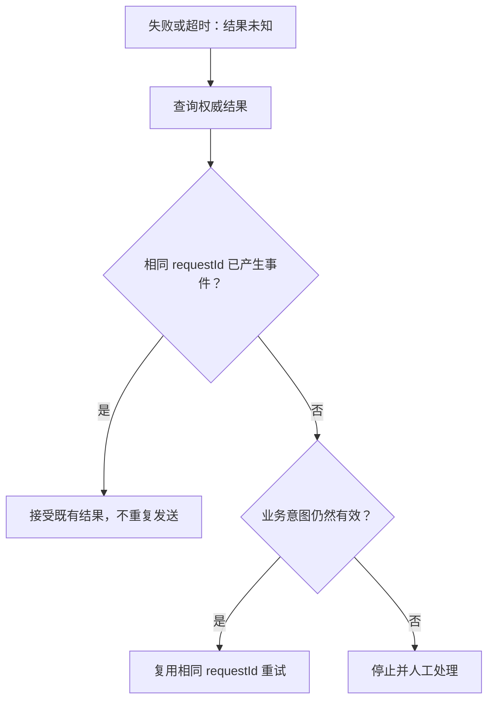

# 失败与幂等

可靠的命令调用不依赖“只发送一次”，而是让同一业务意图可以被安全识别、确认和重试。诊断时同时保留聚合身份、`commandId`、`requestId`、等待 `stage`、错误码和调用方超时信息。

未知结果不能直接重发；先确认权威历史，再决定是否复用稳定 requestId 重试。

## 失败发生在哪一层

| 层 | 常见结果 | 已知边界 |
| --- | --- | --- |
| 发送前 | 命令校验或 request-ID 预检失败 | 命令尚未交给 `CommandBus` |
| `SENT` | 总线拒绝、连接错误或发送超时 | 未观察到接受结果；远端是否收到仍需按具体传输判断 |
| `PROCESSED` | 业务规则、事件追加或命令处理管线失败 | 不能只凭失败阶段判断事件是否已追加 |
| `SNAPSHOT` / `PROJECTED` / `EVENT_HANDLED` / `SAGA_HANDLED` | 对应分支失败 | 不会自动撤销已经追加的权威事件历史 |
| 调用方等待 | 超时、取消、连接断开 | 只结束本次观察，不撤销命令 |

尤其要注意：失败的 `PROCESSED` 不能证明事件未追加。事件成功追加后，命令处理管线中的后续发布或通知仍可能失败。先查权威历史，再决定补偿或重试；不要依据 HTTP 状态、异常类型或阶段名猜测提交结果。

## commandId 与 requestId

`commandId` 标识一次具体命令消息和执行链，阶段信号用它做关联。重新构造命令通常会产生新的 `commandId`，所以它不应承担跨尝试的业务幂等语义。

`requestId` 标识调用方的一次业务意图，并进入 `DomainEventStream`。同一聚合内，相同 `requestId` 表示重复请求；不同聚合可以使用相同值。

规则很简单：

- 重试同一业务意图，复用稳定的 `requestId`；
- 新的业务意图，使用新的 `requestId`；
- 不要在超时后仅为绕过重复检查而生成新 `requestId`。

稳定值应由业务操作身份派生或由调用方创建后持久保存，不能依赖每次进程调用临时生成。

## 快速预检与权威确认

`DefaultRequestIdChecker` 先查询按聚合选择的 `IdempotencyChecker`。快速检查判定可以继续时直接放行；当它报告“可能重复”时，再通过 `RequestIdExistenceChecker` 查询持久历史。没有权威查询器时默认拒绝该请求，而不是冒险放行。

这个预检用于尽早拒绝明显重复并消解概率型检查的假阳性，但不是并发提交的最终裁决。预检与持久追加之间存在竞争窗口；两个并发请求都可能通过读取检查。

## EventStore 持久约束

`EventStore.append` 是事件流能否成为权威历史的持久边界。其合同要求追加时处理三类冲突：

- `DuplicateRequestIdException`：同一聚合已经使用该 `requestId`；
- `EventVersionConflictException`：要追加的事件版本与现有历史冲突；
- `DuplicateAggregateIdException`：初始版本的创建与已有聚合身份冲突。

因此生产存储必须在自身的原子写入边界内强制版本与 request-ID 唯一性，并正确映射异常；“先查询、后写入”的应用逻辑不能替代该约束。具体后端仍需运行对应模块和 TCK 验证，[事件溯源](../domain/event-sourcing.md)不把内存实现当作生产持久性证明。

## 版本与创建冲突

版本冲突通常表示调用方基于过期聚合版本作出决定，或同一聚合存在并发写入。只有在重新加载最新状态后仍能证明原业务意图有效时，才可以用同一 `requestId` 重新决策；不要静默递增期望版本或覆盖历史。

创建冲突表示目标聚合身份已经存在。它不等价于同一请求已成功：先用聚合身份和 `requestId` 区分“原创建请求的重复提交”与“另一业务意图争用同一 ID”。后者应返回业务冲突，而不是改用另一个 request ID 重放创建。

## CommandResultException

`sendAndWait` 会把发送前检查和发送错误映射为 `CommandResultException`，最终等待信号失败时也会抛出它。异常保留完整 `commandResult`，包括 `stage`、`commandId`、`requestId`、聚合身份、`errorCode`、`errorMsg`、`bindingErrors` 和累计 `result`；诊断与 API 错误映射应读取这些字段，而不是解析异常文本。

`sendAndWaitStream` 的消费者还必须检查每个 `CommandResult.succeeded`：失败的 accepted signal 可以作为流元素出现，不能假定所有业务失败都会只通过 Reactor 的终止错误表达。调用方超时通常是 `TimeoutException`，同样不能据此推断服务端最终结果。

## 超时后的查询与重试

超时后的安全流程是：

1. 保留原命令的聚合身份、`requestId` 和 `commandId`，把结果标为未知。
2. 通过应用查询模型或受控的运维路径，按聚合与 `requestId` 确认权威事件历史；同时查询响应合同所需的下游状态。
3. 已追加：不要重发新的业务意图；等待、修复或补偿尚未完成的下游分支。
4. 确认未追加：仍使用原 `requestId` 重试同一业务意图。
5. 无法确认：保持未知并升级处理，不要换新 `requestId` 盲目重发。

Wow 的等待超时释放本地句柄，不提供分布式撤销。业务系统应提供足以按稳定身份查询结果的接口或运维能力。

## 下游副作用幂等

`requestId` 保护同一聚合的事件追加，不会自动让投影、事件处理器、Saga 或外部 API 幂等。下游消息可能重投，处理过程也可能在副作用成功后、确认成功前中断。

每个有副作用的消费者都应在自己的持久边界内记录稳定输入身份，例如领域事件 ID、消息 ID 或明确的业务幂等键，并让“检查 + 写入副作用 + 记录完成”具备原子性或可恢复性。向不支持幂等键的外部系统调用时，需要可查询结果、去重记录或补偿策略；仅依赖内存集合、`commandId` 日志或上游成功响应不足以防止重复副作用。
