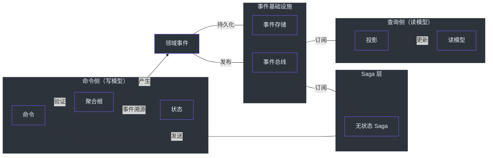
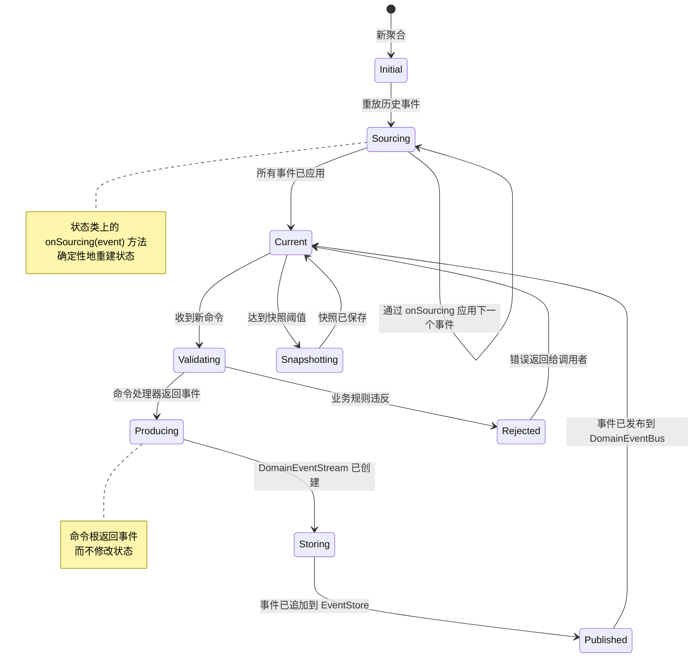
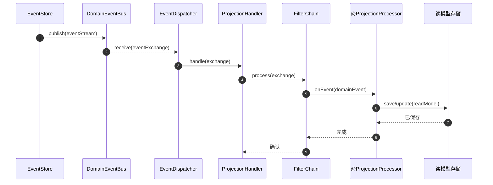
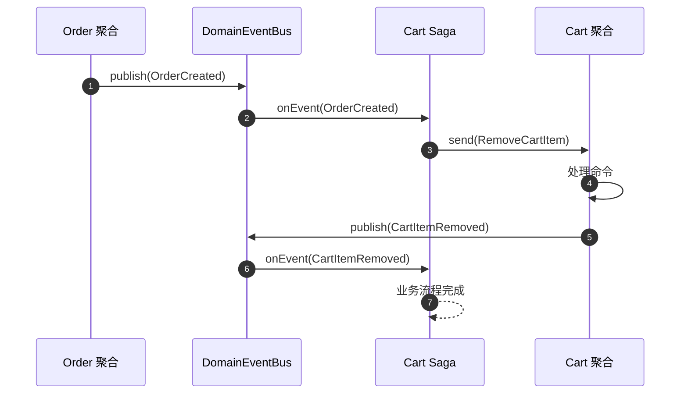
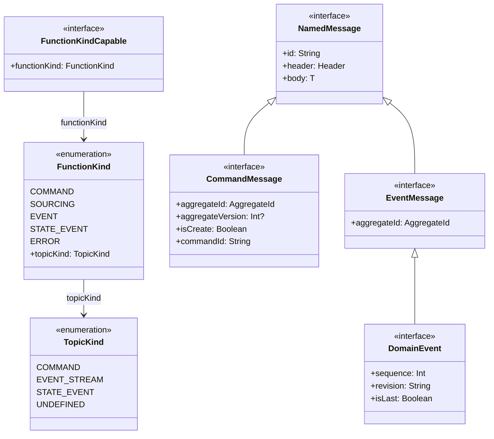

# 核心概念

Wow 将领域驱动设计的核心构建模块实现为框架的一等公民。本页解释每个概念、它如何映射到 Wow 的 API 和运行时，以及框架为何做出这些设计选择。

## 概念关系图

以下图表展示了主要概念之间的关系。命令流入聚合，聚合产生事件，事件被存储和发布，下游处理器（投影和 Saga）对这些事件做出反应。



<!-- Sources: wow-api/src/main/kotlin/me/ahoo/wow/api/command/CommandMessage.kt:53-126, wow-api/src/main/kotlin/me/ahoo/wow/api/event/DomainEvent.kt:52-95, wow-core/src/main/kotlin/me/ahoo/wow/eventsourcing/EventStore.kt:27-98 -->

## 聚合根

**聚合根** 是 DDD 中的核心一致性边界。在 Wow 中，它是一个用 `@AggregateRoot` 注解的类，接收命令并产生领域事件。聚合根是修改聚合状态的唯一入口。

### Wow 如何实现聚合根

Wow 聚合被拆分为两个协作对象：

| 组件 | 职责 | 生命周期 |
|---|---|---|
| **命令根**（例如 `Order`） | 接收命令、验证业务规则、返回事件 | 每次命令重新创建 |
| **状态对象**（例如 `OrderState`） | 持有当前状态、包含 `onSourcing` 方法 | 从事件历史重建 |

命令根在构造时注入当前状态。它读取状态来验证规则，但永远不会直接修改状态。相反，它返回领域事件，这些事件在被溯源时会修改状态。

```kotlin
@AggregateRoot
class Order(private val state: OrderState) {

    fun onCommand(shipOrder: ShipOrder): OrderShipped {
        // 读取当前状态进行验证
        check(state.status == OrderStatus.PAID) {
            "Cannot ship unpaid order"
        }
        // 返回事件 -- 永远不直接修改状态。
        // OrderShipped 是一个事件（此处为 Kotlin `object`；使用携带字段的
        // `data class`（如 `OrderShipped(orderId = state.id)`）同样有效）。
        return OrderShipped
    }
}
```

这种拆分防止了一个常见的 DDD 反模式：在验证完成之前，命令处理器意外修改状态。命令根和状态对象定义在 [CommandAggregate.kt:41-53](https://github.com/Ahoo-Wang/Wow/blob/main/wow-core/src/main/kotlin/me/ahoo/wow/modeling/command/CommandAggregate.kt#L41-L53) 和 [StateAggregate.kt:26-32](https://github.com/Ahoo-Wang/Wow/blob/main/wow-core/src/main/kotlin/me/ahoo/wow/modeling/state/StateAggregate.kt#L26-L32)。

## 命令

**命令** 是改变聚合状态的祈使性请求。在 Wow 中，命令由 `CommandMessage<C>` 接口表示，它携带：

- **aggregateId** -- 目标聚合实例
- **aggregateVersion** -- 用于乐观并发控制
- **isCreate** -- 是否初始化新聚合
- **allowCreate** -- 如果聚合不存在是否允许创建
- **isVoid** -- 命令是否期望响应

| 属性 | 类型 | 用途 | 源码 |
|---|---|---|---|
| `commandId` | `String` | 幂等性和去重的唯一 ID | [CommandMessage.kt:70-71](https://github.com/Ahoo-Wang/Wow/blob/main/wow-api/src/main/kotlin/me/ahoo/wow/api/command/CommandMessage.kt#L70-L71) |
| `aggregateId` | `AggregateId` | 目标聚合实例 | [CommandMessage.kt:83](https://github.com/Ahoo-Wang/Wow/blob/main/wow-api/src/main/kotlin/me/ahoo/wow/api/command/CommandMessage.kt#L83) |
| `aggregateVersion` | `Int?` | 乐观锁的期望版本 | [CommandMessage.kt:95](https://github.com/Ahoo-Wang/Wow/blob/main/wow-api/src/main/kotlin/me/ahoo/wow/api/command/CommandMessage.kt#L95) |
| `isCreate` | `Boolean` | 创建新聚合 | [CommandMessage.kt:105](https://github.com/Ahoo-Wang/Wow/blob/main/wow-api/src/main/kotlin/me/ahoo/wow/api/command/CommandMessage.kt#L105) |
| `body` | `C` | 实际的命令载荷 | 继承自 `NamedMessage` |

### 命令注解

Wow 提供了在命令级别声明意图的注解：

| 注解 | 用途 | 源码 |
|---|---|---|
| `@CreateAggregate` | 将命令标记为聚合初始化器 | [CreateAggregate.kt:54-57](https://github.com/Ahoo-Wang/Wow/blob/main/wow-api/src/main/kotlin/me/ahoo/wow/api/annotation/CreateAggregate.kt#L54-L57) |
| `@AllowCreate` | 允许命令在聚合不存在时创建聚合 | `AllowCreate.kt` |
| `@VoidCommand` | 将命令标记为即发即忘（不期望响应） | `VoidCommand.kt` |
| `@OnCommand` | 将方法标记为命令处理器，可选 `returns` 类型 | [OnCommand.kt:69-87](https://github.com/Ahoo-Wang/Wow/blob/main/wow-api/src/main/kotlin/me/ahoo/wow/api/annotation/OnCommand.kt#L69-L87) |
| `@AggregateVersion` | 参数级注解，用于乐观并发 | `AggregateVersion.kt` |
| `@CommandRoute` | 为命令配置 REST 路由 | `CommandRoute.kt` |

## 领域事件

**领域事件** 是领域中已发生事件的不可变事实。在 Wow 中，事件实现 `DomainEvent<T>` 接口。

`DomainEvent` 的关键特性定义在 [DomainEvent.kt:52-95](https://github.com/Ahoo-Wang/Wow/blob/main/wow-api/src/main/kotlin/me/ahoo/wow/api/event/DomainEvent.kt#L52-L95)：

| 属性 | 默认值 | 用途 |
|---|---|---|
| `aggregateId` | （必需） | 将事件链接到其来源聚合 |
| `sequence` | `1` | 事件流中的顺序 |
| `revision` | `DEFAULT_REVISION` | 用于向后兼容的模式版本控制 |
| `isLast` | `true` | 标识这是否是批次中的最后一个事件 |

### 事件溯源处理器

状态通过状态类上的 `@OnSourcing` 方法从事件重建。默认函数名为 `onSourcing`（[OnSourcing.kt:18](https://github.com/Ahoo-Wang/Wow/blob/main/wow-api/src/main/kotlin/me/ahoo/wow/api/annotation/OnSourcing.kt#L18)）。

```kotlin
class OrderState(val id: String) {
    var status: OrderStatus = OrderStatus.CREATED
        private set

    // 约定：方法名匹配事件类型（onSourcing）
    fun onSourcing(event: OrderCreated) {
        status = OrderStatus.CREATED
    }

    fun onSourcing(event: OrderShipped) {
        status = OrderStatus.SHIPPED
    }
}
```

溯源处理器必须是确定性的——给定相同的事件，它们必须总是产生相同的状态。它们不应该有副作用（没有外部服务调用、没有写入操作）。

### 事件反应处理器

`@OnEvent` 方法对事件做出反应，用于横切关注点（投影、Saga 编排、通知）。它们与 `@OnSourcing` 的区别在于它们可以有副作用。

```kotlin
@ProjectionProcessor
class OrderSummaryProjection {

    @OnEvent
    fun onOrderCreated(event: OrderCreated) {
        orderSummaryRepository.save(OrderSummary.from(event))
    }
}
```

参见 [OnEvent.kt:62-79](https://github.com/Ahoo-Wang/Wow/blob/main/wow-api/src/main/kotlin/me/ahoo/wow/api/annotation/OnEvent.kt#L62-L79)。

## 事件溯源

**事件溯源** 是将状态变更存储为一系列事件而非直接存储当前状态的模式。在 Wow 中，这是默认的持久化模型。

### 事件溯源在 Wow 中如何工作

以下状态图展示了聚合状态在事件溯源过程中的生命周期转换。



<!-- Sources: wow-core/src/main/kotlin/me/ahoo/wow/modeling/command/CommandAggregate.kt:65-118, wow-core/src/main/kotlin/me/ahoo/wow/eventsourcing/EventStore.kt:27-98, wow-core/src/main/kotlin/me/ahoo/wow/modeling/state/StateAggregate.kt:26-32 -->

### 事件存储

`EventStore` 接口定义了持久化和加载事件流的契约。事件按聚合存储、带版本号，可通过聚合 ID 和版本范围加载。

| 方法 | 签名 | 用途 |
|---|---|---|
| `append` | `append(eventStream: DomainEventStream): Mono<Void>` | 持久化新事件 |
| `load` | `load(aggregateId, headVersion, tailVersion): Flux<DomainEventStream>` | 按版本范围加载事件 |
| `load` | `load(aggregateId, headEventTime, tailEventTime): Flux<DomainEventStream>` | 按时间范围加载事件 |
| `last` | `last(aggregateId): Mono<DomainEventStream>` | 加载最近的事件流 |


## 投影

**投影** 将领域事件转换为优化的读模型。投影是 CQRS 的"读侧"——它们维护为特定查询需求定制的领域数据反规范化视图。

投影使用 `@ProjectionProcessor` 声明，使用 `@OnEvent` 方法处理事件。



<!-- Sources: wow-core/src/main/kotlin/me/ahoo/wow/event/DomainEventBus.kt:39-44, wow-core/src/main/kotlin/me/ahoo/wow/projection/ProjectionHandler.kt:27-43, wow-api/src/main/kotlin/me/ahoo/wow/api/annotation/ProjectionProcessor.kt:64-68 -->

### 投影的关键特征

| 特征 | 描述 |
|---|---|
| 最终一致性 | 投影在事件存储后异步更新 |
| 幂等性 | 重放相同的事件应产生相同的结果 |
| 每处理器偏移量 | 每个投影跟踪自己的处理位置 |
| 可重放 | 投影可以从事件存储重建 |

## Saga

**Saga** 通过对事件做出反应并发出命令来协调多聚合业务流程。在 Wow 中，Saga 是无状态处理器，订阅领域事件并分发新命令。

`@StatelessSaga` 注解声明一个 Saga 类。参见 [StatelessSaga.kt:65-69](https://github.com/Ahoo-Wang/Wow/blob/main/wow-api/src/main/kotlin/me/ahoo/wow/api/annotation/StatelessSaga.kt#L65-L69)。



<!-- Sources: wow-api/src/main/kotlin/me/ahoo/wow/api/annotation/StatelessSaga.kt:65-69, wow-api/src/main/kotlin/me/ahoo/wow/api/annotation/OnEvent.kt:62-79 -->

### Saga 与投影的对比

| 方面 | Saga | 投影 |
|---|---|---|
| 目的 | 编排跨聚合工作流 | 维护读模型 |
| 副作用 | 向其他聚合发送命令 | 更新数据库记录 |
| 状态 | 无状态（无持久化状态） | 无状态（状态就是读模型） |
| 注解 | `@StatelessSaga` | `@ProjectionProcessor` |
| 反应 | `@OnEvent` 分发命令 | `@OnEvent` 更新存储 |

## 限界上下文

**限界上下文** 定义了业务领域中的一个连贯区域，拥有自己的统一语言和规则。在 Wow 中，`@BoundedContext` 注解声明一个上下文边界。

```kotlin
@BoundedContext(
    name = "example",
    alias = "ex",
    aggregates = [
        BoundedContext.Aggregate(name = "order"),
        BoundedContext.Aggregate(name = "cart")
    ]
)
object ExampleBoundedContext
```

`@BoundedContext` 注解（参见 [BoundedContext.kt:59-119](https://github.com/Ahoo-Wang/Wow/blob/main/wow-api/src/main/kotlin/me/ahoo/wow/api/annotation/BoundedContext.kt#L59-L119)）接受以下参数：

| 参数 | 用途 |
|---|---|
| `name` | 用于路由的唯一上下文标识符 |
| `alias` | 较短的引用名称 |
| `description` | 人类可读的用途描述 |
| `scopes` | 边界范围标识符 |
| `packageScopes` | 定义上下文边界的包类 |
| `aggregates` | 上下文内 `@Aggregate` 定义的数组 |

Wow 中的每个 `AggregateId` 都包含一个 `contextName`，确保命令和事件总是在正确的限界上下文内路由。

## 消息类型层次结构

Wow 定义了丰富的消息类型层次结构。`FunctionKind` 枚举按函数在系统中的角色对其进行分类。



<!-- Sources: wow-api/src/main/kotlin/me/ahoo/wow/api/messaging/function/FunctionKind.kt:27-71, wow-api/src/main/kotlin/me/ahoo/wow/api/command/CommandMessage.kt:53-126, wow-api/src/main/kotlin/me/ahoo/wow/api/event/DomainEvent.kt:52-95 -->

### FunctionKind 到 TopicKind 的映射

| FunctionKind | TopicKind | 描述 |
|---|---|---|
| `COMMAND` | `COMMAND` | 聚合上的命令处理器 |
| `SOURCING` | `EVENT_STREAM` | 状态对象上的事件溯源处理器 |
| `EVENT` | `EVENT_STREAM` | 投影和 Saga 上的事件反应处理器 |
| `STATE_EVENT` | `STATE_EVENT` | 状态变更通知 |
| `ERROR` | `UNDEFINED` | 错误处理函数 |

此映射（参见 [FunctionKind.kt:27-71](https://github.com/Ahoo-Wang/Wow/blob/main/wow-api/src/main/kotlin/me/ahoo/wow/api/messaging/function/FunctionKind.kt#L27-L71)）确保消息通过其 topic 类型路由到正确的处理器类型。

## 多租户

Wow 在聚合级别支持多租户。每个 `AggregateId` 都包含一个 `tenantId` 属性。命令作用域限定为租户，事件存储按租户分区事件。

> **聚合 ID 唯一性约束：** `tenantId` 不会创建独立的聚合 ID 命名空间。在同一个 `NamedAggregate`（`contextName` + `aggregateName`）范围内，`id` 必须在所有租户之间保持唯一。例如，两个 `order` 聚合实例不能同时使用 `order-123`，即使它们分别属于租户 A 和租户 B。租户 ID 仍用于路由和隔离，但不会放宽聚合 ID 的唯一性。

租户可以在注解级别配置：

- 命令参数上的 `@TenantId` 从命令体提取租户
- 聚合类上的 `@StaticTenantId` 分配固定租户
- `BoundedContext.Aggregate(tenantId = "...")` 用于静态租户分配

## 综合总结

下表总结了每个概念如何映射到 Wow 的工件：

| DDD 概念 | Wow 工件 | 注解/接口 |
|---|---|---|
| 聚合根 | 命令根类 | `@AggregateRoot` |
| 实体状态 | 状态类 | 约定：`*State` |
| 命令 | 数据类 | `CommandMessage<C>`、`@OnCommand` |
| 领域事件 | 数据类/object | `DomainEvent<T>`、`@Event` |
| 事件溯源 | 状态重建方法 | `@OnSourcing` |
| 读模型 | 投影处理器 | `@ProjectionProcessor`、`@OnEvent` |
| Saga | 无状态 Saga 类 | `@StatelessSaga`、`@OnEvent` |
| 限界上下文 | 上下文声明 | `@BoundedContext` |
| 仓储 | 事件存储 | `EventStore` |
| 命令总线 | 消息总线 | `CommandBus`、`CommandGateway` |
| 事件总线 | 消息总线 | `DomainEventBus` |

## 相关页面

| 页面 | 描述 |
|---|---|
| [概述](./introduction.md) | 框架理念和模块概览 |
| [快速开始](./getting-started.md) | 项目设置和第一个聚合 |
| [架构](./advanced/architecture.md) | 过滤器链、分发器、数据流 |
| [聚合建模](./modeling.md) | 聚合设计模式和状态管理 |
