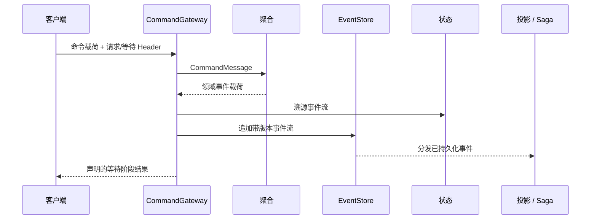

# 核心概念

本页定义 Wow 文档、源码和运行时响应共同使用的术语。最短心智模型是：

```text
命令载荷
  → CommandMessage 信封
  → 聚合决策
  → DomainEventStream 中的领域事件载荷
  → 聚合溯源状态
  → 投影 / Saga / 其他处理器
```

不要混用“命令”“事件”“状态”和“投影”。它们有不同的所有者、生命周期和一致性保证。

## 术语速查

| 术语 | 在 Wow 中的稳定含义 | 主要工件 |
| --- | --- | --- |
| 限界上下文 | 包含聚合定义、有明确名称的业务语言边界 | `@BoundedContext` |
| 聚合 | 由上下文、聚合名、租户和 ID 标识的一致性边界 | `NamedAggregate`、`AggregateId` |
| 命令 | 请求改变状态的祈使性载荷 | data class/object、`@CreateAggregate`、`@CommandRoute` |
| 命令消息 | 携带命令及身份、请求、版本、Header 和路由元数据的运行时信封 | `CommandMessage<C>` |
| 命令聚合根 | 校验不变量并返回事件的领域对象 | `@AggregateRoot`、`@OnCommand` |
| 状态聚合根 | 只能通过溯源事件重建的状态对象 | `@OnSourcing` |
| 领域事件 | 不可变的业务事实载荷 | data class/object；需要显式元数据时使用 `@Event` |
| 领域事件信封 | 事件载荷及聚合、命令、序列、修订和时间元数据 | `DomainEvent<T>` |
| 事件流 | 一条聚合命令产生的有序事件批次 | `DomainEventStream` |
| 事件存储 | 追加与加载聚合事件流的契约 | `EventStore` |
| 快照 | 用于加速聚合恢复的派生检查点 | `SnapshotStore` |
| 等待阶段 | 调用方选择的命令完成定义 | `SENT`、`PROCESSED`、`SNAPSHOT`、`PROJECTED` |
| 投影 | 消费事件并维护读模型的处理器 | `@ProjectionProcessor`、`@OnEvent` |
| Saga | 消费事件并发送下一条命令的协调器 | `@StatelessSaga`、`@OnEvent` |
| 补偿 | 对失败事件处理工作的可观测重试与恢复 | 补偿记录、`RetrySpec` |

## 限界上下文与聚合标识

**限界上下文**拥有一套连贯业务语言及其聚合名称。`@BoundedContext` 声明上下文名、可选别名、包范围与聚合定义。

```kotlin
@BoundedContext(
    name = "example",
    alias = "ex",
    aggregates = [
        BoundedContext.Aggregate(name = "order"),
        BoundedContext.Aggregate(name = "cart"),
    ],
)
object ExampleBoundedContext
```

**聚合**是一条事件流的一致性边界。运行时标识包含 `contextName`、`aggregateName`、`tenantId` 和 `id`；路由与存储必须保留完整 `AggregateId`。

::: warning 聚合 ID 唯一性
`tenantId` 是路由与隔离上下文，不会建立第二套 ID 命名空间。在同一个 `NamedAggregate`（`contextName` + `aggregateName`）中，`id` 必须跨租户唯一。
:::

参见 [`BoundedContext`](https://github.com/Ahoo-Wang/Wow/blob/main/wow-api/src/main/kotlin/me/ahoo/wow/api/annotation/BoundedContext.kt)与[聚合建模](./modeling.md)。

## 聚合根

Wow 聚合把**业务决策**与**状态变更**分开：

| 组成 | 可以做 | 不能做 |
| --- | --- | --- |
| 命令聚合根 | 读取当前状态、校验不变量、返回事件载荷 | 直接修改溯源状态 |
| 状态聚合根 | 确定性地应用持久化事件 | 调用外部服务或执行写入 |

```kotlin
@AggregateRoot
class Order(private val state: OrderState) {
    @OnCommand
    fun onShip(command: ShipOrder): OrderShipped {
        check(state.paid) { "Cannot ship an unpaid order." }
        return OrderShipped
    }
}

class OrderState(val id: String) {
    var shipped: Boolean = false
        private set

    @OnSourcing
    fun onShipped(event: OrderShipped) {
        shipped = true
    }
}
```

处理函数做决策，事件记录决策，溯源函数改变状态。按相同顺序重放相同事件，必须得到相同状态。完整模式见[聚合建模](./modeling.md)。

## 命令载荷与命令消息

**命令载荷**是 `CreateOrder` 等应用类型；**命令消息**是 Wow 包裹载荷的运行时信封。`CommandMessage<C>` 携带：

- `commandId`：运行时消息标识；
- `requestId`：调用方提供或派生的幂等标识；
- `aggregateId`：目标聚合标识；
- `aggregateVersion`：可选的乐观并发期望版本；
- `isCreate`、`allowCreate`、`isVoid`：执行语义；
- Header：等待、操作人、追踪和请求传播数据。

讨论业务请求时使用“命令”，讨论传输或运行元数据时使用“命令消息”。参见 [`CommandMessage`](https://github.com/Ahoo-Wang/Wow/blob/main/wow-api/src/main/kotlin/me/ahoo/wow/api/command/CommandMessage.kt)与[命令网关](./command-gateway.md)。

## 事件载荷、信封与事件流

**领域事件载荷**是 `OrderShipped` 等不可变事实。Wow 用 `DomainEvent<T>` 包裹载荷，增加聚合标识、版本、序列、修订、来源命令 ID 与时间。一个命令可以返回多个事件载荷；它们的有序运行时信封组成 `DomainEventStream`，并作为该聚合的新版本追加。

`@OnSourcing` 消费事件以重建聚合状态；`@OnEvent` 在事件持久化后响应，用于投影、Saga、通知等副作用。关键安全边界是：

- 溯源必须确定且无副作用；
- 事件响应可以有副作用，因此必须处理重试与幂等。

参见 [`DomainEvent`](https://github.com/Ahoo-Wang/Wow/blob/main/wow-api/src/main/kotlin/me/ahoo/wow/api/event/DomainEvent.kt)、[`EventStore`](https://github.com/Ahoo-Wang/Wow/blob/main/wow-core/src/main/kotlin/me/ahoo/wow/eventsourcing/EventStore.kt)与[事件存储](./eventstore.md)。

## 事件存储与快照

**事件存储**是聚合历史的事实来源，按聚合标识和范围追加、加载带版本的事件流。**快照**是派生检查点，可以加速恢复，但不能替代事件历史。

快照缺失、过期或需要重建时，运行时可通过重放所需事件流恢复状态。因此，持久化事件的兼容期限通常长于单次部署。参见[快照](./snapshot.md)与[事件演进](./advanced/event-evolution.md)。

## 命令完成与等待阶段

“HTTP 请求已返回”并不是唯一的完成点。

| 阶段 | 已完成的工作 |
| --- | --- |
| `SENT` | 命令总线已接收命令 |
| `PROCESSED` | 聚合处理与事件存储追加已完成 |
| `SNAPSHOT` | 该命令的快照处理已完成 |
| `PROJECTED` | 选定投影已处理完成 |

选择满足用户可见契约的最弱阶段。更晚的阶段耗时更长，也可能依赖更多基础设施。参见[命令等待计划](./command-gateway.md#等待计划)。

## 投影、Saga 与补偿

**投影**消费事件并维护面向查询的读模型，是 CQRS 的读取侧，通常与写入侧最终一致。

**Saga**消费事件并发送另一条命令，以协调跨聚合工作。在 Wow 中，`@StatelessSaga` 不持久化私有 Saga 状态；持久事实仍保存在聚合与消息中。

**补偿**记录事件处理失败并支持受控重试。它不会删除已经提交的领域事件，也不提供跨服务数据库回滚。恢复逻辑必须保持幂等且符合业务安全。参见[投影](./projection.md)、[Saga](./saga.md)与[事件补偿](./event-compensation.md)。

## 端到端链路


```mermaid
sequenceDiagram
    participant Client as 客户端
    participant Gateway as CommandGateway
    participant Aggregate as 聚合
    participant Store as EventStore
    participant State as 状态
    participant Processor as 投影 / Saga

    Client->>Gateway: 命令载荷 + 请求/等待 Header
    Gateway->>Aggregate: CommandMessage
    Aggregate-->>Gateway: 领域事件载荷
    Gateway->>State: 溯源事件流
    Gateway->>Store: 追加带版本事件流
    Store-->>Processor: 分发已持久化事件
    Gateway-->>Client: 声明的等待阶段结果
```

组件调度与失败行为见[数据流](./advanced/data-flow.md)和[运行时生命周期](./advanced/runtime-lifecycle.md)。

<details>
<summary>从旧版概念指南保留的源码直达链接</summary>

- 聚合与上下文契约：[`BoundedContext`](https://github.com/Ahoo-Wang/Wow/blob/main/wow-api/src/main/kotlin/me/ahoo/wow/api/annotation/BoundedContext.kt#L59-L119)、[`CommandAggregate`](https://github.com/Ahoo-Wang/Wow/blob/main/wow-core/src/main/kotlin/me/ahoo/wow/modeling/command/CommandAggregate.kt#L41-L53)、[`StateAggregate`](https://github.com/Ahoo-Wang/Wow/blob/main/wow-core/src/main/kotlin/me/ahoo/wow/modeling/state/StateAggregate.kt#L26-L32)
- 命令注解：[`CreateAggregate`](https://github.com/Ahoo-Wang/Wow/blob/main/wow-api/src/main/kotlin/me/ahoo/wow/api/annotation/CreateAggregate.kt#L54-L57)、[`OnCommand`](https://github.com/Ahoo-Wang/Wow/blob/main/wow-api/src/main/kotlin/me/ahoo/wow/api/annotation/OnCommand.kt#L69-L87)
- 溯源与事件处理：[`OnSourcing`](https://github.com/Ahoo-Wang/Wow/blob/main/wow-api/src/main/kotlin/me/ahoo/wow/api/annotation/OnSourcing.kt#L18)、[`OnEvent`](https://github.com/Ahoo-Wang/Wow/blob/main/wow-api/src/main/kotlin/me/ahoo/wow/api/annotation/OnEvent.kt#L62-L79)、[`StatelessSaga`](https://github.com/Ahoo-Wang/Wow/blob/main/wow-api/src/main/kotlin/me/ahoo/wow/api/annotation/StatelessSaga.kt#L65-L69)
- 命令信封字段：[`commandId`](https://github.com/Ahoo-Wang/Wow/blob/main/wow-api/src/main/kotlin/me/ahoo/wow/api/command/CommandMessage.kt#L70-L71)、[`aggregateId`](https://github.com/Ahoo-Wang/Wow/blob/main/wow-api/src/main/kotlin/me/ahoo/wow/api/command/CommandMessage.kt#L83)、[`aggregateVersion`](https://github.com/Ahoo-Wang/Wow/blob/main/wow-api/src/main/kotlin/me/ahoo/wow/api/command/CommandMessage.kt#L95)、[`isCreate`](https://github.com/Ahoo-Wang/Wow/blob/main/wow-api/src/main/kotlin/me/ahoo/wow/api/command/CommandMessage.kt#L105)
- 事件与函数元数据：[`DomainEvent`](https://github.com/Ahoo-Wang/Wow/blob/main/wow-api/src/main/kotlin/me/ahoo/wow/api/event/DomainEvent.kt#L52-L90)、[`FunctionKind`](https://github.com/Ahoo-Wang/Wow/blob/main/wow-api/src/main/kotlin/me/ahoo/wow/api/messaging/function/FunctionKind.kt#L27-L71)

</details>

## 相关页面

- [简介](./introduction.md)：价值、适用边界与引入成本
- [快速上手](./getting-started.md)：经验证的模板链路
- [聚合建模](./modeling.md)：建模模式与状态规则
- [架构概览](./advanced/architecture.md)：分发器、过滤器与模块边界
