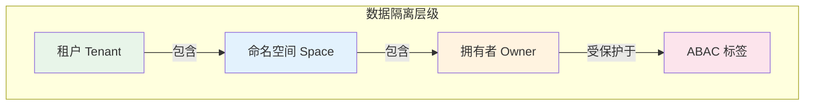
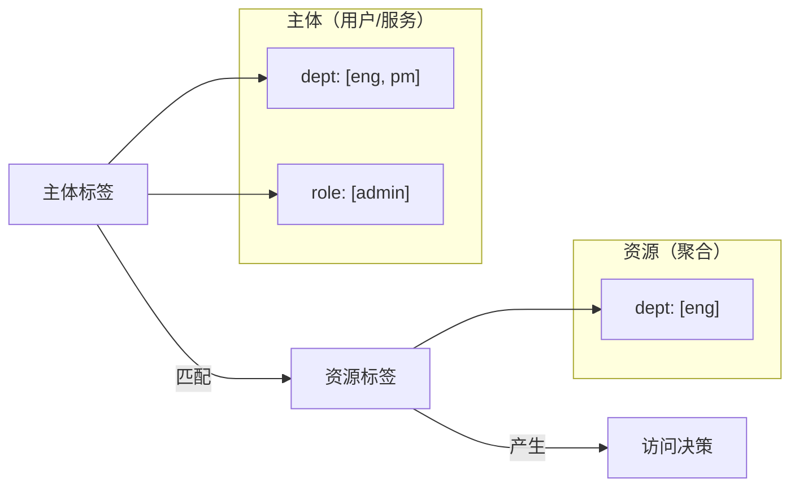

# 数据权限

Wow 提供了分层的数据权限控制模型，覆盖了最常见的多租户和权限场景：

1. **租户（Tenant）** — 按组织/客户隔离数据
2. **拥有者（Owner）** — 在租户内按用户身份隔离数据
3. **命名空间（Space）** — 在租户内提供基于命名空间的分区
4. **ABAC** — 基于属性的细粒度访问控制

这些层级独立工作，可以自由组合。你可以仅使用租户隔离，也可以组合全部四个层级以获得最大安全性。



<!-- Sources: wow-api/src/main/kotlin/me/ahoo/wow/api/modeling/TenantId.kt, wow-api/src/main/kotlin/me/ahoo/wow/api/modeling/OwnerId.kt, wow-api/src/main/kotlin/me/ahoo/wow/api/modeling/SpaceIdCapable.kt, wow-api/src/main/kotlin/me/ahoo/wow/api/abac/Taggable.kt -->

## 租户（Tenant）

租户是最高层级的数据隔离边界。在 SaaS 应用中，每个客户（组织）通常是一个独立的租户。Wow 自动在命令和事件中传播租户上下文，确保数据在存储层面被隔离。

### 基于注解的租户 ID

使用 `@TenantId` 注解标记命令或聚合状态中的租户标识字段：

```kotlin
@AggregateRoot
class OrderAggregate(
    @AggregateId
    val orderId: String,

    @TenantId
    val tenantId: String  // 该订单所属的组织
)
```

```kotlin
data class CreateOrder(
    @AggregateId
    val orderId: String,

    @TenantId
    val tenantId: String, // 自动从请求上下文填充

    val items: List<OrderItem>
)
```

框架利用此注解实现：
- 从请求中自动设置租户上下文
- 按租户隔离事件存储和快照存储
- 在查询操作中强制租户边界

### 静态租户 ID

对于始终属于固定租户的聚合（如系统配置），使用 `@StaticTenantId`：

```kotlin
@AggregateRoot
@StaticTenantId("system-tenant")
class SystemConfigurationAggregate {
    // 始终属于系统租户
}
```

### 默认租户

未指定租户时，Wow 使用默认租户 ID `(0)`。这对单租户应用是透明的 — 无需处理租户 ID。

<!-- Sources: wow-api/src/main/kotlin/me/ahoo/wow/api/annotation/TenantId.kt:57-94, wow-api/src/main/kotlin/me/ahoo/wow/api/modeling/TenantId.kt:20-43 -->

## 拥有者（Owner）

在租户内部，**拥有者**层级按用户身份隔离数据，确保用户只能访问自己的数据（如"我的订单"、"我的购物车"）。

### 基于注解的拥有者 ID

使用 `@OwnerId` 注解标记拥有者标识：

```kotlin
data class AddToCart(
    @AggregateId
    val cartId: String,

    @OwnerId
    val userId: String,  // 拥有此购物车的用户

    val productId: String,
    val quantity: Int
)
```

### 拥有者路由策略

`@AggregateRoute` 注解通过 `owner` 参数控制拥有权的强制方式：

```kotlin
@AggregateRoot
@AggregateRoute(
    resourceName = "orders",
    owner = AggregateRoute.Owner.ALWAYS
)
class OrderAggregate(
    @AggregateId
    val orderId: String,

    @OwnerId
    val customerId: String
)
```

可用策略：

| 策略 | 说明 | 适用场景 |
|------|------|---------|
| `NEVER` | 无需拥有者上下文 | 公共资源、系统聚合 |
| `ALWAYS` | 始终需要拥有者上下文 | 用户专属数据（订单、个人资料） |
| `AGGREGATE_ID` | 聚合 ID 即拥有者 ID | 每用户聚合（用户资料、设置） |

### 拥有权转移

当需要变更拥有者时（如将任务转交给其他用户），实现 `OwnerTransferred` 事件接口：

```kotlin
data class TaskTransferred(
    override val toOwnerId: String
) : OwnerTransferred
```

框架识别此事件并自动更新聚合的拥有者上下文。

<!-- Sources: wow-api/src/main/kotlin/me/ahoo/wow/api/annotation/OwnerId.kt, wow-api/src/main/kotlin/me/ahoo/wow/api/annotation/AggregateRoute.kt:59-91, wow-api/src/main/kotlin/me/ahoo/wow/api/event/OwnerTransferred.kt -->

## 命名空间（Space）

**命名空间**在租户内提供基于命名空间的数据分区，增加了第三个隔离维度，适用于：

- 环境隔离（dev / staging / prod）
- 业务域分区（primary / archive）
- 组织单元边界

```kotlin
// 聚合可以属于同一租户内的不同命名空间
data class ArchivedOrder(
    @AggregateId
    val orderId: String,

    @TenantId
    val tenantId: String,

    val spaceId: SpaceId  // "archive" 命名空间
)
```

命名空间转移遵循与拥有权转移相同的模式 — 实现 `SpaceTransferred`：

```kotlin
data class OrderArchived(
    override val toSpaceId: SpaceId
) : SpaceTransferred
```

默认命名空间 ID 为空字符串 `""`，即所有未显式指定命名空间的聚合都在默认空间中。

<!-- Sources: wow-api/src/main/kotlin/me/ahoo/wow/api/modeling/SpaceIdCapable.kt, wow-api/src/main/kotlin/me/ahoo/wow/api/event/SpaceTransferred.kt -->

## ABAC（基于属性的访问控制）

租户、拥有者和命名空间提供结构性隔离，而 **ABAC** 提供细粒度的、基于属性的访问控制。它通过为**主体**（用户/服务）和**资源**（聚合）附加标签，然后在查询时进行匹配来实现。

### 核心概念



<!-- Sources: wow-api/src/main/kotlin/me/ahoo/wow/api/abac/Taggable.kt:63-98 -->

**AbacTags** — 键值对映射，每个键对应一个值列表：

```kotlin
// 用户标签：属于工程部和产品部，角色为管理员
val userTags: AbacTags = mapOf(
    "dept" to listOf("eng", "pm"),
    "role" to listOf("admin")
)

// 资源标签：仅允许工程部访问
val resourceTags: AbacTags = mapOf(
    "dept" to listOf("eng")
)

// 公开资源：无标签 = 所有人可访问
val publicResource: AbacTags = emptyMap()
```

**通配符** — 值 `["*"]` 匹配该键下的所有值：

```kotlin
// 可以访问任何部门的资源
val adminTags: AbacTags = mapOf(
    "dept" to listOf("*")
)
```

### 应用资源标签

使用 `ApplyAbacTags` 命令接口为聚合设置标签：

```kotlin
@AggregateRoot
class DocumentAggregate(
    @AggregateId
    val docId: String,
    var tags: AbacTags = emptyMap()
) {
    @OnCommand
    fun onCommand(command: ApplyAbacTags): AbacTagsApplied {
        // 验证并合并标签
        return DefaultResourceTagsApplied(command.tags)
    }
}
```

或者使用内置的 `DefaultApplyResourceTags` 命令，它提供了开箱即用的标签管理端点：

```kotlin
// 框架自动处理 DefaultApplyResourceTags
// 生成 PUT 端点：PUT /{resourceName}/{id}/tags
```

### 标签合并

使用 `merge` 扩展函数合并标签。对于相同的键，双方的值会合并（并集）：

```kotlin
val tags1 = mapOf("dept" to listOf("eng"), "role" to listOf("admin"))
val tags2 = mapOf("dept" to listOf("pm"), "team" to listOf("backend"))

tags1.merge(tags2)
// 结果：{ "dept": ["eng", "pm"], "role": ["admin"], "team": ["backend"] }
```

<!-- Sources: wow-api/src/main/kotlin/me/ahoo/wow/api/abac/ApplyAbacTags.kt, wow-api/src/main/kotlin/me/ahoo/wow/api/abac/ApplyResourceTags.kt, wow-api/src/main/kotlin/me/ahoo/wow/api/abac/AbacTagsMerger.kt -->

### ABAC 查询过滤器

查询快照时，`AbacQueryFilter` 根据主体的标签自动注入权限过滤条件。匹配规则如下：

| 主体标签 | 资源标签 | 结果 |
|---------|---------|------|
| `["*"]`（通配符） | 任意 | ✅ 匹配 |
| `["a", "b"]` | `["a"]` | ✅ 匹配 |
| `["a", "b"]` | `["c"]` | ❌ 不匹配 |
| 任意 | 键不存在 | ✅ 匹配（该键对应的资源为公开） |

过滤器将主体标签转换为查询条件：
- 通配符标签：检查资源上该键是否存在
- 普通标签：匹配键不存在、值为空、或值在主体列表中的资源

实现自定义的主体标签解析，继承 `AbacQueryFilter`：

```kotlin
@Component
class MyAbacQueryFilter : AbacQueryFilter() {
    override fun getPrincipalTags(
        contextView: ContextView,
        context: QueryContext<*, *>
    ): Mono<AbacTags> {
        // 从安全上下文、JWT 等解析主体标签
        return SecurityContext.fromContext(contextView)
            .map { it.abacTags }
    }
}
```

<!-- Sources: wow-query/src/main/kotlin/me/ahoo/wow/query/snapshot/filter/AbacQueryFilter.kt -->

## 隔离层级总结

| 层级 | 作用范围 | 机制 | 典型场景 |
|------|---------|------|---------|
| 租户 | 组织 | `@TenantId` 注解 + 存储隔离 | SaaS 多租户 |
| 命名空间 | 租户内的命名空间 | `SpaceId` 字段 + 存储分区 | 环境、业务域隔离 |
| 拥有者 | 个人用户 | `@OwnerId` 注解 + 路由策略 | "我的数据"隔离 |
| ABAC | 基于属性 | 主体标签 + 资源标签 + 查询过滤器 | 细粒度权限（部门、角色、级别） |

这些层级是**叠加**关系 — 启用更多层级意味着更严格的限制。未启用任何层级的查询返回全部数据；同时启用租户 + 拥有者 + ABAC，则仅返回经过认证的用户被允许查看的数据。
