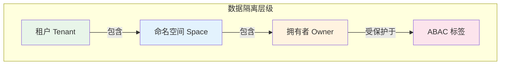
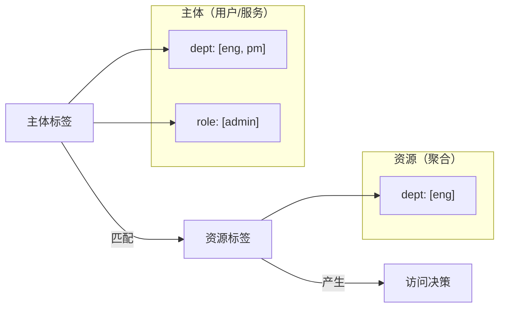

# 数据权限

Wow 提供了三个可选的数据隔离层和一个基于属性的访问控制层：

1. **租户（Tenant）** — 按组织/客户隔离数据（可选）
2. **拥有者（Owner）** — 在租户内按用户身份隔离数据（可选）
3. **命名空间（Space）** — 在租户内提供基于命名空间的分区（可选）
4. **ABAC** — 基于属性的细粒度访问控制

这三层隔离都是**可选**的，可以独立启用或自由组合。单租户应用无需启用任何隔离层；SaaS 应用可以按需组合租户、拥有者、命名空间和 ABAC。



## RESTful URL 模式

数据隔离层级直接体现在自动生成的 RESTful API 路径中：

```
[tenant/{tenantId}]/[owner/{ownerId}]/resource/[{resourceId}]/action
```

| 层级 | 路径 / 请求头 | 生效条件 |
|------|--------------|---------|
| 租户 | `tenant/{tenantId}` 路径前缀 | 聚合**未**标记 `@StaticTenantId` |
| 拥有者 | `owner/{ownerId}` 路径前缀 | `@AggregateRoute(owner ≠ NEVER)` |
| 命名空间 | `Wow-Space-Id` 请求头 | `@AggregateRoute(spaced = true)` |

框架为每个聚合生成**多套路由变体** — 默认路由（无前缀）、仅租户路由、仅拥有者路由 — 调用方可以根据需要选择最小作用域。

## 租户（Tenant）

租户是最高层级的数据隔离边界。在 SaaS 应用中，每个客户（组织）通常是一个独立的租户。Wow 自动在命令和事件中传播租户上下文，确保数据在存储层面被隔离。

### 基于注解的租户 ID

使用 `@TenantId` 注解标记命令或聚合状态中的租户标识字段：

```kotlin
@AggregateRoot
class OrderAggregate(
    @AggregateId
    val orderId: String,

    @TenantId
    val tenantId: String  // 该订单所属的组织
)
```

```kotlin
data class CreateOrder(
    @AggregateId
    val orderId: String,

    @TenantId
    val tenantId: String, // 自动从请求上下文填充

    val items: List<OrderItem>
)
```

框架利用此注解实现：
- 从请求中自动设置租户上下文
- 按租户隔离事件存储和快照存储
- 在查询操作中强制租户边界
- 在 RESTful API 中生成 `tenant/{tenantId}` 路径前缀

### 静态租户 ID

对于始终属于固定租户的聚合（如系统配置），使用 `@StaticTenantId`：

```kotlin
@AggregateRoot
@StaticTenantId("system-tenant")
class SystemConfigurationAggregate {
    // 始终属于系统租户
    // 生成的 API 不会包含 tenant/{tenantId} 路径前缀
}
```

### 默认租户

未指定租户时，Wow 使用默认租户 ID `(0)`。这对单租户应用是透明的 — 无需处理租户 ID。

## 拥有者（Owner）

在租户内部，**拥有者**层级按用户身份隔离数据，确保用户只能访问自己的数据（如"我的订单"、"我的购物车"）。

### 基于注解的拥有者 ID

使用 `@OwnerId` 注解标记拥有者标识：

```kotlin
data class AddToCart(
    @AggregateId
    val cartId: String,

    @OwnerId
    val userId: String,  // 拥有此购物车的用户

    val productId: String,
    val quantity: Int
)
```

### 拥有者路由策略

`@AggregateRoute` 注解通过 `owner` 参数控制拥有权的强制方式：

```kotlin
@AggregateRoot
@AggregateRoute(
    resourceName = "orders",
    owner = AggregateRoute.Owner.ALWAYS
)
class OrderAggregate(
    @AggregateId
    val orderId: String,

    @OwnerId
    val customerId: String
)
```

可用策略：

| 策略 | `owned` | 说明 | API 路径 | 适用场景 |
|------|---------|------|---------|---------|
| `NEVER` | `false` | 无需拥有者上下文 | `/orders/{id}` | 公共资源、系统聚合 |
| `ALWAYS` | `true` | 始终需要拥有者上下文 | `/owner/{ownerId}/orders/{id}` | 用户专属数据（订单、个人资料） |
| `AGGREGATE_ID` | `true` | 聚合 ID 即拥有者 ID | `/owner/{ownerId}/orders`（无 `{id}`） | 每用户聚合（用户资料、设置） |

当使用 `AGGREGATE_ID` 时，`{resourceId}` 路径参数会被移除，因为拥有者 ID 已经标识了聚合。

### 拥有权转移

当需要变更拥有者时（如将任务转交给其他用户），实现 `OwnerTransferred` 事件接口：

```kotlin
data class TaskTransferred(
    override val toOwnerId: String
) : OwnerTransferred
```

框架识别此事件并自动更新聚合的拥有者上下文。

## 命名空间（Space）

**命名空间**在租户内提供基于命名空间的数据分区，增加了第三个隔离维度，适用于：

- 环境隔离（dev / staging / prod）
- 业务域分区（primary / archive）
- 组织单元边界

### 启用命名空间

在 `@AggregateRoute` 中设置 `spaced = true`：

```kotlin
@AggregateRoot
@AggregateRoute(
    resourceName = "sales-order",
    spaced = true,
    owner = AggregateRoute.Owner.ALWAYS
)
class Order(private val state: OrderState)
```

当 `spaced = true` 时，生成的 API 会添加 `Wow-Space-Id` 请求头参数。默认命名空间 ID 为空字符串 `""`，即所有未显式指定命名空间的聚合都在默认空间中。

### 命名空间转移

命名空间转移遵循与拥有权转移相同的模式 — 实现 `SpaceTransferred`：

```kotlin
data class OrderArchived(
    override val toSpaceId: SpaceId
) : SpaceTransferred
```

框架识别此事件并自动更新聚合的命名空间上下文。

## ABAC（基于属性的访问控制）

租户、拥有者和命名空间提供结构性隔离，而 **ABAC** 提供细粒度的、基于属性的访问控制。它通过为**主体**（用户/服务）和**资源**（聚合）附加标签，然后在查询时进行匹配来实现。

### 核心概念



**AbacTags** — 键值对映射，每个键对应一个值列表：

```kotlin
// 用户标签：属于工程部和产品部，角色为管理员
val userTags: AbacTags = mapOf(
    "dept" to listOf("eng", "pm"),
    "role" to listOf("admin")
)

// 资源标签：仅允许工程部访问
val resourceTags: AbacTags = mapOf(
    "dept" to listOf("eng")
)

// 公开资源：无标签 = 所有人可访问
val publicResource: AbacTags = emptyMap()
```

**通配符** — 值 `["*"]` 匹配该键下的所有值：

```kotlin
// 可以访问任何部门的资源
val adminTags: AbacTags = mapOf(
    "dept" to listOf("*")
)
```

### 应用资源标签

使用 `ApplyAbacTags` 命令接口为聚合设置标签：

```kotlin
@AggregateRoot
class DocumentAggregate(
    @AggregateId
    val docId: String,
    var tags: AbacTags = emptyMap()
) {
    @OnCommand
    fun onCommand(command: ApplyAbacTags): AbacTagsApplied {
        // 验证并合并标签
        return DefaultResourceTagsApplied(command.tags)
    }
}
```

或者使用内置的 `DefaultApplyResourceTags` 命令，它提供了开箱即用的标签管理端点：

```kotlin
// PUT /{resourceName}/{id}/tags
// Body: { "tags": { "dept": ["eng"], "role": ["admin"] } }
```

### 标签合并

使用 `merge` 扩展函数合并标签。对于相同的键，双方的值会合并（并集）：

```kotlin
val tags1 = mapOf("dept" to listOf("eng"), "role" to listOf("admin"))
val tags2 = mapOf("dept" to listOf("pm"), "team" to listOf("backend"))

tags1.merge(tags2)
// 结果：{ "dept": ["eng", "pm"], "role": ["admin"], "team": ["backend"] }
```

### 动态标签提取（StateAggregateTagsExtractor）

标签可以在查询时从聚合状态中动态提取，而非仅依赖静态存储。在状态类上实现 `StateAggregateTagsExtractor`：

```kotlin
class OrderState(
    val id: String
) : StateAggregateTagsExtractor<OrderState> {

    lateinit var address: ShippingAddress
    // ... 其他字段 ...

    override fun extract(source: ReadOnlyStateAggregate<OrderState>): AbacTags {
        val stateTags = mapOf(
            "address-country" to listOf(address.country),
            "address-province" to listOf(address.province),
        )
        // 与聚合上显式存储的标签合并
        return stateTags.merge(source.tags)
    }
}
```

这种模式允许 ABAC 规则基于聚合状态字段（如地址）与显式分配的标签组合进行匹配。

### ABAC 查询过滤器

查询快照时，`AbacQueryFilter` 根据主体的标签自动注入权限过滤条件。匹配规则如下：

| 主体标签 | 资源标签 | 结果 |
|---------|---------|------|
| `["*"]`（通配符） | 任意 | ✅ 匹配 |
| `["a", "b"]` | `["a"]` | ✅ 匹配 |
| `["a", "b"]` | `["c"]` | ❌ 不匹配 |
| 任意 | 键不存在 | ✅ 匹配（该键对应的资源为公开） |

过滤器将主体标签转换为查询条件，所有标签键之间使用 AND 逻辑：
- **通配符**标签：检查资源上该键是否存在（`EXISTS`）
- **普通**标签：匹配键不存在、值为空、或值在主体列表中的资源

实现自定义的主体标签解析，继承 `AbacQueryFilter`：

```kotlin
@Component
class MemberAbacQueryFilter(
    private val memberCache: MemberCache
) : AbacQueryFilter() {

    override fun getPrincipalTags(
        contextView: ContextView,
        context: QueryContext<*, *>
    ): Mono<AbacTags> {
        val securityContext = contextView.getSecurityContextOrEmpty()
            ?: return Mono.empty()
        val principal = securityContext.principal

        // 根据用户 + 租户 + 应用从缓存查找成员标签
        return Mono.fromCallable {
            val memberId = memberId(userId = principal.id, tenantId = principal.tenantId)
            memberCache[memberId]?.tags?.get(appId)
        }
    }
}
```

## 隔离层级总结

| 层级 | 作用范围 | 机制 | API 表现 | 典型场景 |
|------|---------|------|---------|---------|
| 租户 | 组织 | `@TenantId` / `@StaticTenantId` + 存储隔离 | `tenant/{tenantId}` 路径前缀 | SaaS 多租户 |
| 命名空间 | 租户内的命名空间 | `@AggregateRoute(spaced = true)` + 存储分区 | `Wow-Space-Id` 请求头 | 环境、业务域隔离 |
| 拥有者 | 个人用户 | `@OwnerId` + `@AggregateRoute(owner)` | `owner/{ownerId}` 路径前缀 | "我的数据"隔离 |
| ABAC | 基于属性 | 主体标签 + 资源标签 + 查询过滤器 | 内部过滤（无 API 表面） | 细粒度权限（部门、角色、级别） |

这些层级是**叠加**关系 — 启用更多层级意味着更严格的限制。未启用任何层级的查询返回全部数据；同时启用租户 + 拥有者 + ABAC，则仅返回经过认证的用户被允许查看的数据。
