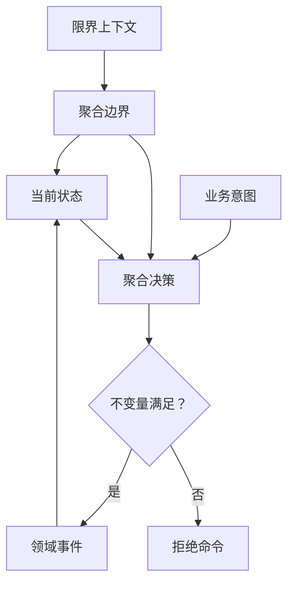

# 聚合与不变量

聚合是一条事件流的一致性边界。它把一次业务变更分成两个明确职责：命令侧根据当前状态作出决策，状态侧只通过已发生的领域事件重建结果。每个状态变化都应能由事件解释。

聚合把状态、业务决策和不变量封装在同一个一致性边界中。



## 从业务边界开始

先写不变量，再写代码。以购物车为例，业务规则可以先写成决策表：

| 当前状态与意图 | 决策结果 | 溯源后的状态 |
| --- | --- | --- |
| 商品不存在，添加商品 | `CartItemAdded` | 商品加入 `items` |
| 商品已存在，再次添加 | `CartQuantityChanged` | 替换对应商品数量 |
| 商品数已达到 `MAX_CART_ITEM_SIZE` | 拒绝操作 | 状态不变，不产生业务事件 |
| 删除一组商品 | `CartItemRemoved` | 过滤对应 `productId` |

这张表决定三类模型：命令表达意图，事件表达事实，状态对象只在溯源事件时改变。完成建模的信号是每条不变量都有明确的成功事件、拒绝结果和确定性的溯源结果。

## 限界上下文与聚合身份

限界上下文拥有一套连贯的业务语言及其聚合名称。聚合运行时身份由 `contextName`、`aggregateName`、`tenantId` 与 `id` 组成；路由和存储都必须保留完整的 `AggregateId`。

`tenantId` 是路由和隔离上下文，不会建立第二套 ID 命名空间。在同一个 `NamedAggregate`（`contextName` + `aggregateName`）中，`id` 必须跨租户唯一。术语与身份细节见[核心概念](../core-concepts.md)。

## 状态、领域事件与不变量

`Cart` 读取 `CartState` 并返回事件；`CartState` 的 setter 保持私有，只在溯源函数中更新：

```kotlin
class CartState(val id: String) {
    var items: List<CartItem> = listOf()
        private set

    @OnSourcing
    fun onCartItemAdded(event: CartItemAdded) {
        items = items + event.added
    }

    @OnSourcing
    fun onCartQuantityChanged(event: CartQuantityChanged) {
        items = items.map {
            if (it.productId == event.changed.productId) event.changed else it
        }
    }
}
```

状态对象的构造函数必须是 `ctor()`、`ctor(id)` 或 `ctor(id, tenantId)` 之一；参数最多两个，且都为 `String`。`onSourcing` 是约定名，其他函数名需要 `@OnSourcing`。溯源函数不返回事件，不访问外部服务，也不读取当前时间或随机数。

## 推荐的聚合组织方式

默认使用命令对象组合状态对象：

```text
命令 -> 命令聚合 -> 领域事件 -> 状态聚合
              读取状态          修改状态
```

`Cart` 与 `Order` 都采用此结构，因此谁作决策、谁改变状态一目了然。也支持命令对象继承状态对象，或把命令和状态放在一个很小的类中；无论采用哪一种，命令路径都不能直接修改状态，状态 setter 仍应保持私有。

不要为了预期的复用增加继承层级。Wow 同时支持 Kotlin 与 Java；完整 Java 组织方式见[银行转账示例](../../reference/example/transfer)。

## 确定性状态演进

相同的初始状态和事件序列必须得到相同结果。否则历史重放、快照校验与恢复都不可靠。

一个处理结果含有多个事件时，事件顺序也是契约。状态只消费会改变本聚合状态的事件；为其他组件发布的通知事件可以不改变该状态。这样同一份历史可以被重复重放，而不会因环境或执行时间不同产生新结果。

## 生命周期不变量

订单示例把允许的状态转换显式写在命令侧：

| 命令 | 允许状态 | 事件与下一状态 |
| --- | --- | --- |
| `ChangeAddress` | `CREATED` | `AddressChanged`，状态仍为 `CREATED` |
| `PayOrder` | `CREATED` | `OrderPaid`，足额时进入 `PAID` |
| `ShipOrder` | `PAID` | `OrderShipped`，进入 `SHIPPED` |
| `ReceiptOrder` | `SHIPPED` | `OrderReceived`，进入 `RECEIVED` |

无效转换应在命令侧被拒绝，状态侧不猜测命令意图。删除和恢复也是聚合生命周期的一部分：测试删除后的拒绝访问、成功恢复与重复恢复失败。

## 进入命令定义

聚合边界和不变量明确后，继续[定义命令](../command/definition.md)：为意图提供载荷、目标聚合元数据与处理函数。
