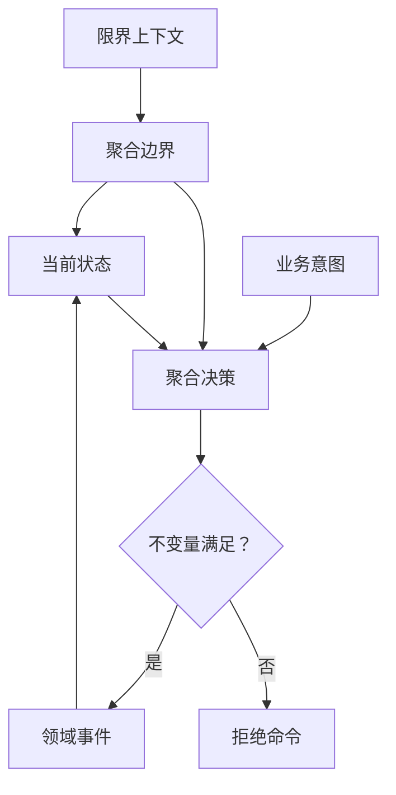

# 聚合与不变量

聚合是一条事件流的一致性边界。它把一次业务变更分成两个明确职责：命令侧根据当前状态作出决策，状态侧只通过已发生的领域事件重建结果。每个状态变化都应能由事件解释。

聚合把状态、业务决策和不变量封装在同一个一致性边界中。


```mermaid
flowchart TB
    Context["限界上下文"] --> Aggregate["聚合边界"]
    Intent["业务意图"] --> Decision["聚合决策"]
    Aggregate --> State["当前状态"]
    Aggregate --> Decision
    State --> Decision
    Decision --> Invariant{"不变量满足？"}
    Invariant -->|是| Event["领域事件"]
    Invariant -->|否| Reject["拒绝命令"]
    Event --> State
```

## 从业务边界开始

先写不变量，再写代码。以购物车为例，业务规则可以先写成决策表：

| 当前状态与意图 | 决策结果 | 溯源后的状态 |
| --- | --- | --- |
| 商品不存在，添加商品 | `CartItemAdded` | 商品加入 `items` |
| 商品已存在，再次添加 | `CartQuantityChanged` | 替换对应商品数量 |
| 商品数已达到 `MAX_CART_ITEM_SIZE` | 拒绝操作 | 状态不变，不产生业务事件 |
| 删除一组商品 | `CartItemRemoved` | 过滤对应 `productId` |

这张表决定三类模型：命令表达意图，事件表达事实，状态对象只在溯源事件时改变。完成建模的信号是每条不变量都有明确的成功事件、拒绝结果和确定性的溯源结果。

## 限界上下文与聚合身份

限界上下文拥有一套连贯的业务语言及其聚合名称。聚合运行时身份由 `contextName`、`aggregateName`、`tenantId` 与 `id` 组成；路由和存储都必须保留完整的 `AggregateId`。

`tenantId` 是路由和隔离上下文，不会建立第二套 ID 命名空间。在同一个 `NamedAggregate`（`contextName` + `aggregateName`）中，`id` 必须跨租户唯一。术语与身份细节见[核心概念](../core-concepts.md)。

## 聚合策略：Space 与 Owner

自 9.3.0 起，聚合在聚合类上声明自己的策略；`@AggregateRoute` 只负责路由（`resourceName`、`enabled`）：

```kotlin
@AggregateRoot
@AggregateRoute(resourceName = "sales-order")
@Spaced
@AggregateOwner(OwnerPolicy.ALWAYS)
class Order(private val state: OrderState)
```

| 声明 | 策略 | 未声明时 |
|---|---|---|
| `@Spaced`（`@Spaced(false)` 声明相反的值） | 命令和查询带 space，见[启用命名空间](../data-access.md#启用命名空间) | 不带 space |
| `@AggregateOwner(OwnerPolicy.NEVER \| ALWAYS \| AGGREGATE_ID)` | 拥有者策略，见[拥有者路由策略](../data-access.md#拥有者路由策略) | `NEVER` |
| `@StaticTenantId("…")` | 所有实例属于同一个固定租户 | 动态租户 |

每项策略只在一处解析，即 `AggregateMetadata`（`spaced`、`owner`、`staticTenantId`）：先读聚合级声明，再读 9.2 读取的位置，最后取默认值。已弃用的 `@AggregateRoute(spaced = …, owner = …)` 及其 `AggregateRoute.Owner` 枚举在新注解缺席时仍被读取，并且只有取值不同于默认值（`spaced = true`、`owner` 不是 `NEVER`）时才算声明，所以没有改动的聚合保持 9.2 的行为。

继承层次中由最近一个声明了该策略的类决定，所以聚合上的 `@Spaced(false)` 或 `@AggregateOwner(OwnerPolicy.NEVER)` 会覆盖父类型上的 `@AggregateRoute(spaced = true, owner = …)`。同一项策略的两处声明不一致时报错，而不是由其中一处悄悄生效：

- 同一个类上 `@Spaced(false)` 与 `@AggregateRoute(spaced = true)` 并存，或 `@AggregateOwner` 与取值不同的 `@AggregateRoute(owner = …)` 并存；
- `@StaticTenantId` 与同一聚合在 `@BoundedContext.Aggregate` 或手写的 `META-INF/wow-metadata.json` 中的 `tenantId` 不同。9.3.0 之前两者会悄悄不一致：运行时用 `@StaticTenantId`，生成的元数据却保留限界上下文里的值；
- classpath 上两份 `META-INF/wow-metadata.json` 给同一聚合不同的 `tenantId`（或 `type`，或给同一限界上下文不同的别名）。9.3.0 之前第二份资源只记一条错误日志就被丢弃，结果取决于 classpath 顺序；无法解析的资源仍然记日志并跳过。

应用启动失败，错误信息写明聚合（两份资源冲突时还写明两个资源的 URL）；Wow KSP 处理器让编译失败，错误信息里写明聚合。下面两种在 9.2 能启动的情形不再可行：

- api 模块里 `@BoundedContext.Aggregate(tenantId = "a")`，domain 模块里聚合带 `@StaticTenantId("b")`：启动失败；
- 聚合只写了 `@StaticTenantId`（默认租户），而同一模块的限界上下文声明了另一个租户：编译失败。处理器还会把非默认的策略记录到生成的 `META-INF/wow-metadata.json`（`"spaced": true`、`"owner": "ALWAYS"`）；9.2 节点忽略这些字段，`GET /wow/metadata` 也不返回它们。它们仅供参考：运行时从注解读取策略，修改这些键不会改变任何行为。

### 从 `@AggregateRoute(spaced, owner)` 迁移

| 9.2 及之前 | 自 9.3.0 起 |
|---|---|
| `@AggregateRoute(spaced = true)` | `@Spaced` |
| `@AggregateRoute(owner = AggregateRoute.Owner.X)` | `@AggregateOwner(OwnerPolicy.X)` |
| `@AggregateRoute(resourceName = "r", spaced = true, owner = …)` | `@AggregateRoute(resourceName = "r")` 加上两个注解 |

只剩这两个属性的 `@AggregateRoute` 可以删掉。这一改动只改声明：路由、OpenAPI 文档、命令的 space 与 owner、存储都不变，改动前后构建的节点可以混部。读取策略的代码改用 `AggregateMetadata.spaced` 与 `AggregateMetadata.owner`，用 `AggregateRouteMetadata.ownerPolicy`（及其 `OwnerPolicy` 构造函数）代替 `owner`。弃用的写法在 10.0.0 移除。

## 状态、领域事件与不变量

`Cart` 读取 `CartState` 并返回事件；`CartState` 的 setter 保持私有，只在溯源函数中更新：

```kotlin
class CartState(val id: String) {
    var items: List<CartItem> = listOf()
        private set

    @OnSourcing
    fun onCartItemAdded(event: CartItemAdded) {
        items = items + event.added
    }

    @OnSourcing
    fun onCartQuantityChanged(event: CartQuantityChanged) {
        items = items.map {
            if (it.productId == event.changed.productId) event.changed else it
        }
    }
}
```

状态对象的构造函数必须是 `ctor()`、`ctor(id)` 或 `ctor(id, tenantId)` 之一；参数最多两个，且都为 `String`。`onSourcing` 是约定名，其他函数名需要 `@OnSourcing`。溯源函数不返回事件，不访问外部服务，也不读取当前时间或随机数。

## 推荐的聚合组织方式

默认使用命令对象组合状态对象：

```text
命令 -> 命令聚合 -> 领域事件 -> 状态聚合
              读取状态          修改状态
```

`Cart` 与 `Order` 都采用此结构，因此谁作决策、谁改变状态一目了然。也支持命令对象继承状态对象，或把命令和状态放在一个很小的类中；无论采用哪一种，命令路径都不能直接修改状态，状态 setter 仍应保持私有。

不要为了预期的复用增加继承层级。Wow 同时支持 Kotlin 与 Java；完整 Java 组织方式见[银行转账示例](../../reference/example/transfer)。

## 确定性状态演进

相同的初始状态和事件序列必须得到相同结果。否则历史重放、快照校验与恢复都不可靠。

一个处理结果含有多个事件时，事件顺序也是契约。状态只消费会改变本聚合状态的事件；为其他组件发布的通知事件可以不改变该状态。这样同一份历史可以被重复重放，而不会因环境或执行时间不同产生新结果。

## 生命周期不变量

订单示例把允许的状态转换显式写在命令侧：

| 命令 | 允许状态 | 事件与下一状态 |
| --- | --- | --- |
| `ChangeAddress` | `CREATED` | `AddressChanged`，状态仍为 `CREATED` |
| `PayOrder` | `CREATED` | `OrderPaid`，足额时进入 `PAID` |
| `ShipOrder` | `PAID` | `OrderShipped`，进入 `SHIPPED` |
| `ReceiptOrder` | `SHIPPED` | `OrderReceived`，进入 `RECEIVED` |

无效转换应在命令侧被拒绝，状态侧不猜测命令意图。删除和恢复也是聚合生命周期的一部分：测试删除后的拒绝访问、成功恢复与重复恢复失败。

## 进入命令定义

聚合边界和不变量明确后，继续[定义命令](../command/definition.md)：为意图提供载荷、目标聚合元数据与处理函数。
