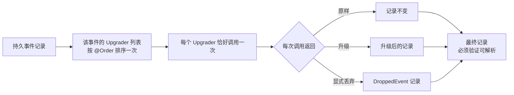

# 事件演进

读取历史事件时，`EventUpgraderFactory` 按 `@Order` 调用该事件已注册的全部 Upgrader，每个恰好一次；每次调用都可返回原记录、升级记录或 `DroppedEvent` 记录，应用必须验证最终记录可解析。



## 为什么持久事件需要长期兼容

持久化领域事件是长期 wire 合同。修改 Kotlin 类型只影响新代码；EventStore 中的旧记录仍保留原来的事件名、`bodyType`、`revision` 和 body。读取时，Wow 先升级 `DomainEventRecord`，再把它解析为当前事件类型并交给状态溯源。

Upgrader 只改变本次读取使用的记录，不会把结果写回 EventStore。事件历史仍是权威事实；错误业务事实需要可审计的修复或补偿，不能伪装成无害的 Schema 升级。

## Revision 与 Upgrader

`revision` 描述事件载荷 Schema，由 `@Event(revision = ...)` 声明；聚合 `version` 描述事件流在单个聚合历史中的顺序。两者职责不同，不能互相替代。

`EventUpgrader` 以 `contextName + aggregateName + eventName` 选择历史事件，并显式把旧记录转换为目标结构：

```kotlin
@Order(100)
class OrderCreatedV2Upgrader : EventUpgrader {
    override val eventNamedAggregate =
        "sales.order".toNamedAggregate()
            .toEventNamedAggregate("order_created")

    override fun upgrade(record: DomainEventRecord): DomainEventRecord {
        if (record.revision != "0.0.1") return record

        return record.toMutableDomainEventRecord().apply {
            body.put("currency", "CNY")
            revision = "2.0.0"
        }
    }
}
```

每一步都必须检查自己的源 revision 并写出目标 revision；框架不会根据 revision 自动推导转换。

## 升级链顺序

`EventUpgraderFactory` 通过 ServiceLoader 发现实现，按事件身份分组，再按 Wow `@Order` 排序。读取一条记录时，它会依次执行该事件注册的**全部** Upgrader：

```text
0.0.1 --order 100--> 1.0.0 --order 200--> 2.0.0
```

因此每一步对不匹配的 revision 应原样返回。框架只保证函数顺序；链的连续性、缺失 revision 和最终输出能否反序列化由应用验证。只要历史中仍可能存在某个源 revision，就要保留对应步骤。

运行时 artifact 需要包含：

```text
META-INF/services/me.ahoo.wow.event.upgrader.EventUpgrader
```

文件中每行列出一个实现类。只在测试源码中直接注册实现，不能证明生产 artifact 的 ServiceLoader 配置有效。

## 字段演进

| 变化 | 兼容策略 |
| --- | --- |
| 增加可选字段或安全默认值 | 先用真实旧记录证明当前 Mapper 可读取，并验证重放状态；不需要转换时不写 Upgrader |
| 增加必填字段、改类型或嵌套结构 | 用 Upgrader 把旧 body 转换到明确的目标 revision |
| 改事件名或 JVM 类型 | 同时更新并验证 `name`、`bodyType`、`revision`、body 与事件类型注册 |
| 仅修改聚合 version | 不能表达事件 Schema 变化；聚合 version 只负责顺序与并发 |

`MutableDomainEventRecord` 允许修改 `name`、`bodyType`、`revision` 和 body，但保留聚合身份、事件流版本、sequence、commandId 和时间等历史位置数据。重命名后，目标事件身份与 revision 必须能解析到预期类型。

## 删除、替换与 DroppedEvent

删除或替换事件类型不等于删除历史。若新状态模型确实不再需要某个事件，可由 Upgrader 将它转换为 `DroppedEvent`：`toDroppedEventRecord()` 把 name、bodyType 和 body 替换为框架的 dropped 记录，事件在流中的版本与顺序仍保留。

::: danger
不要为了绕过反序列化失败而 drop 事件。只有历史回放证明后续状态、业务不变量和下游处理都不依赖该事实时，才可以使用 `DroppedEvent`。
:::

若旧事实仍影响当前状态，应升级或替换为语义等价的当前事件；若事实本身错误，应采用可审计的数据修复或补偿流程。

## 历史回放验证

验证应覆盖完整读取链，而不只是 Upgrader 函数：

1. 对每个真实存在的源 revision 验证目标 name、type、revision 和 body。
2. 从最终 artifact 通过 ServiceLoader 加载链，并断言 `@Order` 顺序。
3. 让升级结果通过当前事件类型注册与反序列化。
4. 从空状态重放脱敏真实样本或完整夹具，比较版本、关键状态和业务不变量。
5. 验证投影、Saga 与其他消费者对旧/新事件的结果。

仓库中的最窄入口是：

```bash
./gradlew :wow-core:test --tests "me.ahoo.wow.event.upgrader.EventUpgraderFactoryTest"
./gradlew :wow-core:test --tests "me.ahoo.wow.serialization.JsonSerializerEventTest"
```

实现入口：[`EventUpgrader`](https://github.com/Ahoo-Wang/Wow/blob/main/wow-core/src/main/kotlin/me/ahoo/wow/event/upgrader/EventUpgrader.kt)、[`EventUpgraderFactory`](https://github.com/Ahoo-Wang/Wow/blob/main/wow-core/src/main/kotlin/me/ahoo/wow/event/upgrader/EventUpgraderFactory.kt)、[`DroppedEvent`](https://github.com/Ahoo-Wang/Wow/blob/main/wow-core/src/main/kotlin/me/ahoo/wow/event/upgrader/DroppedEvent.kt)。

## 发布与回滚边界

发布前应统计真实 revision 分布、回放代表性与最长事件流，并验证备份恢复。若滚动发布期间新旧实例并存，旧实例必须能读取新实例写入的 revision；不能双向读取时，需要停写或分阶段兼容。

回滚应用版本时，它依赖的 Upgrader 链也必须保留。通过本地测试只证明候选代码，不证明生产数据分布、实例并存窗口、备份可恢复性或完整回放耗时。
