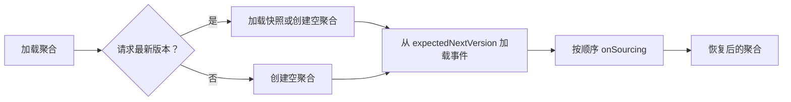

# 事件溯源

事件溯源把聚合的已发生事实保存为有序的 `DomainEventStream`，并从这些事实恢复状态。命令负责作出决策；事件一旦成功追加到 `EventStore`，才成为可恢复的权威历史。

## 权威历史模型

事件流是聚合的一致性历史；快照、投影和事件处理器的结果都不能替代它。命令执行的完整阶段见[命令处理管线](../command/internals/pipeline.md)；本页只定义历史何时成为权威，以及恢复所依赖的边界。

| 数据 | 角色 | 能否替代权威历史 |
| --- | --- | --- |
| `DomainEventStream` | 聚合已发生事实 | 可以；它就是权威历史 |
| `SnapshotStore` 中的快照 | 可替换的加载检查点 | 不可以；可由事件历史重建 |
| 投影 | 面向查询的派生读模型 | 不可以；按自身恢复策略重建 |
| 事件处理器副作用 | 集成或应用结果 | 不可以；由处理器的幂等、重试或补偿边界负责 |

`EventStore.append` 成功前，内存中的工作状态不是权威状态。追加之后的消息发送、快照或投影失败也不会撤销已经追加的事件历史。

## DomainEvent 与 DomainEventStream

`DomainEvent<T>` 表示不可变的领域事实。一次命令执行产生一个非空事件流；流中的事件属于同一聚合、按版本递增排序，事件流与 `commandId` 一一对应。

```kotlin
interface DomainEventStream :
    EventMessage<DomainEventStream, List<DomainEvent<*>>>,
    RequestId,
    Iterable<DomainEvent<*>>,
    Copyable<DomainEventStream> {
    override val aggregateId: AggregateId
    val size: Int
}
```

`SimpleDomainEventStream` 从第一条事件派生 `aggregateId`、`commandId`、`version`、所有者、空间和创建时间，并保留 `requestId` 与消息头。构造时拒绝空事件列表；重放时应保留事件顺序，而不是重新生成事实。

## EventStore 契约

`EventStore` 负责追加和按聚合加载历史。版本范围与时间范围均包含首尾边界；`single` 从指定版本加载一条，`last` 由实现提供最新流。

```kotlin
interface EventStore :
    RequestIdExistenceChecker,
    AggregateIdScanner,
    AutoCloseable {
    fun append(eventStream: DomainEventStream): Mono<Void>

    fun load(
        aggregateId: AggregateId,
        headVersion: Int = DEFAULT_HEAD_VERSION,
        tailVersion: Int = DEFAULT_TAIL_VERSION,
    ): Flux<DomainEventStream>

    fun load(
        aggregateId: AggregateId,
        headEventTime: Long,
        tailEventTime: Long,
    ): Flux<DomainEventStream>

    fun single(aggregateId: AggregateId, version: Int): Mono<DomainEventStream>
    fun last(aggregateId: AggregateId): Mono<DomainEventStream>
}
```

接口声明追加可能产生 `EventVersionConflictException`、`DuplicateAggregateIdException` 或 `DuplicateRequestIdException`。调用方必须以 Reactor 流的完成或错误判断追加结果，不能把订阅前的 `Mono` 当作已持久化。

## 确定性状态溯源

相同初始状态和相同的事件流顺序必须得到相同状态。`SimpleStateAggregate.onSourcing` 先检查 `IgnoreSourcing` 初始错误流并直接返回；仅对未忽略的流验证聚合身份与 `expectedNextVersion`，再更新版本、操作者、时间、所有者、空间等元数据，最后按顺序调用已注册的溯源函数。

| 条件 | 恢复行为 |
| --- | --- |
| 初始版本且所有事件均为带 `ErrorInfo` 的 `IgnoreSourcing` | 忽略整条流，不推进状态 |
| 未被忽略的事件流聚合身份不匹配 | 抛出 `IllegalArgumentException` |
| 未被忽略的事件流版本不是 `expectedNextVersion` | 抛出 `SourcingVersionConflictException` |
| 找不到事件体的溯源函数 | 事件流仍推进版本，状态业务字段不变 |

溯源函数只根据事件更新状态；不要在其中读取当前时间、随机数或外部服务。这样历史重放、快照校验和故障恢复才有同一结果。

## 聚合状态恢复

应用通过 `StateAggregateRepository` 恢复聚合。`EventSourcingStateAggregateRepository` 在请求最新版本时先加载快照；没有快照则创建空聚合，再从 `expectedNextVersion` 加载事件流并逐条执行 `onSourcing`。



按历史版本或事件时间恢复时从空聚合开始，不能使用最新快照；未来检查点会污染目标时点。时间恢复从当前 `eventTime + 1` 加载到请求的尾时间。

## 追加、版本与请求身份

事件流版本是单一聚合内的顺序边界。存储实现应在追加时拒绝冲突版本；初始版本冲突映射为重复聚合身份。相同 `requestId` 在同一聚合内表示重复请求，默认 `existsRequestId` 通过扫描该聚合的事件流检查它；不同聚合可使用相同 `requestId`。

重试同一业务意图时复用稳定的 `requestId`。追加结果不确定或后续阶段失败时，先按聚合和 `requestId` 检查权威历史，再决定是否重试；不要把未提交的内存状态当作已经保存。

## 存储实现边界

`wow-core` 定义流的追加、加载和冲突类型，不规定存储引擎、表/集合 Schema、事务技术、索引、持久化级别或重试策略。`InMemoryEventStore` 适合测试与本地验证，不是生产持久性的证明。

| 实现责任 | 必须由所选后端验证 |
| --- | --- |
| 版本冲突与重复请求 | 原子性、异常映射和并发行为 |
| 事件序列 | 聚合内排序与范围加载语义 |
| 事件数据 | 序列化兼容、revision、备份与恢复 |
| 运行时配置 | capability、连接、存储路由与快照策略 |

精确属性、默认值和装配边界见[核心配置参考](../../reference/config/core.md)。

## 恢复与验证

验证的重点是可重复恢复，而不是只验证一次追加成功：

1. 从空状态按版本和时间上限重放，断言得到目标版本与状态。
2. 验证快照后的加载从 `expectedNextVersion` 继续，不跳过或重复事件。
3. 验证聚合身份不匹配和版本不连续都失败。
4. 验证重复初始版本、版本冲突与同聚合重复 `requestId` 的后端契约。

`wow-core` 的恢复与溯源测试覆盖版本/时间恢复、元数据更新、未知事件体、忽略的初始错误流及身份/版本冲突。为实际存储实现运行对应模块和 TCK 测试，才能证明生产后端也满足这些边界。
