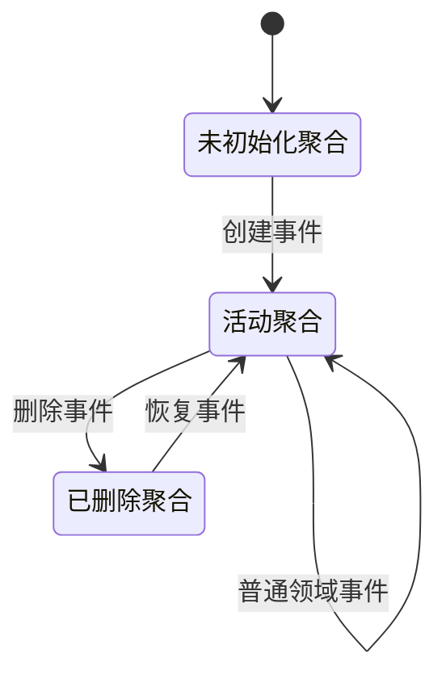

# 聚合生命周期

生命周期由事件驱动；删除和恢复仍然是聚合状态演进的一部分。



## 创建或恢复状态

`StateAggregateFactory` 根据状态元数据和完整 `AggregateId` 创建未初始化的状态聚合。加载现有聚合应通过 `StateAggregateRepository`：

- 加载最新版本时，`EventSourcingStateAggregateRepository` 先尝试物化最新快照；没有快照则创建空聚合，再从 `expectedNextVersion` 加载事件。
- 加载指定历史版本或历史时间时，从空聚合开始重放，不能使用可能晚于目标时间点的最新快照。
- `EventStoreStateAggregateRepository` 始终从空聚合加载事件，不使用快照。

应用代码不应自行拼接快照与事件读取。事件流仍是权威历史；快照只提供可替换的恢复起点。详见[事件溯源](./event-sourcing.md)与[快照](../domain/snapshot.md)。

## 状态溯源生命周期

`SimpleStateAggregate.onSourcing` 对一个 `DomainEventStream` 执行以下顺序：

1. 若事件流满足 `ignoreSourcing`，立即返回，不改变状态、版本或元数据。
2. 校验事件流的完整 `AggregateId` 等于当前聚合身份。
3. 校验事件流版本等于 `expectedNextVersion`。
4. 更新 version、owner、space、eventId、operator 和 eventTime；首个版本同时记录 firstOperator 与 firstEventTime。
5. 按流中顺序处理内置元数据事件，并调用匹配的状态 sourcing 函数。
6. 若状态实现 `StateAggregateTagsExtractor`，在整条事件流处理完成后重新提取 tags。

某个事件没有匹配的 sourcing 函数时，该事件体被忽略，但事件流版本仍然前进。这允许不改变当前状态的通知事件保持历史连续；也意味着回放测试必须能发现遗漏的状态转换。

## 删除、恢复、Owner 与 Space

删除和恢复是状态元数据变化，不会删除或撤销历史：

| 事件或流信息 | 状态变化 |
| --- | --- |
| `AggregateDeleted` | `deleted = true` |
| `AggregateRecovered` | `deleted = false` |
| `OwnerTransferred` | owner 更新为事件中的 `toOwnerId` |
| `SpaceTransferred` | space 更新为事件中的 `toSpaceId` |
| 非空事件流 owner/space | 在处理事件体前更新当前 owner/space |
| `ResourceTagsApplied` | 更新 tags；状态提取器可在流结束后覆盖结果 |

命令侧决定已删除聚合能否接受普通命令或恢复命令；状态侧只按已发生的事件重建 `deleted`、owner、space 和 tags。读取与授权仍需明确是否暴露已删除状态。

## 版本、并发与顺序

`expectedNextVersion` 是当前聚合唯一可接受的下一条事件流版本。身份不匹配会被拒绝，版本不连续会抛出 `SourcingVersionConflictException`；同一流中的事件按 `eventStream` 的迭代顺序应用，溯源时不会按 `sequence` 数值重排或校验。

这保证一个聚合对象内的确定性恢复，但不是跨实例全局锁。持久并发仍由 EventStore 追加时的版本约束负责。调用方需要 compare-and-set 语义时，可在命令中携带 `aggregateVersion`；外部副作用的幂等不能由聚合版本代替。

## 聚合内部失败位置

| 失败位置 | 当前结果 | 恢复方向 |
| --- | --- | --- |
| 状态构造或快照物化 | 尚未得到可用聚合 | 修复构造函数、序列化或快照数据；必要时从事件历史重建 |
| 事件读取或升级 | 当前流尚未完成溯源 | 修复存储读取、类型解析或 Upgrader 链 |
| AggregateId 校验 | 拒绝错误身份的事件流 | 修复路由或历史身份，不要绕过校验 |
| 下一版本校验 | 抛出 `SourcingVersionConflictException` | 查找缺失、重复或乱序事件流 |
| 状态 sourcing 函数 | 本次恢复失败 | 修复事件兼容或确定性状态逻辑，并从新对象重新加载 |

`onSourcing` 会在调用业务 sourcing 函数前更新聚合元数据，因此函数抛错后不要复用该内存对象；应通过仓库重新创建或加载。事件追加是否成功、消息发送、快照、投影和 Saga 的失败属于命令与事件处理阶段，不由 `StateAggregate` 自身提交或回滚。

## 与命令处理管线的边界

本页止于 `StateAggregate` 的创建、恢复和溯源。`CommandAggregate` 何时调用状态溯源、EventStore 何时追加、Gateway/Dispatcher/Filter 如何传播错误，以及等待阶段何时完成，统一属于[命令处理管线](../command/internals/pipeline.md)。

领域层只要求：命令侧根据当前状态决定事实，状态侧仅从已发生事件演进，事件历史持久化前的内存状态不是权威历史。不要把完整命令管线复制进领域生命周期页面。

## 源码与验证入口

核心实现：[`StateAggregate`](https://github.com/Ahoo-Wang/Wow/blob/main/wow-core/src/main/kotlin/me/ahoo/wow/modeling/state/StateAggregate.kt)、[`SimpleStateAggregate`](https://github.com/Ahoo-Wang/Wow/blob/main/wow-core/src/main/kotlin/me/ahoo/wow/modeling/state/SimpleStateAggregate.kt)、[`EventSourcingStateAggregateRepository`](https://github.com/Ahoo-Wang/Wow/blob/main/wow-core/src/main/kotlin/me/ahoo/wow/eventsourcing/EventSourcingStateAggregateRepository.kt)。

仓库中的最窄验证入口：

```bash
./gradlew :wow-core:test --tests "me.ahoo.wow.modeling.state.SimpleStateAggregateSourcingTest"
./gradlew :wow-core:test --tests "me.ahoo.wow.modeling.state.SimpleStateAggregateDeletionRecoveryTest"
./gradlew :wow-core:test --tests "me.ahoo.wow.eventsourcing.EventStoreStateAggregateRepositoryTest"
```

还应为实际 EventStore、SnapshotStore 和历史事件样本运行对应契约测试与完整回放；核心单元测试不能证明生产存储与数据兼容。
