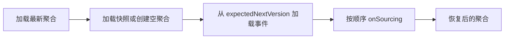

# 快照

快照是从事件历史派生的、带版本的聚合状态检查点。它缩短最新状态的恢复时间；事件流仍是聚合的权威历史。

## 快照不是权威历史

`SnapshotStore` 保存的是可替换副本，不是业务事实。快照缺失、过期或损坏时，应从 `EventStore` 的有序事件流重建；不要修改事件历史来修复快照。历史版本或历史时间的恢复从空聚合开始重放，不能使用晚于目标的最新快照。

## 最新状态加载流程

`EventSourcingStateAggregateRepository` 只在加载最新版本时先读取快照：有快照则将其物化为聚合，再从 `expectedNextVersion` 重放剩余事件；没有快照则创建空聚合并从初始版本重放。

应用代码应依赖 `StateAggregateRepository`，不要自行拼接快照和事件加载逻辑。

## 快照策略

`SnapshotStrategy.onEvent(StateEventExchange<*>)` 决定一个状态事件是否写入快照。`all` 和 `version_offset` 是 Spring Boot 配置值；`NoOp` 是不创建快照的策略实现。

| 策略 | 实现 | 写入行为 |
| --- | --- | --- |
| `all` | `SimpleSnapshotStrategy` | 每个状态事件创建并保存 `SimpleSnapshot` |
| `version_offset` | `VersionOffsetSnapshotStrategy` | 仅当 `stateEvent.version - storedSnapshotVersion >= versionOffset` 时保存；默认 `versionOffset` 为 `5` |
| `NoOp` / no-op | `SnapshotStrategy.NoOp` | 返回空 `Mono`，不写入 |

`version_offset` 未达阈值时会正常完成但不调用 `SnapshotStore.save`。因此策略完成不等于每次命令都产生了新快照。

## SnapshotStore 与单调保存

`SnapshotStore.load` 读取聚合的最新快照，`getVersion` 在不存在时返回未初始化版本，`save` 必须对每个聚合原子地比较并写入。版本更高或相等的候选快照替换已存值；更低版本正常忽略，已存版本不得倒退。

该契约抵御乱序状态事件；它不承诺特定后端的事务、索引、持久性或查询一致性。`InMemorySnapshotStore` 适合测试和单进程开发，不能证明生产存储的持久性或并发行为。

## SNAPSHOT 阶段边界

状态事件进入 `SnapshotDispatcher` 后，`SnapshotFunctionFilter` 调用已配置的策略；快照过滤链完成后，`SnapshotNotifierFilter` 才通知命令等待者 `SNAPSHOT`。

对 `all`，成功的 `SNAPSHOT` 表明该状态事件的保存操作已完成。对 `version_offset`，它只表明策略已完成，可能没有新写入；对 `NoOp` 也不会产生快照。该阶段不证明副本可见、客户端缓存刷新、授权结果或投影完成。

## 恢复优化与成本

快照减少最新加载时需要重放的事件，但增加序列化、写入、索引和存储成本。`all` 适合把单个聚合的当前状态作为常规读模型；`version_offset` 用更少写入交换更多恢复重放和可能的陈旧读。应以真实聚合历史和所选后端测量。

快照可作为默认当前状态读模型；查询的路由、Schema 和后端能力由当前的[快照查询](../query/snapshot-query.md)入口定义。需要跨聚合联接、不同生命周期或 Schema、分析，或对外部系统同步的读模型，应使用投影。

## 何时不需要快照

事件流很短、最新状态很少加载，或所选后端和运行时不需要快照时，可以禁用快照或使用 `NoOp`。不要为不可测量的恢复优化保留额外存储；一旦恢复延迟或重放成本成为证据，再选择合适策略。

## 验证与下一步

为所选 `SnapshotStore` 运行其契约测试，至少验证空加载、未初始化版本、保存后加载、乱序/并发保存后保留最高版本。再以真实工作负载验证恢复延迟、写入量和查询可见性。

下一步：阅读[快照查询](../query/snapshot-query.md)以确定可查询后端、查询模型与 HTTP 合同；仅在读模型确实不同于聚合当前状态时再选择投影。
