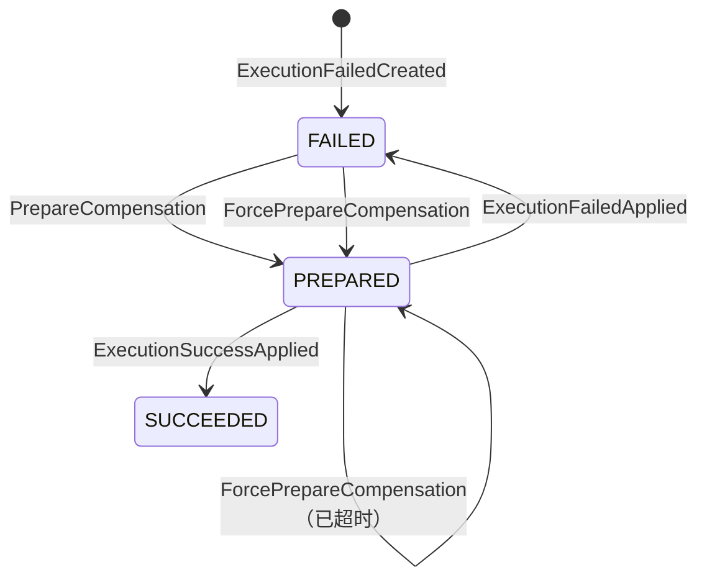
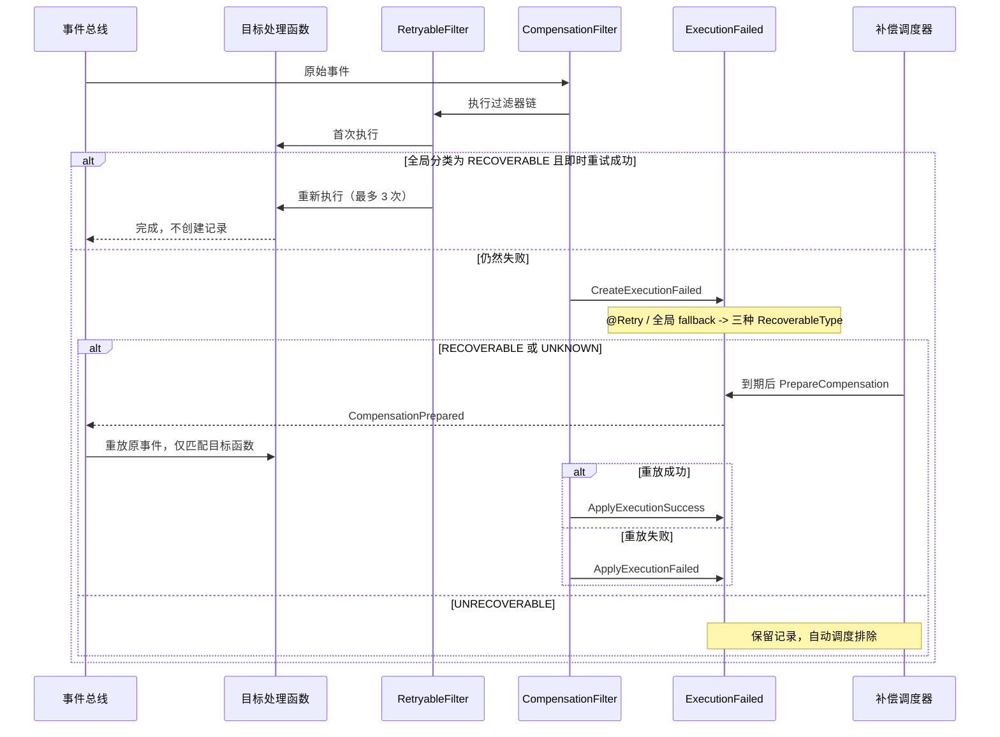

# 事件补偿

Wow 事件补偿记录领域事件或状态事件的**目标处理函数执行失败**，并在稍后重新投递原始事件。它适用于投影、事件处理器、无状态 Saga 和快照等事件处理路径的最终一致性恢复。

:::warning 补偿不是回滚
事件补偿不会回滚数据库、撤销原命令、删除已提交事件，也不会自动生成业务反向操作。它重新执行指定事件处理函数。若原函数会写入外部系统，应用必须保证重复执行安全。
:::

## 用例场景

先区分四个相邻但不同的机制：

| 机制 | 发生时机 | 做什么 | 不做什么 |
| --- | --- | --- | --- |
| Saga 编排 | 收到业务事件后 | 生成下一步或业务补偿命令 | 不保存 `ExecutionFailed` |
| [即时重试](https://github.com/Ahoo-Wang/Wow/blob/main/wow-core/src/main/kotlin/me/ahoo/wow/messaging/handler/RetryableFilter.kt) | 单次事件处理仍在内存中 | 只对全局运行时分类为 `RECOVERABLE` 的错误重新订阅处理链 | 不读取函数 `@Retry` 分类、不跨进程，也不留下持久化调度记录 |
| [持久化事件补偿](https://github.com/Ahoo-Wang/Wow/blob/main/compensation/wow-compensation-core/src/main/kotlin/me/ahoo/wow/compensation/core/CompensationFilter.kt) | 即时重试后仍失败 | 按函数 `@Retry` 或全局 fallback 创建 `ExecutionFailed`，稍后只重放目标函数 | 不回滚原事务 |
| 运营操作 | 自动恢复不合适或已用尽时 | 检查、重新分类、改策略并准备重试 | 不替代业务副作用评审 |

### 五条必须设计的路径

| 路径 | 当前运行时行为 | 应用责任 |
| --- | --- | --- |
| 正常 | 无补偿 ID 的处理成功后直接完成，不创建失败记录 | 定义业务完成条件 |
| 可重试 | 仅全局分类为 `RECOVERABLE` 的异常先即时重试；外层补偿过滤器再按函数 `@Retry` / 全局 fallback 将失败记录分类为三种恢复性之一 | 只有 `RECOVERABLE` / `UNKNOWN` 进入自动调度；选择安全策略并监控耗尽 |
| 不可恢复 | `UNRECOVERABLE` 记录仍会持久化，但不会被自动调度查询选中 | 修复代码/数据，或在值确实变化且操作已授权时用 `MarkRecoverable` 重新分类 |
| 幂等 | 补偿事件携带原事件信息和目标函数标识，只匹配该函数 | 用唯一键、请求 ID 或外部幂等键保护副作用 |
| 人工 | 可修改恢复性、重试规格、目标函数，或准备/强制准备 | 先核实错误、既有副作用、权限和审计要求 |

`UNKNOWN` 会进入自动调度范围；因此异常分类不是装饰信息。`MarkRecoverable` 的领域 guard 只要求新值不同于当前值，之后的普通/强制准备仍受状态、超时和重试上限规则约束。对可能产生重复收费、重复通知或重复写入的函数，不应依赖“通常只执行一次”。

即时与持久化两层分别由 [`RetryableExchangeFilterTest`](https://github.com/Ahoo-Wang/Wow/blob/main/wow-core/src/test/kotlin/me/ahoo/wow/messaging/handler/RetryableExchangeFilterTest.kt) 和 [`CompensationFilterTest`](https://github.com/Ahoo-Wang/Wow/blob/main/compensation/wow-compensation-core/src/test/kotlin/me/ahoo/wow/compensation/core/CompensationFilterTest.kt) 验证。


## 状态图

每个失败执行是一个 `ExecutionFailed` 聚合：


```mermaid
stateDiagram-v2
    [*] --> FAILED: ExecutionFailedCreated
    FAILED --> PREPARED: PrepareCompensation
    FAILED --> PREPARED: ForcePrepareCompensation
    PREPARED --> PREPARED: PrepareCompensation（已超时）
    PREPARED --> PREPARED: ForcePrepareCompensation（已超时）
    PREPARED --> FAILED: ExecutionFailedApplied
    PREPARED --> SUCCEEDED: ExecutionSuccessApplied
```

| 字段 | 含义 |
| --- | --- |
| `status` | `FAILED`、`PREPARED` 或 `SUCCEEDED` |
| `recoverable` | `RECOVERABLE`、`UNKNOWN` 或 `UNRECOVERABLE` |
| `retryState.retries` | 已准备的补偿次数 |
| `retryState.nextRetryAt` | 自动调度可准备下一轮的最早时间 |
| `retryState.timeoutAt` | 当前 `PREPARED` 尝试可视为超时的时间 |
| `isRetryable` | 状态未成功且仍低于重试上限；它本身不包含 `recoverable` 分类 |

[`IExecutionFailedState`](https://github.com/Ahoo-Wang/Wow/blob/main/compensation/wow-compensation-api/src/main/kotlin/me/ahoo/wow/compensation/api/IExecutionFailedState.kt) 的真实 guard 是：普通准备只接受 `FAILED` 或已超时的 `PREPARED`，且必须低于重试上限；强制准备同样只接受 `FAILED` 或已超时的 `PREPARED`，但可越过上限。两者都拒绝 `SUCCEEDED` 和未超时的 `PREPARED`；再次准备会增加 `retries`、产生新的 `CompensationPrepared` 并保持 `PREPARED`。聚合行为与测试见 [`ExecutionFailed`](https://github.com/Ahoo-Wang/Wow/blob/main/compensation/wow-compensation-domain/src/main/kotlin/me/ahoo/wow/compensation/domain/ExecutionFailed.kt) 和 [`ExecutionFailedSpec`](https://github.com/Ahoo-Wang/Wow/blob/main/compensation/wow-compensation-domain/src/test/kotlin/me/ahoo/wow/compensation/domain/ExecutionFailedSpec.kt)。

[自动调度查询](https://github.com/Ahoo-Wang/Wow/blob/main/compensation/wow-compensation-server/src/main/kotlin/me/ahoo/wow/compensation/server/failed/SnapshotFindNextRetry.kt)还附加恢复性与时间条件：只查询 `RECOVERABLE` / `UNKNOWN`、低于重试上限、`nextRetryAt <= now`，并且是 `FAILED` 或已经超时的 `PREPARED` 记录；[`SnapshotFindNextRetryTest`](https://github.com/Ahoo-Wang/Wow/blob/main/compensation/wow-compensation-server/src/test/kotlin/me/ahoo/wow/compensation/server/failed/SnapshotFindNextRetryTest.kt)固定了查询字段契约。


## 执行时序图


```mermaid
sequenceDiagram
    participant EventBus as 事件总线
    participant Handler as 目标处理函数
    participant Immediate as RetryableFilter
    participant Filter as CompensationFilter
    participant Failed as ExecutionFailed
    participant Scheduler as 补偿调度器

    EventBus->>Filter: 原始事件
    Filter->>Immediate: 执行过滤器链
    Immediate->>Handler: 首次执行
    alt 全局分类为 RECOVERABLE 且即时重试成功
        Immediate->>Handler: 重新执行（最多 3 次）
        Handler-->>EventBus: 完成，不创建记录
    else 仍然失败
        Filter->>Failed: CreateExecutionFailed
        Note over Failed: @Retry / 全局 fallback -> 三种 RecoverableType
        alt RECOVERABLE 或 UNKNOWN
            Scheduler->>Failed: 到期后 PrepareCompensation
            Failed-->>EventBus: CompensationPrepared
            EventBus->>Handler: 重放原事件，仅匹配目标函数
            alt 重放成功
                Filter->>Failed: ApplyExecutionSuccess
            else 重放失败
                Filter->>Failed: ApplyExecutionFailed
            end
        else UNRECOVERABLE
            Note over Failed,Scheduler: 保留记录，自动调度排除
        end
    end
```

[`CompensationEventProcessor`](https://github.com/Ahoo-Wang/Wow/blob/main/compensation/wow-compensation-core/src/main/kotlin/me/ahoo/wow/compensation/core/CompensationEventProcessor.kt) 只在原事件聚合属于本地元数据时重放；`EVENT` 通过领域事件总线重投，`STATE_EVENT` 会先重建状态，再投递状态事件。补偿 Header 中的上下文、处理器和函数名保证重放只匹配记录中的目标函数。


## 订阅者服务

订阅方需要补偿核心模块，[Spring Boot 自动配置](https://github.com/Ahoo-Wang/Wow/blob/main/wow-spring-boot-starter/src/main/kotlin/me/ahoo/wow/spring/boot/starter/compensation/CompensationAutoConfiguration.kt)检测到它后默认注册领域事件和状态事件补偿过滤器以及 `CompensationEventProcessor`：

::: code-group
```kotlin [Gradle(Kotlin)]
implementation("me.ahoo.wow:wow-compensation-core")
```
```groovy [Gradle(Groovy)]
implementation 'me.ahoo.wow:wow-compensation-core'
```
```xml [Maven]
<dependency>
    <groupId>me.ahoo.wow</groupId>
    <artifactId>wow-compensation-core</artifactId>
</dependency>
```
:::

配置属性默认 `wow.compensation.enabled=true`，见 [`CompensationProperties`](https://github.com/Ahoo-Wang/Wow/blob/main/wow-spring-boot-starter/src/main/kotlin/me/ahoo/wow/spring/boot/starter/compensation/CompensationProperties.kt)。只在明确接受“不记录事件函数失败、也不支持持久化重放”时关闭：

```yaml
wow:
  compensation:
    enabled: false
```

关闭不会停用 Saga 本身，也不会改变 `RetryableFilter` 的即时重试；它只移除持久化事件补偿能力。

### 自定义重试机制

`@Retry` 是函数级持久化补偿策略：

```kotlin
@Retry(
    maxRetries = 5,
    minBackoff = 60,
    executionTimeout = 10,
    recoverable = [TimeoutException::class],
    unrecoverable = [IllegalArgumentException::class],
)
@OnEvent
fun onOrderCreated(event: DomainEvent<OrderCreated>): CommandBuilder? =
    if (event.body.fromCart) {
        RemoveCartItem(
            productIds = event.body.items.map { it.productId }.toSet(),
        ).commandBuilder().aggregateId(event.ownerId)
    } else {
        null
    }
```

| 参数 | 默认值 | 作用 |
| --- | --- | --- |
| `enabled` | `true` | `false` 时，函数错误不会创建或更新补偿记录 |
| `maxRetries` | `10` | 普通准备允许的最大补偿次数 |
| `minBackoff` | `180` 秒 | 指数退避的基础值 |
| `executionTimeout` | `120` 秒 | `PREPARED` 尝试超时阈值 |
| `recoverable` | 空 | 将匹配异常分类为 `RECOVERABLE` |
| `unrecoverable` | 空 | 将匹配异常分类为 `UNRECOVERABLE` |

持久化退避公式为 `retryAt + minBackoff * 2^retries`。异常列表按可赋值类型匹配；没有函数级匹配时使用运行时全局分类，例如 `RecoverableException` 和 `TimeoutException` 默认为可恢复。参数、分类与边界测试分别见 [`Retry`](https://github.com/Ahoo-Wang/Wow/blob/main/wow-api/src/main/kotlin/me/ahoo/wow/api/annotation/Retry.kt)、[`Throwable.recoverable`](https://github.com/Ahoo-Wang/Wow/blob/main/wow-core/src/main/kotlin/me/ahoo/wow/exception/WowException.kt) 和 [`DefaultNextRetryAtCalculatorTest`](https://github.com/Ahoo-Wang/Wow/blob/main/compensation/wow-compensation-domain/src/test/kotlin/me/ahoo/wow/compensation/domain/DefaultNextRetryAtCalculatorTest.kt)。

:::tip 两层重试
默认 `RetryableFilter` 在当前进程中以 2 秒最小退避对可恢复错误重试 3 次；`@Retry` 的 `maxRetries/minBackoff/executionTimeout` 用于之后的持久化补偿记录。不要用其中一组参数推断另一层。
:::

## 控制台

[补偿服务](https://github.com/Ahoo-Wang/Wow/tree/main/compensation)本身也是 Wow 应用：

| 模块 | 职责 |
| --- | --- |
| `wow-compensation-api` | 命令、事件、状态和查询契约 |
| `wow-compensation-domain` | `ExecutionFailed` 聚合约束和退避计算 |
| `wow-compensation-core` | 失败捕获、结果回写和事件重放 |
| `wow-compensation-server` | 快照查询、分布式调度、OpenAPI、通知和静态 Dashboard |
| `dashboard` | React 运营界面 |

[`SchedulerProperties`](https://github.com/Ahoo-Wang/Wow/blob/main/compensation/wow-compensation-server/src/main/kotlin/me/ahoo/wow/compensation/server/scheduler/SchedulerProperties.kt) 默认启用调度器，每 60 秒运行一次、批量上限 100；[`CompensationScheduler`](https://github.com/Ahoo-Wang/Wow/blob/main/compensation/wow-compensation-server/src/main/kotlin/me/ahoo/wow/compensation/server/scheduler/CompensationScheduler.kt)通过互斥竞争运行。生产环境应根据积压量与处理耗时调整周期和批量，而不是缩短为无界轮询。

### UI

当前 UI 提供以下队列：

- **To Retry**：恢复性为 `RECOVERABLE/UNKNOWN`、仍可重试的活动记录；
- **Executing**：尚未超时的 `PREPARED` 记录；
- **Next Retry**：已经到达 `nextRetryAt` 的自动调度候选；
- **Non Retryable**：已达到普通重试上限的活动记录；
- **Succeeded**：重放成功的历史记录；
- **Unrecoverable**：被分类为不可恢复的活动记录。

列表支持按执行 ID、事件 ID、聚合 ID、聚合上下文/名称、处理器上下文/名称精确筛选。详情页展示错误与堆栈、事件和聚合标识、租户、函数、恢复性、RetrySpec、时间、状态以及可分页的事件流历史。

操作边界：

- **Prepare compensation**：发送普通准备命令；服务端仍校验状态和重试上限。
- **Force prepare**：需二次确认，可以越过重试上限；仍不能处理 `SUCCEEDED` 或未超时的 `PREPARED`。
- **Apply retry spec**：修改非负的 `maxRetries`、`minBackoff`、`executionTimeout`。
- **Mark recoverable**：经确认修改恢复性，直接影响自动调度资格。
- **Change function**：修改上下文、处理器、函数名和 `EVENT/STATE_EVENT` 类型；仅用于确认函数标识已迁移的情况。

当前 UI 不提供删除或恢复已删除聚合的按钮，也没有在仓库中定义运营角色、审批流或审计保留策略。部署方必须在网络、认证、授权和审计层补齐这些控制。队列条件见 [`RetryConditions`](https://github.com/Ahoo-Wang/Wow/blob/main/compensation/dashboard/src/features/Failed/RetryConditions.ts)，操作及其约束见 [`Actions`](https://github.com/Ahoo-Wang/Wow/blob/main/compensation/dashboard/src/features/Failed/Actions.tsx) 和 [`Actions.test`](https://github.com/Ahoo-Wang/Wow/blob/main/compensation/dashboard/src/features/Failed/__tests__/Actions.test.tsx)。


### 通知（企业微信）

配置企业微信群机器人 WebHook 后可订阅补偿事件。[默认集合](https://github.com/Ahoo-Wang/Wow/blob/main/compensation/wow-compensation-server/src/main/kotlin/me/ahoo/wow/compensation/server/webhook/weixin/WeiXinWebHookProperties.kt)为 `execution_failed_created`、`execution_failed_applied`、`execution_success_applied`、`recoverable_marked`：

```yaml
wow:
  compensation:
    host: https://compensation.example.com # 用于通知中的快速导航
    webhook:
      weixin:
        url: ${WEIXIN_WEBHOOK_URL}
        events:
          - execution_failed_created
          - execution_failed_applied
          - execution_success_applied
          - recoverable_marked
```

WebHook URL 是凭据，应通过环境 Secret 注入。通知只能提示状态变化，不能证明业务一致性已经恢复。

| 失败 | 成功 |
| --- | --- |
|  |  |

### OpenAPI

Dashboard 使用生成的 `ExecutionFailedCommandClient`，并在[服务包装层](https://github.com/Ahoo-Wang/Wow/blob/main/compensation/dashboard/src/services/executionFailedCommandClient.ts)显式设置 `basePath: ""`。因此当前默认运营命令路由为：

| 操作 | 路由 |
| --- | --- |
| 普通准备 | `PUT /execution_failed/{id}/prepare_compensation` |
| 强制准备 | `PUT /execution_failed/{id}/force_prepare_compensation` |
| 修改重试规格 | `PUT /execution_failed/{id}/apply_retry_spec` |
| 修改恢复性 | `PUT /execution_failed/{id}/mark_recoverable` |
| 修改目标函数 | `PUT /execution_failed/{id}/change_function` |

[生成端点常量](https://github.com/Ahoo-Wang/Wow/blob/main/compensation/dashboard/src/generated/compensation/execution_failed/commandClient.ts)也以 `/execution_failed/...` 开头，并包含默认聚合删除与恢复路由，但当前 Dashboard 不调用它们。API Gateway 或部署层可以再添加 context 前缀；那是外部路由策略，不是当前 Dashboard 客户端默认值。不要把 API 存在视为已授权的运营流程；这些写操作需要认证、细粒度授权、审计和变更审批。可浏览[补偿服务 OpenAPI](https://wow-compensation.apifox.cn/)；运行实例的 OpenAPI 仍是最终依据。


### 部署 (Kubernetes)

仓库提供 `wow-compensation-server` 宿主和 Dashboard 构建，不提供可直接投产的集群策略。部署至少需要：

1. 从选定 Wow tag 构建并固定不可变镜像摘要；
2. 通过 Secret 注入 MongoDB、Kafka、Redis、通知和认证信息；
3. 为事件与快照存储建立备份、容量和索引策略；
4. 暴露 `/actuator/health` 作为探针，并监控调度积压、失败率和 Pod 重启；
5. 将管理端点放在受保护的运营网络，不直接暴露到公网；
6. 先在测试环境验证正常、可重试、不可恢复、幂等和人工路径，再推广同一镜像。

```yaml
apiVersion: apps/v1
kind: Deployment
metadata:
  name: compensation-service
spec:
  replicas: 2
  selector:
    matchLabels:
      app: compensation-service
  template:
    metadata:
      labels:
        app: compensation-service
    spec:
      containers:
        - name: compensation-service
          image: <registry>/wow-compensation-server@sha256:<digest>
          envFrom:
            - secretRef:
                name: wow-compensation-secrets
          ports:
            - name: http
              containerPort: 8080
          readinessProbe:
            httpGet:
              path: /actuator/health
              port: http
          livenessProbe:
            httpGet:
              path: /actuator/health
              port: http
```

副本数和资源值必须来自容量测试；多个副本依赖调度互斥与消息/存储基础设施，不能仅凭 `replicas: 2` 推断高可用。
