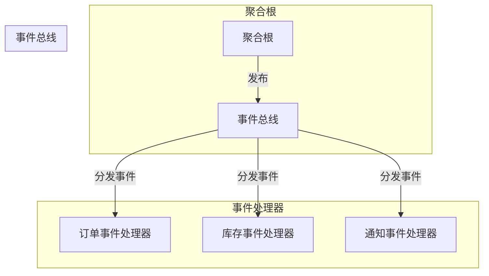
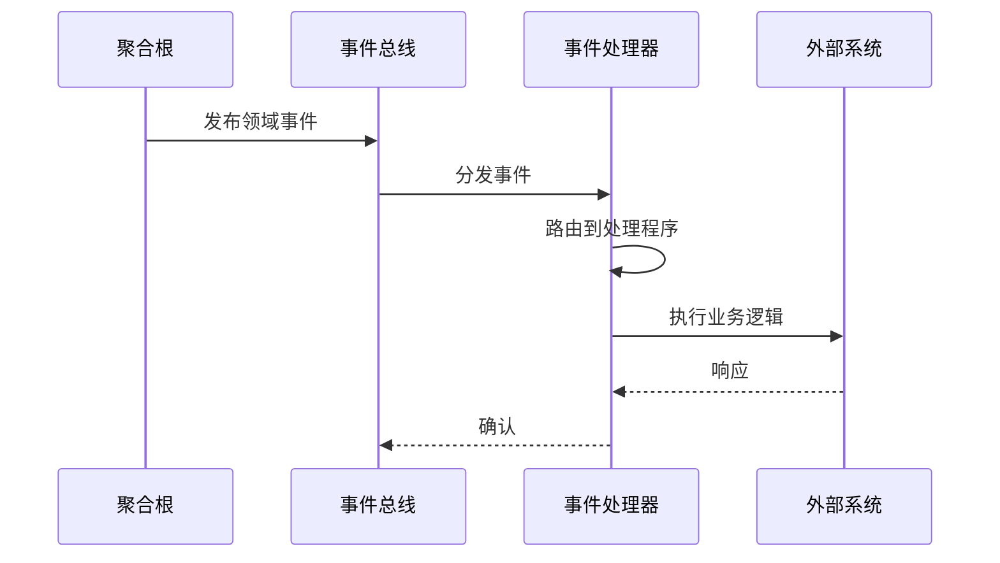

# 事件处理器

*事件处理器*是 Wow 框架中用于处理聚合根发布的领域事件的核心组件。它支持跨聚合操作、读模型更新、通知和外部系统集成。

## 概述

事件处理器订阅领域事件并执行业务逻辑作为响应。它们是事件驱动架构的关键部分，支持聚合之间的松耦合和复杂的业务流程。



## 事件处理器 vs 投影处理器

| 方面 | 事件处理器 | 投影处理器 |
|------|----------|-----------|
| 主要目的 | 处理事件，执行业务逻辑 | 更新读模型 |
| 返回类型 | `Mono<Void>` 或领域事件 | `Mono<Void>` |
| 顺序 | 处理器内保持顺序 | 处理器内保持顺序 |
| 副作用 | 可以发布新的命令/事件 | 通常是只读更新 |
| 用例 | 通知、外部集成 | 查询模型更新 |

## 创建事件处理器

### 基本结构

事件处理器使用 `@EventProcessor` 注解标记，包含使用 `@OnEvent` 注解的方法：

```kotlin
@EventProcessor
class OrderEventProcessor(
    private val inventoryService: InventoryService,
    private val notificationService: NotificationService
) {

    @OnEvent
    fun onOrderCreated(event: OrderCreated): Mono<Void> {
        return inventoryService.reserveItems(event.items)
            .flatMap { reservedItems ->
                notificationService.sendOrderConfirmation(
                    customerId = event.customerId,
                    orderId = event.orderId,
                    items = reservedItems
                )
            }
    }

    @OnEvent
    fun onOrderShipped(event: OrderShipped): Mono<Void> {
        return notificationService.sendShippingNotification(
            customerId = event.customerId,
            orderId = event.orderId,
            trackingNumber = event.trackingNumber
        )
    }
}
```

### 事件处理方法

事件处理方法可以接受不同类型的参数：

```kotlin
@EventProcessor
class OrderEventProcessor {

    // 接受特定的领域事件类型
    @OnEvent
    fun onOrderCreated(event: OrderCreated): Mono<Void> {
        // 处理事件
    }

    // 接受泛型领域事件包装器
    @OnEvent
    fun onEvent(event: DomainEvent<OrderCreated>): Mono<Void> {
        val aggregateId = event.aggregateId
        val eventBody = event.body
        // 处理事件
    }

    // 多个事件类型使用相同处理程序
    @OnEvent
    fun onStatusChanged(event: OrderStatusChanged) {
        // 处理状态变更
    }
}
```

### 按聚合名称过滤

你可以按聚合名称过滤事件：

```kotlin
@EventProcessor
class CartEventProcessor {

    @OnEvent("order")  // 只处理来自 'order' 聚合的事件
    fun onOrderCreated(event: OrderCreated): Mono<Void> {
        // 只处理来自订单聚合的 OrderCreated 事件
    }
}
```

## 事件处理流程



## 反应式事件处理

事件处理器支持反应式编程模式：

```kotlin
@EventProcessor
class OrderEventProcessor(
    private val inventoryService: InventoryService
) {

    @OnEvent
    fun onOrderCreated(event: OrderCreated): Mono<Void> {
        return inventoryService.reserveItems(event.items)
            .doOnSuccess { reserved ->
                log.info("为订单 ${event.orderId} 预留了 ${reserved.size} 个商品")
            }
            .doOnError { error ->
                log.error("为订单 ${event.orderId} 预留商品失败", error)
            }
    }

    @OnEvent
    fun onOrderCancelled(event: OrderCancelled): Mono<Void> {
        return inventoryService.releaseItems(event.items)
            .then()
    }
}
```

## 每个处理器的多个处理程序

单个事件处理器可以处理多种事件类型：

```kotlin
@EventProcessor
class OrderEventProcessor(
    private val inventoryService: InventoryService,
    private val paymentService: PaymentService,
    private val shippingService: ShippingService
) {

    @OnEvent
    fun onOrderCreated(event: OrderCreated): Mono<Void> {
        return inventoryService.reserveItems(event.items)
    }

    @OnEvent
    fun onOrderPaid(event: OrderPaid): Mono<Void> {
        return shippingService.prepareShipment(event.orderId)
    }

    @OnEvent
    fun onOrderShipped(event: OrderShipped): Mono<Void> {
        return notificationService.notifyCustomerShipped(event)
    }

    @OnEvent
    fun onOrderCancelled(event: OrderCancelled): Mono<Void> {
        return inventoryService.releaseItems(event.items)
            .then(paymentService.refund(event.paymentId))
    }
}
```

## 错误处理

### 使用补偿

对于关键的事件处理，结合事件补偿使用：

```kotlin
@EventProcessor
class InventoryEventProcessor(
    private val compensationService: CompensationService
) {

    @Retry(maxRetries = 3, minBackoff = 60)
    @OnEvent
    fun onOrderCreated(event: OrderCreated): Mono<Void> {
        return inventoryService.reserveItems(event.items)
            .doOnError { error ->
                compensationService.recordFailure(event, error)
            }
    }
}
```

### 错误传播

处理失败的事件可以触发错误事件：

```kotlin
@EventProcessor
class OrderEventProcessor {

    @OnEvent
    fun onOrderCreated(event: OrderCreated): Mono<ReserveInventoryFailed> {
        return inventoryService.reserveItems(event.items)
            .switchIfEmpty {
                Mono.error(InventoryUnavailableException(event.items))
            }
    }
}
```

## 最佳实践

### 1. 幂等性

设计事件处理程序时要幂等：

```kotlin
@EventProcessor
class InventoryEventProcessor {

    @OnEvent
    fun onOrderCreated(event: OrderCreated): Mono<Void> {
        // 使用幂等操作
        return inventoryService.upsertReservation(
            orderId = event.orderId,
            items = event.items
        )
    }
}
```

### 2. 顺序保证

对于必须按顺序处理的事件：

```kotlin
@EventProcessor
class OrderWorkflowProcessor {

    @OnEvent("order")  // 过滤到单个聚合类型
    fun onOrderCreated(event: OrderCreated): Mono<Void> {
        // 处理
    }

    @OnEvent("order")
    fun onOrderPaid(event: OrderPaid): Mono<Void> {
        // 这只会在 OrderCreated 之后调用
    }
}
```

### 3. 性能考虑

- 对非阻塞操作使用反应式类型
- 可能时批量操作
- 监控事件处理延迟

```kotlin
@EventProcessor
class AnalyticsEventProcessor(
    private val batchProcessor: BatchAnalyticsProcessor
) {

    private val buffer = mutableListOf<OrderCreated>()

    @OnEvent
    fun onOrderCreated(event: OrderCreated): Mono<Void> {
        synchronized(buffer) {
            buffer.add(event)
            if (buffer.size >= 100) {
                val batch = buffer.toList()
                buffer.clear()
                return batchProcessor.processBatch(batch)
            }
        }
        return Mono.empty()
    }
}
```

### 4. 测试

```kotlin
class OrderEventProcessorSpec : EventProcessorSpec<OrderEventProcessor>({
    on {
        val event = mockk<OrderCreated> {
            every { orderId } returns "order-001"
            every { customerId } returns "customer-001"
            every { items } returns listOf(
                OrderItem(productId = "prod-001", quantity = 2)
            )
        }
        whenEvent(event) {
            expectNoError()
            expectNext Void::class.java
        }
    }
})
```

## 配置

事件处理器通过 Spring 组件扫描自动发现和注册，无需额外配置。

## 相关主题

- [投影处理器](./projection) - 用于读模型更新
- [Saga](./saga) - 用于分布式事务协调
- [事件总线](./eventstore#事件总线) - 用于事件发布和路由
- [事件补偿](./event-compensation) - 用于错误处理和恢复
